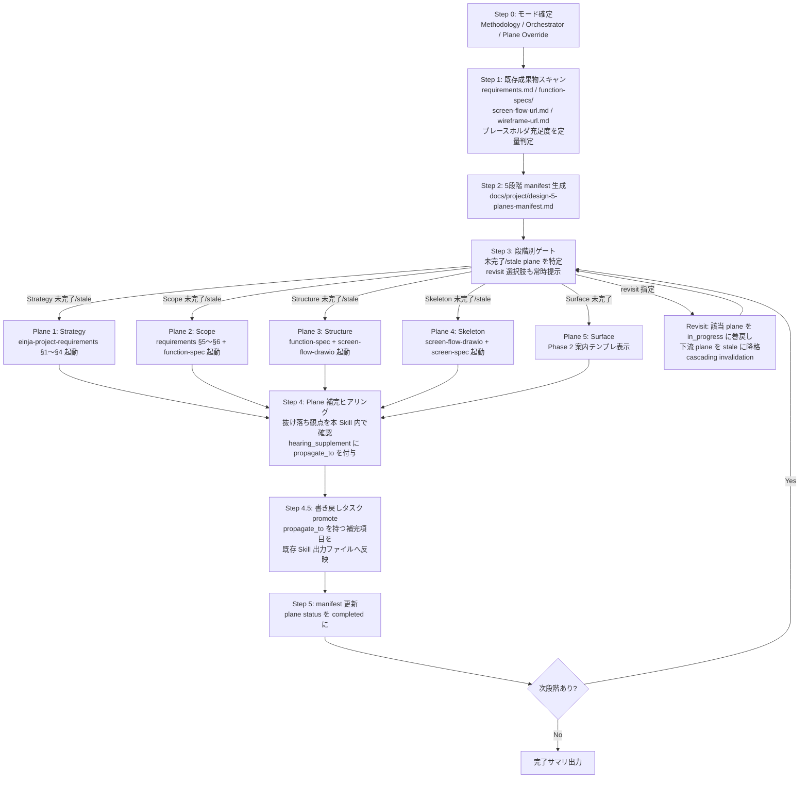

<!-- 方法論 SSoT: references/5-planes-overview.md -->
<!-- ヒアリング項目: references/hearing-by-plane.md -->
<!-- Skill マッピング・呼出テンプレ: references/skill-mapping.md -->

# einja-design-5-planes: goodpatch 5 段階モデル横断オーケストレーター

## 1. このSkillはいつ起動するか

goodpatch の「デザインの 5 段階モデル」（Jesse James Garrett 原典を goodpatch が再解釈）を軸に、**プロジェクト全体の設計活動を俯瞰して進める**場面で起動する。

### 3 つの動作モード

| モード | トリガー例 | 動作 |
|--------|-----------|------|
| **Methodology** | 「5段階モデル教えて」「Strategy 段階の問いだけ見たい」 | `references/5-planes-overview.md` を提示するのみ。既存 Skill は呼ばない |
| **Orchestrator** | 「5段階通しでプロジェクト立ち上げ」「Strategy から Skeleton まで全部やって」 | 各段階ゲート → 既存 Skill 呼出指示 → 補完ヒアリング → 完了判定 → 次段階、を繰り返す |
| **Plane Override** | 「Skeleton だけやり直したい」「Structure を再実行して」 | 特定 plane の入口判定 → 該当 Skill のみ呼出指示 → 完了サマリ（中間 plane は触らない短絡経路） |

### 典型ユースケース

- 受託案件でプロジェクト立ち上げ時に Strategy〜Skeleton を順番に整備したい
- 要件変更があり Scope を更新したので、Structure〜Skeleton を stale 状態から再実行したい
- 今どの段階が完了していて、次は何をすべきか俯瞰で把握したい
- 既存 Skill ではカバーしきれていないヒアリング項目（ペルソナ詳細 / モバイル制約等）を補完したい

Do NOT use for: Issue 単位の要件/UI 仕様（→ `einja-issue-spec-create` / `ui-design-generator`）、Surface 段階の hi-fi デザイン（→ `einja-pencil-design-manager`）、Skill 設計計画（→ `einja-skill-plan-guide`）。

## 2. 前提・事前準備

| 項目 | 内容 |
|------|------|
| 入力ファイル 1 | `docs/project/requirements.md`（`einja-project-requirements` の出力） |
| 入力ファイル 2 | `docs/project/function-specs/`（`einja-project-function-spec` の出力） |
| 入力ファイル 3 | `docs/project/screen-flow-url.md`（`einja-project-screen-flow-drawio` の出力） |
| 入力ファイル 4 | `docs/project/wireframe-url.md`（`einja-project-screen-spec` の出力） |
| 入力ファイル 5 | `docs/project/design-5-planes-manifest.md`（本 Skill が生成・更新する manifest） |
| 方法論 SSoT | `references/5-planes-overview.md` — 5 段階モデル定義・goodpatch 拡張・用語統一表 |
| ヒアリング補完 | `references/hearing-by-plane.md` — 各段階補完ヒアリング項目 + 重複回避マトリクス |
| Skill 呼出規約 | `references/skill-mapping.md` — 既存 Skill マッピング + 呼出指示プロンプトテンプレ |

**入力ファイルがない場合**: 各ファイルの不在は当該 plane の `status: pending` として扱う（Orchestrator モード）。Plane Override モードでは対象 plane の前提ファイルが不在の場合にその旨をユーザーへ通知し確認を取る。

## 3. ワークフロー全体図



**Plane Override モード時の短絡経路**: Step 0 で Plane Override を選択 → AskUserQuestion で対象 plane を選ぶ → Step 1 で該当 plane の前提ファイルのみスキャン → Step 3 ゲートで指定 plane に直接ジャンプ → Plane X → Step 4 / 4.5 / 5 → 完了サマリ。中間 plane は触らない。

## 4. メインワークフロー

### Step 0: モード確定

AskUserQuestion で 3 モードを提示する。各選択肢は description（What）+ Note（So What）の 2 層構成とし、必ず「その他（自由入力）」を最後の選択肢として含める。

| 選択肢 | description | Note |
|--------|-------------|------|
| Methodology | 5 段階モデルの方法論・定義・段階間依存を参照する | 既存 Skill は起動しない。学習・確認目的に適する |
| Orchestrator（推奨） | Strategy〜Surface の全段階（または未完了段階）を順番に実行する | Step 0 で「全段階通しの一括承認」を 1 回取得。各 Plane 開始時はメッセージ確認のみ（AskUserQuestion 多重発生を回避） |
| Plane Override | 特定の 1 段階だけを再実行・やり直す | 中間 plane に影響せず、指定 plane のみ実行。cascading invalidation を手動適用するか確認する |
| その他（自由入力） | 上記以外の目的を自由入力で伝える | 入力内容に応じて最適なモードを提案する |

**Orchestrator モード選択時**: 「全段階（未完了段階）を通しで実行します。途中の Plane ではメッセージ確認のみとし、AskUserQuestion による追加承認は Step 4 の補完ヒアリング以外発生しません。よろしいですか？」を確認する（1 回のみ）。

**Plane Override モード選択時**: 対象 plane を AskUserQuestion で確認する（Strategy / Scope / Structure / Skeleton / Surface + 自由入力）。

### Step 1: 既存成果物スキャン

4 つの入力ファイルと manifest の存在・プレースホルダ充足度をスキャンする。

**充足判定基準（定量）**:
- 各ファイルで `PLACEHOLDER_` または `<TODO>` 等の未充足マーカーが **0 件**
- 必須セクション見出しが **全件存在**
- 両条件を満たす場合のみ「充足」と判定する

スキャン対象と充足判定の対応:

| plane | 充足判定対象ファイル | 主要チェックセクション |
|-------|-------------------|----------------------|
| Strategy | `docs/project/requirements.md` | §1 プロジェクト概要 / §2 対象業務 / §3 対象ユーザー・ステークホルダー / §4 システム化方針 |
| Scope | `docs/project/requirements.md` + `docs/project/function-specs/` | §5 スコープ境界 + §6 機能要件サマリ + function-spec 配下ファイル群 |
| Structure | `docs/project/function-specs/` + `docs/project/screen-flow-url.md` | function-spec + screen-flow-url の `status: confirmed` |
| Skeleton | `docs/project/screen-flow-url.md` + `docs/project/wireframe-url.md` | wireframe-url の `status: confirmed` |
| Surface | （Phase 2 未提供）| 常に `status: pending` |

**manifest 不在時**: 4 入力ファイルのスキャン結果から各 plane の充足状態を推定し、Step 2 で manifest を新規作成する。

**Plane Override モード時**: 指定 plane の前提ファイルのみをスキャンし、他 plane はスキップする。

### Step 2: 5 段階 manifest 生成

`docs/project/design-5-planes-manifest.md` を確認し、存在する場合は `Edit` で更新、存在しない場合は `Write` で新規作成する。

スキャン結果に基づき各 plane の `status` を設定する:
- スキャン充足 → `completed`（ただし `hearing_supplement` の未充足項目があれば `in_progress` のまま）
- スキャン未充足 → `pending`（または既存 manifest で `stale` の場合はそのまま保持）

manifest の詳細スキーマは「5. manifest スキーマ」セクションを参照。

### Step 3: 段階別ゲート

manifest の各 plane `status` を評価し、実行すべき plane を特定する。

**判定ロジック**:
1. `pending` / `stale` / `in_progress` の plane を未完了として抽出する
2. Orchestrator モードでは `strategy → scope → structure → skeleton → surface` の順で、最初の未完了 plane から開始する
3. Plane Override モードでは Step 0 で指定した plane に直接ジャンプする

**revisit 要求の処理**:
- AskUserQuestion の選択肢に「完了済み plane を再実行（revisit）する」を常時含める
- revisit が選ばれた場合:
  1. 対象 plane の `status` を `revisiting` に変更する
  2. **cascading invalidation**: 対象 plane より下流の plane を `stale` に自動降格する（例: Structure を revisit → Skeleton・Surface が stale に）
  3. manifest を更新してから対象 Plane X の処理へ進む

**二重起動防止**: `status: completed` の plane は再起動時に skip する。ユーザーから「再実行？」を確認する承認ゲートを設ける。

### Plane X: 既存 Skill 呼出指示

**重要**: 本 Skill は子 Skill を直接起動しない。本 Skill の instructions は **親エージェントに対し「次は Skill tool で `einja-project-XXX` をロードして、指示プロンプト Y で起動してください」と明示指示**する形で書く。

各 plane で親エージェントへ以下を伝える:

| Plane | 呼出指示 |
|-------|---------|
| Plane 1 (Strategy) | 「Skill tool で `einja-project-requirements` をロードし、§1〜§4（プロジェクト概要 / 対象業務 / 対象ユーザー・ステークホルダー / システム化方針）の範囲で実行してください。完了後、本 Skill に戻り manifest を更新します。」詳細指示プロンプトは `references/skill-mapping.md §Plane1` 参照 |
| Plane 2 (Scope) | 「Skill tool で `einja-project-requirements` を §5（スコープ境界）と §6（機能要件サマリ）、続いて `einja-project-function-spec` をロードして実行してください。完了後、本 Skill に戻り manifest を更新します。」詳細は `references/skill-mapping.md §Plane2` 参照 |
| Plane 3 (Structure) | 「Skill tool で `einja-project-function-spec` を確認後、`einja-project-screen-flow-drawio` をロードして実行してください。完了後、本 Skill に戻り manifest を更新します。」詳細は `references/skill-mapping.md §Plane3` 参照 |
| Plane 4 (Skeleton) | 「Skill tool で `einja-project-screen-flow-drawio` の出力を確認後、`einja-project-screen-spec` をロードして実行してください。完了後、本 Skill に戻り manifest を更新します。」詳細は `references/skill-mapping.md §Plane4` 参照 |
| Plane 5 (Surface) | Phase 2 案内テンプレを表示する（`references/skill-mapping.md §Plane5` 参照）。既存 Skill 呼出は行わない |

**Orchestrator モード時**: Step 0 で取得した一括承認に基づき、各 Plane 開始時は確認メッセージのみ表示する（AskUserQuestion は呼ばない）。

**Plane Override モード時**: 単独 plane に対して承認確認を行い、実行する。

### Step 4: Plane 補完ヒアリング

既存 Skill 完了報告を受けた後、本 Skill 内で補完ヒアリングを実施する。

**補完ヒアリングの対象**: 既存 Skill でカバーされていない観点のみを確認する。重複回避マトリクスは `references/hearing-by-plane.md §重複回避マトリクス` を参照。

**AskUserQuestion の構成規則**:
- description（What）+ Note（So What）の 2 層構成
- 必ず「その他（自由入力）」を最後の選択肢として含める
- 充足済みの項目はスキップする（重複回避マトリクスで判定）

**回答の記録**: 各補完項目の回答には `propagate_to:` を付与する。

例: 「モバイル/アクセシビリティ制約」の回答 → `propagate_to: "docs/project/requirements.md §7"`

詳細な補完項目テンプレは `references/hearing-by-plane.md` の各 plane セクションを参照。

### Step 4.5: 書き戻しタスク promote

`propagate_to:` を持つ補完項目を、対応する既存 Skill 出力ファイルに親エージェントが `Edit` で反映するタスクとして提示する。

**処理の流れ**:
1. `hearing_supplement` から `propagate_to` フィールドを持つ項目を抽出する
2. 各項目について「[対象ファイル] の [対象セクション] に [値] を追記する」タスクを親エージェントへ提示する
3. 親エージェントが `Edit` で反映したことを確認する
4. 反映完了後、manifest の当該項目に `propagated_at: <ISO8601>` を記録する

**重要**: 本 Skill は既存 Skill 出力ファイルを直接 `Edit` しない。親エージェントへタスクとして提示し、親エージェントが実施する。書き戻し不要の純粋メタ情報（方法論的注釈等）のみ manifest の `hearing_supplement` に残す。

### Step 5: manifest 更新

既存 Skill 完了報告の受領 + Step 4.5 書き戻し完了を確認した直後に、manifest の当該 plane を更新する。

**更新内容**:
- `status: completed` に変更する
- `completed_at: <ISO8601>` を記録する
- `completion_criteria.placeholder_unfilled: 0` / `completion_criteria.required_sections_present: true` を記録する
- `hearing_supplement` の `propagated_at` を記録する（Step 4.5 で完了した項目）

**タイミング**: このステップは既存 Skill 完了報告直後に実行する。SKILL.md にこの引き継ぎ宣言を必須化する（他の Plane や Step と混同しない）。

**部分完了時の扱い**: `hearing_supplement` で `propagated_at: null` の項目が残っている場合、当該 plane の `status` は `in_progress` のまま据え置き、ユーザー再開時に再度 promote を試行する。

### Step 6: 次段階判定

manifest を確認し、次に実行すべき plane を判定する。

- **Orchestrator モード**: 未完了 plane が残っている場合 → Step 3 へ戻る。全 plane 完了（または skipped）の場合 → 完了サマリ出力
- **Plane Override モード**: 単一 plane 完了で即終了 → 完了サマリ出力

## 5. manifest スキーマ

**パス**: `docs/project/design-5-planes-manifest.md`

### YAML サンプル

```yaml
---
project_name: <project>
schema_version: 1
generated_at: <ISO8601>
mode: orchestrator | methodology | plane-override
planes:
  - name: Strategy
    status: pending | in_progress | completed | stale | revisiting | skipped
    started_at: <ISO8601>
    completed_at: <ISO8601>
    revisited_at: <ISO8601 or null>  # revisiting 状態に遷移した日時
    source_files:
      - docs/project/requirements.md
    completion_criteria:
      # 完了判定基準（定量、Step 1 のスキャン結果と連動）
      placeholder_unfilled: 0   # PLACEHOLDER_ / <TODO> マーカー残数
      required_sections_present: true
    hearing_supplement:
      # 各補完項目は値 + 書き戻し先（propagate_to）の構造
      "モバイル/アクセシビリティ制約":
        value: "WCAG AA / iOS 17+ / Android 14+"
        propagate_to: "docs/project/requirements.md §7"
        propagated_at: <ISO8601 or null>  # 書き戻し完了日時
  - name: Scope
    status: pending
    started_at: null
    completed_at: null
    revisited_at: null
    source_files:
      - docs/project/requirements.md
      - docs/project/function-specs/
    completion_criteria:
      placeholder_unfilled: 0
      required_sections_present: true
    hearing_supplement: {}
  - name: Structure
    status: pending
    started_at: null
    completed_at: null
    revisited_at: null
    source_files:
      - docs/project/function-specs/
      - docs/project/screen-flow-url.md
    completion_criteria:
      placeholder_unfilled: 0
      required_sections_present: true
    hearing_supplement: {}
  - name: Skeleton
    status: pending
    started_at: null
    completed_at: null
    revisited_at: null
    source_files:
      - docs/project/screen-flow-url.md
      - docs/project/wireframe-url.md
    completion_criteria:
      placeholder_unfilled: 0
      required_sections_present: true
    hearing_supplement: {}
  - name: Surface
    status: pending
    started_at: null
    completed_at: null
    revisited_at: null
    source_files: []
    completion_criteria:
      placeholder_unfilled: 0
      required_sections_present: false  # Phase 2 未提供のため false
    hearing_supplement: {}
---
```

### ステータス遷移ルール

| 遷移 | トリガー |
|------|---------|
| `pending → in_progress` | Plane X 開始時（既存 Skill 呼出指示直前）|
| `in_progress → completed` | Plane X 完了報告受領 + Step 4.5 書き戻し完了 |
| `completed → revisiting` | Step 3 でユーザーが revisit 要求 |
| `revisiting → in_progress` | 再実行の Plane X 開始時 |
| `revisiting / completed → stale` | 上流 plane の revisit による cascading invalidation |
| `stale → in_progress` | 下流 plane の再実行開始時 |

**cascading invalidation ルール**: 上流 plane を `revisiting` に変更した際、下位のすべての plane を自動的に `stale` に降格する。例: Structure を revisit → Skeleton + Surface が `stale` に。

### YAML キー引用規則

`hearing_supplement` の補完項目キーに日本語・スペース・記号（`/` 等）が含まれる場合は**必ずダブルクォートで囲む**。

正しい例:
```yaml
hearing_supplement:
  "モバイル/アクセシビリティ制約":
    value: "WCAG AA / iOS 17+"
    propagate_to: "docs/project/requirements.md §7"
    propagated_at: null
```

誤った例（クォートなし):
```yaml
hearing_supplement:
  モバイル/アクセシビリティ制約:  # NG: / が YAML 構文として誤解される
```

詳細な YAML サンプル（`propagate_to` パターン集）は `references/skill-mapping.md` に収録。

## 6. Skill チェーン実装規約

### 「Skill tool は実行ではなく Read」原則

本 Skill instructions が親エージェントに対して子 Skill を呼び出させる際は、以下の形式で指示する:

```
「Skill tool で `einja-project-XXX` をロードして、以下の指示プロンプトで起動してください:
<指示プロンプト>
```

**禁止**: 本 Skill の SKILL.md 内で「本 Skill が X を呼ぶ」「本 Skill が X を起動する」という記述。これは誤読を生む。本 Skill は子 Skill の SKILL.md を親エージェントが **読む（Read）** よう指示するのみであり、Skill ツールを自身で呼び出すことはない。

### 承認ゲート最適化

**Orchestrator モード**:
- Step 0 で「全段階通し」の一括承認を 1 回取得する
- 各 Plane 開始時は確認メッセージのみ表示する（例: 「Plane 2 (Scope) を開始します。`einja-project-requirements §5〜§6` と `einja-project-function-spec` を呼び出します。」）
- AskUserQuestion は Step 4（補完ヒアリング）のみで使用する

**Plane Override モード**:
- Step 0 で対象 plane の単独承認を取得する
- 対象 plane の Step 4（補完ヒアリング）で AskUserQuestion を使用する

### manifest 更新タイミングの厳守

既存 Skill 完了報告を受けた直後（Step 5）に manifest を更新する。これはタスクの引き継ぎを明示するために必須である。更新タイミングが曖昧になると manifest と実態の乖離が生じる。

## 7. 各 plane の補完ヒアリング呼び出し規約

各 plane の補完ヒアリング項目・AskUserQuestion テンプレ・重複回避マトリクスは `references/hearing-by-plane.md` に集約している。

| plane | 主な補完観点（抜け落ち例） | `propagate_to` 先 |
|-------|--------------------------|------------------|
| Strategy | 利用コンテキスト（誰がどの状況で使うか） | `requirements.md §3.1` または manifest 内のみ |
| Scope | MUST 画面スコープの優先度確定 | `requirements.md §6` |
| Structure | ペルソナ詳細（詳細ユーザー属性） | `requirements.md §3.1` |
| Skeleton | モバイル/アクセシビリティ制約 | `requirements.md §7` |
| Surface | （Phase 2 送り）| — |

**補完ヒアリングの原則**:
1. 既存 Skill 出力ファイルで充足済みの項目はスキップする（重複確認禁止）
2. 本 Skill 固有の補完観点のみを AskUserQuestion で確認する
3. 重複回避の判定は `references/hearing-by-plane.md §重複回避マトリクス` のルールに従う

## 8. 既存 Skill 呼び出し規約

### マッピング概要

| plane | 段階 | 主な問い | 呼出 Skill |
|-------|------|---------|-----------|
| Plane 1 | Strategy / 戦略 | なぜ作るか（プロジェクト概要 / 対象業務 / 対象ユーザー / システム化方針） | `einja-project-requirements §1〜§4` |
| Plane 2 | Scope / 要件 | 何を作るか（スコープ境界 / 機能要件サマリ / 優先順位） | `einja-project-requirements §5〜§6` + `einja-project-function-spec` |
| Plane 3 | Structure / 構造 | どう繋ぐか（IA / OOUI / ナビ） | `einja-project-function-spec` + `einja-project-screen-flow-drawio` |
| Plane 4 | Skeleton / 骨格 | どこに置くか（WF / レイアウト） | `einja-project-screen-flow-drawio` + `einja-project-screen-spec` |
| Plane 5 | Surface / 表層 | どう見せるか（VI / 色 / タイポ） | 未対応（Phase 2 送り） |

各 plane の詳細な指示プロンプトテンプレは `references/skill-mapping.md` を参照。既存 Skill の SKILL.md に記載された挙動の範囲を超える指示プロンプトは禁止する（既存 Skill の挙動保証のため）。

### 接続規約

| 項目 | 方針 |
|------|------|
| 既存 4 Skill の変更 | **変更しない**（参照のみ）|
| 起動方法 | 親エージェントが Skill tool で SKILL.md をロード → 指示プロンプトで起動 |
| 抜け落ち観点の補完 | 本 Skill Step 4（Plane 補完ヒアリング）で吸収。既存 Skill のヒアリング項目は変更しない |
| 完了マークの保持 | `design-5-planes-manifest.md` を SSoT として持つ |
| 既存成果物の検出 | manifest 不在時は 4 入力ファイルの充足度から推定（Step 1）|
| 二重起動防止 | manifest の `status: completed` の plane は再起動時に skip（revisit 確認ゲートを設ける）|
| 既存 4 Skill SKILL.md への上流 Skill コメント追記 | **Phase 2 送り**（本 Plan 対象外）|

## 9. エラーケース

| ID | 事象 | 一次対処 |
|----|------|---------|
| E1 | 入力ファイル不足（必須 plane 前提ファイルが不在） | 当該 plane を `status: pending` として manifest に記録する。Plane Override モードで前提ファイルが不在の場合はユーザーへ通知し「前提 Skill を先に実行しますか？」を確認する |
| E2 | manifest 破損（YAML 構文エラー / スキーマ不整合） | `Read` で内容を確認し、エラー箇所をユーザーへ報告する。修正手順（`Edit` またはバックアップから復元）を提示する。修正不能な場合はバックアップ（`.manifest.bak`）から復元するか、manifest を新規生成するかを AskUserQuestion で確認する |
| E3 | 呼出先 Skill が不在（SKILL.md が見つからない） | 対応 Skill の配置パスを確認しユーザーへ報告する。「軽量モード（Skill なしで方法論ガイドとして進める）」への切り替えを提案する（詳細は `references/skill-mapping.md §軽量モード`） |
| E4 | Plane Override の対象 plane が不正（指定なし / 存在しない plane 名） | AskUserQuestion で有効な plane 一覧（Strategy / Scope / Structure / Skeleton / Surface）を再提示する。自由入力で誤った文字列が入力された場合は候補をサジェストする |

**E5: 書き戻し promote 失敗**

親エージェントが Step 4.5 で既存 Skill 出力ファイルへの `Edit` を拒否した、または `Edit` 中にエラーが発生した場合:
- 該当補完項目の `propagated_at` は `null` のまま保持
- manifest の `hearing_supplement` に `pending_propagation: true` フラグを設定
- 完了サマリでユーザーに通知し、手動補完を促す

## 10. 完了サマリ出力フォーマット

全 plane の処理が完了（または Plane Override モードで単一 plane が完了）した際に、以下のフォーマットで完了サマリを出力する。

```markdown
## einja-design-5-planes 完了サマリ

### 実行モード: [Orchestrator / Plane Override / Methodology]

### 5 段階実行結果

| plane | 段階 | status | 呼出 Skill |
|-------|------|--------|-----------|
| Plane 1 | Strategy | [completed / skipped / pending] | einja-project-requirements §1〜§4 |
| Plane 2 | Scope | [completed / skipped / pending] | requirements §5〜§6 + function-spec |
| Plane 3 | Structure | [completed / skipped / pending] | function-spec + screen-flow-drawio |
| Plane 4 | Skeleton | [completed / skipped / pending] | screen-flow-drawio + screen-spec |
| Plane 5 | Surface | [skipped (Phase 2)] | — |

### 補完ヒアリング結果

| plane | 補完項目 | 書き戻し先 | 書き戻し状態 |
|-------|---------|----------|------------|
| [plane] | [項目名] | [propagate_to] | [完了 / 未実施] |

### 生成・更新ファイル

- `docs/project/design-5-planes-manifest.md`: manifest 更新
- [書き戻しが発生したファイルを列挙]

### manifest パス

`docs/project/design-5-planes-manifest.md`

### 次のステップ

[未完了 plane がある場合はその案内]
[Surface (Phase 2) 案内が必要な場合はその内容]
```

## 11. 関連リソース

### 本 Skill の references ファイル

| ファイル | 内容 |
|---------|------|
| `references/5-planes-overview.md` | 5 段階モデル定義・goodpatch 独自拡張・Garrett 原典との差分・用語統一表・段階間依存関係 |
| `references/hearing-by-plane.md` | 各段階の補完ヒアリング項目・重複回避マトリクス・AskUserQuestion テンプレ |
| `references/skill-mapping.md` | 既存 Skill マッピング表・呼出指示プロンプトテンプレ・軽量モード・Surface Phase 2 案内テンプレ |

### 連携する既存 4 Skill

| Skill | 担当 plane | SKILL.md パス |
|-------|-----------|--------------|
| `einja-project-requirements` | Strategy / Scope | `.claude/skills/einja-project-requirements/SKILL.md` |
| `einja-project-function-spec` | Scope / Structure | `.claude/skills/einja-project-function-spec/SKILL.md` |
| `einja-project-screen-flow-drawio` | Structure / Skeleton | `.claude/skills/einja-project-screen-flow-drawio/SKILL.md` |
| `einja-project-screen-spec` | Skeleton | `.claude/skills/einja-project-screen-spec/SKILL.md` |

### 参照 steering docs

- `docs/einja/steering/development/figma-design-management.md` — Figma planKey 既定値・命名規則
- `docs/einja/steering/commit-rules.md` — コミットルール（einja-task-commit で参照）

## Phase 2 送り項目

本 Skill の初期実装（Phase 1）対象外で、後続フェーズ（Phase 2）に送られた項目は以下のとおり:

- 既存 4 Skill SKILL.md への上流 Skill コメント追記
- 実機 dry-run（実プロジェクトで Orchestrator モード動作確認）
- Surface 段階専用 Skill 化（einja-project-design-system 案）
- Plane 5 案内テンプレの自動 hi-fi 連携
- goodpatch ブログ URL 実在確認

<!-- @einja:project-private:start id="einja-design-5-planes-project" -->
<!-- プロジェクト固有の情報を記入 -->
<!-- @einja:project-private:end -->
