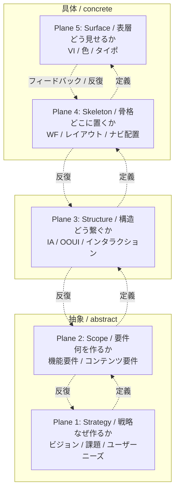

# 5 段階モデル概要（goodpatch 解釈ベース）

本ドキュメントは `einja-design-5-planes` Skill の方法論 SSoT。Jesse James Garrett 原典『The Elements of User Experience』を goodpatch が再解釈した「デザインの 5 段階モデル」を、本 Skill 内で運用する形に整理する。

## §1. 5 段階モデル概要図

5 段階は下位（抽象）から上位（具体）へ積み上がる階層構造を持つが、線形プロセスではなく**反復・行き来を前提**とする。上位 plane の変更は下位 plane に影響を及ぼす（cascading invalidation）。



**読み方**:
- 実線（→）は論理的依存（上位 plane なしに下位 plane は確定できない）
- 点線（-.->）は反復ループ（下位 plane で得た知見が上位 plane を修正することがある）
- goodpatch 解釈では Garrett 原典の Software/Hypertext 二分（Web 特有の 2 軸構造）を削除し、汎用化された 1 軸として扱う

## §2. 用語統一表

本 Skill 内で発生する表記揺れを抑えるため、以下の対応で統一する。

| 英語名（Garrett 原典） | goodpatch 日本語名 | 本 Skill 内表記 | 短縮形 |
|---|---|---|---|
| Strategy | 戦略 | Plane 1: Strategy / 戦略 | Plane 1 |
| Scope | 要件 | Plane 2: Scope / 要件 | Plane 2 |
| Structure | 構造 | Plane 3: Structure / 構造 | Plane 3 |
| Skeleton | 骨格 | Plane 4: Skeleton / 骨格 | Plane 4 |
| Surface | 表層 | Plane 5: Surface / 表層 | Plane 5 |

**表記規約**:
- 英語名と日本語名は併記を原則とする（例: 「Strategy / 戦略段階」）。文脈上明らかな場合は片方のみで可
- manifest YAML 内の `name` フィールドは英語名のみ（`Strategy` / `Scope` / `Structure` / `Skeleton` / `Surface`）
- mermaid 図のラベルは「Plane N: 英語名 / 日本語名」形式
- 単独で「段階」と呼ぶ場合は plane の同義語として扱う
- 「層」「レイヤー」表記は Garrett 原典のレイヤーケーキ図文脈以外では使用しない（plane に統一）

## §3. 各段階の定義

各 plane について、目的 / 主な問い / 主な成果物 / 検討内容 / 注意点を整理する。問いは goodpatch ブログ由来の代表項目を中心に列挙する。

### §3.1 Plane 1: Strategy / 戦略

**目的（goodpatch 表現）**:
プロダクトを通じて「なぜ作るのか」「誰の何を解決するのか」を定義し、提供者側のビジネス目標とユーザー側のニーズの交点を確定する段階。後続全 plane の判断基準となる土台。

**主な問い（5〜8 問）**:
1. このプロダクトを通じて自分たちは何を得たいか（ビジネス目標）
2. ユーザーはこのプロダクトから何を得たいか（ユーザーニーズ）
3. ターゲットユーザーは誰か（ペルソナ / セグメント）
4. ユーザーはどのような状況・コンテキストでこれを使うか
5. 既存の代替手段（競合 / 自社内）と比較してどう差別化するか
6. 成功の指標（KGI / KPI）は何か
7. 短期と長期の事業ゴールは何か
8. 実現に必要な前提条件・制約（予算 / 期間 / 規制等）は何か

**主な成果物**:
- プロダクトビジョン文書
- ペルソナ / セグメント定義
- ビジネス目標 / KPI
- ユーザーニーズ整理
- 競合 / ポジショニング分析

**検討内容**:
- ユーザーリサーチ（インタビュー / アンケート / 既存データ分析）
- ステークホルダー合意形成
- ビジネスモデル / 収益構造の確認
- リスクと前提条件の洗い出し

**注意点**:
- ここで決めた戦略は全 plane の判断基準になるため、曖昧なまま下位 plane に進むと cascading invalidation が頻発する
- ペルソナと利用コンテキストはセットで定義する（誰が、どんな状況で）
- ビジネス目標とユーザーニーズが乖離している場合、本 plane で解消するか前提を再確認すること

### §3.2 Plane 2: Scope / 要件

**目的（goodpatch 表現）**:
Strategy で定めた戦略を実現するため、「何を作るか」を機能要件とコンテンツ要件の 2 軸で具体化する段階。MUST / SHOULD / MAY の優先順位付けと、スコープ外の明示を行う。

**主な問い（5〜8 問）**:
1. 戦略を実現するために必要な機能は何か
2. ユーザーが触れる主要コンテンツは何か（情報 / 文章 / 画像 / 動画）
3. MUST / SHOULD / MAY の優先順位はどう設定するか
4. 今回のスコープに含めないもの（スコープ外）は何か
5. 機能とコンテンツの依存関係はどうか
6. 各要件の受け入れ基準は何か
7. 利用シーン / ユースケースは何か
8. 制約条件（技術 / 法令 / 運用）と要件の整合性はとれているか

**主な成果物**:
- 機能要件一覧（MUST / SHOULD / MAY ラベル付与済）
- コンテンツ要件 / コンテンツ目録
- ユースケース / シナリオ
- スコープ外項目リスト
- 受け入れ基準

**検討内容**:
- 機能要件とコンテンツ要件の同時並行整理（goodpatch は「2 軸並行」を推奨）
- 優先順位付け（MoSCoW 等のフレーム）
- スコープクリープ防止のための明示的な除外項目記載
- ユースケース単位での網羅性確認

**注意点**:
- 機能要件のみに偏らずコンテンツ要件も同等に扱う（goodpatch 解釈の重要点）
- 「やらないこと」を明示することがスコープ管理の鍵
- Strategy との接続を常に確認（戦略を満たさない機能はスコープ外に）

### §3.3 Plane 3: Structure / 構造

**目的（goodpatch 表現）**:
Scope で確定した要件を「どう繋ぐか」を設計する段階。情報構造（IA）とインタラクション設計（ユーザー操作とシステム応答の流れ）を確定する。goodpatch では OOUI（オブジェクト指向 UI）寄りの解釈を採用する。

**主な問い（5〜8 問）**:
1. ユーザーは何（オブジェクト）を扱うのか
2. オブジェクト間の関係はどうか（クラス図 / IA）
3. ユーザーがどのような流れで目的を達成するか（ユーザーフロー）
4. 各操作に対するシステムの応答はどうか（インタラクション）
5. ナビゲーション構造はどうか（階層 / 並列 / マトリクス）
6. エラー / 例外時のシステム挙動はどうか
7. ユーザーの操作可能な範囲（モード）をどう設計するか
8. メンタルモデルと実装モデルの一致度はどうか

**主な成果物**:
- 情報アーキテクチャ（IA）図 / サイトマップ
- ユーザーフロー / 業務フロー
- システムフロー（シーケンス図）
- OOUI モデル（オブジェクト一覧 / クラス図）
- インタラクション仕様

**検討内容**:
- OOUI 寄りの解釈: 「タスクから入る」のではなく「オブジェクトから入る」設計
- モードレス志向（ユーザーが任意の順序で操作できる構造）
- メンタルモデル（ユーザーの認識）と実装モデル（システムの実態）の一致を確認
- 画面遷移ではなく「状態遷移」「オブジェクト操作」として捉える

**注意点**:
- メンタル / 実装モデル一致は既存 einja Skill では薄い領域。Plane 3 補完ヒアリングで吸収する
- IA とインタラクションは独立に進めず、相互参照しながら確定する
- 画面（Plane 4 領域）を先に決めない。あくまでオブジェクトと関係から導く

### §3.4 Plane 4: Skeleton / 骨格

**目的（goodpatch 表現）**:
Structure で定めた構造を「どこに置くか」に落とし込む段階。画面ごとのレイアウト・ナビゲーション配置・情報のグルーピング・ワイヤーフレームを確定する。視覚装飾は含まない。

**主な問い（5〜8 問）**:
1. 各画面で何を最も目立たせるか（情報の優先度）
2. ナビゲーション要素はどこに配置するか
3. 情報をどのようにグルーピングするか
4. ユーザーの視線の流れはどうか
5. 必要な UI 要素（ボタン / フォーム / リスト等）は何か
6. レスポンシブ / モバイル対応はどう扱うか
7. アクセシビリティ制約（WCAG 等）に適合する配置か
8. 各要素のラベル / マイクロコピーは何か

**主な成果物**:
- ワイヤーフレーム（lo-fi）
- ナビゲーションデザイン
- 情報デザイン（グルーピング / 視線誘導）
- インターフェースデザイン（UI 要素配置）
- 画面項目定義 / メッセージ文言一覧

**検討内容**:
- インターフェースデザイン（ボタン / フォーム / リスト等の配置）
- ナビゲーションデザイン（グローバルナビ / ローカルナビ / パンくず等）
- 情報デザイン（コンテンツ間の視覚的関係）
- アクセシビリティ / モバイル制約の組み込み

**注意点**:
- 視覚装飾（色 / タイポ）は Plane 5 で扱う。本 plane では構造的レイアウトのみ
- モバイル / アクセシビリティ制約は Plane 1 Strategy で前提化されていることを確認
- 既存 einja Skill では `screen-flow-drawio` + `screen-spec` がここに該当する

### §3.5 Plane 5: Surface / 表層

**目的（goodpatch 表現）**:
Skeleton で配置した骨格に「どう見せるか」を与える段階。視覚的言語（色 / タイポ / 余白 / 質感）を確定し、最終的なビジュアルデザインを作る。goodpatch では Surface に「即効性 + 遅効性」の二軸評価を導入する。

**主な問い（5〜8 問）**:
1. ブランドアイデンティティ（VI）をどう表現するか
2. カラーパレット / タイポグラフィをどう設定するか
3. 余白 / グリッド / 質感をどう統一するか
4. 即効性（初見の印象 / 第一感）はどうか
5. 遅効性（長期利用での好感度 / 飽きにくさ）はどうか
6. ブランドガイドライン / デザインシステムとの整合性はとれているか
7. アクセシビリティ（コントラスト等）に適合しているか
8. 各画面でビジュアル統一感は保たれているか

**主な成果物**:
- ビジュアルデザイン（hi-fi モックアップ）
- デザインシステム / コンポーネントライブラリ
- カラーパレット / タイポグラフィ規約
- ブランドガイドライン適用結果

**検討内容**:
- 即効性: 初見の印象、ブランド感、ファーストインパクト
- 遅効性: 長期利用での疲労感、認知負荷、好感度の持続
- 視覚言語の一貫性（色 / タイポ / 余白 / 質感）
- デザインシステム化（再利用性）

**注意点**:
- 本 Skill では Plane 5 を **Phase 2 送り**として扱う（専用 Skill 未整備）
- 暫定対応として `einja-pencil-design-manager` や Issue 単位の `ui-design-generator` を案内
- manifest 上では `status: skipped` を設定して完了とみなす運用

## §4. goodpatch 独自拡張

Garrett 原典に対して goodpatch が加えた解釈拡張のうち、本 Skill が採用するもの。

### §4.1 Web 特有の Software/Hypertext 二分の削除（汎用化）

Garrett 原典では各 plane を「Software-as-functionality」（ソフトウェア面）と「Hypertext-system」（ハイパーテキスト面）の 2 軸で扱う。本 Skill では goodpatch 同様、この二分を**採用しない**。理由は以下:

- Web に特化した区別であり、現代のプロダクト（アプリ / IoT / 業務システム等）には冗長
- 機能要件とコンテンツ要件は Plane 2 内で並行整理する形で吸収できる
- 各 plane を 1 軸として扱った方が反復ループの説明が単純

### §4.2 線形プロセスではなく反復・行き来を前提

Garrett 原典は層を下から積み上げる線形プロセスとして描かれがちだが、goodpatch 解釈は明示的に**反復**を前提とする:

- 下位 plane で得た知見が上位 plane を修正することがある（例: Skeleton で UI 配置を検討したら Scope の機能要件に漏れが見つかる）
- 本 Skill では `revisit` 機構と cascading invalidation で反復ループを支援する（詳細は §6）

### §4.3 「Design for UX」哲学

goodpatch は「UX は主観体験であり、設計プロセスそのものは UX ではない」と明示する。本 Skill での運用上の含意:

- 5 段階モデルは「優れた UX を生むための設計プロセス」であり、各 plane を埋めれば自動的に UX が良くなるわけではない
- ユーザー体験そのものはリリース後のリサーチ / 計測で確認する別タスク
- 本 Skill はあくまで設計プロセスを構造化するツールに留まる

### §4.4 Structure 段階で OOUI 寄り解釈

Plane 3 Structure を、Garrett 原典の「Interaction Design + Information Architecture」よりも踏み込んで **OOUI（オブジェクト指向 UI）寄り**に解釈する:

- タスク中心ではなくオブジェクト中心の設計（ユーザーが扱うオブジェクトと操作の組み合わせ）
- モードレス志向（モード切替に頼らず、任意の順序で操作可能）
- UI クラス図によるオブジェクト関係の可視化
- メンタルモデル / 実装モデルの一致追求

### §4.5 Surface 段階で「即効性 + 遅効性」二軸

Plane 5 Surface の評価軸として goodpatch は **即効性**（初見の印象）と **遅効性**（長期利用での好感度）の 2 軸を導入する:

- 即効性: ブランド感、ファーストインパクト、選ばれやすさ
- 遅効性: 飽きにくさ、認知負荷の低さ、長期顧客化への寄与
- どちらか一方に偏らない設計を志向

## §5. Garrett 原典との差分（註記）

本 Skill が依拠する解釈と Garrett 原典の差分を註記する。

### §5.1 Software/Hypertext 二軸の扱い

| 観点 | Garrett 原典 | goodpatch / 本 Skill |
|---|---|---|
| 各 plane の軸数 | 2 軸（Software-as-functionality と Hypertext-system） | 1 軸（汎用化） |
| 機能要件とコンテンツ要件 | Plane 2 で 2 軸に分けて扱う | Plane 2 内で並行整理 |
| 採用理由 / 不採用理由 | Web 特化のため | 現代の多様なプロダクトに対応するため省略 |

### §5.2 レイヤーケーキ図との対応

Garrett 原典は 5 段階を「レイヤーケーキ」として描き、下から Strategy / Scope / Structure / Skeleton / Surface と積み上げる。goodpatch 解釈は同じ階層構造を維持しつつ:

- 矢印で**反復ループ**を明示
- 各 plane を 1 軸として描く（原典の 2 軸描画を簡略化）
- 「Design for UX」を上位概念として併記する記事もある

### §5.3 参考リソース

#### goodpatch ブログ（9 記事）

本 Skill の解釈ベースとなる一次資料:

1. [The Processes of Design — デザインプロセスとは](https://goodpatch.com/blog/the-processes-of-design)
2. [Elements of UX — UX を構成する 5 段階モデル概論](https://goodpatch.com/blog/elements-of-ux)
3. [How to Design the Elements of UX — 5 段階モデルの実践方法](https://goodpatch.com/blog/how-to-design-the-elements-of-ux)
4. [Elements of UX: Strategy — 戦略段階の詳細](https://goodpatch.com/blog/elements-of-ux-strategy)
5. [Elements of UX: Scope — 要件段階の詳細](https://goodpatch.com/blog/elements-of-ux-scope)
6. [Elements of UX: Structure — 構造段階の詳細](https://goodpatch.com/blog/elements-of-ux-structure)
7. [Elements of UX: Skeleton — 骨格段階の詳細](https://goodpatch.com/blog/elements-of-ux-skeleton)
8. [Elements of UX: Surface — 表層段階の詳細](https://goodpatch.com/blog/elements-of-ux-surface)
9. [Whitepaper: UX — goodpatch UX ホワイトペーパー](https://goodpatch.com/news/whitepaper-ux)

#### Garrett 原典（書籍）

- Jesse James Garrett『The Elements of User Experience: User-Centered Design for the Web and Beyond』（第 2 版）
- 出版年: 2010（第 2 版）
- ISBN: 978-0321683687
- 出版社: New Riders（Pearson Education は親会社）
- 原典のレイヤーケーキ図および Software/Hypertext 二軸の根拠

#### 二次情報サイト

- [Wikipedia: The Elements of User Experience](https://en.wikipedia.org/wiki/The_Elements_of_User_Experience)
- 各種 UX デザインブログでの解説記事（適宜参照）

## §6. 段階間の依存関係 + cascading invalidation

### §6.1 論理的依存

5 段階は線形プロセスではないが、論理的依存関係は保持される:

```
Strategy → Scope → Structure → Skeleton → Surface
（上位 plane が確定しないと下位 plane は確定できない）
```

例:
- ペルソナ（Strategy）が未確定だと、誰のための機能か（Scope）が決められない
- 機能要件（Scope）が未確定だと、何を繋ぐか（Structure）が定まらない
- IA / フロー（Structure）が未確定だと、画面ごとの配置（Skeleton）が決められない
- ワイヤーフレーム（Skeleton）が未確定だと、視覚装飾（Surface）は仕上げられない

### §6.2 上位 plane 変更の影響（rippling cost）

上位 plane を変更すると下位 plane に影響が波及する。例:

- Strategy のペルソナを変更 → Scope の機能優先度が変わる → Structure の IA / フローが変わる → Skeleton の画面配置が変わる → Surface のビジュアルが変わる
- Scope の MUST 機能を追加 → Structure に対応するオブジェクト追加 → Skeleton に新画面追加 → Surface 適用

このコストを「rippling cost」と呼ぶ。下位 plane に進むほど変更コストが高い。

### §6.3 本 Skill での cascading invalidation 実装

本 Skill では、上位 plane を revisit した際に下位 plane を自動的に `stale`（再検証が必要な状態）に降格する仕組みを `design-5-planes-manifest.md` 上で実装する:

```
ユーザーが Plane 2 (Scope) を revisit 要求
  ↓
manifest 上で Plane 2: completed → revisiting
  ↓
下流 plane（Plane 3 / 4 / 5）が completed の場合、自動的に stale へ降格
  ↓
Plane 2 の再実行完了後、stale 状態の plane を順次再検証
```

ステータス遷移ルールの SSoT は SKILL.md §5「ステータス遷移ルール」を参照すること。本節では概念のみ示し、遷移条件・cascading invalidation の詳細条件は SKILL.md §5 に一元化する（重複定義を避けるため）。

- 概念: 上位 plane を `revisiting` に変更すると、下流の `completed` 群は自動で `stale` に降格する（cascading invalidation）。
- 詳細遷移表: SKILL.md §5「ステータス遷移ルール」参照。

cascading invalidation は manifest の状態管理のみで実現し、既存 Skill の出力ファイルは自動編集しない（書き戻しは Step 4.5 で親エージェント経由）。

## §7. 既存 einja Skill では薄い領域

本 Skill が補完ヒアリングで吸収すべき、既存 4 Skill のヒアリング項目で抜け落ち気味な観点を整理する。詳細項目と `propagate_to` 指定は `references/hearing-by-plane.md` を参照。

| 観点 | 既存 Skill のカバー状況 | 補完位置 | 反映先候補 |
|---|---|---|---|
| メンタル / 実装モデル一致 | 薄い（OOUI 寄り解釈は明示されていない） | Plane 3 補完ヒアリング | manifest 内 + 必要に応じて design.md |
| Surface 段階全般（VI / 色 / タイポ） | 未カバー（Phase 2 送り） | Plane 5 案内テンプレ | （Phase 2: einja-project-design-system 案） |
| ペルソナ詳細（年齢 / 業務 / 技術習熟度等） | requirements §3.1 エンドユーザーで扱うが具体性が場合により薄い | Plane 1 補完ヒアリング | requirements.md §3.1 |
| 利用コンテキスト（時間帯 / 場所 / デバイス / 同時タスク） | screen-spec 起動前に明示確認されない | Plane 1 / Plane 4 補完ヒアリング | requirements.md §3.1 + §7 |
| モバイル / アクセシビリティ制約 | requirements §7 非機能要件で扱うが見落とされやすい | Plane 1 / Plane 4 補完ヒアリング | requirements.md §7 |
| MUST / SHOULD / MAY 画面スコープ | requirements §6 機能要件に含まれるがラベル付与漏れあり | Plane 2 補完ヒアリング | requirements.md §6 |
| OOUI オブジェクト一覧 | function-spec で間接的に扱うが明示化されない | Plane 3 補完ヒアリング | function-specs/index.md または manifest 内 |

**補完運用ルール**（詳細は `hearing-by-plane.md`）:
- 既存 Skill 出力ファイルでカバーされている項目はスキップ（重複回避マトリクス）
- 補完項目には `propagate_to:` を付与し、Step 4.5 で既存ファイルへの書き戻しタスクとして親エージェントへ promote
- 純粋なメタ情報（manifest にのみ意味がある項目）は書き戻し不要
