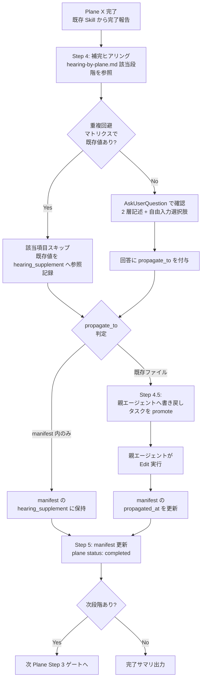

# Hearing by Plane（段階別ヒアリング項目 SSoT）

## §1. 目的

本 reference は **5 段階モデル（Strategy / Scope / Structure / Skeleton / Surface）** の各段階で確認すべきヒアリング項目を SSoT として保持するドキュメントである。

役割は以下の 3 点:

1. **goodpatch 由来の必須ヒアリング項目**を各段階ごとに定義する（5〜8 問/段階）。
2. **既存 4 Skill のヒアリングとの重複回避マッピング**を保持し、既に確認済みの項目は再度問わない（二重ヒアリング防止）。
3. **既存 Skill で抜け落ち気味の補完項目**を明示し、`propagate_to:` で書き戻し先（既存 Skill 出力ファイルの section）を指定する。

本 reference は SKILL.md の Step 4（Plane 補完ヒアリング）/ Step 4.5（書き戻しタスク promote）から参照される。重複回避マトリクスにより、既存成果物に値が存在する場合はヒアリングをスキップし、抜け落ち項目のみを補完する設計とする。

---

## §2. 5 段階別ヒアリング項目

### §2.1 Strategy 段階（戦略）

**問いの核**: 「なぜ作るか」（ビジョン / 課題 / 競合 / 収益）

#### 必須ヒアリング項目（goodpatch 由来）

1. プロダクトのビジョン・解決したい課題は何か
2. ターゲットユーザー（ペルソナ）と利用コンテキスト（誰がどの状況で使うか）
3. ビジネスゴール・KPI / 収益モデル
4. 競合・代替手段の状況と差別化ポイント
5. 制約条件（予算 / スケジュール / 規制 / 既存システム）
6. ステークホルダーと意思決定構造
7. 成功指標と評価タイミング

#### 重複回避マトリクス

| 補完項目 | 既存 Skill 出力 | 確認 section | 充足判定 | 充足時挙動 |
|---|---|---|---|---|
| ビジョン・課題 | requirements.md | §1.1 背景 / §1.2 目的 | プレースホルダ `PLACEHOLDER_` / `<TODO>` なし + 100 字以上 | スキップ（既存値採用） |
| ペルソナ詳細 | requirements.md | §3.1 エンドユーザー | エンドユーザー表に行が 1 件以上 + プレースホルダなし | スキップ |
| ビジネスゴール・KPI | requirements.md | §1.2 目的 / §1.3 ビジネス価値・KPI | KPI 値の数値記載 | スキップ |
| 競合分析 | requirements.md | §2 対象業務 / §3 対象ユーザー・ステークホルダー | 競合名・代替手段 2 件以上記載 | スキップ |
| 制約条件 | requirements.md | §7 非機能要件 / §15.3 制約条件 | 制約項目 3 件以上 | スキップ |

#### 抜け落ち補完項目

- **利用コンテキスト**（誰がどの状況で使うか） → `propagate_to:` manifest 内のみ（要件定義書では一般的に薄いため、manifest の `hearing_supplement` で保持し、必要に応じて screen-spec 起動時に渡す）
- **意思決定者と承認フロー** → `propagate_to:` manifest 内のみ
- **成功指標の測定タイミング** → `propagate_to: "docs/project/requirements.md §1.3"`（既存値が無い場合のみ。ビジネス価値・KPI 表の「測定タイミング」列）

#### AskUserQuestion テンプレ

```yaml
question: "Strategy 段階の補完ヒアリング: 利用コンテキストを教えてください"
description: "誰がどの状況（時間帯 / 場所 / 業務状況 / デバイス）でこのプロダクトを使うかを確認する。requirements.md §3.1 エンドユーザーでは一般的に薄い項目のため、本 Skill で補完して manifest に保持する。"
options:
  - label: "オフィス PC 中心（業務時間内）"
    Note: "デスクワーカー想定。大画面・キーボード前提のレイアウト設計が可能。モバイル制約は最小限。"
  - label: "現場モバイル中心（外出先・立ち作業）"
    Note: "スマホ片手・通信不安定環境を想定。モバイルファースト + オフライン対応必要。Skeleton 段階で制約として継承される。"
  - label: "混在（PC とモバイル両方を業務状況に応じて切替）"
    Note: "レスポンシブ設計必須。プライマリデバイスの判定が必要。Skeleton 段階で「主用途デバイス」を別途確認。"
  - label: "その他（自由入力）"
    Note: "上記に該当しない場合はテキストで詳述してください。"
```

---

### §2.2 Scope 段階（要件）

**問いの核**: 「何を作るか」（機能 / コンテンツ / 優先順位）

#### 必須ヒアリング項目（goodpatch 由来）

1. ユーザーが達成すべきゴールタスク（主要ユースケース）
2. 機能要件のリスト（FN-XXX 単位）
3. コンテンツ要件（どんな情報を扱うか）
4. 優先順位（MoSCoW: MUST / SHOULD / COULD / WON'T）
5. スコープ外項目（明示的に作らないもの）
6. 機能間の依存関係
7. リリーススコープ（MVP / Phase 1 / Phase 2 ...）

#### 重複回避マトリクス

| 補完項目 | 既存 Skill 出力 | 確認 section | 充足判定 | 充足時挙動 |
|---|---|---|---|---|
| 機能要件サマリ | requirements.md | §6 機能要件サマリ | FN-XXX 採番 + 機能名/概要 全件記載 | スキップ |
| MUST 画面スコープ | requirements.md | §6 機能要件 | `MUST\|SHOULD\|MAY\|COULD\|WON'T` ラベル全件付与 | スキップ |
| 業務フロー単位 | function-specs/index.md | 逆引き表 | flow_id 列挙 + 各 function-spec ファイル存在 | スキップ |
| コンテンツ要件 | requirements.md | §2 対象業務 / §6 機能要件サマリ | データ項目記載 | スキップ |
| スコープ外項目 | requirements.md | §5.1 機能スコープ（含まない列） | 「含まない」列に対象外項目が記載 | スキップ |

#### 抜け落ち補完項目

- **MUST 画面スコープの確定**（requirements.md §6 に MoSCoW ラベルが付与されていない場合） → `propagate_to: "docs/project/requirements.md §6"`（書き戻し promote 必須）
- **リリースフェーズ分割**（MVP / Phase 1 / Phase 2） → `propagate_to: "docs/project/requirements.md §6"` または `"docs/project/requirements.md §5.4"`（フェーズ分割表）
- **機能間依存関係** → `propagate_to:` manifest 内のみ（function-specs/index.md でカバーされない関係性）

#### AskUserQuestion テンプレ

```yaml
question: "Scope 段階の補完ヒアリング: MUST 画面スコープを確定しますか?"
description: "requirements.md §6 機能要件サマリの各 FN-XXX に MoSCoW ラベル（MUST / SHOULD / COULD / WON'T）が付与されているか確認する。未付与の場合は本 Skill 内で確定し、Step 4.5 で requirements.md §6 へ書き戻す。"
options:
  - label: "MoSCoW ラベル全件付与済み（スキップ）"
    Note: "requirements.md §6 で全 FN-XXX に MUST/SHOULD/COULD/WON'T が記載されている場合。重複回避マトリクスにより本 Skill ではヒアリング不要。"
  - label: "MUST のみ確定したい（残りは Phase 2）"
    Note: "MVP リリース対象を最優先で確定する。本 Skill で MUST 画面リストを確認し、requirements.md §6 へ書き戻し promote。"
  - label: "全 MoSCoW を本 Skill で確定する"
    Note: "FN-XXX 全件に対し MoSCoW を確認。質問数が多くなるため Plane 2 の所要時間が増加。"
  - label: "その他（自由入力）"
    Note: "別のラベル体系（必須/推奨/オプション 等）を使う場合はテキストで指定。"
```

---

### §2.3 Structure 段階（構造）

**問いの核**: 「どう繋ぐか」（IA / OOUI / ナビゲーション）

#### 必須ヒアリング項目（goodpatch 由来）

1. オブジェクト（情報単位）の洗い出しとプロパティ
2. オブジェクト間の関係（has-a / is-a / N:M）
3. ユーザーフロー（タスク達成の順序）
4. ナビゲーション構造（グローバル / セクション / コンテキスト）
5. 状態遷移（モードレス UI 前提）
6. 検索・絞り込み手段
7. エラー・例外フローの繋ぎ方

#### 重複回避マトリクス

| 補完項目 | 既存 Skill 出力 | 確認 section | 充足判定 | 充足時挙動 |
|---|---|---|---|---|
| ユーザーフロー | function-specs/function-spec-{flow_id}.md | 各 sequenceDiagram | participant 4 層（Browser/Backend/DB/Ext）描画完了 | スキップ |
| 画面遷移構造 | screen-flow-url.md | drawio ファイルパス + stable_id | 全画面ノード配置 + 矢印接続 | スキップ |
| オブジェクト定義 | function-specs/ | 各 spec の入出力データ | データ項目記載 | スキップ |
| ナビゲーション | screen-flow-url.md | drawio 内 グローバルナビ | グローバルナビノード存在 | スキップ |

#### 抜け落ち補完項目

- **ペルソナ詳細**（screen-flow-drawio 起動前に「誰の動線か」が曖昧な場合） → `propagate_to: "docs/project/requirements.md §3.1"`
- **OOUI クラス図**（オブジェクト関係の俯瞰） → `propagate_to:` manifest 内のみ（Phase 2 で要否判定）
- **モードレス前提の明示** → `propagate_to:` manifest 内のみ（Surface 段階の制約として継承）

#### AskUserQuestion テンプレ

```yaml
question: "Structure 段階の補完ヒアリング: ペルソナ視点でのユーザーフロー確認"
description: "screen-flow-drawio 起動前に、画面遷移を「誰のどの動線か」で明確化する。requirements.md §3.1 エンドユーザーにペルソナ詳細が薄い場合、本 Skill で補完して画面遷移図のラベリングに反映する。"
options:
  - label: "ペルソナ別フローを描き分ける"
    Note: "ペルソナ A / B 別に screen-flow-drawio で異なるフローを描画。Plane 4 の Skeleton にも引き継がれる。複雑度高。"
  - label: "主要ペルソナ 1 件のフローに集約"
    Note: "MVP として最重要ペルソナのフローのみ描画。サブペルソナは Phase 2 送り。シンプル運用向け。"
  - label: "ペルソナ非依存の機能起点フロー"
    Note: "オブジェクト/機能を主軸にフロー描画。BtoB 業務システムで全ロールが共通画面を使う場合に有効。"
  - label: "その他（自由入力）"
    Note: "ペルソナ×フェーズの 2 軸など、別の切り口がある場合はテキストで指定。"
```

---

### §2.4 Skeleton 段階（骨格）

**問いの核**: 「どこに置くか」（ワイヤーフレーム / レイアウト / インタラクション）

#### 必須ヒアリング項目（goodpatch 由来）

1. ターゲットユーザーの既有知識・メンタルモデル
2. プラットフォーム選定理由と制約（Web / iOS / Android / デスクトップ）
3. 主要ゴールタスクと画面上の優先度
4. 競合で評価される機能 / アクセシビリティ要件
5. 入力・操作デバイス（マウス / タッチ / キーボード）
6. レスポンシブブレークポイント（必要時）
7. インタラクション/フィードバックの密度（即時 / 確認 / 段階的）

#### 重複回避マトリクス

| 補完項目 | 既存 Skill 出力 | 確認 section | 充足判定 | 充足時挙動 |
|---|---|---|---|---|
| 画面ワイヤーフレーム | wireframe-url.md（screen-spec 出力） | Figma URL | 全 MUST 画面のワイヤー存在 | スキップ |
| プラットフォーム制約 | requirements.md | §7.6 システム環境・エコロジー | `Web\|iOS\|Android\|デスクトップ` keyword | スキップ |
| モバイル/レスポンシブ制約 | requirements.md | §7.6 システム環境・エコロジー | `モバイル\|レスポンシブ\|iOS\|Android` keyword | スキップ |
| アクセシビリティ要件 | requirements.md | §7.5 セキュリティ / §7.6 システム環境 | `WCAG\|アクセシビリティ\|a11y` keyword | スキップ |
| 主要ゴールタスク | function-specs/ | 各 flow の概要 | 業務フロー名記載 | スキップ |

#### 抜け落ち補完項目

- **モバイル/レスポンシブ制約**（requirements.md §7 に記載なし場合） → `propagate_to: "docs/project/requirements.md §7"`（§7.6 システム環境・エコロジー / 書き戻し promote 必須）
- **アクセシビリティ要件**（WCAG レベル / コントラスト要件 等） → `propagate_to: "docs/project/requirements.md §7"`（§7.5 / §7.6 / 書き戻し promote 必須）
- **メンタルモデル想定**（既存類似ツール経験の有無） → `propagate_to:` manifest 内のみ
- **入力デバイス制約**（タッチ専用 / キーボード前提 等） → `propagate_to: "docs/project/requirements.md §7"`（§7.6 システム環境・エコロジー）または manifest

#### AskUserQuestion テンプレ

```yaml
question: "Skeleton 段階の補完ヒアリング: モバイル / アクセシビリティ制約を確認"
description: "requirements.md §7 非機能要件（特に §7.5 セキュリティ / §7.6 システム環境・エコロジー）にモバイル対応 / アクセシビリティ要件が明記されているか確認する。欠落時は本 Skill で確定し、Step 4.5 で requirements.md §7 へ追記指示として promote する（直接 Edit せず親エージェントへタスク化）。"
options:
  - label: "デスクトップ Web のみ / アクセシビリティは WCAG AA 努力義務"
    Note: "BtoB 業務システム標準。レスポンシブ最小限、a11y は努力義務レベル。requirements.md §7 へ追記 promote。"
  - label: "レスポンシブ必須（Web / iOS / Android）+ WCAG AA 準拠"
    Note: "公共系 / 大規模ユーザー想定。Surface 段階でカラーコントラスト / フォントサイズ等の検証が必須化。"
  - label: "モバイルファースト + WCAG AAA 一部対応"
    Note: "高アクセシビリティ要件。Surface 段階のスタイル選定に強い制約。スケジュール影響大。"
  - label: "その他（自由入力）"
    Note: "WCAG レベル指定 / 特定 OS バージョン制約 / 多言語要件など、上記に該当しない場合はテキストで詳述。"
```

---

### §2.5 Surface 段階（表層）

**問いの核**: 「どう見せるか」（VI / 色 / タイポ / モーション）

> **注**: Surface 段階は Phase 2 送り。本 Skill では補完ヒアリングのみ実施し、専用 Skill（`einja-project-design-system` 案）未提供のため hi-fi デザインは `einja-pencil-design-manager` / `ui-design-generator` への案内に留める。

#### 必須ヒアリング項目（goodpatch 由来）

1. ブランド方針（既存 VI の有無 / トーン&マナー）
2. カラーパレット（プライマリ / セカンダリ / アクセント / 機能色）
3. タイポグラフィ（フォントファミリ / ウェイト / サイズスケール）
4. アイコン / イラスト方針
5. モーション / トランジション方針
6. 即効性 vs 遅効性のバランス（goodpatch 独自軸）
7. デザインシステム化の必要性（Phase 2 で本格化）

#### 重複回避マトリクス

| 補完項目 | 既存 Skill 出力 | 確認 section | 充足判定 | 充足時挙動 |
|---|---|---|---|---|
| 既存 VI / ブランドガイド | requirements.md | §1 概要 or 別添資料 | VI ガイド参照 URL 記載 | スキップ |
| デザインシステム | （Phase 2 専用 Skill 予定） | — | 未提供 | 案内テンプレ表示 |
| カラーパレット | （Phase 2） | — | 未提供 | 案内テンプレ表示 |
| タイポグラフィ | （Phase 2） | — | 未提供 | 案内テンプレ表示 |

#### 抜け落ち補完項目

- **ブランド方針の有無確認** → `propagate_to:` manifest 内のみ（Phase 2 で専用 Skill が消費）
- **即効性 + 遅効性二軸**（goodpatch 独自） → `propagate_to:` manifest 内のみ

#### AskUserQuestion テンプレ

```yaml
question: "Surface 段階の補完ヒアリング: ブランド方針と Phase 2 移行確認"
description: "Surface 段階は本 Skill 群では Phase 2 送り。既存 VI の有無と、hi-fi デザイン作成の進め方を確認する。manifest の Surface plane は status: skipped を設定して完了とみなす運用も可能。"
options:
  - label: "既存 VI あり / einja-pencil-design-manager で hi-fi 作成"
    Note: "ブランドガイドが既存なら Pencil 上でデザインマスターを構築し、Issue 単位で ui-design-generator を呼ぶ運用。"
  - label: "VI 未確定 / Phase 2 で einja-project-design-system 待ち"
    Note: "manifest の Surface plane を status: skipped に設定し、Phase 2 まで一旦完了扱い。リスク: Skeleton で確定したレイアウトと VI が衝突する可能性。"
  - label: "暫定 VI のみ確定（プライマリ色 / フォント程度）"
    Note: "MVP リリース用に最小 VI を確定。本格的なデザインシステムは Phase 2。manifest に簡易メモを保持。"
  - label: "その他（自由入力）"
    Note: "既存サービスの VI 流用 / 外注予定 / 別の進め方がある場合はテキストで詳述。"
```

---

## §3. 共通ルール

### AskUserQuestion 文言テンプレ（CLAUDE.md ルール準拠）

全ての AskUserQuestion は **2 層記述**（description = What / Note = So What）を厳守し、**自由入力選択肢を必須**で含める。

```
選択肢ラベル
  description: 何をするか・スコープ・対象範囲を端的に
  Note: メリット・デメリット・リスク・他選択肢との比較ポイント
```

最後の選択肢には必ず `「その他（自由入力）」` を含め、想定外の回答に対応できるようにする。

### `propagate_to:` の指定方法

各補完項目の回答には `propagate_to` フィールドを付与し、書き戻し先を明示する:

| 値の形式 | 意味 | Step 4.5 での挙動 |
|---|---|---|
| `manifest 内のみ` | 既存 Skill 出力に書き戻し不要。manifest の `hearing_supplement` で保持 | 書き戻し promote なし |
| `requirements.md §X.Y` | 既存 Skill 出力の特定 section へ書き戻し | 親エージェントへ Edit タスクを提示 |
| `function-specs/index.md` | manifest 逆引き表へ反映 | 親エージェントへ Edit タスクを提示 |
| `screen-flow-url.md` | drawio ファイルパス/URL ドキュメントへ追記 | 親エージェントへ Edit タスクを提示 |

### 既存 Skill 出力ファイルへの書き戻し promote 規約

1. **本 Skill は既存 Skill 出力ファイルを直接 Edit しない**（接続規約: 読むだけ・呼ぶだけ）。
2. Step 4.5 で `propagate_to` を持つ補完項目を **親エージェントへの書き戻しタスクとして提示**する。
3. 親エージェントが Edit を実行し、完了後に manifest の `propagated_at` を更新する。
4. 書き戻し不要（`manifest 内のみ`）の項目は manifest の `hearing_supplement` に保持し、後続 plane で参照可能にする。

---

## §4. 補完ヒアリング全体フロー



このフローは Step 4 / 4.5 / 5 を一連の処理として扱い、`propagate_to` の判定によって書き戻しタスクの promote 有無を制御する。書き戻しが必要な項目は親エージェントへタスク提示し、manifest と既存 Skill 出力ファイルの整合性を維持する。
