# 既存 Skill 連結マッピング（einja-design-5-planes）

本ドキュメントは、`einja-design-5-planes` Skill が既存のプロジェクト全体スコープ Skill 群（einja-project-requirements / einja-project-function-spec / einja-project-screen-flow-drawio / einja-project-screen-spec）を 5 段階モデルの各 Plane に対応づけて呼び出すためのマッピング規約・連結図・指示プロンプトテンプレート・軽量モード手順・接続規約を集約する。

本 Skill は既存 Skill を **読むだけ・呼ぶだけ**で編集しない（非破壊性最優先）。

---

## §1. 既存 Skill ↔ 段階マッピング表

| Plane | 段階 | 該当 Skill | 担当範囲 |
|---|---|---|---|
| 1 | Strategy | `einja-project-requirements` | `requirements.md §1〜§4`（プロジェクト概要 / 対象業務 / 対象ユーザー・ステークホルダー / システム化方針） |
| 2 | Scope | `einja-project-requirements` + `einja-project-function-spec` | `requirements.md §5 スコープ境界 + §6 機能要件サマリ`（MUST/SHOULD/COULD/WON'T ラベル） + 機能仕様（業務フロー単位） |
| 3 | Structure | `einja-project-function-spec` + `einja-project-screen-flow-drawio` | 業務フロー詳細（system sequenceDiagram）+ プロジェクト全体画面遷移図（drawio） |
| 4 | Skeleton | `einja-project-screen-flow-drawio` + `einja-project-screen-spec` | 画面配置・遷移確定 + 画面単位ワイヤーフレーム（項目定義・メッセージ文言） |
| 5 | Surface | （未カバー、Phase 2 送り） | — |

### 補足

- **Plane 2 / Plane 3 で `einja-project-function-spec` が重複** している。これは「機能要件サマリの確定（Scope）」と「業務フロー詳細化（Structure）」の段階間で同 Skill が異なるセクションを担当するため。Plane 2 では `requirements.md §6` のラベル付与に重点、Plane 3 では `function-specs/function-spec-{flow_id}.md` の業務フロー詳細 + system sequenceDiagram に重点を置く。
- **Plane 3 / Plane 4 で `einja-project-screen-flow-drawio` が重複** している。Plane 3 では「画面間遷移の構造化」、Plane 4 では「個別画面ワイヤーフレーム作成の前提となる画面リスト確定」が役割。
- Plane 5 (Surface) は本 Skill 範囲外（後述 §6 参照）。

---

## §2. 各 Skill の呼び出し前提条件

各既存 Skill が必要とする入力ファイル / 既存成果物のチェックリスト。Plane 開始前に親エージェントが Read で存在確認すること。

### Plane 1: einja-project-requirements（§1〜§4）

| 前提 | 確認方法 | 不在時の動作 |
|---|---|---|
| プロジェクト名・概要が決まっている | ユーザー確認 or `docs/project/` 配下の既存メモ | AskUserQuestion で確認 |
| 既存 `docs/project/requirements.md` | Read | 不在なら新規生成、存在なら再開モード（未充足セクションのみ問う） |

### Plane 2: einja-project-requirements（§5〜§6）+ einja-project-function-spec

| 前提 | 確認方法 | 不在時の動作 |
|---|---|---|
| `docs/project/requirements.md §1〜§4` 充足 | Read + プレースホルダ走査 | Plane 1 へ戻す（cascading） |
| `docs/project/requirements.md §5` スコープ境界 + `§6` 機能要件サマリの骨子 | Read | 同 Skill 内で §5〜§6 を生成 |
| `docs/project/function-specs/index.md` 既存 manifest | Read | 不在なら新規生成 |

### Plane 3: einja-project-function-spec + einja-project-screen-flow-drawio

| 前提 | 確認方法 | 不在時の動作 |
|---|---|---|
| `requirements.md §6` の MUST/SHOULD/COULD/WON'T ラベル全件付与済 | Grep `MUST\|SHOULD\|COULD\|WON'T` | Plane 2 へ戻す |
| `function-specs/index.md` 業務フロー一覧確定 | Read | function-spec Skill 内で生成 |
| drawio 保存先（`docs/project/diagrams/` 等）の確認 | Read or ユーザー確認 | `einja-project-screen-flow-drawio` のデフォルト保存先案内 |

### Plane 4: einja-project-screen-flow-drawio + einja-project-screen-spec

| 前提 | 確認方法 | 不在時の動作 |
|---|---|---|
| `docs/project/screen-flow-url.md`（stable_id 採番済） | Read | Plane 3 へ戻す |
| 画面リスト（stable_id × 画面名）の確定 | screen-flow-url.md の表 | Plane 3 へ戻す |
| ペルソナ・利用コンテキスト（Plane 1 由来） | `requirements.md §3.1` エンドユーザー | Plane 1 補完ヒアリングへ |

### Plane 5: Surface（Phase 2 送り）

前提条件は §6 案内テンプレ参照（本 Skill では実機オーケストレーション対象外）。

---

## §3. 連結図（mermaid）

各 Skill の出力ファイル → 次段階入力への流れ。

```mermaid
flowchart LR
  subgraph P1[Plane 1: Strategy]
    R1[einja-project-requirements §1〜§4]
    R1 --> F1[(requirements.md §1〜§4)]
  end
  subgraph P2[Plane 2: Scope]
    F1 --> R2[einja-project-requirements §5〜§6]
    R2 --> F2[(requirements.md §5〜§6)]
    F2 --> FS1[einja-project-function-spec]
    FS1 --> F3[(function-specs/index.md)]
  end
  subgraph P3[Plane 3: Structure]
    F3 --> FS2[einja-project-function-spec<br/>業務フロー詳細]
    FS2 --> F4[(function-spec-flow_id.md)]
    F4 --> SF1[einja-project-screen-flow-drawio]
    SF1 --> F5[(screen-flow-url.md)]
  end
  subgraph P4[Plane 4: Skeleton]
    F5 --> SF2[einja-project-screen-flow-drawio<br/>画面リスト確定]
    SF2 --> SS[einja-project-screen-spec]
    SS --> F6[(wireframe-url.md)]
  end
  subgraph P5[Plane 5: Surface]
    F6 -.Phase 2 送り.-> X[einja-pencil-design-manager<br/>or ui-design-generator]
  end
```



**ファイル受け渡しの単方向性**: 上流 Plane の出力ファイルが下流 Plane の入力となる。revisit 時は cascading invalidation により下流 Plane の status を stale に降格する（SKILL.md Step 3 参照）。

---

## §4. 既存 Skill 起動時の指示プロンプトテンプレ（plane 別）

本 Skill から既存 Skill を起動する際の指示プロンプトテンプレート。**テンプレ範囲外の指示は禁止**（既存 Skill のテスト済み挙動を保証するため）。親エージェントは下記テンプレを Skill tool ロード後の指示プロンプトとして提示する。

### Plane 1 (Strategy) 起動時の指示プロンプト

```
einja-project-requirements を §1〜§4（戦略段階: プロジェクト概要 / 対象業務 / 対象ユーザー・ステークホルダー / システム化方針）の範囲で実行してください。
既存成果物（既に埋まっている section）はスキップし、未充足項目のみ問うてください。
完了後、本 Skill (einja-design-5-planes) に戻り manifest を更新します。

【補完ヒアリング由来の追記事項】（hearing_supplement で propagate_to が指定されている場合のみ）
- §3.1 エンドユーザー: ペルソナ詳細・利用コンテキスト（時間帯/場所/デバイス）
- §7 非機能要件（§7.5 セキュリティ / §7.6 システム環境・エコロジー）: モバイル/アクセシビリティ制約（WCAG AA / iOS / Android バージョン要件）
```

### Plane 2 (Scope) 起動時の指示プロンプト

```
einja-project-requirements §5（スコープ境界）+ §6（機能要件サマリ）と einja-project-function-spec を順次実行してください。
§5 のスコープ境界（含む/含まない・フェーズ分割）と §6 の MUST/SHOULD/COULD/WON'T ラベル確定、機能仕様の業務フロー出力を取得します。
完了後、本 Skill に戻り manifest を更新します。

【実行順序】
1. einja-project-requirements §5〜§6 のみ実行（§1〜§4 は skip）
2. §6 完了後、einja-project-function-spec を起動（index.md のみ。業務フロー詳細は Plane 3）

【補完ヒアリング由来の追記事項】（hearing_supplement で propagate_to が指定されている場合のみ）
- §6: MUST 画面スコープの定義（「最小限の MVP 画面」とは何か）
- §5.4 フェーズ分割: MVP / Phase 1 / Phase 2 の境界
```

### Plane 3 (Structure) 起動時の指示プロンプト

```
einja-project-function-spec と einja-project-screen-flow-drawio を順次実行してください。
業務フロー詳細（system sequenceDiagram）とプロジェクト全体画面遷移図（drawio）を確定させます。
完了後、本 Skill に戻り manifest を更新します。

【実行順序】
1. einja-project-function-spec で各業務フロー単位の function-spec-{flow_id}.md を生成
2. function-spec の業務フロー出力を入力として einja-project-screen-flow-drawio を起動（drawio 保存先確認 → drawio 書き出し開始）
3. screen-flow-url.md の stable_id 採番が完了したことを確認

【補完ヒアリング由来の追記事項】（hearing_supplement で propagate_to が指定されている場合のみ）
- 画面遷移の OOUI 観点（モードレス・主オブジェクト中心）
- ナビゲーション構造（グローバルナビ / セクションナビ）
```

### Plane 4 (Skeleton) 起動時の指示プロンプト

```
einja-project-screen-flow-drawio の画面リスト確定後、einja-project-screen-spec を実行してください。
各画面のワイヤーフレーム・項目定義・メッセージ文言を確定させます。
完了後、本 Skill に戻り manifest を更新します。

【実行順序】
1. einja-project-screen-flow-drawio で stable_id × 画面名の対応表を最終確定（drawio 書き出し完了確認）
2. einja-project-screen-spec を起動し、wireframe-url.md / 画面単位仕様を生成
3. ユーザー手動確認フェーズ（Step 4.5/7.5 ドラフト確認）を経て確定

【補完ヒアリング由来の追記事項】（hearing_supplement で propagate_to が指定されている場合のみ）
- 利用コンテキスト由来のレイアウト制約（モバイル優先 / デスクトップ優先）
- メンタルモデルと実装モデルの一致度確認観点
```

### テンプレ範囲外指示の禁止

- 既存 Skill のヒアリング項目を **追加・削除・変更しない**
- 既存 Skill の出力ファイル構造を **変更しない**
- 補完ヒアリングで取得した値は **`propagate_to` で書き戻し位置を明示** し、SKILL.md Step 4.5 で親エージェントが Edit するタスクとして promote する
- 既存 Skill 内で AskUserQuestion を多重発生させない（Orchestrator モードでは Step 0 で一括承認済のため、Plane X 起動時は確認メッセージのみ）

---

## §5. 軽量モード（既存 Skill を呼ばずに本 Skill 単体で進める）

既存 4 Skill を持たないプロジェクトや、ドキュメントが既に別形式で揃っているプロジェクトでも、本 Skill が「方法論ガイド」として機能するサブ手順を定義する。

### 軽量モードの動作

1. **references/5-planes-overview.md を読む**: 5 段階モデルの概要と用語統一表をユーザーに提示
2. **references/hearing-by-plane.md の必須項目をユーザーに問う**: 各 Plane の必須ヒアリング項目（5〜8 問/段階）を AskUserQuestion で確認
3. **manifest だけを生成して進捗管理**: `docs/project/design-5-planes-manifest.md` のみ生成し、各 Plane の `source_files` は空 or ユーザー指定の任意ファイルパスを記録
4. **Plane 完了マークは「ユーザー手動入力で済んだ」と記録**: manifest の `status: completed` + `completion_criteria.manual_acknowledgement: true` を付与

### 軽量モードの起動条件

下記いずれかに該当する場合、Step 1（既存成果物スキャン）で軽量モードを提案する:
- `docs/project/requirements.md` 不在
- 既存 4 Skill が CLI/プラグイン同期で未配布のプロジェクト
- ユーザーが「方法論だけ知りたい」「ヒアリング項目だけ確認したい」と明示

### 軽量モード時の制約

- 既存 Skill 起動は行わない（指示プロンプトテンプレも参照されない）
- manifest の `hearing_supplement` は値のみ保持（`propagate_to` は `null`）
- 後日既存 Skill 導入時に「Orchestrator モードへの移行」を案内するメモを manifest に残す

---

## §6. Plane 5 (Surface) 案内テンプレ

```
## Plane 5: Surface（Phase 2 送り）
本 Phase では Surface 段階の専用 Skill が未提供です。
暫定対応:
- hi-fi デザインは einja-pencil-design-manager または ui-design-generator (Issue 単位) で対応
- デザインシステム / VI / カラーパレットは別途 PR を立てて検討
- Phase 2 で einja-project-design-system Skill 新設予定
manifest の Surface plane は status: skipped を設定して完了とみなします。
```

### Plane 5 のマニフェスト記録例

```yaml
- name: Surface
  status: skipped
  skip_reason: "Phase 2 送り（einja-project-design-system 未実装）"
  fallback_skills:
    - einja-pencil-design-manager
    - ui-design-generator
  notes: "hi-fi デザイン / VI / カラーパレットは別 PR で対応予定"
```

---

## §7. 接続規約

| 項目 | 規約 |
|---|---|
| **本 Skill の役割** | 既存 Skill を **読むだけ・呼ぶだけ**、編集しない（非破壊性最優先） |
| **既存 Skill SKILL.md への「上流 Skill: einja-design-5-planes」コメント追記** | **Phase 2 送り**（本 Plan 対象外） |
| **manifest 更新の一元管理** | 本 Skill が `design-5-planes-manifest.md` を一元管理。既存 Skill は自身の出力ファイル（requirements.md / function-specs/ / screen-flow-url.md / wireframe-url.md）のみ管理 |
| **補完ヒアリング結果の書き戻し** | `propagate_to` を持つ項目のみ、Step 4.5 で親エージェントが Edit して既存 Skill 出力ファイルへ反映。書き戻し不要のメタ情報は manifest のみに保持 |
| **既存 Skill ヒアリング項目の変更** | **行わない**。抜け落ち観点は本 Skill Step 4 の補完ヒアリングで吸収 |
| **二重起動防止** | manifest の `status: completed` の plane は再起動時に skip（「再実行？」承認ゲート）。revisit 要求時のみ `revisiting` に遷移し下流を cascading invalidation |
| **Skill tool は実行ではなく Read** | 本 Skill は子 Skill を直接起動しない。親エージェントに「次は Skill tool で X をロードして指示プロンプト Y で起動してください」と指示する |

---

## §8. manifest YAML サンプル（引用規則の確認用）

### `hearing_supplement` の日本語キー引用規則

`hearing_supplement` の補完項目キーに日本語・スペース・記号が含まれる場合は **必ずダブルクォートで囲む**。

```yaml
hearing_supplement:
  "モバイル/アクセシビリティ制約":
    value: "WCAG AA / iOS 17+ / Android 14+"
    propagate_to: "docs/project/requirements.md §7"
    propagated_at: "2026-05-27T10:00:00+09:00"
  "ペルソナ詳細（利用コンテキスト）":
    value: "通勤時間帯のスマホ片手操作を想定。1セッション3分以内で完結"
    propagate_to: "docs/project/requirements.md §3.1"
    propagated_at: null
  "MUST 画面スコープ":
    value: "ログイン / ダッシュボード / 申請一覧 / 申請詳細 の 4 画面を MUST とする"
    propagate_to: "docs/project/requirements.md §6"
    propagated_at: "2026-05-27T11:30:00+09:00"
```

### `propagate_to` の section anchor 記法サンプル

| 記法 | 用途 | 例 |
|---|---|---|
| `"<フルパス> §<セクション番号>"` | ファイル内特定セクション指定（**フルパス + ダブルクォート必須**） | `propagate_to: "docs/project/requirements.md §3.1"` |
| `"<フルパス> §<番号> <見出し>"` | セクション番号+見出し併記（曖昧性回避） | `propagate_to: "docs/project/requirements.md §7 非機能要件"` |
| `"<フルパス>"` | ファイル全体（セクション未確定時） | `propagate_to: "docs/project/function-specs/index.md"` |
| `null` | 書き戻し不要（manifest のみに保持） | `propagate_to: null` |

**記法統一ルール**: `propagate_to` の値は **必ずフルパス（`docs/project/` から始まる）+ ダブルクォート** で記述する。`null` を除き、相対パス・クォートなし記法は禁止。

### 完了判定基準（`completion_criteria`）の記法

```yaml
completion_criteria:
  placeholder_unfilled: 0       # PLACEHOLDER_ / <TODO> マーカー残数
  required_sections_present: true
  manual_acknowledgement: false  # 軽量モード時のみ true
```

---

## 関連ドキュメント

- 本 Skill SKILL.md: `.claude/skills/einja-design-5-planes/SKILL.md`
- 5 段階モデル概要: `references/5-planes-overview.md`
- 段階別ヒアリング項目: `references/hearing-by-plane.md`
- 既存 Skill 群:
  - `.claude/skills/einja-project-requirements/SKILL.md`
  - `.claude/skills/einja-project-function-spec/SKILL.md`
  - `.claude/skills/einja-project-screen-flow-drawio/SKILL.md`
  - `.claude/skills/einja-project-screen-spec/SKILL.md`（Phase 4 で実装予定）
