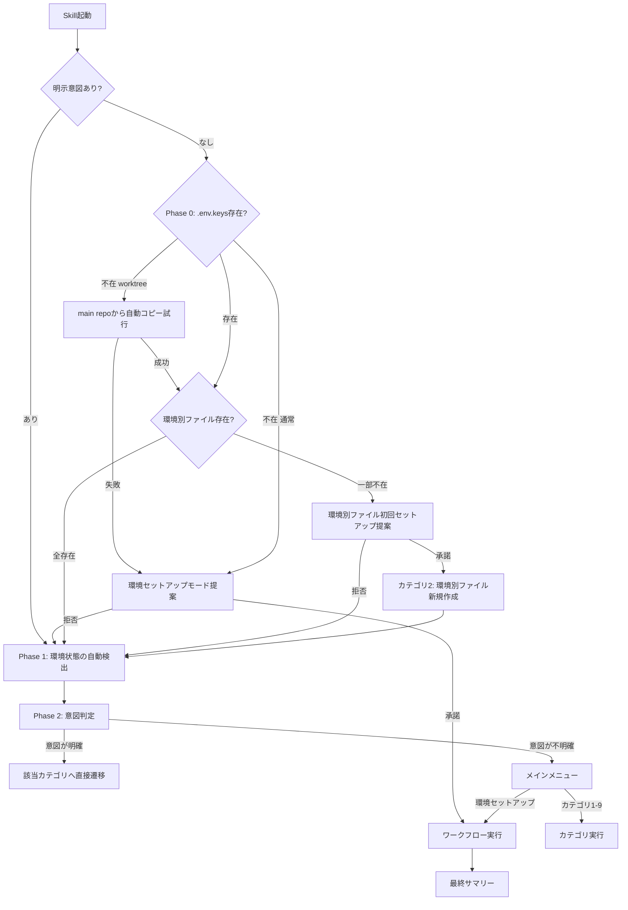

# インフラ環境メンテナンス Skill

## 概要

インフラ環境のセットアップ・メンテナンスを**対話的に**実行するSkillです。ローカル開発環境、Vercel、Neon、GitHub Actions、環境変数管理をカバーします。

## 参照ドキュメント

> **重要**: ドキュメントは**起動時に全て読まない**。選択されたカテゴリの実行時に、該当する参照ドキュメントのみを読むこと。各カテゴリの「参照ドキュメント」セクションに記載されたファイルが対象。

### 設計方針
- `docs/einja/steering/infrastructure/environment-variables.md`
- `docs/einja/steering/infrastructure/deployment.md`

### 手順書
- `docs/einja/instructions/environment-setup.md`
- `docs/einja/instructions/deployment-setup.md`
- `docs/einja/instructions/vercel-cli-reference.md`
- `docs/einja/instructions/neon-cli-reference.md`
- `docs/einja/instructions/local-server-environment-and-worktree.md`

> **Single Source of Truth**: このSkillは対話フローの定義であり、具体的なコマンド手順は各カテゴリの参照ドキュメントが正。

---

## 実行フロー



---

## Phase 0: 環境セットアップモード判定

> Phase 1の前に実行する。ユーザーの発話に特定カテゴリへの明示意図がある場合はスキップする。

### スキップ条件

以下のいずれかに該当する場合、Phase 0をスキップしてPhase 1に直接進む:

1. **明示意図あり**: ユーザーの発話に特定カテゴリへの意図がある（例: 「Vercelだけ設定したい」「GitHub Secretsを確認」「CIが失敗してる」）

### 実行フロー

1. `.env.keys` の存在を確認
2. **worktree環境の場合**: メインリポジトリに `.env.keys` が存在するか確認し、存在すればコピーを試行
   ```bash
   # worktree検出（git worktree list --porcelain ベース）
   MAIN_WORKTREE=$(git worktree list --porcelain 2>/dev/null | head -1 | sed 's/^worktree //')
   CURRENT_DIR=$(pwd)
   if [ -n "$MAIN_WORKTREE" ] && [ "$MAIN_WORKTREE" != "$CURRENT_DIR" ]; then
     if [ -f "$MAIN_WORKTREE/.env.keys" ]; then
       cp "$MAIN_WORKTREE/.env.keys" .env.keys
       echo "✅ メインリポジトリから .env.keys をコピーしました"
       # → Phase 1に進む
     fi
   fi
   ```
3. `.env.keys` が不在の場合: AskUserQuestionで環境セットアップモードを提案
   - **承諾**: → `references/workflow-env-setup.md` を読み込んでワークフロー実行
   - **拒否**: → Phase 1に進む（通常フロー）
4. `.env.keys` が存在する場合: 環境別ファイルの存在を確認
   ```bash
   # 環境別ファイルの不在チェック（.env.localは除外 — 常にテンプレートに含まれる）
   MISSING_ENVS=()
   for env in develop staging production preview; do
     [ ! -f ".env.$env" ] && MISSING_ENVS+=("$env")
   done
   ```
5. 不在の環境別ファイルがある場合: AskUserQuestionで環境別ファイル初回セットアップを提案
   - 不在ファイル一覧を表示
   - 選択肢:
     - **今すぐ作成する**: → `references/category-2-env-variables.md` の「環境別ファイル新規作成」フローを呼び出し。完了後、Phase 1に進む
     - **スキップして通常フローへ**: → Phase 1に進む
     - **その他（自由入力）**

---

## Phase 1: 環境状態の自動検出

Skill起動時に以下を自動検出し、結果をユーザーに表示する。

### 前提チェック

```bash
# === 必須CLIツール ===
for cmd in vercel neonctl gh dotenvx docker; do
  command -v "$cmd" >/dev/null 2>&1 && echo "✅ $cmd" || echo "❌ $cmd"
done

# === オプショナルツール ===
command -v jq >/dev/null 2>&1 && echo "✅ jq" || echo "❌ jq（オプション: トークン詳細表示に使用）"
```

### 環境状態検出

```bash
# === ファイル存在確認 ===
for f in .env .env.local .env.keys .env.personal .env.develop .env.staging .env.production .env.preview; do
  [ -f "$f" ] && echo "✅ $f" || echo "❌ $f"
done

# === 旧名envファイル検出（リネーム案内） ===
LEGACY_ENV_MAP=".env.development:.env.develop"
for pair in $LEGACY_ENV_MAP; do
  old="${pair%%:*}"; new="${pair##*:}"
  if [ -f "$old" ] && [ ! -f "$new" ]; then
    echo "⚠️ 旧名ファイル検出: $old → $new にリネームしてください (git mv $old $new)"
  elif [ -f "$old" ] && [ -f "$new" ]; then
    echo "⚠️ 旧名ファイル残存: $old は不要です（$new が正）。削除してください (git rm $old)"
  fi
done

# === Docker/PostgreSQL状態 ===
docker compose ps 2>/dev/null | grep postgres

# === 開発サーバー状態 ===
pnpm dev:status 2>/dev/null || echo "停止中"

# === デフォルトトークン設定状況 ===
DEFAULTS_FILE="${XDG_CONFIG_HOME:-$HOME/.config}/einja/defaults.json"
if [ -f "$DEFAULTS_FILE" ]; then
  echo "✅ デフォルトトークン設定ファイル"
  # jqがある場合はキーの有無を表示
  if command -v jq >/dev/null 2>&1; then
    for key in VERCEL_TOKEN NEON_API_KEY GITHUB_TOKEN VERCEL_ORG_ID; do
      val=$(jq -r ".tokens.${key} // empty" "$DEFAULTS_FILE")
      [ -n "$val" ] && echo "  ✅ $key" || echo "  ❌ $key"
    done
  fi
else
  echo "❌ デフォルトトークン未設定"
fi

# === トークン有効性検証（.env.personal 存在時のみ） ===
if [ -f ".env.personal" ]; then
  # .env.personalの変数をロードしてから検証（並行実行で高速化）
  dotenvx run -f .env.personal -- bash -c '
    gh auth status 2>/dev/null && echo "✅ GITHUB_TOKEN 有効" || echo "⚠️ GITHUB_TOKEN 無効/未設定" &
    vercel whoami 2>/dev/null && echo "✅ VERCEL_TOKEN 有効" || echo "⚠️ VERCEL_TOKEN 無効/未設定" &
    if [ -n "$NEON_API_KEY" ]; then
      neonctl projects list --api-key "$NEON_API_KEY" >/dev/null 2>&1 && echo "✅ NEON_API_KEY 有効" || echo "⚠️ NEON_API_KEY 無効/期限切れ" &
    else
      echo "⚠️ NEON_API_KEY 未設定"
    fi
    wait
  '
fi
```

検出結果をサマリー表示した上で、AskUserQuestionでメインメニューを表示する。

---

## Phase 2: 意図判定とメインメニュー

### 意図が明確な場合（質問せずに直接実行）

Skill起動時の引数やユーザーの指示から意図が読み取れる場合は、AskUserQuestionを使わずに該当カテゴリに直接進む。

**直接実行の例:**
- `/infra-maintenance Vercel初期設定` → カテゴリ3: Vercel管理へ直接遷移
- `/infra-maintenance ヘルスチェック` → カテゴリ6: 環境状態確認へ直接遷移
- `Neonのブランチを作成したい` → カテゴリ4: Neon管理へ直接遷移
- `GitHub Secretsを一括設定して` → カテゴリ5: GitHub Secrets管理へ直接遷移
- `環境変数を追加したい` → カテゴリ2: 環境変数管理へ直接遷移
- `CIが失敗してる` → カテゴリ7: GitHub Actions CI/CD管理へ直接遷移
- `ワークフローの実行状況を見たい` → カテゴリ7: GitHub Actions CI/CD管理へ直接遷移
- `デフォルトトークンを設定したい` → カテゴリ8: デフォルトトークン管理へ直接遷移
- `共通トークンをプロジェクトに適用したい` → カテゴリ8: デフォルトトークン管理へ直接遷移
- `デプロイ検査して` → カテゴリ9: デプロイ検査・セットアップへ直接遷移
- `インフラの整合性チェック` → カテゴリ9: デプロイ検査・セットアップへ直接遷移
- `新しいアプリを追加した後のセットアップ` → カテゴリ9: デプロイ検査・セットアップへ直接遷移

### 意図が不明確な場合のみメニューを表示

引数がない、または意図が曖昧な場合のみ、AskUserQuestionで以下の選択肢を提示する。検出結果に基づいて推奨を表示する。

#### 検出結果に基づく推奨ロジック

Phase 1の検出結果から、推奨カテゴリにマーク（推奨）を付与してAskUserQuestionの選択肢に表示する。

| 検出結果 | 推奨カテゴリ |
|---------|------------|
| `.env.keys`不在 | 環境セットアップ（フルセットアップ） |
| 環境別ファイル（`.env.develop`/`.env.staging`/`.env.production`/`.env.preview`）のいずれか不在 | 環境セットアップ（フルセットアップ） |
| `.env.personal`不在 | 環境セットアップ（フルセットアップ） |
| ❌が3個以上検出（Phase 1結果） | 環境セットアップ（フルセットアップ） + デプロイ検査・セットアップ |
| 開発サーバー停止中 + `.env.keys`存在 | ローカル環境セットアップ |
| vercel CLI未インストール or 未リンク | Vercel管理 |
| neonctl未インストール | Neon管理 |
| トークン無効/期限切れ | 環境変数管理（個人トークン再設定） |
| デフォルトトークン未設定 | デフォルトトークン管理 |
| ❌が1〜2個検出（Vercel/Secrets/ブランチ） | デプロイ検査・セットアップ |
| 上記に該当しない | 環境状態確認（デフォルト） |

#### メニュー選択肢

| 選択肢 | description | Note: |
|--------|------------|-------|
| 環境セットアップ（フルセットアップ） | ゼロからの統合環境構築ワークフロー。ローカル→Docker→デプロイ設定→CI→外部サービス→デプロイ→動作確認を一連で実行 | 初期セットアップ未完了の兆候検出時に自動推奨。途中からの再開可能。各ステップでユーザー確認あり |
| ローカル環境セットアップ | 初回セットアップ（pnpm dev:setup）、開発サーバー起動/停止/ログ確認 | .env.keys不在やDocker未起動の場合はここから。完了後にカテゴリ2へ誘導される |
| 環境変数管理 | 個人トークン設定（.env.personal）、チーム共有設定変更、新規変数追加 | トークン未設定/無効の場合に推奨。pnpm env:updateでウィザード実行も可能 |
| Vercel管理 | 新規プロジェクト作成、プロジェクトリンク、環境変数同期、デプロイ状態確認 | 初回はプロジェクト作成→リンク→env同期の順。Root Directory設定はAPI経由で自動実行 |
| Neon管理 | プロジェクト作成、ブランチ管理（一覧/作成/削除）、接続文字列取得 | neonctl authは使用せずAPI key認証。孤立ブランチはCIが自動クリーンアップ |
| GitHub Secrets管理 | Secrets一覧表示、個別設定、dotenvx鍵+Vercel+Turbo一括設定 | 一括設定はStep1-3の順序で実行。vercel link済みなら大半は自動取得 |
| 環境状態確認 | Phase 1結果+外部サービス（Vercel/Neon/GitHub）の包括的ヘルスチェック | 問題箇所に応じて該当カテゴリへの遷移を推奨。❌3個以上はカテゴリ1推奨 |
| GitHub Actions CI/CD管理 | ブランチ保護設定、ワークフロー状態確認、失敗調査、手動トリガー | CI失敗時はログ分析→エラーパターンに基づくカテゴリ遷移を提案 |
| デフォルトトークン管理 | 組織共通トークン（dev@einja.net）の設定・検証・プロジェクト適用 | ~/.config/einja/defaults.jsonに保存。複数プロジェクトで再利用可能 |
| デプロイ検査・セットアップ | apps/構成検出→Vercel/Neon/Secrets/ブランチの整合性チェック→不足分セットアップ。Secret命名規則: VERCEL_PROJECT_ID_&lt;APP_SUFFIX&gt; | apps/追加・CI設定の整合性確認時に推奨。横断的にカテゴリ3-7を検査・呼び出し |

---

## カテゴリ詳細

各カテゴリの詳細手順は `references/` 配下のファイルを参照すること。**選択されたカテゴリのファイルのみ読み込む**。

| カテゴリ | 概要 | 詳細 |
|---------|------|------|
| 環境セットアップ | ゼロからの統合環境構築ワークフロー（15ステップ） | → `references/workflow-env-setup.md` |
| 1: ローカル環境セットアップ | 初回セットアップ、開発サーバー起動/停止 | → `references/category-1-local-setup.md` |
| 2: 環境変数管理 | 個人トークン設定、チーム共有設定変更、新規変数追加 | → `references/category-2-env-variables.md` |
| 3: Vercel管理 | プロジェクト作成・リンク、環境変数同期、デプロイ確認 | → `references/category-3-vercel.md` |
| 4: Neon管理 | プロジェクト作成、ブランチ管理、接続文字列取得 | → `references/category-4-neon.md` |
| 5: GitHub Secrets管理 | 一覧表示、個別設定、dotenvx鍵+Vercel+Turbo一括設定 | → `references/category-5-github-secrets.md` |
| 6: 環境状態確認 | Phase 1結果再利用+外部サービス確認+サマリー+推奨アクション | → `references/category-6-health-check.md` |
| 7: GitHub Actions CI/CD管理 | リポジトリ設定、ワークフロー状態、失敗調査、手動トリガー | → `references/category-7-github-actions.md` |
| 8: デフォルトトークン管理 | 組織共通トークンの設定・検証・プロジェクト適用 | → `references/category-8-default-tokens.md` |
| 9: デプロイ検査・セットアップ | apps/構成検出→整合性チェック→不足分セットアップ | → `references/category-9-deploy-inspection.md` |

共通のセキュリティ考慮事項・エラーハンドリング・トラブルシューティングは → `references/common-operations.md`

<!-- @einja:project-private:start id="einja-infra-maintenance-project" -->
<!-- プロジェクト固有の情報を記入 -->
<!-- @einja:project-private:end -->
