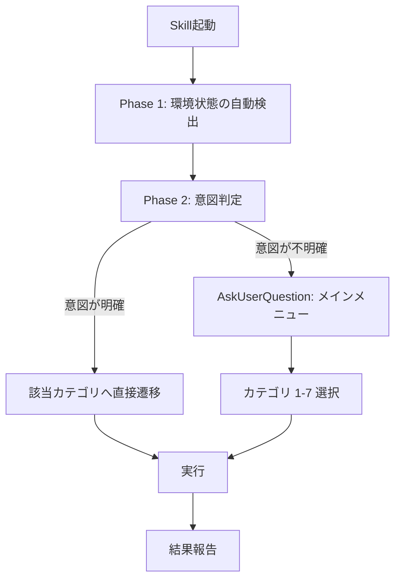

# インフラ環境メンテナンス Skill

## 概要

インフラ環境のセットアップ・メンテナンスを**対話的に**実行するSkillです。ローカル開発環境、Vercel、Neon、GitHub Actions、環境変数管理をカバーします。

## 参照ドキュメント

> **重要**: ドキュメントは**起動時に全て読まない**。選択されたカテゴリの実行時に、該当する参照ドキュメントのみを読むこと。各カテゴリの「参照ドキュメント」セクションに記載されたファイルが対象。

### 設計方針
- `docs/einja/steering/infrastructure/environment-variables.md`
- `docs/einja/steering/infrastructure/deployment.md`

### 手順書
- `docs/einja/instructions/environment-setup.md`
- `docs/einja/instructions/deployment-setup.md`
- `docs/einja/instructions/vercel-cli-reference.md`
- `docs/einja/instructions/neon-cli-reference.md`
- `docs/einja/instructions/local-server-environment-and-worktree.md`

> **Single Source of Truth**: このSkillは対話フローの定義であり、具体的なコマンド手順は各カテゴリの参照ドキュメントが正。

---

## 実行フロー



---

## Phase 1: 環境状態の自動検出

Skill起動時に以下を自動検出し、結果をユーザーに表示する。

```bash
# === ファイル存在確認 ===
for f in .env .env.local .env.keys .env.personal .env.develop .env.production .env.preview; do
  [ -f "$f" ] && echo "✅ $f" || echo "❌ $f"
done

# === CLI存在確認 ===
for cmd in vercel neonctl gh dotenvx docker; do
  command -v "$cmd" >/dev/null 2>&1 && echo "✅ $cmd" || echo "❌ $cmd"
done

# === Docker/PostgreSQL状態 ===
docker compose ps 2>/dev/null | grep postgres

# === 開発サーバー状態 ===
pnpm dev:status 2>/dev/null || echo "停止中"
```

検出結果をサマリー表示した上で、AskUserQuestionでメインメニューを表示する。

---

## Phase 2: 意図判定とメインメニュー

### 意図が明確な場合（質問せずに直接実行）

Skill起動時の引数やユーザーの指示から意図が読み取れる場合は、AskUserQuestionを使わずに該当カテゴリに直接進む。

**直接実行の例:**
- `/infra-maintenance Vercel初期設定` → カテゴリ3: Vercel管理へ直接遷移
- `/infra-maintenance ヘルスチェック` → カテゴリ6: 環境状態確認へ直接遷移
- `Neonのブランチを作成したい` → カテゴリ4: Neon管理へ直接遷移
- `GitHub Secretsを一括設定して` → カテゴリ5: GitHub Secrets管理へ直接遷移
- `環境変数を追加したい` → カテゴリ2: 環境変数管理へ直接遷移
- `CIが失敗してる` → カテゴリ7: GitHub Actions CI/CD管理へ直接遷移
- `ワークフローの実行状況を見たい` → カテゴリ7: GitHub Actions CI/CD管理へ直接遷移

### 意図が不明確な場合のみメニューを表示

引数がない、または意図が曖昧な場合のみ、AskUserQuestionで以下の選択肢を提示する。検出結果に基づいて推奨を表示する。

#### 検出結果に基づく推奨ロジック

Phase 1の検出結果から、推奨カテゴリにマーク（推奨）を付与してAskUserQuestionの選択肢に表示する。

| 検出結果 | 推奨カテゴリ |
|---------|------------|
| `.env.keys`不在 | ローカル環境セットアップ |
| 開発サーバー停止中 + `.env.keys`存在 | ローカル環境セットアップ |
| vercel CLI未インストール or 未リンク | Vercel管理 |
| neonctl未インストール | Neon管理 |
| `.env.personal`不在 | 環境変数管理 |
| 上記に該当しない | 環境状態確認（デフォルト） |

| 選択肢 | 説明 |
|--------|------|
| ローカル環境セットアップ | 初回セットアップ、開発サーバー起動 |
| 環境変数管理 | 個人トークン設定、チーム共有設定変更、新規変数追加 |
| Vercel管理 | 初期設定、環境変数同期、デプロイ状態確認 |
| Neon管理 | 初期設定、ブランチ管理、接続文字列取得 |
| GitHub Secrets管理 | 一覧表示、個別設定、一括設定 |
| 環境状態確認 | 包括的ヘルスチェック |
| GitHub Actions CI/CD管理 | ワークフロー状態確認、失敗調査、手動トリガー |

---

## カテゴリ1: ローカル環境セットアップ

### サブメニュー
- **初回セットアップ**: `pnpm dev:setup` 実行
- **開発サーバー起動**: `pnpm dev:bg` 実行
- **サーバー停止**: `pnpm dev:stop` 実行

### 実行手順

#### 初回セットアップ
1. `pnpm install` で依存関係インストール
2. `pnpm dev:setup` で環境セットアップ
3. エラー時: エラー内容を分析し、対話的にトラブルシュート

#### エラー時の対処

| エラー | 対処 |
|--------|------|
| `.env.keys`不在 | AskUserQuestion: 「メインworktreeからコピー or 手動配置」 |
| PostgreSQL接続エラー | `docker compose up -d postgres` → ヘルスチェック |
| Node.jsバージョン不一致 | `volta install node@22` 提案 |
| pnpmバージョン不一致 | `volta install pnpm@10` 提案 |

### 参照ドキュメント
- `docs/einja/instructions/local-server-environment-and-worktree.md`
- `docs/einja/instructions/environment-setup.md`

---

## カテゴリ2: 環境変数管理

### サブメニュー
- **個人トークン設定**: `.env.personal`にトークンを保存
- **チーム共有設定変更**: `.env.local`等の復号→編集→再暗号化
- **新規環境変数追加**: プロジェクト全体への変数追加フロー
- **環境変数の状態表示**: 現在の設定状態を表示

### 実行手順

#### 個人トークン設定
1. 必要なトークンをAskUserQuestionで確認:
   - `GITHUB_TOKEN`: https://github.com/settings/tokens/new
   - `VERCEL_TOKEN`: https://vercel.com/account/tokens
   - `NEON_API_KEY`: https://console.neon.tech/app/settings/api-keys
2. AskUserQuestionでトークン値を入力してもらう
3. `.env.personal`に保存
4. `chmod 600 .env.personal` 実行
5. API検証（可能な場合）:
   - GitHub: `gh auth status`
   - Vercel: `vercel whoami`
   - Neon: `neonctl projects list --api-key $NEON_API_KEY`

#### チーム共有設定変更
1. AskUserQuestionで対象ファイルを選択（.env.local / .env.develop / .env.production / .env.preview）
2. `dotenvx decrypt -f <file> --stdout > <file>.tmp`
3. 変更内容をAskUserQuestionで確認
4. 編集実行
5. `rm <file> && mv <file>.tmp <file>`
6. `dotenvx encrypt -f <file>`
7. コミット案内

#### 新規環境変数追加
1. AskUserQuestionで変数名・用途・対象環境（local/develop/production/preview）を確認
2. 対象環境に応じた`.env.*`ファイルを特定
3. 暗号化ファイルの場合: チーム共有設定変更と同じフロー（decrypt→編集→encrypt）
4. 非暗号化ファイルの場合（.env/.env.personal）: 直接編集
5. AskUserQuestion: 他環境への展開が必要か確認
6. コミット案内（チーム共有設定の場合）

> **詳細手順**: `docs/einja/instructions/environment-setup.md`の「新規環境変数を追加するとき」を参照

### 参照ドキュメント
- `docs/einja/instructions/environment-setup.md`

---

## カテゴリ3: Vercel管理

### サブメニュー
- **初期設定**: プロジェクト作成・リンク・Root Directory設定
- **環境変数同期**: dotenvx鍵のVercel同期
- **デプロイ状態確認**: 最新デプロイ情報表示

### 実行手順

#### 初期設定
1. VERCEL_TOKEN確認 → 未設定時はURL案内 + `.env.personal`保存
2. AskUserQuestionでアプリ選択（web / admin）
3. `vercel link --project=$NAME --yes` で接続
4. Root Directory設定:
   ```bash
   curl -X PATCH "https://api.vercel.com/v9/projects/$PROJECT_ID?teamId=$VERCEL_ORG_ID" \
     -H "Authorization: Bearer $VERCEL_TOKEN" \
     -H "Content-Type: application/json" \
     -d '{"rootDirectory": "apps/$APP_NAME"}'
   ```
5. プロジェクトID取得・表示

#### 環境変数同期
> **注意**: CI/CDではmainブランチのみ`vercel env add`で自動同期。develop/staging/PRは`--env`実行時注入。
> 以下の手動同期は**初回セットアップ時のみ**実行。

1. `.env.keys`からDOTENV_PRIVATE_KEY_*を抽出
2. AskUserQuestionで同期対象を確認（値はマスク表示）
3. 承認後、`vercel env rm` + `vercel env add` でVercelに同期
4. 設定結果を `vercel env ls` で確認

> **詳細手順**: `docs/einja/instructions/vercel-cli-reference.md`の「環境変数同期自動化」を参照

#### デプロイ状態確認
```bash
vercel ls
```

### 参照ドキュメント
- `docs/einja/instructions/vercel-cli-reference.md`
- `docs/einja/instructions/deployment-setup.md`

---

## カテゴリ4: Neon管理

### サブメニュー
- **初期設定**: プロジェクト作成・ブランチ戦略初期化
- **ブランチ管理**: 一覧表示・作成・削除
- **接続文字列取得**: 特定ブランチの接続URLを取得

### 実行手順

#### 初期設定
1. NEON_API_KEY確認 → 未設定時はURL案内 + `.env.personal`保存
   - 取得URL: https://console.neon.tech/app/settings/api-keys
   - **`neonctl auth`は使用しない**（理由: `docs/einja/instructions/neon-cli-reference.md`「認証方式」参照）→ `--api-key`フラグまたは`NEON_API_KEY`環境変数で認証
2. プロジェクト作成:
   ```bash
   neonctl projects create --name einja-management --region-id aws-ap-northeast-1 --api-key $NEON_API_KEY
   ```
3. NEON_PROJECT_IDを`.env.preview`に設定 → dotenvx暗号化
4. ブランチ戦略初期設定:
   - production（main）ブランチ確認
   - developmentブランチ作成

#### ブランチ管理
```bash
# 一覧
neonctl branches list --project-id $NEON_PROJECT_ID --api-key $NEON_API_KEY

# 作成
neonctl branches create --project-id $NEON_PROJECT_ID --name $NAME --api-key $NEON_API_KEY

# 削除
neonctl branches delete $BRANCH_ID --project-id $NEON_PROJECT_ID --api-key $NEON_API_KEY
```

#### 接続文字列取得
```bash
# CLI（単一ブランチ）
neonctl connection-string <branch-name> --project-id $NEON_PROJECT_ID --api-key $NEON_API_KEY

# API（複数ブランチ一括取得時）
curl -s "https://console.neon.tech/api/v2/projects/$NEON_PROJECT_ID/connection_uri?branch_id=$BRANCH_ID&database_name=neondb&role_name=$ROLE_NAME" \
  -H "Authorization: Bearer $NEON_API_KEY"
```

> **注意**: 孤立ブランチのクリーンアップは`cleanup-pr-preview-db.yml`ワークフローが自動実行するため、このSkillでは手動クリーンアップを提供しない。

### 参照ドキュメント
- `docs/einja/instructions/neon-cli-reference.md`
- `docs/einja/instructions/deployment-setup.md`

---

## カテゴリ5: GitHub Secrets管理

### サブメニュー
- **一覧表示**: 現在のSecrets一覧
- **個別設定**: 指定したSecretを設定
- **一括設定**: `.env.keys`からdotenvx秘密鍵を一括設定

### 実行手順

#### 一覧表示
```bash
gh secret list
```

#### 個別設定
1. AskUserQuestionでSecret名と値を入力
2. `gh secret set $NAME --body "<value>"`
3. 設定確認: `gh secret list`

#### 一括設定
```bash
# dotenvx秘密鍵を自動抽出してGitHub Secretsに設定
for key_name in PREVIEW PRODUCTION DEVELOP STAGING; do
  value=$(grep "DOTENV_PRIVATE_KEY_${key_name}" .env.keys | cut -d'=' -f2 | tr -d "\"'")
  if [ -n "$value" ]; then
    gh secret set "DOTENV_PRIVATE_KEY_${key_name}" --body "$value"
    echo "✅ DOTENV_PRIVATE_KEY_${key_name} を設定しました"
  else
    echo "⚠️ DOTENV_PRIVATE_KEY_${key_name} が .env.keys に見つかりません"
  fi
done
```

### 参照ドキュメント
- `docs/einja/instructions/deployment-setup.md`（セクション6: GitHub Secrets登録）

---

## カテゴリ6: 環境状態確認（ヘルスチェック）

### チェック対象

#### ローカル環境
```bash
# ランタイム
node --version
pnpm --version

# 環境変数ファイル
for f in .env .env.local .env.keys .env.personal; do
  [ -f "$f" ] && echo "✅ $f" || echo "❌ $f"
done

# Docker/PostgreSQL
docker compose ps
docker compose exec postgres pg_isready -U postgres

# 開発サーバー
pnpm dev:status

# CLIツール
for cmd in gh vercel neonctl dotenvx; do
  command -v "$cmd" >/dev/null 2>&1 && echo "✅ $cmd" || echo "❌ $cmd"
done
```

#### Vercel
```bash
vercel ls
```

#### Neon
```bash
neonctl branches list --project-id $NEON_PROJECT_ID --api-key $NEON_API_KEY
```

#### GitHub
```bash
gh secret list
gh run list --limit 5
```

### 結果表示

チェック結果を以下の形式でサマリー表示する:

```
=== 環境ヘルスチェック結果 ===

📦 ローカル環境
  ✅ Node.js 22.16.0
  ✅ pnpm 10.14.0
  ✅ PostgreSQL 起動中
  ✅ 開発サーバー 起動中 (port 3195)
  ❌ .env.personal 不在

🔧 CLI ツール
  ✅ gh 2.x
  ✅ vercel 37.x
  ❌ neonctl 未インストール
  ✅ dotenvx 1.x

☁️ Vercel
  ✅ 最新デプロイ: 2h ago (Ready)

🗄️ Neon
  ✅ ブランチ: 3個 (main, development, preview/feature-auth)

🔐 GitHub Secrets
  ✅ 10個のSecrets設定済み
  ✅ 最新CI: 成功 (2h ago)
```

### 推奨アクション提案

ヘルスチェック結果に❌がある場合、以下のルールで推奨アクションを提示する:

| 検出結果 | 推奨アクション |
|---------|--------------|
| `.env.keys`不在 / CLI未インストール | → カテゴリ1（ローカル環境セットアップ） |
| `.env.personal`不在 / トークン未設定 | → カテゴリ2（環境変数管理 > 個人トークン設定） |
| Vercel未リンク / デプロイエラー | → カテゴリ3（Vercel管理） |
| Neonブランチ取得失敗 | → カテゴリ4（Neon管理） |
| GitHub Secrets不足 | → カテゴリ5（GitHub Secrets管理） |
| CI失敗 | → カテゴリ7（GitHub Actions CI/CD管理 > 失敗調査） |

❌が3個以上の場合は「初期セットアップが必要です。カテゴリ1を実行してください」と表示。

### 参照ドキュメント
- `docs/einja/instructions/local-server-environment-and-worktree.md`（包括的ヘルスチェック）

---

## カテゴリ7: GitHub Actions CI/CD管理

### サブメニュー
- **ワークフロー状態確認**: 最新の実行結果一覧
- **失敗調査**: 失敗したワークフローのログ分析
- **手動トリガー**: ワークフローの手動実行
- **ワークフロー一覧**: 利用可能なワークフロー確認

### プロジェクトのワークフロー

| ワークフロー | ファイル | トリガー | 用途 | 備考 |
|------------|---------|---------|------|------|
| デプロイ（安定ブランチ） | `deploy-stable-branches.yml` | push to main/develop/staging | 動的マトリクス → 変更アプリのみデプロイ | mainのみenv sync、他は`--env`実行時注入 |
| PRプレビューデプロイ | `deploy-pr-preview.yml` | PR open/sync | PR毎のプレビュー環境作成 | `--env`実行時注入（env sync廃止） |
| PRプレビューDB削除 | `cleanup-pr-preview-db.yml` | schedule/manual | 孤立Neonブランチのクリーンアップ | PR未存在のブランチを自動削除 |
| PRクローズ時クリーンアップ | `cleanup-pr-preview-on-close.yml` | PR close | PR関連リソース削除 | Neonブランチ + Vercel Preview削除 |
| CLIリリース | `release-cli.yml` | manual | @einja/cli NPM公開 | workflow_dispatch対応 |
| create-einja-appリリース | `release-create-einja-app.yml` | manual | create-einja-app NPM公開 | workflow_dispatch対応 |
| Claude Code | `claude.yml` | issue comment | Claude Codeによる自動対応 | `/claude`コメントでトリガー |

### 実行手順

#### ワークフロー状態確認
```bash
# 最新の実行結果一覧
gh run list --limit 10

# 特定ワークフローの実行一覧
gh run list --workflow=deploy-stable-branches.yml --limit 5

# 実行中のワークフロー
gh run list --status=in_progress
```

#### 失敗調査
1. 失敗したワークフローの一覧を取得:
   ```bash
   gh run list --status=failure --limit 5
   ```
2. AskUserQuestionで調査対象のrun-idを選択
3. 失敗したジョブのログを表示:
   ```bash
   gh run view <run-id> --log-failed
   ```
4. **ログ分析→アクション提案**: エラーパターンに基づいてカテゴリ遷移を提案

| エラーパターン | 推奨アクション |
|---------------|---------------|
| `Secret not found: DOTENV_PRIVATE_KEY_*` | → カテゴリ5（GitHub Secrets管理）で一括設定 |
| `vercel deploy failed` | → カテゴリ3（Vercel管理）で状態確認 |
| `neonctl: authentication failed` | → カテゴリ5でNEON_API_KEY更新 |
| `Permission denied` | → `.github/workflows/`のpermissions設定確認を案内 |
| その他 | エラーログ全文を表示し、対処方法をAskUserQuestionで相談 |

#### 手動トリガー
```bash
# workflow_dispatch対応ワークフローを手動実行
gh workflow run <workflow-file> --ref <branch>

# 入力パラメータ付き
gh workflow run <workflow-file> --ref <branch> -f param1=value1

# PRプレビューDBクリーンアップの手動実行
gh workflow run cleanup-pr-preview-db.yml --ref main
```

#### ワークフロー一覧
```bash
# 利用可能なワークフロー一覧
gh workflow list

# 特定ワークフローの詳細
gh workflow view <workflow-file>
```

### エラー時の対処

| エラー | 対処 |
|--------|------|
| デプロイ失敗 | `gh run view <id> --log-failed` でログ確認 → 原因特定 |
| Secrets不足 | カテゴリ5（GitHub Secrets管理）で設定 |
| 環境変数同期失敗 | dotenvx秘密鍵のSecret設定を確認 |
| Neonブランチ作成失敗 | NEON_API_KEY のSecret設定・有効期限を確認 |
| Permission denied | ワークフローのpermissions設定を確認 |

### 参照ドキュメント
- `.github/workflows/` 内の各ワークフローファイル
- `docs/einja/instructions/deployment-setup.md`
- `docs/einja/steering/infrastructure/deployment.md`

---

## セキュリティ考慮事項

### トークン・API Keyの管理

| トークン | 保存先 | セキュリティ |
|---------|--------|------------|
| VERCEL_TOKEN | `.env.personal` | gitignore対象、`chmod 600`設定 |
| NEON_API_KEY | `.env.personal` | gitignore対象、`chmod 600`設定 |
| GITHUB_TOKEN | `.env.personal` | gitignore対象、`chmod 600`設定 |
| DOTENV_PRIVATE_KEY_* | `.env.keys` | gitignore対象、1Password等で共有 |
| NEON_PROJECT_ID | `.env.preview`（暗号化） | dotenvx暗号化、Git管理 |

**必須**: トークン保存後は `chmod 600 .env.personal` を実行すること。

### CLI vs REST API 使い分け

| 操作 | 方式 | 理由 |
|------|------|------|
| Vercel プロジェクト操作 | CLI (`vercel link --yes`) | 認証簡単、非対話モード対応 |
| Vercel Root Directory設定 | API (`PATCH /v9/projects/{id}`) | CLIでは不可 |
| Vercel 標準環境変数 | CLI (`vercel env add/rm`) | バッチ対応 |
| Neon ブランチ操作 | CLI (`neonctl --api-key`) | 環境変数認証で非対話実行可 |
| Neon 接続URL取得 | CLI + API | CLI: 単一ブランチ、API: 一括取得 |
| GitHub Secrets | CLI (`gh secret set`) | API暗号化が複雑 |
| GitHub Actions監視 | CLI (`gh run list/view`) | フォーマット良好 |

---

## エラーハンドリング

| エラー種別 | 対処 |
|-----------|------|
| CLI未インストール | AskUserQuestionで自動インストール提案（`npm i -g <cli>`等） |
| トークン未設定/無効 | 取得URL案内 → `.env.personal`への保存フロー |
| API呼び出し失敗 | エラー内容表示 → リトライ or 代替手段提示 |
| dotenvx復号失敗 | `.env.keys`確認 → 秘密鍵再設定ガイド |
| ネットワークエラー | 3回リトライ → 失敗時は手動手順提示 |

---

## 既存ワークフローとの整合性

### 競合回避ルール

- **環境変数同期**: `vercel env add`によるVercel環境変数ストアへの書き込みはmainブランチのみ。develop/staging/PRは`vercel deploy --env`で実行時注入（並行デプロイ間の競合防止）
- **初回セットアップ**: Skillでは初回セットアップ時のみ手動同期。以降はGitHub Actionsが自動管理
- **Neonブランチクリーンアップ**: `cleanup-pr-preview-db.yml`が定期実行。Skillでは手動クリーンアップは提供しない
- **GitHub Secrets更新**: Skillで設定した値はワークフローでそのまま使用される（同じdotenvxコマンド体系）

---

## 初版で除外する機能

以下の機能は将来版で対応予定:

| 機能 | 除外理由 | 対応方針 |
|------|---------|---------|
| トークンローテーション | 手順書にドキュメント化のみで十分 | `environment-setup.md`を参照 |
| Vercelカスタム環境操作 | API仕様の安定性要調査 | 安定確認後に追加 |
| Neon孤立ブランチ手動クリーンアップ | 既存ワークフローに任せる | `cleanup-pr-preview-db.yml`が担当 |

<!-- @einja:project-private:start id="einja-infra-maintenance-project" -->
<!-- プロジェクト固有の情報を記入 -->
<!-- @einja:project-private:end -->
