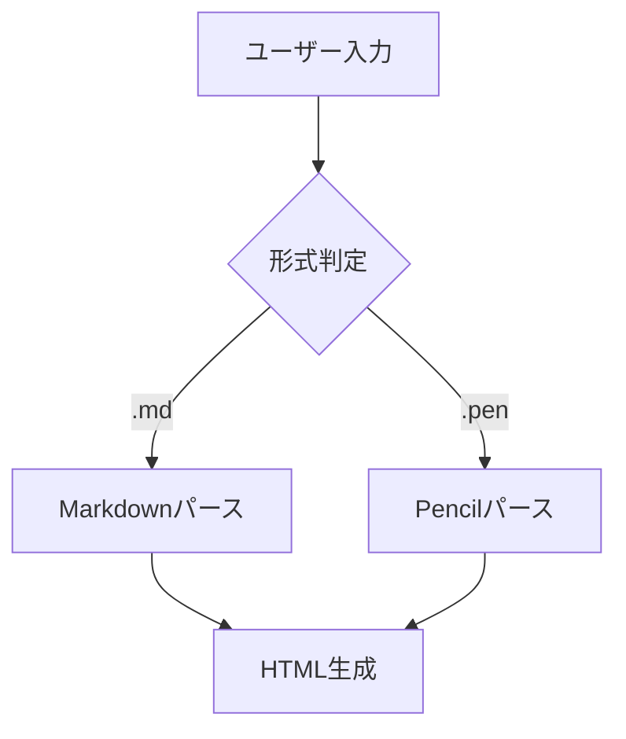
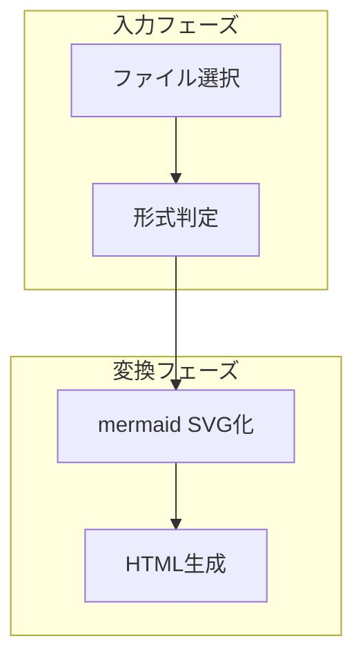

# Mermaid 図デザインガイド

仕様書 PDF やスライドに埋め込まれる mermaid 図が、「人間が見て理解しやすい」配置・配色になるための設計方針と書き方ガイド。

---

## 1. 設計目標

| 目標 | 基準 |
|------|------|
| 印刷物として読みやすい | 最小フォント 14pt、コントラスト比 4.5:1 以上（WCAG AA） |
| 色覚多様性に配慮 | 赤・緑の同時使用を避け、青／橙基調とする |
| 仕様書との統一感 | 見出し下線などの青系カラーと同一トーンを使用 |
| A4 幅にフィット | `useMaxWidth: true` で自動リサイズ |
| 図ごとのサイズばらつきを最小化 | ノード間隔・余白を統一値で固定 |

---

## 2. 配色方針

### 2.1 カラーパレット

| 役割 | カラーコード | 用途 |
|------|------------|------|
| Primary 背景 | `#dbeafe` | 主要ノード背景（薄い青） |
| Primary ボーダー | `#2563eb` | 主要ノード枠線（青） |
| Primary テキスト | `#1e3a8a` | 主要ノードラベル（濃い青） |
| Secondary 背景 | `#d1fae5` | 補助ノード背景（薄い緑） |
| Secondary ボーダー | `#10b981` | 補助ノード枠線（緑） |
| Secondary テキスト | `#065f46` | 補助ノードラベル（濃い緑） |
| Tertiary 背景 | `#fef3c7` | 強調ノード背景（薄い橙） |
| Tertiary ボーダー | `#f59e0b` | 強調ノード枠線（橙） |
| Tertiary テキスト | `#92400e` | 強調ノードラベル（濃い橙） |
| エッジ（矢印・線） | `#6b7280` | 矢印・接続線（グレー） |
| エッジラベル背景 | `#ffffff` | ラベルの視認性確保 |
| ノートブロック背景 | `#fef9c3` | シーケンス図の Note ブロック |

### 2.2 色覚多様性への配慮

- **主軸**: Primary（青）と Tertiary（橙）の対比を使う。P 型・D 型でも識別可能。
- **補助**: Secondary（緑）は単体で意味を持たせず、形状やラベルと組み合わせて使う。
- **禁止**: 赤と緑を同一図内で対比に使わない。

### 2.3 コントラスト比

| 組み合わせ | コントラスト比 | 基準 |
|-----------|-------------|------|
| `#1e3a8a` / `#dbeafe` | 約 7.3:1 | WCAG AAA 達成 |
| `#065f46` / `#d1fae5` | 約 6.1:1 | WCAG AA 達成 |
| `#92400e` / `#fef3c7` | 約 5.9:1 | WCAG AA 達成 |

---

## 3. タイポグラフィ

### 3.1 フォントファミリー

```
'Hiragino Sans', 'Helvetica Neue', Arial, sans-serif
```

### 3.2 フォントサイズ

- ベース: `14px`（PDF 換算で約 10.5pt）
- gantt / er は情報量が多いため `13px` に調整

---

## 4. レイアウト・配置

### 4.1 ノード間隔

| キー | 値 | 意味 |
|------|----|------|
| `flowchart.nodeSpacing` | 50 | 同一ランク内のノード間水平間隔（px） |
| `flowchart.rankSpacing` | 80 | 異なるランク間の垂直間隔（px） |
| `flowchart.padding` | 15 | ノードの内側余白（px） |

### 4.2 曲線スタイル

`curve: "basis"` を指定するとエッジがベジェ曲線になり、視覚的なノイズが少なくなる。

### 4.3 useMaxWidth

`useMaxWidth: true` を全図種に設定。SVG の width 属性をコンテナ幅に依存させ、自動リサイズ。

### 4.4 背景透過

`themeVariables.background: "transparent"` を設定。埋め込み先の背景色を引き継ぐ。

---

## 5. ノード形状の使い分け

| 形状 | 記法 | 推奨用途 |
|------|------|---------|
| 矩形 | `[処理名]` | 処理・ステップ・コンポーネント |
| 菱形 | `{条件}` | 分岐・判断ポイント |
| 角丸矩形 | `(ラウンド)` | 開始・終了の代替 |
| スタジアム | `([スタジアム])` | 開始・終了イベント |
| 二重矩形 | `[[サブルーチン]]` | サブルーチン・関数呼び出し |
| 円筒 | `[(データベース)]` | DB・ストレージ |
| 円 | `((円))` | 開始・終了（UML 的） |
| 平行四辺形 | `[/入力/]` | 入力・出力データ |

**原則**: 1 つの図内で形状の種類は 3 種類以内。

---

## 6. ユーザー向け書き方ガイド

### 6.1 良い例（5〜10 文字、動詞＋名詞）



### 6.2 Subgraph の活用



### 6.3 情報量の制御

- ノード数: 10 個以内
- エッジ数: 15 本以内
- subgraph 数: 4 個以内

### 6.4 方向の選択

| 方向 | 記法 | 推奨ケース |
|------|------|----------|
| 上から下 | `TD` | プロセスフロー、階層構造（最頻用途） |
| 左から右 | `LR` | 短いパイプライン、横長の時系列 |

---

## 7. 図種別最適化ポイント

### 7.1 flowchart
- 方向は `TD`（上→下）を基本
- 複雑な分岐は subgraph で論理グループ化

### 7.2 sequenceDiagram
- 参加者（actor）は 3〜5 名以内
- `alt` / `else` で条件分岐を明示
- `loop` で繰り返しを明示

### 7.3 classDiagram
- クラス数は 8 個以内
- 関係: `<|--` 継承、`*--` コンポジション、`o--` 集約、`-->` 依存

### 7.4 erDiagram
- 主要エンティティのみ（10 個以内）
- 関連の多重度を必ず記述

### 7.5 gantt
- 期間 1ヶ月以内: `axisFormat %m/%d`
- 期間 3ヶ月以上: `axisFormat %Y/%m`

### 7.6 stateDiagram-v2
- 状態数は 8 以内
- 開始状態 `[*]`、終了状態 `[*]` を必ず記述

---

## 8. アクセシビリティ

### 8.1 色だけに頼らない情報伝達

| NG | OK |
|----|-----|
| 赤ノード = エラー、緑ノード = 成功 | 菱形ノード `{エラー判定}` + エッジラベル `成功 / 失敗` |

### 8.2 図のキャプション

図には必ず本文またはキャプションで言及する。

---

## 9. mermaid-config.json リファレンス

### 9.1 themeVariables

| キー | 説明 | 推奨値 |
|------|------|--------|
| `primaryColor` | 主要ノード背景色 | `"#dbeafe"` |
| `primaryTextColor` | 主要ノードのテキスト色 | `"#1e3a8a"` |
| `primaryBorderColor` | 主要ノードの枠線色 | `"#2563eb"` |
| `secondaryColor` | 補助ノード背景色 | `"#d1fae5"` |
| `tertiaryColor` | 強調ノード背景色 | `"#fef3c7"` |
| `lineColor` | エッジ（矢印・線）の色 | `"#6b7280"` |
| `fontFamily` | フォントファミリー | `"'Hiragino Sans', ..."` |
| `fontSize` | ベースフォントサイズ | `"14px"` |
| `background` | 全体の背景色 | `"transparent"` |

### 9.2 flowchart

| キー | 説明 | 推奨値 |
|------|------|--------|
| `nodeSpacing` | 同一ランク内のノード間水平間隔（px） | 50 |
| `rankSpacing` | 異なるランク間の垂直間隔（px） | 80 |
| `curve` | エッジの曲線タイプ | `"basis"` |
| `padding` | ノード内側余白（px） | 15 |
| `useMaxWidth` | コンテナ幅にフィットさせるか | `true` |

### 9.3 sequence

| キー | 説明 | 推奨値 |
|------|------|--------|
| `actorMargin` | Actor 間の水平余白（px） | 60 |
| `messageMargin` | メッセージ間の垂直間隔（px） | 35 |
| `useMaxWidth` | コンテナ幅フィット | `true` |

---

## 10. 既知の制限

### 10.1 mmdc バージョン依存
`themeVariables` の一部キーは mmdc 9.x 以降で有効。古いバージョンでは無視される。

### 10.2 日本語フォント
Chromium に日本語フォントがない CI 環境では豆腐（□）になる場合がある。

### 10.3 背景透過と PDF 埋め込み
SVG 埋め込みでは有効だが、PNG 書き出し時は白背景の方が安全。
