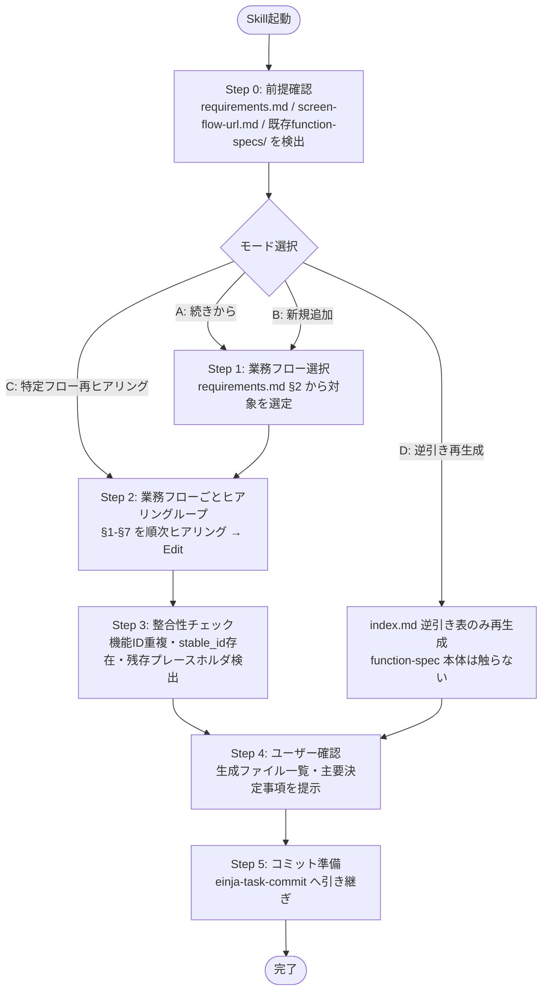

<!-- 参考: .claude/skills/einja-project-requirements/SKILL.md (AskUserQuestion 質問単位ヒアリング・再開検出・Edit ループ) -->
<!-- 参考: .claude/skills/einja-project-screen-flow-figma/SKILL.md (manifest schema・stable_id・冪等性ポリシー) -->
<!-- 入力ソース1: docs/project/requirements.md（einja-project-requirements 出力） -->
<!-- 入力ソース2: docs/project/screen-flow-url.md（einja-project-screen-flow-figma 出力） -->

# einja-project-function-spec: 業務フロー機能仕様（業務観点 + システム観点）生成 Skill

## あなたの役割

システム受託開発のシニアITコンサルタント兼業務分析担当として、**業務フロー + 詳細システムフロー単位の機能仕様書群**（`docs/project/function-specs/index.md` + `function-spec-{flow_id}.md`）を、`docs/project/requirements.md` と `docs/project/screen-flow-url.md` をベース入力に段階的なヒアリングで作成します。

業務観点（人系アクター中心のストーリー）に加え、画面イベント単位のシステム挙動（画面表示時のデータ取得・フォーム送信・バリデーション・業務エラー・非同期反映）を4層 participant（Browser / Backend / DB / 外部システム）で記述し、要件定義と design.md / Issue 仕様 / 画面仕様の橋渡しを担います。生成物は業務フロー横断で機能・画面・データの流れを可視化し、クライアント・PM・開発者の共通言語となるドキュメントです。

## 既存Skillとの違い（重要）

| Skill | 対象 | スコープ | 配置先 |
|-------|------|---------|--------|
| `einja-project-requirements` | プロジェクト全体（クライアント合意用） | 業務要件・システム化方針・スコープ・機能サマリ等の §1〜§16 | `docs/project/requirements.md` |
| `einja-project-screen-flow-figma` | プロジェクト全体（画面遷移俯瞰） | 画面ノード集合・遷移エッジを Figma 上に生成 | `docs/project/screen-flow-url.md` |
| **`einja-project-function-spec`（本Skill）** | **プロジェクト全体（業務フロー + 詳細システムフロー単位の機能仕様）** | 業務フロー詳細（業務観点 + システム観点 sequenceDiagram + ステップ表）・機能一覧（FN-XXX）・機能カード・データの流れ・業務ルール + 主要技術制約・関連画面 | `docs/project/function-specs/index.md` + `function-spec-{flow_id}.md` |
| `einja-project-screen-spec`（**Phase 4 未実装**） | プロジェクト全体（画面単位 UI 仕様） | ワイヤーフレーム / 項目定義（型・桁・必須・選択肢・初期値）/ メッセージ文言 / 遷移ボタン配置・遷移条件 / UI 状態（ローディング・無効化等） | （未定。Phase 4 で別 Plan 設計） |
| `einja-issue-spec-create` Phase 1（`requirements-generator` エージェント） | 機能/Issue単位（ATDD要件） | UI/AC/権限/データモデル等の §1-§14 | `docs/specs/issues/{category}/issue{N}-{name}/requirements.md` |

「機能を作りたい」「Issueの仕様を作りたい」場合は本Skillではなく `einja-issue-spec-create` を使用すること。本Skillは**プロジェクト全体の業務フロー横断仕様**専用です。

## 用語の使い分け

| 用語 | 指すもの |
|------|---------|
| 業務フロー機能仕様書（function-spec） | `function-spec-{flow_id}.md`（1業務フロー1ファイル） |
| プロジェクト機能仕様 一覧（index） | `function-specs/index.md`（manifest + 逆引き表） |
| 機能仕様書群 | 上記2種の総称 |
| 業務フロー | requirements.md §2 のTO-BE業務フロー単位 |
| 機能（FN-XXX） | プロジェクト全体で一意採番される機能エンティティ |

## 重要な原則

1. **クライアント／開発両面で読まれる文書**: 受託側PM・業務担当者・開発者の全員が参照可能な粒度。専門用語に過度に偏らず、技術的詳細は §7 設計フェーズへの申し送りに分離する
2. **§6 への書き戻し禁止**: `requirements.md` §6 機能要件サマリは**参照のみ**。本Skillは独立採番 `FN-XXX` で機能IDを運用し、`requirements.md` を Edit してはいけない（`einja-project-requirements` の独立性保持）
3. **画面 stable_id への双方向追跡**: `screen-flow-url.md` の `stable_id`（例: `attendance-saas__dashboard`）を関連画面参照キーとして用い、index.md に画面別逆引き表を生成する
4. **業務フロー単位の独立性**: 1業務フロー = 1ファイル（`function-spec-{flow_id}.md`）。flow_id は `screen-flow-url.md` の `stable_id` 命名規則と整合（`{project_name}__flow__{snake_case_flow_name}`）
5. **sequenceDiagram新規記述（§2.1 業務観点 + §2.2 システム観点 の二段構成を必須とする）**: `requirements.md §2.1.2` の flowchart からの自動変換は行わない。アクター・メッセージ・分岐をヒアリングで埋めていく（mermaid `sequenceDiagram` 記法を標準とする）。§2.1 は業務観点（人系アクター中心のメッセージ授受）、§2.2 はシステム観点（4層 participant の画面イベント単位インタラクション）として **両方を必ず生成する**（`system_flow: omitted` 時を除く）
6. **AskUserQuestion 2層記述**: 各選択肢は `description`（What: 何をするか）と `Note:`（So What: 選ぶとどうなるか、メリット/デメリット/注意点）を必ず含め、最後に **「その他（自由入力）」** を必ず加える
7. **推測禁止**: 業務フロー範囲・優先度・アクター・例外処理はユーザーにしか決められない。AskUserQuestion で必ず確認する。技術的事実（requirements.md 内容・screen-flow-url.md 内容）は Read/Grep で自力解決可
8. **内部実装詳細の取り扱い境界**: §2.2 システム観点では「同一TX」「Best-effort」レベルのトランザクション境界宣言までを本Skillで扱う。具体的なロック方式（楽観/悲観）・BEGIN/COMMIT 位置・テーブル名 / カラム名 / 正規表現 / HTTP ステータスコードは §7 申し送りに分離し、design.md / Issue 仕様で確定する
9. **画面イベント駆動の粒度**: §2.2 システム観点 sequenceDiagram は「画面表示」「フォーム送信」「バリデーションエラー」「業務エラー」「非同期反映」を画面イベント単位で記述する。技術的なミドルウェア層（ロードバランサー・キャッシュサーバー等）の挙動は §7 申し送りに分離する
10. **脅威モデリングの申し送り（threat-modeling gate）**: 認証・権限・特権操作・外部連携・外部入力を扱う業務フローでは、セキュリティ上注意すべき点（authz 境界 / secrets 露出 / runtime 入力→危険 sink（path-traversal 等）/ admin・control-plane 露出 / token scope・privilege）を §7 設計フェーズ申し送りに明記する。詳細な脅威分析・対策は本 Skill では行わず、design.md「Threat Model & Security Considerations」セクション（`docs/einja/templates/design.md.template`）に引き継ぐ。設計段階で先に脅威を捕まえ、実装中の発覚を防ぐことが目的

### §2.2 canonical participant 名（固定）

§2.2 システム観点 sequenceDiagram の `participant` **識別子**は以下の canonical fixed names を使用すること。任意の別名（例: `App`、`Server`、`Database` 等）は禁止する。

| パターン | participant 識別子構成 | 適用フロー例 |
|---------|----------------|------------|
| 4層（標準） | `Browser` / `Backend` / `DB` / `Ext`（外部システム用） | 通常の CRUD + 外部連携を含むフロー |
| 3層（外部連携なし） | `Browser` / `Backend` / `DB` | 単一システム内完結のフロー |
| 3層（Browser なし・バッチ起動） | `Backend` / `DB` / `Ext` | バッチ実行・スケジューラ起動フロー（Browser を介さない） |

**識別子と表示名の使い分け**:

- **識別子**（`participant` 直後）は canonical 名（`Browser` / `Backend` / `DB` / `Ext`）で固定する
- **表示名**（`as` 右辺）は当該フローの画面名・通称を併記してよい（例: `participant Browser as 打刻画面`）
- 外部システムの識別子は `Ext` を使用し、表示名で具体名（通知配信基盤・バッチエンジン・給与SaaS等）を記述する（例: `participant Ext as 通知配信基盤`）
- 機能仕様書全体で識別子の表記を統一する（表示名は各フローの文脈に合わせて差別化してよい）

## ワークフロー全体図



## タスク管理

TaskCreateツールを使用して全体の進捗を可視化します:
- 各ステップ（前提確認 / 対象業務フロー選択 / 業務フロー別ヒアリング Q1〜Q7 / 整合性チェック / ユーザー確認 / コミット）をトップレベルタスクとして管理
- 1業務フロー = 1サブタスク群として登録（並列ヒアリングは行わない。1フロー完了 → 次フローの順次進行）
- 各ステップ開始前にタスクを `in_progress` に更新、完了後に `completed` に更新

## 実行手順

### Step 0: 前提確認

#### 0.1 入力ファイル存在チェック

1. `docs/project/requirements.md` の存在を Read で確認する
2. **未存在の場合**: 致命的エラー扱い。以下のメッセージを出して中断:
   > 「`docs/project/requirements.md` が存在しません。本Skillは要件定義書をベース入力としています。先に `/einja-project-requirements` を実行してください。」
3. `docs/project/screen-flow-url.md` の存在を Read で確認する
4. **未存在の場合**: 警告のみで生成継続:
   > 「`docs/project/screen-flow-url.md` が存在しません。画面別逆引き表は空、各 function-spec の `related_screens` も空配列で出力されます。後から `/einja-project-screen-flow-figma` を実行後、本Skillを再実行（『逆引き再生成モード』）すると、画面参照を追記できます。」

#### 0.2 既存 function-specs/ 検出 + モード推定

1. `docs/project/function-specs/index.md` の存在を Read で確認する
2. **未存在の場合**: 「未存在 / 新規」状態として扱い、0.3 モード選択をスキップしてそのまま Step 1 へ進む（モード = 新規）
3. **存在する場合**:
   a. `index.md` の frontmatter から `function_specs[]` を取得し、各 entry の `status`（`draft` / `review` / `approved`）を集計
   b. 各 `function-spec-{flow_id}.md` を Read して残存プレースホルダ（`\[ [^\]]+? \]` 形式）を検出し、「未完了フロー」を特定。**ただし mermaid コードブロック（` ```mermaid` 〜 ` ``` `）内の `[ ... ]` 表記（flowchart ノード記法 `Browser[ 画面名 ]` 等）はプレースホルダ検出対象外とし、判定は mermaid ブロック外に限定する**
   c. 推定結果を 0.3 のモード選択質問文に含める

#### 0.3 モード選択（既存ありの場合のみ）

AskUserQuestionで以下を確認する:

```
質問: "function-specs/ が既存です（進行状況: {推定結果}）。生成モードを選択してください。"
ヘッダー: "生成モード"
選択肢:
  - A: 続きから（未完了フローを再開）
    description: 残存プレースホルダがあるフローを優先してヒアリング再開
    Note: 既存記述を保持し、未確定セクションのみ Edit する。中断していたセッションの続きに最適
  - B: 新しい業務フローを追加
    description: 既存フローは触らず、新規業務フローを追加生成する
    Note: requirements.md §2 に新業務フローが追加された場合、または初版で漏れた業務フローを追加する場合に使用
  - C: 特定フローを再ヒアリング
    description: 既存の特定フローを選択し、Q1〜Q7 を最初からやり直す
    Note: 該当 function-spec ファイルは `.bak` 退避後、テンプレから Write し直す。stable_id は維持
  - D: 逆引き再生成モード（screen-flow-url.md 事後更新の反映）
    description: function-spec 本体は触らず、index.md の画面別逆引き表のみ最新の screen-flow-url.md から再生成する
    Note: screen-flow-url.md を後から作成・更新した場合に使用。各 function-spec の本文・FN-XXX は変更されない
  - E: その他（自由入力）
    description: 上記以外（特定フローの一部章のみ修正等）
    Note: 自由入力解析後、最も近い動作にマッピング
```

「C: 特定フロー再ヒアリング」「B: 新規追加」を選んだ場合は、続けて Step 1 で対象フローを確定する。
「D: 逆引き再生成モード」を選んだ場合は Step 1〜2 をスキップして Step 3.2 「画面別逆引き表の再生成」のみ実行する。

#### 0.4 ディレクトリ準備

`docs/project/function-specs/` が存在しない場合は Bash で `mkdir -p docs/project/function-specs` を実行する。

### Step 1: 対象業務フロー選択

`docs/project/requirements.md` の §2 業務フロー一覧から対象業務フローをAskUserQuestionで確定する。
**自動抽出は行わず、ユーザーが指定する**（初版スコープ外）。

1. `requirements.md` を Read し、§2 配下の見出し（`### 2.1.2 TO-BE 業務フロー` 等）と §2.2 業務課題と解決方針の表から、業務フローの候補名を提示用にリストアップ（参考情報として）
2. 加えて §2.1.2 mermaid `flowchart` の subgraph 名（例: 「従業員」「上長」「人事部」）も補助参考情報として表示
3. AskUserQuestion で以下を質問:

```
質問: "今回ヒアリング対象とする業務フローを選択してください。1回の実行で複数選択可ですが、ヒアリングは1フローずつ順次進めます。"
ヘッダー: "対象業務フロー"
multiSelect: true
選択肢:
  - {requirements.md §2 から抽出した業務フロー候補名（最大4件）}
    description: §2 業務フロー一覧から推定された業務フロー
    Note: 不要なら未選択でOK。選択フローを 1 つずつ Q1〜Q7 でヒアリングする
  - その他（自由入力）
    description: 上記以外の業務フローを自由入力で指定
    Note: 業務フロー名を自由記述。複数の場合はカンマ区切り
```

4. ユーザー入力を元に、各業務フローの `flow_id` を確定する:
   - `flow_id` 命名規則: `{project_name}__flow__{snake_case_flow_name}`（例: `attendance-saas__flow__time_punch_approval`）
   - `project_name` は `requirements.md` または `screen-flow-url.md` frontmatter から取得（kebab-case）。両方存在しない場合は AskUserQuestion で確認
5. `flow_id` の重複チェック: 既存 `index.md` の `function_specs[]` と突合し、衝突時は AskUserQuestion で別名を確認

### Step 2: 業務フロー別ヒアリングループ

`references/hearing-checklist.md` を Read し、質問テンプレ + 「質問ID → セクションマッピング」を取得して、各業務フローについて Q1 → Q7 を順次ヒアリングする。

**重要**: 各回答ごとに `function-spec-{flow_id}.md` をその場で Edit するため、セッションが中断されても回答済み内容はディスクに残る。次回起動時は Step 0 の推定で続きから再開できる。

#### 2.1 業務フロー単位の初期化

各業務フロー開始時に以下を実行:

1. `references/output-template.md` を Read し、テンプレ全文を取得
2. 当該フロー用の `docs/project/function-specs/function-spec-{flow_id}.md` を Write
   - 既存ファイルがある（モード C 特定フロー再ヒアリング）場合は `function-spec-{flow_id}.md.regen.YYYYMMDDhhmm.bak` として退避後、上書き
3. frontmatter にこの時点で確定している値（`flow_id` / `project_name` / `generated_at` / `status: draft`）を埋める
4. index.md にこの業務フローのエントリ追加が必要なら、後の Step 3.1 で一括更新する（ここでは触らない）

#### 2.2 質問単位ループの本体

`references/hearing-checklist.md` の「質問ID → セクションマッピング」記載順（Q1 → Q7）で、以下を繰り返す:

1. `references/hearing-checklist.md` から該当質問IDの質問文・選択肢を取得
2. AskUserQuestion を1問実行（質問固有の選択肢に加えて、以下3つを必須で追加）:
   - **「スキップ（後回し）」**: プレースホルダを残して次の質問へ進む（Step 3 で残存検出される）
   - **「該当なし（恒久スキップ）」**: プレースホルダを `<!-- SKIPPED: 該当なし -->` に置換して次へ
   - **「その他（自由入力）」**: 既存の自由入力欄
3. 回答に応じて Edit を実行（実装ルールは 2.3 参照）
4. 進捗を1行アナウンス: `[Q{x} 完了 → §{主セクション} ({flow_id}) を更新しました]`
5. 回答が薄い・曖昧な場合のみ**当該質問に対して最大1回**の追加確認を行ってよい（複数質問にまたがる追加確認は禁止）

#### 2.3 Edit 実装ルール

各 Edit は以下の手順で行う:

1. **アンカー構築**: マッピング表の「直前見出し」を `old_string` の先頭行に置く。その直下のプレースホルダ含む代表行を続けてペアにし、`old_string` を一意化する
2. **主セクション置換**: `old_string` = 直前見出し + プレースホルダ行ペア、`new_string` = 直前見出し + ユーザー回答整形後の本文
3. **波及セクション追加 Edit**: マッピング表に「波及セクション」が記載されている質問は、主セクションを Edit した後、波及セクションのテンプレ部分も別 Edit で更新する
4. **「該当なし」回答時**: プレースホルダを `<!-- SKIPPED: 該当なし -->` で置換する
5. **「スキップ（後回し）」回答時**: Edit を実行しない（プレースホルダをそのまま残す）
6. `replace_all: false` を厳守する（複数セクションへの誤適用を防ぐ）
7. **mermaid sequenceDiagram の Edit（§2.1 業務観点 + §2.2 システム観点 の二段構成）**:
   - §2.1 業務観点 sequenceDiagram: Q3「アクター」「メッセージ授受」「分岐・例外」回答の組み合わせから組み立てる（人系アクター中心）
   - §2.2 システム観点 sequenceDiagram: `Browser` / `Backend` / `DB` / `外部システム` の 4 層 participant を基本とし、Q3 + Q3-S1（画面イベント単位のデータ取得・送信タイミング）+ Q4-S1（主要バリデーション）+ Q5-S1（業務エラーパターン）+ Q5-S2（非同期処理）+ Q5-S3（トランザクション境界）の回答から構築する
   - canonical participant 名（固定）は「§2.2 canonical participant 名（固定）」セクション参照
   - `system_flow: omitted` の場合は §2.2 を `<!-- SKIPPED: 該当なし -->` で置換し、§2.1 のみ生成する
   - 詳細記法例は `references/output-template.md` の「sequenceDiagram 記述例」（§2.1 用 2 本 + §2.2 用 2 本）を参照
8. **§3.2 機能カードの Edit**: §3.1 機能サマリ表で MUST 判定された機能のみ §3.2 機能カードを生成する。SHOULD / MAY は §3.1 のサマリ行のみで可。機能カードは `#### FN-XXX [機能名]` 単位で Edit を分割し、複数機能の一括置換は禁止。処理ステップが §2.2 で詳細記述済みの場合は「§2.2 ステップ N 参照」リダイレクトで可
9. **§5.4 主要技術制約の Edit**: Q4-S1（主要バリデーション）+ Q5-S1（業務エラーパターン）+ Q5-S3（トランザクション境界）の回答から行単位で Edit する。テーブル全体置換は禁止。具体的な桁数値・正規表現・実装方式は §7 申し送りに分離する
10. **Edit 失敗時のフォールバック**:
    1. Edit が `old_string` 不一致で失敗した場合、対象セクションを Read してアンカー文字列を実体から再構築し、最大2回までリトライする
    2. それでも失敗する場合は当該質問を「スキップ（後回し）」扱いとして次質問へ進み、Step 3 残存検出に委ねる

#### 2.4 業務フロー境界の必須確認

各業務フローの Q7（最終質問）完了直後に、AskUserQuestion で以下を提示する:

```
質問: "業務フロー『{flow display name}』のヒアリングが完了しました。次の動作を選択してください。"
ヘッダー: "業務フロー境界"
選択肢:
  - A: 次の業務フローへ進む
    description: Step 1 で選択した次フローのヒアリングへ進む
    Note: 全フロー完了で Step 3 整合性チェックへ
  - B: 一旦中断（次回続きから再開可能）
    description: Skill をここで終了。次回起動時に「続きから」モードで再開できる
    Note: ディスク上の各 function-spec ファイルには回答済み内容が反映済み。コミット未実施
  - C: 途中で確定して整合性チェックへ進む
    description: 残った業務フローは未着手のまま、Step 3 整合性チェック → Step 4 ユーザー確認のフルフローへ進む
    Note: 未着手フローは index.md に登録されない
  - D: その他（自由入力）
    description: 上記以外（特定フローへ戻る等）
    Note: 自由入力解析後、最も近い動作にマッピング
```

### Step 3: 整合性チェック

#### 3.1 index.md の生成・更新

1. `references/manifest-schema.md` を Read し、index.md frontmatter スキーマと body 構造を取得
2. 全業務フローを走査して `function_specs[]` の配列を構築:
   - `flow_id` / `file` / `title` / `status`（残存プレースホルダがあれば `draft`、なければ `review`。残存プレースホルダ判定では mermaid ブロック内の `[ ... ]` 記法を対象外とする）
   - `system_flow`: function-spec frontmatter の `system_flow` を**正本**として同期コピーする。欠損時は `included` で補完する（後方互換）。本フィールドは index.md `function_specs[]` 内対応 entry へ必ず転記する
   - `related_screens[]`: 当該 `function-spec` の §3 機能一覧表・§6 関連画面一覧から抽出した `stable_id` ユニーク集合
   - `related_function_ids[]`: 当該 `function-spec` の §3 機能一覧表の `FN-XXX` ユニーク集合
   - **§3.1 機能サマリ表が正本**: `related_function_ids[]` の値は各 function-spec の §3.1 機能サマリ表に登場する `FN-XXX` のユニーク集合とする。§2.3 ステップ別表の **`関連機能ID` 列** で参照される FN-XXX が §3.1 に存在しない場合のみ、Step 3.4（重複・参照整合性チェック）で警告を出す。`備考` / `入出力` / `例外` 列等での文字参照（説明文中の FN-XXX 言及）は警告対象外。
3. `docs/project/function-specs/index.md` を Write（既存があれば上書き前に `index.md.bak` 退避）

#### 3.2 画面別逆引き表の再生成

1. `docs/project/screen-flow-url.md` を Read（未存在なら逆引き表は空のまま）
2. 各 screen の `stable_id` に対して、`function_specs[]` を走査し `related_screens` に含まれる function-spec を列挙
3. index.md body の「画面別逆引き表」セクションを更新（マークダウン表形式）
4. 機能ID別逆引き表も同様に生成（FN-XXX → 所属 function-spec 列挙）

#### 3.3 残存プレースホルダ最終チェック

1. 各 `function-spec-{flow_id}.md` を Read
2. 残存プレースホルダ（`\[ [^\]]+? \]` 形式）を全件スキャン。**mermaid コードブロック（` ```mermaid` 〜 ` ``` `）内の `[ ... ]` 表記（flowchart ノード記法 `Browser[ 画面名 ]` 等）はプレースホルダ検出対象外とし、スキャンは mermaid ブロック外に限定する**
3. 残存があれば AskUserQuestion で確認:

```
質問: "未回答のセクションが {N} 件あります（{flow_id} で {M} 件、...）。どうしますか？"
ヘッダー: "残存セクションの扱い"
選択肢:
  - A: Step 2 ループに戻って未回答質問に答える
    description: 残っている質問IDを順次再ヒアリング
    Note: Step 2 への戻りは **最大1回まで**
  - B: そのまま Step 4 へ進む
    description: 残存プレースホルダは §7 未確定事項に転記し、後日確定する前提で先に進む
    Note: index.md の status は `draft` のまま
  - C: その他（自由入力）
    description: 特定セクションだけ手動で確定したい等
```

4. `<!-- SKIPPED: 該当なし -->` を含むセクションは「恒久スキップ」として残存カウントから除外
5. **空配列リテラルの扱い**: `related_screens: []` / `related_function_ids: []` は frontmatter の正常な空配列状態として残存プレースホルダカウントに **含めない**。プレースホルダ正規表現 `\[ [^\]]+? \]` は中身を持つ `[ 説明文 ]` 形式のみマッチするため自動的に除外されるが、AskUserQuestion時には「該当画面なし」「該当機能なし」を選択させる際の明示として活用する。

#### 3.4 機能ID重複チェック

全 `function-spec-{flow_id}.md` を走査し、`FN-XXX` の重複を検出する。重複があれば AskUserQuestion で「採番し直す / 同一機能として明示参照する」を確認する。

#### 3.5 stable_id 存在チェック

各 function-spec の `related_screens` に記載された `stable_id` が `screen-flow-url.md` の `screens[]` に実在するか検証する。実在しない（typo・削除済み）場合は警告ログを出し、AskUserQuestion で「修正 / そのまま（後でscreen-flowを更新予定）」を確認する。

### Step 4: ユーザー確認

1. 生成物のパス（`docs/project/function-specs/index.md` + 各 `function-spec-{flow_id}.md`）と業務フロー一覧、主要決定事項のサマリを構造化して提示
2. AskUserQuestionで修正指示を受ける:

```
質問: "生成された function-specs を確認してください。修正が必要ですか？"
ヘッダー: "ユーザー確認"
選択肢:
  - A: 修正不要（このまま承認）
    description: ドラフトをそのまま確定する
    Note: 次ステップ（コミット承認ゲート）に進む
  - B: 特定の業務フローを修正
    description: flow_id と修正内容を自由入力で指定
    Note: 指定された function-spec のみ Edit で修正し、再度確認を依頼
  - C: 特定フローを再ヒアリング
    description: 該当 function-spec を `.regen.YYYYMMDDhhmm.bak` 退避後、Q1 から再実行
    Note: stable_id は維持される
  - D: その他（自由入力）
    description: 上記以外の対応
    Note: 自由入力欄で要望を記載してください
```

修正指示があれば該当箇所を編集し、Step 4 を繰り返す（最大3回）。

### Step 5: コミット承認ゲート & コミット

1. 修正完了後、AskUserQuestionで最終承認を確認:

```
質問: "function-specs/ をコミット・プッシュしてよいですか？"
ヘッダー: "コミット承認ゲート"
選択肢:
  - A: 承認してコミット・プッシュ
    description: einja-task-commit Skillでコミット・プッシュを実行
    Note: ブランチへの反映が確定する。バックアップファイル（.bak）はコミットに含めるか別途確認
  - B: コミットは保留（手動でコミットする）
    description: 生成ファイルはディスクに残し、コミット操作はユーザーが実施
    Note: einja-task-commit を呼ばずに本Skillを終了
  - C: その他（自由入力）
```

2. 承認時は `einja-task-commit` Skillを呼び出してコミット:
   - 新規作成: `docs: プロジェクト機能仕様書を追加`
   - 既存維持系（続きから / 新規追加 / 特定フロー再ヒアリング）: `docs: プロジェクト機能仕様書を更新`
   - 逆引き再生成モード: `docs: プロジェクト機能仕様書の画面別逆引き表を更新`

## 既存ファイル処理（モード別詳細）

| モード | function-spec-{flow_id}.md の扱い | index.md の扱い | バックアップ |
|------|------|------|------|
| 新規（未存在） | テンプレから Write | 全フロー処理後に Write | 不要 |
| A: 続きから | 既存維持 / 未確定セクションのみ Edit | 全フロー処理後に上書き Write | index.md のみ `.bak` 退避 |
| B: 新規追加 | 新規フローのみ Write、既存は維持 | 全フロー処理後に上書き Write | index.md のみ `.bak` 退避 |
| C: 特定フロー再ヒアリング | 該当フローのみ `.regen.YYYYMMDDhhmm.bak` 退避後 Write | 全フロー処理後に上書き Write | 該当 function-spec + index.md |
| D: 逆引き再生成モード | 触らない | 逆引き表セクションのみ Edit | index.md のみ `.bak` 退避 |

- バックアップのタイムスタンプは `date +%Y%m%d%H%M` の値を使用する
- バックアップ先: `docs/project/function-specs/.bak/` 配下（`.bak/{filename}.{mode}.YYYYMMDDhhmm.bak` 形式）
- ユーザーリポジトリの `.gitignore` への追加推奨パス: `docs/project/function-specs/.bak/`
- `.bak` ファイルは `.gitignore` 推奨だが、コミット時にユーザー判断で含めることも可

## エラー処理

| エラー種別 | 原因 | 対処 |
|-----------|------|------|
| `docs/project/requirements.md` 未存在 | 前提条件未充足 | 致命的エラー。`/einja-project-requirements` 実行を促して中断 |
| `docs/project/screen-flow-url.md` 未存在 | 任意前提未充足 | 警告のみ。`related_screens` を空配列で生成継続 |
| `docs/project/function-specs/` 作成失敗 | パーミッション不足 | エラー表示してユーザーに作業ディレクトリ確認を依頼 |
| Edit 失敗（`old_string` 不一致） | テンプレ改変・既存ファイル形式不整合 | アンカー再構築で最大2回リトライ → スキップ扱い → Step 3 残存検出に委ねる |
| `flow_id` 衝突 | 同名業務フローを再ヒアリング | AskUserQuestion で別名指定 or 既存を上書き（モード C）を選択 |
| `FN-XXX` 重複 | 複数フローで同一機能ID採番 | AskUserQuestion で採番し直し or 同一機能として明示参照を選択 |
| `stable_id` 不存在 | typo または screen-flow-url.md 未生成・削除済み | 警告ログ + AskUserQuestion で修正 or そのまま（後で更新予定）を選択 |
| サブエージェントが PENDING_QUESTIONS を返却 | 判断必須事項を検出 | `_einja-subagent-question-protocol` に従い、自律解決 or AskUserQuestion でユーザーへエスカレーション |

## 連携

- **呼び出し元**: ユーザー（手動 `/einja-project-function-spec` または description トリガーによる自然発火）
- **依存Skill**:
  - `_einja-subagent-question-protocol` - サブエージェント質問プロトコル（万一サブエージェント呼び出し時に適用）
  - `_einja-output-format` - 統一出力フォーマット
  - `einja-task-commit` - 承認後のコミット・プッシュ
- **入力Skill**:
  - `einja-project-requirements` - `docs/project/requirements.md` 生成元（**必須入力**）
  - `einja-project-screen-flow-figma` - `docs/project/screen-flow-url.md` 生成元（推奨入力。未存在時は警告継続）
- **連携可能Skill（オプション）**: `einja-review-spec` でドラフトのレビュー実施可能（ユーザー希望時）

## サブエージェント呼び出しポリシー

本 Skill は **オーケストレーター型** であり、`Task` ツールによる汎用サブエージェント呼び出しは **原則行わない**。requirements.md / screen-flow-url.md の Read + ユーザーとの AskUserQuestion 対話 + Edit ループで完結するため。

例外として `general-purpose` / `Explore` サブエージェントを使ってよいケース:
- `docs/project/requirements.md` が極端に大きく（数千行規模）、Step 1 の業務フロー候補抽出が単一コンテキストで困難な場合のみ、抽出を委託する
- その場合のプロンプトには **「不明点や判断が必要な場合は、推測で進めず `.claude/skills/_einja-subagent-question-protocol/SKILL.md` を参照して PENDING_QUESTIONS 形式で質問を返却し、作業を停止すること」** を必ず含める

## 実行制約

- 本 Skill は親エージェント（オーケストレーター）として動作する
- AskUserQuestion / Read / Write / Edit / Bash / Grep / Glob / Task / Skill ツールを使用
- `context: fork` は設定しない（ユーザー対話 + Skill 呼び出しのため、親コンテキストで動作）
- **function-spec 本体の生成先**は `docs/project/function-specs/` 配下のみ（`function-spec-{flow_id}.md` / `index.md` / `.bak/` をマネージドディレクトリ `docs/einja/` 配下に書き出すことは禁止）
- **例外: Skill 設計時の運用メモ**は `docs/einja/memory/` 配下への書き込みを許可する。これは Skill 利用者がランタイムで生成する成果物ではなく、Skill メンテナの設計判断・申し送り（例: Phase 4 への責務分離メモ `docs/einja/memory/phase-4-screen-spec-deferred.md`）を記録する用途に限定する。Skill 実行ループ内では `docs/einja/memory/` へ書き込まない
- `docs/project/requirements.md` および `docs/project/screen-flow-url.md` への **書き戻しは絶対に行わない**（参照のみ）

### ユーザー中断時の共通ハンドリング

ユーザーが任意の AskUserQuestion で cancel / 中断系の自由入力を行った場合は、以下を共通ハンドリングとして適用する:

- 中断時点までの Edit はディスクに残存する（ロールバックしない）
- 再開時は Step 0.2 のパース推定で続きから自動再開可能
- 中断したことをユーザーにアナウンスし、`einja-task-commit` の手動実行を推奨する

## 関連リソース

| 区分 | 名称 | 役割 |
|------|------|------|
| 必須入力 | `docs/project/requirements.md` | §2 業務フロー一覧・§3 アクター・§6 機能要件サマリの参照元 |
| 推奨入力 | `docs/project/screen-flow-url.md` | `stable_id` による画面参照キーの参照元 |
| サブ参照 1 | `references/hearing-checklist.md` | 業務フロー単位ヒアリング質問テンプレ（Q1〜Q7、サブ質問 Q3-S1 / Q4-S1 / Q5-S1/S2/S3 を含む）+ 質問ID→セクション マッピング + 再開推定ロジック |
| サブ参照 2 | `references/manifest-schema.md` | index.md frontmatter schema + function-spec frontmatter schema（`system_flow` 任意フィールドを含む）+ flow_id 命名規則 |
| サブ参照 3 | `references/output-template.md` | function-spec-{flow_id}.md のセクション構成テンプレ（§2 二段構成 §2.1 業務観点 / §2.2 システム観点 / §2.3 ステップ別表、§3.1 機能サマリ表 / §3.2 機能カード、§4.1 外部連携 / §4.2 内部データフロー、§5.4 主要技術制約 のテンプレを含む）+ プレースホルダ凡例 + sequenceDiagram 記述例 |

## Phase 4 (einja-project-screen-spec) との責務境界

Phase 3（本 Skill = `einja-project-function-spec`）と Phase 4（**未実装**: `einja-project-screen-spec` 画面単位 UI 仕様）の責務境界を明確化する。Phase 3 は業務フロー横断の機能仕様、Phase 4 は画面単位の UI 仕様を扱う。

| 観点 | Phase 3 機能仕様 (本Skill) | Phase 4 画面仕様 |
|------|---------------------------|----------------|
| 画面 | stable_id で参照のみ | ワイヤーフレーム + 項目定義 |
| フォーム項目 | 業務的に必要な入力概念 | 項目名 / 型 / 桁 / 必須 / 選択肢 / 初期値 |
| バリデーション | 業務ルール + 主要技術制約（種別） | 入力時の表示位置・メッセージ文言 |
| 画面遷移 | 業務フロー上の宛先 stable_id | 遷移ボタンの配置・遷移条件 |
| 画面挙動 | データ取得・送信タイミング | UI 状態（ローディング / 無効化 / ハイライト） |

Phase 4 自体の Skill 設計は別 Plan で扱う。本 Skill の責務境界（Phase 3）を逸脱した画面仕様の要求が来た場合は、Phase 4 への申し送り対象として `docs/einja/memory/phase-4-screen-spec-deferred.md` に記録し、本 Skill では生成しない（参照: [phase-4-screen-spec-deferred.md](../../../docs/einja/memory/phase-4-screen-spec-deferred.md)）。

<!-- @einja:project-private:start id="einja-project-function-spec-project" -->
<!-- プロジェクト固有の情報を記入 -->
<!-- @einja:project-private:end -->
