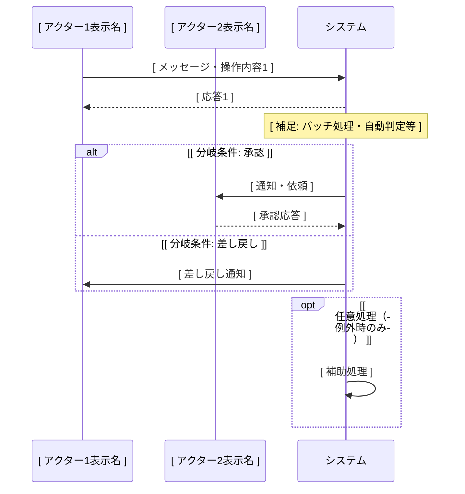
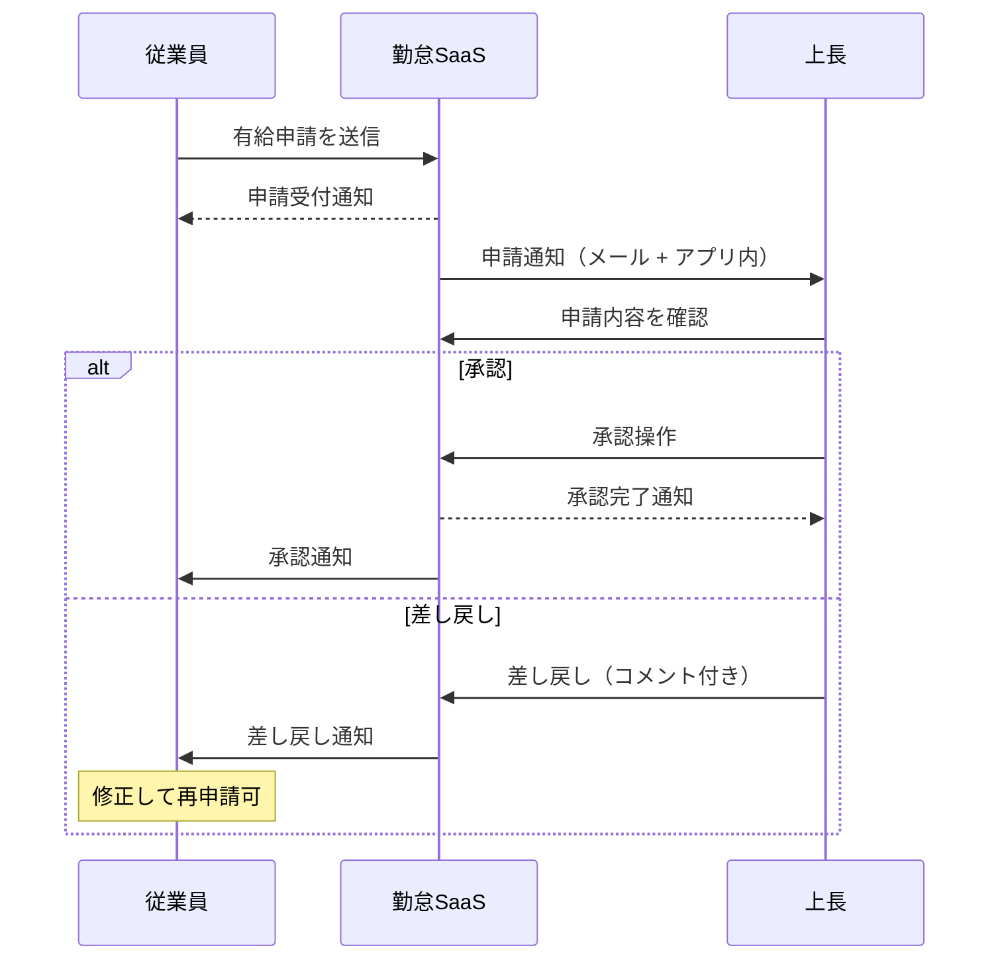
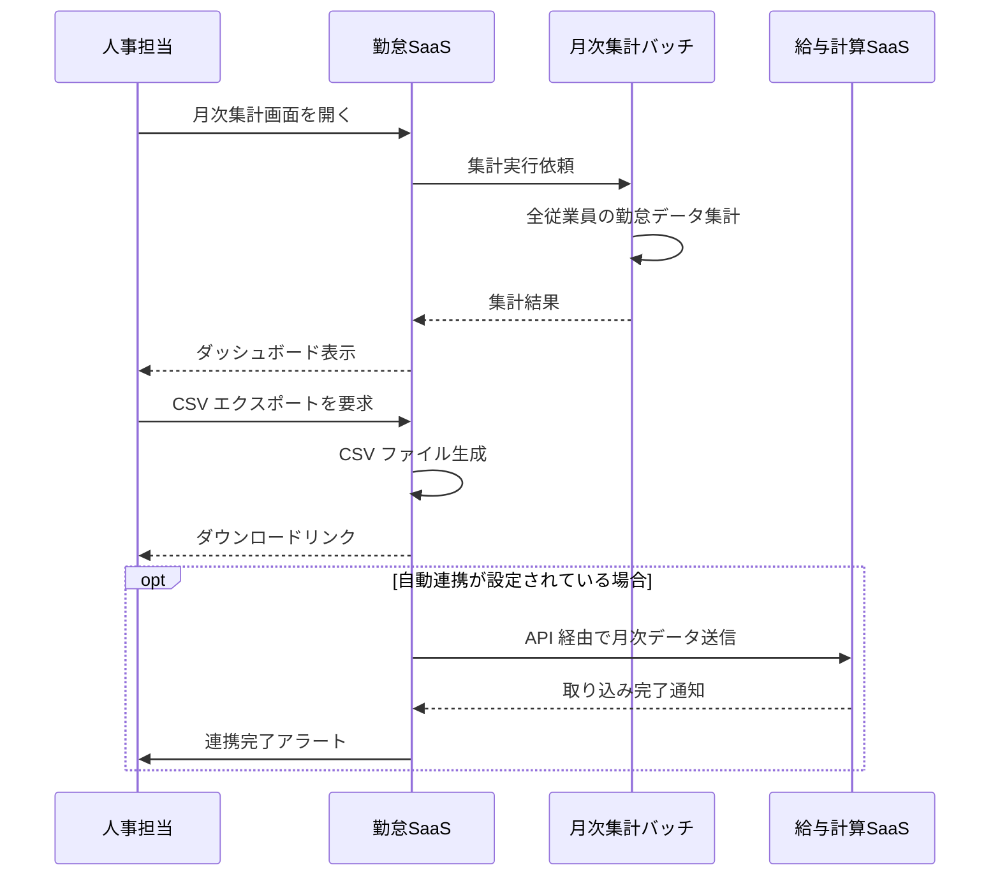

# function-spec-{flow_id}.md 出力テンプレート

本ファイルは `einja-project-function-spec` Skill が業務フロー単位で生成する `function-spec-{flow_id}.md` のセクション構成テンプレと、プレースホルダ凡例、mermaid `sequenceDiagram` 記述例を定義する。SKILL.md Step 2.1（function-spec ファイル初期化）で Read され、Write の元本として使われる。

## 目次

- [プレースホルダ凡例](#プレースホルダ凡例)
- [function-spec-{flow_id}.md テンプレ本体](#function-spec-flow_idmd-テンプレ本体)
- [sequenceDiagram 記述例](#sequencediagram-記述例)
- [機能一覧表の記述例](#機能一覧表の記述例)
- [テンプレ適用後の置換例](#テンプレ適用後の置換例)

---

## プレースホルダ凡例

本テンプレで使用するプレースホルダ形式は以下の1種類のみ:

| 形式 | 意味 | 例 |
|------|------|-----|
| `[ 説明文 ]` | ヒアリングで埋める箇所 | `[ 業務フロー名（日本語） ]` |

その他のマーカー:

| マーカー | 意味 |
|---------|------|
| `<!-- SKIPPED: 該当なし -->` | ユーザーが「該当なし（恒久スキップ）」を選択した場合の置換マーカー |
| `<!-- TBD -->` | 使用しない（互換性のため将来予約） |

`replace_all: false` を厳守し、誤って他セクションのプレースホルダまで置換しないよう、アンカー（直前見出し+代表行）の一意性を必ず確保すること。

---

## function-spec-{flow_id}.md テンプレ本体

```markdown
---
schema_version: 1
flow_id: "[ flow_id ]"
project_name: "[ project_name ]"
title: "[ 業務フロー名（日本語） ]"
status: "draft"
generated_at: "[ ISO 8601 timestamp ]"
source:
  requirements: "../requirements.md"
  screen_flow: "../screen-flow-url.md"
related_screens: []
related_function_ids: []
---

# 業務フロー機能仕様: [ 業務フロー名（日本語） ]

<!--
本ファイルは einja-project-function-spec Skill により生成された業務フロー単位の機能仕様書である。
入力: ../requirements.md (§2 業務フロー / §3 アクター / §6 機能要件サマリ)
入力: ../screen-flow-url.md (stable_id 参照)
出力: 業務フロー詳細・機能一覧・関連画面・業務ルール
書き戻し禁止: requirements.md §6 / screen-flow-url.md（参照のみ）
-->

## 1. 業務フロー概要

### 1.1 基本情報

| 項目 | 内容 |
|------|------|
| 業務フローID | [ flow_id ] |
| 業務フロー名 | [ 業務フロー名（日本語） ] |
| 関連 requirements.md セクション | [ §2.x / §3.x 等 ] |
| 関連業務課題ID（§2.2 課題ID） | [ C-XX, C-YY ] |

### 1.2 アクター

| アクター | 区分 | 役割 |
|----------|------|------|
| [ アクター名1 ] | 利用者 / システム / 外部システム | [ 役割 ] |
| [ アクター名2 ] | 利用者 / システム / 外部システム | [ 役割 ] |

### 1.3 AS-IS / TO-BE 要約

#### AS-IS（現状）

[ AS-IS の業務フロー要約。requirements.md §2.1.1 からの抜粋でも、現場ヒアリングで把握した詳細でもよい ]

#### TO-BE（あるべき姿）

[ TO-BE の業務フロー要約。requirements.md §2.1.2 からの抜粋でも、本Skillで設計した内容でもよい ]

---

## 2. 業務フロー詳細

### 2.1 sequenceDiagram（時系列インタラクション図）

当該業務フローのアクター間のメッセージ授受を時系列で記述する。`requirements.md §2.1.2` の flowchart（俯瞰用）と相補関係。



### 2.2 ステップ別表

sequenceDiagram の各メッセージと 1:1 対応する詳細表。

| ステップ | アクター | 操作 | 関連画面 stable_id | 関連機能ID | 入出力 | 例外 |
|---------|---------|------|------------------|-----------|--------|------|
| 1 | [ アクター名 ] | [ 操作内容 ] | [ stable_id ] | [ FN-XXX ] | [ 入力: ... / 出力: ... ] | [ 例外時の挙動 ] |
| 2 | [ アクター名 ] | [ 操作内容 ] | [ stable_id ] | [ FN-XXX ] | [ 入力: ... / 出力: ... ] | [ 例外時の挙動 ] |
| 3 | [ アクター名 ] | [ 操作内容 ] | [ stable_id ] | [ FN-XXX ] | [ 入力: ... / 出力: ... ] | [ 例外時の挙動 ] |

---

## 3. 機能一覧

本業務フローで使う機能を `FN-XXX` 独立採番で列挙する。`requirements.md §6` 機能要件サマリへの**書き戻しは行わない**。

| FN-XXX | 機能名 | 概要 | 関連画面 stable_id | 関連業務ステップ | 優先度 | 備考 |
|--------|--------|------|------------------|----------------|--------|------|
| FN-001 | [ 機能名1 ] | [ 概要1 ] | [ stable_id ] | [ §2.2 ステップ1, 2 ] | MUST / SHOULD / MAY | [ requirements.md §6 対応ID等 ] |
| FN-002 | [ 機能名2 ] | [ 概要2 ] | [ stable_id ] | [ §2.2 ステップ3 ] | MUST / SHOULD / MAY | - |
| FN-003 | [ 機能名3 ] | [ 概要3 ] | [ stable_id ] | [ §2.2 ステップ4, 5 ] | MUST / SHOULD / MAY | - |

優先度凡例: `MUST` = 必須機能 / `SHOULD` = 推奨機能 / `MAY` = 任意機能

---

## 4. データの流れ

システム間連携・データ授受の概要を記述する。詳細な API 仕様・データスキーマは設計フェーズ（design.md）で扱う。

### 4.1 連携先一覧

| 連携先 | 連携方式 | データ形式 | タイミング | 関連 requirements.md §9 連携先ID |
|--------|---------|----------|-----------|---------------------------------|
| [ 連携先システム1 ] | REST API / SFTP / Webhook / その他 | JSON / CSV / PDF / その他 | 同期 / 非同期 / バッチ（日次・月次等） | [ 連携先ID / 該当なし ] |
| [ 連携先システム2 ] | [ 方式 ] | [ 形式 ] | [ タイミング ] | [ 連携先ID ] |

### 4.2 データフロー図（任意）

複雑な連携の場合は mermaid flowchart で補足する。シンプルな業務なら省略可。

```mermaid
flowchart LR
    A[ [ アクター1 ] ] -->|[ データ1 ]| S[ System ]
    S -->|[ データ2 ]| E[ [ 外部システム ] ]
```

---

## 5. 業務ルール・バリデーション（業務観点）

業務上の制約・承認フロー・例外処理を整理する。技術的バリデーション（型チェック等）は design.md / Issue 仕様で扱う。

### 5.1 業務ルール一覧

| ルールID | 内容 | 根拠（規程・契約・法令等） | 例外条件 |
|---------|------|------------------------|---------|
| BR-01 | [ ルール内容1 ] | [ 根拠1 ] | [ 例外条件1 ] |
| BR-02 | [ ルール内容2 ] | [ 根拠2 ] | [ 例外条件2 ] |

### 5.2 承認フロー（該当する場合）

| 承認段階 | 承認者ロール | 期限 | 期限超過時の動作 | 差し戻し条件 |
|---------|------------|------|----------------|------------|
| 1次承認 | [ 上長 ] | [ 申請から N 営業日以内 ] | [ エスカレーション / 自動承認 ] | [ 差し戻し条件 ] |
| 2次承認 | [ 部長 ] | [ N 営業日 ] | [ ... ] | [ ... ] |

### 5.3 例外処理（該当する場合）

[ システム障害・データ不整合・タイムアウト時の業務手順を記述。手動運用への切り替え手順、エスカレーション先等 ]

---

## 6. 関連画面一覧

`screen-flow-url.md` の `stable_id` を参照キーとして、本業務フローで利用する画面を列挙する。

| stable_id | 画面名 | Figma リンク | 役割（この業務フロー内） |
|-----------|--------|-------------|--------------------|
| [ stable_id 1 ] | [ 画面名1 ] | [ Figma frame URL（screen-flow-url.md から取得可能なら記載） ] | [ 役割（例: 申請入力 / 承認操作 / 一覧表示） ] |
| [ stable_id 2 ] | [ 画面名2 ] | [ Figma frame URL ] | [ 役割 ] |

---

## 7. 未確定事項・前提条件

設計フェーズ（design.md）へ申し送る未確定事項・前提条件を列挙する。

### 7.1 未確定事項

| 項目 | 現時点の状況 | 確定時期・確定方法 | 影響範囲 |
|------|------------|------------------|---------|
| [ 未確定事項1 ] | [ 現状の認識 ] | [ いつ・誰が・どう確定するか ] | [ 影響範囲 ] |
| [ 未確定事項2 ] | [ ... ] | [ ... ] | [ ... ] |

### 7.2 前提条件

- [ 前提条件1（例: requirements.md §9 で確定する外部連携先APIが期日までに公開される） ]
- [ 前提条件2 ]

### 7.3 設計フェーズへの申し送り

- [ 設計フェーズで詳細化が必要な技術的事項1（例: 同時打刻時の競合制御方式） ]
- [ 設計フェーズで詳細化が必要な技術的事項2 ]
```

---

## sequenceDiagram 記述例

### 例1: シンプルな申請・承認フロー



### 例2: 外部システム連携を含むフロー



### sequenceDiagram 記法のポイント

- `participant` で全アクターを宣言（業務フローに登場する利用者・システム・外部システム全件）
- `->>` で実線矢印（操作・リクエスト）、`-->>` で破線矢印（応答・通知）
- `Note over X` で補足説明（例: バッチ処理・自動判定）
- `alt` / `else` / `end` で分岐（必須の分岐パスを明示）
- `opt` / `end` で任意処理（例外時・条件付き処理）
- アクターの表示名は `participant 識別子 as 表示名` で別名指定可（識別子は英数字、表示名は日本語可）

### よくある記法ミス
- `alt` には必ず対応する `end` が必要（`alt`/`else`/`end` の閉じ忘れに注意）
- `participant` 宣言は冒頭にまとめて記述するのが推奨（途中で追加すると順序が崩れる）
- 識別子は半角英数字のみ。表示名（`as 〜` の右側）にのみ日本語を使う
- `Note over A,B: ...` のカンマ区切りで複数アクターをまたぐ注記が可能
- `opt`/`end` で任意処理ブロック、`loop`/`end` でループブロックを表現できる

---

## 機能一覧表の記述例

```markdown
| FN-XXX | 機能名 | 概要 | 関連画面 stable_id | 関連業務ステップ | 優先度 | 備考 |
|--------|--------|------|------------------|----------------|--------|------|
| FN-001 | 打刻機能 | 従業員が出退勤を記録する | attendance-saas__punch | §2.2 ステップ1, 2 | MUST | requirements.md §6.1 F-01 対応 |
| FN-002 | 申請機能 | 従業員が有給・残業を申請する | attendance-saas__request | §2.2 ステップ3 | MUST | requirements.md §6.1 F-03 対応 |
| FN-003 | 申請通知機能 | 上長に申請通知を配信する | attendance-saas__approval-list | §2.2 ステップ4 | MUST | メール + アプリ内通知 |
| FN-004 | 申請承認機能 | 上長が申請を承認・差し戻す | attendance-saas__approval | §2.2 ステップ5, 6 | MUST | コメント付き差し戻し対応 |
| FN-005 | 差し戻し通知機能 | 従業員に差し戻し通知を配信する | attendance-saas__request | §2.2 ステップ7 | SHOULD | 修正フローへの誘導リンク含む |
```

### 機能一覧表の記述ルール

- **FN-XXX 採番ポリシー**: 番号は **プロジェクト全体で一意採番**。同一機能を複数の業務フローから参照する場合は **同一 ID を使用**する（その場合 §3.4 の重複検出時に「同一機能として明示参照する」を選択）。欠番は許容される（プロジェクト進行中の予約や別フローでの採番予定など）。
- `関連画面 stable_id` は `screen-flow-url.md` の `screens[]` に実在する ID を記載（未存在時は空欄）
- `関連業務ステップ` は §2.2 ステップ別表のステップ番号を参照（例: `§2.2 ステップ1, 2`）
- `優先度` は MUST / SHOULD / MAY の3段階（業務要求の強さ）
- `備考` には requirements.md §6 対応ID、通知方式、特記事項等を記載

---

## テンプレ適用後の置換例

### before（テンプレ初期状態）

```markdown
| 項目 | 内容 |
|------|------|
| 業務フローID | [ flow_id ] |
| 業務フロー名 | [ 業務フロー名（日本語） ] |
```

### after（Q1 回答後の Edit 適用例）

```markdown
| 項目 | 内容 |
|------|------|
| 業務フローID | attendance-saas__flow__time_punch_approval |
| 業務フロー名 | 打刻・申請・承認フロー |
```

### Edit の `old_string` / `new_string` 構築例

| 項目 | 値 |
|------|------|
| アンカー（直前見出し） | `### 1.1 基本情報` |
| 代表プレースホルダ行 | `\| 業務フローID \| [ flow_id ] \|` |
| `old_string` | `### 1.1 基本情報\n\n\| 項目 \| 内容 \|\n\|------\|------\|\n\| 業務フローID \| [ flow_id ] \|` |
| `new_string` | `### 1.1 基本情報\n\n\| 項目 \| 内容 \|\n\|------\|------\|\n\| 業務フローID \| attendance-saas__flow__time_punch_approval \|` |

`replace_all: false` を厳守し、テーブル全体を一度に置換せず、代表行ペアでアンカーを一意化する。
