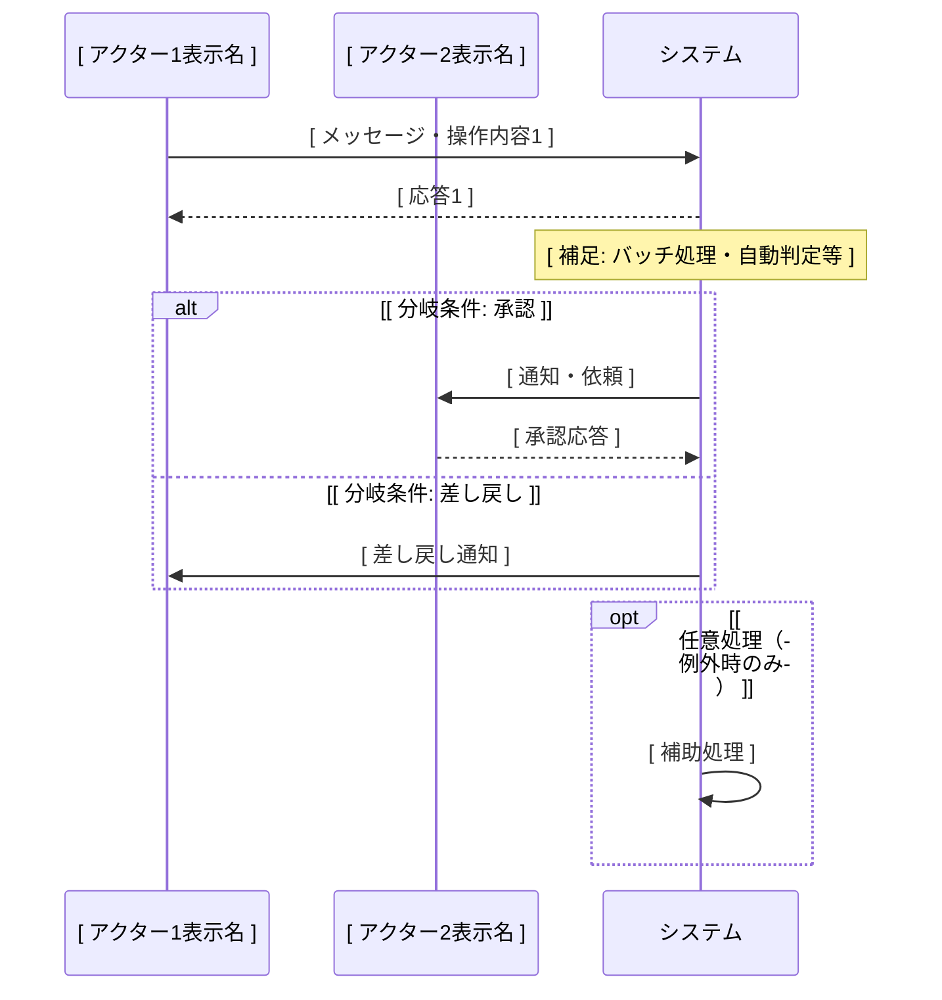
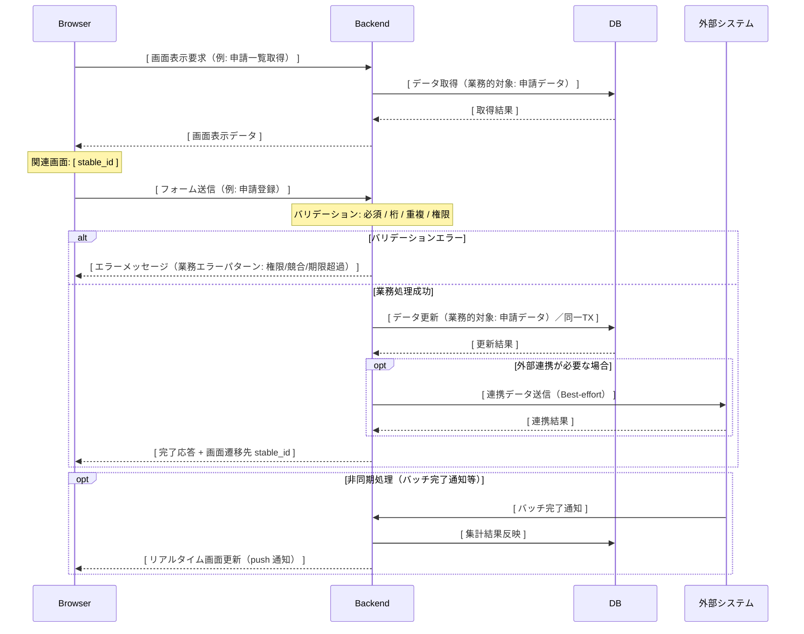
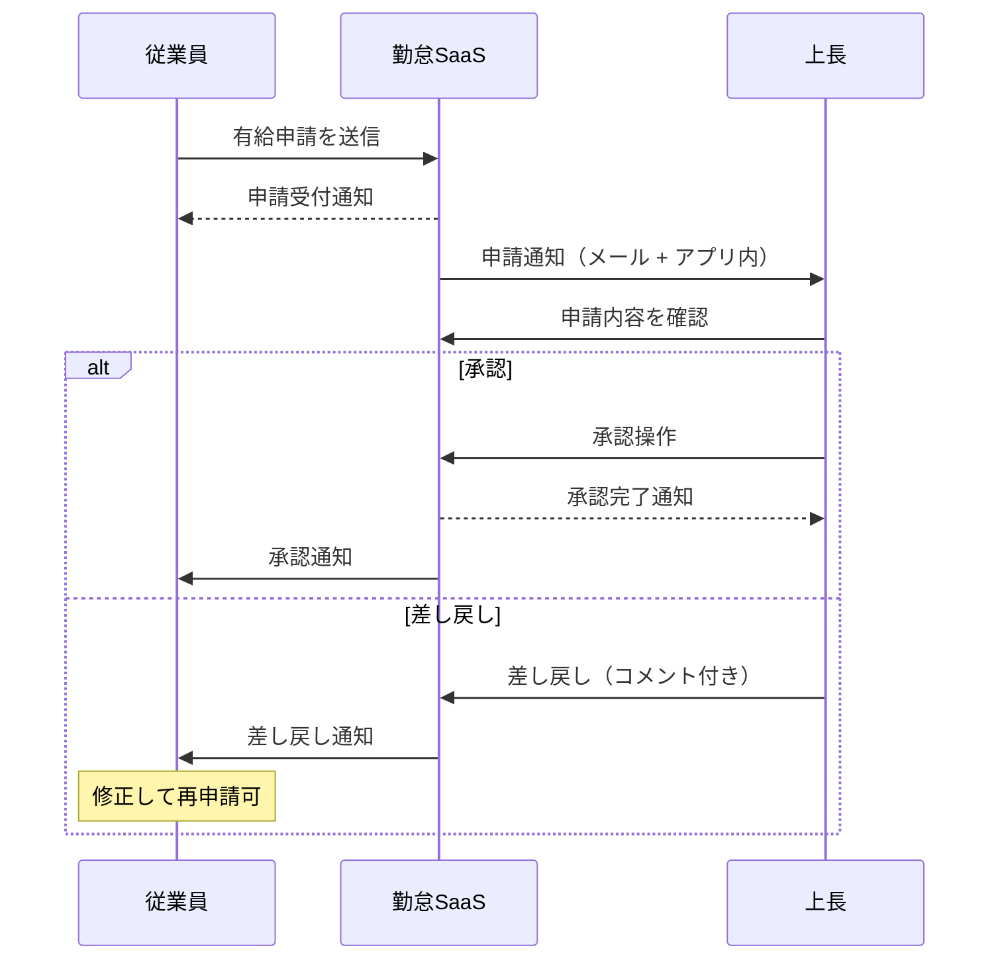
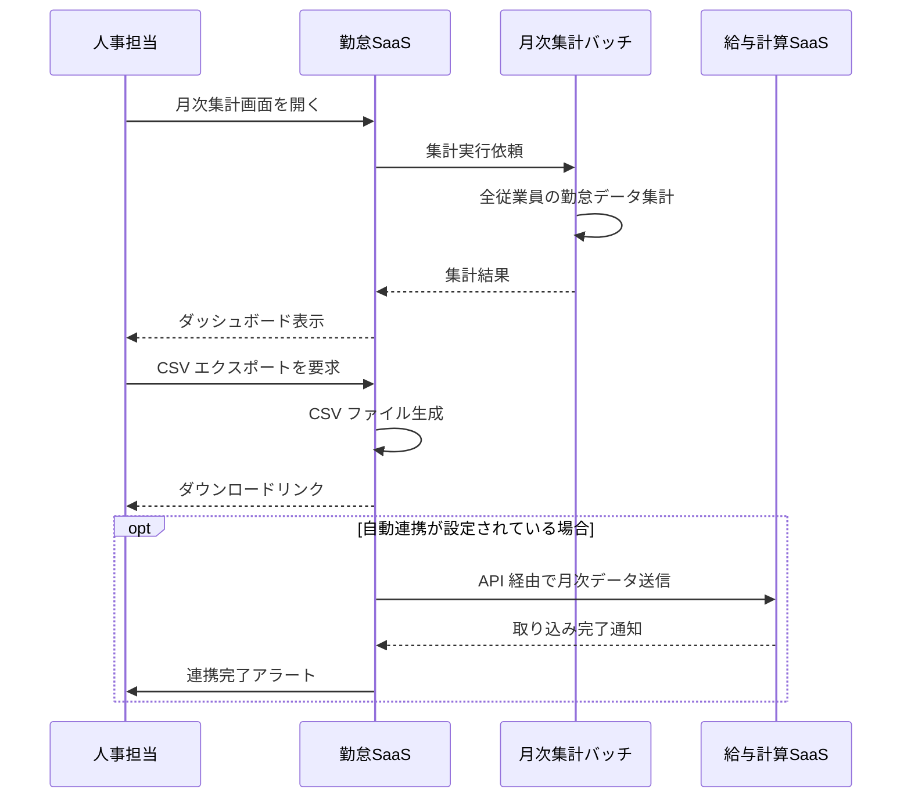
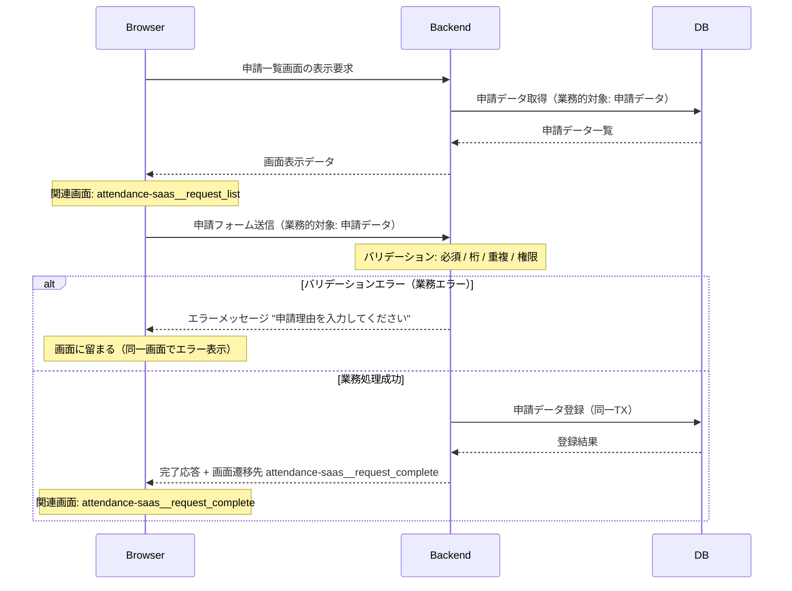
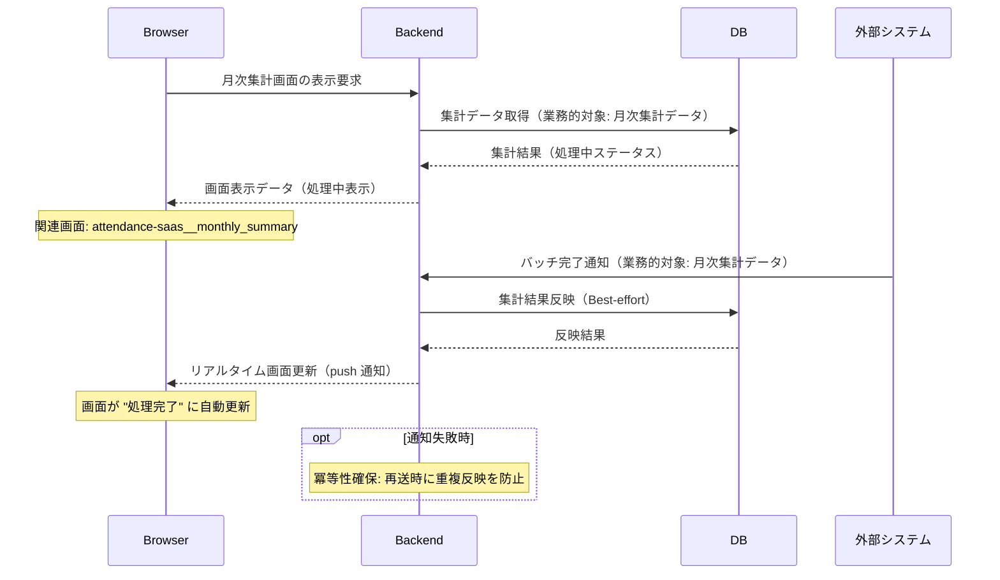

# function-spec-{flow_id}.md 出力テンプレート

本ファイルは `einja-project-function-spec` Skill が業務フロー単位で生成する `function-spec-{flow_id}.md` のセクション構成テンプレと、プレースホルダ凡例、mermaid `sequenceDiagram` 記述例を定義する。SKILL.md Step 2.1（function-spec ファイル初期化）で Read され、Write の元本として使われる。

## 目次

- [プレースホルダ凡例](#プレースホルダ凡例)
- [function-spec-{flow_id}.md テンプレ本体](#function-spec-flow_idmd-テンプレ本体)
- [sequenceDiagram 記述例](#sequencediagram-記述例)
- [機能一覧表の記述例](#機能一覧表の記述例)
- [テンプレ適用後の置換例](#テンプレ適用後の置換例)

---

## プレースホルダ凡例

本テンプレで使用するプレースホルダ形式は以下の1種類のみ:

| 形式 | 意味 | 例 |
|------|------|-----|
| `[ 説明文 ]` | ヒアリングで埋める箇所 | `[ 業務フロー名（日本語） ]` |

その他のマーカー:

| マーカー | 意味 |
|---------|------|
| `<!-- SKIPPED: 該当なし -->` | ユーザーが「該当なし（恒久スキップ）」を選択した場合の置換マーカー |
| `<!-- TBD -->` | 使用しない（互換性のため将来予約） |

`replace_all: false` を厳守し、誤って他セクションのプレースホルダまで置換しないよう、アンカー（直前見出し+代表行）の一意性を必ず確保すること。

---

## function-spec-{flow_id}.md テンプレ本体

```markdown
---
schema_version: 1
flow_id: "[ flow_id ]"
project_name: "[ project_name ]"
title: "[ 業務フロー名（日本語） ]"
status: "draft"
system_flow: included
generated_at: "[ ISO 8601 timestamp ]"
source:
  requirements: "../requirements.md"
  screen_flow: "../screen-flow-url.md"
related_screens: []
related_function_ids: []
---

# 業務フロー機能仕様: [ 業務フロー名（日本語） ]

<!--
本ファイルは einja-project-function-spec Skill により生成された業務フロー単位の機能仕様書である。
入力: ../requirements.md (§2 業務フロー / §3 アクター / §6 機能要件サマリ)
入力: ../screen-flow-url.md (stable_id 参照)
出力: 業務フロー詳細・機能一覧・関連画面・業務ルール
書き戻し禁止: requirements.md §6 / screen-flow-url.md（参照のみ）
-->

## 1. 業務フロー概要

### 1.1 基本情報

| 項目 | 内容 |
|------|------|
| 業務フローID | [ flow_id ] |
| 業務フロー名 | [ 業務フロー名（日本語） ] |
| 関連 requirements.md セクション | [ §2.x / §3.x 等 ] |
| 関連業務課題ID（requirements.md §2.2 課題ID） | [ C-XX, C-YY ] |

### 1.2 アクター

| アクター | 区分 | 役割 |
|----------|------|------|
| [ アクター名1 ] | 利用者 / システム / 外部システム | [ 役割 ] |
| [ アクター名2 ] | 利用者 / システム / 外部システム | [ 役割 ] |

### 1.3 AS-IS / TO-BE 要約

#### AS-IS（現状）

[ AS-IS の業務フロー要約。requirements.md §2.1.1 からの抜粋でも、現場ヒアリングで把握した詳細でもよい ]

#### TO-BE（あるべき姿）

[ TO-BE の業務フロー要約。requirements.md §2.1.2 からの抜粋でも、本Skillで設計した内容でもよい ]

---

## 2. 業務フロー詳細

本セクションは **業務観点（§2.1）** と **システム観点（§2.2）** の二段構成。§2.1 はアクター間の業務メッセージ、§2.2 は Browser / Backend / DB / 外部システムの4層インタラクションを記述する。両者は同じ業務フローの異なる視点であり、ステップ番号で相互参照する（§2.3 ステップ別表で観点列により区別）。

### 2.1 業務観点 sequenceDiagram（時系列インタラクション図）

当該業務フローのアクター間のメッセージ授受を時系列で記述する。`requirements.md §2.1.2` の flowchart（俯瞰用）と相補関係。



### 2.2 システム観点 sequenceDiagram

§2.1 の業務観点メッセージを、システム内部（Browser / Backend / DB / Ext（外部システム））でどう処理するかを記述する。標準は 4 層 participant、3 層簡略時は外部システムを省略し、バッチ起動など Browser を介さないフローでは Browser を省略する（4層 / 3層 / SKIPPED の区別は本文冒頭に注記として記述する）。

**canonical participant 識別子（固定）**:
- 4層: `Browser` / `Backend` / `DB` / `Ext`
- 3層（外部連携なし）: `Browser` / `Backend` / `DB`
- 3層（バッチ起動・Browser なし）: `Backend` / `DB` / `Ext`

識別子は canonical 名で固定し、表示名は当該フローの画面名・通称を併記してよい（例: `participant Browser as 打刻画面` / `participant Ext as 通知配信基盤`）。

**カバーすべきイベント**:
1. 画面表示時のデータ取得（GET 系）
2. フォーム送信処理（POST/PUT/DELETE）と成功時の画面遷移・表示更新
3. バリデーションエラー・業務エラー時の画面フィードバック
4. 非同期処理の画面反映（バッチ完了通知・リアルタイム更新）

**含める粒度**:
- 操作の業務的意味、画面遷移先 stable_id、データ更新対象（業務的対象名）
- 主要バリデーション（必須 / 桁 / 重複 / 権限）、業務エラーパターン（権限 / 競合 / 期限超過）
- トランザクション境界の方針（「同一TX」「Best-effort」レベル）、楽観ロック・冪等性の必要性宣言

**含めない粒度**（design.md / Issue 仕様で扱う）:
- 具体的 API パス、テーブル名・カラム名、全フィールドの型・正規表現
- HTTP ステータス詳細、BEGIN/COMMIT 位置・具体的ロック実装



### 2.3 ステップ別表

§2.1 / §2.2 の各メッセージと 1:1 対応する詳細表。**観点列で業務 / システムを区別する**。

| ステップ | 観点 | アクター / 参加者 | 操作 | 関連画面 stable_id | 関連機能ID | 入出力 | 例外 |
|---------|------|------------------|------|------------------|-----------|--------|------|
| 1 | 業務 | [ アクター名 ] | [ 操作内容 ] | [ stable_id ] | [ FN-XXX ] | [ 入力: ... / 出力: ... ] | [ 例外時の挙動 ] |
| 2 | 業務 | [ アクター名 ] | [ 操作内容 ] | [ stable_id ] | [ FN-XXX ] | [ 入力: ... / 出力: ... ] | [ 例外時の挙動 ] |
| S1 | システム | Browser → Backend | [ 画面表示要求 ] | [ stable_id ] | [ FN-XXX ] | [ 入力: ... / 出力: ... ] | [ 例外時の挙動 ] |
| S2 | システム | Backend → DB | [ データ取得（業務的対象） ] | - | [ FN-XXX ] | [ 入力: ... / 出力: ... ] | [ 例外時の挙動 ] |
| S3 | システム | Backend → Browser | [ 画面表示データ応答 ] | [ stable_id ] | [ FN-XXX ] | [ 入力: ... / 出力: ... ] | [ 例外時の挙動 ] |

ステップ番号の命名規則:
- 業務観点: `1` / `2` / `3` ...（連番）
- システム観点: `S1` / `S2` / `S3` ...（`S` プレフィックス + 連番）
- 業務ステップとシステムステップの対応関係は「関連業務ステップ」列または機能カード（§3.2）の「処理ステップ」で参照する

---

## 3. 機能一覧

本業務フローで使う機能を `FN-XXX` 独立採番で列挙する。`requirements.md §6` 機能要件サマリへの**書き戻しは行わない**。

§3.1 機能サマリ表で全機能を俯瞰し、MUST 機能は §3.2 機能カードで詳細化する。SHOULD / MAY は概要のみ（機能カード省略可）。

### 3.1 機能サマリ表

| FN-XXX | 機能名 | 概要 | 関連画面 stable_id | 関連業務ステップ | 優先度 | 備考 |
|--------|--------|------|------------------|----------------|--------|------|
| FN-001 | [ 機能名1 ] | [ 概要1 ] | [ stable_id ] | [ §2.3 ステップ1, 2 ] | MUST / SHOULD / MAY | [ requirements.md §6 対応ID等 ] |
| FN-002 | [ 機能名2 ] | [ 概要2 ] | [ stable_id ] | [ §2.3 ステップ3 ] | MUST / SHOULD / MAY | - |
| FN-003 | [ 機能名3 ] | [ 概要3 ] | [ stable_id ] | [ §2.3 ステップ4, 5 ] | MUST / SHOULD / MAY | - |

優先度凡例: `MUST` = 必須機能 / `SHOULD` = 推奨機能 / `MAY` = 任意機能

### 3.2 機能カード（MUST 機能の詳細）

MUST 機能は以下のフォーマットで詳細化する。SHOULD / MAY は §3.1 概要のみで可。
§2.2 システム観点 sequenceDiagram で詳細記述済みの場合は「§2.2 ステップ N 参照」リダイレクト可。

#### FN-001 [ 機能名1 ]

- **入力**: [ 業務的対象（例: 申請データ・打刻データ） ]
- **主要バリデーション**: [ 必須 / 桁 / 重複 / 権限 ]（複数列挙可）
- **処理ステップ**:
  1. [ ステップ1 ]
  2. [ ステップ2 ]
  3. [ ステップ3 ]
- **出力**: [ 画面遷移先 stable_id + 表示更新内容 ]
- **業務エラー**: [ パターン → 画面メッセージ ]（複数列挙可、例: 権限なし → "操作権限がありません" / 期限超過 → "申請期限を過ぎています"）
- **関連画面**: [ stable_id（役割） ]（複数列挙可）

#### FN-002 [ 機能名2 ]

- **入力**: [ 業務的対象 ]
- **主要バリデーション**: [ 必須 / 桁 / 重複 / 権限 ]
- **処理ステップ**: §2.2 ステップ S3〜S5 参照
- **出力**: [ 画面遷移先 stable_id + 表示更新内容 ]
- **業務エラー**: [ パターン → 画面メッセージ ]
- **関連画面**: [ stable_id（役割） ]

機能カードの記述ルール:
- **MUST 機能は必須**。SHOULD / MAY は §3.1 サマリ表のみで可
- 処理ステップは §2.2 と整合させる。詳細が §2.2 にある場合は「§2.2 ステップ N 参照」でリダイレクト
- 業務エラーは「業務エラーパターン → 画面メッセージ」のペアで記述（HTTP ステータスや例外クラス名は記載しない）
- 関連画面は §6 関連画面一覧の stable_id を参照

---

## 4. データの流れ

システム間連携・データ授受の概要を記述する。**外部システム連携**（§4.1）と **内部システム間データフロー**（§4.2）の二段構成。詳細な API 仕様・データスキーマは設計フェーズ（design.md）で扱う。

### 4.1 外部システム連携

外部システム（自社外システム・SaaS・バッチ連携先等）との連携を整理する。

| 連携先 | 連携方式 | データ形式 | タイミング | 関連 requirements.md §9 連携先ID |
|--------|---------|----------|-----------|---------------------------------|
| [ 連携先システム1 ] | REST API / SFTP / Webhook / その他 | JSON / CSV / PDF / その他 | 同期 / 非同期 / バッチ（日次・月次等） | [ 連携先ID / 該当なし ] |
| [ 連携先システム2 ] | [ 方式 ] | [ 形式 ] | [ タイミング ] | [ 連携先ID ] |

外部連携データフロー図（任意。複雑な連携時のみ）:

```mermaid
flowchart LR
    A[ [ アクター1 ] ] -->|[ データ1 ]| S[ System ]
    S -->|[ データ2 ]| E[ [ 外部システム ] ]
```

### 4.2 内部システム間データフロー

Browser ↔ Backend ↔ DB 間の **概念レベル** でのデータの流れを整理する。具体的 API パス・テーブル名・カラム名は記載しない（design.md / Issue 仕様で扱う）。

| 流れ | 業務的対象（データ名） | トリガー | 方向 | タイミング | 備考 |
|------|----------------------|---------|------|----------|------|
| 1 | [ 申請データ ] | [ 画面表示要求 ] | DB → Backend → Browser | 同期 / 非同期 | [ 補足: ページネーション・キャッシュ等 ] |
| 2 | [ 申請データ ] | [ フォーム送信 ] | Browser → Backend → DB | 同期 | [ トランザクション境界: 同一TX ] |
| 3 | [ 集計データ ] | [ バッチ完了通知 ] | 外部 → Backend → DB → Browser | 非同期（push 通知） | [ リアルタイム反映 / WebSocket 等 ] |

内部データフロー図（任意。複雑な業務時のみ）:

```mermaid
flowchart LR
    Browser[ Browser ] -->|[ フォーム送信 ]| Backend[ Backend ]
    Backend -->|[ データ更新 ]| DB[ DB ]
    DB -->|[ データ取得 ]| Backend
    Backend -->|[ 画面表示データ ]| Browser
```

---

## 5. 業務ルール・バリデーション（業務観点）

業務上の制約・承認フロー・例外処理を整理する。技術的バリデーション（型チェック等）は design.md / Issue 仕様で扱う。

### 5.1 業務ルール一覧

| ルールID | 内容 | 根拠（規程・契約・法令等） | 例外条件 |
|---------|------|------------------------|---------|
| BR-01 | [ ルール内容1 ] | [ 根拠1 ] | [ 例外条件1 ] |
| BR-02 | [ ルール内容2 ] | [ 根拠2 ] | [ 例外条件2 ] |

### 5.2 承認フロー（該当する場合）

| 承認段階 | 承認者ロール | 期限 | 期限超過時の動作 | 差し戻し条件 |
|---------|------------|------|----------------|------------|
| 1次承認 | [ 上長 ] | [ 申請から N 営業日以内 ] | [ エスカレーション / 自動承認 ] | [ 差し戻し条件 ] |
| 2次承認 | [ 部長 ] | [ N 営業日 ] | [ ... ] | [ ... ] |

### 5.3 例外処理（該当する場合）

[ システム障害・データ不整合・タイムアウト時の業務手順を記述。手動運用への切り替え手順、エスカレーション先等 ]

### 5.4 主要技術制約

業務ルールから派生する主要な技術的制約を整理する。詳細な型・正規表現・実装方式は design.md / Issue 仕様で扱う。

| 制約種別 | 対象データ | 制約内容 | 違反時の挙動 | 関連 FN-XXX |
|---------|----------|---------|------------|------------|
| 必須 | [ 業務的対象（例: 申請理由） ] | [ 入力必須 ] | [ 画面メッセージ: "申請理由を入力してください" ] | [ FN-XXX ] |
| 桁 | [ 業務的対象（例: 申請理由） ] | [ N 文字以内 ] | [ 画面メッセージ: "申請理由は N 文字以内で入力してください" ] | [ FN-XXX ] |
| 重複 | [ 業務的対象（例: 申請データ） ] | [ 同一日付・同一従業員での重複申請不可 ] | [ 画面メッセージ: "同日の申請が既に存在します" ] | [ FN-XXX ] |
| 権限 | [ 操作対象（例: 承認操作） ] | [ 申請者の上長のみ承認可 ] | [ 画面メッセージ: "操作権限がありません" ] | [ FN-XXX ] |
| 一意性 | [ 業務的対象（例: 申請ID） ] | [ システム全体で一意 ] | [ 画面メッセージ: "申請の登録に失敗しました（再試行してください）" ] | [ FN-XXX ] |
| 期限 | [ 業務的対象（例: 申請） ] | [ 対象日の N 営業日前まで ] | [ 画面メッセージ: "申請期限を過ぎています" ] | [ FN-XXX ] |

制約種別の凡例:
- **必須**: 必ず入力・指定が必要な項目
- **桁**: 文字数・桁数の上限・下限
- **重複**: 同一条件での複数登録の可否
- **権限**: 操作可能なロール・組織条件
- **一意性**: システム全体・テナント内での一意性要求
- **期限**: 操作可能な期限（日数・営業日・締切時刻等）

---

## 6. 関連画面一覧

`screen-flow-url.md` の `stable_id` を参照キーとして、本業務フローで利用する画面を列挙する。

| stable_id | 画面名 | Figma リンク | 役割（この業務フロー内） |
|-----------|--------|-------------|--------------------|
| [ stable_id 1 ] | [ 画面名1 ] | [ Figma frame URL（screen-flow-url.md から取得可能なら記載） ] | [ 役割（例: 申請入力 / 承認操作 / 一覧表示） ] |
| [ stable_id 2 ] | [ 画面名2 ] | [ Figma frame URL ] | [ 役割 ] |

---

## 7. 未確定事項・前提条件

設計フェーズ（design.md）へ申し送る未確定事項・前提条件を列挙する。

### 7.1 未確定事項

| 項目 | 現時点の状況 | 確定時期・確定方法 | 影響範囲 |
|------|------------|------------------|---------|
| [ 未確定事項1 ] | [ 現状の認識 ] | [ いつ・誰が・どう確定するか ] | [ 影響範囲 ] |
| [ 未確定事項2 ] | [ ... ] | [ ... ] | [ ... ] |

### 7.2 前提条件

- [ 前提条件1（例: requirements.md §9 で確定する外部連携先APIが期日までに公開される） ]
- [ 前提条件2 ]

### 7.3 設計フェーズへの申し送り

> **記述方針**: 内部フロー（Browser / Backend / DB 間のインタラクション）は §2.2 システム観点 sequenceDiagram、主要技術制約は §5.4 に記述するため、本セクションは **具体的実装方式の選定** のみに縮小する。インタラクション・制約の再記述は不要。

申し送り対象は以下のような **実装方式の選定** に限定する:

- **ロック方式**: 楽観ロック vs 悲観ロック、バージョン番号管理方式の選定
- **インフラ選定**: メッセージキュー（SQS / RabbitMQ 等）、バッチ実行基盤（Cloud Run Jobs / ECS Scheduled Task 等）、リアルタイム通知（WebSocket / SSE / Polling）の選定
- **API スキーマ詳細**: REST / GraphQL / RPC の選定、エンドポイント設計、HTTP ステータス設計、エラーレスポンス形式
- **データスキーマ詳細**: テーブル設計、インデックス戦略、マイグレーション方針

| 項目 | 申し送り内容 | 関連 §2.2 ステップ / §5.4 制約 |
|------|------------|-----------------------------|
| [ 例: 同時打刻時のロック方式 ] | [ 楽観ロック（バージョン番号） vs 悲観ロック の選定が必要 ] | [ §2.2 ステップ S5 / §5.4 一意性制約 ] |
| [ 例: バッチ実行基盤 ] | [ Cloud Run Jobs / ECS Scheduled Task の選定が必要 ] | [ §2.2 ステップ S10 ] |
```

---

## sequenceDiagram 記述例

§2.1 用（業務観点）の例を 2 本、§2.2 用（システム観点）の例を 2 本掲載する。

### 例1（§2.1 業務観点用）: シンプルな申請・承認フロー



### 例2（§2.1 業務観点用）: 外部システム連携を含むフロー



### 例3（§2.2 システム観点用）: 画面表示 + フォーム送信フロー（4層 participant 標準形）

Browser から画面表示要求 → Backend が DB から取得して表示 → Browser からフォーム送信 → Backend でバリデーション → 失敗時エラー表示 / 成功時 DB 更新 + 画面遷移、という標準的な CRUD パターン。

> **表示名併記の指針**: 例 3 / 例 4 は `participant Browser as Browser` のような固定例を最低限のサンプルとして示しているが、実フローでは `participant Browser as [ 画面名 ]` / `participant Ext as [ 通知配信基盤 ]` のように **当該フローの画面名・通称を表示名に併記してよい**。識別子（`Browser` / `Backend` / `DB` / `Ext`）は canonical 名で固定する。



### 例4（§2.2 システム観点用）: バッチ完了 + リアルタイム画面反映（非同期処理を含む）

外部システム（バッチ）→ Backend → Browser（push 通知）の非同期反映パターン。



### sequenceDiagram 記法のポイント

- `participant` で全アクターを宣言（業務フローに登場する利用者・システム・外部システム全件）
- `->>` で実線矢印（操作・リクエスト）、`-->>` で破線矢印（応答・通知）
- `Note over X` で補足説明（例: バッチ処理・自動判定）
- `alt` / `else` / `end` で分岐（必須の分岐パスを明示）
- `opt` / `end` で任意処理（例外時・条件付き処理）
- アクターの表示名は `participant 識別子 as 表示名` で別名指定可（識別子は英数字、表示名は日本語可）

### よくある記法ミス
- `alt` には必ず対応する `end` が必要（`alt`/`else`/`end` の閉じ忘れに注意）
- `participant` 宣言は冒頭にまとめて記述するのが推奨（途中で追加すると順序が崩れる）
- 識別子は半角英数字のみ。表示名（`as 〜` の右側）にのみ日本語を使う
- `Note over A,B: ...` のカンマ区切りで複数アクターをまたぐ注記が可能
- `opt`/`end` で任意処理ブロック、`loop`/`end` でループブロックを表現できる

---

## 機能一覧表の記述例

```markdown
| FN-XXX | 機能名 | 概要 | 関連画面 stable_id | 関連業務ステップ | 優先度 | 備考 |
|--------|--------|------|------------------|----------------|--------|------|
| FN-001 | 打刻機能 | 従業員が出退勤を記録する | attendance-saas__punch | §2.3 ステップ1, 2 | MUST | requirements.md §6.1 F-01 対応 |
| FN-002 | 申請機能 | 従業員が有給・残業を申請する | attendance-saas__request | §2.3 ステップ3 | MUST | requirements.md §6.1 F-03 対応 |
| FN-003 | 申請通知機能 | 上長に申請通知を配信する | attendance-saas__approval-list | §2.3 ステップ4 | MUST | メール + アプリ内通知 |
| FN-004 | 申請承認機能 | 上長が申請を承認・差し戻す | attendance-saas__approval | §2.3 ステップ5, 6 | MUST | コメント付き差し戻し対応 |
| FN-005 | 差し戻し通知機能 | 従業員に差し戻し通知を配信する | attendance-saas__request | §2.3 ステップ7 | SHOULD | 修正フローへの誘導リンク含む |
```

### 機能一覧表の記述ルール

- **FN-XXX 採番ポリシー**: 番号は **プロジェクト全体で一意採番**。同一機能を複数の業務フローから参照する場合は **同一 ID を使用**する（その場合 SKILL.md Step 3.4 機能ID重複チェック時に「同一機能として明示参照する」を選択）。欠番は許容される（プロジェクト進行中の予約や別フローでの採番予定など）。
- `関連画面 stable_id` は `screen-flow-url.md` の `screens[]` に実在する ID を記載（未存在時は空欄）
- `関連業務ステップ` は §2.3 ステップ別表のステップ番号を参照（例: `§2.3 ステップ1, 2` / システム観点参照は `§2.3 ステップ S1, S2`）
- `優先度` は MUST / SHOULD / MAY の3段階（業務要求の強さ）
- `備考` には requirements.md §6 対応ID、通知方式、特記事項等を記載

---

## テンプレ適用後の置換例

### before（テンプレ初期状態）

```markdown
| 項目 | 内容 |
|------|------|
| 業務フローID | [ flow_id ] |
| 業務フロー名 | [ 業務フロー名（日本語） ] |
```

### after（Q1 回答後の Edit 適用例）

```markdown
| 項目 | 内容 |
|------|------|
| 業務フローID | attendance-saas__flow__time_punch_approval |
| 業務フロー名 | 打刻・申請・承認フロー |
```

### Edit の `old_string` / `new_string` 構築例

| 項目 | 値 |
|------|------|
| アンカー（直前見出し） | `### 1.1 基本情報` |
| 代表プレースホルダ行 | `\| 業務フローID \| [ flow_id ] \|` |
| `old_string` | `### 1.1 基本情報\n\n\| 項目 \| 内容 \|\n\|------\|------\|\n\| 業務フローID \| [ flow_id ] \|` |
| `new_string` | `### 1.1 基本情報\n\n\| 項目 \| 内容 \|\n\|------\|------\|\n\| 業務フローID \| attendance-saas__flow__time_punch_approval \|` |

`replace_all: false` を厳守し、テーブル全体を一度に置換せず、代表行ペアでアンカーを一意化する。

### 新セクション §2.2 / §3.2 / §5.4 の Edit アンカー戦略

新セクションは複数の機能カード・複数のシステムフローを持つため、**直前見出し + 代表的なペア** を `old_string` に使うことで一意性を確保する。

#### §2.2 システム観点 sequenceDiagram のアンカー

- アンカー（直前見出し）: `### 2.2 システム観点 sequenceDiagram`
- 代表ペア: mermaid コードブロック内の `Browser->>Backend: [ 画面表示要求（例: 申請一覧取得） ]` 等、プレースホルダを含む行
- 注意: §2.2 mermaid は複数の Browser/Backend/DB 矢印を含むため、**「アクション名 + プレースホルダ」ペア** を `old_string` の一部に含めて一意化する
- 注意: mermaid コードブロック内の `[ ... ]` 表記は flowchart ノード記法と表面上一致するため、Step 3 残存プレースホルダ判定では mermaid ブロック外に限定する。Edit 時にも flowchart ノード（例: `Browser[ 画面名 ]`）を `old_string` に使う場合はノード記法であることを意識し、`sequenceDiagram` のプレースホルダ（例: `Browser->>Backend: [ ... ]`）と混同しないよう構成すること

#### §3.2 機能カードのアンカー

- 各機能カードは `#### FN-XXX [ 機能名N ]` を直前見出しとして使用（FN-XXX 番号が一意化のキー）
- 代表ペア: `- **入力**: [ 業務的対象（例: 申請データ・打刻データ） ]` 行
- 機能カード単位で Edit を分割し、複数機能の置換を一度に行わない

#### §5.4 主要技術制約のアンカー

- アンカー（直前見出し）: `### 5.4 主要技術制約`
- 代表ペア: 制約種別列の値（`必須` / `桁` / `重複` / `権限` / `一意性` / `期限`）+ 対象データのプレースホルダ
- 行単位で Edit する（テーブル全体置換は禁止）
