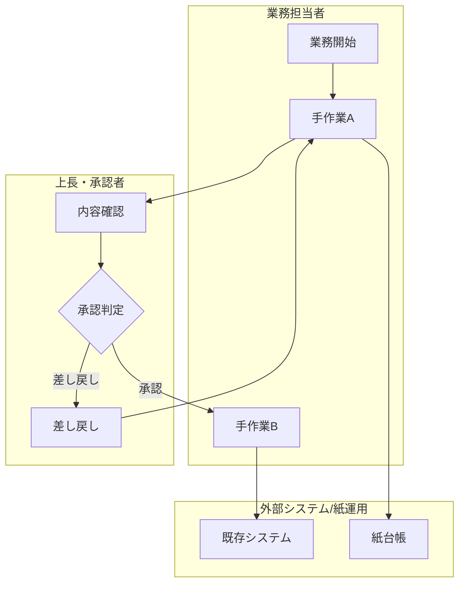
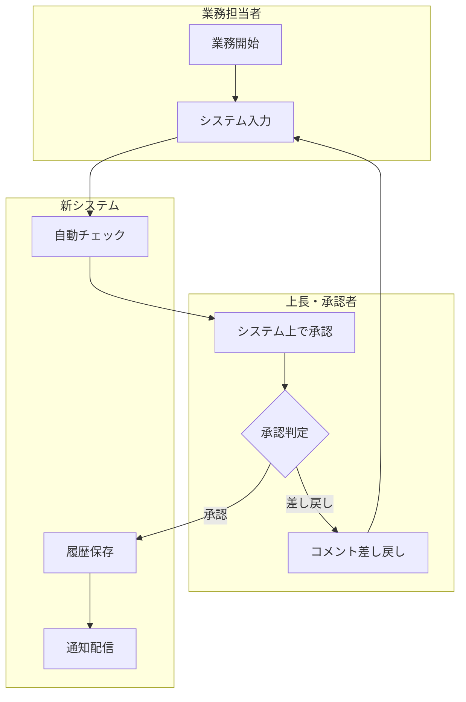
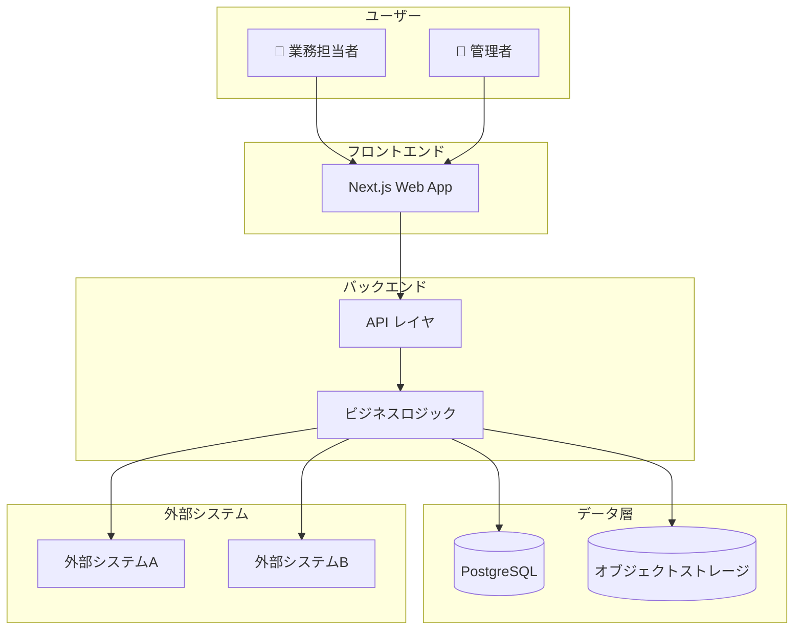
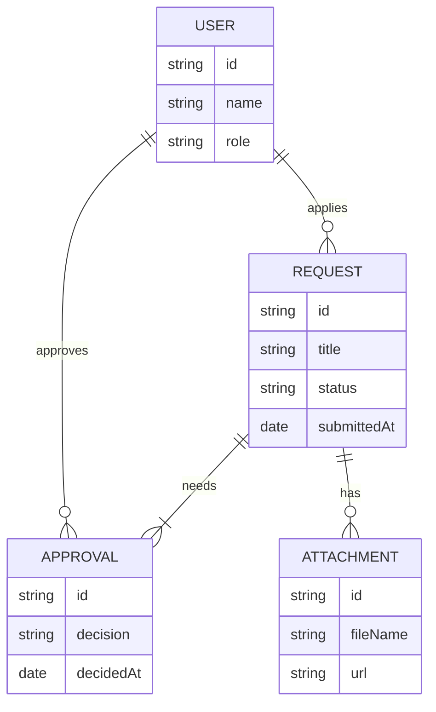
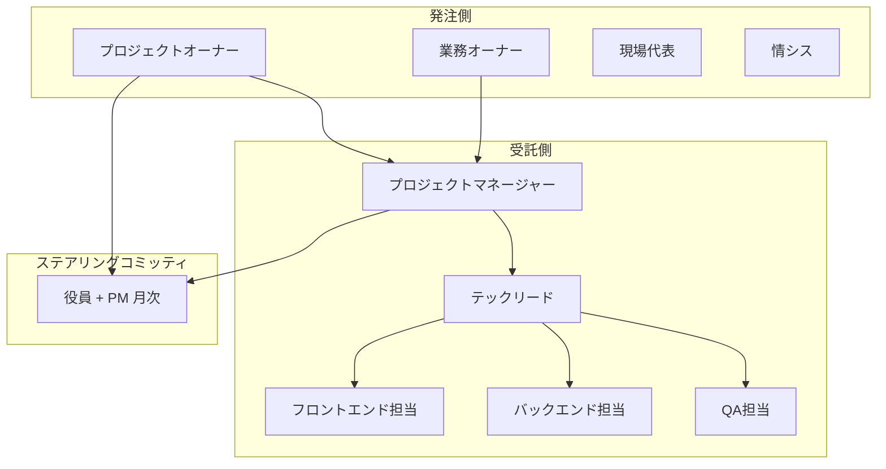
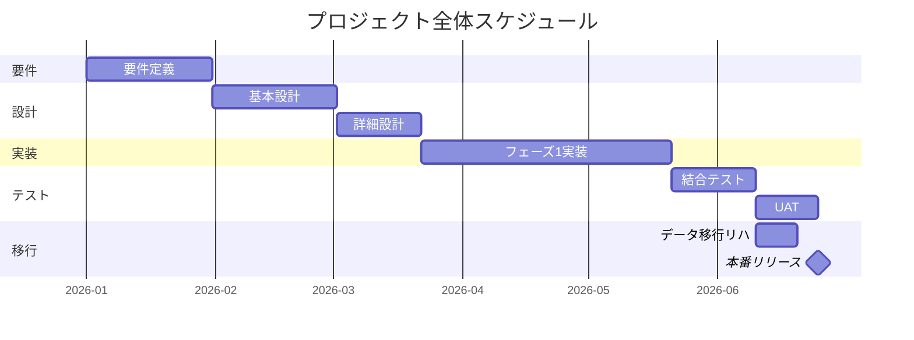
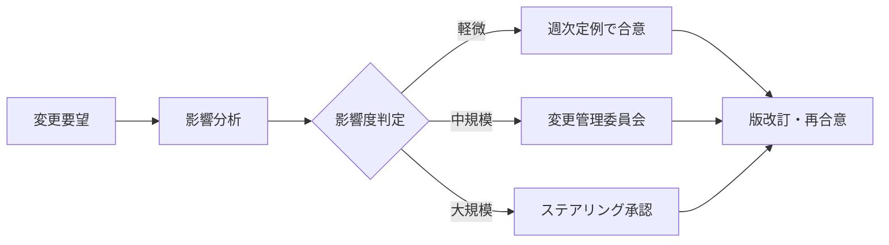

# [プロジェクト名] 要件定義書

<!--
このテンプレートはシステム受託開発の「プロジェクト全体の要件定義書（クライアント合意用）」として使用します。
einja-project-requirements Skill が AskUserQuestion で段階的にヒアリングを行い、本テンプレートのプレースホルダー（[ XXX を記入 ]）を埋めて `docs/project/requirements.md` を生成します。

参照規格: IPA「超上流から攻めるIT化の事例集」/ IPA「機能要件の合意形成ガイド」/ IPA・JUAS「非機能要求グレード」/ JIS X 0166（要件定義プロセス）/ 共通フレーム（SLCP）
図はMermaid記法を標準とする。C4記法は公式experimentalのため使用せず、graph TB + subgraph で表現する。
該当しない章は「該当しない場合は省略可」と明記された箇所を中心に削除可。
-->

## 0. 文書情報

| 項目 | 内容 |
|------|------|
| プロジェクト名 | [ プロジェクト正式名称 ] |
| 文書タイトル | [ 例: 〇〇システム 要件定義書 ] |
| 版番号 | [ 例: 1.0.0 ] |
| 最終更新日 | [ YYYY-MM-DD ] |
| 作成者 | [ 受託側責任者 氏名・所属 ] |
| 承認者（受託側） | [ 氏名・役職 ] |
| 承認者（発注側） | [ 氏名・役職 ] |
| ステータス | [ 草案 / レビュー中 / 合意済み ] |

## 目次（TOC）

- [0. 文書情報](#0-文書情報)
- [Sources](#sources)
- [1. プロジェクト概要](#1-プロジェクト概要)
- [2. 対象業務](#2-対象業務)
- [3. 対象ユーザー・ステークホルダー](#3-対象ユーザーステークホルダー)
- [4. システム化方針](#4-システム化方針)
- [5. スコープ境界](#5-スコープ境界)
- [6. 機能要件サマリ](#6-機能要件サマリ)
- [7. 非機能要件](#7-非機能要件)
- [8. データ要件](#8-データ要件)
- [9. 外部連携要件](#9-外部連携要件)
- [10. 移行要件](#10-移行要件)
- [11. 運用・保守要件](#11-運用保守要件)
- [12. プロジェクト体制と役割](#12-プロジェクト体制と役割)
- [13. スケジュール](#13-スケジュール)
- [14. 品質保証](#14-品質保証)
- [15. リスクと前提](#15-リスクと前提)
- [16. 合意事項・変更管理](#16-合意事項変更管理)
- [参考情報](#参考情報章別-ipajisjuas-参照源マッピング)

## Sources

本要件定義書が参照する一次資料および関連ドキュメントを以下に整理する。各項目のリンク先が最新であることを版改訂ごとに確認する。

| ソース | 種別 | リンク / パス | 備考 |
|--------|------|---------------|------|
| Asana | プロジェクト管理 | [ Asana プロジェクトURL ] | タスク・進捗・コミュニケーション |
| Figma | UIデザイン | [ Figma URL ] | 画面一覧はこちらで管理（本書では扱わない） |
| 見積もり書 | 商務 | [ ファイルパス or URL ] | 本書では金額・コストは扱わない |
| 契約書 | 商務 | [ ファイルパス or URL ] | 契約上の取り決めの根拠資料 |
| qa-test.md | 品質保証 | `docs/qa-test.md`（または該当パス） | 詳細な品質保証・テスト計画はこちら |
| 関連spec | 機能/Issue仕様 | `docs/specs/issues/...` | 機能単位の要件定義書 |
| 参考規格 | 規格 | IPA / JUAS / JIS X 0166 | §参考情報を参照 |

---

## 1. プロジェクト概要

### 1.1 背景

[ なぜ本プロジェクトが立ち上がったか。現状の課題、市場環境、経営上の要請等を平易な言葉で記述する ]

### 1.2 目的

[ 本プロジェクトで達成すべきこと（達成基準が明確になる表現で記述）。例: 「営業担当者の見積もり作業時間を50%削減し、月内クロージング率を10pt向上させる」 ]

### 1.3 ビジネス価値・KPI

| KPI項目 | 現状値 | 目標値 | 測定方法 | 測定タイミング |
|---------|--------|--------|----------|---------------|
| [ 例: 月次受注件数 ] | [ 100件 ] | [ 130件 ] | [ Asanaダッシュボード ] | [ 月次 ] |
| [ 例: 申請承認リードタイム ] | [ 3営業日 ] | [ 1営業日 ] | [ システムログ ] | [ 月次 ] |

### 1.4 用語定義

本書で使用する業務用語・略語の定義を以下に示す。発注側・受託側で意味が分かれる用語、業界固有用語は必ず本表で統一する。

| 用語 | 定義 | 備考 |
|------|------|------|
| [ 用語A ] | [ 定義 ] | [ 同義語 / 補足 ] |
| [ 用語B ] | [ 定義 ] | |

---

## 2. 対象業務

### 2.1 業務全体像

本プロジェクトが対象とする業務範囲を、AS-IS（現状）と TO-BE（あるべき姿）の両方で示す。

#### 2.1.1 AS-IS 業務フロー

[ AS-IS の主な課題・ボトルネックを箇条書きで補足記述 ]

#### 2.1.2 TO-BE 業務フロー

[ TO-BE 業務での主な改善ポイント・期待効果を箇条書きで補足記述 ]

### 2.2 業務課題と解決方針

| 課題ID | AS-IS 課題 | 解決方針（TO-BE） | 関連KPI |
|--------|-----------|------------------|---------|
| C-01 | [ 例: 紙台帳への二重入力 ] | [ システム入力に一本化、台帳廃止 ] | [ §1.3 KPI1 ] |
| C-02 | [ 例: 承認待ち時間が長い ] | [ Slack通知による即時承認導線 ] | [ §1.3 KPI2 ] |

### 2.3 業務ルール

業務上の重要なルール・規程・例外処理を以下に列挙する。

| ルールID | 内容 | 根拠 | 例外条件 |
|---------|------|------|---------|
| R-01 | [ 例: 5万円以上の発注は2段階承認 ] | [ 社内規程§X ] | [ 例外: 緊急案件 ] |
| R-02 | [ 例: 月末締めで翌5営業日に確定 ] | [ 経理規程 ] | |

---

## 3. 対象ユーザー・ステークホルダー

### 3.1 エンドユーザー

| ロール | ペルソナ概要 | 主な利用シーン | ITリテラシー |
|--------|-------------|---------------|------------|
| [ 例: 営業担当 ] | [ 30代、社外訪問が多い ] | [ 外出先で見積もり作成 ] | [ 中 ] |
| [ 例: 経理担当 ] | [ 40代、PC操作中心 ] | [ 月次締め処理 ] | [ 高 ] |

### 3.2 ステークホルダー一覧

| 区分 | 役割 | 氏名・部署 | 主な関心事 |
|------|------|----------|-----------|
| 決裁者 | [ 役職 ] | [ 氏名/部署 ] | [ 投資対効果・スケジュール ] |
| 業務オーナー | [ 役職 ] | [ 氏名/部署 ] | [ 業務要件・運用負荷 ] |
| 利用者代表 | [ 役職 ] | [ 氏名/部署 ] | [ UI/UX・操作性 ] |
| 運用者 | [ 役職 ] | [ 氏名/部署 ] | [ 監視・障害対応 ] |
| 情シス | [ 役職 ] | [ 氏名/部署 ] | [ セキュリティ・既存連携 ] |

### 3.3 権限マトリクス概要

[ 詳細な権限設計は機能仕様書側で扱うが、本書ではロールの大枠を整理する ]

| 主要機能領域 | 管理者 | 業務担当 | 閲覧専用 | 外部協力者 |
|------------|:-:|:-:|:-:|:-:|
| マスタ管理 | ○ | × | × | × |
| 業務データ登録 | ○ | ○ | × | × |
| 業務データ閲覧 | ○ | ○ | ○ | △ |
| レポート出力 | ○ | ○ | ○ | × |

凡例: ○=可能 / △=条件付き / ×=不可

---

## 4. システム化方針

### 4.1 システム化の範囲

本プロジェクトでシステム化する業務範囲、しない業務範囲を明示する。

| 業務 | システム化 | 備考 |
|------|:-:|------|
| [ 業務A ] | ○ | TO-BE フローに含む |
| [ 業務B ] | △ | フェーズ2で対応 |
| [ 業務C ] | × | 現行運用を継続 |

### 4.2 採用方針

| 観点 | 採用方針 | 理由 |
|------|---------|------|
| 構築形態 | [ パッケージ / スクラッチ / SaaS / ハイブリッド ] | [ 採用理由 ] |
| 基盤 | [ クラウド (AWS / GCP / Vercel / 他) / オンプレ ] | [ 採用理由 ] |
| 開発言語/FW | [ Next.js / TypeScript / Prisma 等 ] | [ einja標準スタックに準拠 ] |
| データベース | [ PostgreSQL / Neon / 他 ] | [ 採用理由 ] |

### 4.3 アーキテクチャ方針（高レベル）

[ アーキテクチャ上の重要な意思決定（ADR候補）を箇条書きで補足記述 ]

---

## 5. スコープ境界

### 5.1 機能スコープ

| 区分 | 内容 |
|------|------|
| 含む | [ 機能カテゴリA、機能カテゴリB ] |
| 含まない | [ 機能カテゴリC（フェーズ2）、機能カテゴリD（対象外） ] |

### 5.2 データスコープ

| 区分 | 対象データ | 備考 |
|------|----------|------|
| 含む | [ 顧客マスタ、取引データ ] | |
| 含まない | [ 過去5年以上の履歴データ ] | [ 別途アーカイブ運用 ] |

### 5.3 外部システム連携スコープ

| 連携先 | 方向 | フェーズ | 備考 |
|-------|------|---------|------|
| [ 既存ERP ] | 双方向 | フェーズ1 | リアルタイム連携 |
| [ SSO基盤 ] | 受信 | フェーズ1 | SAML 2.0 |
| [ BIツール ] | 送信 | フェーズ2 | バッチ連携 |

### 5.4 フェーズ分割

| フェーズ | 対象 | 主目的 |
|---------|------|--------|
| MVP / フェーズ1 | [ 最小機能セット ] | [ コア業務の代替完了 ] |
| フェーズ2 | [ 拡張機能 ] | [ 周辺業務の効率化 ] |
| フェーズ3（仮） | [ さらなる発展 ] | [ 経営ダッシュボード強化 ] |

---

## 6. 機能要件サマリ

<!--
本章は「機能の存在と概要」のみを扱う。詳細な機能要件（AC・画面・処理フロー等）は機能単位の仕様書（docs/specs/issues/...）に委譲する。
画面一覧は除外（Figma/UIデザイン側で管理）。外部I/F一覧は §9 で扱う。
-->

### 6.1 機能一覧

| 機能ID | 機能カテゴリ | 機能名 | 概要 | 優先度 | フェーズ |
|--------|------------|--------|------|--------|---------|
| F-01 | [ マスタ管理 ] | [ ユーザー管理 ] | [ ユーザーの登録・更新・削除 ] | MUST | フェーズ1 |
| F-02 | [ 業務管理 ] | [ 申請登録 ] | [ 業務申請の起票と承認導線 ] | MUST | フェーズ1 |
| F-03 | [ 業務管理 ] | [ 申請承認 ] | [ 申請の承認・差戻し ] | MUST | フェーズ1 |
| F-04 | [ レポート ] | [ 月次レポート ] | [ KPI集計のレポート出力 ] | SHOULD | フェーズ2 |

優先度凡例: MUST = 必須 / SHOULD = 推奨 / COULD = あれば良い / WON'T = 今回は対象外

### 6.2 バッチ一覧

| バッチID | 名称 | 実行タイミング | 概要 | 優先度 |
|---------|------|--------------|------|--------|
| B-01 | [ 日次集計バッチ ] | [ 毎日 03:00 ] | [ 前日分業務データの集計 ] | MUST |
| B-02 | [ 月次クリーンアップ ] | [ 月初 01:00 ] | [ 一時データの削除 ] | SHOULD |

該当しない場合は省略可。

### 6.3 帳票一覧

| 帳票ID | 名称 | 形式 | 出力タイミング | 概要 | 優先度 |
|--------|------|------|--------------|------|--------|
| R-01 | [ 月次業務レポート ] | PDF | [ 月次・手動 ] | [ KPIサマリ ] | MUST |
| R-02 | [ 申請履歴一覧 ] | Excel | [ オンデマンド ] | [ 申請履歴の出力 ] | SHOULD |

該当しない場合は省略可。

---

## 7. 非機能要件

<!--
JUAS/IPA「非機能要求グレード」の 6大項目に基づき、要約レベルで合意事項を整理する。
詳細値は §8 データ要件 / §11 運用・保守要件 / qa-test.md 等で補完する。
-->

### 7.1 可用性

| 項目 | 要件 | 備考 |
|------|------|------|
| 稼働率 | [ 例: 99.5% / 月 ] | 計画停止を除く |
| サービス時間 | [ 例: 平日 8:00-22:00 ] | |
| RTO（目標復旧時間） | [ 例: 4時間以内 ] | 障害発生から復旧まで |
| RPO（目標復旧時点） | [ 例: 24時間以内 ] | 最大データ損失許容範囲 |

### 7.2 性能・拡張性

| 項目 | 要件 | 備考 |
|------|------|------|
| 同時利用者数 | [ 例: ピーク時 200 ] | |
| レスポンス時間 | [ 例: 主要操作 1秒以内 ] | 95パーセンタイル |
| データ件数（5年後） | [ 例: 1000万件 ] | 主要テーブル想定 |
| スループット | [ 例: 100 req/sec ] | ピーク時 |

### 7.3 運用・保守性

| 項目 | 要件 | 備考 |
|------|------|------|
| 監視 | [ 例: APM導入、24h監視 ] | §11.2 参照 |
| ログ保管期間 | [ 例: 1年 ] | 監査要件に応じる |
| デプロイ頻度 | [ 例: 週次 ] | |
| 保守対応時間 | [ 例: 平日 9:00-18:00 ] | §11.4 参照 |

### 7.4 移行性

| 項目 | 要件 | 備考 |
|------|------|------|
| 移行対象データ | [ 例: 過去2年分 ] | §10.1 参照 |
| 移行方式 | [ 例: 一括 / 段階移行 ] | §10.2 参照 |
| 並行稼働期間 | [ 例: 1ヶ月 ] | |

### 7.5 セキュリティ

| 項目 | 要件 | 備考 |
|------|------|------|
| 認証 | [ 例: SSO（SAML 2.0）必須 ] | |
| 認可 | [ 例: RBAC、最小権限 ] | §3.3 参照 |
| 暗号化（通信） | [ TLS 1.3 ] | |
| 暗号化（保管） | [ AES-256 ] | 機密データ対象 |
| 監査ログ | [ 全API操作を記録 ] | 1年保管 |
| 個人情報 | [ 該当あり / 改正個人情報保護法準拠 ] | |

### 7.6 システム環境・エコロジー

| 項目 | 要件 | 備考 |
|------|------|------|
| 基盤 | [ クラウド（リージョン指定） ] | §4.2 参照 |
| ブラウザ | [ Chrome / Edge / Safari 最新2バージョン ] | |
| デバイス | [ PC（必須）/ タブレット（任意） ] | |
| 多言語 | [ 日本語のみ ] | |

---

## 8. データ要件

### 8.1 主要データ概念モデル

[ 主要な業務概念（エンティティ）と関係を上図で示す。物理設計は技術設計書側で扱う ]

### 8.2 データ量見積もり

| エンティティ | 初期件数 | 年間増加 | 5年後想定 | 備考 |
|------------|---------|---------|----------|------|
| [ ユーザー ] | [ 500 ] | [ +50 ] | [ 750 ] | |
| [ 申請 ] | [ 0 ] | [ 50,000 ] | [ 250,000 ] | |
| [ 添付ファイル ] | [ 0 ] | [ 100,000 ] | [ 500,000 ] | 平均 1MB |

### 8.3 データ保有方針

| データ種別 | 保有期間 | アーカイブ方針 | 削除方針 |
|----------|---------|--------------|---------|
| [ 業務トランザクション ] | [ 7年 ] | [ 3年経過後にコールドストレージ ] | [ 7年経過で削除 ] |
| [ 監査ログ ] | [ 1年 ] | [ 6ヶ月後アーカイブ ] | [ 法令準拠 ] |
| [ 個人情報 ] | [ 退会後3ヶ月 ] | - | [ 完全削除 ] |

---

## 9. 外部連携要件

### 9.1 連携システム一覧

| 連携ID | システム名 | 方向 | プロトコル | 同期/非同期 | フェーズ |
|--------|----------|------|----------|------------|---------|
| I-01 | [ 既存ERP ] | 双方向 | REST API | 同期 | フェーズ1 |
| I-02 | [ SSO ] | 受信 | SAML 2.0 | 同期 | フェーズ1 |
| I-03 | [ BIツール ] | 送信 | CSV/SFTP | 非同期（バッチ） | フェーズ2 |

### 9.2 連携方式

| 連携ID | 方式詳細 | 認証方式 | エラー時動作 |
|--------|---------|---------|------------|
| I-01 | [ 業務完了時にWebhook送信 ] | [ OAuth 2.0 Client Credentials ] | [ リトライ3回 / DLQ ] |
| I-02 | [ ログイン時にSPコールバック ] | [ X.509 証明書 ] | [ ローカル認証フォールバック不可 ] |
| I-03 | [ 日次バッチでファイル配置 ] | [ SSH鍵 ] | [ 監視アラート → 翌日再送 ] |

### 9.3 連携データ仕様概要

[ 詳細な連携項目一覧（フィールド定義・サンプル）は別紙またはAPI仕様書で管理 ]

| 連携ID | 主要データ項目 | 仕様書参照 |
|--------|--------------|----------|
| I-01 | [ ユーザーID、業務ID、ステータス、更新日時 ] | [ API仕様書 §3.x ] |
| I-02 | [ NameID、ロール属性 ] | [ SSO設計書 ] |

該当しない場合は本章を省略可。

---

## 10. 移行要件

<!-- 新規構築で移行データが存在しない場合は本章ごと省略可 -->

### 10.1 移行データ

| 区分 | 対象 | 件数想定 | 移行元 |
|------|------|---------|--------|
| [ 顧客マスタ ] | [ 全件 ] | [ 5,000 ] | [ 旧システムDB ] |
| [ 申請履歴 ] | [ 直近2年分 ] | [ 50,000 ] | [ 紙台帳 + 旧DB ] |

### 10.2 移行時期・方式

| 項目 | 内容 |
|------|------|
| 移行時期 | [ 本番リリース1週前 〜 リリース日 ] |
| 移行方式 | [ 一括移行（リリース当日に切替） / 段階移行 ] |
| 並行稼働 | [ あり / なし ]、期間 [ ] |
| 移行リハーサル | [ 本番1ヶ月前 / 本番2週間前 ] |

### 10.3 移行リスク

| リスク | 影響度 | 対応策 |
|--------|-------|--------|
| [ データクレンジング遅延 ] | 高 | [ 専任担当アサイン、週次進捗確認 ] |
| [ 旧システム停止時の業務影響 ] | 中 | [ 切替を業務閑散期に実施 ] |

---

## 11. 運用・保守要件

### 11.1 運用体制

| 役割 | 担当 | 主な責務 |
|------|------|---------|
| 運用責任者 | [ 発注側情シス ] | [ 全体統括・意思決定 ] |
| 監視オペレータ | [ 委託先A ] | [ 24h監視・1次対応 ] |
| アプリ保守 | [ 受託側 ] | [ バグ修正・機能追加 ] |
| インフラ保守 | [ クラウドベンダー ] | [ 基盤運用 ] |

### 11.2 監視・障害対応

| 項目 | 内容 |
|------|------|
| 監視ツール | [ Datadog / Sentry / 他 ] |
| 監視対象 | [ APMメトリクス、エラーレート、ジョブ実行結果 ] |
| 障害連絡経路 | [ PagerDuty → 運用責任者 → 開発担当 ] |
| インシデント分類 | [ Sev1/Sev2/Sev3 ] |
| エスカレーション基準 | [ Sev1: 即時 / Sev2: 1時間以内 / Sev3: 翌営業日 ] |

### 11.3 バックアップ

| 対象 | 頻度 | 保管期間 | 保管場所 |
|------|------|---------|---------|
| DB（フル） | [ 週1回 ] | [ 4世代 ] | [ 別リージョン ] |
| DB（差分） | [ 日次 ] | [ 14日 ] | [ 同リージョン ] |
| 添付ファイル | [ 日次 ] | [ 30日 ] | [ 別ストレージ ] |

### 11.4 保守範囲

| 区分 | 含む | 含まない |
|------|------|---------|
| バグ修正 | ○ | - |
| 軽微な機能改善 | ○（月X時間まで） | 大規模機能追加 |
| 基盤バージョンアップ | ○（マイナー） | メジャー（別契約） |
| 利用者問い合わせ対応 | △（一次は発注側） | エンドユーザー直接対応 |

---

## 12. プロジェクト体制と役割

### 12.1 体制図

### 12.2 役割分担

| 役割 | 担当（発注側） | 担当（受託側） | 主な責務 |
|------|--------------|--------------|---------|
| プロジェクト統括 | [ 氏名 ] | [ 氏名 ] | [ スコープ管理・予算管理 ] |
| 業務要件決定 | [ 氏名 ] | - | [ 業務要件の最終決定 ] |
| 技術設計 | - | [ 氏名 ] | [ アーキテクチャ・実装方針 ] |
| 受入テスト | [ 氏名 ] | - | [ AC基準の最終承認 ] |
| 運用引継ぎ | [ 氏名 ] | [ 氏名 ] | [ 運用手順整備 ] |

### 12.3 意思決定プロセス

| 意思決定種別 | 決裁者 | プロセス | SLA |
|------------|--------|---------|-----|
| スコープ変更 | [ プロジェクトオーナー ] | [ 変更管理プロセス §16.1 ] | [ 5営業日以内 ] |
| 仕様変更（軽微） | [ 業務オーナー ] | [ 週次定例で承認 ] | [ 週次 ] |
| 技術選定 | [ テックリード ] | [ 受託側で決定、発注側に共有 ] | [ 都度 ] |

### 12.4 報告・連絡・相談ルール

| 種別 | 頻度 | 形式 | 参加者 |
|------|------|------|--------|
| 進捗定例 | 週1回 | オンライン会議 + 議事録 | PM + 業務オーナー + テックリード |
| ステアリング | 月1回 | 対面/オンライン | 役員 + PM |
| 日次共有 | 日次 | Slack/Asana | 開発チーム全員 |
| 緊急連絡 | 随時 | 電話 + Slack | 担当責任者 |

---

## 13. スケジュール

<!-- 見積もり・コスト情報は本書に含めない（契約書・見積もり書を Sources 表で参照） -->

### 13.1 マイルストーン

| マイルストーン | 目標日 | 達成基準 |
|--------------|--------|---------|
| 要件定義完了 | [ YYYY-MM-DD ] | 本書の発注側承認 |
| 基本設計完了 | [ YYYY-MM-DD ] | 設計レビュー承認 |
| 開発完了 | [ YYYY-MM-DD ] | 全機能の単体テスト完了 |
| UAT完了 | [ YYYY-MM-DD ] | 受入テスト合格 |
| 本番リリース | [ YYYY-MM-DD ] | 本番環境稼働開始 |
| 検収完了 | [ YYYY-MM-DD ] | 検収書発行 |

### 13.2 フェーズ分割

### 13.3 主要レビュータイミング

| レビュー | タイミング | 参加者 | 成果物 |
|---------|----------|--------|--------|
| 要件レビュー | 要件定義完了時 | 全ステークホルダー | 本書の承認 |
| 基本設計レビュー | 基本設計完了時 | 業務オーナー + テックリード | 基本設計書 |
| UAT進捗レビュー | UAT中の週次 | 業務オーナー + PM | UAT結果レポート |

### 13.4 納期

| 区分 | 期日 | 備考 |
|------|------|------|
| 中間納品 | [ YYYY-MM-DD ] | [ 設計書一式 ] |
| 最終納品 | [ YYYY-MM-DD ] | [ ソース + ドキュメント一式 ] |
| 検収期限 | [ YYYY-MM-DD ] | [ 納品から30日以内 ] |

---

## 14. 品質保証

<!-- 概要のみ記述。詳細なテスト計画・テストシナリオは qa-test.md（または該当パス）を参照 -->

### 14.1 品質目標

| 観点 | 目標 | 測定方法 |
|------|------|---------|
| 機能適合性 | [ AC全件 PASS ] | [ qa-test.md のシナリオ ] |
| 信頼性 | [ 重大バグ 0件 ] | [ リリース後30日の障害件数 ] |
| 使用性 | [ UAT満足度 4以上/5 ] | [ アンケート ] |
| 性能 | [ §7.2 の要件達成 ] | [ 負荷試験 ] |

### 14.2 受入基準

| 区分 | 基準 |
|------|------|
| 機能 | [ 全 MUST 要件の AC 合格、SHOULD 要件の80%以上合格 ] |
| 性能 | [ §7.2 の数値要件を全て充足 ] |
| セキュリティ | [ §7.5 の要件に基づく脆弱性診断クリア ] |
| ドキュメント | [ 運用手順書・操作マニュアルの納品完了 ] |

詳細は `docs/qa-test.md`（または該当パス）を参照。

---

## 15. リスクと前提

### 15.1 想定リスクと対応策

| リスクID | リスク内容 | 影響度 | 発生確率 | 対応策 |
|---------|----------|-------|---------|--------|
| RK-01 | [ 業務オーナーのレビュー遅延 ] | 高 | 中 | [ レビュー期限を週次で合意・遅延時はエスカレーション ] |
| RK-02 | [ 外部API仕様変更 ] | 中 | 低 | [ 連携先と定期会議・抽象化レイヤ設置 ] |
| RK-03 | [ データクレンジングの工数膨張 ] | 高 | 中 | [ 早期サンプル抽出・専任担当 ] |

### 15.2 前提条件

| 区分 | 前提条件 | 備考 |
|------|---------|------|
| 体制 | [ 発注側の業務オーナーが週X時間確保 ] | |
| データ | [ 既存データの構造が事前共有済み ] | |
| 環境 | [ クラウドアカウントが発注側名義で準備済み ] | |
| 法令 | [ 改正個人情報保護法に基づく要件は本書時点で確定 ] | |

### 15.3 制約条件

| 区分 | 制約 | 影響 |
|------|------|------|
| 予算 | [ 別途見積もり書参照 ] | [ スコープ固定 ] |
| 期限 | [ §13.1 のマイルストーンが絶対期日 ] | [ スコープ調整余地あり ] |
| 技術 | [ 既存基幹システムとの互換性必須 ] | [ アーキテクチャ制約 ] |
| 法令 | [ 個人情報の国内保管必須 ] | [ クラウドリージョン制約 ] |

### 15.4 未確定事項

| 項目 | 内容 | 確定予定日 | 担当 |
|------|------|----------|------|
| TBD-01 | [ 外部システムB の連携仕様 ] | [ YYYY-MM-DD ] | [ 担当者 ] |
| TBD-02 | [ 月次レポートのKPI定義 ] | [ YYYY-MM-DD ] | [ 業務オーナー ] |

---

## 16. 合意事項・変更管理

### 16.1 変更管理プロセス

要件定義書の合意後、内容変更が必要な場合は以下のプロセスに従う。

| 影響度 | 判定基準 | 承認者 | リードタイム |
|-------|---------|--------|------------|
| 軽微 | 工数 < 1人日 / スケジュール影響なし | 業務オーナー | 1営業日 |
| 中規模 | 工数 1〜5人日 / 既存要件への影響あり | 変更管理委員会 | 5営業日 |
| 大規模 | 工数 > 5人日 / スコープ・期日影響あり | プロジェクトオーナー | 10営業日 |

### 16.2 承認欄

本要件定義書の内容について、以下の通り合意する。

| 区分 | 役職 | 氏名 | 承認日 | 署名/印 |
|------|------|------|--------|--------|
| 発注側 承認者 | [ 役職 ] | [ 氏名 ] | [ YYYY-MM-DD ] | |
| 発注側 業務オーナー | [ 役職 ] | [ 氏名 ] | [ YYYY-MM-DD ] | |
| 受託側 プロジェクトマネージャー | [ 役職 ] | [ 氏名 ] | [ YYYY-MM-DD ] | |
| 受託側 テックリード | [ 役職 ] | [ 氏名 ] | [ YYYY-MM-DD ] | |

### 16.3 版歴表

| 版 | 日付 | 変更概要 | 変更箇所 | 作成者 | 承認者 |
|----|------|---------|---------|--------|--------|
| 0.1 | [ YYYY-MM-DD ] | 初版（ドラフト） | 全体 | [ 氏名 ] | - |
| 1.0 | [ YYYY-MM-DD ] | 初版承認 | - | [ 氏名 ] | [ 氏名 ] |
| 1.1 | [ YYYY-MM-DD ] | [ 変更概要 ] | [ §X.Y ] | [ 氏名 ] | [ 氏名 ] |

---

## 参考情報（章別 IPA/JIS/JUAS 参照源マッピング）

本要件定義書の各章は、以下の公開ガイドライン・規格を参考に構成している。詳細な記述方針は `references/structure-guide.md` を参照。

| 章 | 主参照源 | 補足 |
|----|---------|------|
| §1 プロジェクト概要 / §2 対象業務 / §3 対象ユーザー・ステークホルダー / §15 リスクと前提 | IPA「超上流から攻めるIT化の事例集」/ 共通フレーム（SLCP） | ステークホルダー識別・業務理解の基礎 |
| §4 システム化方針 / §5 スコープ境界 | JIS X 0166（要件定義プロセス） | スコープ管理・採用方針の合意 |
| §6 機能要件サマリ | IPA「機能要件の合意形成ガイド」 | 機能一覧粒度・優先度の表現 |
| §7 非機能要件 | IPA/JUAS「非機能要求グレード」 | 6大項目（可用性 / 性能・拡張性 / 運用・保守性 / 移行性 / セキュリティ / システム環境・エコロジー）の要約レベル合意 |
| §8 データ要件 / §9 外部連携要件 | 共通フレーム / JIS X 0166 | 概念モデル・連携方式の整理 |
| §10 移行要件 / §11 運用・保守要件 | IPA/JUAS「非機能要求グレード」（運用性・移行性） | 運用・移行の合意項目 |
| §12 プロジェクト体制 / §13 スケジュール / §16 合意事項・変更管理 | 共通フレーム（プロセス・プロジェクト管理） | 体制・スケジュール・変更管理 |
| §14 品質保証 | `docs/qa-test.md`（einja既存QA仕様）と整合 | 詳細は別文書 |

### 記法ガイドライン

- 図は **Mermaid記法** を標準とする
  - 業務フロー: `flowchart TD` + `subgraph` によるスイムレーン（§2.1）
  - アーキテクチャ: `graph TB` + `subgraph`（C4 Container相当、§4.3）
  - 概念データモデル: `erDiagram`（§8.1）
  - 体制図: `graph TB` または `graph LR`（§12.1）
  - スケジュール: `gantt` チャート（§13.2）
  - 変更管理プロセス: `flowchart LR`（§16.1）
- **C4記法（C4Context, C4Container）は使用禁止**（公式 experimental のため）
- テーブルは Markdown 標準（GFM）
- 章ごとに **「該当しない場合は省略可」** と明記された箇所は、プロジェクト特性に応じて削除可

### 関連ドキュメント

- 機能/Issue単位の詳細要件: `docs/specs/issues/{category}/issue{N}-{name}/requirements.md`
- 品質保証・テスト計画詳細: `docs/qa-test.md`
- UIデザイン: Sources 表の Figma URL
- 見積もり・契約: Sources 表の見積もり書・契約書
