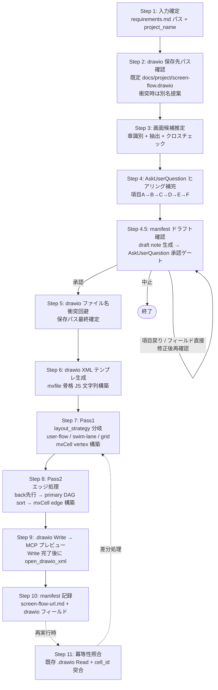

<!--
**上流 Skill**: `einja-design-5-planes`（goodpatch 5 段階モデル横断オーケストレーター）から呼び出される下流 Skill のひとつ。
- 担当 Plane: **Plane 3 Structure（画面遷移構造 / ナビ）+ Plane 4 Skeleton（v3 user-flow 配置）**
- 単独起動も可能。`einja-design-5-planes` 経由起動時は manifest を介した進捗管理が伴う
- マッピング詳細: `.claude/skills/einja-design-5-planes/references/skill-mapping.md` §1 / §4 参照
-->

<!-- 入力ソース: .claude/skills/einja-project-requirements/SKILL.md (docs/project/requirements.md) -->

# einja-project-screen-flow-drawio: プロジェクト画面遷移図 drawio 生成 Skill

## 1. このSkillはいつ起動するか

`docs/project/requirements.md`（einja-project-requirements の出力）を入力に **プロジェクト全体の画面遷移図を drawio 上に新規生成・再生成** したい場面で起動する。

典型ユースケース:
- 受託案件で要件定義書が確定し、クライアント合意用の画面遷移俯瞰図を drawio で残したい
- 要件定義書を更新したので画面遷移図を再生成し、既存ユーザー編集を保持しつつ差分のみ反映したい
- §2 業務フローから画面候補を機械的に抽出し、AskUserQuestion で確定させたい

Do NOT use for: Issue 単位の画面モックアップ（→ `ui-design-generator`）、Issue 単位の `requirements.md §8.2` mermaid（→ `requirements-generator`）、状態遷移図（→ `design.md State Transitions`）、FigJam ファイル生成。

## 2. 前提・事前準備

| 項目 | 内容 |
|------|------|
| 入力ファイル | `docs/project/requirements.md`（`einja-project-requirements` で生成済み） |
| drawio MCP | `mcp__drawio__open_drawio_xml` はエディタを開くのみで永続化しない。`.drawio` ファイルは別途 `Write` で保存する（Step 9 参照） |
| 保存先既定値 | `docs/project/screen-flow.drawio`（衝突時は Step 2 で別名確認） |
| drawio XML 構造 | `references/drawio-style-rules.md §1` を参照 |

## 3. ワークフロー全体図



再生成時は Step 1〜5 → Step 11（既存 manifest 検出）→ Step 7/8（差分のみ）→ Step 9/10 の順で進む。

## 4. メインワークフロー

### Step 1: 入力確定

1. 引数が与えられていれば `docs/project/requirements.md` のパスとして採用。未指定なら AskUserQuestion で確認（既定値: `docs/project/requirements.md`）。
2. `Read` で内容を取得。`# プロジェクト要件定義書` / `# {案件名} 要件定義書` のいずれかが冒頭にあることを最低限の妥当性チェックとする。
3. `project_name` を確定する:
   - frontmatter または §1 概要から案件名を取得し、kebab-case 化（例: 勤怠管理SaaS → `attendance-saas`）
   - 確定不能なら AskUserQuestion で kebab-case 文字列を直接ユーザーに入力させる

### Step 2: drawio 保存先パス確認

1. 既定保存先 `docs/project/screen-flow.drawio` を採用する。
2. **衝突チェック**: `docs/project/screen-flow.drawio` が既存の場合:
   - 再生成フロー（Step 11 経由）: 既存ファイルを流用するため衝突とはみなさない。
   - 別プロジェクトの初回生成でファイルが存在する場合: AskUserQuestion で以下の 3 択を提示する。
     - 上書き（既存 `.drawio` を `.bak` 退避して上書き）
     - 別名保存（例: `docs/project/{project_name}-screen-flow.drawio`）
     - 中止
3. **`.gitignore` 確認**: `Bash` で `.gitignore` に `docs/project/*.drawio.bak` が含まれているかを確認し、未登録なら追記する。

### Step 3: 画面候補推定（章識別 + 抽出 + クロスチェック）

→ 詳細抽出ルールは `references/hearing-checklist.md` の §1〜§3 を参照。

要約:
- **主要シグナル**: 「対象業務」章配下の `TO-BE 業務フロー` を見出し名ベースで検索（章番号は揺らぐため見出しテキスト依存）。mermaid `flowchart` の subgraph "従業員"/"上長"/"人事部" 等のアクター配下ノードを抽出。
- **補助シグナル**: 「対象ユーザー」章配下の権限マトリクス、「スコープ境界」章、「機能要件サマリ」章配下の機能一覧から不足画面を補強。
- システム側ノード（"新システム"/"バッチ" 等）は除外。
- 推定画面には全件 **`(暫定推定)`** マークを付与する。
- **権限マトリクス × フロー クロスチェック**: 推定段階で `references/hearing-checklist.md §3.4` のクロスチェックを実施し、権限マトリクス由来で業務フローに登場しない画面候補を「抽出漏れ候補」として検出する。各候補に `source_confidence: high / medium / low`（`references/canonical-enums.md §6` 参照）を付与し、`high` 以外は Step 4 項目 A で必ず確認対象とする。
- **共通画面候補リストの拡張**: `references/hearing-checklist.md §3.3` の共通画面リスト（`login` / `home` / `settings` / `error` / `not-found-404` / `session-expired` / `forbidden-403` / `maintenance`）を出現条件に応じて画面候補に追加する。既定 ON のものは Step 4 項目 E のデフォルトで採用される。

抽出失敗時のフォールバック: 「機能要件サマリ」章配下の機能一覧の全機能を 1:1 で `{機能名}-画面` として画面化（最低限のセーフティネット）。

### Step 4: AskUserQuestion ヒアリング補完

→ 詳細項目テンプレは `references/hearing-checklist.md` の §4 を参照。

ヒアリングは **項目 A→B→C→D→E** の順に分割実行する（一度に多くを聞かない）。

| 項目 | 内容 | デフォルト |
|------|------|--------|
| A | 画面リスト確定（追加・削除・名称修正）。クロスチェック由来 `source_confidence != "high"` は明示確認 | - |
| B | 画面間遷移（エッジの追加・削除・方向） | - |
| C | 遷移トリガー（クリック / 自動 / 条件分岐 / ラベルなし） | - |
| D | ロール別グルーピング（権限マトリクスがある場合）。辞書外ロール検出時は `role_canonical_map` への明示マッピング追加をサブ質問で促す。drawio の swim-lane レイアウト使用時は lane 別 mxCell で表現 | **デフォルト ON: `layout_strategy: user-flow`** 採用（`references/canonical-enums.md §1` 参照）。視認性とエントリポイント基準階層化のため。`swim-lane` は role 軸明示時のみ採用 |
| E | 共通画面の追加（`references/hearing-checklist.md §3.3` 共通画面リスト） | 既定 ON の `error` / `not-found-404` / `session-expired` / `forbidden-403` 等を一括採用。詳細選択肢は `references/hearing-checklist.md §4 項目E` 参照 |
| F | エントリポイント確認（`references/drawio-style-rules.md §3.3.1` 3-method priority chain による自動検出が全 0 件の場合のみ escalation 起動）。質問例: 「業務フローの開始画面を選択してください」 | 自動検出成功時は質問を skip（OFF 相当）。自動検出 0 件時のみ AskUserQuestion で表示 |

各選択肢は **description（What）+ Note（So What）** の2層構成とし、必ず **「その他（自由入力）」** を最後の選択肢として含める（推測で進めない原則）。

**項目 D 辞書外ロール検出時の追加対応**: 辞書外ロールが検出された場合（`Role_${hash}` 動的生成対象）、ユーザーに「`role_canonical_map` への明示マッピング追加」を促すサブ質問を表示する。これによりデフォルト `Role_a1b2c3d4` のような hash ID が drawio 上に表示されることを防ぐ。マッピング先候補は `references/canonical-enums.md §5` の canonical 識別子（`Common` / `Employee` / `Manager` / `HR` / `Admin` / `Ext`）から選択させる（+ 自由入力）。

### Step 4.5: manifest ドラフト確認フェーズ（drawio 書き出し前のゲート）

Step 4 ヒアリング完了後、drawio 書き出し（Step 6 以降）の前に、manifest ドラフトをユーザー承認する関門ステップ。draft note を生成してサマリを提示し、問題があればヒアリング項目への差し戻しまたはフィールド直接修正を受け付ける。承認が得られて初めて Step 5 へ進む。

#### 処理

**処理 1: draft note 生成**

`docs/project/screen-flow-url.draft.md` を `Write` で生成する。内容は以下の構造に従う（詳細フォーマット仕様は `references/manifest-schema.md §8` を参照）。

- frontmatter: `project_name` / `layout_strategy` / `role_canonical_map` / `schema_version`
- `## screens` セクション: 各画面の `name` / `role` / `lane_id` / `source_confidence` / `is_entry_point`（`cell_id` / `drawio_file_path` は全件 `PLACEHOLDER`）
- `## edges` セクション: 各エッジの `from` / `to` / `trigger` / `edge_kind` / `routing`（同様に drawio 接続情報は `PLACEHOLDER`）

> **cell_id PLACEHOLDER 取り扱い**: 本ステップの draft note では `cell_id` を `PLACEHOLDER_CELL_ID_*` で生成する。schema_version: 2 では `cell_id` は manifest 必須だが、reader 側（`normalizeManifestV1or2` v2 ブランチ）で PLACEHOLDER 検出時は `toCellId("screen__" + simpleSuffix(stable_id))` で自動補完する（詳細: `references/manifest-schema.md §5`）。draft note 段階では未確定のままで構わない。
- 末尾コメントブロック（ヒアリング応答ログのテンプレ仕様は `references/hearing-checklist.md §7.3` 参照、ライフサイクル仕様は `references/manifest-schema.md §8.2` 参照）:

  ```
  <!--
  status: draft
  generated_at: <ISO8601>
  hearing_responses:
    A: <応答サマリ>
    B: <応答サマリ>
    C: <応答サマリ>
    D: <応答サマリ>
    E: <応答サマリ>
    F: <応答サマリ or "skip（自動検出）">
  ユーザー承認待ち — drawio 未書き出し
  -->
  ```

**処理 1.5: `.gitignore` 確認・追記**

`Bash` で `.gitignore` に以下の 2 パターンが含まれているかを確認し、未登録の場合は追記する（既存パターンと重複する場合はスキップ）。

```
docs/project/*.draft.md
docs/project/*.draft.aborted*.md
```

**処理 2: 既存 manifest 差分算出（再生成時のみ）**

`docs/project/screen-flow-url.md`（status: confirmed）が存在する場合に実施する（初回生成時はスキップ）。アルゴリズム詳細は `references/manifest-schema.md §8.5` を参照。

概要:
1. `Read` で既存 confirmed manifest を読む
2. 既存 `## screens` の `name` / `stable_id` 一覧を Set X として抽出
3. draft note の `## screens` の `name` / `stable_id` 一覧を Set Y として抽出
4. 差分算出: 追加（Y − X）→ ✅ / 削除（X − Y）→ ❌ / 共通（X ∩ Y でフィールド値比較）→ 変更あり 🔄
5. `## edges` も同様に diff
6. 件数をサマリ表の「差分」列に集計

**処理 3: AskUserQuestion 提示**

description にサマリ表（`references/manifest-schema.md §8.4` サマリ表テンプレの screen-flow 列を使用）と draft note ファイルパス（`docs/project/screen-flow-url.draft.md`）を表示する。再生成時は差分件数（✅ N 件 / ❌ M 件 / 🔄 K 件）もサマリ表に含める。

選択肢は以下の 10 件（必ず全件提示する）:

| # | 選択肢 | 動作 |
|---|--------|------|
| 1 | 承認 → drawio 書き出し開始 | 処理 4 へ |
| 2 | 画面リスト修正 → 項目 A に戻る | 処理 5 へ（項目 A 再実行） |
| 3 | エッジ修正 → 項目 B に戻る | 処理 5 へ（項目 B 再実行） |
| 4 | トリガー文言修正 → 項目 C に戻る | 処理 5 へ（項目 C 再実行） |
| 5 | layout_strategy 修正 → 項目 D に戻る | 処理 5 へ（項目 D 再実行） |
| 6 | 共通画面修正 → 項目 E に戻る | 処理 5 へ（項目 E 再実行） |
| 7 | エントリ指定修正 → 項目 F に戻る | 処理 5 へ（項目 F 再実行） |
| 8 | フィールド直接修正（自由入力で `screens[<screen-name>].xxx = yyy` 形式、例: `screens[login].is_entry_point = true`） | 処理 6 へ |
| 9 | 中止 → `.draft.aborted.md` 退避して終了 | 処理 7 へ |
| 10 | その他（自由入力） | 処理 8 へ |

識別子記法の完全仕様（`screens[<screen-name>]` / `edges[N]`）は `references/hearing-checklist.md §7.4` を参照。

**処理 4: 承認時**

draft note は**保持したまま**（即削除しない）Step 5 へ進む。Step 10 で manifest 出力が成功した後に draft note を削除する（drawio 書き出し途中で中断した場合に再開ソースとして使用できるようにするため）。

**処理 5: 項目戻り時**

該当ヒアリング項目（A〜F）を再実行する。再実行結果を draft note に `Edit` で反映した後、Step 4.5 の冒頭（処理 3 の AskUserQuestion 提示）に戻り再確認する。

**処理 6: フィールド直接修正時**

自由入力で指定された修正指示（`screens[<name>].xxx = yyy` / `edges[N].xxx = yyy` 形式）を `references/hearing-checklist.md §7.4` の識別子規約に従って解釈し、draft note を `Edit` で更新する。更新後に YAML 構文を簡易 validate する（構文エラー時は AskUserQuestion で再入力を依頼）。更新成功後は処理 3 に戻り承認確認を再度行う。

**処理 7: 中止時**

draft note を `.draft.aborted.md` にリネームする（`Bash` で `mv`）。既存の `.draft.aborted.md` が存在する場合は `<manifest-name>.draft.aborted-YYYYMMDD-HHMMSS.md` の timestamp サフィックス付き名にフォールバックする（上書き禁止）。その後 Skill を終了する。

**処理 8: その他（自由入力）**

自由入力の内容を受けて、修正内容が項目戻りまたはフィールド直接修正の範囲に収まる場合は処理 5 / 処理 6 に分岐する。それ以外の場合は中止（処理 7）に誘導する。

#### 再生成時の差分強調

既存 `screen-flow-url.md`（status: confirmed）がある場合、draft note との差分を AskUserQuestion description に以下の形式で表示する:

- 追加: ✅ `screens[settings] (新規)`
- 削除: ❌ `screens[old-page] (orphan 化予定)`
- 変更: 🔄 `screens[login].is_entry_point: false → true`

変更なし再生成の場合も auto-pass せず、明示確認を必ず実施する。

> 共通仕様（draft note フォーマット / 識別子規約 / サマリ表テンプレ / 差分算出アルゴリズム）の正式定義は `references/manifest-schema.md §8` および `references/hearing-checklist.md §7`（特に §7.4 識別子規約 / §7.7 AskUserQuestion 文言テンプレ）を参照。

### Step 5: drawio ファイル名衝突回避

1. Step 2 で確定した保存先パス（既定: `docs/project/screen-flow.drawio`）を最終確認する。
2. `docs/project/` ディレクトリが存在しない場合は `Bash` で `mkdir -p docs/project` を実行する（E9 対応）。
3. 保存先パスに `.bak` 退避ルール（Step 10 参照）と `.gitignore` 追記（Step 2 処理済み）が整っていることを確認して Step 6 へ進む。

### Step 6: drawio XML テンプレート生成

承認済み draft note（`docs/project/screen-flow-url.draft.md`）をベースに drawio XML の骨格を JS 文字列として構築する。

詳細仕様は `references/drawio-style-rules.md §1` を参照。

骨格構造:

```xml
<mxfile>
  <diagram name="Screen Flow">
    <mxGraphModel dx="1422" dy="762" grid="0" gridSize="10" guides="1"
                  tooltips="1" connect="1" arrows="1" fold="1" page="0"
                  pageScale="1" pageWidth="1169" pageHeight="827"
                  math="0" shadow="0">
      <root>
        <mxCell id="0"/>
        <mxCell id="1" parent="0"/>
        <!-- lane 背景 mxCell をここに挿入（z-order: lane → screen → edge） -->
        <!-- screen mxCell をここに挿入 -->
        <!-- edge mxCell をここに挿入 -->
      </root>
    </mxGraphModel>
  </diagram>
</mxfile>
```

**cell_id 生成規約**: `screen__{simpleSuffix(stable_id)}` または `edge__{simpleSuffix(from)}__to__{simpleSuffix(to)}` を base として生成する。詳細な命名規則・XML 不正文字エスケープ・XML 値エスケープヘルパー `xmlAttr()` は **`references/drawio-style-rules.md §1.5 / §1.7`** を SSoT として参照すること。manifest 内の `stable_id` は変更せず、`cell_id` のみ加工する。

### Step 7: Pass 1 - FrameNode 配置（layout_strategy 分岐）

> **前提**: Step 4.5 で承認済みの draft note（`docs/project/screen-flow-url.draft.md`）をベースに drawio XML 構築を開始する。manifest 内容はこの時点でユーザー承認済みである。

→ レイアウト計算の詳細は `references/drawio-style-rules.md` の §3「2 パス生成戦略」を参照。

#### layout_strategy 分岐

manifest frontmatter の `layout_strategy`（`references/canonical-enums.md §1`）に応じて配置経路を分岐する。

- `layout_strategy === "user-flow"` → `references/drawio-style-rules.md §3.3 user-flow レイアウト` へ（v3 推奨デフォルト）
- `layout_strategy === "swim-lane"` → `references/drawio-style-rules.md §3.1 swim-lane レイアウト` へ
- `layout_strategy === "grid"` → `references/drawio-style-rules.md §3.2 grid レイアウト（v1 legacy / fallback）` へ

#### screen mxCell 構築

各画面を以下の形式で構築する（詳細スタイル定義は `references/drawio-style-rules.md §4` 参照）:

```xml
<mxCell id="{cell_id}" value="{screen_name}" vertex="1" parent="1"
        style="rounded=1;whiteSpace=wrap;html=1;fillColor=#dae8fc;strokeColor=#6c8ebf;fontStyle=1;fontSize=14;">
  <mxGeometry x="{x}" y="{y}" width="240" height="160" as="geometry"/>
</mxCell>
```

**座標計算**: v3 user-flow の座標式をそのまま流用する:
- `x = 80 + depth * 400`（BFS 深さに応じた水平位置）
- `y = clusterY(parent median)`（親ノードの中央値ベースのクラスタリング）

詳細は `references/drawio-style-rules.md §3.3` を参照。

#### lane 背景 mxCell の構築（swim-lane 時）

swim-lane レイアウト時は lane 背景 mxCell を画面 mxCell より**先に** root へ挿入する（z-order 制御）。

```xml
<!-- lane 背景: 画面 mxCell より先に挿入 -->
<mxCell id="{lane_cell_id}" value="{lane_label}" vertex="1" parent="1"
        style="swimlane;startSize=30;fillColor=#f5f5f5;strokeColor=#666666;fontColor=#333333;">
  <mxGeometry x="{lane_x}" y="{lane_y}" width="{lane_width}" height="{lane_height}" as="geometry"/>
</mxCell>
```

詳細は `references/drawio-style-rules.md §3 / §4` を参照。

#### user-flow 経路の追加注意

- **エントリ検出 3-method priority chain**: `references/drawio-style-rules.md §3.3.1` の方式（manifest 明示 (`is_entry_point: true`) → 名前 heuristics (`/^(login|signin|sign-in|entry|top|landing|splash)(-|$)/i`) → primary in-degree 0）を優先順で適用。全 0 件の場合は項目 F へ escalation し、AskUserQuestion で開始画面を確認する（`references/canonical-enums.md §10` `entry-detection-method` enum 参照）。
- **親 set の一意定義**: 各ノードの「親」は `self.depth - 1` の predecessor 全件（shortcut edge は除外）。
- **reachable 不能ノードの可視化**: entry から BFS reachable でないノードは `unreachable` グループとして最下段に配置し、ユーザーへ確認 UI を提示する（Phase 2 で本格対応予定）。

### Step 8: Pass 2 - エッジ描画（処理順序 v2）

→ 実装詳細は `references/drawio-style-rules.md` の §2「エッジ処理」を参照。

#### 処理順序 v2（cycle 対応）

1. **暫定 back 判定（trigger キーワード）** — 全 edges について trigger テキストに「差し戻し」「キャンセル」「戻る」「エラー」「失敗」を含むかで暫定的に back を確定（詳細は `references/drawio-style-rules.md §2.0` 手順 1 + §2.5）
2. **primary DAG のみで topological sort** — primary 候補のみで sort。cycle 検出時は Tarjan's SCC 分解、各 SCC 内は manifest `edges[]` 配列の記載順で fallback して `x_order` を確定（詳細は `references/drawio-style-rules.md §2.0` 手順 2）
3. **x_order 確定後の追加 back 判定** — `x_order[to] < x_order[from]` を **同一 lane 内のみ** に適用し back に追加昇格（lane 跨ぎは除外。詳細は `references/drawio-style-rules.md §2.0` 手順 3 + §2.5）
4. **final edge_kind 決定後、XML 構築へ** — §2.1 辺判定 → §2.2 back edge スタイル決定 → XML 生成

#### edge mxCell 構築

各エッジを以下の形式で構築する:

```xml
<!-- primary エッジ -->
<mxCell id="{edge_cell_id}" value="{trigger_label}" edge="1"
        source="{source_cell_id}" target="{target_cell_id}" parent="1"
        style="endArrow=classic;html=1;exitX=1;exitY=0.5;exitDx=0;exitDy=0;entryX=0;entryY=0.5;entryDx=0;entryDy=0;edgeStyle=orthogonalEdgeStyle;">
  <mxGeometry as="geometry"/>
</mxCell>

<!-- back エッジ（dashed） -->
<mxCell id="{edge_cell_id}" value="{trigger_label}" edge="1"
        source="{source_cell_id}" target="{target_cell_id}" parent="1"
        style="endArrow=classic;html=1;dashed=1;strokeColor=#999999;edgeStyle=orthogonalEdgeStyle;">
  <mxGeometry as="geometry"/>
</mxCell>
```

**L字ルーティング**: `edgeStyle=orthogonalEdgeStyle` を指定して drawio の自動ルーターに委ねる。手動 elbow 計算は不要（drawio が自動配置）。

**ラベル配置**: `value` 属性に直接設定することで drawio が自動配置する（`LABEL_OFFSET` 概念は不要）。

詳細スタイル定義は `references/drawio-style-rules.md §2` を参照。

### Step 9: .drawio ファイル保存と MCP プレビュー

> **役割の区別**: Step 4.5 は **drawio 書き出し前**の manifest 内容確認（構造・要素の正確性チェック）。Step 9 は **drawio 書き出し後**のビジュアル確認（レイアウト・矢印・ラベルの見た目チェック）。両者は独立した関門であり、Step 9 は Step 4.5 の代替にならない。

1. **`Write` で `.drawio` ファイルを保存する**（Step 5 で確定した保存先パスへ）。
2. **`Write` の return を確認してから**、`mcp__drawio__open_drawio_xml` でエディタを開く（Write → open の atomicity を厳守し、書き出し失敗時に MCP プレビューが先行起動するのを防ぐ）。
   - `Write` が失敗した場合は E21（`.drawio` 書き込みエラー）として処理する。
3. ユーザーへ drawio エディタでの目視確認を促す。
4. AskUserQuestion で「OK / 一部修正（自由入力で具体的指示）/ 中止」を確認。
   - OK → Step 10 へ。
   - 修正指示が出た場合は Step 4 または Step 8 に戻る（修正範囲に応じて）。
   - 中止 → Skill を終了する（`.drawio` ファイルは保存済み状態のまま残す）。

### Step 10: manifest 記録

→ 詳細スキーマは `references/manifest-schema.md §1` を参照。

1. `docs/project/screen-flow-url.md` を作成（新規生成時）または上書き（再生成時）。
2. **既存ファイルがある場合は上書き前に `docs/project/screen-flow-url.md.bak` として退避**。
3. frontmatter（必須 + 新規）+ `## screens` セクション + `## edges` セクションを書き込む。
4. 各 entry には `stable_id`（必須維持）、`cell_id`（必須）、`status: active`（再生成で消えた要素は `status: orphan`）を記録する。
5. `.bak` 生成後、`.gitignore` に `docs/project/screen-flow-url.md.bak` が未登録なら Bash で追記する（重複コミット防止）。
6. **draft note 削除（Step 4.5 で生成されている場合）**: `docs/project/screen-flow-url.draft.md` が存在するなら削除する（本番 manifest と draft note の二重存在を回避）。

#### drawio フィールド（schema_version: 2）

`references/manifest-schema.md §1` 参照。

**frontmatter**:
- `drawio_file_path`（必須）— 保存先パス（例: `docs/project/screen-flow.drawio`）
- `drawio_url`（任意、空可）— drawio クラウド保存や共有 URL がある場合に記録
- `layout_strategy` — `user-flow` / `swim-lane` / `grid`（`references/canonical-enums.md §1`）
- `role_canonical_map` — 表示名 → canonical 識別子のマップ
- `schema_version: 2`（必須）

**screens[]**:
- `stable_id`（必須維持）— 既存の stable_id を変更しない
- `cell_id`（必須）— drawio mxCell の id 属性値
- `lane_id` — canonical 識別子（`references/canonical-enums.md §5`）
- `source_confidence` — クロスチェック由来時の信頼度

**edges[]**:
- `stable_id`（必須維持）— 既存の stable_id を変更しない
- `cell_id`（必須）— drawio mxCell の id 属性値
- `edge_kind` — エッジ種別（`references/canonical-enums.md §2`、`primary` / `back`）
- `routing` — 経路種別（`references/canonical-enums.md §3`、`straight` / `l-shape`）

**削除フィールド**: `figma_url` / `file_key` / `plan_key` / `node_id` は schema_version: 2 で廃止。

### Step 11: 冪等性照合（再生成時のみ）

→ 詳細フローは `references/manifest-schema.md §3` 「冪等性ポリシー」を参照。

#### lane_id SSoT ルール

- **`lane_id` の Single Source of Truth は manifest 由来**。drawio 上の手動移動は**無視**し、manifest を絶対 SSoT として扱う。
- 再生成時は manifest の `lane_id` に従って screen を再配置する。

#### 自動正規化（v1/v2 manifest 互換）

1. 既存 `docs/project/screen-flow-url.md` を `Read` する。
2. `schema_version` を確認する:
   - `schema_version: 1`（Figma 時代のフォーマット）: `references/manifest-schema.md §5` の `normalizeManifestV1or2` を適用し、AskUserQuestion で「再生成して drawio 化 / 中止 / その他（自由入力）」を確認する。ユーザーが「再生成」を選択した場合、`_migration_required: true` フラグを manifest に付与し Step 3 以降の通常フローで再生成する。「中止」の場合は Skill を終了する。
   - `schema_version: 2`: そのまま使用する。
   - それ以外の未知の値: Skill 読み込みを停止し、ユーザーに Skill 更新を促す（ユーザー向け停止メッセージに ① 検出された schema_version 値、② 本 Skill が対応する範囲（1 または 2）、③ ユーザーが取るべき具体的アクションを必ず含める）。

#### 照合フロー

1. 既存 `docs/project/screen-flow-url.md` を `Read`。`drawio_file_path` を取得。
2. 既存 `.drawio` ファイルを `Read` する（**新規生成は行わない**）。
3. **正規表現で `id="..."` を全件抽出**: 取得した XML 文字列に対して `/id="([^"]+)"/g` でマッチし、既存 cell_id の Set を構築する。
4. screens 照合:
   - manifest の `stable_id` で突合（`cell_id` → mxCell の `id` 属性で対応）
   - 一致 → `cell_id` を流用、既存 `mxGeometry` の座標を保持（手動レイアウト変更を尊重）
   - 未知の `stable_id` → 新規 mxCell 追加
   - 既存にあって今回ない → `status: orphan` に変更（**自動削除はしない**）
5. edges も同様に照合。
6. **screen orphan 化時の edge 連鎖ルール**: `from` または `to` が orphan screen に該当する edge も自動的に `status: orphan` 化し、ユーザー通知に含める。
7. 差分マージ後の XML を新しい `.drawio` として `Write` する（`references/drawio-style-rules.md §6` 参照）。

詳細は `references/drawio-style-rules.md §6` を参照。

## 5. エラー処理パターン

> **エラーコード番号方針**: 番号は旧 figma 版 Skill から継承しており不連続（E1-E5 / E11-E15 / E17-E19 は drawio 化に伴い該当しなくなり欠番）。互換性維持と過去 Plan / レビューでの ID 参照保持のため欠番として残置する。新規追加コードと混同しない目的。

| ID | 事象 | 一次対処 | 詳細 |
|----|------|---------|------|
| E6 | `stable_id` / `cell_id` 衝突（照合で複数ヒット） | 警告ログ + 先頭採用、ユーザーに重複名修正を依頼 | drawio cell_id 衝突として再定義 |
| E7 | 始点=終点エッジ（`from === to`） | エッジ XML 構築前に弾く | XML 構築前の事前検証 |
| E8 | 既存 manifest の `schema_version` 未知 | Skill 読み込み停止、ユーザーに Skill 更新を促す。ユーザー向け停止メッセージは以下3点を必ず含む: ① 検出された `schema_version` 値、② 本 Skill が対応する `schema_version` 範囲（1 または 2）、③ ユーザーが取るべき具体的アクション（例: `git pull` / `einja-dev-sync` 実行） | `references/manifest-schema.md §5, §7` |
| E9 | `docs/project/` 未作成 | `mkdir -p docs/project` を Bash で実行 | - |
| E10 | **lane 高さ不足**: 1 つの lane に収まる screens[] 件数が `LANE_HEIGHT = 240px`（`references/canonical-enums.md §9`）内に収まらない | lane を横方向に拡張して配置継続。15+ 画面/lane の場合はユーザーに lane 分割を提案（AskUserQuestion） | `references/drawio-style-rules.md §3.1` |
| E16 | **drawio 書き込み途中失敗時の manifest ロールバック** | `.bak` ファイルから手動復元（`Bash: cp docs/project/screen-flow-url.md.bak docs/project/screen-flow-url.md`）。ユーザーに復元手順を提示 | Step 10 |
| E20 | **drawio MCP 起動失敗**（`mcp__drawio__open_drawio_xml` がエラー） | fallback: `Write` 完了済みの `.drawio` ファイルパスをユーザーに提示し、手動で drawio.io または drawio デスクトップアプリで開くよう案内する。Skill は続行（Step 10 へ進む） | Step 9 |
| E21 | **`.drawio` パースエラー**（Step 11 冪等性照合時に既存 XML が不正） | 再生成モードで新規 XML を構築する。既存 `.bak` ファイルがある場合は復元を提案（`Bash: cp docs/project/screen-flow.drawio.bak docs/project/screen-flow.drawio`） | Step 11 |

## 6. サブエージェント呼び出しポリシー

本 Skill は **オーケストレーター型** であり、`Task` ツールによる汎用サブエージェント呼び出しは **原則行わない**。drawio XML の構築は JS 文字列構築として本 Skill 内で完結するため。

例外として `general-purpose` サブエージェントを使ってよいケース:
- `docs/project/requirements.md` が極端に大きく（数千行規模）、Step 3 の章識別・mermaid 抽出が単一コンテキストで困難な場合のみ、抽出を委託する。
- その場合のプロンプトには **「不明点や判断が必要な場合は、推測で進めず `.claude/skills/_einja-subagent-question-protocol/SKILL.md` を参照して PENDING_QUESTIONS 形式で質問を返却し、作業を停止すること」** を必ず含める。

## 7. サブエージェント質問プロトコル

万一サブエージェント経由で `## PENDING_QUESTIONS` 形式の返却を受けた場合は、`.claude/skills/_einja-subagent-question-protocol/SKILL.md` の手順に従う。調査・分析で確実に判定可能な質問は本 Skill が自律解決し、判定不能な質問のみ AskUserQuestion でユーザーへエスカレーションする。

## 8. 関連リソース・依存

| 区分 | 名称 | 役割 |
|------|------|------|
| 入力 Skill | `einja-project-requirements` | `docs/project/requirements.md` 生成元（本 Skill の必須入力） |
| 関連 Skill（用途別） | `ui-design-generator` (Agent) | Issue 単位の画面モックアップ生成。本 Skill とは用途が異なる（プロジェクト俯瞰 vs Issue 詳細） |
| 参照 steering | `docs/einja/steering/development/figma-design-management.md` | screen-spec / ui-design-generator 系が引き続き利用（screen-flow は drawio 化済のため本 Skill は非参照） |
| サブ参照 0 | `references/canonical-enums.md` | **enum SSoT**: `layout_strategy` / `edge_kind` / `routing` / `node_kind` / `business_role` / `source_confidence` / `status` / lane 配置定数 |
| サブ参照 1 | `references/hearing-checklist.md` | 章識別 + 画面候補推定ルール + クロスチェック (§3.4) + AskUserQuestion 項目テンプレ (項目 A〜F) |
| サブ参照 2 | `references/drawio-style-rules.md` | drawio XML 基本構造（§1）/ エッジ処理（§2）/ layout_strategy 分岐（§3）/ drawio スタイル定義（§4）/ ラベル配置（§5）/ 冪等性照合（§6） |
| サブ参照 3 | `references/manifest-schema.md` | `screen-flow-url.md` 完全スキーマ + drawio フィールド (§1) + 冪等性ポリシー (§3) + `normalizeManifestV1or2` (§5) + schema_version ポリシー (§7) |

## 9. 実行制約

- 本 Skill は親エージェント（オーケストレーター）として動作する。`context: fork` は設定しない（AskUserQuestion を多用するため）。
- 使用ツール: `mcp__drawio__open_drawio_xml`（MCP プレビュー用）、`Read` / `Write` / `Edit` / `Bash` / `Grep` / `Glob` / `AskUserQuestion` / `Skill`。
- 出力先は `docs/project/` 配下のみ（`docs/einja/` マネージドディレクトリには書き込まない）。
- drawio XML 構築は Step 6 以降。Step 1〜4.5 では drawio 書き出しは一切行わない（draft note ファイルへの Write は Step 4.5 で発生するが drawio 書き出しではない）。
- drawio ファイルの永続化は `Write` ツールで行う。`mcp__drawio__open_drawio_xml` はエディタを開くのみで永続化しない。
