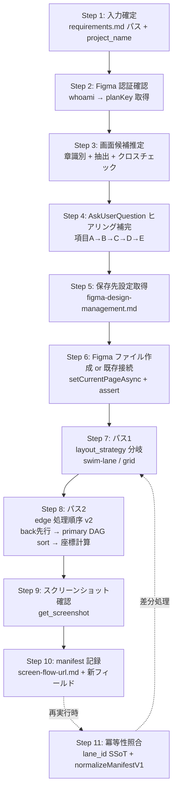

<!-- 参考: https://developers.figma.com/docs/plugins/api/properties/nodes-strokecap -->
<!-- 参考: https://developers.figma.com/docs/plugins/api/VectorNetwork -->
<!-- 参考: Figma MCP write-to-canvas.md (20kb output limit) -->
<!-- ベース: .claude/agents/einja/issue-specs/ui-design-generator.md (Figma Design 編集パターン) -->
<!-- 入力ソース: .claude/skills/einja-project-requirements/SKILL.md (docs/project/requirements.md) -->

# einja-project-screen-flow-figma: プロジェクト画面遷移図 Figma 生成 Skill

## 1. このSkillはいつ起動するか

`docs/project/requirements.md`（einja-project-requirements の出力）を入力に **プロジェクト全体の画面遷移図を Figma Design 上に新規生成・再生成** したい場面で起動する。

典型ユースケース:
- 受託案件で要件定義書が確定し、クライアント合意用の画面遷移俯瞰図を Figma で残したい
- 要件定義書を更新したので画面遷移図を再生成し、既存ユーザー編集を保持しつつ差分のみ反映したい
- §2 業務フローから画面候補を機械的に抽出し、AskUserQuestion で確定させたい

Do NOT use for: Issue 単位の画面モックアップ（→ `ui-design-generator`）、Issue 単位の `requirements.md §8.2` mermaid（→ `requirements-generator`）、状態遷移図（→ `design.md State Transitions`）、FigJam ファイル生成（本 Skill は Design ファイル専用）。

## 2. 前提・事前準備

| 項目 | 内容 |
|------|------|
| 入力ファイル | `docs/project/requirements.md`（`einja-project-requirements` で生成済み） |
| Figma 認証 | claude.ai 側で Figma コネクタが認証済みであること（Step 2 で `whoami` 検証） |
| Figma 公式 Skill | `use_figma` 呼び出し前に `Skill` ツールで `/figma-use` のロードを試行する。利用不能時は **そのまま `use_figma` を呼ぶ（致命的でない）**（Figma MCP サーバー側ガイダンスに従う） |
| 公式ドキュメント | `write-to-canvas.md`（20kb 出力上限等）が必要な場合は `ReadMcpResourceTool`（server: `claude.ai Figma`, uri: `file://figma/docs/write-to-canvas.md`）で取得 |
| 保存先設定 | `docs/einja/steering/development/figma-design-management.md` の `planKey` 既定値を参照 |

## 3. ワークフロー全体図



再生成時は Step 1〜5 → Step 11（既存 manifest 検出）→ Step 7/8（差分のみ）→ Step 9/10 の順で進む。

## 4. メインワークフロー

### Step 1: 入力確定

1. 引数が与えられていれば `docs/project/requirements.md` のパスとして採用。未指定なら AskUserQuestion で確認（既定値: `docs/project/requirements.md`）。
2. `Read` で内容を取得。`# プロジェクト要件定義書` / `# {案件名} 要件定義書` のいずれかが冒頭にあることを最低限の妥当性チェックとする。
3. `project_name` を確定する:
   - frontmatter または §1 概要から案件名を取得し、kebab-case 化（例: 勤怠管理SaaS → `attendance-saas`）
   - 確定不能なら AskUserQuestion で kebab-case 文字列を直接ユーザーに入力させる
   - 同一 Figma plan 内で `project_name` が重複しないこと（衝突時は AskUserQuestion で別名を確認）

### Step 2: Figma 認証確認

1. `mcp__claude_ai_Figma__whoami` を呼び出す。
2. 成功時:
   - `plans[]` を取得。
   - 単一 plan → その `key` を `planKey` として採用。
   - 複数 plan → `figma-design-management.md` の規定 planKey と突合し、合致するものを採用。突合不能なら AskUserQuestion で選択。
3. 失敗（`token expired` 等）時:
   - 直接 `authenticate` ツールが利用できない場合があるため、**ユーザーに claude.ai 側で Figma コネクタの再認証を依頼** する。
   - AskUserQuestion で「認証完了したら続行 / 中止」を提示し、続行が選ばれるまで停止する。
   - AskUserQuestion で「続行」が選ばれた場合、Step 1 の入力確定から再実行する（Step 1〜2 のみ、Figma ファイル作成は新規実行しない）。
   - 連続2回の認証失敗時はキャンセル推奨（無限ループ防止）。

### Step 3: 画面候補推定（章識別 + 抽出 + クロスチェック）

→ 詳細抽出ルールは `references/hearing-checklist.md` の §1〜§3 を参照。

要約:
- **主要シグナル**: 「対象業務」章配下の `TO-BE 業務フロー` を見出し名ベースで検索（章番号は揺らぐため見出しテキスト依存）。mermaid `flowchart` の subgraph "従業員"/"上長"/"人事部" 等のアクター配下ノードを抽出。
- **補助シグナル**: 「対象ユーザー」章配下の権限マトリクス、「スコープ境界」章、「機能要件サマリ」章配下の機能一覧から不足画面を補強。
- システム側ノード（"新システム"/"バッチ" 等）は除外。
- 推定画面には全件 **`(暫定推定)`** マークを付与する。
- **権限マトリクス × フロー クロスチェック**: 推定段階で `references/hearing-checklist.md §3.4` のクロスチェックを実施し、権限マトリクス由来で業務フローに登場しない画面候補を「抽出漏れ候補」として検出する。各候補に `source_confidence: high / medium / low`（`references/canonical-enums.md §6` 参照）を付与し、`high` 以外は Step 4 項目 A で必ず確認対象とする。
- **共通画面候補リストの拡張**: `references/hearing-checklist.md §3.3` の共通画面リスト（`login` / `home` / `settings` / `error` / `not-found-404` / `session-expired` / `forbidden-403` / `maintenance`）を出現条件に応じて画面候補に追加する。既定 ON のものは Step 4 項目 E のデフォルトで採用される。

抽出失敗時のフォールバック: 「機能要件サマリ」章配下の機能一覧の全機能を 1:1 で `{機能名}-画面` として画面化（最低限のセーフティネット）。

### Step 4: AskUserQuestion ヒアリング補完

→ 詳細項目テンプレは `references/hearing-checklist.md` の §4 を参照。

ヒアリングは **項目 A→B→C→D→E** の順に分割実行する（一度に多くを聞かない）。

| 項目 | 内容 | デフォルト |
|------|------|--------|
| A | 画面リスト確定（追加・削除・名称修正）。クロスチェック由来 `source_confidence != "high"` は明示確認 | - |
| B | 画面間遷移（エッジの追加・削除・方向） | - |
| C | 遷移トリガー（クリック / 自動 / 条件分岐 / ラベルなし） | - |
| D | ロール別グルーピング（権限マトリクスがある場合）。辞書外ロール検出時は `role_canonical_map` への明示マッピング追加をサブ質問で促す | **デフォルト ON: `layout_strategy: swim-lane`** 採用（`references/canonical-enums.md §1` 参照）。視認性とロール責務明確化のため |
| E | 共通画面の追加（`references/hearing-checklist.md §3.3` 共通画面リスト） | 既定 ON の `error` / `not-found-404` / `session-expired` / `forbidden-403` 等を一括採用。詳細選択肢は `references/hearing-checklist.md §4 項目E` 参照 |

各選択肢は **description（What）+ Note（So What）** の2層構成とし、必ず **「その他（自由入力）」** を最後の選択肢として含める（推測で進めない原則）。

**項目 D 辞書外ロール検出時の追加対応**: 辞書外ロールが検出された場合（`Role_${hash}` 動的生成対象）、ユーザーに「`role_canonical_map` への明示マッピング追加」を促すサブ質問を表示する。これによりデフォルト `Role_a1b2c3d4` のような hash ID が Figma 上に表示されることを防ぐ。マッピング先候補は `references/canonical-enums.md §5` の canonical 識別子（`Common` / `Employee` / `Manager` / `HR` / `Admin` / `Ext`）から選択させる（+ 自由入力）。

### Step 5: 保存先設定取得

1. `docs/einja/steering/development/figma-design-management.md` を `Read`。
2. `@einja:project-private` セクションから `Figmaチーム/プロジェクトURL` / `project_id` 等のプロジェクト固有設定を取得（存在する場合）。
3. `planKey` は Step 2 の `whoami` 結果（単一plan時はそれを採用、複数planでsteering側に既定値があればそれを優先）から決定する。

### Step 6: Figma ファイル作成 or 既存接続

#### 新規生成（初回 / 完全再生成）

1. `mcp__claude_ai_Figma__create_new_file` を呼び出す:
   - `editorType: "design"`（**FigJam ではない**）
   - `fileName: "{project_name}-screen-flow"`
   - `planKey: {Step 5 で確定した値}`
2. レスポンスの `fileKey` と `figma_url` を記録（Step 10 の manifest に書き込む）。
3. **対象 Page の active 化**: 作成直後または対象 Page 切替時は必ず `await figma.setCurrentPageAsync(targetPage)` を呼び出して対象 Page を active 化する。
4. **assert によるページ整合性チェック**: 切替後に以下を必ず実行し、誤った Page への書き込みを防止する:

   ```javascript
   if (figma.currentPage.name !== expectedPageName) {
     throw new Error(
       `Page activation failed: expected=${expectedPageName}, actual=${figma.currentPage.name}`,
     );
   }
   ```

#### 既存接続（再生成、Step 11 で `file_key` ヒット時）

1. `create_new_file` は呼ばない。既存 `file_key` を使う（Step 11 参照）。
2. 既存 Page をリネームする場合は `references/figma-arrow-rules.md §4` の `writeNodeKind` 互換 API（および `readNodeKind` / `writeBusinessRole`）を経由し、旧 key (`role`) への書き込みは行わない。
3. **v1 Page スコープ制限**: 過去 v1 grid 実装で `Screen-Flow-v1-grid` 等の名称で生成された旧 Page は読み取り対象外とする。新 Page `Screen-Flow-v2-swimlane-poc` を SSoT として扱い、`figma.setCurrentPageAsync(...)` で必ずこちらを active 化する。

### Step 7: パス 1 - FrameNode 配置（layout_strategy 分岐）

→ 実装詳細は `references/figma-arrow-rules.md` の §3「2 パス生成戦略」を参照。

#### layout_strategy 分岐

manifest frontmatter の `layout_strategy`（`references/canonical-enums.md §1`）に応じて配置経路を分岐する。未指定（v1 manifest）は `grid` を暗黙適用。

- `layout_strategy === "swim-lane"` → `references/figma-arrow-rules.md §3.1 swim-lane レイアウト` へ
- `layout_strategy === "grid"` → `references/figma-arrow-rules.md §3.2 grid レイアウト（後方互換）` へ

#### 共通要点

- `use_figma` 呼び出し前に `Skill` ツールで `/figma-use` のロードを試行する。利用不能時は **そのまま `mcp__claude_ai_Figma__use_figma` を呼ぶ（致命的でない、警告ログ出力に留める）**。
- 各 FrameNode への plugin data 書き込みは `references/figma-arrow-rules.md §4` の互換 API（`writeNodeKind` / `writeBusinessRole`）を経由する。旧 key `role` は書き込まない（読み込み時のみ fallback）。
- `setSharedPluginData("einja.screenFlow", "stable_id", "{project_name}__{name}")` で識別情報を付与（**`setPluginData` ではなく必ず `setSharedPluginData`**。ファイル横断読取・冪等性のため）。
- レスポンスでは `{stable_id: nodeId}` Map を JS 側で保持するが、パス 2 では `findAll` で再解決する（`references/figma-arrow-rules.md §5` nodeId 消失対策）。

#### swim-lane 経路の追加注意

- lane 背景 Frame は **`sendToBack()` + `locked = true`** で安全化（z-order: lane → screen → edge の順、ユーザー誤操作防止）。
- lane に使用する canonical role 識別子は `references/canonical-enums.md §5` の 6 種（`Common` / `Employee` / `Manager` / `HR` / `Admin` / `Ext`）を SSoT とする。辞書外の表示名は `Role_${hash}` で動的生成。
- multi-role 画面の **主 lane 判定ルール** は `references/figma-arrow-rules.md §3.1 multi-role 主 lane 判定` を参照（manifest 明示 `lane_id` 最優先 → Common 特例画面 → in/out-degree 最多ロール → デフォルト辞書順）。

### Step 8: パス 2 - エッジ描画（処理順序 v2）

→ 実装詳細・コード例は `references/figma-arrow-rules.md` の §2「VectorNode + setVectorNetworkAsync の実装パターン」「§2.0〜§2.5 edge アルゴリズム」と §3.3「パス 2: エッジ描画」を参照。

#### 処理順序 v2（cycle 対応）

`references/figma-arrow-rules.md §2.0` の処理順序を引用:

1. **暫定 back 判定（trigger キーワード）** — 全 edges について trigger テキストに「差し戻し」「キャンセル」「戻る」「エラー」「失敗」を含むかで暫定的に back を確定（詳細は `references/figma-arrow-rules.md §2.0` 手順 1 + §2.5）
2. **primary DAG のみで topological sort** — primary 候補のみで sort。cycle 検出時は Tarjan's SCC 分解、各 SCC 内は manifest `edges[]` 配列の記載順（YAML 出現順）で fallback して `x_order` を確定（詳細は `references/figma-arrow-rules.md §2.0` 手順 2）
3. **x_order 確定後の追加 back 判定** — `x_order[to] < x_order[from]` を **同一 lane 内のみ** に適用し back に追加昇格（lane 跨ぎは除外。詳細は `references/figma-arrow-rules.md §2.0` 手順 3 + §2.5）
4. **final edge_kind 決定後、座標計算へ** — §2.1 辺判定 → §2.2 往復オフセット → §2.3 L字ルーティング → §2.4 ラベル衝突回避（6段階探索）（詳細は `references/figma-arrow-rules.md §2.1〜§2.4`）

#### 共通要点

- **LineNode は不採用**。`LineNode.strokeCap` は vectorNetwork 全体に適用されて両端矢印固定になるため画面遷移図には不適切（2026-05-18 PoC で確認済み、根拠は `references/figma-arrow-rules.md §1`）。
- 主軸は `figma.createVector()` + `await arrow.setVectorNetworkAsync({ vertices: [{strokeCap:"NONE"}, {strokeCap:"ARROW_LINES"}], segments: [{start:0,end:1}], regions: [] })` による **片方向矢印**。L字は 3 頂点 + 2 セグメント（`references/figma-arrow-rules.md §2.3`）。
- `edge_kind: back` の dashPattern / stroke color は **VectorNode に直接設定**（GroupNode には dashPattern プロパティが存在しない、`references/figma-arrow-rules.md §2.5`）。色値は `references/canonical-enums.md §2` に準拠。
- 各エッジは **3 要素グループ**（VectorNode + TextNode + `figma.group(...)`）で構成し、Undo 単位を 1 つにまとめる。「ラベルなし」エッジは TextNode を作らず VectorNode 単体で group 化する（`references/figma-arrow-rules.md §3.3` 参照）。
- TextNode は **各バッチ先頭で必ず** `await figma.loadFontAsync({ family: "Inter", style: "Regular" })` を呼んでから作成（`references/figma-arrow-rules.md §6` バッチ間フォントキャッシュ非保証）。配置は最長セグメント中点を基準に法線方向へ `LABEL_OFFSET = 8px`（`references/canonical-enums.md §9`）。
- group / VectorNode への plugin data 書き込みは `references/figma-arrow-rules.md §4` の互換 API（`writeNodeKind(group, "edge")` 等）を経由。`setSharedPluginData("einja.screenFlow", "stable_id", "{from}__to__{to}")` も併せて付与。
- **動的バッチ分割**: コード文字列を構築しながら **40000 字** を超える前に次バッチへ分割（`use_figma` 入力上限 50000 字に対する余裕）。10 エッジ前後が目安だが日本語ラベル長で変動。**バッチ送信時に 50000 字超エラーが返った場合は、閾値を 40000 → 30000 字に下げて再試行する**（詳細は `references/figma-arrow-rules.md §6` + §5 エラー処理パターン参照）。
- バッチ末尾のレスポンスは **件数 + 最後の stable_id のみ** に整形（`write-to-canvas.md` の 20kb 出力上限対策）。
- バッチ間で nodeId が無効化される事例があるため、各バッチ先頭で `references/figma-arrow-rules.md §5` の「バッチ先頭で stable_id を一括取得して Map に格納するパターン」で再解決する。

### Step 9: スクリーンショット確認

1. `mcp__claude_ai_Figma__get_screenshot` をページルートまたは全画面包含 FrameNode を対象に呼び出す（`maxDimension` は既定 1024 を基本、密集時は 2048 に引き上げ）。
2. 返却されたスクリーンショット URL をユーザーに提示する。
3. AskUserQuestion で「OK / 一部修正（自由入力で具体的指示）/ 中止」を確認。
   - 修正指示が出た場合は Step 4 または Step 8 に戻る（修正範囲に応じて）。

### Step 10: manifest 記録

→ 詳細スキーマは `references/manifest-schema.md §1` を参照。

1. `docs/project/screen-flow-url.md` を作成（新規生成時）または上書き（再生成時）。
2. **既存ファイルがある場合は上書き前に `docs/project/screen-flow-url.md.bak` として退避**。
3. frontmatter（必須 + 新規）+ `## screens` セクション + `## edges` セクションを書き込む。
4. 各 entry には `stable_id`、`node_id`、`status: active`（再生成で消えた要素は `status: orphan`）を記録する。
5. `.bak` 生成後、`.gitignore` に `docs/project/screen-flow-url.md.bak` が未登録なら Bash で追記する（重複コミット防止）。

#### 新フィールド（v2 追加、`schema_version: 1` 据置で任意扱い）

`references/manifest-schema.md §1` 参照。詳細スキーマ・デフォルト値は同ファイルに集約。

**frontmatter**:
- `layout_strategy` — `swim-lane` / `grid`（`references/canonical-enums.md §1`）。未指定時は `grid` として読み込まれる
- `role_canonical_map` — 表示名 → canonical 識別子（`references/canonical-enums.md §5`）のマップ。例: `{ 上長: Manager, 人事部: HR }`

**screens[]**:
- `lane_id` — canonical 識別子（`references/canonical-enums.md §5`）。**manifest を SSoT として扱う**（Figma 上の手動移動は無視、§11 参照）
- `source_confidence` — クロスチェック由来時の信頼度（`references/canonical-enums.md §6`、`high` / `medium` / `low`）

**edges[]**:
- `edge_kind` — エッジ種別（`references/canonical-enums.md §2`、`primary` / `back`）
- `routing` — 経路種別（`references/canonical-enums.md §3`、`straight` / `l-shape`）
- `label_collision_warning` — ラベル衝突回避失敗時 `true`（6段階探索で配置不可だった場合、`references/figma-arrow-rules.md §2.4`）

### Step 11: 冪等性照合（再生成時のみ）

→ 詳細フローは `references/manifest-schema.md §3` 「冪等性ポリシー」を参照。

#### lane_id SSoT ルール

- **`lane_id` の Single Source of Truth は manifest 由来**。Figma 上の手動移動（screen FrameNode を別 lane に D&D した等）は**無視**し、manifest を絶対 SSoT として扱う。
- これにより再生成時に Figma 側手動編集と manifest が乖離していても、Skill は manifest の `lane_id` に従って screen を再配置する。
- `position` は既存値を保持する（手動レイアウト微調整は尊重）が、lane 跨ぎの手動移動は `lane_id` 改変ではないため、`lane_id` ベースで再配置時に補正される。

#### 自動正規化（v1 manifest 互換）

1. 既存 `docs/project/screen-flow-url.md` を `Read` し、`references/manifest-schema.md §5` の `normalizeManifestV1()` で v1 manifest を自動補完。これにより `layout_strategy` / `role_canonical_map` / `lane_id` / `source_confidence` / `edge_kind` / `routing` / `label_collision_warning` 未指定時のデフォルトが補完される。
2. `schema_version` が未知（≠ 1）の場合は Skill 読み込みを停止し、ユーザーに Skill 更新を促す。
3. **クロスチェック再実行（必須）**: v1 manifest からの再生成時は、Step 3 の画面候補推定（権限マトリクス × フロー クロスチェック含む）を必ず再実行する。`normalizeManifestV1` は「既存エントリのデフォルト補完」のみであり「欠損エントリの自動追加」は行わないため、Step 3 の推定フローで検出された新規画面候補（クロスチェック由来含む）を旧 manifest にマージする必要がある。

#### v1 Page スコープ制限

- 過去 v1 grid 実装で生成された旧 Page（例: **`Screen-Flow-v1-grid`**）は **読み取り対象外**。`findAll` のスコープからも除外する。
- 新 Page **`Screen-Flow-v2-swimlane-poc`** を SSoT として扱い、Step 6 の `figma.setCurrentPageAsync(...)` + assert で必ずこちらを active 化する。

#### 照合フロー

1. 既存 `docs/project/screen-flow-url.md` を `Read`。`file_key` を取得。
2. その `file_key` の Figma ファイルを開く（**新規 `create_new_file` は呼ばない**）。Step 6 の手順で対象 Page を active 化。
3. screens 照合:
   - 既存 manifest（`normalizeManifestV1` 後）と新規生成リストを `stable_id` で突合
   - 一致 → `node_id` を流用、既存 `position` を保持（手動レイアウト変更を尊重、ただし `lane_id` は manifest SSoT として再評価）
   - 未知の `stable_id` → 新規 FrameNode 作成
   - 既存にあって今回ない → `status: orphan` に変更（**自動削除はしない**）
4. edges も同様に照合。
5. **screen orphan 化時の edge 連鎖ルール**: `from` または `to` が orphan screen に該当する edge も自動的に `status: orphan` 化し、ユーザー通知に含める（「N 個の画面 + M 個のエッジが要件から削除されました」）。
6. orphan 化された節点について、ユーザーに「N 個の画面 + M 個のエッジが要件から削除されました。Figma 上で確認後、不要なら手動削除してください」とログ出力。
7. ユーザー手動削除で `stable_id` が見つからない場合は AskUserQuestion で「再作成 / manifest から削除 / 中止 / その他（自由入力）」を確認。

## 5. エラー処理パターン

| ID | 事象 | 一次対処 | 詳細 |
|----|------|---------|------|
| E1 | Figma 認証エラー（token expired） | ユーザーに claude.ai 側再認証依頼、AskUserQuestion で停止 | Step 2 |
| E2 | `loadFontAsync` 失敗 | `Inter Regular` → `Roboto Regular` → `figma.listAvailableFontsAsync()` 先頭にフォールバック | → `references/figma-arrow-rules.md §8` |
| E3 | `use_figma` コード 50000 字超 | 動的分割閾値を 40000 → 30000 字に下げて再試行 | → `references/figma-arrow-rules.md §6, §8` |
| E4 | 出力 20kb 超 | バッチ末尾レスポンスを件数 + 最後の stable_id のみに削減 | → `references/figma-arrow-rules.md §6, §8` |
| E5 | nodeId 消失（パス 2 で参照不可） | `findAll` + `getSharedPluginData("einja.screenFlow", "stable_id")` で再解決 | → `references/figma-arrow-rules.md §5` |
| E6 | `stable_id` 衝突（findAll 複数ヒット） | 警告ログ + 先頭採用、ユーザーに重複名修正を依頼 | → `references/figma-arrow-rules.md §5, §8` |
| E7 | `setVectorNetworkAsync` 座標エラー（始点=終点） | エッジ構築前に `dx === 0 && dy === 0` を弾く | → `references/figma-arrow-rules.md §8` |
| E8 | 既存 manifest の `schema_version` 未知 | Skill 読み込み停止、ユーザーに Skill 更新を促す。ユーザー向け停止メッセージは以下3点を必ず含む: ① 検出された `schema_version` 値、② 本 Skill が対応する `schema_version` 範囲、③ ユーザーが取るべき具体的アクション（例: `git pull` / `einja-dev-sync` 実行） | → `references/manifest-schema.md §5, §7` |
| E9 | `docs/project/` 未作成 | `mkdir -p docs/project` を Bash で実行 | - |
| E10 | **lane 高さ不足**: 1 つの lane に収まる screens[] 件数が `LANE_HEIGHT = 240px`（`references/canonical-enums.md §9`）内に収まらない | lane を横方向に拡張（`totalW` を増やす）して `FRAME_W + FRAME_SPACING_X` 刻みで配置継続。15+ 画面/lane の場合はユーザーに lane 分割を提案（AskUserQuestion） | → `references/figma-arrow-rules.md §3.1` |
| E11 | **edge 折れ点交差**: L字 elbow が他 screen FrameNode の bounding box を横切る | 一次対処として `EDGE_OFFSET` を倍化して回避を試行 → 不可なら `label_collision_warning: true` を manifest に記録 + ユーザーへ警告ログ出力（自動修正は試みない） | → `references/figma-arrow-rules.md §2.3` |
| E12 | **plugin data key 不在**: 旧 `role` key も新 `node_kind` key も無いノードを検出（`readNodeKind(node)` が `null` を返す） | 該当ノードは画面遷移図管理対象外と判断し **skip + log**。manifest には記録しない（ユーザー手動追加の独立ノード等の可能性） | → `references/figma-arrow-rules.md §4`、`references/manifest-schema.md §4` |
| E13 | **L字往復同時生成** | 片方を `routing: straight` にフォールバック + `label_collision_warning: true` を manifest 記録 + ユーザーへ警告ログ出力（Phase 2 で正規対応予定） | → `references/figma-arrow-rules.md §2.2` |
| E14 | **Page activation assert 失敗**: `figma.currentPage.name !== expectedPageName` | Skill 即時停止 + ユーザーに対象 Figma ファイル状態確認を依頼 + 再実行を促す | → Step 6 |
| E15 | **対象 Page リネーム失敗**（権限/ロック/同名衝突） | AskUserQuestion で「旧名のまま続行 / 中止 / 別名で再試行」を確認 | → Step 6 |
| E16 | **Figma 書き込み途中失敗時の manifest ロールバック** | `.bak` ファイルから手動復元（`Bash: cp docs/project/screen-flow-url.md.bak docs/project/screen-flow-url.md`）。ユーザーに復元手順を提示 | → Step 10 |

## 6. サブエージェント呼び出しポリシー

本 Skill は **オーケストレーター型** であり、`Task` ツールによる汎用サブエージェント呼び出しは **原則行わない**。Figma MCP の `use_figma` がそれ自体で Plugin API 実行サンドボックスを内包しており、JS 構築・実行は本 Skill 内で完結するため。

例外として `general-purpose` サブエージェントを使ってよいケース:
- `docs/project/requirements.md` が極端に大きく（数千行規模）、Step 3 の章識別・mermaid 抽出が単一コンテキストで困難な場合のみ、抽出を委託する。
- その場合のプロンプトには **「不明点や判断が必要な場合は、推測で進めず `.claude/skills/_einja-subagent-question-protocol/SKILL.md` を参照して PENDING_QUESTIONS 形式で質問を返却し、作業を停止すること」** を必ず含める。

## 7. サブエージェント質問プロトコル

万一サブエージェント経由で `## PENDING_QUESTIONS` 形式の返却を受けた場合は、`.claude/skills/_einja-subagent-question-protocol/SKILL.md` の手順に従う。調査・分析で確実に判定可能な質問は本 Skill が自律解決し、判定不能な質問のみ AskUserQuestion でユーザーへエスカレーションする。

## 8. 関連リソース・依存

| 区分 | 名称 | 役割 |
|------|------|------|
| 入力 Skill | `einja-project-requirements` | `docs/project/requirements.md` 生成元（本 Skill の必須入力） |
| 関連 Skill（用途別） | `ui-design-generator` (Agent) | Issue 単位の画面モックアップ生成。本 Skill とは用途が異なる（プロジェクト俯瞰 vs Issue 詳細） |
| 参照 steering | `docs/einja/steering/development/figma-design-management.md` | `planKey` 既定値・命名規則・`screen-flow-url.md` スキーマ |
| サブ参照 0 | `references/canonical-enums.md` | **enum SSoT**: `layout_strategy` / `edge_kind` / `routing` / `node_kind` / `business_role` / `source_confidence` / `status` / lane 配置定数 |
| サブ参照 1 | `references/hearing-checklist.md` | 章識別 + 画面候補推定ルール + クロスチェック (§3.4) + AskUserQuestion 項目テンプレ (項目 A〜E) |
| サブ参照 2 | `references/figma-arrow-rules.md` | VectorNode 主軸の矢印描画パターン・edge 処理順序 v2 (§2.0)・swim-lane / grid layout 分岐 (§3.0〜§3.2)・Plugin Data Key 移行 (§4)・動的バッチ分割・nodeId 再解決 |
| サブ参照 3 | `references/manifest-schema.md` | `screen-flow-url.md` 完全スキーマ + 新フィールド (§1) + 冪等性ポリシー (§3) + Plugin Data Key 移行 (§4) + `normalizeManifestV1` (§5) + ui-design-url.md との差分表 |
| Figma MCP リソース | `file://figma/docs/write-to-canvas.md` | 必要時 `ReadMcpResourceTool` で取得（20kb 出力上限の根拠） |
| Plugin API ドキュメント | `developers.figma.com` / `VectorNetwork` / `nodes-strokecap` | `references/figma-arrow-rules.md` 末尾参照 |

## 9. 実行制約

- 本 Skill は親エージェント（オーケストレーター）として動作する。`context: fork` は設定しない（AskUserQuestion を多用するため）。
- 使用ツール: `mcp__claude_ai_Figma__*`（`whoami` / `create_new_file` / `use_figma` / `get_screenshot` ほか）、`Read` / `Write` / `Edit` / `Bash` / `Grep` / `Glob` / `AskUserQuestion` / `ReadMcpResourceTool` / `Skill`。
- 出力先は `docs/project/` 配下のみ（`docs/einja/` マネージドディレクトリには書き込まない）。
- Figma ファイル作成・編集は Step 6 以降。Step 1〜4 の段階では一切書き込まない（ヒアリング中の誤書き込み防止）。
