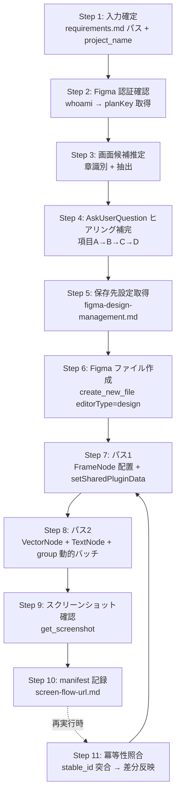

<!-- 参考: https://developers.figma.com/docs/plugins/api/properties/nodes-strokecap -->
<!-- 参考: https://developers.figma.com/docs/plugins/api/VectorNetwork -->
<!-- 参考: Figma MCP write-to-canvas.md (20kb output limit) -->
<!-- ベース: .claude/agents/einja/issue-specs/ui-design-generator.md (Figma Design 編集パターン) -->
<!-- 入力ソース: .claude/skills/einja-project-requirements/SKILL.md (docs/project/requirements.md) -->

# einja-project-screen-flow-figma: プロジェクト画面遷移図 Figma 生成 Skill

## 1. このSkillはいつ起動するか

`docs/project/requirements.md`（einja-project-requirements の出力）を入力に **プロジェクト全体の画面遷移図を Figma Design 上に新規生成・再生成** したい場面で起動する。

典型ユースケース:
- 受託案件で要件定義書が確定し、クライアント合意用の画面遷移俯瞰図を Figma で残したい
- 要件定義書を更新したので画面遷移図を再生成し、既存ユーザー編集を保持しつつ差分のみ反映したい
- §2 業務フローから画面候補を機械的に抽出し、AskUserQuestion で確定させたい

Do NOT use for: Issue 単位の画面モックアップ（→ `ui-design-generator`）、Issue 単位の `requirements.md §8.2` mermaid（→ `requirements-generator`）、状態遷移図（→ `design.md State Transitions`）、FigJam ファイル生成（本 Skill は Design ファイル専用）。

## 2. 前提・事前準備

| 項目 | 内容 |
|------|------|
| 入力ファイル | `docs/project/requirements.md`（`einja-project-requirements` で生成済み） |
| Figma 認証 | claude.ai 側で Figma コネクタが認証済みであること（Step 2 で `whoami` 検証） |
| Figma 公式 Skill | `use_figma` 呼び出し前に `Skill` ツールで `/figma-use` のロードを試行する。利用不能時は **そのまま `use_figma` を呼ぶ（致命的でない）**（Figma MCP サーバー側ガイダンスに従う） |
| 公式ドキュメント | `write-to-canvas.md`（20kb 出力上限等）が必要な場合は `ReadMcpResourceTool`（server: `claude.ai Figma`, uri: `file://figma/docs/write-to-canvas.md`）で取得 |
| 保存先設定 | `docs/einja/steering/development/figma-design-management.md` の `planKey` 既定値を参照 |

## 3. ワークフロー全体図

再生成時は Step 1〜5 → Step 11（既存 manifest 検出）→ Step 7/8（差分のみ）→ Step 9/10 の順で進む。

## 4. メインワークフロー

### Step 1: 入力確定

1. 引数が与えられていれば `docs/project/requirements.md` のパスとして採用。未指定なら AskUserQuestion で確認（既定値: `docs/project/requirements.md`）。
2. `Read` で内容を取得。`# プロジェクト要件定義書` / `# {案件名} 要件定義書` のいずれかが冒頭にあることを最低限の妥当性チェックとする。
3. `project_name` を確定する:
   - frontmatter または §1 概要から案件名を取得し、kebab-case 化（例: 勤怠管理SaaS → `attendance-saas`）
   - 確定不能なら AskUserQuestion で kebab-case 文字列を直接ユーザーに入力させる
   - 同一 Figma plan 内で `project_name` が重複しないこと（衝突時は AskUserQuestion で別名を確認）

### Step 2: Figma 認証確認

1. `mcp__claude_ai_Figma__whoami` を呼び出す。
2. 成功時:
   - `plans[]` を取得。
   - 単一 plan → その `key` を `planKey` として採用。
   - 複数 plan → `figma-design-management.md` の規定 planKey と突合し、合致するものを採用。突合不能なら AskUserQuestion で選択。
3. 失敗（`token expired` 等）時:
   - 直接 `authenticate` ツールが利用できない場合があるため、**ユーザーに claude.ai 側で Figma コネクタの再認証を依頼** する。
   - AskUserQuestion で「認証完了したら続行 / 中止」を提示し、続行が選ばれるまで停止する。
   - AskUserQuestion で「続行」が選ばれた場合、Step 1 の入力確定から再実行する（Step 1〜2 のみ、Figma ファイル作成は新規実行しない）。
   - 連続2回の認証失敗時はキャンセル推奨（無限ループ防止）。

### Step 3: 画面候補推定（章識別 + 抽出）

→ 詳細抽出ルールは `references/hearing-checklist.md` の §1〜§3 を参照。

要約:
- **主要シグナル**: `§2 対象業務` 配下の `TO-BE 業務フロー` を見出し名ベースで検索（章番号には依存しない）。mermaid `flowchart` の subgraph "従業員"/"上長"/"人事部" 等のアクター配下ノードを抽出。
- **補助シグナル**: §3 対象ユーザー（特に権限マトリクス）、§5 スコープ境界、§6 機能要件サマリ（§6.1 機能一覧）から不足画面を補強。
- システム側ノード（"新システム"/"バッチ" 等）は除外。
- 推定画面には全件 **`(暫定推定)`** マークを付与する。

抽出失敗時のフォールバック: §6.1 機能一覧の全機能を 1:1 で `{機能名}-画面` として画面化（最低限のセーフティネット）。

### Step 4: AskUserQuestion ヒアリング補完

→ 詳細項目テンプレは `references/hearing-checklist.md` の §4 を参照。

ヒアリングは **項目 A→B→C→D** の順に分割実行する（一度に多くを聞かない）。

| 項目 | 内容 |
|------|------|
| A | 画面リスト確定（追加・削除・名称修正） |
| B | 画面間遷移（エッジの追加・削除・方向） |
| C | 遷移トリガー（クリック / 自動 / 条件分岐 / ラベルなし） |
| D | ロール別アクセス（§3.3 権限マトリクスがある場合のみ。任意） |

各選択肢は **description（What）+ Note（So What）** の2層構成とし、必ず **「その他（自由入力）」** を最後の選択肢として含める（推測で進めない原則）。

### Step 5: 保存先設定取得

1. `docs/einja/steering/development/figma-design-management.md` を `Read`。
2. `@einja:project-private` セクションから `Figmaチーム/プロジェクトURL` / `project_id` 等のプロジェクト固有設定を取得（存在する場合）。
3. `planKey` は Step 2 の `whoami` 結果（単一plan時はそれを採用、複数planでsteering側に既定値があればそれを優先）から決定する。

### Step 6: Figma ファイル作成

1. `mcp__claude_ai_Figma__create_new_file` を呼び出す:
   - `editorType: "design"`（**FigJam ではない**）
   - `fileName: "{project_name}-screen-flow"`
   - `planKey: {Step 5 で確定した値}`
2. レスポンスの `fileKey` と `figma_url` を記録（Step 10 の manifest に書き込む）。
3. 再生成時は Step 11 で既存 `file_key` を使うため、ここはスキップ。

### Step 7: パス 1 - FrameNode 配置

→ 実装詳細は `references/figma-arrow-rules.md` の §3「パス 1: FrameNode 配置」を参照。

要点:
- `use_figma` 呼び出し前に `Skill` ツールで `/figma-use` のロードを試行する。利用不能時は **そのまま `mcp__claude_ai_Figma__use_figma` を呼ぶ（致命的でない、警告ログ出力に留める）**。
- 全画面候補を `FrameNode` で kebab-case 命名（`screen-dashboard` 等）して格子レイアウト配置。列数 `cols = ceil(sqrt(N))`、画面間隔 200〜400px。
- 各 FrameNode に `setSharedPluginData("einja.screenFlow", "role", "screen")` と `setSharedPluginData("einja.screenFlow", "stable_id", "{project_name}__{name}")` を付与する（**`setPluginData` ではなく必ず `setSharedPluginData`**。ファイル横断読取・冪等性のため）。
- レスポンスでは `{stable_id: nodeId}` Map を JS 側で保持するが、パス 2 では `findAll` で再解決する（§4 nodeId 消失対策）。

### Step 8: パス 2 - エッジ描画（VectorNode + TextNode + group）

→ 実装詳細・コード例は `references/figma-arrow-rules.md` の §2「VectorNode + setVectorNetworkAsync の実装パターン」と §3「パス 2」を参照。

要点:
- **LineNode は不採用**。`LineNode.strokeCap` は vectorNetwork 全体に適用されて両端矢印固定になるため画面遷移図には不適切（2026-05-18 PoC で確認済み、根拠は `references/figma-arrow-rules.md §1`）。
- 主軸は `figma.createVector()` + `await arrow.setVectorNetworkAsync({ vertices: [{strokeCap:"NONE"}, {strokeCap:"ARROW_LINES"}], segments: [{start:0,end:1}], regions: [] })` による **片方向矢印**。
- 各エッジは **3 要素グループ**（VectorNode + TextNode + `figma.group(...)`）で構成し、Undo 単位を 1 つにまとめる。
- TextNode は `await figma.loadFontAsync({ family: "Inter", style: "Regular" })` の後に作成。配置は線の中点 ±10px 以内。
- group にも `setSharedPluginData("einja.screenFlow", "role", "edge")` と `setSharedPluginData("einja.screenFlow", "stable_id", "{from}__to__{to}")` を付与。
- **動的バッチ分割**: コード文字列を構築しながら **40000 字** を超える前に次バッチへ分割（`use_figma` 入力上限 50000 字に対する余裕）。10 エッジ前後が目安だが日本語ラベル長で変動。**バッチ送信時に 50000 字超エラーが返った場合は、閾値を 40000 → 30000 字に下げて再試行する**（詳細は §5 エラー処理パターン参照）。
- バッチ末尾のレスポンスは **件数 + 最後の stable_id のみ** に整形（`write-to-canvas.md` の 20kb 出力上限対策）。
- バッチ間で nodeId が無効化される事例があるため、各バッチ先頭で `figma.currentPage.findAll(n => n.getSharedPluginData("einja.screenFlow", "stable_id") === target)` で再解決する。

### Step 9: スクリーンショット確認

1. `mcp__claude_ai_Figma__get_screenshot` をページルートまたは全画面包含 FrameNode を対象に呼び出す（`maxDimension` は既定 1024 を基本、密集時は 2048 に引き上げ）。
2. 返却されたスクリーンショット URL をユーザーに提示する。
3. AskUserQuestion で「OK / 一部修正（自由入力で具体的指示）/ 中止」を確認。
   - 修正指示が出た場合は Step 4 または Step 8 に戻る（修正範囲に応じて）。

### Step 10: manifest 記録

→ 詳細スキーマは `references/manifest-schema.md` を参照。

1. `docs/project/screen-flow-url.md` を作成（新規生成時）または上書き（再生成時）。
2. **既存ファイルがある場合は上書き前に `docs/project/screen-flow-url.md.bak` として退避**。
3. frontmatter（`figma_url`, `file_key`, `plan_key`, `schema_version: 1`, `generated_at`, `project_name`）+ `## screens` セクション + `## edges` セクションを書き込む。
4. 各 entry には `stable_id`、`node_id`、`status: active`（再生成で消えた要素は `status: orphan`）を記録する。
5. `.bak` 生成後、`.gitignore` に `docs/project/screen-flow-url.md.bak` が未登録なら Bash で追記する（重複コミット防止）。

### Step 11: 冪等性照合（再生成時のみ）

→ 詳細フローは `references/manifest-schema.md` の §3「冪等性ポリシー」を参照。

1. 既存 `docs/project/screen-flow-url.md` を `Read`。`file_key` を取得。
2. その `file_key` の Figma ファイルを開く（**新規 `create_new_file` は呼ばない**）。
3. screens 照合:
   - 既存 manifest と新規生成リストを `stable_id` で突合
   - 一致 → `node_id` を流用、既存 `position` を保持（手動レイアウト変更を尊重）
   - 未知の `stable_id` → 新規 FrameNode 作成
   - 既存にあって今回ない → `status: orphan` に変更（**自動削除はしない**）
4. edges も同様に照合。
5. orphan 化された節点について、ユーザーに「N 個の画面/エッジが要件から削除されました。Figma 上で確認後、不要なら手動削除してください」とログ出力。
6. ユーザー手動削除で `stable_id` が見つからない場合は AskUserQuestion で「再作成 / manifest から削除 / 中止」を確認。

## 5. エラー処理パターン

| 事象 | 一次対処 | 詳細 |
|------|---------|------|
| Figma 認証エラー（token expired） | ユーザーに claude.ai 側再認証依頼、AskUserQuestion で停止 | Step 2 |
| `loadFontAsync` 失敗 | `Inter Regular` → `Roboto Regular` → `figma.listAvailableFontsAsync()` 先頭にフォールバック | → `references/figma-arrow-rules.md §7` |
| `use_figma` コード 50000 字超 | 動的分割閾値を 40000 → 30000 字に下げて再試行 | → `references/figma-arrow-rules.md §5, §7` |
| 出力 20kb 超 | バッチ末尾レスポンスを件数 + 最後の stable_id のみに削減 | → `references/figma-arrow-rules.md §5, §7` |
| nodeId 消失（パス 2 で参照不可） | `findAll` + `getSharedPluginData("einja.screenFlow", "stable_id")` で再解決 | → `references/figma-arrow-rules.md §4` |
| `stable_id` 衝突（findAll 複数ヒット） | 警告ログ + 先頭採用、ユーザーに重複名修正を依頼 | → `references/figma-arrow-rules.md §4, §7` |
| `setVectorNetworkAsync` 座標エラー（始点=終点） | エッジ構築前に `dx === 0 && dy === 0` を弾く | → `references/figma-arrow-rules.md §7` |
| 既存 manifest の `schema_version` 未知 | Skill 読み込み停止、ユーザーに Skill 更新を促す | → `references/manifest-schema.md §5` |
| `docs/project/` 未作成 | `mkdir -p docs/project` を Bash で実行 | - |

## 6. サブエージェント呼び出しポリシー

本 Skill は **オーケストレーター型** であり、`Task` ツールによる汎用サブエージェント呼び出しは **原則行わない**。Figma MCP の `use_figma` がそれ自体で Plugin API 実行サンドボックスを内包しており、JS 構築・実行は本 Skill 内で完結するため。

例外として `general-purpose` / `Explore` サブエージェントを使ってよいケース:
- `docs/project/requirements.md` が極端に大きく（数千行規模）、Step 3 の章識別・mermaid 抽出が単一コンテキストで困難な場合のみ、抽出を委託する。
- その場合のプロンプトには **「不明点や判断が必要な場合は、推測で進めず `.claude/skills/_einja-subagent-question-protocol/SKILL.md` を参照して PENDING_QUESTIONS 形式で質問を返却し、作業を停止すること」** を必ず含める。

## 7. サブエージェント質問プロトコル

万一サブエージェント経由で `## PENDING_QUESTIONS` 形式の返却を受けた場合は、`.claude/skills/_einja-subagent-question-protocol/SKILL.md` の手順に従う。調査・分析で確実に判定可能な質問は本 Skill が自律解決し、判定不能な質問のみ AskUserQuestion でユーザーへエスカレーションする。

## 8. 関連リソース・依存

| 区分 | 名称 | 役割 |
|------|------|------|
| 入力 Skill | `einja-project-requirements` | `docs/project/requirements.md` 生成元（本 Skill の必須入力） |
| 関連 Skill（用途別） | `ui-design-generator` (Agent) | Issue 単位の画面モックアップ生成。本 Skill とは用途が異なる（プロジェクト俯瞰 vs Issue 詳細） |
| 参照 steering | `docs/einja/steering/development/figma-design-management.md` | `planKey` 既定値・命名規則・`screen-flow-url.md` スキーマ |
| サブ参照 1 | `references/hearing-checklist.md` | 章識別 + 画面候補推定ルール + AskUserQuestion 項目テンプレ |
| サブ参照 2 | `references/figma-arrow-rules.md` | VectorNode 主軸の矢印描画パターン・2 パス戦略・動的バッチ分割・nodeId 再解決 |
| サブ参照 3 | `references/manifest-schema.md` | `screen-flow-url.md` 完全スキーマ + 冪等性ポリシー + ui-design-url.md との差分表 |
| Figma MCP リソース | `file://figma/docs/write-to-canvas.md` | 必要時 `ReadMcpResourceTool` で取得（20kb 出力上限の根拠） |
| Plugin API ドキュメント | `developers.figma.com` / `VectorNetwork` / `nodes-strokecap` | `references/figma-arrow-rules.md` 末尾参照 |

## 9. 実行制約

- 本 Skill は親エージェント（オーケストレーター）として動作する。`context: fork` は設定しない（AskUserQuestion を多用するため）。
- 使用ツール: `mcp__claude_ai_Figma__*`（`whoami` / `create_new_file` / `use_figma` / `get_screenshot` ほか）、`Read` / `Write` / `Edit` / `Bash` / `Grep` / `Glob` / `AskUserQuestion` / `ReadMcpResourceTool` / `Skill`。
- 出力先は `docs/project/` 配下のみ（`docs/einja/` マネージドディレクトリには書き込まない）。
- Figma ファイル作成・編集は Step 6 以降。Step 1〜4 の段階では一切書き込まない（ヒアリング中の誤書き込み防止）。
