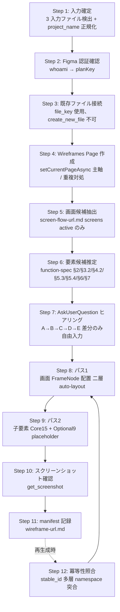

<!-- 参考: https://developers.figma.com/docs/plugins/api/PageNode -->
<!-- 参考: https://developers.figma.com/docs/plugins/api/FrameNode (layoutMode/auto-layout) -->
<!-- 参考: Figma MCP setCurrentPageAsync ガイダンス -->
<!-- ベース: .claude/skills/einja-project-screen-flow-figma/SKILL.md (Plugin API 編集パターン) -->
<!-- 入力ソース: .claude/skills/einja-project-screen-flow-figma/SKILL.md (screen-flow-url.md), .claude/skills/einja-project-function-spec/SKILL.md (function-specs/) -->
<!-- T1 PoC: docs/einja/memory/figma-screen-spec-poc.md (auto-layout 主軸採用根拠) -->

# einja-project-screen-spec: プロジェクトワイヤーフレーム Figma 生成 Skill

## 1. このSkillはいつ起動するか

`docs/project/screen-flow-url.md`（einja-project-screen-flow-figma の出力）と `docs/project/function-specs/`（einja-project-function-spec の出力）を入力に **プロジェクト全体の mid-fi ワイヤーフレームを既存 Figma Design ファイル内の新規 Page『Wireframes』に自動生成・再生成** したい場面で起動する。

典型ユースケース:
- 受託案件で画面遷移図と機能仕様書が確定し、クライアント合意用の mid-fi ワイヤーフレームを画面遷移と同じ Figma ファイル内で残したい
- function-spec を更新したのでワイヤーフレームを再生成し、既存ユーザー編集（手動配置・命名）を保持しつつ差分のみ反映したい
- function-spec の機能カードから入力欄・ボタン・テーブル等の要素候補を機械的に抽出し、AskUserQuestion で確定させたい

色や正確な見た目を決める段階ではなく **構成（情報構造 + 要素配置）** を合意することが目的。仕上げは hi-fi デザイン Skill（`einja-pencil-design-manager` / `ui-design-generator`）に委ねる。

Do NOT use for:
- Issue 単位の hi-fi 画面モックアップ生成（→ `ui-design-generator` Agent）
- 画面遷移図そのものの生成（→ `einja-project-screen-flow-figma`）
- 項目定義表 / メッセージ文言 / バリデーション仕様などの `.md` 仕様書生成（→ 後続別 Skill で対応予定、本 Skill は Figma 上のワイヤーフレームのみ）
- 色・タイポグラフィを確定する hi-fi デザイン（→ `einja-pencil-design-manager`）
- FigJam ファイル生成（本 Skill は Design ファイル専用、既存 Design ファイル内 Page 追加のみ）

## 2. 前提・事前準備

| 項目 | 内容 |
|------|------|
| 入力ファイル（必須） | `docs/project/screen-flow-url.md`（`einja-project-screen-flow-figma` で生成済み。`file_key` と `screens[]` を取得する SSoT） |
| 入力ファイル（推奨） | `docs/project/function-specs/index.md` + `function-spec-*.md`（要素候補推定の主入力） |
| 入力ファイル（任意） | `docs/project/requirements.md`（要素候補推定の補助、§3.2 / §5.4 を参照） |
| Figma 認証 | claude.ai 側で Figma コネクタが認証済みであること（Step 2 で `whoami` 検証） |
| Figma 公式 Skill | `use_figma` 呼び出し前に `Skill` ツールで `/figma-use` のロードを試行する。利用不能時は **そのまま `use_figma` を呼ぶ（致命的でない）** |
| 公式ドキュメント | `write-to-canvas.md`（20kb 出力上限等）が必要な場合は `ReadMcpResourceTool`（server: `claude.ai Figma`, uri: `file://figma/docs/write-to-canvas.md`）で取得 |
| 保存先設定 | `docs/einja/steering/development/figma-design-management.md` の `planKey` 既定値を参照 |
| PoC 記録 | `docs/einja/memory/figma-screen-spec-poc.md`（T1 PoC で `setCurrentPageAsync` 主軸を実証済み） |

## 3. ワークフロー全体図

再生成時は Step 1〜7 → Step 12（既存 manifest 検出）→ Step 8/9 の差分のみ → Step 10/11 の順で進む。

## 4. メインワークフロー

### Step 1: 入力確定

1. `docs/project/screen-flow-url.md` を `Read`。**存在しなければ E1**（AskUserQuestion で `einja-project-screen-flow-figma` 先行実行を促す）。frontmatter から `file_key` / `plan_key` / `project_name` / `schema_version` を取得。
2. `docs/project/function-specs/index.md` と `function-spec-*.md` を `Glob`。**存在しなければ E4**（警告のみ、推定スキップ → Step 6 で全要素 AskUserQuestion 手動入力）。
3. `docs/project/requirements.md` を `Read`（任意。存在すれば §3.2 機能カード / §5.4 主要技術制約を補助シグナルとして保持）。
4. `project_name` は **`screen-flow-url.md` から取得した値を SSoT として採用**（ASCII 英数ハイフン 32 字以内、不正なら正規化）。本 Skill 側で再導出しない（食い違い防止）。
5. `schema_version` が未知なら **E9**（Skill 停止）。

詳細: `references/canonical-enums.md §6 stable_id 命名規約` / `references/manifest-schema.md §1 完全スキーマ`。

### Step 2: Figma 認証確認

1. `mcp__claude_ai_Figma__whoami` を呼び出し、`plans[]` を取得。
2. 成功時:
   - 単一 plan → その `key` を `planKey` として採用。
   - 複数 plan → `screen-flow-url.md` の `plan_key` と突合し合致するものを採用。突合不能なら AskUserQuestion で選択。
3. 失敗（`token expired` 等）時はユーザーに claude.ai 側 Figma コネクタの再認証を依頼し AskUserQuestion で「認証完了したら続行 / 中止」を提示。**連続 2 回失敗時は停止**（無限ループ防止）。
4. `screen-flow-url.md` の `plan_key` と Step 2 で取得した `planKey` が一致しない場合は警告ログを出し、AskUserQuestion で「screen-flow 側の `plan_key` を採用 / whoami 側を採用 / 中止」を確認。

### Step 3: 既存 Figma ファイル接続

1. `screen-flow-url.md` の `file_key` を使い、対象 Figma ファイルにアクセスする。**`create_new_file` は呼ばない**（既存ファイルに Page を追加するのみ、新規ファイルは作成しない）。
2. `mcp__claude_ai_Figma__use_figma` で軽量な `figma.root.children` 列挙コードを実行し、現在の Page 一覧を取得。Page 名と id を JS 側で保持。
3. ファイルが read-only（権限不足）の場合は **E2**（AskUserQuestion で「権限取得後再実行 / 中止」）。
4. `screen-flow-url.md` の `file_key` と過去の `wireframe-url.md` の `file_key` が異なる場合は **E10**（AskUserQuestion で「旧 wireframe-url.md 破棄 / 中止」）。

### Step 4: Wireframes Page の作成 or 既存検出

→ 実装詳細は `references/canonical-enums.md §7 namespace` を参照（namespace `einja.screenSpec` は `einja.screenFlow` と厳密に分離）。

1. `figma.root.children` 内に Page 名 `Wireframes` が存在するか確認。
2. 存在しない場合:
   - `const wireframesPage = figma.createPage(); wireframesPage.name = "Wireframes";` で新規作成。
   - **`await figma.setCurrentPageAsync(wireframesPage);` を必ず呼ぶ**（T1 PoC 実証済み、MCP server gotcha）。これ以降の `figma.currentPage` 操作は Wireframes Page 上で実行される。
3. 存在する場合は **E3**: AskUserQuestion で次の 3 択を提示:
   - 「既存 Wireframes Page にマージ（冪等照合経由）」: Step 12 へ進む
   - 「`Wireframes-v\d+` 連番で新規作成」（例: `Wireframes-v2`、既存最大値 + 1）: 連番 Page を作成して進む
   - 「中止」: Skill 停止
4. Page 作成上限超過時は **E11**（AskUserQuestion で「既存 Page 利用 / マージ / 中止」）。
5. Page に `setSharedPluginData("einja.screenSpec", "role", "page")` と `setSharedPluginData("einja.screenSpec", "page_kind", "wireframes")` を付与。

### Step 5: 画面候補抽出

1. `screen-flow-url.md` の `## screens` セクションを parse し、`status: active` のエントリのみ抽出（`orphan` は除外）。
2. 各 screen の `stable_id`（screen-flow 側の値、例: `sample-attendance-saas__dashboard`）を取得し、`linked_screen_stable_id` として保持（canonical-enums.md §6.3）。
3. **wf 用の多層 namespace stable_id を発行**（canonical-enums.md §6.1 / §6.2 / §6.4 厳守）:
   - 論理 screen ID: `{project_name}__wf__{screen_name}` （`screen_stable_id`、layout/state 非依存）
   - 物理 Frame ID: `{project_name}__wf__{screen_name}__{layout}__{state}` （`stable_id`、Frame 識別子）
   - 子要素 ID: `{screen_frame_stable_id}__el__{kind}__{slug_or_index}` （`element_stable_id`）
   - 例: `sample-attendance-saas__wf__dashboard__desktop__normal__el__button-primary__submit`
4. screens が 0 件 または全 orphan の場合は **E5**（Skill 停止、`einja-project-screen-flow-figma` の再生成を促す）。

詳細: `references/canonical-enums.md §6 stable_id 命名規約`、`references/manifest-schema.md §3 冪等性ポリシー`。

### Step 6: 画面ごとの要素候補推定

→ 詳細マッピングは `references/hearing-checklist.md §1 入力ソース章識別` および `§2 マッピング表` を参照。

各画面について `function-specs/function-spec-*.md` から候補要素を抽出する（**確定ではなく候補として保持**、確定は Step 7 のヒアリングで行う）:

| function-spec の章 | 抽出対象 | wf 要素マッピング |
|--------------------|----------|------------------|
| §2 業務フロー | actor / step | header / side-nav / breadcrumb |
| §3.2 機能カード | 入力項目 / ボタン / 一覧表示 | input-text / input-select / input-date / button-primary / button-secondary / table |
| §4.2 sequenceDiagram | Browser → Backend / 非同期反映 | loading-indicator / toast / modal-dialog |
| §5.3 業務エラー | エラーメッセージ | error-banner / validation-error |
| §5.4 主要技術制約 | 認可 / enum 制約 / 必須制約 | required-mark / input-select / badge-status |
| §6 関連画面一覧 | CRUD 操作 / 一覧画面 | table / search-filter / pagination |
| §7 未確定事項 | 未確定項目 | placeholder-block |

抽出結果は内部的に `screenCandidates[stable_id] = { core: [...], optional: [...], hearing: [...] }` の形で保持。

### Step 7: AskUserQuestion ヒアリング

→ 詳細項目テンプレと回答 schema は `references/hearing-checklist.md §4 質問テンプレ全文` を参照。

ヒアリングは **項目 A→B→C→D→E** の順に分割実行する（一度に多くを聞かない）。

| 項目 | 内容 |
|------|------|
| A | 画面リスト確定（screen-flow から抽出した候補の追加・削除・対象から外す） |
| B | レイアウトテンプレート（standard-listing / detail-form / dashboard / wizard / blank の 5 種から一括選択） |
| C | 主要要素リスト確定（Core 15 + Optional 9、一括選択 + 差分のみ自由入力で確定） |
| D | 要素の並び順・親子関係（header → main → footer 等の基本配置で良いか） |
| E | 命名・ラベル文言（プレースホルダ "{{TBD}}" のまま進めるか、最低限の日本語ラベルを設定するか） |

各選択肢は **description（What）+ Note（So What）** の 2 層構成とし、必ず **「その他（自由入力）」** を最後の選択肢として含める（推測で進めない原則）。

### Step 8: パス 1 - 画面 FrameNode 配置

→ 実装詳細・コードテンプレは `references/wireframe-primitives.md §2 二層 auto-layout` を参照。

要点:
- `use_figma` 呼び出し前に `Skill` ツールで `/figma-use` のロードを試行する。利用不能時はそのまま `mcp__claude_ai_Figma__use_figma` を呼ぶ（警告ログのみ）。
- **各 use_figma バッチ先頭で `await figma.setCurrentPageAsync(wireframesPage);` を必ず実行**（T1 PoC で MCP server 越しの Page スコープ消失を確認済み）。
- 全画面候補を **二層 auto-layout 構造の FrameNode** で配置:
  - **outer（FIXED width/height）**: naming は `wf-{screenName}-{layout}-{state}`（`references/wireframe-primitives.md §2.1`）、`layoutMode: "VERTICAL"` 一択、サイズは `references/canonical-enums.md §2 layout enum` に従う（`desktop: 1440×900` / `mobile: 375×812` / `modal: 800×600`）。`primaryAxisSizingMode` / `counterAxisSizingMode` ともに `"FIXED"`。格子配置（列数 `cols = ceil(sqrt(N))`、画面間隔 200〜400px）。
  - **inner（AUTO width/height）**: outer 子として `layoutMode: "VERTICAL"`, `primaryAxisSizingMode: "AUTO"`, `counterAxisSizingMode: "AUTO"`, `itemSpacing: 16`, `paddingTop/Right/Bottom/Left: 24`。子要素はここに配置される。
- 各 outer に `setSharedPluginData("einja.screenSpec", "role", "screen-frame")` と `setSharedPluginData("einja.screenSpec", "stable_id", "{project_name}__wf__{screen_name}__{layout}__{state}")`、`setSharedPluginData("einja.screenSpec", "screen_stable_id", "{project_name}__wf__{screen_name}")` を付与（**`setPluginData` ではなく必ず `setSharedPluginData`**、ファイル横断読取と冪等性のため。wireframe-primitives.md §2.1 と整合）。
- inner（content frame）にも `setSharedPluginData("einja.screenSpec", "role", "screen-inner")` を付与（パス 2 の子要素 append 先を一意特定するため）。
- レスポンスでは `{stable_id: nodeId}` Map を JS 側で保持するが、パス 2 では `findAll` で再解決する（E15 対策）。
- **Step 8 までは Figma 書き込みあり、ただしこの段階は枠のみ**（誤書き込み防止のため Step 1〜7 では一切編集しない）。

namespace 完全分離: `einja.screenSpec`（本 Skill）と `einja.screenFlow`（screen-flow-figma）は厳密に分離する。詳細は `references/canonical-enums.md §7 namespace`。

### Step 9: パス 2 - 子要素配置（Core 15 + Optional 9）

→ 実装詳細・各プリミティブのコードテンプレは `references/wireframe-primitives.md §3 Core 15 関数テンプレ` および `§5 動的バッチ` を参照。

要点:
- **Core 15 プリミティブ**（header / side-nav / page-title / breadcrumb / input-text / input-select / input-date / required-mark / button-primary / button-secondary / table / validation-error / error-banner / empty-state / loading-indicator）は実描画する（canonical-enums.md §1 Core 15 と完全一致）。
- **Optional 9 プリミティブ**（modal-dialog / tabs / pagination / checkbox / radio / textarea / badge-status / toast / search-filter）は Figma 上のみ **placeholder-block 代替描画**（同寸法 + `{{kind}}` ラベル付き矩形 + 中央にテキスト「[{{kind}} placeholder]」）。**manifest（`wireframe-url.md`）には Optional 9 の `kind` をそのまま記録する**（例: `kind: modal-dialog`、`placeholder-block` には書き換えない）。Phase 4.1 で個別実装に置換される予定（canonical-enums.md §1 Optional 9 と完全一致）。
- **配置単位**: 原則 **1 画面 1 バッチ**。子要素が 20〜30 個を超える場合は子要素を 20〜30 単位で再分割。
- **動的バッチ分割**: コード文字列を構築しながら **40000 字** を超える前に次バッチへ分割（`use_figma` 入力上限 50000 字に対する余裕）。**50000 字超エラーが返った場合は閾値を 40000 → 30000 字に下げて再試行**（E7）。
- 各バッチ先頭で `await figma.setCurrentPageAsync(wireframesPage);` を実行（Step 8 と同じく必須）。
- 各バッチ先頭で対象 screen の inner FrameNode を `figma.currentPage.findAll(n => n.getSharedPluginData("einja.screenSpec", "stable_id") === target)` で再解決し、`inner.appendChild(...)` で追加する（E8 / E15 対策）。
- 各子要素には以下の **3キーを `setSharedPluginData("einja.screenSpec", <key>, <value>)` で必ず付与**する（key 名は `kind` で wireframe-primitives.md §3 と整合）:
  - `role=element`
  - `element_stable_id={screen_frame_stable_id}__el__{kind}__{slug_or_index}`（`canonical-enums.md §6.4` 命名規約）
  - `kind={kind}`（`canonical-enums.md §1` element kind enum、lowercase + ハイフン形式）
- フォント: `await figma.loadFontAsync({ family: "Inter", style: "Regular" })` を最初の TextNode 作成前に実行。失敗時は `Inter Semi Bold`（**半角スペース必須**）→ `Roboto Regular` → `figma.listAvailableFontsAsync()` 先頭にフォールバック（E6）。
- バッチ末尾のレスポンスは **件数 + 最後の stable_id のみ** に整形（`write-to-canvas.md` の 20kb 出力上限対策）。
- **lowercase + ハイフン形式** 厳守: `kind` は `button-primary` のように **必ず小文字 + ハイフン区切り**（snake_case や camelCase は不可。canonical-enums.md §1 enum 値）。
- 部分失敗時（E14）は `stable_id` で再走査し未生成要素のみ再試行する。

### Step 10: スクリーンショット確認

1. `mcp__claude_ai_Figma__get_screenshot` を Wireframes Page ルートまたは全画面包含 FrameNode を対象に呼び出す（`maxDimension` は既定 1024、画面数が多い場合は 2048）。
2. 取得失敗時は **E18**（URL 取得省略、ユーザーに Figma 直接確認を依頼）。
3. 返却されたスクリーンショット URL をユーザーに提示。
4. AskUserQuestion で「OK / 一部修正（自由入力で具体的指示）/ 中止」を確認:
   - 「修正」が選ばれた場合は修正範囲に応じて Step 7（要素リスト変更）または Step 9（描画調整）に戻る。
   - 「中止」は manifest 記録もスキップ（Figma 上の変更は手動 Undo を促す）。

### Step 11: manifest 記録

→ 完全スキーマは `references/manifest-schema.md §1 完全スキーマ` を参照。

1. `docs/project/wireframe-url.md` を作成（新規）または上書き（再生成）。**`docs/project/screen-flow-url.md` には触れない**（screens の SSoT は screen-flow 側のため）。
2. 既存ファイルがある場合は上書き前に `docs/project/wireframe-url.md.bak` として退避。
3. frontmatter + `## screens` + `## elements` セクションを書き込む。フィールド構成は **`references/manifest-schema.md §1` の定義に厳密に従う**:
   - **必須**: `schema_version`（固定値 `1`）, `figma_url`, `file_key`, `project_name`, `generated_at`, `source_screen_flow_file_key`, `source_screen_flow_schema_version`
   - **任意**: `plan_key`, `linked_screen_flow`（既定: `docs/project/screen-flow-url.md`）, `wireframes_page_id`, `fidelity`（既定: `mid-fi`）, `color_mode`（既定: `mono`）
4. screens 各 entry には `stable_id` / `screen_stable_id` / `linked_screen_stable_id` / `node_id` / `layout` / `state` / `size` / `position` / `status` を、elements 各 entry には `screen_frame_stable_id` / `element_stable_id` / `kind` / `node_id` / `status` / `source` および kind 別フィールド（manifest-schema.md §2 参照）を記録する。再生成で消えた要素は `status: orphan` とする。
5. `.bak` 生成後、`.gitignore` に `docs/project/wireframe-url.md.bak` が未登録なら `Bash` で追記する（重複コミット防止）。
6. manifest parse 失敗時は **E17**（`.bak` から復元提案 / 新規生成 / 中止）。

### Step 12: 冪等性照合（再生成時のみ）

→ 詳細フローは `references/manifest-schema.md §3 冪等性ポリシー` を参照。

1. 既存 `docs/project/wireframe-url.md` を `Read`。`file_key` を取得し、Step 3 で接続したファイルと一致することを確認（不一致は E10）。
2. 既存 `Wireframes` Page を `figma.root.children` から検索（**新規作成しない**）し、`setCurrentPageAsync` で切り替え。
3. screens 照合: `stable_id` 多層 namespace で突合し、一致 → `node_id` を流用、既存 `position` を保持（手動レイアウト変更を尊重）。未知 → 新規 outer 作成。既存にあって今回ない → `status: orphan`（**自動削除はしない**）。
4. elements も同様に照合（`parent_stable_id` で screen 配下を絞り込み）。
5. ユーザー手動削除で `stable_id` が見つからない場合は E15: `findAll` で再解決 → 見つからなければ `status: orphan` 設定。
6. orphan 化された節点について「N 個の画面/要素が要件から削除されました。Figma 上で確認後、不要なら手動削除してください」とログ出力。

## 5. エラー処理パターン

| ID | 事象 | 一次対処 | 詳細参照 |
|----|------|---------|---------|
| E1 | `screen-flow-url.md` 欠落 | AskUserQuestion で `screen-flow-figma` 先行実行 / 中止 | Step 1 |
| E2 | Figma ファイル read-only | AskUserQuestion で権限取得後再実行 / 中止 | Step 3 |
| E3 | `Wireframes` Page 既存 | AskUserQuestion で マージ / `Wireframes-v\d+` 連番 / 中止 | Step 4 |
| E4 | `function-specs/` 欠落 | 警告のみ、推定スキップで項目 C 全手動入力 | Step 1 / `references/hearing-checklist.md §3` |
| E5 | `screens[]` 全 orphan / 空 | Skill 停止、screen-flow 再生成促す | Step 5 |
| E6 | `loadFontAsync` 失敗 | `Inter Regular` → `Inter Semi Bold` → `Roboto Regular` → `listAvailableFontsAsync()` 先頭 | `references/wireframe-primitives.md §3` |
| E7 | `use_figma` 50000 字超 | Step 9 の動的バッチを 40000 → 30000 字に縮小 | `references/wireframe-primitives.md §5` |
| E8 | `findAll` で nodeId 0 件 | `setCurrentPageAsync` 再設定 → 再走査 → skip + log | Step 9 |
| E9 | `schema_version` 未知 | Skill 読み込み停止、Skill 更新促す | `references/manifest-schema.md §5` |
| E10 | screen-flow と wireframe の `file_key` 不一致 | AskUserQuestion で `wireframe-url.md` 破棄 / 中止 | Step 3 / Step 12 |
| E11 | Page 作成上限超過 | AskUserQuestion で 既存 Page 利用 / マージ / 中止 | Step 4 |
| E12 | Figma API レートリミット | exponential backoff（1s / 2s / 4s）3 回再試行 | Step 8 / Step 9 |
| E13 | ネットワーク timeout | 3 回再試行（10s / 20s / 40s） | Step 8 / Step 9 |
| E14 | `use_figma` 途中失敗（バッチ部分成功） | `stable_id` で再走査して未生成要素のみ再試行 | Step 9 |
| E15 | 共同編集による node removed | `findAll` で `stable_id` 再解決、見つからなければ `status: orphan` | Step 12 |
| E16 | `setSharedPluginData` namespace 重複 | 警告ログ + 既存値上書きで継続 | `references/canonical-enums.md §7` |
| E16-b | `setSharedPluginData` key 100 字超 | `stable_id` を SHA-256 先頭 16 進 12 桁に truncate + 衝突検知 | `references/canonical-enums.md §6` |
| E17 | manifest parse failure | `.bak` から復元提案 / 新規生成 / 中止 | Step 11 |
| E18 | `get_screenshot` 取得失敗 | URL 取得省略、ユーザーに Figma 直接確認依頼 | Step 10 |

## 6. サブエージェント呼び出しポリシー

本 Skill は **オーケストレーター型** であり、`Task` ツールによる汎用サブエージェント呼び出しは **原則行わない**。Figma MCP の `use_figma` が Plugin API 実行サンドボックスを内包しており、JS 構築・実行・冪等照合は本 Skill 内で完結するため。

例外として `general-purpose` / `Explore` サブエージェントを使ってよいケース:
- `docs/project/function-specs/` が極端に大規模（合計数千行）で、Step 6 の章識別 / 要素マッピングを単一コンテキストで処理しきれない場合のみ、抽出を委託する。
- その場合のプロンプトには **「不明点や判断が必要な場合は、推測で進めず `.claude/skills/_einja-subagent-question-protocol/SKILL.md` を参照して PENDING_QUESTIONS 形式で質問を返却し、作業を停止すること」** を必ず含める。

## 7. サブエージェント質問プロトコル

万一サブエージェント経由で `## PENDING_QUESTIONS` 形式の返却を受けた場合は、`.claude/skills/_einja-subagent-question-protocol/SKILL.md` の手順に従う。調査・分析で確実に判定可能な質問は本 Skill が自律解決し、判定不能な質問のみ AskUserQuestion でユーザーへエスカレーションする。

## 8. 関連リソース・依存

| 区分 | 名称 | 役割 |
|------|------|------|
| 上流入力（必須） | `einja-project-screen-flow-figma` | `docs/project/screen-flow-url.md` の生成元（`file_key` と `screens[]` の SSoT） |
| 上流入力（推奨） | `einja-project-function-spec` | `docs/project/function-specs/` の生成元（要素候補推定の主入力） |
| 上流入力（推奨） | `einja-project-requirements` | `docs/project/requirements.md` の生成元（§3.2 / §5.4 を補助シグナルとして参照） |
| 関連 Skill（用途別） | `ui-design-generator` (Agent) | Issue 単位の hi-fi 画面モックアップ生成。本 Skill とは粒度が異なる（プロジェクト俯瞰 mid-fi vs Issue 詳細 hi-fi） |
| 関連 Skill（用途別） | `einja-pencil-design-manager` | hi-fi デザイン管理。本 Skill の mid-fi ワイヤーを仕上げる段階で利用 |
| 参照 steering | `docs/einja/steering/development/figma-design-management.md` | `planKey` 既定値・命名規則 |
| サブ参照 1 | `references/canonical-enums.md` | enum 定義 SSoT（kind / layout / state / status / source / namespace / stable_id 命名規約） |
| サブ参照 2 | `references/wireframe-primitives.md` | Core 15 プリミティブ実装パターン + 二層 auto-layout 構造 + 動的バッチ戦略 |
| サブ参照 3 | `references/hearing-checklist.md` | 入力ソース章識別 + マッピング表 + AskUserQuestion 質問テンプレ全文 |
| サブ参照 4 | `references/manifest-schema.md` | `wireframe-url.md` 完全スキーマ + 冪等性ポリシー + screen-flow-url.md との関係 |
| Figma MCP リソース | `file://figma/docs/write-to-canvas.md` | 必要時 `ReadMcpResourceTool` で取得（20kb 出力上限・50000 字入力上限の根拠） |
| Plugin API ドキュメント | `developers.figma.com` / `PageNode` / `FrameNode (layoutMode)` | 二層 auto-layout の根拠 |
| PoC 記録 | `docs/einja/memory/figma-screen-spec-poc.md` | `setCurrentPageAsync` 主軸採用の動作実証 |

## 9. 実行制約

- 本 Skill は親エージェント（オーケストレーター）として動作する。`context: fork` は設定しない（AskUserQuestion を多用するため）。
- 使用ツール: `mcp__claude_ai_Figma__whoami` / `mcp__claude_ai_Figma__use_figma` / `mcp__claude_ai_Figma__get_screenshot`（**`create_new_file` は不使用**、既存ファイルに Page 追加のみ）、`Read` / `Write` / `Edit`（`docs/project/wireframe-url.md` のみ）/ `Bash`（`.gitignore` 追記のみ）/ `Grep` / `Glob` / `AskUserQuestion` / `ReadMcpResourceTool` / `Skill`。
- **書き込み禁止**:
  - `docs/project/screen-flow-url.md`（上流出力、screens の SSoT）
  - `docs/project/requirements.md`（上流出力）
  - `docs/project/function-specs/`（上流出力）
  - `docs/einja/` 配下（`memory/` と `example/` を除く、マネージドディレクトリ）
- **書き込み先**: `docs/project/wireframe-url.md` のみ（および `.bak` 退避ファイル）。
- Figma 書き込みは Step 8 以降。Step 1〜7 では Figma 上で一切編集しない（誤書き込み防止）。
- **Page スコープ厳守**: 各 `use_figma` バッチ先頭で `await figma.setCurrentPageAsync(wireframesPage);` を必ず実行（T1 PoC 実証済み、MCP server を介すると Page スコープが消失する事例を確認）。
- **namespace 完全分離**: `einja.screenSpec`（本 Skill）と `einja.screenFlow`（`einja-project-screen-flow-figma`）は厳密に分離する。混在禁止。
- **lowercase + ハイフン形式厳守**: `kind` / `layout` / `state` / Page 名等の識別子は小文字 + ハイフン区切り（snake_case / camelCase は不可。canonical-enums.md §1〜§5 の enum 値）。
- フォント名は **`Inter Semi Bold`（半角スペース必須）** のように Figma 内部表現に厳密に従う（typo は即時 `loadFontAsync` 失敗）。
