# マジックリンク認証機能 設計文書

<!-- 図はMermaid記法を標準とする。C4記法（C4Context等）は使用せず、graph TB + subgraph で C4 相当を表現する -->
<!-- 外部連携（SendGrid、認証プロバイダ）は "External Systems" subgraph に明示 -->

## Overview

- **Purpose**: パスワードレス認証を実現するマジックリンク機能を実装し、ユーザーのログイン体験を向上させる
- **Users**: アプリケーション利用者（既存ユーザー・新規ユーザー）
- **Impact**: パスワード管理不要による離脱率低下、フィッシング耐性向上

### Goals

- メールアドレスに送信される一時的なリンクをクリックすることで、パスワード入力なしに安全な認証を可能にする
- マジックリンクリクエスト・認証処理・セキュリティ通知の3ユーザーストーリーを技術的に実現する

### Non-Goals

- ソーシャルログイン（OAuth）の実装
- パスワード認証の廃止（移行期間中は並行運用）

## Existing Architecture Analysis

- **現状の実装**: パスワード認証が実装済み。並行運用期間中はパスワードログインも維持
- **再利用する既存コンポーネント**: SessionProvider、既存のCookieベースセッション管理、PostgreSQL / Prisma
- **拡張対象**: 既存のユーザーモデル（MagicLinkToken / Session テーブルを追加）
- **新規追加対象**: TokenService、EmailService、SecurityService、MagicLinkForm、VerificationMessage、TokenVerifying コンポーネント

## Architecture Pattern & Boundary Map

<!-- C4 Container相当: graph TB + subgraph で表現。外部システム・技術スタックをラベルに含める -->
<!-- 外部連携は "External Systems" subgraph に明示 -->

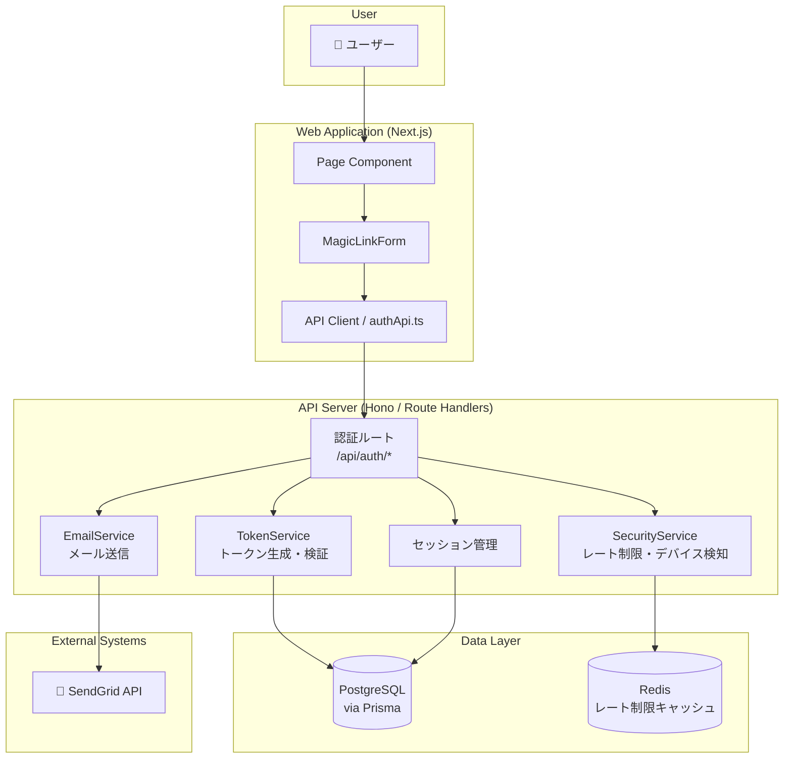

### Architecture Notes

- **採用パターン**: 4層アーキテクチャ（Page → API Route → UseCase/Service → Repository）
- **依存境界**: EmailService / SecurityService は AuthRoute からのみ呼び出し。TokenService はトークンの生成・ハッシュ化・検証に特化
- **既存規約との整合**: backend-architecture.md の Repository/Mapper パターンに準拠

## Technology Stack

| Layer | Choice / Version | Role in Feature | Notes |
|-------|------------------|-----------------|-------|
| Frontend | React / Next.js (App Router) | UI実装 | 既存App Router準拠 |
| Validation | Zod | 入力検証 | FE/BEで整合 |
| Backend | Route Handlers / Hono | API層 | /api/auth/* ルート群 |
| ORM | Prisma | データアクセス | 既存Repository経由 |
| Cache | Redis | レート制限カウンター | セッション情報の一時キャッシュも兼用 |
| Email | SendGrid | マジックリンクメール送信 | HTML/テキストマルチパート |
| Token | crypto.randomBytes | 256ビット安全乱数生成 | Node.js標準crypto |
| Hashing | bcrypt | トークンのハッシュ化保存 | DB漏洩時の保護 |

## System Flows

### 主要フロー: マジックリンク認証の全体

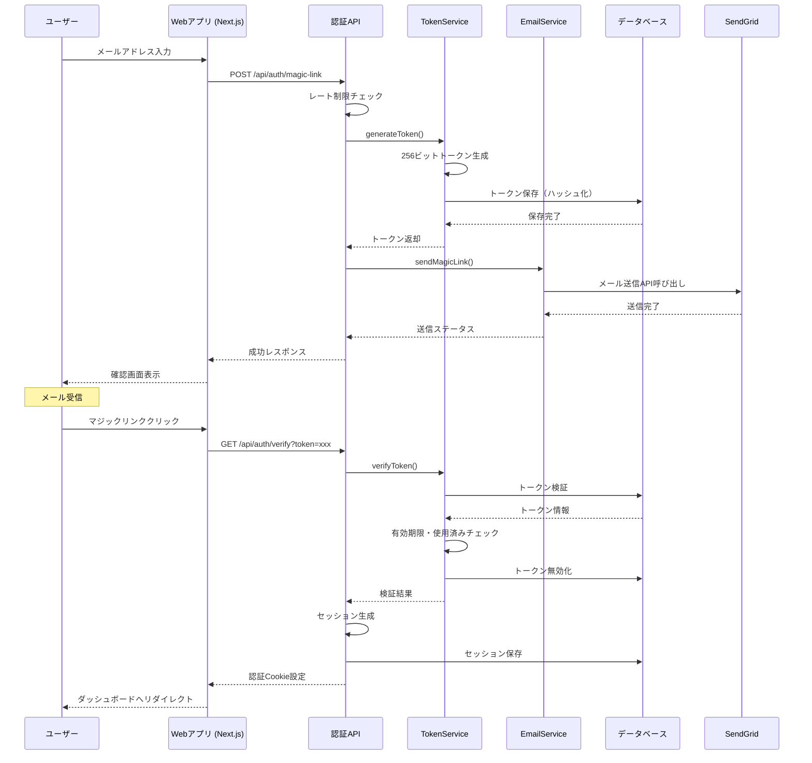

### 例外フロー: トークン検証の分岐とエラーハンドリング

<!-- alt: トークン状態分岐（有効/期限切れ/使用済み/無効） -->
<!-- opt: セキュリティ通知メール送信（新規デバイス時） -->
<!-- DB失敗時のエラーハンドリング -->

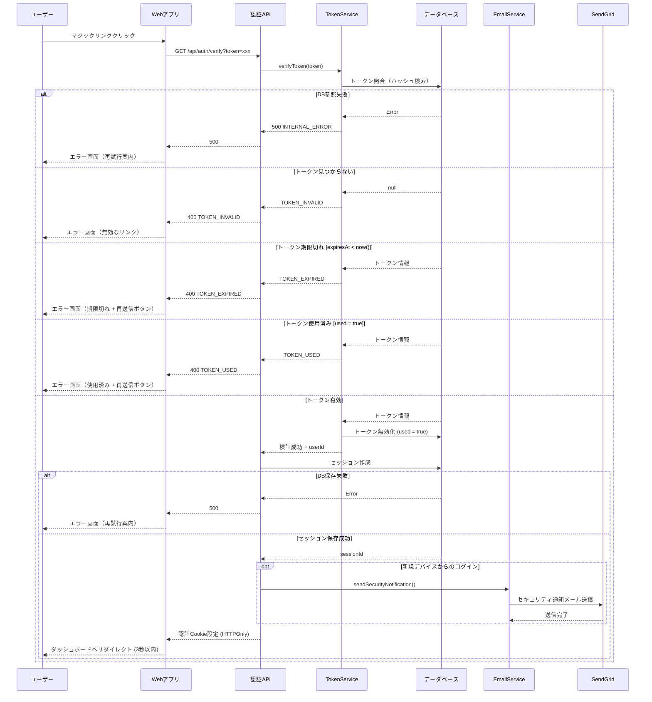

### 例外フロー: マジックリンクリクエストのレート制限

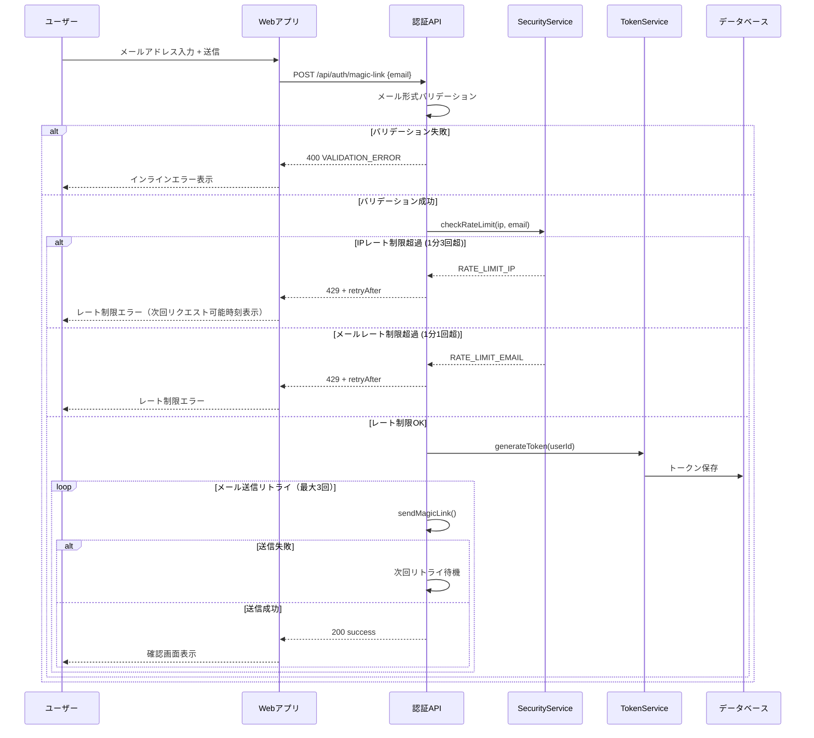

## Requirements Traceability

| Requirement / AC | Summary | Components | Interfaces | Flows |
|------------------|---------|------------|------------|-------|
| AC1.UI.N.001 | 有効メール送信時の成功メッセージ表示 | MagicLinkForm, VerificationMessage | Props: email | 主要フロー |
| AC1.VAL.E.001 | 必須未入力・形式不正で送信が阻止されエラー表示（VR-1-001/VR-1-002 を統合参照） | MagicLinkForm, Zod Schema | Validation contract | 例外フロー（リクエスト） |
| AC1.ERR.E.001 | レート制限エラー | MagicLinkForm, AuthRoute | Error response | 例外フロー（レート制限） |
| AC1.UI.N.002 | メールアドレスフィールドのフォーカス状態表示 | MagicLinkForm | Props: focusedField state | 主要フロー |
| AC1.UX.N.001 | 送信ボタン無効化・スピナー（多重送信防止） | MagicLinkForm | State: isSubmitting | 主要フロー |
| AC1.UX.N.002 | 3秒以上で進捗メッセージ表示 | MagicLinkForm, TokenVerifying | State: elapsedTime | 主要フロー |
| AC1.NAV.N.001 | 送信成功後の確認画面遷移 | MagicLinkForm, Router | onSubmitSuccess callback | 主要フロー |
| AC2.NAV.N.001 | 有効リンクで自動ログインしダッシュボードへリダイレクト | TokenVerifying, AuthRoute | onSuccess callback | 主要フロー |
| AC2.ERR.E.001 | 期限切れリンクエラーと再送信オプション | TokenVerifying, ErrorScreen | onError callback | 例外フロー（検証） |
| AC2.ERR.E.002 | 使用済みリンクエラー | TokenVerifying, ErrorScreen | onError callback | 例外フロー（検証） |
| AC2.UX.N.001 | 検証画面でのローディングスピナー | TokenVerifying | State: status = verifying | 主要フロー |
| AC2.UX.N.002 | トークン検証中のユーザー操作防止 | TokenVerifying | State: isSubmitting | 主要フロー |
| AC2.NAV.N.002 | 検証成功後3秒以内のダッシュボードリダイレクト | TokenVerifying | setTimeout(onSuccess, 3000) | 主要フロー |
| AC2.ERR.E.003 | 期限切れトークンで再送信ボタン表示 | ErrorScreen | Props: errorType = TOKEN_EXPIRED | 例外フロー（検証） |
| AC2.ERR.E.004 | 使用済みトークンで再送信ボタン表示 | ErrorScreen | Props: errorType = TOKEN_USED | 例外フロー（検証） |
| AC2.ERR.E.005 | 無効トークンでログインページへの導線表示 | ErrorScreen | Props: errorType = TOKEN_INVALID | 例外フロー（検証） |
| AC2.UI.N.001 | エラー画面からの再送信時のメールアドレスプリフィル | ErrorScreen, MagicLinkForm | Props: defaultEmail | 例外フロー（検証） |
| AC3.UI.N.001 | 新規デバイスログイン時のセキュリティ通知メール送信 | EmailService, SecurityService | sendSecurityNotification() | 例外フロー（検証）opt |
| AC3.UI.N.002 | メールの「今すぐ保護」リンクからワンクリックでセッション即時無効化 | EmailService, Router | GET /auth/revoke?sessionId=&confirm=1（確認画面を介さず即時revoke） | 主要フロー |
| AC3.UI.N.003 | 新規デバイスログイン後のダッシュボード通知バナー | Dashboard | SecurityBanner component | 主要フロー |
| AC3.NAV.N.001 | メールの「アクティビティを確認」リンクからセッション無効化確認画面へ遷移 | EmailService, Router | /auth/revoke?sessionId= | 主要フロー |
| AC3.UI.N.004 | 確認画面で「無効化する」クリックで無効化実行 | SessionRevocationScreen | POST /api/auth/revoke | 主要フロー |
| AC3.NAV.N.002 | 確認画面で「キャンセル」クリックでセッション維持 | SessionRevocationScreen | Router.back() | 主要フロー |

## Component Summary

### C4 Component図

<!-- UI変更を伴うため必須。Feature: Auth 内部のコンポーネント分割を示す -->

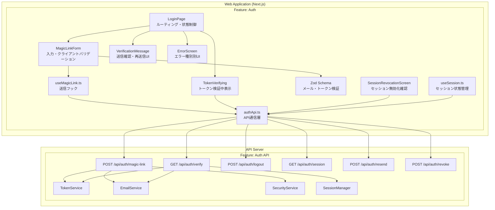

### Component一覧テーブル

| Component | Domain/Layer | Intent | Req Coverage | Key Dependencies | Contracts |
|-----------|--------------|--------|--------------|------------------|-----------|
| LoginPage | UI/Page | 認証フロー全体の制御・ルーティング | AC1.NAV.N.001, AC2.NAV.N.001 | AuthApiClient, Router | State管理 |
| MagicLinkForm | UI/Feature | メールアドレス入力・バリデーション | AC1.UI.N.001, AC1.VAL.*, AC1.UX.* | AuthSchema, useMagicLink | Props: onSubmit, defaultEmail |
| VerificationMessage | UI/Feature | 送信確認・再送信カウントダウン | AC1.UI.N.001, AC1.NAV.N.001 | - | Props: email, onResend |
| TokenVerifying | UI/Feature | トークン検証中UI・自動リダイレクト | AC2.UX.*, AC2.NAV.* | AuthApiClient | Props: token, onSuccess, onError |
| ErrorScreen | UI/Feature | エラー種別別UI・リカバリーアクション | AC2.ERR.* | Router | Props: errorType, email |
| SessionRevocationScreen | UI/Feature | セッション無効化確認（「アクティビティを確認」リンク経由の確認画面） | AC3.NAV.N.001, AC3.UI.N.004, AC3.NAV.N.002 | AuthApiClient | Props: sessionId |
| TokenService | Server/Service | トークン生成・ハッシュ化・検証・無効化 | AC2.ERR.*, AC2.NAV.* | DB (Prisma) | generateToken(), verifyToken() |
| EmailService | Server/Service | マジックリンク・セキュリティ通知メール送信 | AC1.UI.N.001, AC3.UI.N.001 | SendGrid API | sendMagicLink(), sendSecurityNotification() |
| SecurityService | Server/Service | レート制限・デバイス検知 | AC1.ERR.E.001 | Redis | checkRateLimit() |
| SessionManager | Server/Service | セッション生成・Cookie設定・無効化 | AC2.NAV.N.001, AC3.UI.N.002 | DB (Prisma) | createSession(), revokeSession() |

## Components and Interfaces

### MagicLinkForm

- **Responsibilities**:
  - メールアドレス入力状態管理
  - クライアントサイドバリデーション（フォーカスアウト時・送信時）
  - 送信中の多重送信防止
  - 長時間処理時の進捗メッセージ表示
- **Dependencies**:
  - Inbound: LoginPage
  - Outbound: useMagicLink hook, Zod Schema
- **Props**:

**MagicLinkFormProps**
| プロパティ | 型 | 必須 | 説明 |
|-----------|-----|-----|------|
| onSubmit | (email: string) => Promise\<void\> | ○ | 送信ハンドラ |
| defaultEmail | string | - | エラー後の再表示用デフォルト値 |
| isLoading | boolean | - | ローディング状態の外部制御 |
| error | string \| null | - | 外部からのエラーメッセージ |

**MagicLinkFormState**
| プロパティ | 型 | 説明 |
|-----------|-----|------|
| email | string | 入力中のメールアドレス |
| validationError | string \| null | バリデーションエラーメッセージ |
| isSubmitting | boolean | 送信中フラグ（多重送信防止） |
| focusedField | 'email' \| null | フォーカス中フィールド名 |

**バリデーションロジック** (処理フロー):
- 空文字・空白のみ → 「メールアドレスを入力してください」エラー
- メール形式不正（`@` / ドメイン不在）→ 「有効なメールアドレスを入力してください」エラー
- 上記以外 → バリデーション通過（null を返却）

### VerificationMessage

- **Responsibilities**:
  - メール送信確認画面の表示
  - 再送信カウントダウン管理（60秒）
  - 再送信ボタンの有効/無効制御
- **Contracts**:

**VerificationMessageProps**
| プロパティ | 型 | 必須 | 説明 |
|-----------|-----|-----|------|
| email | string | ○ | 送信先メールアドレス（表示用） |
| onResend | () => Promise\<void\> | ○ | 再送信ハンドラ |
| onChangeEmail | () => void | ○ | 別メールアドレスへ変更するコールバック |
| expiryMinutes | number | - | リンク有効期限（分）。デフォルト: 15 |

**VerificationMessageState**
| プロパティ | 型 | 説明 |
|-----------|-----|------|
| resendCountdown | number | 再送信ボタン有効化までの残秒数 |
| canResend | boolean | 再送信ボタン有効フラグ |
| isResending | boolean | 再送信処理中フラグ |

### TokenVerifying

- **Responsibilities**:
  - マウント時に自動的にトークン検証開始
  - 検証中ローディングUI表示
  - 3秒以上経過時のプログレスバー追加
  - 検証成功後3秒以内の自動リダイレクト
- **Contracts**:

**TokenVerifyingProps**
| プロパティ | 型 | 必須 | 説明 |
|-----------|-----|-----|------|
| token | string | ○ | URLクエリパラメータから取得したトークン |
| onSuccess | (user: User) => void | ○ | 検証成功時コールバック |
| onError | (error: TokenVerificationError) => void | ○ | 検証失敗時コールバック |

**TokenVerifyingState**
| プロパティ | 型 | 説明 |
|-----------|-----|------|
| status | 'verifying' \| 'success' \| 'error' | 検証フェーズ |
| elapsedTime | number | 経過秒数（プログレスバー表示判定用） |
| showProgressBar | boolean | プログレスバー表示フラグ（3秒超過で true） |

### TokenService

- **Responsibilities**:
  - 256ビット暗号学的乱数トークン生成
  - bcryptによるトークンのハッシュ化・保存
  - トークン照合・有効期限チェック・使用済みチェック
  - 使用後の即時無効化
- **Contracts**:

**TokenService メソッド一覧**
| メソッド | 引数 | 戻り値 | 説明 |
|---------|------|--------|------|
| generateToken | userId: string, ipAddress?: string, userAgent?: string | Promise\<\{ rawToken: string \}\> | 256ビット安全乱数トークンを生成しハッシュ化してDBに保存 |
| verifyToken | rawToken: string | Promise\<\{ userId: string \} \| TokenVerificationError\> | トークン照合・有効期限・使用済みチェックを実施 |
| invalidateToken | tokenId: string | Promise\<void\> | 指定トークンを即時無効化（used = true に更新） |

## Data Model

### 物理ERD

<!-- DB変更を伴うため必須。PK/FK/UK を含む物理モデル -->

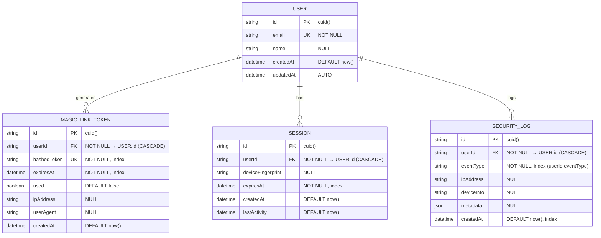

### Entity / DTO

**MagicLinkTokenEntity**
| フィールド | 型 | 説明 |
|-----------|-----|------|
| id | string | PK (cuid) |
| userId | string | FK → User.id |
| hashedToken | string | bcryptハッシュ化済みトークン |
| expiresAt | Date | 有効期限（生成から15分） |
| used | boolean | 使用済みフラグ |
| ipAddress | string \| null | リクエスト元IPアドレス |
| userAgent | string \| null | リクエスト元ユーザーエージェント |
| createdAt | Date | 生成日時 |

**SessionEntity**
| フィールド | 型 | 説明 |
|-----------|-----|------|
| id | string | PK (cuid) |
| userId | string | FK → User.id |
| deviceFingerprint | string \| null | デバイス識別子 |
| expiresAt | Date | セッション有効期限（30日） |
| createdAt | Date | セッション生成日時 |
| lastActivity | Date | 最終アクティビティ日時 |

**TokenVerificationError (union type)**
- `TOKEN_INVALID`: トークンが存在しない / 無効なトークン
- `TOKEN_EXPIRED`: トークンの有効期限切れ（expiresAt < now）
- `TOKEN_USED`: トークンが既に使用済み（used = true）

### Persistence (Prisma)

```prisma
model User {
  id              String            @id @default(cuid())
  email           String            @unique
  name            String?
  createdAt       DateTime          @default(now())
  updatedAt       DateTime          @updatedAt
  magicLinkTokens MagicLinkToken[]
  sessions        Session[]
  securityLogs    SecurityLog[]

  @@index([email])
  @@map("users")
}

model MagicLinkToken {
  id          String   @id @default(cuid())
  userId      String
  hashedToken String   @unique
  expiresAt   DateTime
  used        Boolean  @default(false)
  ipAddress   String?
  userAgent   String?
  createdAt   DateTime @default(now())
  user        User     @relation(fields: [userId], references: [id], onDelete: Cascade)

  // インデックス戦略
  @@index([hashedToken])           // トークン検証の高速化
  @@index([userId, createdAt])     // ユーザー別の履歴取得
  @@index([expiresAt])              // 期限切れトークンのクリーンアップ
  @@map("magic_link_tokens")
}

model Session {
  id               String   @id @default(cuid())
  userId           String
  deviceFingerprint String?
  expiresAt        DateTime
  createdAt        DateTime @default(now())
  lastActivity     DateTime @default(now())
  user             User     @relation(fields: [userId], references: [id], onDelete: Cascade)

  @@index([userId])
  @@index([expiresAt])              // セッション期限管理
  @@map("sessions")
}

model SecurityLog {
  id         String   @id @default(cuid())
  userId     String
  eventType  String   // LOGIN, LOGOUT, TOKEN_REQUEST, etc.
  ipAddress  String?
  deviceInfo String?
  metadata   Json?
  createdAt  DateTime @default(now())
  user       User     @relation(fields: [userId], references: [id], onDelete: Cascade)

  @@index([userId, eventType])      // イベントタイプ別の監査
  @@index([createdAt])               // 時系列での分析
  @@map("security_logs")
}
```

## API Contract

### Endpoint Summary

| Method | Endpoint | Purpose | Auth |
|--------|----------|---------|------|
| POST | `/api/auth/magic-link` | マジックリンク送信 | 不要 |
| GET | `/api/auth/verify` | トークン検証 | 不要 |
| POST | `/api/auth/logout` | ログアウト | 必要 |
| GET | `/api/auth/session` | セッション確認 | 必要 |
| POST | `/api/auth/resend` | リンク再送信 | 不要 |
| POST | `/api/auth/revoke` | セッション無効化 | メールトークン |

### Request / Response

**POST /api/auth/magic-link**
| 区分 | フィールド | 型 | 必須 | 説明 |
|-----|-----------|-----|-----|------|
| Request | email | string | ○ | 送信先メールアドレス |
| Response | success | boolean | ○ | 送信成功フラグ |
| Response | message | string | ○ | 結果メッセージ |

**GET /api/auth/verify?token=xxx**
- 成功時: 302 リダイレクト（ダッシュボードへ）
- 失敗時: エラーレスポンス（Error Contract 参照）

**GET /api/auth/session**
| 区分 | フィールド | 型 | 説明 |
|-----|-----------|-----|------|
| Response | user | User \| null | 認証済みユーザー情報。未認証時は null |

### Error Contract

| HTTP Status | Code | Meaning | Caller Behavior |
|-------------|------|---------|-----------------|
| 400 | VALIDATION_ERROR | 入力不正（メール形式） | インラインエラー表示 |
| 400 | TOKEN_EXPIRED | トークン期限切れ | エラー画面（再送信ボタン） |
| 400 | TOKEN_USED | トークン使用済み | エラー画面（再送信ボタン） |
| 400 | TOKEN_INVALID | トークン無効 | エラー画面（ログインページ導線） |
| 429 | RATE_LIMIT_ERROR | レート制限超過 | エラー表示（retryAfter時刻） |
| 500 | INTERNAL_ERROR | 内部エラー | エラー表示（再試行案内） |

## State Transitions

### MagicLinkToken の状態遷移

<!-- 状態を持つ機能のため必須。state/event/guard 付き -->

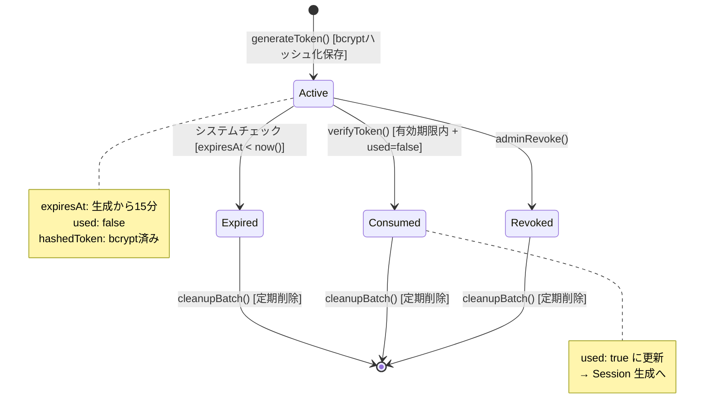

### Session の状態遷移

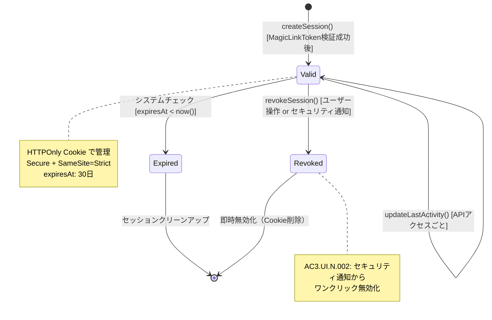

### 画面遷移（UI State）

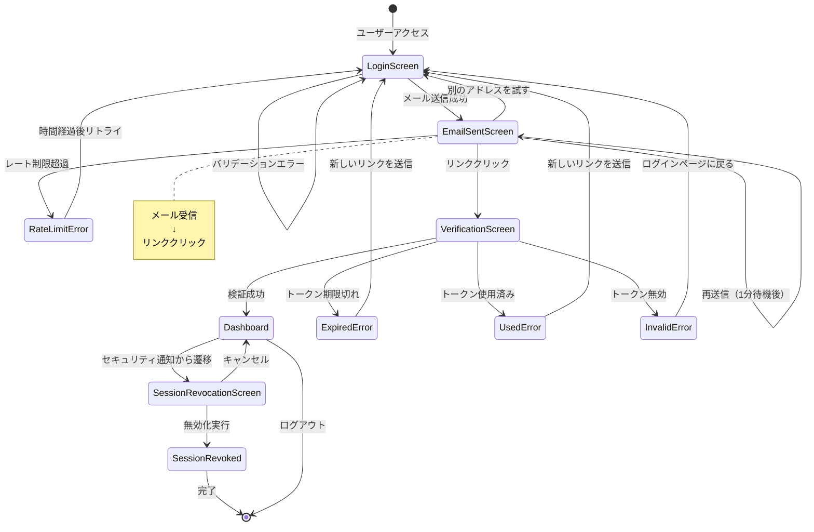

## Rules Mapping

| requirements.md 節 | 設計への反映箇所 |
|--------------------|------------------|
| §レート制限ルール | SecurityService / RATE_LIMIT_ERROR (429) / レート制限例外フロー |
| §トークンセキュリティ | TokenService: 256bit乱数・bcryptハッシュ・即時無効化 |
| §セッション管理ルール | SessionManager: HTTPOnly Cookie・Secure・SameSite=Strict |
| §権限マトリクス | Route Handler: 各エンドポイントの認証要否 / UseCase: 操作権限チェック |
| §画面遷移 | UI State Transitions / Router制御 |
| §セキュリティ通知ルール | EmailService.sendSecurityNotification() / opt ブロック（新規デバイス時） |

## Testing Strategy for This Feature

| Viewpoint | Level | Target |
|-----------|-------|--------|
| トークン生成・ハッシュ化 | Unit | TokenService.generateToken() |
| トークン検証（有効/期限切れ/使用済み/無効） | Unit | TokenService.verifyToken() |
| メール形式バリデーション | Unit | Zod Schema |
| レート制限ロジック | Unit | SecurityService.checkRateLimit() |
| マジックリンクリクエストAPI | Integration | POST /api/auth/magic-link + DB + EmailService mock |
| トークン検証API | Integration | GET /api/auth/verify + DB |
| セッション生成・Cookie設定 | Integration | GET /api/auth/verify → Session作成 |
| 完全な認証フロー | Browser (E2E) | メール入力 → リンククリック → ダッシュボード確認 |
| トークン期限切れシナリオ | Browser (E2E) | 15分後リンククリック → エラー画面確認 |
| セキュリティ通知・セッション無効化 | Browser (E2E) | 新規デバイスログイン → 通知確認 → 無効化 |

## 画面設計

### 画面ワイヤーフレーム（Mermaid図）

#### 1. ログイン画面 (Login Screen)

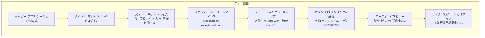

**レイアウト詳細**:
- 中央寄せレイアウト、最大幅480px
- 各要素間の余白: 16px
- フィールド高さ: 48px
- ボタン高さ: 48px

#### 2. メール送信確認画面 (Email Sent Screen)

```mermaid
graph TB
    subgraph "メール送信確認画面"
        Header[ヘッダー: アプリケーション名/ロゴ]
        SuccessIcon[アイコン: メール送信成功]
        Title[タイトル: メールを送信しました]
        Message[メッセージ: {email}宛にログインリンクを送信しました<br/>メールを確認してリンクをクリックしてください]
        ExpiryNote[注意書き: リンクは15分間有効です]
        Divider[区切り線]
        NoEmailTitle[サブタイトル: メールが届きませんか？]
        CheckSpam[案内: 迷惑メールフォルダも確認してください]
        ResendBtn[ボタン: 再送信<br/>状態: カウントダウン中は無効/1分後に有効化]
        Countdown[カウントダウン表示: 00:XX<br/>条件付き表示: 1分間のみ]
        TryAnotherLink[リンク: 別のメールアドレスを試す]

        Header --> SuccessIcon
        SuccessIcon --> Title
        Title --> Message
        Message --> ExpiryNote
        ExpiryNote --> Divider
        Divider --> NoEmailTitle
        NoEmailTitle --> CheckSpam
        CheckSpam --> ResendBtn
        ResendBtn --> Countdown
        Countdown --> TryAnotherLink
    end
```

#### 3. トークン検証画面 (Token Verification Screen)

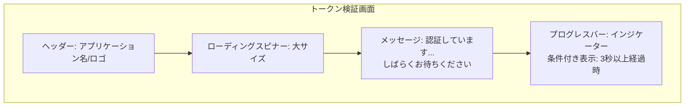

#### 4. エラー画面 (Error Screen)

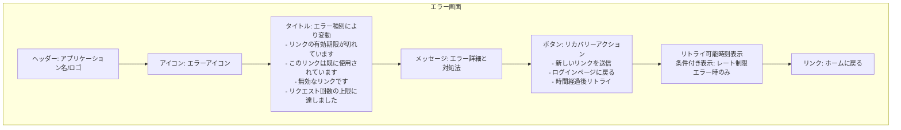

**エラー種別ごとの表示内容**:

| エラー種別 | タイトル | ボタンラベル | 追加表示 |
|-----------|---------|------------|---------|
| TOKEN_EXPIRED | リンクの有効期限が切れています | 新しいリンクを送信 | - |
| TOKEN_USED | このリンクは既に使用されています | 新しいリンクを送信 | - |
| TOKEN_INVALID | 無効なリンクです | ログインページに戻る | - |
| RATE_LIMIT | リクエスト回数の上限に達しました | - | 次回リクエスト可能時刻 |

#### 5. セッション無効化確認画面 (Session Revocation Screen)

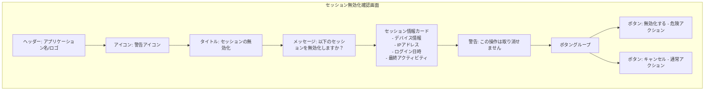

## エラーハンドリング

### エラー分類とコード体系

認証システムで発生する可能性のあるエラーを以下のように分類します:

1. **検証エラー (VALIDATION_ERROR)**
   - 無効なメールアドレス形式
   - 必須フィールドの欠落

2. **認証エラー (AUTH_ERROR)**
   - 期限切れトークン (TOKEN_EXPIRED)
   - 使用済みトークン (TOKEN_USED)
   - 無効なトークン (TOKEN_INVALID)
   - セッション期限切れ

3. **レート制限エラー (RATE_LIMIT_ERROR)**
   - IPベース: 1分あたり3回超過
   - メールベース: 1分あたり1回超過
   - 日次上限: 同一メール20回超過

4. **システムエラー (SYSTEM_ERROR)**
   - データベース接続エラー
   - メール送信サービスの障害
   - 内部サーバーエラー

### エラー処理戦略

- **ユーザー向けメッセージ**: 技術的詳細を含まない理解しやすいメッセージを表示
- **開発者向けログ**: 詳細なスタックトレースとコンテキスト情報を記録
- **リトライ可能性の提示**: エラー種類に応じて再試行ボタンや代替アクションを提供
- **フォールバック処理**: メール送信失敗時は再送信オプションを提供

## セキュリティ考慮事項

> **権限マトリクスの詳細は [requirements.md「権限マトリクス」セクション](./requirements.md#権限マトリクス) を参照**

1. **トークンのセキュリティ**
   - 暗号学的に安全な256ビットのランダムトークン生成
   - bcryptによるトークンのハッシュ化保存
   - 使用後の即座の無効化

2. **レート制限**
   - IPアドレスベース: 1分あたり3回まで
   - メールアドレスベース: 1分あたり1回まで
   - 1日あたりの上限: 同一メールで20回まで

3. **セッション管理**
   - HTTPOnly Cookieでのセッション管理
   - Secure フラグの設定（HTTPS環境）
   - SameSite属性によるCSRF対策

4. **権限制御**
   - ロールベースアクセス制御（RBAC）を採用
   - Guest / User / Admin / System の4階層
   - API各エンドポイントで権限チェックを実施

### データ保護戦略

- **個人情報の暗号化**: メールアドレスなどの個人情報は暗号化して保存
- **トークンの安全な保存**: ハッシュ化により、データベース漏洩時もトークンを保護
- **通信の暗号化**: HTTPS必須、TLS 1.2以上
- **ログのサニタイゼーション**: 個人情報やトークンをログに含めない

## パフォーマンス最適化

- **キャッシュ戦略**
  - Redisによるセッション情報のキャッシュ
  - レート制限カウンターのメモリキャッシュ
  - 静的アセットのCDN配信

- **データベース最適化**
  - 適切なインデックスによるクエリ高速化
  - 期限切れトークンの定期削除バッチ
  - コネクションプーリングの活用

- **非同期処理**
  - メール送信のキューイング
  - バックグラウンドでのセキュリティログ記録

## マイグレーション戦略

Prismaを使用しているため、通常のスキーマ変更は`prisma migrate dev`で自動処理されます。

### 特別なデータ移行が必要なケース

既存のパスワード認証システムからの移行時:
1. 既存ユーザーのメールアドレスを保持
2. パスワードフィールドを段階的に非推奨化
3. 移行期間中は両方の認証方式を並行運用
4. 全ユーザーの移行完了後、パスワード関連のコードを削除

## モニタリングと分析

- **収集するメトリクス**
  - マジックリンクのリクエスト数と成功率
  - トークンの有効期限切れ率
  - メール配信成功率
  - 平均認証完了時間

- **アラート設定**
  - メール送信失敗率が5%を超えた場合
  - 認証成功率が90%を下回った場合
  - レート制限エラーが急増した場合

## 実装上の注意点

### コード品質とセキュリティ

- トークン生成には必ず暗号学的に安全な乱数生成器を使用すること
- 環境変数で機密情報を管理し、ハードコーディングは絶対に避ける
- すべてのユーザー入力に対して適切なバリデーションとサニタイゼーションを実施
- エラーメッセージに機密情報や実装の詳細を含めない

### パフォーマンスとスケーラビリティ

- データベースクエリは必要最小限に抑え、N+1問題を回避
- 非同期処理を活用し、ユーザーの待ち時間を最小化
- キャッシュを適切に活用するが、セキュリティ情報のキャッシュは慎重に

### 保守性と拡張性

- 認証ロジックを独立したサービスとして実装し、疎結合を維持
- 設定値は環境変数やコンフィグファイルで管理し、変更を容易に
- ログは構造化形式で出力し、分析や監視を容易に
- テストカバレッジ80%以上を維持し、リグレッションを防止

## Related Documents

- requirements.md: `docs/einja/example/specs/issues/issue999-example-task/requirements.md`
- tasks.md: `docs/einja/example/specs/issues/issue999-example-task/tasks.md`
- qa-tests/: `docs/einja/example/specs/issues/issue999-example-task/qa-tests/`
- 参照steering: backend-architecture.md（4層アーキテクチャ）、testing-strategy.md（テストレベル判断）

## Related Skills / Subagents

### この機能で使用が想定されるサブエージェント

| サブエージェント | 用途 |
|----------------|------|
| [frontend-coder] | フォーム等のUI実装 |
| [backend-architect] | API・ドメインロジックの設計 |

### この機能で使用が想定されるSkill

| Skill | 用途 |
|-------|------|
| [steering:backend-architecture] | 4層アーキテクチャに従った実装 |
| [steering:testing-strategy] | テストレベルの判断 |
