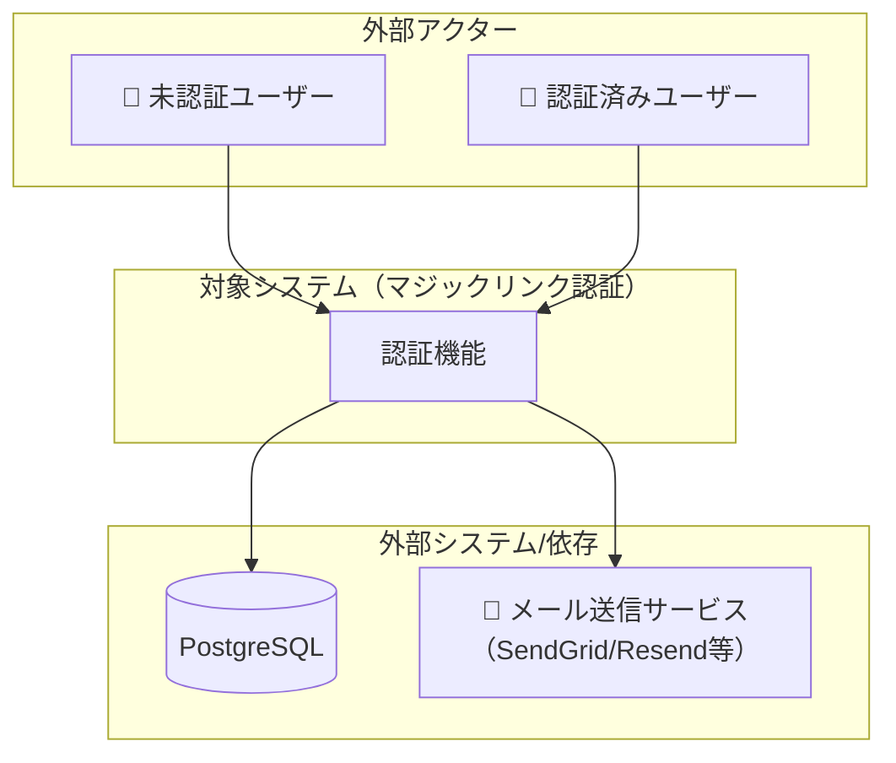
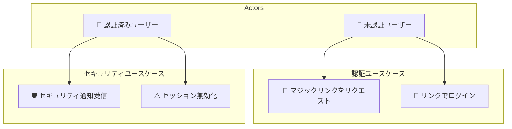
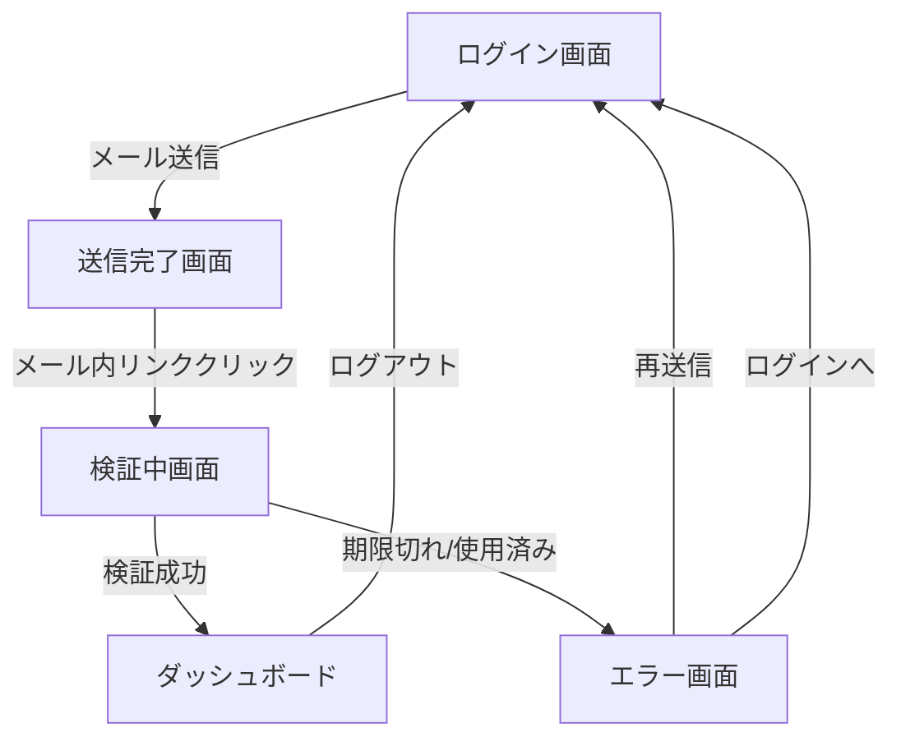
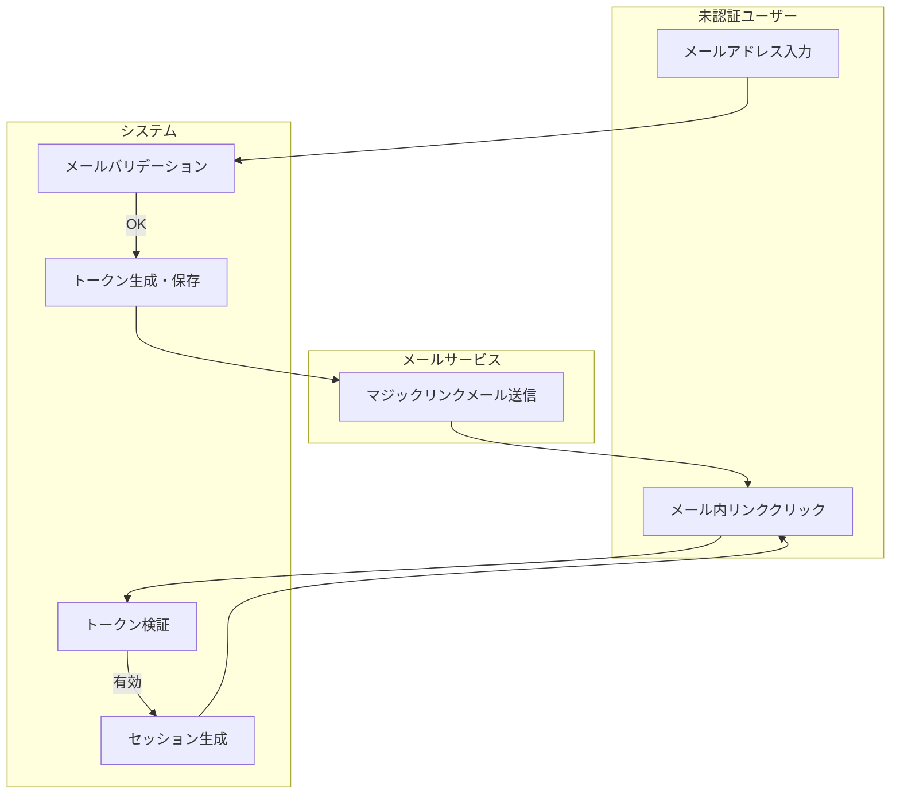
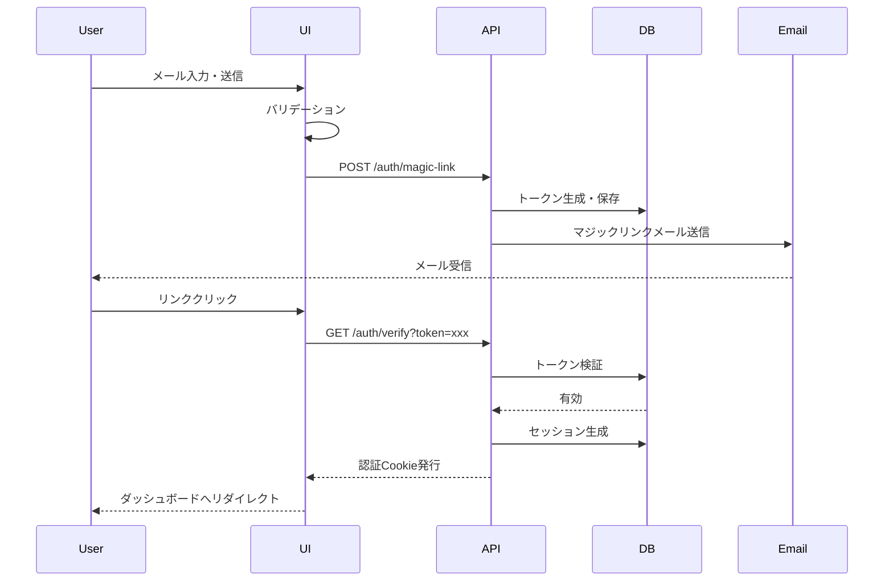
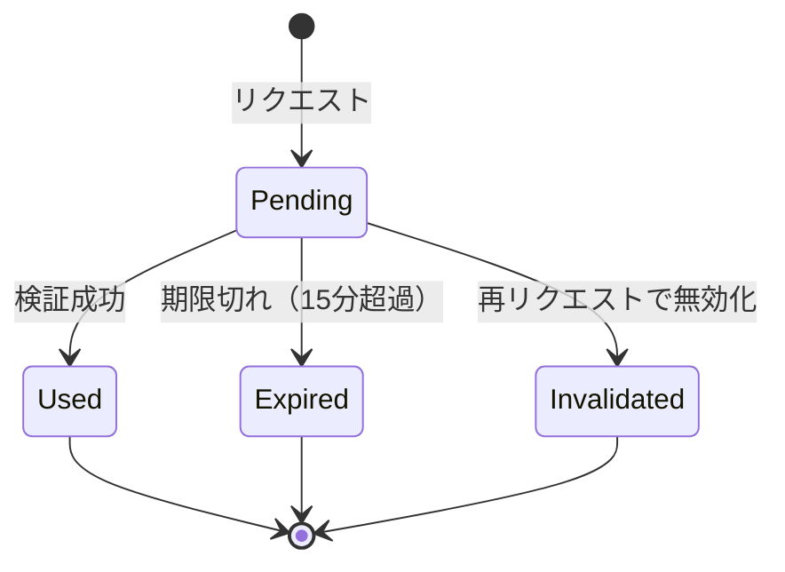
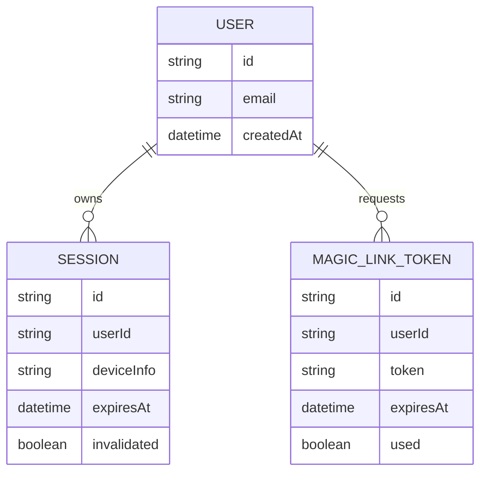

# マジックリンク認証機能 要件定義書

<!-- このファイルはissue999（マジックリンク認証）のサンプル仕様書です -->
<!-- QAエージェント（task-qa）は §4 AC一覧/AC詳細/§5〜§12 のルール系セクションを参照してテストシナリオを作成します -->
<!-- 図はMermaid記法を標準とする。C4記法は公式experimentalのため使用せず、graph TB + subgraph で表現する -->

## Sources

| ソース | 種別 | リンク / パス |
|--------|------|---------------|
| Asana | 要件 | [タスクURL] |
| Figma | デザイン | [Figma URL] |
| 実装 | 参照 | `apps/web/src/features/auth/` |
| 関連spec | 参照 | `docs/einja/example/specs/issues/issue999-example-task/` |
| QAテスト | 参照 | `docs/einja/example/specs/issues/issue999-example-task/qa-tests/` |

## 1. 目的・役割

- 機能の目的: パスワードレス認証を実現するマジックリンク機能を実装し、ユーザーのログイン体験を向上させる
- 対象ユーザー: 未認証ユーザー（マジックリンクリクエスト・認証）、認証済みユーザー（セキュリティ通知）
- ビジネス価値: パスワード管理の煩雑さによるユーザー離脱を減らし、セキュリティと満足度を向上させる

### 1.1 対象外

- SMS認証
- ソーシャルログイン連携
- 生体認証
- 既存パスワード認証の削除（並行運用期間中は維持）

### 1.2 スコープ境界 / コンテキスト（C4 Level 1相当）

本機能のスコープ境界と外部依存を示す。

### 1.3 主要ユースケース

## 2. 前提条件・制約

- データ前提: ユーザーがメールアドレスをシステムに登録済みであること（新規ユーザーは除く）
- ロール前提: 未認証ユーザーがマジックリンクをリクエストでき、認証済みユーザーがセキュリティ通知を受け取れる
- 外部依存: メール送信サービス（SendGrid）、Redis（トークン管理）、既存のユーザー管理システム
- ファイル制約: 既存の認証システムとの互換性を維持すること
- 業務制約: マジックリンクトークンの有効期限は15分。1ユーザーあたり同時に有効なトークンは1つまで

## 3. 画面構成・状態

### 3.1 画面構成

| エリア | 内容 |
|--------|------|
| ログイン画面 | メールアドレス入力フィールド、「ログインリンクを送信」ボタン、バリデーションエラー表示エリア、既存パスワードログインへのリンク |
| メール送信確認画面 | 送信完了メッセージ（送信先アドレス含む）、「再送信」ボタン（1分後に有効化）、「別のメールアドレスを試す」リンク |
| トークン検証画面 | 検証中インジケーター（ローディングスピナー）、検証状態メッセージ |
| エラー画面 | エラーメッセージ（種別ごと）、リカバリーアクションボタン（期限切れ/使用済み：再送信、無効トークン：ログインへ戻る、レート制限：次回可能時刻表示） |
| ダッシュボード通知バナー | 「新しいデバイスからのログインを検出しました」バナー、セッション無効化確認画面へのリンク |

### 3.2 状態パターン

| 状態 | 表示内容 |
|------|---------|
| 読み込み中 | ローディングスピナー |
| 通常表示（ログイン画面） | メールアドレス入力フィールドとボタン |
| 送信中 | ボタン無効化・スピナー表示 |
| 送信中（3秒超過） | 進捗メッセージ「メールを送信しています...」 |
| 送信成功 | メール送信確認画面に遷移 |
| トークン検証中 | スピナーと「認証しています...」メッセージ、ユーザー操作を防止 |
| 認証成功 | 「ログインしています...」メッセージ、3秒以内にダッシュボードへリダイレクト |
| バリデーションエラー | 入力フィールド赤枠 + フィールド下に赤文字エラーメッセージ |
| 認証エラー（期限切れ/使用済み/無効） | エラー画面表示、種別ごとのリカバリーボタン |
| レート制限 | エラー画面表示、次回リクエスト可能時刻表示 |

### 3.3 ローファイワイヤーフレーム参照

ローファイ段階のワイヤーフレームは `ui-design.pen` に配置する（Phase 1段階で作成）。

- ui-design.pen（lo-fi）: `./ui-design.pen` の `WF-S{Story#}-F{連番}` フレーム群を参照
- フレーム命名規則: `WF-S1-F01`, `WF-S1-F02`, `WF-S2-F01` ...（StoryとWFフレームを紐付け）

対象フレーム一覧:

| フレームID | 対応画面 |
|----------|--------|
| WF-S1-F01 | ログイン画面（メール入力フォーム） |
| WF-S1-F02 | 送信完了画面 |
| WF-S2-F01 | 検証中画面 |
| WF-S2-F02 | ダッシュボード |
| WF-S2-F03 | エラー画面 |
| WF-S3-F01 | ダッシュボード通知バナー |
| WF-S3-F02 | セッション無効化確認画面 |
| WF-COMMON-F01 | ローディング状態 |

※ issue999用の ui-design.pen は本サンプルでは作成しない（参照の説明のみ）。実運用ではui-design-generator（lo-fi mode）が作成する。

## 4. 受け入れ条件（Acceptance Criteria）

**構造方針**: ユーザーストーリー起点。各Storyの配下に「Story内AC一覧表（俯瞰）」→「AC詳細（シーン主軸）」の順で記述する。

- **AC詳細はシーン見出しで並べる**（カテゴリ別見出しにしない）。このフォーム画面のシーン: `初期表示 / 入力中 / 送信時 / 送信成功時 / 送信失敗時`、加えて「画面横断」を常設する。
  - シーンは固定enumではなく画面に応じて増減させる。**該当ACの無いシーンは省略**する（例: Story 1 には「入力中」シーンのACが無いため見出しを置かない）。
  - 「画面横断」は特定シーンに属さない**横断AC（PERM/性能/SEC 等）の受け皿**として常設する。
- **AC本文は「振る舞いの骨格」のみ**を書き、**バリデーション詳細（必須/形式/桁数/正規表現/タイミング/エラーメッセージ文言）は §6.2 へ委譲**する。AC本文からは `（→§6 VR-1-001）` の形式で §6.2 のVR行を参照する。
- **フィールド単位・規則単位でACを増やさない**。観測可能な結果（Then）が同じ異常系は1本のACに統合し、フィールド差・規則差は §6.2 のVR行で表現する。文言の正本（SSoT）は §6.2。

**AC ID命名規則**: `AC{Story番号}.{カテゴリ}.{N|E}.{連番3桁}`
- 例: `AC1.UI.N.001`, `AC1.VAL.E.001`, `AC2.ERR.E.001`
- カテゴリ（`UI / NAV / VAL / ERR / PERM / UX`）は **AC-IDと一覧表のカテゴリ列に残す**。**シーンはIDに入れず、見出しでのみ表現**する（1つのシーン見出しの配下に複数カテゴリのACが並んでよい）。
- `N` = 正常系 / `E` = 異常系
- 連番は各Story × カテゴリ × 区分（N/E）ごとに001から開始。**統合でACを削除した場合は欠番を許容**し、残ったACの連番はリナンバーしない（例: Story 1 では VAL系を `AC1.VAL.E.001` に統合し、`AC1.VAL.E.002`・`AC1.VAL.E.003` は欠番）。

**VR-ID命名規則**: §6.2 フィールド別ルールの各行に `VR-{Story番号}-{連番3桁}`（例: `VR-1-001`）を付与する。AC本文からは `（→§6 VR-1-001）` で参照する。

---

### Story 1: マジックリンクのリクエスト

**As a** 未認証ユーザー
**I want to** メールアドレスでマジックリンクをリクエストしたい
**So that** パスワード不要でログインできる

#### 前提条件・文脈

- 未認証状態でログイン画面にアクセスしている
- メールアドレスのみでリクエスト可能（パスワード不要）
- レート制限: 同一メールアドレスは1分あたり1回まで

#### 4.1.1 Story 1 AC一覧

| AC ID | カテゴリ | 区分 | 一文サマリ | 強度 | 検証レベル | 参照 |
|-------|---------|------|-----------|------|-----------|------|
| AC1.UI.N.001 | UI | 正常系 | 有効メール送信時の成功メッセージ表示 | MUST | Integration, Browser | §3, WF-S1-F01, WF-S1-F02 |
| AC1.UI.N.002 | UI | 正常系 | メールアドレスフィールドのフォーカス状態表示 | SHOULD | Browser | §3, WF-S1-F01 |
| AC1.NAV.N.001 | NAV | 正常系 | 送信成功後の確認画面遷移 | MUST | Browser | §8, WF-S1-F02 |
| AC1.UX.N.001 | UX | 正常系 | 送信ボタン無効化・スピナー（多重送信防止） | MUST | Browser | §3.2 |
| AC1.UX.N.002 | UX | 正常系 | 3秒以上で進捗メッセージ表示 | SHOULD | Browser | §3.2 |
| AC1.VAL.E.001 | VAL | 異常系 | 必須未入力・形式不正で送信が阻止されエラー表示 | MUST | Unit, Browser | §6 VR-1-001, VR-1-002 |
| AC1.ERR.E.001 | ERR | 異常系 | レート制限エラー | MUST | Integration | §10 |

<!-- 旧 AC1.VAL.E.002（空欄必須）・AC1.VAL.E.003（不正形式）は AC1.VAL.E.001 に統合した。3件はいずれも Then が「送信が阻止されフィールド直下にエラー表示」で同一のため。フィールド差・規則差・エラーメッセージ文言は §6.2 のVR行（VR-1-001 空欄 / VR-1-002 形式）で表現する。欠番（E.002, E.003）は許容しリナンバーしない。 -->
<!-- 対して Story 2 のトークン異常系（期限切れ/使用済み/無効）は recovery導線や検証レベルが異なり Then が同一でないため統合しない（→ Story 2 参照）。 -->

#### 4.1.2 Story 1 AC詳細

<!-- 見出しはシーン単位（カテゴリ別見出しにしない）。AC-IDのカテゴリ(UI/NAV/VAL/ERR/UX)はIDに残し、1シーン見出しの配下に複数カテゴリのACが並んでよい。該当ACの無いシーン（このStoryでは「入力中」）は省略する。 -->
<!-- バリデーション詳細（必須/形式/タイミング/エラーメッセージ文言）はAC本文に書かず、§6.2のVR-ID行へ委譲し（→§6 VR-1-001）で参照する。 -->

##### 初期表示

###### AC1.UI.N.002 [SHOULD]

メールアドレスフィールドにフォーカスすると、視覚的にフォーカス状態を示す（→§3 画面構成・状態、[参照: WF-S1-F01]）

- Given: ログイン画面を表示している
- When: メールアドレスフィールドにフォーカス
- Then: フィールドが視覚的にフォーカス状態を示す（枠線の色変化など）
- 検証レベル: Browser

##### 送信時

###### AC1.UX.N.001 [MUST]

送信ボタンクリック後、ボタンが無効化されローディングスピナーが表示される（→§3.2 状態パターン）

- Given: 有効なメールアドレスを入力している
- When: 送信ボタンをクリック
- Then: ボタンが無効化され、ローディングスピナーが表示される
- 検証レベル: Browser

###### AC1.UX.N.002 [SHOULD]

API実行が3秒以上かかると、進捗メッセージが表示される（→§3.2 状態パターン）

- Given: メール送信API実行中
- When: 3秒以上経過
- Then: 「メールを送信しています...」のメッセージが表示される
- 検証レベル: Browser

###### AC1.VAL.E.001 [MUST]

必須未入力・形式不正のいずれの場合も、送信が阻止されフィールド直下にエラーが表示される（→§6 VR-1-001, VR-1-002）

- Given: ログイン画面を表示している
- When: メールアドレスを未入力のまま、または不正な形式（例: "test@"）で送信ボタンをクリック
- Then: 送信が阻止され、フィールド直下にエラーメッセージが表示され、フィールドが赤枠になる
- 検証レベル: Unit, Browser

<!-- 旧 AC1.VAL.E.002（空欄必須）・AC1.VAL.E.003（不正形式）を本ACに統合。3件とも Then が「送信阻止＋フィールド直下エラー表示」で同一のため1本に集約した。フィールドごとの必須/形式条件とエラーメッセージ文言（「メールアドレスを入力してください」/「有効なメールアドレスを入力してください」）は §6.2 のVR行（VR-1-001 / VR-1-002）が正本。AC本文には文言を書かない。 -->

##### 送信成功時

###### AC1.UI.N.001 [MUST]

有効なメールアドレスで送信すると、成功メッセージが表示されメールが送信される（→§3 画面構成・状態、[参照: WF-S1-F01], [参照: WF-S1-F02]）

- Given: 未認証ユーザーがログイン画面を表示している
- When: 有効なメールアドレスを入力して送信ボタンをクリック
- Then: 送信完了画面に遷移し、「メールを送信しました」メッセージが表示される
- And: 指定したメールアドレスにマジックリンクメールが送信される
- 検証レベル: Integration, Browser

###### AC1.NAV.N.001 [MUST]

メール送信成功後、確認画面に遷移し送信先アドレスが表示される（→§8 画面遷移、[参照: WF-S1-F02]）

- Given: 有効なメールアドレスを入力して送信した
- When: API応答受信
- Then: メール送信確認画面に遷移し、送信先アドレスが表示される
- 検証レベル: Browser

##### 送信失敗時

###### AC1.ERR.E.001 [MUST]

1分以内の再リクエストでレート制限エラーが表示される（→§10 処理フロー）

- Given: マジックリンクをリクエスト済み
- When: 1分以内に再度リクエスト
- Then: レート制限エラーが表示される（HTTPステータス429、次回リクエスト可能時刻を通知）
- 検証レベル: Integration

##### 画面横断

<!-- 特定シーンに属さない横断AC（PERM/性能/SEC 等）をここに集約する。常設見出し。本Storyでは該当する横断ACが無いため項目は空だが、見出しは省略せず常設してオーファン化を防ぐ。 -->

（このStoryには画面横断のACなし）

---

### Story 2: マジックリンクによる認証

**As a** 未認証ユーザー
**I want to** 受信したマジックリンクをクリックしてログインしたい
**So that** パスワード不要で安全にサービスを利用できる

#### 前提条件・文脈

- 有効なマジックリンクをメールで受信している
- マジックリンクのトークン有効期限は15分
- 1つのトークンは1回のみ使用可能（使用後は即座に無効化）

#### 4.2.1 Story 2 AC一覧

| AC ID | カテゴリ | 区分 | 一文サマリ | 強度 | 検証レベル | 参照 |
|-------|---------|------|-----------|------|-----------|------|
| AC2.UI.N.001 | UI | 正常系 | エラー画面からの再送信時のメールアドレスプリフィル | MUST | Browser | §3, WF-S2-F03 |
| AC2.NAV.N.001 | NAV | 正常系 | 有効リンクで自動ログインしダッシュボードへリダイレクト | MUST | Integration | §8, WF-S2-F02 |
| AC2.NAV.N.002 | NAV | 正常系 | 検証成功後3秒以内のダッシュボードリダイレクト | MUST | Browser | §8, WF-S2-F01, WF-S2-F02 |
| AC2.UX.N.001 | UX | 正常系 | 検証画面でのローディングスピナー | MUST | Browser | §3.2, WF-S2-F01 |
| AC2.UX.N.002 | UX | 正常系 | トークン検証中のユーザー操作防止 | MUST | Browser | §3.2 |
| AC2.ERR.E.001 | ERR | 異常系 | 期限切れリンクエラーと再送信オプション | MUST | Integration | §10 |
| AC2.ERR.E.002 | ERR | 異常系 | 使用済みリンクエラー | MUST | Integration | §10 |
| AC2.ERR.E.003 | ERR | 異常系 | 期限切れトークンで再送信ボタン表示 | MUST | Browser | §3, WF-S2-F03 |
| AC2.ERR.E.004 | ERR | 異常系 | 使用済みトークンで再送信ボタン表示 | MUST | Browser | §3, WF-S2-F03 |
| AC2.ERR.E.005 | ERR | 異常系 | 無効トークンでログインページへの導線表示 | MUST | Browser | §3, WF-S2-F03 |

#### 4.2.2 Story 2 AC詳細

<!-- 見出しはシーン単位。このStoryはトークン検証フローのため、フォーム送信系ではなく「検証中（初期表示）/ 検証成功時 / 検証失敗時 / 画面横断」のシーン構成を取る（シーン語彙は画面性質で増減する好例）。該当ACの無いシーンは省略する。 -->
<!-- 【統合しない判断の見本】トークン異常系（期限切れ/使用済み/無効）は AC を統合していない。理由: 検証レベルが異なり（Integration vs Browser）、無効トークンは recovery導線が「ログインページに戻る」で他と異なるなど、Then（観測可能な結果）が同一でないため。Then が同一の VAL系（Story 1）のみを統合し、Then が異なる異常系は分けたまま残す。 -->

##### 検証中（初期表示）

###### AC2.UX.N.001 [MUST]

マジックリンククリック後、検証画面でローディングスピナーが表示される（→§3.2 状態パターン、[参照: WF-S2-F01]）

- Given: マジックリンクをクリック
- When: トークン検証画面に遷移
- Then: ローディングスピナーと「認証しています...」のメッセージが表示される
- 検証レベル: Browser

###### AC2.UX.N.002 [MUST]

トークン検証中はユーザー操作が防止される（→§3.2 状態パターン）

- Given: トークン検証実行中
- When: 検証処理が進行中
- Then: ユーザー操作（戻る、リロードなど）を防ぐ仕組みが作動する
- 検証レベル: Browser

##### 検証成功時

###### AC2.NAV.N.001 [MUST]

有効なマジックリンクをクリックすると、自動ログインしダッシュボードへリダイレクトする（→§8 画面遷移、[参照: WF-S2-F02]）

- Given: 有効なマジックリンクを受信した
- When: リンクをクリック
- Then: 自動的にログインされ、ダッシュボードへリダイレクト
- 検証レベル: Integration

###### AC2.NAV.N.002 [MUST]

トークン検証成功後、3秒以内にダッシュボードへリダイレクトする（→§8 画面遷移、[参照: WF-S2-F01], [参照: WF-S2-F02]）

- Given: トークン検証成功
- When: 認証完了
- Then: 「ログインしています...」のメッセージが表示され、3秒以内にダッシュボードへリダイレクト
- 検証レベル: Browser

##### 検証失敗時

<!-- 期限切れ/使用済みは「エラー画面＋再送信ボタン」、無効は「エラー画面＋ログインへ戻る」と recovery導線が異なる。さらに API契約（Integration）と画面挙動（Browser）で検証レベルが分かれるため、Then が同一でなく統合しない。文言（種別ごとのメッセージ）は本文に残してよいが、フォーム入力のバリデーション文言ではない点に注意（§6.2 はフォーム入力ルールの正本）。 -->

###### AC2.ERR.E.001 [MUST]

期限切れのリンクをクリックすると、期限切れエラーと再送信オプションが表示される（→§10 処理フロー）

- Given: 期限切れのリンクを受信した
- When: リンクをクリック
- Then: 期限切れエラーが表示され、再送信オプションが提示される
- 検証レベル: Integration

###### AC2.ERR.E.002 [MUST]

使用済みのリンクを再クリックすると、使用済みエラーが表示される（→§10 処理フロー）

- Given: 既に使用済みのリンクを受信した
- When: 再度リンクをクリック
- Then: 使用済みエラーが表示される
- 検証レベル: Integration

###### AC2.ERR.E.003 [MUST]

期限切れトークンの場合、エラー画面で再送信ボタンが表示される（→§3 画面構成・状態、[参照: WF-S2-F03]）

- Given: トークンが期限切れ
- When: 検証失敗
- Then: エラー画面に遷移し、「リンクの有効期限が切れています」とメッセージ表示、「新しいリンクを送信」ボタンを表示
- 検証レベル: Browser

###### AC2.ERR.E.004 [MUST]

使用済みトークンの場合、エラー画面で再送信ボタンが表示される（→§3 画面構成・状態、[参照: WF-S2-F03]）

- Given: トークンが使用済み
- When: 検証失敗
- Then: エラー画面に遷移し、「このリンクは既に使用されています」とメッセージ表示、「新しいリンクを送信」ボタンを表示
- 検証レベル: Browser

###### AC2.ERR.E.005 [MUST]

無効なトークンの場合、エラー画面でログインページへの導線が表示される（→§3 画面構成・状態、[参照: WF-S2-F03]）

- Given: トークンが無効
- When: 検証失敗
- Then: エラー画面に遷移し、「無効なリンクです」とメッセージ表示、「ログインページに戻る」ボタンを表示
- 検証レベル: Browser

###### AC2.UI.N.001 [MUST]

エラー画面から新しいリンクを送信すると、前回のメールアドレスがプリフィルされる（→§3 画面構成・状態、[参照: WF-S2-F03]）

- Given: エラー画面で「新しいリンクを送信」ボタンをクリック
- When: ボタン押下
- Then: ログイン画面に遷移し、前回使用したメールアドレスがプリフィルされる
- 検証レベル: Browser

##### 画面横断

<!-- 特定シーンに属さない横断AC（PERM/性能/SEC 等）をここに集約する常設見出し。本Storyでは該当する横断ACが無い。 -->

（このStoryには画面横断のACなし）

---

### Story 3: セキュリティ通知

**As a** 認証済みユーザー
**I want to** 新しいデバイスからのログインを通知で知りたい
**So that** 不正アクセスを検知・ブロックできる

#### 前提条件・文脈

- 認証済みユーザーがログイン後のダッシュボードを閲覧している
- 新規デバイスからのログインを検知した場合にセキュリティ通知が発行される
- セキュリティ通知メールには2種類のリンクがあり、起点と結果が異なる:
  - **「アクティビティを確認」リンク** → 確認画面に遷移し、内容を確認してから無効化/キャンセルを選べる（慎重操作。AC3.NAV.N.001 → AC3.UI.N.004 / AC3.NAV.N.002）
  - **「このログインに心当たりがない → 今すぐ保護」リンク** → 確認画面を介さずワンクリックでセッションを即時無効化する（緊急操作。AC3.UI.N.002）

#### 4.3.1 Story 3 AC一覧

| AC ID | カテゴリ | 区分 | 一文サマリ | 強度 | 検証レベル | 参照 |
|-------|---------|------|-----------|------|-----------|------|
| AC3.UI.N.001 | UI | 正常系 | 新規デバイスログイン時のセキュリティ通知メール送信 | MUST | Integration | §10 |
| AC3.UI.N.002 | UI | 正常系 | メールの「今すぐ保護」リンクからワンクリックでセッション無効化 | MUST | Integration | §10 |
| AC3.UI.N.003 | UI | 正常系 | 新規デバイスログイン後のダッシュボード通知バナー | MUST | Browser | §3, WF-S3-F01 |
| AC3.UI.N.004 | UI | 正常系 | 確認画面で「無効化する」クリックで無効化実行 | MUST | Browser | §3, WF-S3-F02 |
| AC3.NAV.N.001 | NAV | 正常系 | メールの「アクティビティを確認」リンクからセッション無効化確認画面へ遷移 | MUST | Browser | §8, WF-S3-F02 |
| AC3.NAV.N.002 | NAV | 正常系 | 確認画面で「キャンセル」クリックでセッション維持 | MUST | Browser | §8, WF-S3-F02 |

#### 4.3.2 Story 3 AC詳細

<!-- 見出しはシーン単位。このStoryはセキュリティ通知フローのため、フォーム送信系ではなく「初期表示（ダッシュボード）/ 無効化確認時 / 無効化実行時 / 画面横断」のシーン構成を取る。全ACが正常系で Then が互いに異なるため統合対象は無い。 -->
<!-- 配置の指針: メールの「アクティビティを確認」リンク起点の確認画面フロー（NAV.N.001 → UI.N.004 / NAV.N.002）はBrowser検証のため画面シーンに置く。一方、メールの「今すぐ保護」リンク起点のワンクリック即時無効化（UI.N.002）は確認画面を介さずメール経由でサーバ側が即時処理する横断的振る舞い（Integration検証）のため、画面シーンではなく「画面横断」に置く。両者は起点リンクが異なるため矛盾しない。 -->

##### 初期表示（ダッシュボード）

###### AC3.UI.N.003 [MUST]

新規デバイスログイン後、ダッシュボードに通知バナーが表示される（→§3 画面構成・状態、[参照: WF-S3-F01]）

- Given: 新規デバイスからログイン成功
- When: ダッシュボード表示
- Then: 「新しいデバイスからのログインを検出しました」の通知バナーが表示される
- 検証レベル: Browser

##### 無効化確認時

###### AC3.NAV.N.001 [MUST]

セキュリティ通知メールの「アクティビティを確認」リンクからセッション無効化の確認画面が表示される（→§8 画面遷移、[参照: WF-S3-F02]）

- Given: セキュリティ通知メールを受信している
- When: メール内の「アクティビティを確認」リンクをクリック
- Then: 確認画面が表示され、「このセッションを無効化しますか？」のメッセージと「無効化する」「キャンセル」ボタンが表示される
- 検証レベル: Browser

##### 無効化実行時

###### AC3.UI.N.004 [MUST]

確認画面で「無効化する」をクリックすると、セッションが無効化される（→§3 画面構成・状態、[参照: WF-S3-F02]）

- Given: セッション無効化確認画面を表示している
- When: 「無効化する」ボタンをクリック
- Then: セッションが無効化され、「セッションを無効化しました」の成功メッセージが表示される
- 検証レベル: Browser

###### AC3.NAV.N.002 [MUST]

確認画面で「キャンセル」をクリックすると、セッションは維持される（→§8 画面遷移、[参照: WF-S3-F02]）

- Given: セッション無効化確認画面を表示している
- When: 「キャンセル」ボタンをクリック
- Then: 元の画面に戻り、セッションは維持される
- 検証レベル: Browser

##### 画面横断

<!-- 特定シーンに属さない横断AC（PERM/性能/SEC 等）をここに集約する常設見出し。ここでは「画面に紐づかないシステム側のイベント（通知メール送信）」や「確認画面を介さずメール経由でサーバ側が即時処理する横断的振る舞い（ワンクリック即時無効化）」を横断ACとして配置している。 -->

###### AC3.UI.N.001 [MUST]

新しいデバイスからログイン成功時、セキュリティ通知メールが送信される（→§10 処理フロー）

- Given: 新しいデバイスからマジックリンクでログイン
- When: 認証が成功
- Then: セキュリティ通知メールが送信される
- 検証レベル: Integration

###### AC3.UI.N.002 [MUST]

セキュリティ通知メールの「今すぐ保護」リンクから、確認画面を介さずワンクリックでセッションを即時無効化できる（→§10 処理フロー）

- Given: セキュリティ通知メールを受信しており、身に覚えのないログインだと判断した
- When: メール内の「このログインに心当たりがない → 今すぐ保護」リンクをクリック
- Then: 確認画面を介さず、ワンクリックでサーバ側がセッションを即時無効化する
- 検証レベル: Integration

## 5. 表示・計算ルール

| 項目 | ルール | 備考 |
|------|--------|------|
| 送信先メールアドレス | 送信完了画面で送信先アドレスを表示 | 読み取り専用 |
| カウントダウン表示 | 再送信ボタンは1分間のカウントダウン表示後に有効化 | 秒単位で表示 |
| 次回リクエスト可能時刻 | レート制限時に `Retry-After` ヘッダーの値から算出して表示 | 「あとX分後にお試しください」形式 |
| リダイレクトカウントダウン | 認証成功後に「ログインしています...」を表示し3秒以内にリダイレクト | 明示的なカウント表示は任意 |

## 6. 入力ルール

### 6.1 共通ルール

- 送信タイミング: フォーカスアウト時またはボタンクリック時にバリデーションを実行（リアルタイムバリデーションなし）
- 正規化: メールアドレスの前後の空白はトリミングする
- 多重送信防止: 送信ボタンはクリック後、API応答まで無効化（disabled状態）
- 未保存離脱確認: 不要（入力はメールアドレスのみ）

### 6.2 フィールド別ルール

<!-- ここがバリデーション詳細とエラーメッセージ文言の正本（SSoT）。§4のAC本文にはバリデーション詳細を書かず、各行のVR-IDへ委譲し（→§6 VR-xxx）で参照する。 -->
<!-- VR-IDは VR-{Story番号}-{連番3桁}（例: VR-1-001）。AC1.VAL.E.001（統合AC）は本表の VR-1-001・VR-1-002 を参照する。 -->

| VR-ID | フィールド | 必須 | バリデーション | タイミング | エラーメッセージ |
|-------|-----------|------|--------------|----------|-----------------|
| VR-1-001 | メールアドレス | ○ | 空欄チェック | ボタンクリック時 | 「メールアドレスを入力してください」 |
| VR-1-002 | メールアドレス | ○ | RFC5322準拠の形式チェック | フォーカスアウト時、ボタンクリック時 | 「有効なメールアドレスを入力してください」 |

## 7. 権限マトリクス

### ロール定義

| ロール | 説明 | アクセスレベル |
|--------|------|--------------|
| 未認証ユーザー (Guest) | ログインしていない状態 | 公開ページのみ |
| 一般ユーザー (User) | 認証済みの一般ユーザー | 自身のデータのみ |
| 管理者 (Admin) | システム管理権限を持つユーザー | 全データ + 管理機能 |
| システム (System) | 自動処理・バックグラウンド処理 | 内部処理専用 |

### 操作可否表

| 操作 | Guest | User | Admin | System |
|------|:-----:|:----:|:-----:|:------:|
| マジックリンクリクエスト | ✅ | ✅ | ✅ | ❌ |
| リンク再送信 | ✅ | ✅ | ✅ | ❌ |
| トークン検証 | ✅ | ✅ | ✅ | ✅ |
| ログアウト | ❌ | ✅ | ✅ | ❌ |
| セッション情報取得 | ❌ | ✅(自身のみ) | ✅(全て) | ✅ |
| セッション無効化 | ❌ | ✅(自身のみ) | ✅(全て) | ✅ |
| セキュリティ通知受信 | ❌ | ✅ | ✅ | ❌ |
| ログイン履歴確認 | ❌ | ✅(自身のみ) | ✅(全て) | ❌ |
| ユーザーセッション強制終了 | ❌ | ❌ | ✅ | ✅ |
| 認証ログ監視 | ❌ | ❌ | ✅ | ✅ |
| レート制限設定変更 | ❌ | ❌ | ✅ | ❌ |

### アクセス制御ルール

1. **認証前アクセス**
   - ログインページ、マジックリンクリクエストAPIは全員アクセス可能
   - トークン検証APIは有効なトークンがあれば誰でも利用可能

2. **認証後アクセス**
   - ダッシュボード、プロフィールは認証必須
   - 自身のセッション・履歴のみ閲覧・操作可能

3. **管理者アクセス**
   - 全ユーザーのセッション管理が可能
   - 認証ログの閲覧・分析が可能
   - システム設定の変更が可能

## 8. 画面遷移

### 8.1 画面遷移表

| 操作 | 遷移先 / 結果 | 備考 |
|------|--------------|------|
| メールアドレス入力・送信（バリデーション成功） | 送信完了画面 | API成功後 |
| バリデーション失敗 | ログイン画面（エラー表示） | 画面遷移なし |
| 再送信ボタンクリック（レート制限内） | 送信完了画面（再表示） | 1分後に有効化 |
| 再送信ボタンクリック（レート制限超過） | エラー画面（レート制限） | 次回可能時刻表示 |
| メール内マジックリンクをクリック | トークン検証画面 | 自動検証開始 |
| トークン検証成功 | ダッシュボード（3秒以内） | 「ログインしています...」表示後 |
| トークン検証失敗（期限切れ） | エラー画面（期限切れ） | 「新しいリンクを送信」ボタン表示 |
| トークン検証失敗（使用済み） | エラー画面（使用済み） | 「新しいリンクを送信」ボタン表示 |
| トークン検証失敗（無効） | エラー画面（無効） | 「ログインページに戻る」ボタン表示 |
| エラー画面から「新しいリンクを送信」 | ログイン画面（メールプリフィル） | 前回メールアドレスが自動入力 |
| セキュリティ通知メール内「アクティビティを確認」リンクをクリック | セッション無効化確認画面 | 慎重操作（AC3.NAV.N.001） |
| セキュリティ通知メール内「今すぐ保護」リンクをクリック | 即時無効化（確認画面を介さず）→ 結果メッセージ | 緊急操作（AC3.UI.N.002） |
| セッション無効化確認画面で「無効化する」 | 成功メッセージ表示 | セッション無効化済み |
| セッション無効化確認画面で「キャンセル」 | 元の画面 | セッション維持 |
| ログアウト | ログイン画面 | - |

### 8.2 画面遷移図

## 9. 業務フロー（AS-IS / TO-BE）

### 9.1 TO-BE 業務フロー（スイムレーン）

## 10. 処理フロー

### 10.1 主要フロー

### 10.2 例外フロー

- トークン期限切れ時: API が 401 を返し、UI はエラー画面（期限切れ）に遷移。「新しいリンクを送信」ボタンを表示
- トークン使用済み時: API が 401 を返し、UI はエラー画面（使用済み）に遷移。「新しいリンクを送信」ボタンを表示
- 無効トークン時: API が 400 を返し、UI はエラー画面（無効）に遷移。「ログインページに戻る」ボタンを表示
- レート制限超過時: API が 429 + `Retry-After` ヘッダーを返し、UI はエラー画面（レート制限）に遷移
- メール送信失敗時: API が 500 を返し、UI はエラーメッセージを表示。リトライを案内

## 11. 状態遷移

## 12. 概念データモデル

## 13. 非機能要件

### パフォーマンス

- APIレスポンス: マジックリンク生成 100ms以内、トークン検証 50ms以内
- メール送信: 3秒以内
- 初期表示: 特段の制約なし

### セキュリティ（脅威モデリング）

- 認証: 暗号学的に安全な256ビットのランダムトークン（Base64URLエンコード形式で43文字）
- 認可: トークンはデータベースにハッシュ化して保存（bcrypt使用）。1ユーザーあたり同時に有効なトークンは1つまで
- 入力検証: トークンの有効期限は15分。使用済みトークンの即座の無効化。レート制限（同一IPアドレス: 1分あたり3回まで、同一メールアドレス: 1分あたり1回まで）
- メールセキュリティ: SPF、DKIM、DMARCの設定必須。リンクはHTTPS必須

#### 脅威モデリング（識別と対策）

本機能はマジックリンクのリクエスト・認証（外部入力: email / token）、セキュリティ通知（認証）、管理者によるセッション強制終了（特権操作）を含むため、以下の脅威観点を識別する。

| トリガー | 脅威観点 | この機能での該当性 | 対策 |
|---------|---------|------------------|------|
| 外部入力（email / token） | 危険シンク: SQLインジェクション | email / token はDB保存・参照のみ | パラメタライズドクエリ（ORM経由）で対策。文字列連結によるクエリ生成は行わない |
| 外部入力（email / token） | 危険シンク: HTML / コマンドインジェクション | 該当なし（HTMLレンダリング・OSコマンド実行のsinkなし） | メール本文のユーザー入力はエスケープ。外部入力をシェル・テンプレートに渡さない |
| 外部入力（email / token） | SSRF | 該当なし（外部入力由来のURLをサーバーがfetchする処理なし） | リンクは自サービスのドメインのみ。任意URLへのサーバー側リクエストは発生しない |
| 認証・権限 | 認可境界（IDOR） | リセット/認証トークンは発行対象ユーザー本人のみ有効 | トークンはハッシュ照合で本人に紐づくものだけを受理。他ユーザーのリソースIDを指定しても操作不可 |
| 認証・権限 | 権限昇格 | セッション強制終了は管理者ロールのみ（§7 権限マトリクス） | RBACで操作可否を判定。一般ユーザーは管理操作のエンドポイントにアクセス不可 |
| 認証・権限 | secrets露出 | リセットトークン・セッショントークンが平文露出するリスク | トークンはハッシュ化して保存。ログ・レスポンスボディ・エラーメッセージに平文トークンを出力しない。トークン総当たり対策にレート制限（上記） |
| 特権操作 | privilege scope（最小権限） | 管理者によるセッション強制終了は対象を限定すべき特権操作 | 最小権限で実行。対象ユーザー・操作種別・実行者を監査ログに記録（§13 可観測性） |
| 特権操作 | control-plane露出 | 管理機能が一般ユーザーに露出するリスク | 管理機能（セッション強制終了等）は一般ユーザーに非公開。管理エンドポイントは認可で保護 |

### 可観測性

- 監査ログ: 認証成功・失敗・トークン生成・使用・期限切れのイベントを記録
- エラーログ: メール送信失敗、レート制限超過、無効トークンアクセスを記録

### 可用性

- 99.9%以上のアップタイム
- メール配信成功率: 99%以上

## 14. 実装参考情報

### 推奨Skill/サブエージェント

| 対象領域 | 推奨 | 理由 |
|---------|------|------|
| UI実装 | [frontend-coder] | フォーム画面の実装あり |
| バックエンド設計 | [backend-architect] | API・ドメインロジックの設計 |
| テスト戦略 | [steering:testing-strategy] | テストレベルの判断 |

### 参考リソース

- 参考steering: backend-architecture.md（4層アーキテクチャ）
- 参考steering: testing-strategy.md（テスト戦略）

### 認証トークン仕様

- 暗号学的に安全な256ビットのランダムトークン
- Base64URLエンコード形式で43文字
- トークンはデータベースにハッシュ化して保存（bcrypt使用）
- 1ユーザーあたり同時に有効なトークンは1つまで

**OK例**:
- `AbC123XyZ_0987654321qWeRtYuIoP-asdfghjklZXCV` - 有効な43文字のBase64URL形式

**NG例**:
- `short123` - 長さ不足（43文字未満）
- `invalid/token+with=special*chars` - 許可されない特殊文字を含む

### メール送信仕様

- 件名: 「[サービス名] ログインリンクのお知らせ」
- 送信元: `noreply@example.com`
- HTMLとテキストの両形式で送信（マルチパート）
- リンクの有効期限を明記（15分）
- セキュリティ警告文を含める
