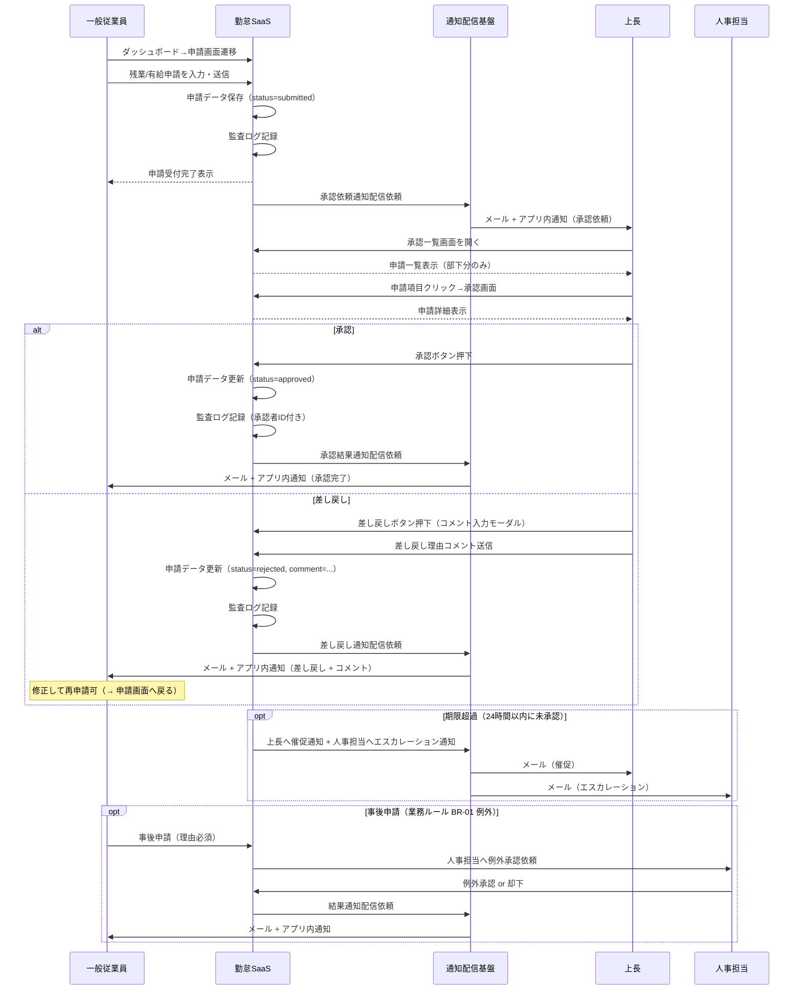
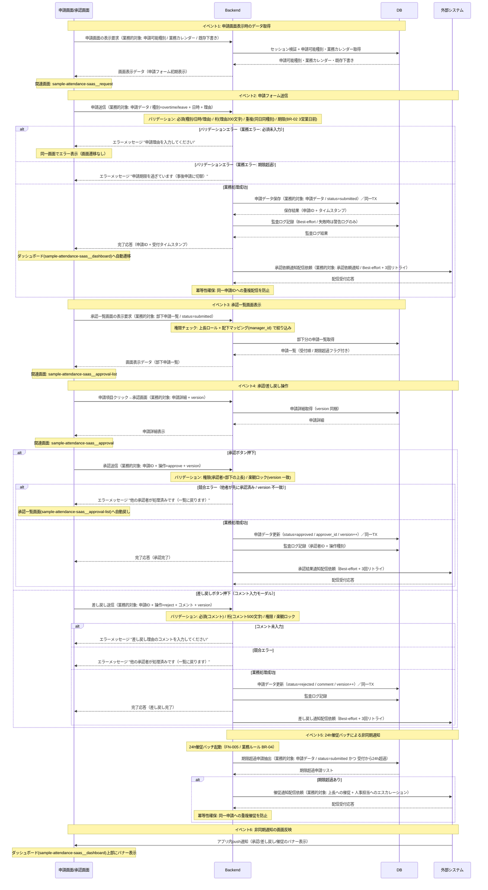
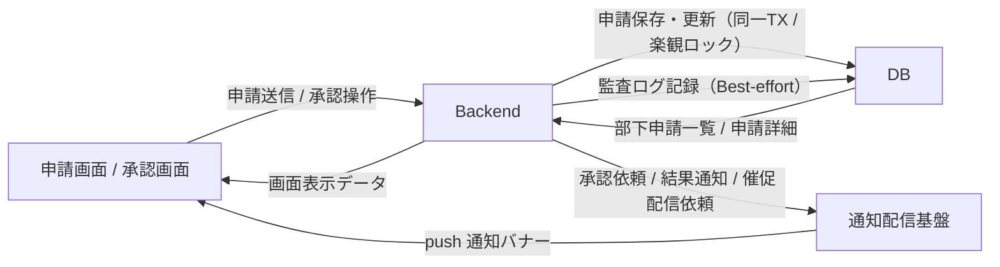

<!--
本ファイルは einja-project-function-spec Skill の動作確認用サンプル（業務フロー機能仕様: §2.1 業務観点 + §2.2 システム観点）です。
本来の出力先は docs/project/function-specs/function-spec-{flow_id}.md（1リポジトリ1プロジェクト前提）。
einja-project-function-spec Skill により生成される機能仕様書の実例として配置しています。

- 入力サンプル1: ../requirements.md（§2.1.2 TO-BE 業務フロー / §6 機能要件サマリ）
- 入力サンプル2: ../screen-flow-url.md（stable_id 参照キー）
- Skill 定義: .claude/skills/einja-project-function-spec/
- スキーマ定義: .claude/skills/einja-project-function-spec/references/manifest-schema.md
- セクション構成: .claude/skills/einja-project-function-spec/references/output-template.md

注意: requirements.md §6 機能要件サマリへの書き戻しは行わない（独立採番のFN-XXXで運用）。
本フローの FN-005 は『打刻フロー』『未打刻アラートフロー』とも共有される機能（N対N関係の実証、3フロー共有）。
打刻フローでは打刻完了通知、承認フローでは承認依頼通知・結果通知、未打刻アラートフローでは未打刻リマインド通知の配信に使われる共通基盤機能。

本サンプルは「§2 二段構成 + §3 機能カード + §4.2 内部データフロー + §5.4 主要技術制約」の
リファレンス実装 time_punch.md に揃えた構造で記述している。
-->

# 業務フロー機能仕様: 勤怠承認フロー（残業・有給申請の承認）

## 1. 業務フロー概要

### 1.1 基本情報

| 項目 | 内容 |
|------|------|
| 業務フローID | sample-attendance-saas__flow__attendance_approval |
| 業務フロー名 | 勤怠承認フロー（残業・有給申請の承認） |
| 関連 requirements.md セクション | §2.1.2 TO-BE 業務フロー / §2.3 業務ルール R-02, R-03 / §6.1 F-03, F-04 |
| 関連業務課題ID（§2.2 課題ID） | C-02（有給申請が紙のため承認LT長期化） |

### 1.2 アクター

| アクター | 区分 | 役割 |
|----------|------|------|
| 一般従業員 | 利用者 | 残業・有給を申請する。差し戻しを受けたら修正再申請する |
| 上長（管理者） | 利用者 | 部下の申請を承認・差し戻しする |
| 人事担当 | 利用者 | 全社申請の俯瞰確認・例外承認（事後申請等）を行う |
| 勤怠SaaS（システム） | システム | 申請データの保存・通知配信・承認状態管理 |

### 1.3 AS-IS / TO-BE 要約

#### AS-IS（現状）

残業・有給申請は紙の申請書を上長に手渡しし、上長は紙上で承認印を押した後、人事部へ回覧する運用となっている。承認LTは平均5営業日で、繁忙期は10営業日を超えることもある。差し戻しは紙の朱書きで返却され、書き直しと再回覧でさらに数日を要する。

#### TO-BE（あるべき姿）

従業員はアプリの申請画面から残業・有給を申請し、**送信と同時に上長へメール+アプリ内通知**が配信される。上長は承認一覧画面で内容確認・承認/差し戻しを1〜2クリックで実施。差し戻しはコメント付きで従業員へ即時通知され、修正再申請が可能となる。これにより承認LTを5営業日 → 1営業日に短縮する（KPI: requirements.md §1.3）。

---

## 2. 業務フロー詳細

本セクションは **業務観点（§2.1）** と **システム観点（§2.2）** の二段構成。§2.1 はアクター間の業務メッセージ、§2.2 は Browser / Backend / DB / 外部システムの4層インタラクションを記述する。両者は同じ業務フローの異なる視点であり、ステップ番号で相互参照する（§2.3 ステップ別表で観点列により区別）。

### 2.1 業務観点 sequenceDiagram（時系列インタラクション図）

当該業務フローのアクター間のメッセージ授受を時系列で記述する。`requirements.md §2.1.2` の flowchart（俯瞰用）と相補関係。

### 2.2 システム観点 sequenceDiagram

§2.1 の業務観点メッセージを、システム内部（Browser / Backend / DB / Ext（外部システム））でどう処理するかを 4 層 participant で記述する。
承認フローは Browser・Backend・DB の標準 CRUD 経路に加え、承認操作の競合制御（楽観ロック）と承認依頼/結果通知の非同期配信（Ext = 通知配信基盤）を持つため、4 層構成が適切。

**canonical participant 識別子（固定）**: `Browser` / `Backend` / `DB` / `Ext`（表示名はフロー固有の画面名・通称併記可）

### 2.3 ステップ別表

§2.1 / §2.2 の各メッセージと 1:1 対応する詳細表。**観点列で業務 / システムを区別する**。

| ステップ | 観点 | アクター / 参加者 | 操作 | 関連画面 stable_id | 関連機能ID | 入出力 | 例外 |
|---------|------|------------------|------|------------------|-----------|--------|------|
| 1 | 業務 | 一般従業員 | 申請画面へ遷移 | sample-attendance-saas__request | FN-003 | 入力: なし / 出力: 申請フォーム表示 | セッション切れ時はlogin画面へ |
| 2 | 業務 | 一般従業員 | 残業/有給申請を入力・送信 | sample-attendance-saas__request | FN-003 | 入力: 申請種別 / 日時 / 理由 / 出力: 申請ID | 必須項目欠落・期限超過はバリデーションエラー |
| 3 | 業務 | 勤怠SaaS | 承認依頼通知配信 | - | FN-005 | 入力: 申請ID / 上長ID / 出力: 通知配信ID | 通知失敗時は3回リトライ後Datadogアラート |
| 4 | 業務 | 上長 | 承認一覧画面を開く | sample-attendance-saas__approval-list | FN-006 | 入力: 上長ID / 出力: 部下申請一覧（status=submitted） | 部下が存在しない場合は空一覧表示 |
| 5 | 業務 | 上長 | 申請項目クリック→承認画面 | sample-attendance-saas__approval | FN-006 | 入力: 申請ID / 出力: 申請詳細・履歴 | 既に他者承認済みは警告表示 |
| 6a | 業務 | 上長 | 承認ボタン押下 | sample-attendance-saas__approval | FN-004 | 入力: 申請ID / 出力: 承認完了 | 楽観ロック競合時は一覧へ戻し |
| 6b | 業務 | 上長 | 差し戻し（コメント付き） | sample-attendance-saas__approval | FN-004 | 入力: 申請ID / コメント / 出力: 差し戻し完了 | コメント空欄は必須エラー |
| 7 | 業務 | 勤怠SaaS | 承認/差し戻し結果通知配信 | sample-attendance-saas__dashboard | FN-005 | 入力: 申請ID / 結果種別 / 出力: 通知配信ID | 通知失敗時は3回リトライ |
| 8 | 業務 | 勤怠SaaS | 期限超過時の催促・エスカレーション | - | FN-005 | 入力: 期限超過申請リスト / 出力: 催促/エスカレーション通知 | バッチ失敗時はSlack通知 |
| 9 | 業務 | 人事担当 | 事後申請の例外承認 | sample-attendance-saas__approval | FN-004 | 入力: 申請ID / 例外承認フラグ / 出力: 承認完了 | 監査ログに例外承認フラグ必須 |
| S1 | システム | Browser → Backend | 申請画面の表示要求 | sample-attendance-saas__request | FN-003 | 入力: セッショントークン / 出力: 申請可能種別・業務カレンダー | セッション切れ時はlogin画面へ |
| S2 | システム | Browser → Backend | 申請フォーム送信 | sample-attendance-saas__request | FN-003 | 入力: 申請データ / 出力: 申請ID + 受付タイムスタンプ | 必須/期限/重複違反は業務エラーメッセージで同一画面に留まる |
| S3 | システム | Backend → DB | 申請データ保存（同一TX） | - | FN-003 | 入力: 申請データ / 出力: 申請ID | 一意制約違反時は競合エラー扱い |
| S4 | システム | Backend → DB | 監査ログ記録（Best-effort） | - | FN-003 / FN-004 | 入力: 監査ログ / 出力: ログID | 失敗時は警告ログのみ（業務処理は成功扱い） |
| S5 | システム | Backend → 外部システム | 承認依頼通知配信（Best-effort） | - | FN-005 | 入力: 通知データ / 出力: 配信受付応答 | 3回リトライ後Datadogアラート |
| S6 | システム | Browser → Backend | 承認一覧画面の表示要求 | sample-attendance-saas__approval-list | FN-006 | 入力: 上長ID / 出力: 部下申請一覧 | 権限なしユーザーは空一覧 |
| S7 | システム | Browser → Backend | 承認/差し戻し送信（version 同梱） | sample-attendance-saas__approval | FN-004 | 入力: 申請ID + 操作 + version / 出力: 完了応答 | 楽観ロック競合時は409相当の業務エラー→一覧へ戻し |
| S8 | システム | Backend → DB | 申請データ更新（楽観ロック / 同一TX） | - | FN-004 | 入力: 申請ID + 操作 + version / 出力: 更新結果 | version 不一致時はロールバック |
| S9 | システム | Backend → DB | 期限超過申請抽出（24h催促バッチ） | - | FN-005 | 入力: 現在時刻 / 出力: 期限超過申請リスト | バッチ失敗時はSlack通知 |
| S10 | システム | 外部システム → Browser | アプリ内push通知（バナー表示） | sample-attendance-saas__dashboard | FN-005 | 入力: 通知ペイロード / 出力: 画面バナー | push 接続切断時はメール通知でフォールバック |

ステップ番号の対応関係: 業務ステップ 1-2（申請）は システムステップ S1-S5、業務ステップ 4-6（承認操作）は システムステップ S6-S8、業務ステップ 8（24h催促）は システムステップ S9-S10 に対応する。

---

## 3. 機能一覧

本業務フローで使う機能を `FN-XXX` 独立採番で列挙する。`requirements.md §6` 機能要件サマリへの**書き戻しは行わない**。

§3.1 機能サマリ表で全機能を俯瞰し、MUST 機能は §3.2 機能カードで詳細化する。

### 3.1 機能サマリ表

| FN-XXX | 機能名 | 概要 | 関連画面 stable_id | 関連業務ステップ | 優先度 | 備考 |
|--------|--------|------|------------------|----------------|--------|------|
| FN-003 | 申請機能 | 残業・有給申請の入力・送信を提供する | sample-attendance-saas__request | §2.3 ステップ1, 2 / S1-S5 | MUST | requirements.md §6.1 F-03, F-04 対応 |
| FN-004 | 承認・差し戻し機能 | 上長・人事担当が申請を承認/差し戻し（コメント付き）する | sample-attendance-saas__approval | §2.3 ステップ6a, 6b, 9 / S7-S8 | MUST | requirements.md §6.1 F-03, F-04 対応 / 差し戻しコメント必須 / 楽観ロックによる競合制御 |
| FN-005 | 通知配信機能 | システムからのメール・アプリ内push通知を一元配信する（複数フロー共有） | sample-attendance-saas__dashboard | §2.3 ステップ3, 7, 8 / S5, S9-S10 | MUST | **本機能は『打刻フロー』『未打刻アラートフロー』とも共有**（N対N関係、3フロー共有）。承認依頼 / 結果通知 / 催促 / エスカレーション 等の配信を担う共通基盤 |
| FN-006 | 承認一覧表示機能 | 上長配下の部下申請を一覧表示し、承認画面へ遷移する | sample-attendance-saas__approval-list | §2.3 ステップ4, 5 / S6 | MUST | 自部署フィルタリング・権限制御を含む |

優先度凡例: `MUST` = 必須機能 / `SHOULD` = 推奨機能 / `MAY` = 任意機能

### 3.2 機能カード（MUST 機能の詳細）

#### FN-003 申請機能

- **入力**: 申請データ（申請者ID / 種別=overtime/leave / 対象日時 / 申請理由 / 任意添付情報）
- **主要バリデーション**: 必須（種別・対象日時・理由）/ 桁（理由200文字以内）/ 重複（同一日・同一従業員・同一種別の重複申請禁止）/ 期限（有給は3営業日前まで＝BR-02 / 残業は事前申請＝BR-01）
- **処理ステップ**: §2.2 ステップ S1〜S5 参照（申請フォーム表示 → バリデーション → 申請データ保存（同一TX） → 監査ログ記録（Best-effort） → 承認依頼通知配信依頼）
- **出力**: 完了応答（申請ID + 受付タイムスタンプ） → ダッシュボード(sample-attendance-saas__dashboard)へ自動遷移
- **業務エラー**:
  - 必須未入力 → "申請理由を入力してください"
  - 桁超過 → "申請理由は200文字以内で入力してください"
  - 重複申請 → "同日の申請が既に存在します"
  - 期限超過 → "申請期限を過ぎています（事後申請に切替）"
- **関連画面**: sample-attendance-saas__request（申請入力）/ sample-attendance-saas__dashboard（完了後遷移先）

#### FN-004 承認・差し戻し機能

- **入力**: 操作データ（申請ID / 操作種別=approve/reject / 差し戻し時はコメント / 楽観ロック用 version）
- **主要バリデーション**: 必須（差し戻し時のコメント）/ 桁（コメント500文字以内）/ 権限（承認者=申請者の上長 もしくは 人事担当の例外承認）/ 一意性（楽観ロック: version 一致時のみ更新）
- **処理ステップ**: §2.2 ステップ S7〜S8 参照（承認/差し戻し送信 → 権限・楽観ロックチェック → 申請データ更新（同一TX） → 監査ログ記録 → 結果通知配信依頼）
- **出力**: 完了応答 → 承認一覧画面(sample-attendance-saas__approval-list)へ自動戻し、ダッシュボード(sample-attendance-saas__dashboard)バナー表示
- **業務エラー**:
  - 承認権限なし → "申請の承認権限がありません"
  - 差し戻しコメント未入力 → "差し戻し理由のコメントを入力してください"
  - 楽観ロック競合（他者が先に処理済み） → "他の承認者が処理済みです（一覧に戻ります）"
  - 既に確定済み（status≠submitted） → "この申請は既に処理済みです"
- **関連画面**: sample-attendance-saas__approval（操作画面）/ sample-attendance-saas__approval-list（操作後戻り先）

#### FN-005 通知配信機能

- **入力**: 通知配信依頼（宛先ユーザーID + 通知種別 + ペイロード）。本フローでは承認依頼 / 承認結果 / 差し戻し / 催促 / エスカレーション の5種別を使用
- **主要バリデーション**: 必須（宛先 / 通知種別）/ 一意性（同一申請ID・同一種別への重複配信防止 = 冪等性キー）
- **処理ステップ**: §2.2 ステップ S5, S9-S10 参照（外部通知配信基盤へ配信依頼（Best-effort + 3回リトライ）→ メール + アプリ内push通知 → ダッシュボード上部にバナー表示。24h催促バッチは期限超過申請を抽出し催促+エスカレーション配信）
- **出力**: 配信受付応答 + 画面バナー（sample-attendance-saas__dashboard 上部）
- **業務エラー**:
  - 配信失敗（3回リトライ後） → Datadog アラート + 人事担当へSlack通知（画面表示なし）
  - push接続切断 → メール通知でフォールバック
- **関連画面**: sample-attendance-saas__dashboard（バナー表示先）
- **共有機能**: 打刻フロー / 未打刻アラートフローと共有（N対N関係、3フロー共有）

#### FN-006 承認一覧表示機能

- **入力**: 上長ID / フィルタ条件（status / 申請種別 / 期間）
- **主要バリデーション**: 権限（上長ロール）/ 配下マッピング（manager_id による絞り込み）
- **処理ステップ**: §2.2 ステップ S6 参照（承認一覧画面の表示要求 → 権限・配下チェック → DB から部下分の申請一覧取得 → 受付順・期限超過フラグ付きで一覧表示）
- **出力**: 部下申請一覧（status=submitted デフォルト / 受付順 / 期限超過フラグ付き） → 申請項目クリックで承認画面(sample-attendance-saas__approval)へ遷移
- **業務エラー**:
  - 配下なし → 空一覧表示 + "現在承認が必要な申請はありません"
  - 上長ロール権限なし → "承認一覧画面の閲覧権限がありません"
- **関連画面**: sample-attendance-saas__approval-list（一覧表示）/ sample-attendance-saas__approval（遷移先）

機能カードの記述ルール:
- MUST 機能は必須。本フローは全機能 MUST のため全件カード化
- 処理ステップは §2.2 と整合させ、詳細が §2.2 にある場合は「§2.2 ステップ N 参照」でリダイレクト
- 業務エラーは「業務エラーパターン → 画面メッセージ」のペアで記述（HTTP ステータスや例外クラス名は記載しない）

---

## 4. データの流れ

システム間連携・データ授受の概要を記述する。**外部システム連携**（§4.1）と **内部システム間データフロー**（§4.2）の二段構成。詳細な API 仕様・データスキーマは設計フェーズ（design.md）で扱う。

### 4.1 外部システム連携

外部システム（自社外システム・SaaS・バッチ連携先等）との連携を整理する。

| 連携先 | 連携方式 | データ形式 | タイミング | 関連 requirements.md §9 連携先ID |
|--------|---------|----------|-----------|---------------------------------|
| 通知配信基盤（メール送信） | SMTP（社内SMTPサーバ経由） | プレーンテキスト + HTML | 同期（API呼び出し）/ 非同期（キュー経由） | 該当なし（社内基盤、§9 連携外） |
| アプリ内push通知 | WebSocket（Vercel Functions） | JSON | 同期 | 該当なし |
| 監査ログストレージ | API（別ストレージ） | JSON | 同期 | 該当なし（§7.5 監査ログ） |

承認フロー単体では外部システム連携なし（§9.1）。給与システム連携は月次集計フロー側で扱う。

### 4.2 内部システム間データフロー

Browser ↔ Backend ↔ DB 間の **概念レベル** でのデータの流れを整理する。具体的 API パス・テーブル名・カラム名は記載しない（design.md / Issue 仕様で扱う）。

| 流れ | 業務的対象（データ名） | トリガー | 方向 | タイミング | 備考 |
|------|----------------------|---------|------|----------|------|
| 1 | 申請可能種別 / 業務カレンダー / 既存下書き | 申請画面の表示要求（GET） | DB → Backend → Browser | 同期 | 申請フォーム初期表示用 |
| 2 | 申請データ | 申請フォーム送信（POST） | Browser → Backend → DB | 同期（同一TX） | 重複・期限バリデーション付き。完了後にダッシュボードへ遷移 |
| 3 | 監査ログ | 申請保存後 / 承認操作後 | Backend → DB | 同期（Best-effort） | 業務TXとは分離。代理承認・例外承認時は必須記録 |
| 4 | 部下申請一覧 | 承認一覧画面の表示要求（GET） | DB → Backend → Browser | 同期 | manager_id による絞り込み + 期限超過フラグ付与 |
| 5 | 申請データ更新（承認/差し戻し） | 承認/差し戻しボタン押下（PUT） | Browser → Backend → DB | 同期（同一TX / 楽観ロック） | version 一致時のみ更新。競合時は一覧へ戻し |
| 6 | 期限超過申請リスト | 24h催促バッチ起動 | DB → Backend → 外部システム | 非同期（バッチ） | 同一申請への重複催促を冪等性キーで防止 |
| 7 | 承認/差し戻し/催促通知 | 業務処理完了 / 期限超過抽出 | 外部システム → Browser | 非同期（push 通知） | ダッシュボードバナー + メール / push の冪等配信 |

内部データフロー図:

---

## 5. 業務ルール・バリデーション（業務観点）

業務上の制約・承認フロー・例外処理を整理する。技術的バリデーション（型チェック等）は design.md / Issue 仕様で扱う。

### 5.1 業務ルール一覧

| ルールID | 内容 | 根拠（規程・契約・法令等） | 例外条件 |
|---------|------|------------------------|---------|
| BR-01 | 残業は事前申請を原則、緊急時は事後申請可（24h以内） | 社内36協定運用規程（requirements.md §2.3 R-02） | 災害・緊急対応時は人事担当の例外承認で48hまで延長可 |
| BR-02 | 有給申請は取得希望日の3営業日前までに申請 | 就業規則§X（requirements.md §2.3 R-03） | 慶弔・体調不良時は当日申請可（人事担当例外承認） |
| BR-03 | 差し戻しは必ずコメント付きとする | 業務オーナー要請（人事部長） | なし |
| BR-04 | 24時間以内に未承認の場合は上長への催促 + 人事担当へのエスカレーション通知を実施 | KPI（承認LT 1営業日）達成のため | なし |

### 5.2 承認フロー（該当する場合）

| 承認段階 | 承認者ロール | 期限 | 期限超過時の動作 | 差し戻し条件 |
|---------|------------|------|----------------|------------|
| 1次承認 | 上長（直属管理者） | 申請から24時間以内 | 催促通知 + 人事担当エスカレーション（BR-04） | 申請理由不明確 / 業務カレンダー競合 / 申請内容不備 |
| 例外承認（事後申請） | 人事担当 | 事後申請から24時間以内 | Datadogアラート | 業務ルール BR-01 / BR-02 の例外条件を満たさない場合 |

### 5.3 例外処理（該当する場合）

- **期限超過（BR-04）**: 24時間以内に上長が未承認の場合、自動で催促通知 + 人事担当へエスカレーション通知。人事担当ダッシュボードに「期限超過申請」リストを表示
- **事後申請（BR-01 例外）**: 事前申請ができなかった理由を必須入力。人事担当が例外承認/却下を判定。承認時は監査ログに `例外承認フラグON` + `例外理由` を記録
- **承認権限の引継ぎ（上長不在時）**: 上長が長期不在の場合、人事担当が代理承認可能。代理承認は監査ログに `代理承認フラグON` + `代理理由` を記録
- **楽観ロック競合（複数承認者の同時操作）**: 承認操作時 version 不一致を検知した場合、画面に「他の承認者が処理済みです」を表示し承認一覧画面へ戻す（再操作を促す）
- **通知配信失敗（FN-005）**: 3回リトライ後Datadogアラート。承認依頼通知の失敗は承認LT遵守不能リスクのためSev2扱い

### 5.4 主要技術制約

業務ルールから派生する主要な技術的制約を整理する。詳細な型・正規表現・実装方式は design.md / Issue 仕様で扱う。

| 制約種別 | 対象データ | 制約内容 | 違反時の挙動 | 関連 FN-XXX |
|---------|----------|---------|------------|------------|
| 必須 | 申請データ | 種別・対象日時・申請理由の入力必須 | 画面メッセージ: "申請理由を入力してください" | FN-003 |
| 必須 | 差し戻しコメント | 差し戻し操作時はコメント入力必須（BR-03） | 画面メッセージ: "差し戻し理由のコメントを入力してください" | FN-004 |
| 桁 | 申請理由 | 200 文字以内 | 画面メッセージ: "申請理由は200文字以内で入力してください" | FN-003 |
| 桁 | 差し戻しコメント | 500 文字以内 | 画面メッセージ: "コメントは500文字以内で入力してください" | FN-004 |
| 重複 | 申請データ | 同一日・同一従業員・同一種別の重複申請不可 | 画面メッセージ: "同日の申請が既に存在します" | FN-003 |
| 重複 | 通知配信 | 同一申請ID・同一種別への重複配信不可（冪等性キー） | 配信スキップ（画面表示なし） | FN-005 |
| 権限 | 承認操作 | 申請者の上長または人事担当（例外承認）のみ承認可 | 画面メッセージ: "申請の承認権限がありません" | FN-004 |
| 権限 | 承認一覧閲覧 | 上長ロール + 配下マッピング（manager_id） | 画面メッセージ: "承認一覧画面の閲覧権限がありません" | FN-006 |
| 一意性 | 申請データ更新（承認/差し戻し） | 楽観ロック（version 一致時のみ更新） | 画面メッセージ: "他の承認者が処理済みです（一覧に戻ります）" | FN-004 |
| 期限 | 有給申請 | 取得希望日の3営業日前まで（BR-02） | 画面メッセージ: "申請期限を過ぎています（事後申請に切替）" | FN-003 |
| 期限 | 残業申請 | 事前申請が原則、緊急時は24h以内の事後申請（BR-01） | 画面メッセージ: "事後申請には人事担当の承認が必要です" | FN-003 |
| 期限 | 1次承認 | 申請から24h以内（BR-04） | 24h催促バッチで催促 + エスカレーション通知 | FN-005 |

---

## 6. 関連画面一覧

`screen-flow-url.md` の `stable_id` を参照キーとして、本業務フローで利用する画面を列挙する。

| stable_id | 画面名 | cell_id | 役割（この業務フロー内） |
|-----------|--------|---------|--------------------|
| sample-attendance-saas__dashboard | ダッシュボード | screen__dashboard | 申請画面・承認一覧画面の導線 / 承認結果・差し戻し・催促バナーの表示先 |
| sample-attendance-saas__request | 申請画面 | screen__request | 残業・有給の申請入力・送信 |
| sample-attendance-saas__approval-list | 承認一覧画面 | screen__approval_list | 上長配下の申請一覧表示 / 競合時の戻り先 |
| sample-attendance-saas__approval | 承認画面 | screen__approval | 申請詳細表示・承認/差し戻し操作（差し戻しコメントはモーダル） |

---

## 7. 未確定事項・前提条件

設計フェーズ（design.md）へ申し送る未確定事項・前提条件を列挙する。

### 7.1 未確定事項

| 項目 | 現時点の状況 | 確定時期・確定方法 | 影響範囲 |
|------|------------|------------------|---------|
| 承認権限委譲ルール（上長長期不在時の代理承認） | 業務ルール 5.3 例外処理に記述のみ、詳細運用未確定 | 設計フェーズ初期 / 人事部長レビュー | FN-004 / 監査ログ要件 |
| 多段承認（部長承認）の要否 | 現状は上長1段承認のみ前提だが、長時間残業時の部長承認要否は未確定 | 要件定義完了前 / 工場長 + 人事課長レビュー | FN-004 |
| 差し戻し後の再申請履歴の保持方針 | 同一申請の修正再申請時、過去履歴を別レコードで保持するか上書きするか未確定 | 設計フェーズ初期 / 人事部レビュー | FN-003 / 監査ログ要件 |

### 7.2 前提条件

- 業務ルール R-02（残業は事前申請原則）・R-03（有給は3営業日前申請）が requirements.md §2.3 で合意済み
- 通知配信基盤（FN-005）が打刻フロー・未打刻アラートフローと共通化される前提（社内SMTPサーバ + WebSocket基盤）
- 上長配下の部下マッピングは User マスタの `manager_id` カラムで管理（requirements.md §8.1 User エンティティ）
- 認証基盤（FN-007）が打刻フロー側で先行導入される前提

### 7.3 設計フェーズへの申し送り

> **記述方針**: 内部フロー（Browser / Backend / DB 間のインタラクション）は §2.2 システム観点 sequenceDiagram、主要技術制約は §5.4 に記述済み。本セクションは **具体的実装方式の選定** のみに縮小する。

| 項目 | 申し送り内容 | 関連 §2.2 ステップ / §5.4 制約 |
|------|------------|-----------------------------|
| 楽観ロック競合制御の実装方式 | version 番号カラム方式 vs ETag/If-Match 方式 の選定（API インタフェース含む） | §2.2 ステップ S7-S8 / §5.4 一意性制約 |
| 通知配信基盤の API インタフェース仕様 | 打刻フロー・未打刻アラートフローとの共通化前提でテンプレート化 / 冪等性キーのスキーマ設計 | §2.2 ステップ S5, S9 / §5.4 重複制約 |
| 24h催促バッチの実行基盤 | Cloud Run Jobs / ECS Scheduled Task / Vercel Cron の選定（深夜申請のタイムゾーン制御含む） | §2.2 ステップ S9 / §5.4 期限制約 |
