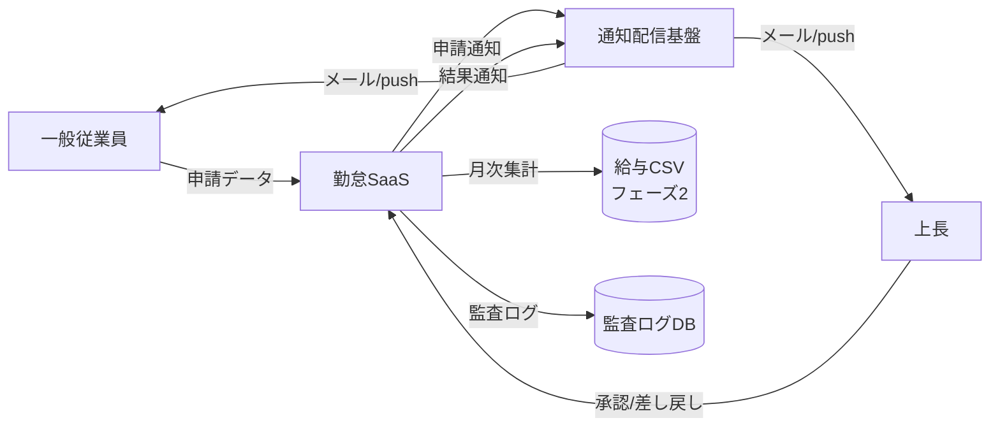

<!--
本ファイルは einja-project-function-spec Skill の動作確認用サンプル（業務フロー単位）です。
本来の出力先は docs/project/function-specs/function-spec-{flow_id}.md（1リポジトリ1プロジェクト前提）。

- 入力サンプル1: ../requirements.md（§2.1.2 TO-BE 業務フロー / §6 機能要件サマリ）
- 入力サンプル2: ../screen-flow-url.md（stable_id 参照キー）
- Skill 定義: .claude/skills/einja-project-function-spec/

本フローの FN-005 は『打刻フロー』『未打刻アラートフロー』とも共有される機能（N対N関係の実証、3フロー共有）。
打刻フローでは打刻完了通知、承認フローでは承認依頼通知・結果通知、未打刻アラートフローでは未打刻リマインド通知の配信に使われる共通基盤機能。
-->

# 業務フロー機能仕様: 勤怠承認フロー（残業・有給申請の承認）

## 1. 業務フロー概要

### 1.1 基本情報

| 項目 | 内容 |
|------|------|
| 業務フローID | sample-attendance-saas__flow__attendance_approval |
| 業務フロー名 | 勤怠承認フロー（残業・有給申請の承認） |
| 関連 requirements.md セクション | §2.1.2 TO-BE 業務フロー / §2.3 業務ルール R-02, R-03 / §6.1 F-03, F-04 |
| 関連業務課題ID（§2.2 課題ID） | C-02（有給申請が紙のため承認LT長期化） |

### 1.2 アクター

| アクター | 区分 | 役割 |
|----------|------|------|
| 一般従業員 | 利用者 | 残業・有給を申請する。差し戻しを受けたら修正再申請する |
| 上長（管理者） | 利用者 | 部下の申請を承認・差し戻しする |
| 人事担当 | 利用者 | 全社申請の俯瞰確認・例外承認（事後申請等）を行う |
| 勤怠SaaS（システム） | システム | 申請データの保存・通知配信・承認状態管理 |

### 1.3 AS-IS / TO-BE 要約

#### AS-IS（現状）

残業・有給申請は紙の申請書を上長に手渡しし、上長は紙上で承認印を押した後、人事部へ回覧する運用となっている。承認LTは平均5営業日で、繁忙期は10営業日を超えることもある。差し戻しは紙の朱書きで返却され、書き直しと再回覧でさらに数日を要する。

#### TO-BE（あるべき姿）

従業員はアプリの申請画面から残業・有給を申請し、**送信と同時に上長へメール+アプリ内通知**が配信される。上長は承認一覧画面で内容確認・承認/差し戻しを1〜2クリックで実施。差し戻しはコメント付きで従業員へ即時通知され、修正再申請が可能となる。これにより承認LTを5営業日 → 1営業日に短縮する（KPI: requirements.md §1.3）。

---

## 2. 業務フロー詳細

### 2.1 sequenceDiagram（時系列インタラクション図）

### 2.2 ステップ別表

sequenceDiagram の各メッセージと 1:1 対応する詳細表。

| ステップ | アクター | 操作 | 関連画面 stable_id | 関連機能ID | 入出力 | 例外 |
|---------|---------|------|------------------|-----------|--------|------|
| 1 | 一般従業員 | 申請画面へ遷移 | sample-attendance-saas__request | FN-003 | 入力: なし / 出力: 申請フォーム表示 | セッション切れ時はlogin画面へ（遷移元 dashboard は §2.1 sequenceDiagram 参照） |
| 2 | 一般従業員 | 残業/有給申請を入力・送信 | sample-attendance-saas__request | FN-003 | 入力: 申請種別 / 日時 / 理由 / 出力: 申請ID | 必須項目欠落時はバリデーションエラー |
| 3 | 勤怠SaaS | 承認依頼通知配信 | - | FN-005 | 入力: 申請ID / 上長ID / 出力: 通知配信ID | 通知失敗時は3回リトライ後Datadogアラート |
| 4 | 上長 | 承認一覧画面を開く | sample-attendance-saas__approval-list | FN-006 | 入力: 上長ID / 出力: 部下申請一覧（status=submitted） | 部下が存在しない場合は空一覧表示 |
| 5 | 上長 | 申請項目クリック→承認画面 | sample-attendance-saas__approval | FN-006 | 入力: 申請ID / 出力: 申請詳細・履歴 | 既に他者承認済みは警告表示 |
| 6a | 上長 | 承認ボタン押下 | sample-attendance-saas__approval | FN-004 | 入力: 申請ID / 出力: 承認完了 | 承認権限なしは403 |
| 6b | 上長 | 差し戻し（コメント付き） | sample-attendance-saas__approval | FN-004 | 入力: 申請ID / コメント / 出力: 差し戻し完了 | コメント空欄は必須エラー |
| 7 | 勤怠SaaS | 承認/差し戻し結果通知配信 | - | FN-005 | 入力: 申請ID / 結果種別 / 出力: 通知配信ID | 通知失敗時は3回リトライ |
| 8 | 勤怠SaaS | 期限超過時の催促・エスカレーション | - | FN-005 | 入力: 期限超過申請リスト / 出力: 催促/エスカレーション通知 | バッチ失敗時はSlack通知 |
| 9 | 人事担当 | 事後申請の例外承認 | sample-attendance-saas__approval | FN-004 | 入力: 申請ID / 例外承認フラグ / 出力: 承認完了 | 監査ログに例外承認フラグ必須 |

---

## 3. 機能一覧

本業務フローで使う機能を `FN-XXX` 独立採番で列挙する。`requirements.md §6` 機能要件サマリへの**書き戻しは行わない**。

| FN-XXX | 機能名 | 概要 | 関連画面 stable_id | 関連業務ステップ | 優先度 | 備考 |
|--------|--------|------|------------------|----------------|--------|------|
| FN-003 | 申請機能 | 残業・有給申請の入力・送信を提供する | sample-attendance-saas__request | §2.2 ステップ1, 2 | MUST | requirements.md §6.1 F-03, F-04 対応 |
| FN-004 | 承認・差し戻し機能 | 上長・人事担当が申請を承認/差し戻し（コメント付き）する | sample-attendance-saas__approval | §2.2 ステップ6a, 6b, 9 | MUST | requirements.md §6.1 F-03, F-04 対応 / 差し戻しコメント必須 |
| FN-005 | 通知配信機能 | システムからのメール・アプリ内push通知を一元配信する（複数フロー共有） | - | §2.2 ステップ3, 7, 8 | MUST | **本機能は『打刻フロー』『未打刻アラートフロー』とも共有**（N対N関係、3フロー共有）。承認依頼 / 結果通知 / 催促 / エスカレーション 等の配信を担う共通基盤 |
| FN-006 | 承認一覧表示機能 | 上長配下の部下申請を一覧表示し、承認画面へ遷移する | sample-attendance-saas__approval-list | §2.2 ステップ4, 5 | MUST | 自部署フィルタリング・権限制御を含む |

優先度凡例: `MUST` = 必須機能 / `SHOULD` = 推奨機能 / `MAY` = 任意機能

---

## 4. データの流れ

システム間連携・データ授受の概要を記述する。詳細な API 仕様・データスキーマは設計フェーズ（design.md）で扱う。

### 4.1 連携先一覧

| 連携先 | 連携方式 | データ形式 | タイミング | 関連 requirements.md §9 連携先ID |
|--------|---------|----------|-----------|---------------------------------|
| 通知配信基盤（メール送信） | SMTP（社内SMTPサーバ経由） | プレーンテキスト + HTML | 同期（API呼び出し）/ 非同期（キュー経由） | 該当なし（社内基盤、§9 連携外） |
| アプリ内push通知 | WebSocket（Vercel Functions） | JSON | 同期 | 該当なし |
| 給与システム（フェーズ2以降） | CSVファイル送信（手動アップロード） | CSV | 月次バッチ | I-02（フェーズ2着手前に仕様確定） |
| 監査ログストレージ | API（別ストレージ） | JSON | 同期 | 該当なし（§7.5 監査ログ） |

### 4.2 データフロー図（任意）

---

## 5. 業務ルール・バリデーション（業務観点）

業務上の制約・承認フロー・例外処理を整理する。技術的バリデーション（型チェック等）は design.md / Issue 仕様で扱う。

### 5.1 業務ルール一覧

| ルールID | 内容 | 根拠（規程・契約・法令等） | 例外条件 |
|---------|------|------------------------|---------|
| BR-01 | 残業は事前申請を原則、緊急時は事後申請可（24h以内） | 社内36協定運用規程（requirements.md §2.3 R-02） | 災害・緊急対応時は人事担当の例外承認で48hまで延長可 |
| BR-02 | 有給申請は取得希望日の3営業日前までに申請 | 就業規則§X（requirements.md §2.3 R-03） | 慶弔・体調不良時は当日申請可（人事担当例外承認） |
| BR-03 | 差し戻しは必ずコメント付きとする | 業務オーナー要請（人事部長） | なし |
| BR-04 | 24時間以内に未承認の場合は上長への催促 + 人事担当へのエスカレーション通知を実施 | KPI（承認LT 1営業日）達成のため | なし |

### 5.2 承認フロー（該当する場合）

| 承認段階 | 承認者ロール | 期限 | 期限超過時の動作 | 差し戻し条件 |
|---------|------------|------|----------------|------------|
| 1次承認 | 上長（直属管理者） | 申請から24時間以内 | 催促通知 + 人事担当エスカレーション（BR-04） | 申請理由不明確 / 業務カレンダー競合 / 申請内容不備 |
| 例外承認（事後申請） | 人事担当 | 事後申請から24時間以内 | Datadogアラート | 業務ルール BR-01 / BR-02 の例外条件を満たさない場合 |

### 5.3 例外処理（該当する場合）

- **期限超過（BR-04）**: 24時間以内に上長が未承認の場合、自動で催促通知 + 人事担当へエスカレーション通知。人事担当ダッシュボードに「期限超過申請」リストを表示
- **事後申請（BR-01 例外）**: 事前申請ができなかった理由を必須入力。人事担当が例外承認/却下を判定。承認時は監査ログに `例外承認フラグON` + `例外理由` を記録
- **承認権限の引継ぎ（上長不在時）**: 上長が長期不在の場合、人事担当が代理承認可能。代理承認は監査ログに `代理承認フラグON` + `代理理由` を記録
- **通知配信失敗（FN-005）**: 3回リトライ後Datadogアラート。承認依頼通知の失敗は承認LT遵守不能リスクのためSev2扱い

---

## 6. 関連画面一覧

`screen-flow-url.md` の `stable_id` を参照キーとして、本業務フローで利用する画面を列挙する。

| stable_id | 画面名 | Figma リンク | 役割（この業務フロー内） |
|-----------|--------|-------------|--------------------|
| sample-attendance-saas__dashboard | ダッシュボード | （screen-flow-url.md / file_key: PLACEHOLDER_FILE_KEY / node_id: 1:3） | 申請画面・承認一覧画面の導線 |
| sample-attendance-saas__request | 申請画面 | （node_id: 1:5） | 残業・有給の申請入力・送信 |
| sample-attendance-saas__approval-list | 承認一覧画面 | （node_id: 1:6） | 上長配下の申請一覧表示 |
| sample-attendance-saas__approval | 承認画面 | （node_id: 1:7） | 申請詳細表示・承認/差し戻し操作（差し戻しコメントはモーダル） |

---

## 7. 未確定事項・前提条件

設計フェーズ（design.md）へ申し送る未確定事項・前提条件を列挙する。

### 7.1 未確定事項

| 項目 | 現時点の状況 | 確定時期・確定方法 | 影響範囲 |
|------|------------|------------------|---------|
| 承認権限委譲ルール（上長長期不在時の代理承認） | 業務ルール 5.3 例外処理に記述のみ、詳細運用未確定 | 設計フェーズ初期 / 人事部長レビュー | FN-004 / 監査ログ要件 |
| 給与システムCSV連携のフィールド定義 | requirements.md §15.4 TBD-02 で未確定 | フェーズ2着手前（2026-09-15頃） | 月次集計フローとの境界 |
| 多段承認（部長承認）の要否 | 現状は上長1段承認のみ前提だが、長時間残業時の部長承認要否は未確定 | 要件定義完了前 / 工場長 + 人事課長レビュー | FN-004 |

### 7.2 前提条件

- 業務ルール R-02（残業は事前申請原則）・R-03（有給は3営業日前申請）が requirements.md §2.3 で合意済み
- 通知配信基盤（FN-005）が打刻フロー・未打刻アラートフローと共通化される前提（社内SMTPサーバ + WebSocket基盤）
- 上長配下の部下マッピングは User マスタの `manager_id` カラムで管理（requirements.md §8.1 User エンティティ）

### 7.3 設計フェーズへの申し送り

- 申請データの楽観ロック / 競合制御方式の設計（同一申請への複数承認操作回避）
- 通知配信基盤（FN-005）の API インタフェース仕様（打刻フロー・未打刻アラートフローとの共通化前提でテンプレート化）
- 差し戻しコメントの最大文字数・改行扱い・XSS対策方針
- 期限超過バッチの実行間隔・タイムゾーン制御（深夜申請の判定）
- 監査ログのスキーマ設計（代理承認フラグ・例外承認フラグ・差し戻しコメントを含む）
