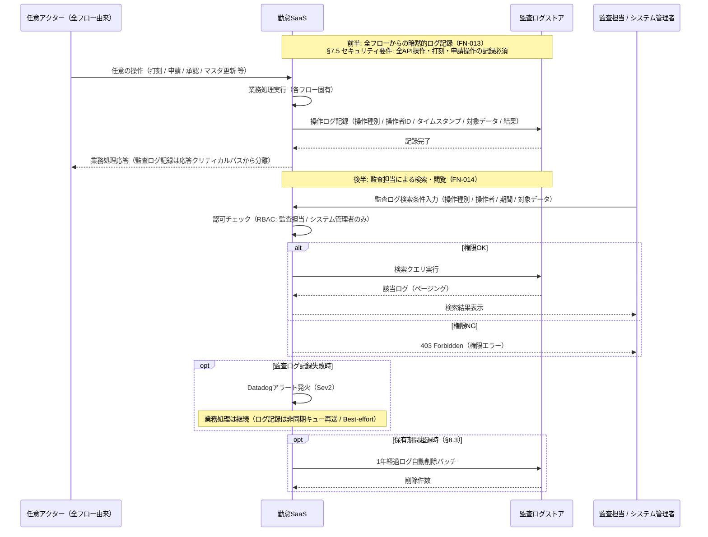
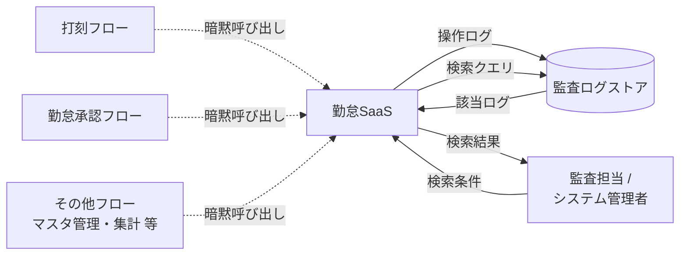

<!--
本ファイルは einja-project-function-spec Skill の動作確認用サンプル（業務フロー単位・監査ログ）です。

- 入力1: ../requirements.md（§2.1.2 S4 / §6.1 F-08 / §7.5 / §8.3）
- 入力2: ../screen-flow-url.md（監査ログ閲覧画面は未登録・画面なしフロー）

本フロー特徴:
- FN-013（監査ログ記録）は全フローから暗黙的に呼ばれる横断機能。§3 機能一覧への列挙は本フローのみで行う（最小変更原則）
- FN-014（監査ログ閲覧）は監査担当 / システム管理者用。対応画面は実装フェーズで追加検討（§7 申し送り参照）
-->

# 業務フロー機能仕様: 監査ログフロー

## 1. 業務フロー概要

### 1.1 基本情報

| 項目 | 内容 |
|------|------|
| 業務フローID | sample-attendance-saas__flow__audit_log |
| 業務フロー名 | 監査ログフロー |
| 関連 requirements.md セクション | §2.1.2 TO-BE 業務フロー S4（監査ログ記録）/ §6.1 F-08（監査ログ）/ §7.5 セキュリティ要件 / §8.3 データ保有方針 |
| 関連業務課題ID（§2.2 課題ID） | 該当なし（監査・コンプライアンスは §2.2 で個別課題化されていないが、§7.5 セキュリティ要件 + 改正個人情報保護法準拠の前提から派生する独立要求） |

### 1.2 アクター

| アクター | 区分 | 役割 |
|----------|------|------|
| 勤怠SaaS（システム） | システム | 全フローからの操作を契機に監査ログを暗黙的に記録する（FN-013） |
| 監査担当 / システム管理者 | 利用者 | 監査ログを検索・閲覧し、不正操作・例外操作の追跡を行う（FN-014） |
| 監査ログストア | システム | 監査ログを別ストレージに分離保管する（§4.3 アーキテクチャ方針 / §7.5）|

### 1.3 AS-IS / TO-BE 要約

#### AS-IS（現状）

紙タイムカード・紙申請書のため、誰がいつどの操作を行ったかの追跡可能性が極めて低い。タイムカード差し替え・申請書の改ざんを発見する仕組みがなく、内部統制上の指摘事項。Excel 集計時の人事担当による手作業ミスや属人的修正も追跡できない。

#### TO-BE（あるべき姿）

新システムは打刻・申請・承認・マスタ管理など**全業務フローからの操作を契機に、監査ログを暗黙的に記録**する（FN-013）。ログは別ストレージ（§4.3 / §7.5）に1年間（§8.3）保持。監査担当・システム管理者は検索条件（操作種別 / 操作者 / 期間 / 対象データ）で横断検索でき（FN-014）、内部統制対応・改正個人情報保護法準拠の追跡可能性を確保する。

---

## 2. 業務フロー詳細

### 2.1 sequenceDiagram（時系列インタラクション図）

本フローは「全フローからの暗黙的なログ記録（前半）」と「監査担当による閲覧（後半）」の2段構成。前半の `User` は任意フローのアクター（一般従業員・上長・人事担当・システム管理者 等）の総称として扱う。

### 2.2 ステップ別表

sequenceDiagram の各メッセージと 1:1 対応する詳細表。ステップ1の関連画面は呼び出し元フローに依存するため本表では `-` とする。

| ステップ | アクター | 操作 | 関連画面 stable_id | 関連機能ID | 入出力 | 例外 |
|---------|---------|------|------------------|-----------|--------|------|
| 1 | 任意アクター | 任意の操作（打刻 / 申請 / 承認 / マスタ更新 等） | - | - | 入力: 各フロー固有 / 出力: 各フロー固有 | 各フロー側で扱う |
| 2 | 勤怠SaaS | 業務処理実行 | - | - | 入力: 操作リクエスト / 出力: 業務処理結果 | 各フロー側で扱う |
| 3 | 勤怠SaaS | 監査ログ記録（操作種別 / 操作者ID / タイムスタンプ / 対象データ / 結果） | - | FN-013 | 入力: 操作コンテキスト / 出力: 監査ログID | 記録失敗時はDatadogアラート + キュー再送（業務処理は継続） |
| 4 | 監査担当 / システム管理者 | 監査ログ検索条件入力 | - | FN-014 | 入力: 操作種別 / 操作者 / 期間 / 対象データ / 出力: 検索結果一覧 | 検索条件不正時はバリデーションエラー |
| 5 | 勤怠SaaS | 認可チェック（RBAC） | - | FN-014 | 入力: 利用者ロール / 出力: 認可結果 | 権限なし（一般従業員・上長）は403 |
| 6 | 勤怠SaaS | 検索クエリ実行・結果返却 | - | FN-014 | 入力: 検索条件 / 出力: 該当ログ（ページング） | 大量ヒット時は10000件で打ち切り + 警告表示 |
| 7 | 勤怠SaaS | 保有期間超過ログの自動削除（§8.3） | - | FN-013 | 入力: 1年経過ログ / 出力: 削除件数 | バッチ失敗時はSlack通知（Sev2） |

---

## 3. 機能一覧

本業務フローで使う機能を `FN-XXX` 独立採番で列挙する。`requirements.md §6` 機能要件サマリへの**書き戻しは行わない**。

| FN-XXX | 機能名 | 概要 | 関連画面 stable_id | 関連業務ステップ | 優先度 | 備考 |
|--------|--------|------|------------------|----------------|--------|------|
| FN-013 | 監査ログ記録機能（横断・暗黙呼び出し） | **全業務フロー（打刻・承認・マスタ管理 等）からの操作を契機に暗黙的に呼び出される横断機能**。操作種別 / 操作者ID / タイムスタンプ / 対象データ / 結果を別ストレージに記録する。各フロー §3 機能一覧への列挙は本フローのみで行う（最小変更原則） | - | §2.2 ステップ3, 7 | MUST | requirements.md §6.1 F-08 / §7.5 セキュリティ要件 / §8.3 データ保有方針 1年 対応。**他フロー（打刻・承認・将来追加フロー）の §3 機能一覧には追加しない**。記録失敗は Best-effort + Datadogアラート |
| FN-014 | 監査ログ閲覧機能 | 監査担当 / システム管理者が監査ログを検索・参照する。検索条件: 操作種別 / 操作者 / 期間 / 対象データ。RBAC で監査担当・システム管理者のみアクセス可 | -（実装フェーズで画面追加検討・§7 申し送り参照） | §2.2 ステップ4, 5, 6 | MUST | requirements.md §3.3 権限マトリクス（システム設定: システム管理者）/ §6.1 F-08 対応 |

優先度凡例: `MUST` = 必須機能 / `SHOULD` = 推奨機能 / `MAY` = 任意機能

---

## 4. データの流れ

システム間連携・データ授受の概要を記述する。詳細な API 仕様・データスキーマは設計フェーズ（design.md）で扱う。

### 4.1 連携先一覧

| 連携先 | 連携方式 | データ形式 | タイミング | 関連 requirements.md §9 連携先ID |
|--------|---------|----------|-----------|---------------------------------|
| 監査ログストレージ（別ストレージ） | API（同期）+ 非同期キュー再送 | JSON | 同期（業務処理応答パスから分離） | 該当なし（社内基盤、§4.3 / §7.5） |
| Datadog（アラート） | API（HTTPS） | JSON | 同期（ログ記録失敗時のみ） | 該当なし（§7.3 監視） |

外部システムへの連携はなし（§9.1）。監査ログは社内別ストレージに閉じる。

### 4.2 データフロー図（任意）

破線矢印（暗黙呼び出し）は FN-013 が全フローから横断的に呼ばれることを示す。

---

## 5. 業務ルール・バリデーション（業務観点）

業務上の制約・承認フロー・例外処理を整理する。技術的バリデーション（型チェック等）は design.md / Issue 仕様で扱う。

### 5.1 業務ルール一覧

| ルールID | 内容 | 根拠（規程・契約・法令等） | 例外条件 |
|---------|------|------------------------|---------|
| BR-01 | 全API操作・打刻・申請操作を監査ログとして記録する（FN-013 は横断的暗黙呼び出し） | requirements.md §7.5 セキュリティ要件 | なし（記録失敗時も業務処理は継続 + Datadogアラート） |
| BR-02 | 監査ログは別ストレージに分離保管し、改ざん検知可能とする | requirements.md §4.3 / §7.5 / 内部統制要件 | なし |
| BR-03 | 監査ログの保有期間は1年とし、超過分は自動削除する | requirements.md §8.3 データ保有方針 | 法令調査等で延長が必要な場合は人事部長・システム管理者承認のうえ手動エクスポート |
| BR-04 | 監査ログ閲覧は監査担当 / システム管理者のみに限定する（RBAC） | requirements.md §3.3 権限マトリクス / 改正個人情報保護法（最小権限の原則）| なし |

### 5.2 承認フロー（該当する場合）

本フロー自体に業務上の承認は不要（記録・閲覧操作のみ）。ただし以下の例外運用は承認を伴う:

| 承認段階 | 承認者ロール | 期限 | 期限超過時の動作 | 差し戻し条件 |
|---------|------------|------|----------------|------------|
| 監査ログ保有期間延長（BR-03 例外） | 人事部長 + システム管理者 | 都度 | 承認なき場合は §8.3 のとおり自動削除 | 延長理由不明確 / 法令根拠なし |

### 5.3 例外処理（該当する場合）

- **監査ログ記録失敗時**: 業務処理応答パスから分離（Best-effort）。非同期キュー再送 + Datadogアラート（Sev2）。業務処理は継続
- **閲覧権限違反**: 一般従業員・上長の閲覧API呼び出しは403。その試行自体も監査ログに記録（自己参照記録）
- **大量検索ヒット時**: 10000件で打ち切り + 警告表示。エクスポートが必要な場合はバッチエクスポート運用（実装フェーズで設計）
- **保有期間自動削除バッチ失敗時**: Slack通知（Sev2）。削除件数は別途レポート化（法令保存期間との整合監視）

---

## 6. 関連画面一覧

`screen-flow-url.md` の `stable_id` を参照キーとして、本業務フローで利用する画面を列挙する。

**関連画面なし**: 本フローは前半（FN-013）が全フローからの暗黙呼び出しのため画面に紐づかず、後半（FN-014 監査ログ閲覧機能）に対応する画面が `screen-flow-url.md` に未登録（screen-flow-url.md のコメント記載のとおり、Step 4 ヒアリングで「管理者専用機能として省略確定」されている）。FN-014 の画面は実装フェーズで dashboard 内サブビューまたは別画面追加で実現される想定（§7 申し送り参照）。

---

## 7. 未確定事項・前提条件

設計フェーズ（design.md）へ申し送る未確定事項・前提条件を列挙する。

### 7.1 未確定事項

| 項目 | 現時点の状況 | 確定時期・確定方法 | 影響範囲 |
|------|------------|------------------|---------|
| 監査ログ閲覧画面の追加（dashboard 内サブビュー / 別画面 / 既存管理画面拡張） | screen-flow-url.md に未登録（Step 4 ヒアリングで省略確定）。UI 実現方式が未確定 | 実装フェーズ初期 / システム管理者 + 監査担当レビュー | FN-014 / screen-flow-url.md / index.md 画面別逆引き表 |
| 監査ログ保有期間（§8.3 との整合・法令調査結果による延長要否） | §8.3 で1年と規定。改正個人情報保護法・労働基準法上の保存義務との整合詳細未確認 | 設計フェーズ初期 / 法務レビュー | BR-03 / FN-013 自動削除バッチ |
| 監査担当の権限ロール定義（マスタ管理フロー FN-018 との連携） | §3.3 では「監査担当」専用ロール未定義（システム管理者ロールに包含）。専用ロール新設の要否未確定 | 設計フェーズ初期 / 人事部 + システム管理者レビュー | FN-014 RBAC / FN-018 連携 / §3.3 更新 |

### 7.2 前提条件

- 監査ログストレージ（別ストレージ）が §4.3 に基づき利用可能（CloudWatch Logs 相当 / 改ざん検知可能）
- §7.5「全API操作・打刻・申請操作を記録」 / §8.3「監査ログ1年保有・自動削除」が合意済み
- 全フローから FN-013 を一律呼び出す共通実装方針（AOP / Middleware / Decorator 等）を design.md で採用予定

### 7.3 設計フェーズへの申し送り

- FN-013 の共通実装方式選定（Middleware / Server Action ラッパ / Decorator / Event Bus 等）と各フロー側の差分最小化
- 監査ログスキーマ統合設計（打刻フロー「代行打刻フラグ」/ 承認フロー「代理・例外承認フラグ・差し戻しコメント」/ 将来フロー固有メタデータを統合）
- 監査ログ閲覧画面の追加（screen-flow-url.md 更新 + index.md 画面別逆引き表の再生成）
- 検索性能設計（インデックス・ページング・打ち切り閾値・エクスポート運用）
- 改ざん検知方式（ハッシュチェーン / WORM / 署名 等）の選定
- 保有期間自動削除バッチ設計（スケジュール・タイムゾーン・削除件数レポート）
- マスタ管理フロー FN-018 連携（監査担当ロール新設時の権限管理側対応）
