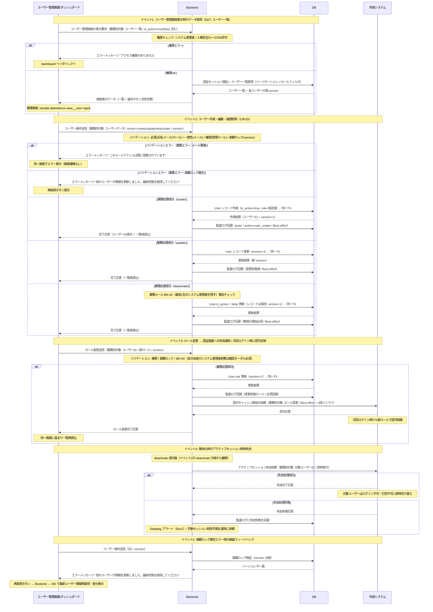
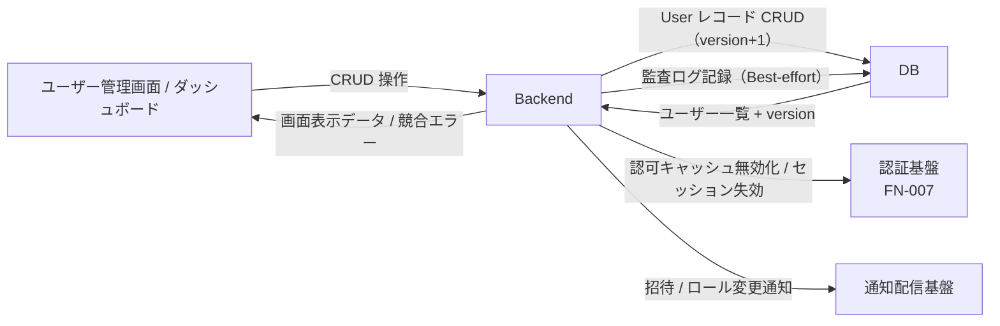

<!--
本ファイルは einja-project-function-spec Skill の動作確認用サンプル（業務フロー機能仕様: §2.1 業務観点 + §2.2 システム観点）です。
本来の出力先は docs/project/function-specs/function-spec-{flow_id}.md（1リポジトリ1プロジェクト前提）。

- 入力サンプル1: ../requirements.md（§3 ユーザー / §6.1 F-07 ユーザー管理 / §8.3 データ保有方針）
- 入力サンプル2: ../screen-flow-url.md（stable_id 参照キー）
- Skill 定義: .claude/skills/einja-project-function-spec/
- スキーマ定義: .claude/skills/einja-project-function-spec/references/manifest-schema.md
- セクション構成: .claude/skills/einja-project-function-spec/references/output-template.md

本フローは F-07（マスタ管理 / ユーザー管理）に対応する。FN-013 監査ログ記録は全フロー横断の暗黙呼び出しとして
本ファイルの §3 機能一覧には列挙しない方針（time_punch / attendance_approval と同様の運用）。
ユーザー無効化は論理削除（is_active=false）で運用し、勤怠データ・申請データの参照整合性を保つ。
本サンプルは認証基盤との連動を伴う 4 層（Browser / Backend / DB / 外部システム=認証基盤）構成のリファレンス実装。
-->

# 業務フロー機能仕様: マスタ管理フロー（ユーザー管理）

## 1. 業務フロー概要

### 1.1 基本情報

| 項目 | 内容 |
|------|------|
| 業務フローID | sample-attendance-saas__flow__master_management |
| 業務フロー名 | マスタ管理フロー（ユーザー管理） |
| 関連 requirements.md セクション | §3.1 エンドユーザー / §3.3 権限マトリクス / §6.1 F-07 ユーザー管理 / §8.3 データ保有方針 |
| 関連業務課題ID（§2.2 課題ID） | （F-07 はマスタ管理の基盤機能のため、特定の業務課題IDではなく全社運用前提として位置付け） |

### 1.2 アクター

| アクター | 区分 | 役割 |
|----------|------|------|
| システム管理者 | 利用者 | 主アクター。従業員マスタの登録・編集・無効化、権限ロール割当を実施する（§3.1 / §3.3 参照） |
| 人事担当 | 利用者 | §3.3 権限マトリクスでユーザー管理権限を持つ副アクター。入社・異動・退職時のロール変更依頼の起点（本サンプルでは sequenceDiagram への明示登場は省略。詳細運用は §7.1 申し送り） |
| 従業員（新規・既存） | 対象 | 登録・編集・無効化される対象。登録完了通知の受信者 |
| 勤怠SaaS（システム） | システム | ユーザーマスタCRUD・権限ロール反映・初回ログイン用招待メール配信を担う |
| 認証基盤（Auth.js） | 外部システム | ロール変更・無効化時のセッション失効・認可制御を担う |

### 1.3 AS-IS / TO-BE 要約

#### AS-IS（現状）

入社・異動・退職に伴うユーザー情報の管理は、人事部から情シス（システム管理者）へのメール依頼ベースで運用されている。Excel管理されたマスタを情シスが手動更新し、紙のタイムカード運用と整合させていたため、権限変更や退職処理の反映に数日のタイムラグが生じていた。退職者の打刻データ整合性確保のため、レコード削除は行わずExcel上で「退職」フラグを立てる運用となっており、管理が煩雑化していた。

#### TO-BE（あるべき姿）

システム管理者・人事担当は管理画面の **ユーザー管理画面**（`sample-attendance-saas__user-mgmt`）から従業員マスタを直接CRUD操作する。新規登録時は招待メールが自動配信され、本人が初回パスワード設定を行う。権限ロール変更は **FN-007 認証機能** と連動し、次回ログイン時から新ロールでの認可制御に切り替わる。**削除は論理削除（無効化）** とし、勤怠データ・申請データの参照整合性を維持しつつ、退職者・休職者をログイン不可・打刻不可に即時切り替える。

---

## 2. 業務フロー詳細

本セクションは **業務観点（§2.1）** と **システム観点（§2.2）** の二段構成。§2.1 はアクター間の業務メッセージ、§2.2 は Browser / Backend / DB / 外部システム（認証基盤）の4層インタラクションを記述する。両者は同じ業務フローの異なる視点であり、ステップ番号で相互参照する（§2.3 ステップ別表で観点列により区別）。

### 2.1 業務観点 sequenceDiagram（時系列インタラクション図）

当該業務フローのアクター間のメッセージ授受を時系列で記述する。`requirements.md §2.1.2` の flowchart（俯瞰用）と相補関係。

### 2.2 システム観点 sequenceDiagram

§2.1 の業務観点メッセージを、システム内部（Browser / Backend / DB / Ext（外部システム=認証基盤））でどう処理するかを 4 層 participant で記述する。
マスタ管理フローは Browser・Backend・DB の標準 CRUD 経路に加え、ロール変更・無効化時に Backend → Ext（認証基盤）へのセッション失効・認可キャッシュ無効化を伴うため、4 層構成が適切。

**canonical participant 識別子（固定）**: `Browser` / `Backend` / `DB` / `Ext`（表示名はフロー固有の通称併記可。本フローでは Ext = 認証基盤）

### 2.3 ステップ別表

§2.1 / §2.2 の各メッセージと 1:1 対応する詳細表。**観点列で業務 / システムを区別する**。

| ステップ | 観点 | アクター / 参加者 | 操作 | 関連画面 stable_id | 関連機能ID | 入出力 | 例外 |
|---------|------|------------------|------|------------------|-----------|--------|------|
| 1 | 業務 | システム管理者 | ログイン（システム管理者ロール） | sample-attendance-saas__dashboard | - | 入力: メール / パスワード / TOTP / 出力: 認証トークン（FN-007 で扱う） | 認証失敗時は login 画面エラー（FN-007） |
| 2 | 業務 | システム管理者 | ユーザー管理画面へ遷移 | sample-attendance-saas__user-mgmt | FN-017 | 入力: なし / 出力: ユーザー一覧（ページネーション・ロールフィルタ） | システム管理者・人事以外のロールはアクセス拒否 |
| 3a | 業務 | システム管理者 | 新規ユーザー登録 | sample-attendance-saas__user-mgmt | FN-017 | 入力: 氏名 / メール / 所属 / ロール / 出力: ユーザーID | メール重複時は重複エラー / 必須欠落はバリデーションエラー |
| 3b | 業務 | システム管理者 | ユーザー情報更新 | sample-attendance-saas__user-mgmt | FN-017 | 入力: ユーザーID / 変更項目 / version / 出力: 更新完了 | 楽観ロック競合時は再取得を案内 |
| 3c | 業務 | システム管理者 | 権限ロール変更 | sample-attendance-saas__user-mgmt | FN-018 | 入力: ユーザーID / 新ロール / version / 出力: ロール変更完了 | 自分自身のシステム管理者権限剥奪は確認モーダル必須 / BR-04 違反は操作不可 |
| 3d | 業務 | システム管理者 | ユーザー無効化（論理削除） | sample-attendance-saas__user-mgmt | FN-017 | 入力: ユーザーID / 無効化理由 / version / 出力: 無効化完了 | 既に無効化済みの再無効化は警告表示 / 物理削除は禁止 |
| 4 | 業務 | 勤怠SaaS | 招待メール配信（新規登録時） | - | FN-017 | 入力: ユーザーID / メール / 出力: 招待メール（初回PW設定URL） | 通知配信失敗は3回リトライ後 Datadog アラート |
| 5 | 業務 | 勤怠SaaS | ロール変更通知配信 | - | FN-018 | 入力: ユーザーID / 新ロール / 出力: メール通知 | 通知配信失敗は3回リトライ |
| 6 | 業務 | 勤怠SaaS | アクティブセッション失効（無効化時） | - | FN-018 | 入力: 対象ユーザーID / 出力: セッション失効完了 | 失効処理失敗は監査ログに記録の上 Datadog アラート（FN-007 連動） |
| S1 | システム | Browser → Backend | ユーザー管理画面の表示要求 | sample-attendance-saas__user-mgmt | FN-017 | 入力: セッショントークン / 出力: ユーザー一覧 + 各 version | 権限エラー時は dashboard へリダイレクト |
| S2 | システム | Backend → DB | ユーザー一覧取得 | - | FN-017 | 入力: ページ / フィルタ条件 / 出力: ユーザー一覧 + version | DB 接続エラー時は画面に再試行案内 |
| S3 | システム | Browser → Backend | ユーザー操作送信（create/update/deactivate） | sample-attendance-saas__user-mgmt | FN-017 | 入力: action / ユーザーデータ / version / 出力: 完了応答 | メール重複・楽観ロック競合・BR-04 違反は業務エラー |
| S4 | システム | Backend → DB | User レコード CRUD（同一TX, version+1） | - | FN-017 | 入力: ユーザーデータ / 出力: ユーザーID + 新 version | 一意制約違反（メール）・楽観ロック競合は409相当の業務エラー |
| S5 | システム | Backend → DB | 監査ログ記録（Best-effort） | - | FN-017 / FN-018 | 入力: 監査ログ（actor / action / 変更前後値） / 出力: ログID | 失敗時は警告ログのみ（操作自体は成功扱い、ただし無効化理由は必須記録） |
| S6 | システム | Browser → Backend | ロール変更送信 | sample-attendance-saas__user-mgmt | FN-018 | 入力: ユーザーID / 新ロール / version / 出力: ロール変更完了 | 自分自身のシステム管理者剥奪は確認モーダル / BR-04 違反は操作不可 |
| S7 | システム | Backend → 外部システム | 認可キャッシュ無効化依頼（ロール変更） | - | FN-018 | 入力: ユーザーID / 新ロール / 出力: 受付応答 | 3回リトライ後 Datadog アラート（Best-effort、次回ログイン時に確実に反映） |
| S8 | システム | Backend → 外部システム | アクティブセッション失効依頼（無効化時） | - | FN-018 | 入力: 対象ユーザーID / 出力: 失効完了応答 | 失効失敗時は監査ログ記録 + Datadog アラート（Sev2）+ 手動セッション削除運用 |
| S9 | システム | Backend → Browser | 楽観ロック競合エラー応答 | sample-attendance-saas__user-mgmt | FN-017 / FN-018 | 入力: 古い version / 出力: エラーメッセージ・再取得導線 | 再取得後の差分表示で管理者が判断 |

ステップ番号の対応関係: 業務ステップ 2（画面表示）は システムステップ S1-S2、業務ステップ 3a-3d（CRUD）は S3-S5、業務ステップ 3c・5（ロール変更）は S6-S7、業務ステップ 3d・6（無効化 + セッション失効）は S3-S5・S8 に対応する。

---

## 3. 機能一覧

本業務フローで使う機能を `FN-XXX` 独立採番で列挙する。`requirements.md §6` 機能要件サマリへの**書き戻しは行わない**。

§3.1 機能サマリ表で全機能を俯瞰し、MUST 機能は §3.2 機能カードで詳細化する。

### 3.1 機能サマリ表

| FN-XXX | 機能名 | 概要 | 関連画面 stable_id | 関連業務ステップ | 優先度 | 備考 |
|--------|--------|------|------------------|----------------|--------|------|
| FN-017 | ユーザー登録・編集機能 | 従業員マスタの CRUD（登録・編集・無効化）。削除は論理削除（is_active=false）で運用し、勤怠・申請データの参照整合性を維持する。招待メール配信を含む | sample-attendance-saas__user-mgmt | §2.3 ステップ2, 3a, 3b, 3d, 4 / S1-S5, S9 | MUST | requirements.md §6.1 F-07 対応 |
| FN-018 | 権限ロール管理機能 | ロール（一般従業員 / 管理者 / 人事担当 / システム管理者）の割当・変更を提供する。**FN-007 認証機能と連動**し、ロール変更は次回ログイン時から認可制御に反映、無効化時はアクティブセッションを即時失効させる | sample-attendance-saas__user-mgmt | §2.3 ステップ3c, 5, 6 / S6-S9 | MUST | requirements.md §6.1 F-07 対応 / §3.3 権限マトリクスに準拠 / FN-007（認証）と連動 |

優先度凡例: `MUST` = 必須機能 / `SHOULD` = 推奨機能 / `MAY` = 任意機能

> 補足: 本フローでは FN-013 監査ログ記録機能を §3 機能一覧に列挙しない方針としている。FN-013 は全 API 操作の横断暗黙呼び出しとして requirements.md §6.1 F-08 / §7.5 で全社共通に位置付けられるため。本フローでは S5（監査ログ記録）として §2.2 / §2.3 にステップ記述のみ残す。

### 3.2 機能カード（MUST 機能の詳細）

#### FN-017 ユーザー登録・編集機能

- **入力**: ユーザーデータ（氏名 / メールアドレス / 所属 / ロール / is_active / version）/ 無効化理由（無効化時必須）
- **主要バリデーション**: 必須（氏名 / メール / ロール / 無効化時の理由）/ 一意性（メールアドレス、is_active 問わず）/ 権限（システム管理者 / 人事担当ロールのみ）/ 楽観ロック（update / deactivate 時の version 一致）
- **処理ステップ**: §2.2 ステップ S1〜S5・S9 参照（画面表示要求 → CRUD 送信 → バリデーション → User レコード CRUD（同一TX, version+1）→ 監査ログ記録（Best-effort）→ 完了応答 / 競合時は再取得導線）
- **出力**: 完了応答（ユーザーID + 新 version） + 一覧再読込 / 新規登録時は招待メール配信（初回PW設定URL付き）
- **業務エラー**:
  - メール重複 → "このメールアドレスは既に登録されています"（同一画面に留まる）
  - 楽観ロック競合 → "他のユーザーが情報を更新しました。最新状態を取得してください"（再取得ボタン表示）
  - 必須欠落 → "未入力の項目があります"
  - 権限なし → "アクセス権限がありません"（dashboard へリダイレクト）
  - 無効化理由未入力 → "無効化理由を入力してください"
  - 物理削除試行 → "ユーザーの物理削除はできません。無効化操作を使用してください"
  - 招待メール配信失敗 → 画面表示なし（3回リトライ後 Datadog Sev3 / 再送ボタンから手動再送可）
- **関連画面**: sample-attendance-saas__user-mgmt（CRUD 操作の主画面）/ sample-attendance-saas__dashboard（管理画面入口）

#### FN-018 権限ロール管理機能

- **入力**: ユーザーID / 新ロール（一般 / 管理者 / 人事 / システム管理者）/ version
- **主要バリデーション**: 必須（ユーザーID / 新ロール）/ 権限（システム管理者のみロール変更可）/ 楽観ロック（version 一致）/ BR-04（最低1名のシステム管理者を残す制約）/ 自己剥奪確認（自分自身のシステム管理者権限剥奪は確認モーダル必須）
- **処理ステップ**: §2.2 ステップ S6〜S9 参照（ロール変更送信 → バリデーション → User.role 更新（version+1）→ 監査ログ記録（必須）→ 認可キャッシュ無効化依頼（外部システム=認証基盤、Best-effort + 3回リトライ）→ ロール変更通知配信 → 完了応答）。無効化時は S8 でアクティブセッション失効依頼を即時実行
- **出力**: ロール変更完了応答 + 一覧再読込 + メール通知（ロール変更のお知らせ）/ 無効化時はアクティブセッション失効完了
- **業務エラー**:
  - BR-04 違反（最後のシステム管理者剥奪）→ "システム管理者は最低1名必要です。剥奪できません"（操作不可）
  - 自己剥奪 → "自分自身のシステム管理者権限を剥奪します。よろしいですか？"（確認モーダル）
  - 楽観ロック競合 → "他のユーザーが情報を更新しました。最新状態を取得してください"（再取得ボタン表示）
  - 認可キャッシュ無効化失敗 → 画面表示なし（3回リトライ後 Datadog アラート / 次回ログイン時に確実に反映される運用前提）
  - セッション失効失敗（無効化時）→ 画面表示なし（監査ログ記録 + Datadog Sev2 + 手動セッション削除運用）
- **関連画面**: sample-attendance-saas__user-mgmt（ロール変更・無効化操作の主画面）
- **連動機能**: FN-007 認証機能（ロール変更は次回ログイン時に認可反映、無効化時はアクティブセッション即時失効）

機能カードの記述ルール:
- MUST 機能は必須。本フローは全機能 MUST のため全件カード化
- 処理ステップは §2.2 と整合させ、詳細が §2.2 にある場合は「§2.2 ステップ N 参照」でリダイレクト
- 業務エラーは「業務エラーパターン → 画面メッセージ」のペアで記述（HTTP ステータスや例外クラス名は記載しない）

---

## 4. データの流れ

システム間連携・データ授受の概要を記述する。**外部システム連携**（§4.1）と **内部システム間データフロー**（§4.2）の二段構成。詳細な API 仕様・データスキーマは設計フェーズ（design.md）で扱う。

### 4.1 外部システム連携

外部システム（自社外システム・SaaS・バッチ連携先等）との連携を整理する。

| 連携先 | 連携方式 | データ形式 | タイミング | 関連 requirements.md §9 連携先ID |
|--------|---------|----------|-----------|---------------------------------|
| 認証基盤（Auth.js） | 内部API | JSON | 同期（ロール変更時の認可キャッシュ無効化 / 無効化時のセッション失効） | 該当なし（自社内、FN-007 と連動） |
| 通知配信基盤（メール送信） | SMTP（社内SMTPサーバ経由） | プレーンテキスト + HTML | 同期（API呼び出し）/ 非同期（キュー経由） | 該当なし（社内基盤、§9 連携外） |
| 監査ログストレージ | API（別ストレージ） | JSON | 同期（Best-effort、無効化理由は必須記録） | 該当なし（§7.5 / §8.3 監査ログ 1年保有） |

フェーズ1では外部システム連携なし（§9.1）。退職者の給与システム側マスタ連携はフェーズ2以降の月次集計フローで取り扱う。

### 4.2 内部システム間データフロー

Browser ↔ Backend ↔ DB 間の **概念レベル** でのデータの流れを整理する。具体的 API パス・テーブル名・カラム名は記載しない（design.md / Issue 仕様で扱う）。

| 流れ | 業務的対象（データ名） | トリガー | 方向 | タイミング | 備考 |
|------|----------------------|---------|------|----------|------|
| 1 | ユーザー一覧 / 各 version | ユーザー管理画面の表示要求（GET） | DB → Backend → Browser | 同期 | 権限チェック後に取得。ページネーション・ロールフィルタ対応 |
| 2 | ユーザーデータ（create/update/deactivate） | フォーム送信（POST/PUT/DELETE） | Browser → Backend → DB | 同期（同一TX, version+1） | 楽観ロック + 一意制約（メール）で重複・競合制御 |
| 3 | 監査ログ | CRUD 操作完了後 | Backend → DB → 外部システム（監査ログストレージ） | 同期（Best-effort、無効化理由は必須） | 操作 TX とは分離。失敗しても操作は成功扱い（ただし無効化理由は必須記録） |
| 4 | ロール変更 / 認可キャッシュ無効化 | ロール変更完了後 | Backend → 外部システム（認証基盤） | 同期（Best-effort + 3回リトライ） | 次回ログイン時から新ロールで認可制御に切り替わる |
| 5 | セッション失効依頼 | 無効化（deactivate）完了後 | Backend → 外部システム（認証基盤） | 同期（即時実行） | 対象ユーザーをログイン不可・打刻不可に即時切り替え。失敗時は手動運用 |
| 6 | 招待メール / ロール変更通知 | create 完了後 / ロール変更完了後 | Backend → 外部システム（通知配信基盤） | 非同期 | 3回リトライ後 Datadog アラート（招待は手動再送ボタン併用） |

内部データフロー図:

---

## 5. 業務ルール・バリデーション（業務観点）

業務上の制約・承認フロー・例外処理を整理する。技術的バリデーション（型チェック等）は design.md / Issue 仕様で扱う。

### 5.1 業務ルール一覧

| ルールID | 内容 | 根拠（規程・契約・法令等） | 例外条件 |
|---------|------|------------------------|---------|
| BR-01 | ユーザーの削除は **論理削除（is_active=false）** のみとし、物理削除は禁止する | 勤怠データ・申請データの参照整合性確保 / requirements.md §8.3 データ保有方針（退職後3年で個人情報匿名化） | 個人情報匿名化バッチによる退職後3年経過時の自動匿名化のみ例外（フェーズ2以降検討） |
| BR-02 | 権限ロール変更は **FN-007 認証機能と連動** し、次回ログイン時から新ロールでの認可制御に切り替える。無効化時はアクティブセッションを即時失効させる | requirements.md §7.5 セキュリティ要件 / §3.3 権限マトリクス | 緊急時（インシデント対応）はシステム管理者が手動で全セッション失効可 |
| BR-03 | ユーザー無効化時には **無効化理由の入力を必須** とし、監査ログに必須記録する | 監査要件 / requirements.md §7.5 監査ログ・§8.3（1年保有） | なし |
| BR-04 | システム管理者ロールの剥奪は **最低1名のシステム管理者を残す制約** を満たさなければならない | 運用継続性 / システム管理者不在による緊急時対応不能リスクの回避 | なし（剥奪操作は事前バリデーションで防止） |
| BR-05 | ユーザー情報の同時編集は楽観ロック（version 番号）で制御し、後勝ち更新を防止する | 業務オーナー要請（管理データ保全） | なし |

### 5.2 承認フロー（該当する場合）

ユーザー管理操作自体に多段承認は不要（システム管理者・人事担当による即時反映）。ただし以下のケースは事後確認を行う。

| 承認段階 | 承認者ロール | 期限 | 期限超過時の動作 | 差し戻し条件 |
|---------|------------|------|----------------|------------|
| ロール変更の事後確認 | 人事部長（業務オーナー） | 月次レビュー（締め日まで） | 監査ログレポートでの未確認件数表示 | 変更理由が監査ログから確認できない場合 |
| 無効化（退職処理）の事後確認 | 人事部長 | 退職日翌営業日 | 人事ダッシュボードに警告表示 | 退職理由・退職日・無効化日に齟齬がある場合 |

### 5.3 例外処理（該当する場合）

- **メール重複登録時**: 既存ユーザー（is_active=true / false 問わず）と同一メールでの新規登録は重複エラー。無効化済みユーザーの再雇用時は「再有効化（is_active=true 復帰）」操作を案内する
- **自分自身のシステム管理者権限剥奪**: 確認モーダルで再確認を実施し、BR-04（最低1名残す制約）を満たさない場合は操作不可
- **同時編集による楽観ロック競合**: 複数の管理者が同じユーザー情報を同時編集した場合、後発の操作は version 不一致で業務エラーとなる。画面上は「他のユーザーが情報を更新しました」メッセージ + 再取得ボタンで最新状態を取得し、差分を確認のうえ再操作する運用
- **招待メール配信失敗**: 3回リトライ後 Datadog アラート発火（Sev3）。システム管理者は再送ボタンから手動再送可
- **セッション失効処理失敗（無効化時）**: 監査ログに失敗を記録のうえ Datadog アラート発火（Sev2）。手動でのセッション全削除手順を運用ドキュメントに整備（設計フェーズで詳細化）
- **認可キャッシュ無効化失敗（ロール変更時）**: 3回リトライ後 Datadog アラート。次回ログイン時に確実に新ロールが反映される設計のため画面表示なし
- **退職後3年経過時の個人情報匿名化**: requirements.md §8.3 に従い、個人情報（氏名・メール等）を匿名化バッチで処理する。本フローでは無効化までを対象とし、匿名化バッチはフェーズ2以降の別フローで扱う

### 5.4 主要技術制約

業務ルールから派生する主要な技術的制約を整理する。詳細な型・正規表現・実装方式は design.md / Issue 仕様で扱う。

| 制約種別 | 対象データ | 制約内容 | 違反時の挙動 | 関連 FN-XXX |
|---------|----------|---------|------------|------------|
| 必須 | ユーザーデータ | 氏名 / メール / ロールの入力必須 | 画面メッセージ: "未入力の項目があります" | FN-017 |
| 必須 | 無効化理由 | 無効化時は理由の入力必須（監査ログに必須記録） | 画面メッセージ: "無効化理由を入力してください" | FN-017 |
| 一意性 | メールアドレス | システム全体で一意（is_active 問わず） | 画面メッセージ: "このメールアドレスは既に登録されています" | FN-017 |
| 権限 | ユーザー管理画面 | システム管理者 / 人事担当ロールのみアクセス可 | 画面メッセージ: "アクセス権限がありません"（dashboard へリダイレクト） | FN-017 / FN-018 |
| 権限 | 権限ロール変更操作 | システム管理者ロールのみ操作可 | 画面メッセージ: "ロール変更の操作権限がありません" | FN-018 |
| 競合 | ユーザーデータ（update / deactivate / ロール変更） | 楽観ロック（version 一致）必須 | 画面メッセージ: "他のユーザーが情報を更新しました。最新状態を取得してください" + 再取得ボタン | FN-017 / FN-018 |
| 状態 | ユーザー削除 | 物理削除禁止、論理削除（is_active=false）のみ | 画面メッセージ: "ユーザーの物理削除はできません。無効化操作を使用してください" | FN-017 |
| 業務ルール | システム管理者ロール | 最低1名のシステム管理者を残す（BR-04） | 画面メッセージ: "システム管理者は最低1名必要です。剥奪できません"（操作不可） | FN-018 |

---

## 6. 関連画面一覧

`screen-flow-url.md` の `stable_id` を参照キーとして、本業務フローで利用する画面を列挙する。

| stable_id | 画面名 | cell_id | 役割（この業務フロー内） |
|-----------|--------|---------|--------------------|
| sample-attendance-saas__dashboard | ダッシュボード | screen__dashboard | システム管理者の管理画面入口（ユーザー管理画面への導線） |
| sample-attendance-saas__user-mgmt | ユーザー管理画面 | screen__user_mgmt | 従業員マスタの CRUD 操作・権限ロール変更・無効化を実行する主画面・楽観ロック競合時の再取得 |

---

## 7. 未確定事項・前提条件

設計フェーズ（design.md）へ申し送る未確定事項・前提条件を列挙する。

### 7.1 未確定事項

| 項目 | 現時点の状況 | 確定時期・確定方法 | 影響範囲 |
|------|------------|------------------|---------|
| 一括インポート / エクスポート機能の要否 | screen-flow-url.md の `user-mgmt` 画面では単票CRUDのみ想定。入社時期の一括登録（年度替わり・新卒入社）対応が必要かどうか未確定 | 設計フェーズ初期 / 人事部レビュー（CSV取り込みの要否確認） | FN-017 のスコープ拡張 / 画面設計（一括処理UI） |
| 権限ロール一覧の表示形式 | screen-flow-url.md は画面遷移のみ規定。ロール変更画面でのロール表示（ラベル一覧 / 権限マトリクス表示 / 説明ツールチップ等）は未確定 | 設計フェーズ初期 / UI/UX レビュー | FN-018 の画面設計（user-mgmt 内のロール変更UI） |
| 退職後の個人情報匿名化バッチの実装フェーズ | requirements.md §8.3 で「退職後3年経過で匿名化」と方針のみ規定。本フローでは無効化までを対象とし、匿名化バッチは未着手 | フェーズ2着手前（2026-09-15頃） / 業務オーナー + 受託側PL | 別バッチフローとして切り出し（本フローの責務外） |
| 再雇用時の運用（再有効化 vs 新規登録） | 5.3 例外処理に「再有効化を案内」と記述したが、実運用方針は未確定 | 設計フェーズ初期 / 人事部レビュー | FN-017 の操作仕様 |
| 人事担当のユーザー管理権限の範囲 | §3.3 権限マトリクスで「ユーザー管理」権限ありとされるが、ロール変更・無効化までシステム管理者と同等可能かは未確定 | 要件定義完了前 / 人事部長レビュー | FN-018 / 5.4 権限制約 |

### 7.2 前提条件

- requirements.md §3.3 権限マトリクスで「ユーザー管理」権限は人事担当・システム管理者に限定されることが合意済み
- requirements.md §8.1 で User エンティティに `is_active`（または相当する）論理削除フラグを持つ前提（設計フェーズで命名確定）
- requirements.md §7.5 監査ログ要件に基づき、全 CRUD 操作の監査ログ記録が必須（FN-013 として横断的に呼び出される暗黙機能、本フローの §3 機能一覧には列挙しない）
- 通知配信基盤（招待メール / ロール変更通知）が打刻フロー・承認フローと共通化される前提（社内SMTPサーバ）
- 認証基盤（FN-007）が Auth.js + MFA(TOTP) で構成され、外部からの認可キャッシュ無効化APIおよびセッション失効依頼APIを備える前提

### 7.3 設計フェーズへの申し送り

> **記述方針**: 内部フロー（Browser / Backend / DB / 外部システム間のインタラクション）は §2.2 システム観点 sequenceDiagram、主要技術制約は §5.4 に記述済み。本セクションは **具体的実装方式の選定** のみに縮小する。

| 項目 | 申し送り内容 | 関連 §2.2 ステップ / §5.4 制約 |
|------|------------|-----------------------------|
| セッション失効APIの具体仕様 | Auth.js セッション失効エンドポイントの I/F（同期 vs 非同期、リトライポリシー、失敗時の手動セッション削除手順）の選定が必要 | §2.2 ステップ S8 / §5.4 状態制約・業務ルール制約 |
| 認可キャッシュ無効化APIの具体仕様 | ロール変更時の Auth.js 認可キャッシュ無効化エンドポイントの I/F（即時反映 vs 次回ログイン時反映、キャッシュTTL）の選定が必要 | §2.2 ステップ S7 / §5.4 権限制約 |
| 楽観ロック実装方式 | version カラム方式 vs ETag/タイムスタンプ方式 の選定、User テーブルへの version カラム追加方針 | §2.2 ステップ S3-S5・S9 / §5.4 競合制約 |
| 個人情報匿名化バッチの設計 | 退職後3年経過時の自動匿名化バッチ（対象カラム・実行基盤・冪等性確保）の選定 | §5.3 例外処理 / §7.1 未確定事項 |
| 監査ログのスキーマ設計 | ロール変更前後値・無効化理由・実施者ID・冪等性キーを必須カラムとして含むテーブル設計、保管期間（1年）、検索インデックス戦略 | §2.2 ステップ S5 / §5.4 必須制約 |
| 招待メールの初回PW設定URL設計 | URL 署名方式（JWT / 署名付きトークン）、有効期限、再送ポリシー、URL 失効後の運用 | §2.2 ステップ S5（FN-017 招待メール配信） |
| BR-04 事前バリデーション実装方針 | システム管理者最少数のチェック（同一TX 内 vs 別クエリ、競合状態での同時剥奪防止） | §2.2 ステップ S6 / §5.4 業務ルール制約 |
| 一括インポート / エクスポート機能を採用する場合のCSVスキーマ・取り込みバリデーション・エラー時のロールバック方針 | §7.1 未確定事項に依存 | §7.1 未確定事項 |
