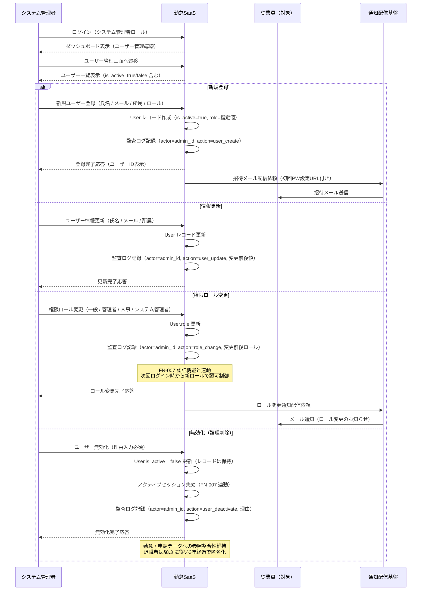
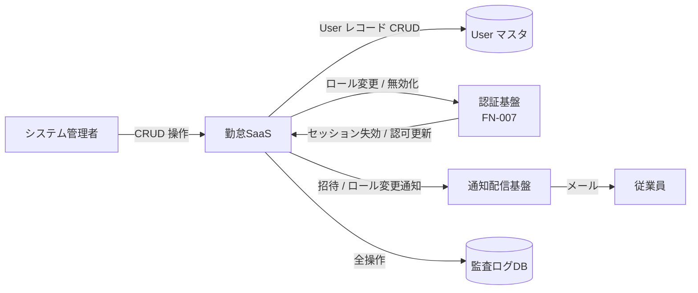

<!--
本ファイルは einja-project-function-spec Skill の動作確認用サンプル（業務フロー単位）です。
本来の出力先は docs/project/function-specs/function-spec-{flow_id}.md（1リポジトリ1プロジェクト前提）。

- 入力サンプル1: ../requirements.md（§3 ユーザー / §6.1 F-07 ユーザー管理 / §8.3 データ保有方針）
- 入力サンプル2: ../screen-flow-url.md（stable_id 参照キー）
- Skill 定義: .claude/skills/einja-project-function-spec/

本フローは F-07（マスタ管理 / ユーザー管理）に対応する。FN-013 監査ログ記録は全フロー横断の暗黙呼び出しとして
本ファイルの §3 機能一覧には列挙しない方針（time_punch / attendance_approval と同様の運用）。
ユーザー無効化は論理削除（is_active=false）で運用し、勤怠データ・申請データの参照整合性を保つ。
-->

# 業務フロー機能仕様: マスタ管理フロー（ユーザー管理）

## 1. 業務フロー概要

### 1.1 基本情報

| 項目 | 内容 |
|------|------|
| 業務フローID | sample-attendance-saas__flow__master_management |
| 業務フロー名 | マスタ管理フロー（ユーザー管理） |
| 関連 requirements.md セクション | §3.1 エンドユーザー / §3.3 権限マトリクス / §6.1 F-07 ユーザー管理 / §8.3 データ保有方針 |
| 関連業務課題ID（§2.2 課題ID） | （F-07 はマスタ管理の基盤機能のため、特定の業務課題IDではなく全社運用前提として位置付け） |

### 1.2 アクター

| アクター | 区分 | 役割 |
|----------|------|------|
| システム管理者 | 利用者 | 主アクター。従業員マスタの登録・編集・無効化、権限ロール割当を実施する（§3.1 / §3.3 参照） |
| 人事担当 | 利用者 | §3.3 権限マトリクスでユーザー管理権限を持つ副アクター。入社・異動・退職時のロール変更依頼の起点（本サンプルでは sequenceDiagram への明示登場は省略。詳細運用は §7.1 申し送り） |
| 従業員（新規・既存） | 対象 | 登録・編集・無効化される対象。登録完了通知の受信者 |
| 勤怠SaaS（システム） | システム | ユーザーマスタCRUD・権限ロール反映・初回ログイン用招待メール配信を担う |

### 1.3 AS-IS / TO-BE 要約

#### AS-IS（現状）

入社・異動・退職に伴うユーザー情報の管理は、人事部から情シス（システム管理者）へのメール依頼ベースで運用されている。Excel管理されたマスタを情シスが手動更新し、紙のタイムカード運用と整合させていたため、権限変更や退職処理の反映に数日のタイムラグが生じていた。退職者の打刻データ整合性確保のため、レコード削除は行わずExcel上で「退職」フラグを立てる運用となっており、管理が煩雑化していた。

#### TO-BE（あるべき姿）

システム管理者・人事担当は管理画面の **ユーザー管理画面**（`sample-attendance-saas__user-mgmt`）から従業員マスタを直接CRUD操作する。新規登録時は招待メールが自動配信され、本人が初回パスワード設定を行う。権限ロール変更は **FN-007 認証機能** と連動し、次回ログイン時から新ロールでの認可制御に切り替わる。**削除は論理削除（無効化）** とし、勤怠データ・申請データの参照整合性を維持しつつ、退職者・休職者をログイン不可・打刻不可に即時切り替える。

---

## 2. 業務フロー詳細

### 2.1 sequenceDiagram（時系列インタラクション図）

### 2.2 ステップ別表

sequenceDiagram の各メッセージと 1:1 対応する詳細表。

| ステップ | アクター | 操作 | 関連画面 stable_id | 関連機能ID | 入出力 | 例外 |
|---------|---------|------|------------------|-----------|--------|------|
| 1 | システム管理者 | ログイン（システム管理者ロール） | sample-attendance-saas__dashboard | - | 入力: メール / パスワード / TOTP / 出力: 認証トークン（FN-007 で扱う） | 認証失敗時はlogin画面エラー（FN-007） |
| 2 | システム管理者 | ユーザー管理画面へ遷移 | sample-attendance-saas__user-mgmt | FN-017 | 入力: なし / 出力: ユーザー一覧（ページネーション・ロールフィルタ） | システム管理者・人事以外のロールはアクセス拒否（403） |
| 3a | システム管理者 | 新規ユーザー登録 | sample-attendance-saas__user-mgmt | FN-017 | 入力: 氏名 / メール / 所属 / ロール / 出力: ユーザーID | メール重複時は重複エラー / 必須欠落はバリデーションエラー |
| 3b | システム管理者 | ユーザー情報更新 | sample-attendance-saas__user-mgmt | FN-017 | 入力: ユーザーID / 変更項目 / 出力: 更新完了 | 楽観ロック競合時は再取得を案内 |
| 3c | システム管理者 | 権限ロール変更 | sample-attendance-saas__user-mgmt | FN-018 | 入力: ユーザーID / 新ロール / 出力: ロール変更完了 | 自分自身のシステム管理者権限剥奪は確認モーダル必須 |
| 3d | システム管理者 | ユーザー無効化（論理削除） | sample-attendance-saas__user-mgmt | FN-017 | 入力: ユーザーID / 無効化理由 / 出力: 無効化完了 | 既に無効化済みの再無効化は警告表示 / 物理削除は禁止 |
| 4 | 勤怠SaaS | 招待メール配信（新規登録時） | - | FN-017 | 入力: ユーザーID / メール / 出力: 招待メール（初回PW設定URL） | 通知配信失敗は3回リトライ後 Datadog アラート |
| 5 | 勤怠SaaS | ロール変更通知配信 | - | FN-018 | 入力: ユーザーID / 新ロール / 出力: メール通知 | 通知配信失敗は3回リトライ |
| 6 | 勤怠SaaS | アクティブセッション失効（無効化時） | - | FN-018 | 入力: 対象ユーザーID / 出力: セッション失効完了 | 失効処理失敗は監査ログに記録の上 Datadog アラート（FN-007 連動） |

---

## 3. 機能一覧

本業務フローで使う機能を `FN-XXX` 独立採番で列挙する。`requirements.md §6` 機能要件サマリへの**書き戻しは行わない**。

| FN-XXX | 機能名 | 概要 | 関連画面 stable_id | 関連業務ステップ | 優先度 | 備考 |
|--------|--------|------|------------------|----------------|--------|------|
| FN-017 | ユーザー登録・編集機能 | 従業員マスタの CRUD（登録・編集・無効化）。削除は論理削除（is_active=false）で運用し、勤怠・申請データの参照整合性を維持する | sample-attendance-saas__user-mgmt | §2.2 ステップ2, 3a, 3b, 3d, 4 | MUST | requirements.md §6.1 F-07 対応 / 招待メール配信を含む |
| FN-018 | 権限ロール管理機能 | ロール（一般従業員 / 管理者 / 人事担当 / システム管理者）の割当・変更を提供する。**FN-007 認証機能と連動**し、ロール変更は次回ログイン時から認可制御に反映、無効化時はアクティブセッションを即時失効させる | sample-attendance-saas__user-mgmt | §2.2 ステップ3c, 5, 6 | MUST | requirements.md §6.1 F-07 対応 / §3.3 権限マトリクスに準拠 / FN-007（認証）と連動 |

優先度凡例: `MUST` = 必須機能 / `SHOULD` = 推奨機能 / `MAY` = 任意機能

---

## 4. データの流れ

システム間連携・データ授受の概要を記述する。詳細な API 仕様・データスキーマは設計フェーズ（design.md）で扱う。

### 4.1 連携先一覧

| 連携先 | 連携方式 | データ形式 | タイミング | 関連 requirements.md §9 連携先ID |
|--------|---------|----------|-----------|---------------------------------|
| 通知配信基盤（メール送信） | SMTP（社内SMTPサーバ経由） | プレーンテキスト + HTML | 同期（API呼び出し）/ 非同期（キュー経由） | 該当なし（社内基盤、§9 連携外） |
| 認証基盤（Auth.js） | 内部API | JSON | 同期（ロール変更時 / 無効化時にセッション失効依頼） | 該当なし（自社内、FN-007 と連動） |
| 監査ログストレージ | API（別ストレージ） | JSON | 同期 | 該当なし（§7.5 / §8.3 監査ログ 1年保有） |

フェーズ1では外部システム連携なし（§9.1）。退職者の給与システム側マスタ連携はフェーズ2以降の月次集計フローで取り扱う。

### 4.2 データフロー図（任意）

ユーザーマスタの状態遷移と FN-007 認証機能との連動関係を補足する。

---

## 5. 業務ルール・バリデーション（業務観点）

業務上の制約・承認フロー・例外処理を整理する。技術的バリデーション（型チェック等）は design.md / Issue 仕様で扱う。

### 5.1 業務ルール一覧

| ルールID | 内容 | 根拠（規程・契約・法令等） | 例外条件 |
|---------|------|------------------------|---------|
| BR-01 | ユーザーの削除は **論理削除（is_active=false）** のみとし、物理削除は禁止する | 勤怠データ・申請データの参照整合性確保 / requirements.md §8.3 データ保有方針（退職後3年で個人情報匿名化） | 個人情報匿名化バッチによる退職後3年経過時の自動匿名化のみ例外（フェーズ2以降検討） |
| BR-02 | 権限ロール変更は **FN-007 認証機能と連動** し、次回ログイン時から新ロールでの認可制御に切り替える。無効化時はアクティブセッションを即時失効させる | requirements.md §7.5 セキュリティ要件 / §3.3 権限マトリクス | 緊急時（インシデント対応）はシステム管理者が手動で全セッション失効可 |
| BR-03 | ユーザー無効化時には **無効化理由の入力を必須** とし、監査ログに記録する | 監査要件 / requirements.md §7.5 監査ログ・§8.3（1年保有） | なし |
| BR-04 | システム管理者ロールの剥奪は **最低1名のシステム管理者を残す制約** を満たさなければならない | 運用継続性 / システム管理者不在による緊急時対応不能リスクの回避 | なし（剥奪操作は事前バリデーションで防止） |

### 5.2 承認フロー（該当する場合）

ユーザー管理操作自体に多段承認は不要（システム管理者・人事担当による即時反映）。ただし以下のケースは事後確認を行う。

| 承認段階 | 承認者ロール | 期限 | 期限超過時の動作 | 差し戻し条件 |
|---------|------------|------|----------------|------------|
| ロール変更の事後確認 | 人事部長（業務オーナー） | 月次レビュー（締め日まで） | 監査ログレポートでの未確認件数表示 | 変更理由が監査ログから確認できない場合 |
| 無効化（退職処理）の事後確認 | 人事部長 | 退職日翌営業日 | 人事ダッシュボードに警告表示 | 退職理由・退職日・無効化日に齟齬がある場合 |

### 5.3 例外処理（該当する場合）

- **メール重複登録時**: 既存ユーザー（is_active=true / false 問わず）と同一メールでの新規登録は重複エラー。無効化済みユーザーの再雇用時は「再有効化（is_active=true 復帰）」操作を案内する
- **自分自身のシステム管理者権限剥奪**: 確認モーダルで再確認を実施し、BR-04（最低1名残す制約）を満たさない場合は操作不可
- **招待メール配信失敗**: 3回リトライ後 Datadog アラート発火（Sev3）。システム管理者は再送ボタンから手動再送可
- **セッション失効処理失敗（無効化時）**: 監査ログに失敗を記録のうえ Datadog アラート発火（Sev2）。手動でのセッション全削除手順を運用ドキュメントに整備（設計フェーズで詳細化）
- **退職後3年経過時の個人情報匿名化**: requirements.md §8.3 に従い、個人情報（氏名・メール等）を匿名化バッチで処理する。本フローでは無効化までを対象とし、匿名化バッチはフェーズ2以降の別フローで扱う

---

## 6. 関連画面一覧

`screen-flow-url.md` の `stable_id` を参照キーとして、本業務フローで利用する画面を列挙する。

| stable_id | 画面名 | Figma リンク | 役割（この業務フロー内） |
|-----------|--------|-------------|--------------------|
| sample-attendance-saas__dashboard | ダッシュボード | （screen-flow-url.md / file_key: PLACEHOLDER_FILE_KEY / node_id: 1:3） | システム管理者の管理画面入口（ユーザー管理画面への導線） |
| sample-attendance-saas__user-mgmt | ユーザー管理画面 | （node_id: 1:11） | 従業員マスタの CRUD 操作・権限ロール変更・無効化を実行する主画面 |

---

## 7. 未確定事項・前提条件

設計フェーズ（design.md）へ申し送る未確定事項・前提条件を列挙する。

### 7.1 未確定事項

| 項目 | 現時点の状況 | 確定時期・確定方法 | 影響範囲 |
|------|------------|------------------|---------|
| 一括インポート / エクスポート機能の要否 | screen-flow-url.md の `user-mgmt` 画面では単票CRUDのみ想定。入社時期の一括登録（年度替わり・新卒入社）対応が必要かどうか未確定 | 設計フェーズ初期 / 人事部レビュー（CSV取り込みの要否確認） | FN-017 のスコープ拡張 / 画面設計（一括処理UI） |
| 権限ロール一覧の表示形式 | screen-flow-url.md は画面遷移のみ規定。ロール変更画面でのロール表示（ラベル一覧 / 権限マトリクス表示 / 説明ツールチップ等）は未確定 | 設計フェーズ初期 / UI/UX レビュー | FN-018 の画面設計（user-mgmt 内のロール変更UI） |
| 退職後の個人情報匿名化バッチの実装フェーズ | requirements.md §8.3 で「退職後3年経過で匿名化」と方針のみ規定。本フローでは無効化までを対象とし、匿名化バッチは未着手 | フェーズ2着手前（2026-09-15頃） / 業務オーナー + 受託側PL | 別バッチフローとして切り出し（本フローの責務外） |
| 再雇用時の運用（再有効化 vs 新規登録） | 5.3 例外処理に「再有効化を案内」と記述したが、実運用方針は未確定 | 設計フェーズ初期 / 人事部レビュー | FN-017 の操作仕様 |

### 7.2 前提条件

- requirements.md §3.3 権限マトリクスで「ユーザー管理」権限は人事担当・システム管理者に限定されることが合意済み
- requirements.md §8.1 で User エンティティに `is_active`（または相当する）論理削除フラグを持つ前提（設計フェーズで命名確定）
- requirements.md §7.5 監査ログ要件に基づき、全 CRUD 操作の監査ログ記録が必須（FN-013 として横断的に呼び出される暗黙機能、本フローの §3 機能一覧には列挙しない）
- 通知配信基盤（招待メール / ロール変更通知）が打刻フロー・承認フローと共通化される前提（社内SMTPサーバ）
- 認証基盤（FN-007）が Auth.js + MFA(TOTP) で構成され、外部からのセッション失効依頼APIを備える前提

### 7.3 設計フェーズへの申し送り

- User エンティティの論理削除カラム命名（`is_active` / `deleted_at` 等）の確定
- 監査ログのスキーマ設計（ロール変更前後値・無効化理由・実施者IDを必須カラムとして含む）
- FN-007 認証機能との連動API設計（セッション失効依頼・ロール変更時の認可キャッシュ無効化）
- 楽観ロック / 競合制御方式（同一ユーザーへの複数管理者による同時編集の制御）
- 招待メールの初回PW設定URLの有効期限・再送ポリシー
- BR-04（最低1名のシステム管理者を残す制約）の事前バリデーション実装方針
- 一括インポート / エクスポート機能を採用する場合のCSVスキーマ・取り込みバリデーション・エラー時のロールバック方針
