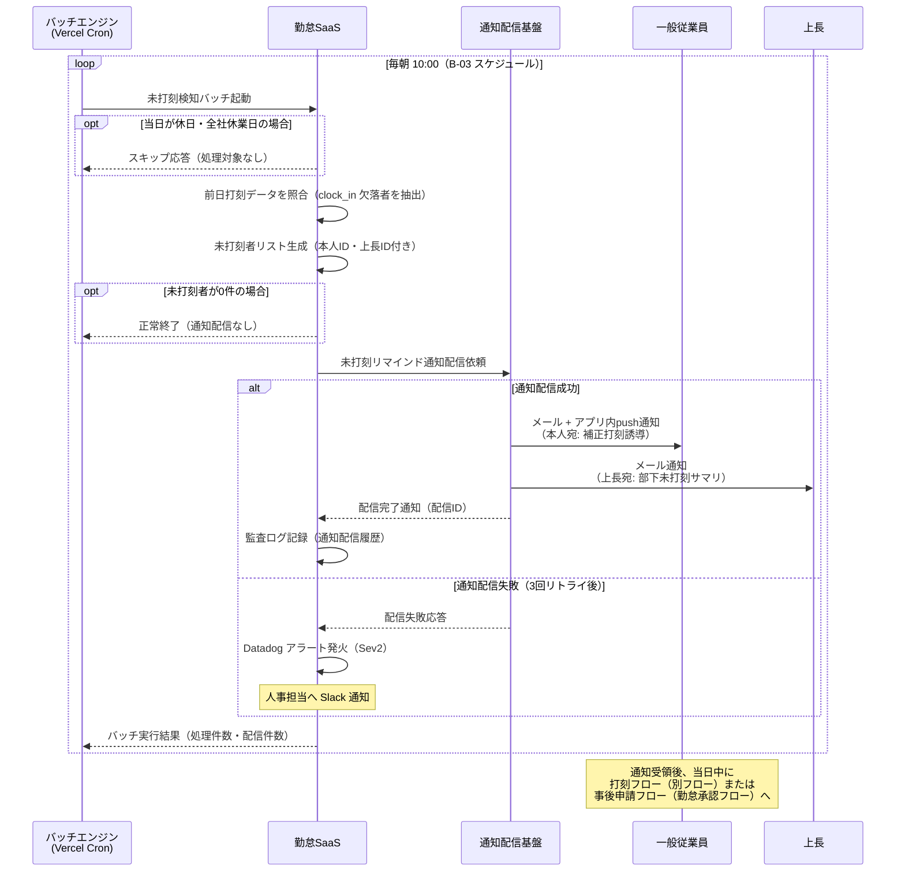
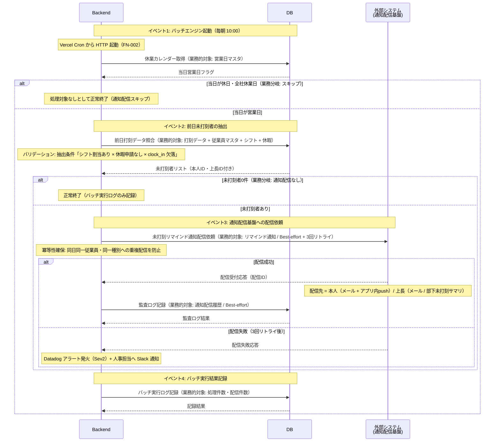
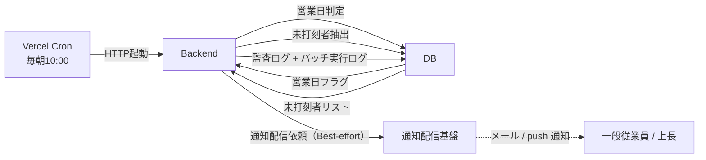

<!--
本ファイルは einja-project-function-spec Skill の動作確認用サンプル（業務フロー機能仕様: §2.1 業務観点 + §2.2 システム観点）です。
本来の出力先は docs/project/function-specs/function-spec-{flow_id}.md（1リポジトリ1プロジェクト前提）。
einja-project-function-spec Skill により生成される機能仕様書の実例として配置しています。

- 入力サンプル1: ../requirements.md（§2.1.2 TO-BE 業務フロー S3 / §2.2 C-01 / §6.2 B-03）
- 入力サンプル2: ../screen-flow-url.md（本フローは通知のみで関連画面なし → related_screens は空配列）
- Skill 定義: .claude/skills/einja-project-function-spec/
- スキーマ定義: .claude/skills/einja-project-function-spec/references/manifest-schema.md
- セクション構成: .claude/skills/einja-project-function-spec/references/output-template.md

本フローは新規 FN-XXX を採番せず、既存 FN-002（未打刻検知バッチ）/ FN-005（通知配信機能）の
2機能の組み合わせのみで成立する。FN-005 は『打刻フロー』『勤怠承認フロー』に続き本フローで
3 フロー目の共有となり、N対N関係の実証範囲が拡大する。

時系列分離: 打刻フローは当日の打刻アクション中心、本フローは翌朝の検知バッチ → 未打刻者への通知。
打刻フロー時系列（前日）と本フロー時系列（翌朝 10:00）を明確に切り分けて記述する。

特殊ケース: 画面なし（バッチ起動）フロー
- §2.2 システム観点 sequenceDiagram は Browser を含まない **3 層構成**（Backend / DB / 外部システム）。
- 関連画面 stable_id はバッチ処理のためすべて `-`。

監査ログ（FN-013 相当）は横断的に暗黙呼び出しされる前提で、本フローの §3 機能一覧には含めない。
-->

# 業務フロー機能仕様: 未打刻アラートフロー

## 1. 業務フロー概要

### 1.1 基本情報

| 項目 | 内容 |
|------|------|
| 業務フローID | sample-attendance-saas__flow__missed_punch_alert |
| 業務フロー名 | 未打刻アラートフロー |
| 関連 requirements.md セクション | §2.1.2 TO-BE 業務フロー S1 → S3 → A2 / §2.2 課題C-01 / §6.2 B-03 |
| 関連業務課題ID（§2.2 課題ID） | C-01（紙タイムカードの回収・転記による集計工数）の解消に伴う打刻漏れ抑制 |

本フローは「打刻フロー」の翌朝側（前日の未打刻者抽出 → リマインド通知 → 当日の補正打刻誘導）を担当する独立フローである。**打刻フローが当日打刻アクション中心**であるのに対し、**本フローは翌朝の検知バッチ起点**となり、時系列で明確に分離されている。

### 1.2 アクター

| アクター | 区分 | 役割 |
|----------|------|------|
| バッチエンジン（Vercel Cron） | システム | 毎朝 10:00 に未打刻検知バッチを起動する |
| 勤怠SaaS（システム） | システム | 前日打刻データの照合・未打刻者抽出・通知配信依頼 |
| 通知配信基盤 | 外部システム | メール（社内SMTP）・アプリ内push通知の一元配信 |
| 一般従業員 | 利用者 | 通知を受領し、当日中に補正打刻（または事後申請）を行う |
| 上長 | 利用者 | 部下の未打刻通知をメールで受領し、対応状況をモニタする |

### 1.3 AS-IS / TO-BE 要約

#### AS-IS（現状）

紙タイムカード運用のため、打刻漏れは**月末集計時に人事部が手作業で発見**する形となり、発生から発覚までに平均2〜3週間のタイムラグがあった。発覚時には本人記憶も曖昧で、上長承認のうえで Excel 集計簿に推定値を手入力する運用となっており、打刻漏れ率は約30%、月次集計の遅延要因の一つとなっていた。

#### TO-BE（あるべき姿）

毎朝 10:00 に未打刻検知バッチが前日打刻データを照合し、未打刻者を抽出する。抽出された従業員と上長に対し、通知配信基盤がメール + アプリ内push通知で**当日中の補正打刻を促す**。これにより打刻漏れ発覚〜対応のリードタイムを「数週間 → 当日」に短縮し、月次集計時の補正工数を最小化する（KPI: requirements.md §1.3 未打刻アラート発生率 30% → 5%）。

---

## 2. 業務フロー詳細

本セクションは **業務観点（§2.1）** と **システム観点（§2.2）** の二段構成。§2.1 はアクター間の業務メッセージ、§2.2 は Backend / DB / 外部システムの **3 層インタラクション** を記述する（本フローはバッチ起動のため Browser を持たない）。両者は同じ業務フローの異なる視点であり、ステップ番号で相互参照する（§2.3 ステップ別表で観点列により区別）。

### 2.1 業務観点 sequenceDiagram（時系列インタラクション図）

当該業務フローのアクター間のメッセージ授受を時系列で記述する。`requirements.md §2.1.2` の flowchart（俯瞰用）と相補関係。

### 2.2 システム観点 sequenceDiagram

§2.1 の業務観点メッセージを、システム内部（Backend / DB / Ext（外部システム））でどう処理するかを **3 層 participant** で記述する（Browser なしバッチフロー）。
本フローは Vercel Cron からの HTTP 起動で始まり、ユーザーの画面操作を伴わないバッチフローのため、**Browser を participant に含めない**。通知配信先（一般従業員・上長）への到達は Ext（通知配信基盤）で完結するメール / push 通知のため、画面遷移としてではなく宛先として §2.2 末尾の Note で示す。

**canonical participant 識別子（固定）**: `Backend` / `DB` / `Ext`（Browser なしの 3 層構成。表示名はフロー固有の通称併記可）

### 2.3 ステップ別表

§2.1 / §2.2 の各メッセージと 1:1 対応する詳細表。**観点列で業務 / システムを区別する**。本フローは画面なしのため `関連画面 stable_id` 列はすべて `-`。

| ステップ | 観点 | アクター / 参加者 | 操作 | 関連画面 stable_id | 関連機能ID | 入出力 | 例外 |
|---------|------|------------------|------|------------------|-----------|--------|------|
| 1 | 業務 | バッチエンジン | 未打刻検知バッチ起動（毎朝 10:00） | - | FN-002 | 入力: cron schedule / 出力: バッチ実行コンテキスト | バッチ起動失敗時は Vercel Cron リトライ |
| 2 | 業務 | 勤怠SaaS | 休日・全社休業日判定（スキップ判定） | - | FN-002 | 入力: 当日日付・休業カレンダー / 出力: 処理可否フラグ | 休業カレンダー未登録時は警告ログを出して通常実行に進む |
| 3 | 業務 | 勤怠SaaS | 前日打刻データ照合（clock_in 欠落者抽出） | - | FN-002 | 入力: 前日打刻データ + 従業員マスタ + シフト + 休暇 / 出力: 未打刻者リスト | 打刻データテーブルアクセス失敗は Sev2 |
| 4 | 業務 | 勤怠SaaS | 通知配信依頼（0件時はスキップ） | - | FN-005 | 入力: 未打刻者リスト / 出力: 配信ジョブID | 0件時はジョブ生成せず正常終了 |
| 5 | 業務 | 通知配信基盤 | 本人宛メール + アプリ内push通知配信 | - | FN-005 | 入力: 本人ID + 補正打刻誘導テンプレ / 出力: 配信完了通知 | 3回リトライ後失敗は Datadog アラート |
| 6 | 業務 | 通知配信基盤 | 上長宛メール通知配信（部下未打刻サマリ） | - | FN-005 | 入力: 上長ID + 部下未打刻リスト / 出力: 配信完了通知 | 同上 |
| 7 | 業務 | 勤怠SaaS | バッチ実行結果記録（処理件数・配信件数） | - | FN-002 | 入力: 配信結果 / 出力: バッチ実行ログ | Datadog 連携失敗時は社内ログのみ |
| S1 | システム | Backend → DB | 休業カレンダー取得 | - | FN-002 | 入力: 当日日付 / 出力: 営業日フラグ | カレンダー未登録時は警告ログ |
| S2 | システム | Backend → DB | 前日打刻データ照合（未打刻者抽出） | - | FN-002 | 入力: 前日日付 + 抽出条件3点 / 出力: 未打刻者リスト | 抽出失敗時は Slack 通知（Sev2） |
| S3 | システム | Backend → 外部システム | 通知配信依頼（Best-effort + 3回リトライ） | - | FN-005 | 入力: 通知データ / 出力: 配信受付応答 | 3回リトライ後 Datadog アラート |
| S4 | システム | Backend → DB | 監査ログ記録（Best-effort） | - | FN-002 | 入力: 通知配信履歴 / 出力: ログID | 失敗時は警告ログのみ（バッチ自体は成功扱い） |
| S5 | システム | Backend → DB | バッチ実行ログ記録 | - | FN-002 | 入力: 処理件数・配信件数 / 出力: ログID | Datadog 連携失敗時は社内ログのみ |

ステップ番号の対応関係: 業務ステップ 1-2（起動・休業判定）は システムステップ S1、業務ステップ 3（前日未打刻者抽出）は S2、業務ステップ 4-6（通知配信依頼〜本人/上長宛配信）は S3-S4、業務ステップ 7（バッチ実行結果記録）は S5 に対応する。

---

## 3. 機能一覧

本業務フローで使う機能を `FN-XXX` 独立採番で列挙する。`requirements.md §6` 機能要件サマリへの**書き戻しは行わない**。

**本フローは新規機能を採番せず、既存 FN-002 / FN-005 の再利用のみで成立する**（N対N関係の実証）。§3.1 機能サマリ表で全機能を俯瞰し、MUST 機能は §3.2 機能カードで詳細化する。

### 3.1 機能サマリ表

| FN-XXX | 機能名 | 概要 | 関連画面 stable_id | 関連業務ステップ | 優先度 | 備考 |
|--------|--------|------|------------------|----------------|--------|------|
| FN-002 | 未打刻検知バッチ | 毎朝10:00に当日未打刻者を抽出する | - | §2.3 ステップ1, 2, 3, 7 / S1, S2, S4, S5 | MUST | requirements.md §6.2 B-03 対応 / **本機能は『打刻フロー』とも共有**（打刻フローでは未打刻リマインドのトリガとして言及、本フローでは検知バッチの主実行フローとして扱う） |
| FN-005 | 通知配信機能 | システムからのメール・アプリ内push通知を一元配信する（複数フロー共有） | - | §2.3 ステップ4, 5, 6 / S3 | MUST | **本機能は『打刻フロー』『勤怠承認フロー』とも共有**（N対N関係・本フローで3フロー目共有）。未打刻リマインド / 承認依頼 / 結果通知 等の配信を担う共通基盤 |

優先度凡例: `MUST` = 必須機能 / `SHOULD` = 推奨機能 / `MAY` = 任意機能

### 3.2 機能カード（MUST 機能の詳細）

#### FN-002 未打刻検知バッチ

- **入力**: 当日日付 / 休業カレンダー / 全従業員マスタ + シフト割当 + 休暇申請 / 前日打刻データ
- **主要バリデーション**: バッチ実行は権限不要（システム実行）。抽出条件として「シフト割当あり × 休暇申請なし × clock_in 欠落」の3条件を満たすユーザーを未打刻者として判定。休業日判定は休業カレンダー優先（カレンダー未登録時は警告ログを出して通常実行に進む）
- **処理ステップ**: §2.2 ステップ S1〜S2, S4〜S5 参照（毎朝 10:00 Vercel Cron 起動 → 休業カレンダー判定 → 前日打刻データ照合 → 未打刻者リスト生成 → FN-005 へ通知配信依頼 → バッチ実行ログ記録）
- **出力**: 未打刻者リスト（本人ID・上長ID付き） → FN-005（通知配信機能）へ連携 / バッチ実行ログ（処理件数・配信件数）
- **業務エラー**:
  - 休業日スキップ → バッチ正常終了（通知配信なし、画面表示なし）
  - 抽出0件 → バッチ正常終了（通知配信なし、画面表示なし）
  - バッチ実行失敗 → Slack 通知（Sev2）+ Datadog アラート（画面表示なし）
  - 監査ログ記録失敗 → 警告ログのみ（バッチ自体は成功扱い）
- **関連画面**: なし（バックエンド処理のみ）

#### FN-005 通知配信機能

- **入力**: 通知配信依頼（宛先ユーザーID + 通知種別 + ペイロード）。本フローでは未打刻リマインド種別を使用（本人宛: 補正打刻誘導 / 上長宛: 部下未打刻サマリ）
- **主要バリデーション**: 必須（宛先 / 通知種別）/ 一意性（同日・同一従業員・同一種別への重複配信防止 = 冪等性キー）/ 配信対象除外（退職予定者・休職者は宛先生成時点で除外）
- **処理ステップ**: §2.2 ステップ S3 参照（外部通知配信基盤へ配信依頼（Best-effort + 3回リトライ）→ 本人宛メール + アプリ内push通知 / 上長宛メール通知）
- **出力**: 配信受付応答（配信ID）+ 本人宛メール + アプリ内push通知 + 上長宛メール通知。画面バナーは本フローでは利用しない（バッチ起点のため）
- **業務エラー**:
  - 配信失敗（3回リトライ後）→ Datadog アラート + 人事担当へ Slack 通知（画面表示なし）
  - 重複配信検知 → 配信スキップ（画面表示なし、冪等性キー単位で制御）
  - push接続切断 → メール通知でフォールバック
- **関連画面**: なし（本フローはバッチ起点で画面遷移を伴わない）
- **共有機能**: 打刻フロー / 勤怠承認フロー / 未打刻アラートフローと共有（N対N関係、3フロー共有）

機能カードの記述ルール:
- MUST 機能は必須。本フローは全機能 MUST のため全件カード化
- 処理ステップは §2.2 と整合させ、詳細が §2.2 にある場合は「§2.2 ステップ N 参照」でリダイレクト
- 業務エラーは「業務エラーパターン → 画面メッセージ」のペアで記述（本フローは画面なしのため「画面表示なし」と明記）

---

## 4. データの流れ

システム間連携・データ授受の概要を記述する。**外部システム連携**（§4.1）と **内部システム間データフロー**（§4.2）の二段構成。詳細な API 仕様・データスキーマは設計フェーズ（design.md）で扱う。

### 4.1 外部システム連携

外部システム（自社外システム・SaaS・バッチ連携先等）との連携を整理する。

| 連携先 | 連携方式 | データ形式 | タイミング | 関連 requirements.md §9 連携先ID |
|--------|---------|----------|-----------|---------------------------------|
| 通知配信基盤（メール送信） | SMTP（社内SMTPサーバ経由） | プレーンテキスト + HTML | 非同期（キュー経由） | 該当なし（社内基盤、§9 連携外） |
| アプリ内push通知 | WebSocket（Vercel Functions） | JSON | 同期 | 該当なし |
| バッチスケジューラ | Vercel Cron（HTTPトリガ） | JSON | 毎朝10:00（B-03） | 該当なし |
| 監査ログストレージ | API（別ストレージ） | JSON | 同期（Best-effort） | 該当なし（§7.5 監査ログ） |

フェーズ1では自社外システム連携なし（§9.1）。本フローの「外部システム」はすべて社内基盤に閉じる。

### 4.2 内部システム間データフロー

Backend ↔ DB ↔ 外部システム 間の **概念レベル** でのデータの流れを整理する。本フローは Browser を持たないため Browser 列は登場しない。具体的 API パス・テーブル名・カラム名は記載しない（design.md / Issue 仕様で扱う）。

| 流れ | 業務的対象（データ名） | トリガー | 方向 | タイミング | 備考 |
|------|----------------------|---------|------|----------|------|
| 1 | 営業日フラグ | Vercel Cron 起動 | DB → Backend | 同期 | 休業日スキップ判定。カレンダー未登録時は警告ログを出して通常実行 |
| 2 | 未打刻者リスト | 休業日判定通過 | DB → Backend | 同期 | 抽出条件「シフト割当あり × 休暇申請なし × clock_in 欠落」の3条件 |
| 3 | 未打刻リマインド通知 | 未打刻者リスト生成完了 | Backend → 外部システム | 非同期（キュー経由 / Best-effort + 3回リトライ） | 冪等性キー = 同日・同一従業員・同一種別。本人宛 + 上長宛の2系統 |
| 4 | 通知配信履歴（監査ログ） | 配信成功応答 | Backend → DB | 同期（Best-effort） | 失敗してもバッチは成功扱い |
| 5 | バッチ実行ログ | バッチ終了 | Backend → DB | 同期 | 処理件数・配信件数を記録 |

内部データフロー図:

---

## 5. 業務ルール・バリデーション（業務観点）

業務上の制約・承認フロー・例外処理を整理する。技術的バリデーション（型チェック等）は design.md / Issue 仕様で扱う。

### 5.1 業務ルール一覧

| ルールID | 内容 | 根拠（規程・契約・法令等） | 例外条件 |
|---------|------|------------------------|---------|
| BR-01 | 未打刻検知は前日分を翌朝 10:00 に1日1回実施する（**打刻フローの当日打刻アクションとは時系列分離**） | requirements.md §6.2 B-03 / 社内就業規則 | 全社休業日・休日はスキップ（休業カレンダー参照） |
| BR-02 | 未打刻通知は本人と上長の双方に配信し、当日中の補正打刻または事後申請を促す | KPI（未打刻アラート発生率 30% → 5%） | 退職予定者・休職者は配信対象外 |
| BR-03 | 通知配信が3回リトライしても失敗した場合は Sev2 として人事担当に Slack エスカレーション | 運用設計（要件定義 §11） | なし |

### 5.2 承認フロー（該当する場合）

本フロー自体に承認は不要（通知配信のみのバッチフロー）。**補正打刻・事後申請の承認は別フロー（打刻フロー・勤怠承認フロー）が担当**するため、本フローでは承認段階を持たない。

### 5.3 例外処理（該当する場合）

- **休業日スキップ**: 当日が全社休業日・休日の場合、未打刻者抽出処理を実行せずバッチを正常終了する（BR-01 例外）。休業カレンダー未登録時は警告ログを出して通常実行に進む
- **未打刻者0件**: 抽出結果が0件の場合は通知配信依頼を行わず、バッチ実行ログのみ記録して正常終了
- **通知配信失敗（FN-005）**: 3回リトライ後 Datadog アラート発火（Sev2）。人事担当には Slack 通知。当該未打刻者へは翌朝のバッチ再実行時に再通知される（重複通知抑止は配信ジョブID単位で制御）
- **バッチ自体の失敗**: Vercel Cron のリトライ機能で1回まで自動再実行。再実行も失敗した場合は Sev1 として情報システム室長へ即時エスカレーション

### 5.4 主要技術制約

業務ルールから派生する主要な技術的制約を整理する。詳細な型・正規表現・実装方式は design.md / Issue 仕様で扱う。

| 制約種別 | 対象データ | 制約内容 | 違反時の挙動 | 関連 FN-XXX |
|---------|----------|---------|------------|------------|
| 必須 | 配信宛先 | 宛先ユーザーID および通知種別の指定必須 | 配信スキップ + Slack 警告（画面表示なし） | FN-005 |
| 必須 | 営業日判定 | 休業カレンダー参照によるスキップ判定必須 | カレンダー未登録時は警告ログを出して通常実行 | FN-002 |
| 重複 | リマインド通知 | 同日・同一従業員・同一種別への重複配信は不可（冪等性キー） | 配信スキップ（画面表示なし） | FN-005 |
| 一意性 | 配信ジョブID | システム全体で一意 | Slack 通知（Sev2）（画面表示なし） | FN-005 |
| 期限 | バッチ実行時刻 | 毎朝 10:00 ± 30 分のウィンドウ内に1回のみ実行 | Vercel Cron リトライで1回まで自動再実行 | FN-002 |
| 権限 | 配信対象除外 | 退職予定者・休職者は配信対象外 | 宛先生成時点で除外（画面表示なし） | FN-005 |

---

## 6. 関連画面一覧

本フローは通知配信のみのバッチフローであり、**専用 UI 画面は持たない**。`related_screens` は空配列とする。

通知を受領した従業員の補正打刻動作は `sample-attendance-saas__punch`（打刻フロー側で管理）、事後申請は `sample-attendance-saas__request`（勤怠承認フロー側で管理）に遷移するが、これらは別フローの責務であり本フローの関連画面には含めない。

---

## 7. 未確定事項・前提条件

設計フェーズ（design.md）へ申し送る未確定事項・前提条件を列挙する。

### 7.1 未確定事項

| 項目 | 現時点の状況 | 確定時期・確定方法 | 影響範囲 |
|------|------------|------------------|---------|
| 工場の3交代制シフトに対応した「未打刻」定義（夜勤明けは前日扱いか当日扱いか） | requirements.md §15.4 TBD-03 で未確定 | 要件定義完了前（2026-06-30）/ 工場長ヒアリング | FN-002 抽出ロジック |
| 退職予定者・休職者の配信除外マスタ管理方式 | BR-02 例外条件に記述のみ、詳細運用未確定 | 設計フェーズ初期 / 人事部レビュー | FN-002 / 配信対象者フィルタ |

### 7.2 前提条件

- 打刻フロー側で `clock_in` データが当日中に保存される運用が確立済み（前日分照合の前提）
- 休業カレンダーが人事担当により事前登録されている（祝祭日・全社休業日含む）
- 通知配信基盤（FN-005）が打刻フロー・勤怠承認フローと共通化されている（社内SMTPサーバ + WebSocket基盤、3フロー共有）

### 7.3 設計フェーズへの申し送り

> **記述方針**: 内部フロー（Backend / DB / 外部システム 間のインタラクション）は §2.2 システム観点 sequenceDiagram、主要技術制約は §5.4 に記述済み。本セクションは **具体的実装方式の選定** のみに縮小する。

| 項目 | 申し送り内容 | 関連 §2.2 ステップ / §5.4 制約 |
|------|------------|-----------------------------|
| 重複通知防止の冪等性キー設計 | 配信ジョブID（バッチ実行単位）vs 本人ID + 日付 + 通知種別（業務キー）の選定が必要。手動再実行時の二重通知防止も含めて方針決定する | §2.2 ステップ S3 / §5.4 重複制約・一意性制約 |
| バッチ実行基盤の冪等性確保 | Vercel Cron リトライ + 手動再実行を考慮した冪等性設計（バッチ実行ログによる重複検知 / 配信ジョブID再利用 等）の具体的実装方式の選定 | §2.2 ステップ S5 / §5.4 期限制約 |
