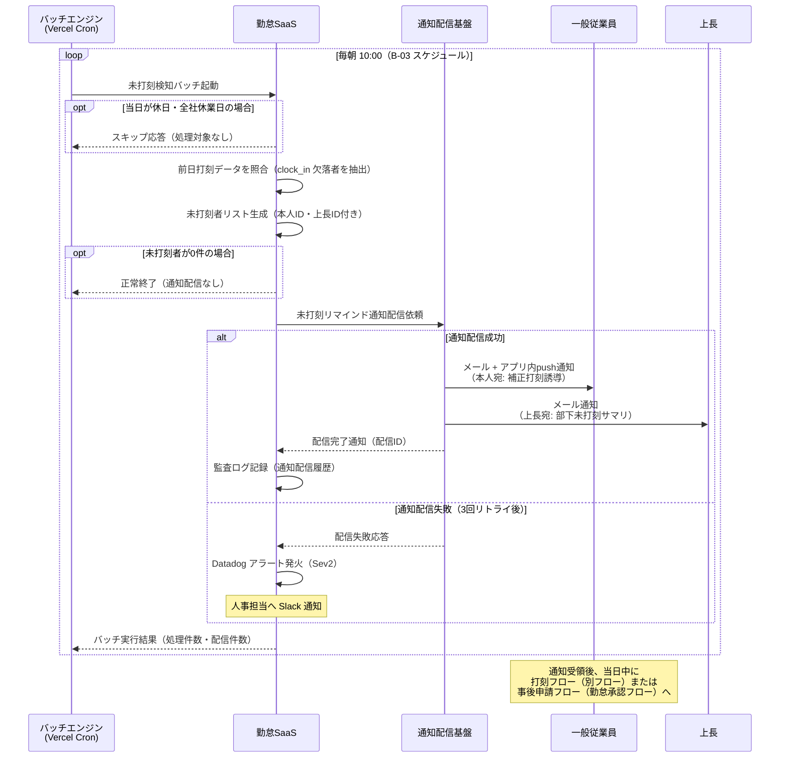
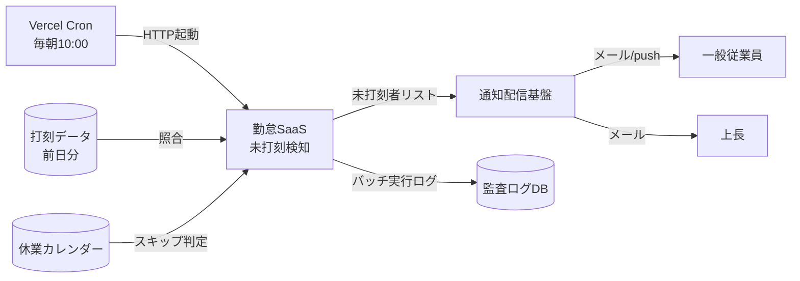

<!--
本ファイルは einja-project-function-spec Skill の動作確認用サンプル（業務フロー単位）です。
本来の出力先は docs/project/function-specs/function-spec-{flow_id}.md（1リポジトリ1プロジェクト前提）。

- 入力サンプル1: ../requirements.md（§2.1.2 TO-BE 業務フロー S3 / §2.2 C-01 / §6.2 B-03）
- 入力サンプル2: ../screen-flow-url.md（本フローは通知のみで関連画面なし → related_screens は空配列）
- Skill 定義: .claude/skills/einja-project-function-spec/

本フローは新規 FN-XXX を採番せず、既存 FN-002（未打刻検知バッチ）/ FN-005（通知配信機能）の
2機能の組み合わせのみで成立する。FN-005 は『打刻フロー』『勤怠承認フロー』に続き本フローで
3 フロー目の共有となり、N対N関係の実証範囲が拡大する。

時系列分離: 打刻フローは当日の打刻アクション中心、本フローは翌朝の検知バッチ → 未打刻者への通知。
打刻フロー時系列（前日）と本フロー時系列（翌朝 10:00）を明確に切り分けて記述する。

監査ログ（FN-013 相当）は横断的に暗黙呼び出しされる前提で、本フローの §3 機能一覧には含めない。
-->

# 業務フロー機能仕様: 未打刻アラートフロー

## 1. 業務フロー概要

### 1.1 基本情報

| 項目 | 内容 |
|------|------|
| 業務フローID | sample-attendance-saas__flow__missed_punch_alert |
| 業務フロー名 | 未打刻アラートフロー |
| 関連 requirements.md セクション | §2.1.2 TO-BE 業務フロー S1 → S3 → A2 / §2.2 課題C-01 / §6.2 B-03 |
| 関連業務課題ID（§2.2 課題ID） | C-01（紙タイムカードの回収・転記による集計工数）の解消に伴う打刻漏れ抑制 |

本フローは「打刻フロー」の翌朝側（前日の未打刻者抽出 → リマインド通知 → 当日の補正打刻誘導）を担当する独立フローである。**打刻フローが当日打刻アクション中心**であるのに対し、**本フローは翌朝の検知バッチ起点**となり、時系列で明確に分離されている。

### 1.2 アクター

| アクター | 区分 | 役割 |
|----------|------|------|
| バッチエンジン（Vercel Cron） | システム | 毎朝 10:00 に未打刻検知バッチを起動する |
| 勤怠SaaS（システム） | システム | 前日打刻データの照合・未打刻者抽出・通知配信依頼 |
| 通知配信基盤 | システム | メール（社内SMTP）・アプリ内push通知の一元配信 |
| 一般従業員 | 利用者 | 通知を受領し、当日中に補正打刻（または事後申請）を行う |
| 上長 | 利用者 | 部下の未打刻通知をメールで受領し、対応状況をモニタする |

### 1.3 AS-IS / TO-BE 要約

#### AS-IS（現状）

紙タイムカード運用のため、打刻漏れは**月末集計時に人事部が手作業で発見**する形となり、発生から発覚までに平均2〜3週間のタイムラグがあった。発覚時には本人記憶も曖昧で、上長承認のうえで Excel 集計簿に推定値を手入力する運用となっており、打刻漏れ率は約30%、月次集計の遅延要因の一つとなっていた。

#### TO-BE（あるべき姿）

毎朝 10:00 に未打刻検知バッチが前日打刻データを照合し、未打刻者を抽出する。抽出された従業員と上長に対し、通知配信基盤がメール + アプリ内push通知で**当日中の補正打刻を促す**。これにより打刻漏れ発覚〜対応のリードタイムを「数週間 → 当日」に短縮し、月次集計時の補正工数を最小化する（KPI: requirements.md §1.3 未打刻アラート発生率 30% → 5%）。

---

## 2. 業務フロー詳細

### 2.1 sequenceDiagram（時系列インタラクション図）

打刻フロー（前日）の翌朝に起動する独立フロー。**当日の打刻アクションとは時系列が分離されている**点に注意する。

### 2.2 ステップ別表

sequenceDiagram の各メッセージと 1:1 対応する詳細表。

| ステップ | アクター | 操作 | 関連画面 stable_id | 関連機能ID | 入出力 | 例外 |
|---------|---------|------|------------------|-----------|--------|------|
| 1 | バッチエンジン | 未打刻検知バッチ起動（毎朝 10:00） | - | FN-002 | 入力: cron schedule / 出力: バッチ実行コンテキスト | バッチ起動失敗時は Vercel Cron リトライ |
| 2 | 勤怠SaaS | 休日・全社休業日判定（スキップ判定） | - | FN-002 | 入力: 当日日付・休業カレンダー / 出力: 処理可否フラグ | 休業カレンダー未登録時は警告ログ |
| 3 | 勤怠SaaS | 前日打刻データ照合（clock_in 欠落者抽出） | - | FN-002 | 入力: 前日打刻データ / 出力: 未打刻者リスト | 打刻データテーブルアクセス失敗は Sev2 |
| 4 | 勤怠SaaS | 通知配信依頼（未打刻者0件時はスキップ） | - | FN-005 | 入力: 未打刻者リスト（本人ID・上長ID） / 出力: 配信ジョブID | 0件時はジョブ生成せず正常終了 |
| 5 | 通知配信基盤 | 本人宛メール + アプリ内push通知配信 | - | FN-005 | 入力: 本人ID・補正打刻誘導テンプレ / 出力: 配信完了通知 | 3回リトライ後失敗は Datadog アラート |
| 6 | 通知配信基盤 | 上長宛メール通知配信（部下未打刻サマリ） | - | FN-005 | 入力: 上長ID・部下未打刻リスト / 出力: 配信完了通知 | 同上 |
| 7 | 勤怠SaaS | バッチ実行結果記録（処理件数・配信件数） | - | FN-002 | 入力: 配信結果 / 出力: バッチ実行ログ | Datadog 連携失敗時は社内ログのみ |

---

## 3. 機能一覧

本業務フローで使う機能を `FN-XXX` 独立採番で列挙する。`requirements.md §6` 機能要件サマリへの**書き戻しは行わない**。

**本フローは新規機能を採番せず、既存 FN-002 / FN-005 の再利用のみで成立する**（N対N関係の実証）。

| FN-XXX | 機能名 | 概要 | 関連画面 stable_id | 関連業務ステップ | 優先度 | 備考 |
|--------|--------|------|------------------|----------------|--------|------|
| FN-002 | 未打刻検知バッチ | 毎朝10:00に当日未打刻者を抽出する | - | §2.2 ステップ1, 2, 3, 7 | MUST | requirements.md §6.2 B-03 対応 / **本機能は『打刻フロー』とも共有**（打刻フローでは未打刻リマインドのトリガとして言及、本フローでは検知バッチの主実行フローとして扱う） |
| FN-005 | 通知配信機能 | システムからのメール・アプリ内push通知を一元配信する（複数フロー共有） | - | §2.2 ステップ4, 5, 6 | MUST | **本機能は『打刻フロー』『勤怠承認フロー』とも共有**（N対N関係・本フローで3フロー目共有）。未打刻リマインド / 承認依頼 / 結果通知 等の配信を担う共通基盤 |

優先度凡例: `MUST` = 必須機能 / `SHOULD` = 推奨機能 / `MAY` = 任意機能

---

## 4. データの流れ

システム間連携・データ授受の概要を記述する。詳細な API 仕様・データスキーマは設計フェーズ（design.md）で扱う。

### 4.1 連携先一覧

| 連携先 | 連携方式 | データ形式 | タイミング | 関連 requirements.md §9 連携先ID |
|--------|---------|----------|-----------|---------------------------------|
| 通知配信基盤（メール送信） | SMTP（社内SMTPサーバ経由） | プレーンテキスト + HTML | 非同期（キュー経由） | 該当なし（社内基盤、§9 連携外） |
| アプリ内push通知 | WebSocket（Vercel Functions） | JSON | 同期 | 該当なし |
| バッチスケジューラ | Vercel Cron（HTTPトリガ） | JSON | 毎朝10:00（B-03） | 該当なし |
| 監査ログストレージ | API（別ストレージ） | JSON | 同期 | 該当なし（§7.5 監査ログ） |

### 4.2 データフロー図（任意）

---

## 5. 業務ルール・バリデーション（業務観点）

業務上の制約・承認フロー・例外処理を整理する。技術的バリデーション（型チェック等）は design.md / Issue 仕様で扱う。

### 5.1 業務ルール一覧

| ルールID | 内容 | 根拠（規程・契約・法令等） | 例外条件 |
|---------|------|------------------------|---------|
| BR-01 | 未打刻検知は前日分を翌朝 10:00 に1日1回実施する（**打刻フローの当日打刻アクションとは時系列分離**） | requirements.md §6.2 B-03 / 社内就業規則 | 全社休業日・休日はスキップ（休業カレンダー参照） |
| BR-02 | 未打刻通知は本人と上長の双方に配信し、当日中の補正打刻または事後申請を促す | KPI（未打刻アラート発生率 30% → 5%） | 退職予定者・休職者は配信対象外 |
| BR-03 | 通知配信が3回リトライしても失敗した場合は Sev2 として人事担当に Slack エスカレーション | 運用設計（要件定義 §11） | なし |

### 5.2 承認フロー（該当する場合）

本フロー自体に承認は不要（通知配信のみのバッチフロー）。**補正打刻・事後申請の承認は別フロー（打刻フロー・勤怠承認フロー）が担当**するため、本フローでは承認段階を持たない。

### 5.3 例外処理（該当する場合）

- **休業日スキップ**: 当日が全社休業日・休日の場合、未打刻者抽出処理を実行せずバッチを正常終了する（BR-01 例外）。休業カレンダー未登録時は警告ログを出して通常実行に進む
- **未打刻者0件**: 抽出結果が0件の場合は通知配信依頼を行わず、バッチ実行ログのみ記録して正常終了
- **通知配信失敗（FN-005）**: 3回リトライ後 Datadog アラート発火（Sev2）。人事担当には Slack 通知。当該未打刻者へは翌朝のバッチ再実行時に再通知される（重複通知抑止は配信ジョブID単位で制御）
- **バッチ自体の失敗**: Vercel Cron のリトライ機能で1回まで自動再実行。再実行も失敗した場合は Sev1 として情報システム室長へ即時エスカレーション

---

## 6. 関連画面一覧

本フローは通知配信のみのバッチフローであり、**専用 UI 画面は持たない**。`related_screens` は空配列とする。

通知を受領した従業員の補正打刻動作は `sample-attendance-saas__punch`（打刻フロー側で管理）、事後申請は `sample-attendance-saas__request`（勤怠承認フロー側で管理）に遷移するが、これらは別フローの責務であり本フローの関連画面には含めない。

---

## 7. 未確定事項・前提条件

設計フェーズ（design.md）へ申し送る未確定事項・前提条件を列挙する。

### 7.1 未確定事項

| 項目 | 現時点の状況 | 確定時期・確定方法 | 影響範囲 |
|------|------------|------------------|---------|
| 工場の3交代制シフトに対応した「未打刻」定義（夜勤明けは前日扱いか当日扱いか） | requirements.md §15.4 TBD-03 で未確定 | 要件定義完了前（2026-06-30）/ 工場長ヒアリング | FN-002 抽出ロジック |
| 退職予定者・休職者の配信除外マスタ管理方式 | BR-02 例外条件に記述のみ、詳細運用未確定 | 設計フェーズ初期 / 人事部レビュー | FN-002 / 配信対象者フィルタ |
| 重複通知抑止のキー設計（配信ジョブID vs 本人ID+日付） | 例外処理 5.3 に方針のみ記述 | 設計フェーズ初期 | FN-005 共通基盤の API 仕様 |

### 7.2 前提条件

- 打刻フロー側で `clock_in` データが当日中に保存される運用が確立済み（前日分照合の前提）
- 休業カレンダーが人事担当により事前登録されている（祝祭日・全社休業日含む）
- 通知配信基盤（FN-005）が打刻フロー・勤怠承認フローと共通化されている（社内SMTPサーバ + WebSocket基盤、3フロー共有）

### 7.3 設計フェーズへの申し送り

- 未打刻判定ロジックのタイムゾーン制御（深夜勤務者・3交代制対応）
- 通知配信基盤（FN-005）の API インタフェース仕様（**3フロー共有の共通テンプレート設計**、用途別テンプレート切替方式）
- バッチ実行の冪等性確保（手動再実行時の二重通知防止）
- 上長宛サマリ通知のグルーピング方針（部下複数人未打刻時の通知1通化）
