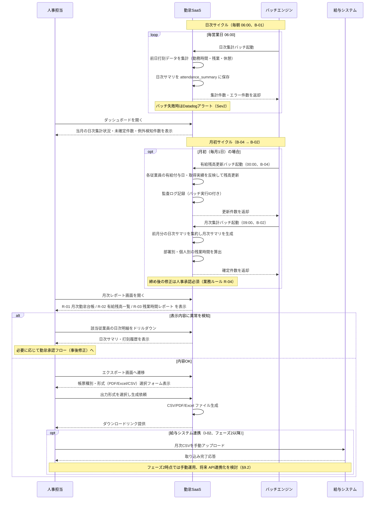
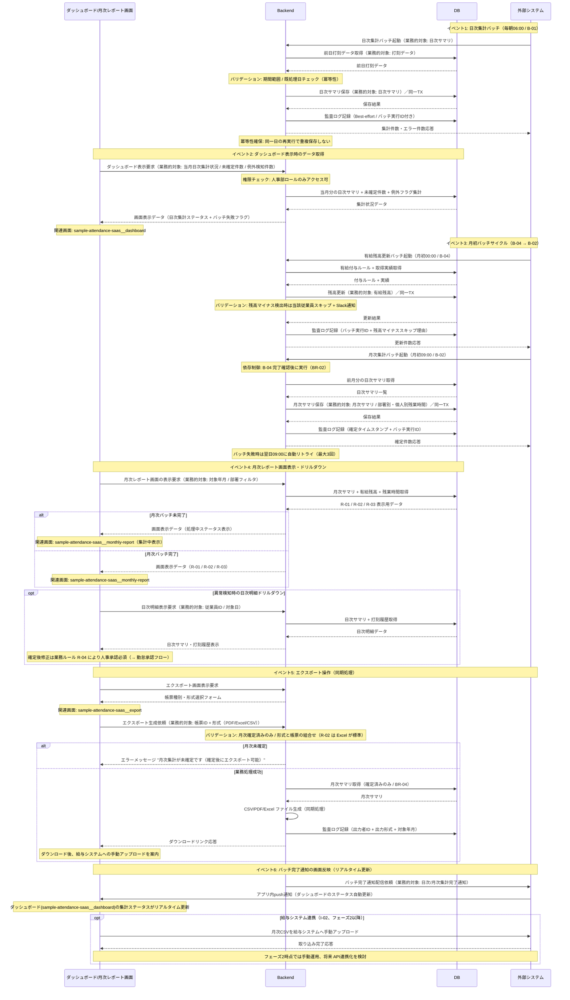
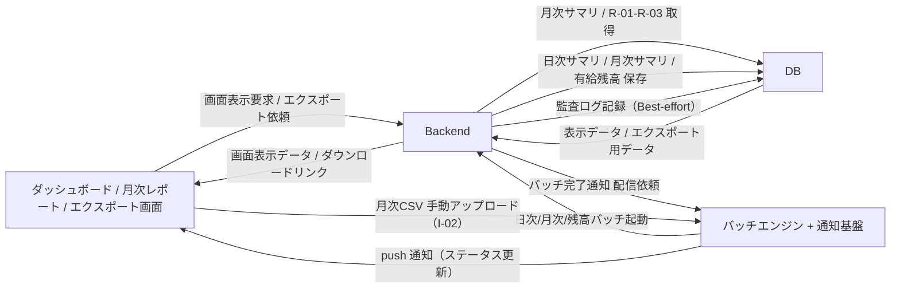

<!--
本ファイルは einja-project-function-spec Skill の動作確認用サンプル（業務フロー機能仕様: §2.1 業務観点 + §2.2 システム観点）です。
本来の出力先は docs/project/function-specs/function-spec-{flow_id}.md（1リポジトリ1プロジェクト前提）。
einja-project-function-spec Skill により生成される機能仕様書の実例として配置しています。

- 入力サンプル1: ../requirements.md（§2.1.2 TO-BE 業務フロー H1〜H3 / §6.1 F-05 / §6.2 B-01・B-02・B-04 / §6.3 R-01〜R-03 / §9.1 I-02）
- 入力サンプル2: ../screen-flow-url.md（stable_id 参照キー）
- Skill 定義: .claude/skills/einja-project-function-spec/
- スキーマ定義: .claude/skills/einja-project-function-spec/references/manifest-schema.md
- セクション構成: .claude/skills/einja-project-function-spec/references/output-template.md

本フローは requirements.md §2.1.2 TO-BE の H1（人事部ダッシュボードでの状況確認）/ H2（月次集計の自動取得）/ H3（CSV/PDFで給与システムへ連携）+ S1→S2（日次/月次バッチ自動集計）を実現する。
B-04 有給残高更新バッチ は独立フロー化せず、月次の集計サイクルと一体運用するため本フローに内包する（FN-012）。
監査ログ記録（F-08 / 旧 FN-008 領域）は全フロー横断の暗黙呼び出しとして audit_log 側で扱い、本フローの §3 機能一覧には含めない。
注意: requirements.md §6 機能要件サマリへの書き戻しは行わない（独立採番のFN-XXXで運用）。

本サンプルは「§2 二段構成 + §3 機能カード + §4.2 内部データフロー + §5.4 主要技術制約」の
リファレンス実装 time_punch.md に揃えた構造で記述している。
-->

# 業務フロー機能仕様: 月次集計フロー

## 1. 業務フロー概要

### 1.1 基本情報

| 項目 | 内容 |
|------|------|
| 業務フローID | sample-attendance-saas__flow__monthly_aggregation |
| 業務フロー名 | 月次集計フロー |
| 関連 requirements.md セクション | §2.1.2 TO-BE 業務フロー（S1→S2→H1→H2→H3）/ §2.3 業務ルール R-04 / §6.1 F-05 / §6.2 B-01・B-02・B-04 / §6.3 R-01・R-02・R-03 / §9.1 I-02 |
| 関連業務課題ID（§2.2 課題ID） | C-01（紙運用の集計工数）/ C-03（Excel集計の属人化）/ C-05（月末締めの遅延） |

### 1.2 アクター

| アクター | 区分 | 役割 |
|----------|------|------|
| 人事担当 | 利用者 | ダッシュボードで日次集計状況を確認し、月次レポートを表示・CSV/PDFエクスポートして給与システムに連携する |
| 勤怠SaaS（システム） | システム | 日次/月次バッチによる集計、月次レポート表示、CSV/PDF生成、有給残高更新を担う |
| バッチエンジン | システム | 日次（06:00）/月次（月初09:00）/有給残高（月初00:00）のスケジューリング実行を担う |
| 給与システム（外部） | 外部システム | 月次CSVを取り込み給与計算を行う（I-02、フェーズ2以降） |

### 1.3 AS-IS / TO-BE 要約

#### AS-IS（現状）

人事部は月初に部署単位で**紙タイムカードを回収**し、Excelに手作業で転記して月次集計を行っている。集計には月20時間を要し、転記ミス・読み取り困難・打刻漏れの照会で**月次締めが翌月10日前後**まで遅延する。**有給残高は別Excelで個別更新**しており、給与システムへは**月次集計結果を手入力**する運用のため、二重入力と照合作業がボトルネックとなっている。

#### TO-BE（あるべき姿）

打刻データはアプリから自動保存され、**日次06:00の集計バッチ（B-01）が前日分の勤怠サマリを生成**、**月初09:00の月次集計バッチ（B-02）が前月分の月次サマリを確定**する。人事担当はダッシュボードで日次集計状況をリアルタイムに確認し、**月初00:00の有給残高更新バッチ（B-04）**完了後、月次レポート画面で R-01 月次勤怠台帳 / R-02 有給残高一覧 / R-03 残業時間レポート を表示・エクスポート画面から CSV / PDF / Excel で出力する。出力CSVを給与システムへアップロードすることで、月次集計工数を 20h → 4h（80%削減）、月次締めを翌月3営業日以内（R-04）に短縮する。

---

## 2. 業務フロー詳細

本セクションは **業務観点（§2.1）** と **システム観点（§2.2）** の二段構成。§2.1 はアクター間の業務メッセージ、§2.2 は Browser / Backend / DB / 外部システムの4層インタラクションを記述する。両者は同じ業務フローの異なる視点であり、ステップ番号で相互参照する（§2.3 ステップ別表で観点列により区別）。

### 2.1 業務観点 sequenceDiagram（時系列インタラクション図）

当該業務フローのアクター間のメッセージ授受を時系列で記述する。`requirements.md §2.1.2` の flowchart（俯瞰用）と相補関係。

### 2.2 システム観点 sequenceDiagram

§2.1 の業務観点メッセージを、システム内部（Browser / Backend / DB / Ext（外部システム））でどう処理するかを 4 層 participant で記述する。
月次集計フローは Browser・Backend・DB の画面表示・エクスポート経路に加え、Ext（バッチエンジン + 給与SaaS）という外部システム連携を持つため、4 層構成が適切。

**canonical participant 識別子（固定）**: `Browser` / `Backend` / `DB` / `Ext`（表示名はフロー固有の通称併記可。本フローでは Ext = バッチエンジン / 給与SaaS）

### 2.3 ステップ別表

§2.1 / §2.2 の各メッセージと 1:1 対応する詳細表。**観点列で業務 / システムを区別する**。

| ステップ | 観点 | アクター / 参加者 | 操作 | 関連画面 stable_id | 関連機能ID | 入出力 | 例外 |
|---------|------|------------------|------|------------------|-----------|--------|------|
| 1 | 業務 | バッチエンジン / 勤怠SaaS | 日次集計バッチ実行（毎朝06:00、B-01） | - | FN-008 | 入力: 前日打刻データ / 出力: 日次サマリ・集計件数 | バッチ失敗時はDatadogアラート（Sev2）+ Slack通知 |
| 2 | 業務 | 人事担当 | ダッシュボードで日次集計状況を確認 | sample-attendance-saas__dashboard | FN-010 | 入力: なし / 出力: 当月日次集計状況・未確定件数 | セッション切れ時はlogin画面へリダイレクト |
| 3 | 業務 | バッチエンジン / 勤怠SaaS | 有給残高更新バッチ実行（月初00:00、B-04） | - | FN-012 | 入力: 有給付与ルール・取得実績 / 出力: 更新後残高・監査ログ | 残高マイナス検出時は人事担当へSlack通知 |
| 4 | 業務 | バッチエンジン / 勤怠SaaS | 月次集計バッチ実行（月初09:00、B-02） | - | FN-009 | 入力: 前月日次サマリ / 出力: 月次サマリ・部署別残業時間 | バッチ失敗時はDatadogアラート（Sev2）、翌日リトライ |
| 5 | 業務 | 人事担当 / 勤怠SaaS | 月次レポート画面を開く（R-01 / R-02 / R-03 表示） | sample-attendance-saas__monthly-report | FN-010 | 入力: 対象年月・部署フィルタ / 出力: R-01・R-02・R-03 表示 | 月次バッチ未完了の場合は「集計中」表示 |
| 6 | 業務 | 人事担当 / 勤怠SaaS | 日次明細ドリルダウン（例外検知時） | sample-attendance-saas__monthly-report | FN-010 | 入力: 従業員ID / 対象日 / 出力: 日次サマリ・打刻履歴 | 確定後修正は業務ルール R-04 により人事承認必須 |
| 7 | 業務 | 人事担当 | エクスポート画面へ遷移し、帳票種別・形式を選択 | sample-attendance-saas__export | FN-011 | 入力: 帳票ID（R-01/R-02/R-03）/ 形式（PDF/Excel/CSV）/ 出力: ダウンロードリンク | 形式不一致（R-02 は Excel が標準）は警告表示 |
| 8 | 業務 | 人事担当 → 給与システム | 月次CSV を給与システムへ手動アップロード（I-02） | sample-attendance-saas__export | FN-011 | 入力: CSVファイル / 出力: 取り込み結果 | I-02 は手動運用のためアップロード失敗時は翌日再送（§9.2） |
| S1 | システム | 外部システム → Backend | 日次集計バッチ起動（B-01） | - | FN-008 | 入力: バッチ実行コンテキスト / 出力: 集計件数・エラー件数 | 同一日の再実行は冪等性キーで重複防止 |
| S2 | システム | Backend → DB | 前日打刻取得 + 日次サマリ保存（同一TX） | - | FN-008 | 入力: 前日打刻データ / 出力: 日次サマリ | DB接続エラー時はバッチ失敗→Sev2アラート |
| S3 | システム | Browser → Backend | ダッシュボード表示要求 | sample-attendance-saas__dashboard | FN-010 | 入力: セッショントークン / 出力: 当月日次集計状況 | 人事部ロール以外は403相当 |
| S4 | システム | 外部システム → Backend | 有給残高更新バッチ起動（B-04） | - | FN-012 | 入力: 月初日付 / 出力: 更新件数 | 残高マイナス検出時は当該従業員スキップ |
| S5 | システム | 外部システム → Backend | 月次集計バッチ起動（B-02 / B-04 完了後） | - | FN-009 | 入力: 前月日次サマリ / 出力: 月次サマリ | 3回連続失敗時はSev1エスカレーション |
| S6 | システム | Browser → Backend | 月次レポート画面の表示要求 | sample-attendance-saas__monthly-report | FN-010 | 入力: 対象年月 + 部署フィルタ / 出力: R-01 / R-02 / R-03 表示用データ | 月次バッチ未完了時は処理中表示 |
| S7 | システム | Browser → Backend | 日次明細ドリルダウン要求 | sample-attendance-saas__monthly-report | FN-010 | 入力: 従業員ID + 対象日 / 出力: 日次サマリ・打刻履歴 | 確定後修正は勤怠承認フロー側へ誘導 |
| S8 | システム | Browser → Backend | エクスポート生成依頼（同期処理） | sample-attendance-saas__export | FN-011 | 入力: 帳票ID + 形式 / 出力: ダウンロードリンク | 月次未確定時は業務エラー（"月次集計が未確定です"） |
| S9 | システム | Backend → 外部システム | バッチ完了通知配信依頼 | - | FN-010 | 入力: バッチ完了通知 / 出力: 配信受付応答 | 通知失敗時は次回画面更新時に最新化 |
| S10 | システム | 外部システム → Browser | アプリ内push通知（ステータス自動更新） | sample-attendance-saas__dashboard | FN-010 | 入力: 通知ペイロード / 出力: 画面ステータス更新 | push 接続切断時は手動リロードで反映 |

ステップ番号の対応関係: 業務ステップ 1（日次バッチ）は システムステップ S1-S2、業務ステップ 3-4（月初バッチ）は システムステップ S4-S5、業務ステップ 2,5-6（画面表示）は システムステップ S3, S6-S7、業務ステップ 7-8（エクスポート + 連携）は システムステップ S8 に対応する。

---

## 3. 機能一覧

本業務フローで使う機能を `FN-XXX` 独立採番で列挙する。`requirements.md §6` 機能要件サマリへの**書き戻しは行わない**。

§3.1 機能サマリ表で全機能を俯瞰し、MUST 機能は §3.2 機能カードで詳細化する。

### 3.1 機能サマリ表

| FN-XXX | 機能名 | 概要 | 関連画面 stable_id | 関連業務ステップ | 優先度 | 備考 |
|--------|--------|------|------------------|----------------|--------|------|
| FN-008 | 日次集計バッチ機能 | 毎朝06:00に前日打刻データを集計し日次サマリを生成する | - | §2.3 ステップ1 / S1-S2 | MUST | requirements.md §6.2 B-01 対応 / §6.1 F-05（勤怠集計）の日次分を担う |
| FN-009 | 月次集計バッチ機能 | 月初09:00に前月日次サマリを集約し月次サマリを確定する | - | §2.3 ステップ4 / S5 | MUST | requirements.md §6.2 B-02 対応 / §6.1 F-05 の月次分を担う / B-04 完了後実行（BR-02） |
| FN-010 | 月次レポート表示機能 | ダッシュボードおよび月次レポート画面で R-01 月次勤怠台帳 / R-02 有給残高一覧 / R-03 残業時間レポート を表示する。日次明細へのドリルダウン操作とバッチ完了通知のリアルタイム反映を含む | sample-attendance-saas__dashboard, sample-attendance-saas__monthly-report | §2.3 ステップ2, 5, 6 / S3, S6-S7, S9-S10 | MUST | requirements.md §6.3 R-01・R-02・R-03 の画面表示分を担う / §6.1 F-06 の表示側 |
| FN-011 | CSV/PDF/Excelエクスポート機能 | エクスポート画面から R-01（PDF）/ R-02（Excel）/ R-03（PDF）/ 給与連携CSV を生成・ダウンロード可能にする | sample-attendance-saas__export | §2.3 ステップ7, 8 / S8 | MUST | requirements.md §6.1 F-06 / §6.3 R-01・R-02・R-03 のエクスポート分 / §9.1 I-02 の月次CSV生成を担う |
| FN-012 | 有給残高更新バッチ機能 | 月初00:00に各従業員の有給付与・取得実績を反映し残高を更新する | - | §2.3 ステップ3 / S4 | MUST | requirements.md §6.2 B-04 対応 / 独立フロー化せず本フローに内包 |

優先度凡例: `MUST` = 必須機能 / `SHOULD` = 推奨機能 / `MAY` = 任意機能

### 3.2 機能カード（MUST 機能の詳細）

#### FN-008 日次集計バッチ機能

- **入力**: バッチ実行コンテキスト（実行日 / 対象期間 = 前日） / 前日打刻データ / 従業員マスタ
- **主要バリデーション**: 期間範囲（前日のみ）/ 一意性（既処理日チェック = 冪等性キー / 同一日の重複保存禁止）
- **処理ステップ**: §2.2 ステップ S1〜S2 参照（毎朝06:00起動 → 前日打刻データ取得 → 勤務時間・残業・休憩を集計 → 日次サマリ保存（同一TX） → 監査ログ記録（Best-effort））
- **出力**: 集計件数・エラー件数応答 → ダッシュボード(sample-attendance-saas__dashboard)に集計ステータス反映
- **業務エラー**:
  - バッチ実行失敗 → Datadogアラート（Sev2） + Slack通知（画面表示なし）
  - 既処理日への再実行 → 冪等性キーで重複スキップ + 警告ログ
  - 打刻データ欠損（シフトあり・打刻なし） → 例外検知フラグ付与（画面で件数表示）
- **関連画面**: なし（バックエンド処理のみ。結果はダッシュボード側で表示）

#### FN-009 月次集計バッチ機能

- **入力**: バッチ実行コンテキスト（対象年月 = 前月）/ 前月日次サマリ / B-04 完了ステータス
- **主要バリデーション**: 依存（B-04 有給残高更新完了後に実行 / BR-02）/ 期間範囲（前月のみ）/ 一意性（同一月の重複確定禁止）
- **処理ステップ**: §2.2 ステップ S5 参照（月初09:00起動 → B-04 完了確認 → 前月日次サマリ取得 → 部署別・個人別残業時間算出 → 月次サマリ保存（同一TX） → 確定タイムスタンプ + バッチ実行ID を監査ログ記録）
- **出力**: 確定件数応答 → 月次レポート画面(sample-attendance-saas__monthly-report)に R-01 / R-02 / R-03 表示反映
- **業務エラー**:
  - B-04 未完了 → 月次バッチ起動延期 + 人事担当へSlack通知
  - バッチ失敗 → 翌日09:00に自動リトライ（最大3回） / 3回連続失敗時はSev1エスカレーション
  - 月次確定後の再実行 → 一意性チェックでブロック（人事承認必須経路へ）
- **関連画面**: なし（バックエンド処理のみ。結果は月次レポート画面側で表示）

#### FN-010 月次レポート表示機能

- **入力**: 対象年月 / 部署フィルタ / 従業員ID（ドリルダウン時）/ ログインユーザーの権限情報
- **主要バリデーション**: 権限（人事部ロールのみアクセス可）/ 必須（対象年月）/ 期間範囲（過去5年分まで）
- **処理ステップ**: §2.2 ステップ S3, S6-S7, S9-S10 参照（ダッシュボード表示要求 → 当月日次集計状況取得 → 月次レポート画面で R-01 / R-02 / R-03 表示 → 異常検知時の日次明細ドリルダウン → バッチ完了通知の push でリアルタイム更新）
- **出力**: 画面表示データ（日次集計ステータス / R-01・R-02・R-03 / 日次明細） → エクスポート画面(sample-attendance-saas__export)への導線
- **業務エラー**:
  - 月次バッチ未完了 → "集計処理中です（完了後にレポート表示されます）"
  - 人事部ロール以外のアクセス → "本画面の閲覧権限がありません"
  - 過去5年超のデータ要求 → "閲覧可能期間は過去5年間です"
  - 確定後修正の試行 → "確定後の修正は人事承認が必要です（→ 承認フロー）"
- **関連画面**: sample-attendance-saas__dashboard（集計ステータス俯瞰）/ sample-attendance-saas__monthly-report（R-01 / R-02 / R-03 表示・ドリルダウン）

#### FN-011 CSV/PDF/Excelエクスポート機能

- **入力**: 帳票ID（R-01 / R-02 / R-03 / 給与連携CSV）/ 形式（PDF / Excel / CSV）/ 対象年月 / 部署フィルタ
- **主要バリデーション**: 必須（帳票ID / 形式 / 対象年月）/ 一意性（月次確定済みのみ出力可 / BR-04）/ 組合せ（R-02 は Excel が標準、CSV/PDF は警告表示）
- **処理ステップ**: §2.2 ステップ S8 参照（エクスポート画面表示 → 帳票種別・形式選択 → 月次サマリ取得（確定済みのみ） → CSV/PDF/Excel ファイル生成（同期処理） → ダウンロードリンク提供 → 出力監査ログ記録）
- **出力**: ダウンロードリンク → ユーザーがファイルをダウンロード後、給与システム(Payroll)へ手動アップロード
- **業務エラー**:
  - 月次未確定 → "月次集計が未確定です（確定後にエクスポート可能）"
  - 形式と帳票の不一致（R-02 を PDF 指定等） → "この帳票は Excel 形式が推奨です（このまま続行 / 形式変更）" 警告
  - ファイル生成タイムアウト → "出力タイムリミットを超えました（部署フィルタで件数を絞ってください）"
  - 給与CSV出力時のアップロード失敗 → 翌日再送案内（§9.2、手動運用）
- **関連画面**: sample-attendance-saas__export（出力操作）/ sample-attendance-saas__monthly-report（戻り先）

#### FN-012 有給残高更新バッチ機能

- **入力**: バッチ実行コンテキスト（実行日 = 月初） / 有給付与ルール / 各従業員の取得実績
- **主要バリデーション**: 期間範囲（月初のみ実行）/ 一意性（同一月の二重付与防止 = 冪等性キー）/ 残高（マイナス検出時は当該従業員スキップ）
- **処理ステップ**: §2.2 ステップ S4 参照（月初00:00起動 → 有給付与ルール + 取得実績取得 → 各従業員の残高計算 → 残高マイナス検出時は該当者スキップ + Slack通知 → 残高更新（同一TX） → 監査ログ記録）
- **出力**: 更新件数応答 → 月次レポート画面の R-02 有給残高一覧 に反映
- **業務エラー**:
  - 残高マイナス検出 → 当該従業員の更新スキップ + 人事担当へSlack通知（事後に承認フローで補正）
  - 同一月の再実行 → 冪等性キーで二重付与防止 + 警告ログ
  - バッチ失敗 → Datadogアラート（Sev2） + B-02 月次集計バッチの実行延期
- **関連画面**: なし（バックエンド処理のみ。結果は月次レポート画面 R-02 で表示）

機能カードの記述ルール:
- MUST 機能は必須。本フローは全機能 MUST のため全件カード化
- 処理ステップは §2.2 と整合させ、詳細が §2.2 にある場合は「§2.2 ステップ N 参照」でリダイレクト
- 業務エラーは「業務エラーパターン → 画面メッセージ」のペアで記述（HTTP ステータスや例外クラス名は記載しない）

---

## 4. データの流れ

システム間連携・データ授受の概要を記述する。**外部システム連携**（§4.1）と **内部システム間データフロー**（§4.2）の二段構成。詳細な API 仕様・データスキーマは設計フェーズ（design.md）で扱う。

### 4.1 外部システム連携

外部システム（自社外システム・SaaS・バッチ連携先等）との連携を整理する。

| 連携先 | 連携方式 | データ形式 | タイミング | 関連 requirements.md §9 連携先ID |
|--------|---------|----------|-----------|---------------------------------|
| 給与システム | CSVファイル手動アップロード（将来 API連携化を検討） | CSV | 非同期（月次バッチ後の手動オペレーション） | I-02（フェーズ2着手前にフィールド定義確定） |
| バッチエンジン（社内基盤） | スケジューラ呼び出し（cron） | JSON（実行コンテキスト） | 同期（cron トリガー） | 該当なし（社内基盤） |
| 通知配信基盤（push） | WebSocket（Vercel Functions） | JSON | 非同期（バッチ完了後） | 該当なし |
| 監査ログストレージ | API（別ストレージ） | JSON | 同期（バッチ実行ごと） | 該当なし（§7.5 監査ログ） |

### 4.2 内部システム間データフロー

Browser ↔ Backend ↔ DB 間の **概念レベル** でのデータの流れを整理する。具体的 API パス・テーブル名・カラム名は記載しない（design.md / Issue 仕様で扱う）。

| 流れ | 業務的対象（データ名） | トリガー | 方向 | タイミング | 備考 |
|------|----------------------|---------|------|----------|------|
| 1 | 当月日次集計状況 / 例外検知件数 | ダッシュボード表示要求（GET） | DB → Backend → Browser | 同期 | 人事部ロール権限チェック付き |
| 2 | 日次サマリ | 日次集計バッチ起動（毎朝06:00） | 外部システム → Backend → DB | 非同期（バッチ） | 冪等性キーで同一日の重複保存防止 |
| 3 | 有給残高 | 有給残高更新バッチ起動（月初00:00） | 外部システム → Backend → DB | 非同期（バッチ） | 残高マイナス検出時は当該従業員スキップ |
| 4 | 月次サマリ | 月次集計バッチ起動（月初09:00、B-04 完了後） | 外部システム → Backend → DB | 非同期（バッチ） | 一意性キーで同一月の重複確定防止 |
| 5 | R-01 / R-02 / R-03 月次レポート | 月次レポート画面表示要求（GET） | DB → Backend → Browser | 同期 | 月次バッチ未完了時は処理中表示 |
| 6 | 日次サマリ + 打刻履歴（ドリルダウン） | 日次明細表示要求（GET） | DB → Backend → Browser | 同期 | 確定後修正は勤怠承認フローへ誘導 |
| 7 | エクスポートファイル（CSV/PDF/Excel） | エクスポート生成依頼（POST） | DB → Backend → Browser | 同期（ファイル生成 + ダウンロード） | 月次確定済みのみ出力可。出力監査ログ必須 |
| 8 | バッチ完了通知 / 画面ステータス更新 | バッチ完了 | Backend → 外部システム → Browser | 非同期（push 通知） | push 接続切断時は手動リロードで反映 |

内部データフロー図:

---

## 5. 業務ルール・バリデーション（業務観点）

業務上の制約・承認フロー・例外処理を整理する。技術的バリデーション（型チェック等）は design.md / Issue 仕様で扱う。

### 5.1 業務ルール一覧

| ルールID | 内容 | 根拠（規程・契約・法令等） | 例外条件 |
|---------|------|------------------------|---------|
| BR-01 | 月次勤怠は翌月3営業日以内に確定する | 給与計算スケジュール（requirements.md §2.3 R-04） | 確定後の修正は人事承認必須 |
| BR-02 | 月次集計は B-04（有給残高更新）完了後に B-02（月次集計）を実行する | 残高情報の整合性確保 | バッチ依存関係はジョブネット制御で担保 |
| BR-03 | 日次集計バッチが失敗した日は人事担当が手動再実行できる | 月次締めKPI（翌月3営業日）達成のため | 再実行時も監査ログに実行者IDを記録 |
| BR-04 | 給与システムへ連携する月次CSVは確定済み月次サマリのみを対象とする | 二重計上防止 | フェーズ2時点ではCSV連携が手動運用のため、I-02 はファイル命名規則で世代管理 |

### 5.2 承認フロー（該当する場合）

| 承認段階 | 承認者ロール | 期限 | 期限超過時の動作 | 差し戻し条件 |
|---------|------------|------|----------------|------------|
| 月次確定後の修正承認 | 人事担当（人事課長） | 修正申請から2営業日以内 | ダッシュボードに警告表示 | 修正根拠が監査ログ・打刻履歴から確認できない場合 |

### 5.3 例外処理（該当する場合）

- **日次集計バッチ失敗（FN-008）**: Datadogアラート（Sev2）+ Slack通知。人事担当がダッシュボード上の「手動再実行」ボタンから当該日分を再集計可能（BR-03）。再実行ログは監査ログに保存
- **月次集計バッチ失敗（FN-009）**: 翌日09:00に自動リトライ。3回連続失敗時はSev1アラートにエスカレーション。月次締めKPI（翌月3営業日）達成リスクのため即時対応
- **有給残高マイナス検出（FN-012）**: バッチ実行中に残高マイナスを検出した場合は当該従業員の更新をスキップし、人事担当へSlack通知。事後に承認フロー側（事後申請）で補正
- **月次確定後の修正**: 業務ルール BR-01 / R-04 により人事承認必須。承認時は監査ログに `確定後修正フラグON` + `修正理由` + `承認者ID` を記録
- **CSV連携失敗（I-02、手動運用）**: 給与システムへのアップロード失敗時は翌日再送（§9.2）。連続失敗時は監視アラート

### 5.4 主要技術制約

業務ルールから派生する主要な技術的制約を整理する。詳細な型・正規表現・実装方式は design.md / Issue 仕様で扱う。

| 制約種別 | 対象データ | 制約内容 | 違反時の挙動 | 関連 FN-XXX |
|---------|----------|---------|------------|------------|
| 必須 | エクスポート依頼 | 帳票ID・形式・対象年月の指定必須 | 画面メッセージ: "対象年月を選択してください" | FN-011 |
| 必須 | 月次レポート表示 | 対象年月の指定必須 | 画面メッセージ: "対象年月を選択してください" | FN-010 |
| 桁 | エクスポート対象期間 | 過去5年間（60ヶ月）以内 | 画面メッセージ: "閲覧可能期間は過去5年間です" | FN-010 / FN-011 |
| 重複 | 日次サマリ | 同一日・同一従業員の重複保存禁止（冪等性キー） | 重複スキップ + 警告ログ（画面表示なし） | FN-008 |
| 重複 | 有給残高更新 | 同一月の二重付与禁止（冪等性キー） | 重複スキップ + 警告ログ | FN-012 |
| 重複 | 月次サマリ | 同一月の重複確定禁止（一意性キー） | 画面メッセージ: "この月は既に確定済みです（人事承認経由で修正）" | FN-009 |
| 権限 | 月次レポート閲覧・エクスポート | 人事部ロールのみアクセス可 | 画面メッセージ: "本画面の閲覧権限がありません" | FN-010 / FN-011 |
| 一意性 | エクスポート対象 | 月次確定済みのみ出力可（BR-04） | 画面メッセージ: "月次集計が未確定です（確定後にエクスポート可能）" | FN-011 |
| 一意性 | 月次CSVファイル名 | 命名規則による世代管理（BR-04） | 同名上書き禁止（タイムスタンプ付与） | FN-011 |
| 期限 | 月次確定 | 翌月3営業日以内（BR-01） | ダッシュボードに警告表示 + Slack通知 | FN-009 |
| 期限 | バッチ依存 | B-02 は B-04 完了後に実行（BR-02） | B-04 未完了時は B-02 起動延期 + Slack通知 | FN-009 / FN-012 |

---

## 6. 関連画面一覧

`screen-flow-url.md` の `stable_id` を参照キーとして、本業務フローで利用する画面を列挙する。

| stable_id | 画面名 | cell_id | 役割（この業務フロー内） |
|-----------|--------|---------|--------------------|
| sample-attendance-saas__dashboard | ダッシュボード | screen__dashboard | 日次集計状況・未確定件数・例外検知件数の俯瞰表示、月次レポート画面・エクスポート画面への導線、バッチ完了通知のリアルタイム反映 |
| sample-attendance-saas__monthly-report | 月次レポート画面 | screen__monthly_report | R-01 月次勤怠台帳 / R-02 有給残高一覧 / R-03 残業時間レポート の表示、日次明細ドリルダウン |
| sample-attendance-saas__export | エクスポート画面 | screen__export | 帳票種別（R-01/R-02/R-03）・形式（PDF/Excel/CSV）選択、ファイル生成・ダウンロード、給与システム連携用CSV出力 |

---

## 7. 未確定事項・前提条件

設計フェーズ（design.md）へ申し送る未確定事項・前提条件を列挙する。

### 7.1 未確定事項

| 項目 | 現時点の状況 | 確定時期・確定方法 | 影響範囲 |
|------|------------|------------------|---------|
| 給与システムCSV連携のフィールド定義 | requirements.md §9.3 / §15.4 TBD-02 で未確定 | フェーズ2着手前（2026-09-15頃） / 給与システム担当ヒアリング | FN-011 / I-02 |
| 月次確定後の修正承認ワークフロー詳細 | BR-01 / R-04 に承認必須の規定のみ、画面導線・通知ルートは未確定 | 設計フェーズ初期 / 人事課長レビュー | FN-010 / 監査ログ要件 / 勤怠承認フローとの境界 |
| バッチ失敗時の手動再実行UI（BR-03） | ダッシュボード上の機能として要件のみ言及、画面仕様は未確定 | 設計フェーズ / 人事担当ヒアリング | FN-008 / FN-010 |
| 帳票PDF/Excelテンプレートのレイアウト | R-01・R-02・R-03 の出力項目は確定だが、レイアウト・帳票ヘッダー定義は未確定 | 設計フェーズ初期 / 人事部 + 経理部レビュー | FN-011 |

### 7.2 前提条件

- 打刻データ（FN-001）が日次バッチ実行時点で揃っていること（未打刻アラート B-03 と並列運用）
- バッチエンジン（社内基盤）が cron / ジョブネット制御で B-04 → B-02 の依存関係を担保すること（BR-02）
- requirements.md §2.3 R-04（月次勤怠は翌月3営業日以内に確定）が合意済み
- 監査ログ基盤（§7.5）がバッチ実行ID・実行者ID・確定後修正フラグを記録可能であること
- フェーズ2時点では給与システム連携（I-02）は手動CSVアップロード運用（§9.2）。将来 API連携化は別途検討

### 7.3 設計フェーズへの申し送り

> **記述方針**: 内部フロー（Browser / Backend / DB / 外部システム間のインタラクション）は §2.2 システム観点 sequenceDiagram、主要技術制約は §5.4 に記述済み。本セクションは **具体的実装方式の選定** のみに縮小する。

| 項目 | 申し送り内容 | 関連 §2.2 ステップ / §5.4 制約 |
|------|------------|-----------------------------|
| バッチ実行基盤の選定 | Cloud Run Jobs / ECS Scheduled Task / Vercel Cron の選定（B-01 / B-02 / B-04 のジョブネット依存制御方式含む） | §2.2 ステップ S1, S4, S5 / §5.4 期限制約（バッチ依存） |
| 部分失敗時の再開ポイント設計 | 月次集計バッチで部分失敗（特定部署のみ失敗等）時に冪等性を保ちつつ部分再実行可能とする再開ポイントの具体的実装方式 | §2.2 ステップ S5 / §5.4 重複制約（月次サマリ） |
| エクスポート性能設計 | 大容量レポート（5年後 36万件規模）のストリーミング生成 / ZIP分割 / 非同期ジョブ化 の選定（同期処理を維持するか非同期化するか） | §2.2 ステップ S8 / §5.4 桁制約（過去5年） |
