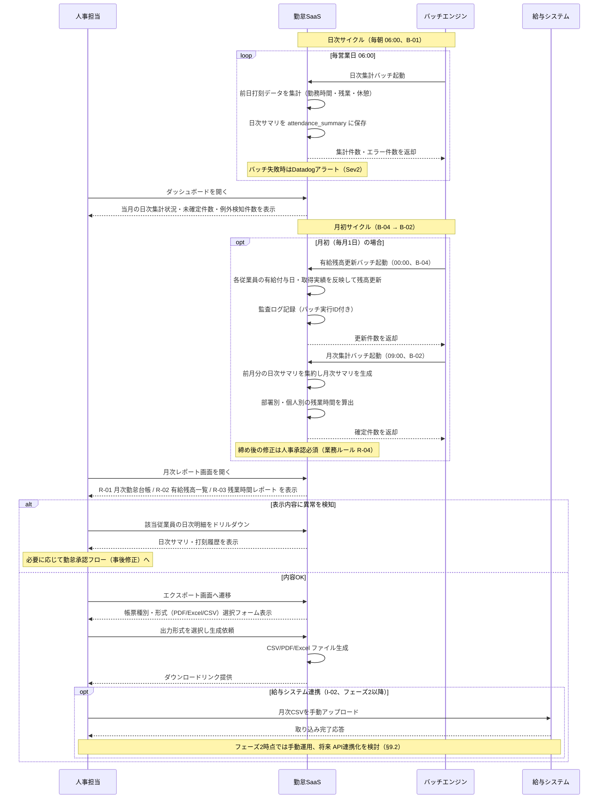
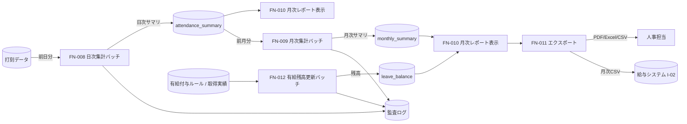

<!--
本ファイルは einja-project-function-spec Skill の動作確認用サンプル（業務フロー単位）です。
本来の出力先は docs/project/function-specs/function-spec-{flow_id}.md（1リポジトリ1プロジェクト前提）。
einja-project-function-spec Skill により生成される機能仕様書の実例として配置しています。

- 入力サンプル1: ../requirements.md（§2.1.2 TO-BE 業務フロー H1〜H3 / §6.1 F-05 / §6.2 B-01・B-02・B-04 / §6.3 R-01〜R-03 / §9.1 I-02）
- 入力サンプル2: ../screen-flow-url.md（stable_id 参照キー）
- Skill 定義: .claude/skills/einja-project-function-spec/
- スキーマ定義: .claude/skills/einja-project-function-spec/references/manifest-schema.md
- セクション構成: .claude/skills/einja-project-function-spec/references/output-template.md

本フローは requirements.md §2.1.2 TO-BE の H1（人事部ダッシュボードでの状況確認）/ H2（月次集計の自動取得）/ H3（CSV/PDFで給与システムへ連携）+ S1→S2（日次/月次バッチ自動集計）を実現する。
B-04 有給残高更新バッチ は独立フロー化せず、月次の集計サイクルと一体運用するため本フローに内包する（FN-012）。
監査ログ記録（F-08 / 旧 FN-008 領域）は全フロー横断の暗黙呼び出しとして audit_log 側で扱い、本フローの §3 機能一覧には含めない。
注意: requirements.md §6 機能要件サマリへの書き戻しは行わない（独立採番のFN-XXXで運用）。
-->

# 業務フロー機能仕様: 月次集計フロー

## 1. 業務フロー概要

### 1.1 基本情報

| 項目 | 内容 |
|------|------|
| 業務フローID | sample-attendance-saas__flow__monthly_aggregation |
| 業務フロー名 | 月次集計フロー |
| 関連 requirements.md セクション | §2.1.2 TO-BE 業務フロー（S1→S2→H1→H2→H3）/ §2.3 業務ルール R-04 / §6.1 F-05 / §6.2 B-01・B-02・B-04 / §6.3 R-01・R-02・R-03 / §9.1 I-02 |
| 関連業務課題ID（§2.2 課題ID） | C-01（紙運用の集計工数）/ C-03（Excel集計の属人化）/ C-05（月末締めの遅延） |

### 1.2 アクター

| アクター | 区分 | 役割 |
|----------|------|------|
| 人事担当 | 利用者 | ダッシュボードで日次集計状況を確認し、月次レポートを表示・CSV/PDFエクスポートして給与システムに連携する |
| 勤怠SaaS（システム） | システム | 日次/月次バッチによる集計、月次レポート表示、CSV/PDF生成、有給残高更新を担う |
| バッチエンジン | システム | 日次（06:00）/月次（月初09:00）/有給残高（月初00:00）のスケジューリング実行を担う |
| 給与システム（外部） | 外部システム | 月次CSVを取り込み給与計算を行う（I-02、フェーズ2以降） |

### 1.3 AS-IS / TO-BE 要約

#### AS-IS（現状）

人事部は月初に部署単位で**紙タイムカードを回収**し、Excelに手作業で転記して月次集計を行っている。集計には月20時間を要し、転記ミス・読み取り困難・打刻漏れの照会で**月次締めが翌月10日前後**まで遅延する。**有給残高は別Excelで個別更新**しており、給与システムへは**月次集計結果を手入力**する運用のため、二重入力と照合作業がボトルネックとなっている。

#### TO-BE（あるべき姿）

打刻データはアプリから自動保存され、**日次06:00の集計バッチ（B-01）が前日分の勤怠サマリを生成**、**月初09:00の月次集計バッチ（B-02）が前月分の月次サマリを確定**する。人事担当はダッシュボードで日次集計状況をリアルタイムに確認し、**月初00:00の有給残高更新バッチ（B-04）**完了後、月次レポート画面で R-01 月次勤怠台帳 / R-02 有給残高一覧 / R-03 残業時間レポート を表示・エクスポート画面から CSV / PDF / Excel で出力する。出力CSVを給与システムへアップロードすることで、月次集計工数を 20h → 4h（80%削減）、月次締めを翌月3営業日以内（R-04）に短縮する。

---

## 2. 業務フロー詳細

### 2.1 sequenceDiagram（時系列インタラクション図）

### 2.2 ステップ別表

sequenceDiagram の各メッセージと 1:1 対応する詳細表。

| ステップ | アクター | 操作 | 関連画面 stable_id | 関連機能ID | 入出力 | 例外 |
|---------|---------|------|------------------|-----------|--------|------|
| 1 | バッチエンジン / 勤怠SaaS | 日次集計バッチ実行（毎朝06:00、B-01） | - | FN-008 | 入力: 前日打刻データ / 出力: 日次サマリ・集計件数 | バッチ失敗時はDatadogアラート（Sev2）+ Slack通知 |
| 2 | 人事担当 | ダッシュボードで日次集計状況を確認 | sample-attendance-saas__dashboard | FN-010 | 入力: なし / 出力: 当月日次集計状況・未確定件数 | セッション切れ時はlogin画面へリダイレクト |
| 3 | バッチエンジン / 勤怠SaaS | 有給残高更新バッチ実行（月初00:00、B-04） | - | FN-012 | 入力: 有給付与ルール・取得実績 / 出力: 更新後残高・監査ログ | 残高マイナス検出時は人事担当へSlack通知 |
| 4 | バッチエンジン / 勤怠SaaS | 月次集計バッチ実行（月初09:00、B-02） | - | FN-009 | 入力: 前月日次サマリ / 出力: 月次サマリ・部署別残業時間 | バッチ失敗時はDatadogアラート（Sev2）、翌日リトライ |
| 5 | 人事担当 / 勤怠SaaS | 月次レポート画面を開く（R-01 / R-02 / R-03 表示） | sample-attendance-saas__monthly-report | FN-010 | 入力: 対象年月・部署フィルタ / 出力: R-01・R-02・R-03 表示 | 月次バッチ未完了の場合は「集計中」表示 |
| 6 | 人事担当 / 勤怠SaaS | 日次明細ドリルダウン（例外検知時） | sample-attendance-saas__monthly-report | FN-010 | 入力: 従業員ID / 対象日 / 出力: 日次サマリ・打刻履歴 | 確定後修正は業務ルール R-04 により人事承認必須 |
| 7 | 人事担当 | エクスポート画面へ遷移し、帳票種別・形式を選択 | sample-attendance-saas__export | FN-011 | 入力: 帳票ID（R-01/R-02/R-03）/ 形式（PDF/Excel/CSV）/ 出力: ダウンロードリンク | 形式不一致（R-02 は Excel が標準）は警告表示 |
| 8 | 人事担当 → 給与システム | 月次CSV を給与システムへ手動アップロード（I-02） | sample-attendance-saas__export | FN-011 | 入力: CSVファイル / 出力: 取り込み結果 | I-02 は手動運用のためアップロード失敗時は翌日再送（§9.2） |

---

## 3. 機能一覧

本業務フローで使う機能を `FN-XXX` 独立採番で列挙する。`requirements.md §6` 機能要件サマリへの**書き戻しは行わない**。

| FN-XXX | 機能名 | 概要 | 関連画面 stable_id | 関連業務ステップ | 優先度 | 備考 |
|--------|--------|------|------------------|----------------|--------|------|
| FN-008 | 日次集計バッチ機能 | 毎朝06:00に前日打刻データを集計し日次サマリを生成する | - | §2.2 ステップ1 | MUST | requirements.md §6.2 B-01 対応 / §6.1 F-05（勤怠集計）の日次分を担う |
| FN-009 | 月次集計バッチ機能 | 月初09:00に前月日次サマリを集約し月次サマリを確定する | - | §2.2 ステップ4 | MUST | requirements.md §6.2 B-02 対応 / §6.1 F-05 の月次分を担う |
| FN-010 | 月次レポート表示機能 | ダッシュボードおよび月次レポート画面で R-01 月次勤怠台帳 / R-02 有給残高一覧 / R-03 残業時間レポート を表示する。日次明細へのドリルダウン操作を含む | sample-attendance-saas__dashboard, sample-attendance-saas__monthly-report | §2.2 ステップ2, 5, 6 | MUST | requirements.md §6.3 R-01・R-02・R-03 の画面表示分を担う / §6.1 F-06 の表示側 |
| FN-011 | CSV/PDF/Excelエクスポート機能 | エクスポート画面から R-01（PDF）/ R-02（Excel）/ R-03（PDF）/ 給与連携CSV を生成・ダウンロード可能にする | sample-attendance-saas__export | §2.2 ステップ7, 8 | MUST | requirements.md §6.1 F-06 / §6.3 R-01・R-02・R-03 のエクスポート分 / §9.1 I-02 の月次CSV生成を担う |
| FN-012 | 有給残高更新バッチ機能 | 月初00:00に各従業員の有給付与・取得実績を反映し残高を更新する | - | §2.2 ステップ3 | MUST | requirements.md §6.2 B-04 対応 / 独立フロー化せず本フローに内包 |

優先度凡例: `MUST` = 必須機能 / `SHOULD` = 推奨機能 / `MAY` = 任意機能

---

## 4. データの流れ

システム間連携・データ授受の概要を記述する。詳細な API 仕様・データスキーマは設計フェーズ（design.md）で扱う。

### 4.1 連携先一覧

| 連携先 | 連携方式 | データ形式 | タイミング | 関連 requirements.md §9 連携先ID |
|--------|---------|----------|-----------|---------------------------------|
| 給与システム | CSVファイル手動アップロード（将来 API連携化を検討） | CSV | 非同期（月次バッチ後の手動オペレーション） | I-02（フェーズ2着手前にフィールド定義確定） |
| 監査ログストレージ | API（別ストレージ） | JSON | 同期（バッチ実行ごと） | 該当なし（§7.5 監査ログ） |
| バッチエンジン（社内基盤） | スケジューラ呼び出し | JSON（実行コンテキスト） | 同期（cron トリガー） | 該当なし（社内基盤） |

### 4.2 データフロー図（任意）

---

## 5. 業務ルール・バリデーション（業務観点）

業務上の制約・承認フロー・例外処理を整理する。技術的バリデーション（型チェック等）は design.md / Issue 仕様で扱う。

### 5.1 業務ルール一覧

| ルールID | 内容 | 根拠（規程・契約・法令等） | 例外条件 |
|---------|------|------------------------|---------|
| BR-01 | 月次勤怠は翌月3営業日以内に確定する | 給与計算スケジュール（requirements.md §2.3 R-04） | 確定後の修正は人事承認必須 |
| BR-02 | 月次集計は B-04（有給残高更新）完了後に B-02（月次集計）を実行する | 残高情報の整合性確保 | バッチ依存関係はジョブネット制御で担保 |
| BR-03 | 日次集計バッチが失敗した日は人事担当が手動再実行できる | 月次締めKPI（翌月3営業日）達成のため | 再実行時も監査ログに実行者IDを記録 |
| BR-04 | 給与システムへ連携する月次CSVは確定済み月次サマリのみを対象とする | 二重計上防止 | フェーズ2時点ではCSV連携が手動運用のため、I-02 はファイル命名規則で世代管理 |

### 5.2 承認フロー（該当する場合）

| 承認段階 | 承認者ロール | 期限 | 期限超過時の動作 | 差し戻し条件 |
|---------|------------|------|----------------|------------|
| 月次確定後の修正承認 | 人事担当（人事課長） | 修正申請から2営業日以内 | ダッシュボードに警告表示 | 修正根拠が監査ログ・打刻履歴から確認できない場合 |

### 5.3 例外処理（該当する場合）

- **日次集計バッチ失敗（FN-008）**: Datadogアラート（Sev2）+ Slack通知。人事担当がダッシュボード上の「手動再実行」ボタンから当該日分を再集計可能（BR-03）。再実行ログは監査ログに保存
- **月次集計バッチ失敗（FN-009）**: 翌日09:00に自動リトライ。3回連続失敗時はSev1アラートにエスカレーション。月次締めKPI（翌月3営業日）達成リスクのため即時対応
- **有給残高マイナス検出（FN-012）**: バッチ実行中に残高マイナスを検出した場合は当該従業員の更新をスキップし、人事担当へSlack通知。事後に承認フロー側（事後申請）で補正
- **月次確定後の修正**: 業務ルール BR-01 / R-04 により人事承認必須。承認時は監査ログに `確定後修正フラグON` + `修正理由` + `承認者ID` を記録
- **CSV連携失敗（I-02、手動運用）**: 給与システムへのアップロード失敗時は翌日再送（§9.2）。連続失敗時は監視アラート

---

## 6. 関連画面一覧

`screen-flow-url.md` の `stable_id` を参照キーとして、本業務フローで利用する画面を列挙する。

| stable_id | 画面名 | Figma リンク | 役割（この業務フロー内） |
|-----------|--------|-------------|--------------------|
| sample-attendance-saas__dashboard | ダッシュボード | （screen-flow-url.md / file_key: PLACEHOLDER_FILE_KEY / node_id: 1:3） | 日次集計状況・未確定件数・例外検知件数の俯瞰表示、月次レポート画面・エクスポート画面への導線 |
| sample-attendance-saas__monthly-report | 月次レポート画面 | （node_id: 1:8） | R-01 月次勤怠台帳 / R-02 有給残高一覧 / R-03 残業時間レポート の表示、日次明細ドリルダウン |
| sample-attendance-saas__export | エクスポート画面 | （node_id: 1:9） | 帳票種別（R-01/R-02/R-03）・形式（PDF/Excel/CSV）選択、ファイル生成・ダウンロード、給与システム連携用CSV出力 |

---

## 7. 未確定事項・前提条件

設計フェーズ（design.md）へ申し送る未確定事項・前提条件を列挙する。

### 7.1 未確定事項

| 項目 | 現時点の状況 | 確定時期・確定方法 | 影響範囲 |
|------|------------|------------------|---------|
| 給与システムCSV連携のフィールド定義 | requirements.md §9.3 / §15.4 TBD-02 で未確定 | フェーズ2着手前（2026-09-15頃） / 給与システム担当ヒアリング | FN-011 / I-02 |
| 月次確定後の修正承認ワークフロー詳細 | BR-01 / R-04 に承認必須の規定のみ、画面導線・通知ルートは未確定 | 設計フェーズ初期 / 人事課長レビュー | FN-010 / 監査ログ要件 / 勤怠承認フローとの境界 |
| バッチ失敗時の手動再実行UI（BR-03） | ダッシュボード上の機能として要件のみ言及、画面仕様は未確定 | 設計フェーズ / 人事担当ヒアリング | FN-008 / FN-010 |
| 帳票PDF/Excelテンプレートのレイアウト | R-01・R-02・R-03 の出力項目は確定だが、レイアウト・帳票ヘッダー定義は未確定 | 設計フェーズ初期 / 人事部 + 経理部レビュー | FN-011 |

### 7.2 前提条件

- 打刻データ（FN-001）が日次バッチ実行時点で揃っていること（未打刻アラート B-03 と並列運用）
- バッチエンジン（社内基盤）が cron / ジョブネット制御で B-04 → B-02 の依存関係を担保すること（BR-02）
- requirements.md §2.3 R-04（月次勤怠は翌月3営業日以内に確定）が合意済み
- 監査ログ基盤（§7.5）がバッチ実行ID・実行者ID・確定後修正フラグを記録可能であること
- フェーズ2時点では給与システム連携（I-02）は手動CSVアップロード運用（§9.2）。将来 API連携化は別途検討

### 7.3 設計フェーズへの申し送り

- 日次バッチの実行時間帯・タイムゾーン制御（深夜勤務者の判定ロジック、月跨ぎ打刻の扱い）
- 月次サマリのスキーマ設計（勤務時間・残業時間・有給取得日数・残業上限超過フラグ等）
- 有給残高更新バッチ（FN-012）の冪等性確保（再実行時の二重付与防止）
- 大容量レポート（5年後 36万件規模、§7.2）のエクスポート性能設計（ストリーミング生成・ZIP分割等）
- 給与システム連携CSVのファイル命名規則・世代管理（BR-04）
- ダッシュボード（FN-010）の権限制御（人事部ロールのみアクセス可、§3.3）
- 月次集計バッチ（FN-009）のリトライ・冪等性設計（部分失敗時の再開ポイント）
