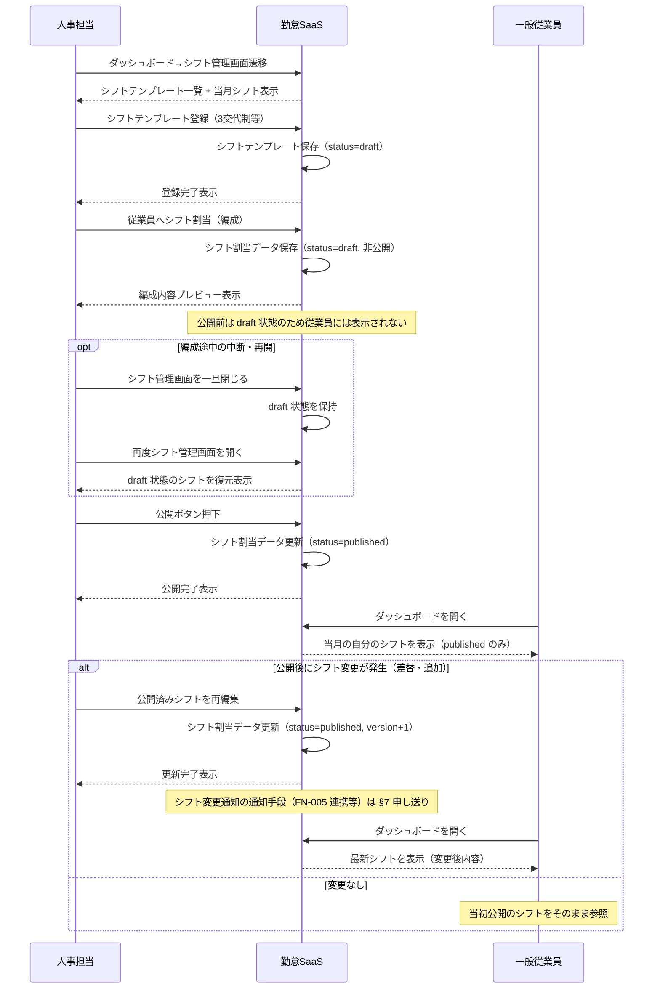

<!--
本ファイルは einja-project-function-spec Skill の動作確認用サンプル（業務フロー単位）です。
本来の出力先は docs/project/function-specs/function-spec-{flow_id}.md（1リポジトリ1プロジェクト前提）。
einja-project-function-spec Skill により生成される機能仕様書の実例として配置しています。

- 入力サンプル1: ../requirements.md（§6.1 F-02 シフト管理 / §2.2 C-04 シフト変更の伝達ロス）
- 入力サンプル2: ../screen-flow-url.md（stable_id 参照キー: dashboard, shift-mgmt）
- Skill 定義: .claude/skills/einja-project-function-spec/
- スキーマ定義: .claude/skills/einja-project-function-spec/references/manifest-schema.md
- セクション構成: .claude/skills/einja-project-function-spec/references/output-template.md

サンプル簡略化のため省略している項目:
- FN-005 通知配信機能との連携（シフト変更通知の通知手段は §7 申し送りで設計フェーズ判定）
- FN-013 監査ログ記録（横断暗黙呼び出しとして §3 機能一覧から除外）

注意: requirements.md §6 機能要件サマリへの書き戻しは行わない（独立採番のFN-XXXで運用）。
本フローは F-02 シフト管理機能 / C-04 シフト変更の伝達ロス課題への対応として位置付けられる。
-->

# 業務フロー機能仕様: シフト管理フロー

## 1. 業務フロー概要

### 1.1 基本情報

| 項目 | 内容 |
|------|------|
| 業務フローID | sample-attendance-saas__flow__shift_management |
| 業務フロー名 | シフト管理フロー |
| 関連 requirements.md セクション | §6.1 F-02 シフト管理 / §2.2 C-04 / §4.1 システム化範囲（シフト管理） / §15.4 TBD-03 |
| 関連業務課題ID（§2.2 課題ID） | C-04（シフト変更の伝達ロス → シフト管理機能による全員可視化） |

### 1.2 アクター

| アクター | 区分 | 役割 |
|----------|------|------|
| 人事担当 | 利用者 | シフトテンプレートを登録し、従業員にシフトを割り当て・公開する |
| 一般従業員 | 利用者 | 自分に割り当てられたシフトを確認する |
| 勤怠SaaS（システム） | システム | シフトデータの保存・公開状態管理・閲覧権限制御 |

### 1.3 AS-IS / TO-BE 要約

#### AS-IS（現状）

工場の3交代制シフトを含む各部署のシフトは、人事担当が Excel で月次に編成し、印刷したシフト表を各部署の掲示板に貼り出す運用となっている。シフト変更が発生した場合、人事担当が口頭・電話・社内メールで個別に連絡するが、現場常駐していない従業員や直行・直帰者への伝達漏れが頻発し、無断遅刻・誤出勤などの業務トラブルの原因となっている（C-04: シフト変更の伝達ロス）。

#### TO-BE（あるべき姿）

人事担当はアプリの**シフト管理画面**から月次シフトをテンプレート方式で登録・編集し、確定後は1クリックで全社公開する。公開済みシフトは各従業員のダッシュボードから即時閲覧可能となり、3交代制を含む全シフトが常に最新状態で全員可視化される。これにより伝達ロスによる業務トラブルを排除し、シフト変更の周知所要時間を「印刷・掲示までの数時間」から「公開と同時」に短縮する。

---

## 2. 業務フロー詳細

### 2.1 sequenceDiagram（時系列インタラクション図）

### 2.2 ステップ別表

sequenceDiagram の各メッセージと 1:1 対応する詳細表。

| ステップ | アクター | 操作 | 関連画面 stable_id | 関連機能ID | 入出力 | 例外 |
|---------|---------|------|------------------|-----------|--------|------|
| 1 | 人事担当 | シフト管理画面へ遷移 | sample-attendance-saas__shift-mgmt | FN-015 | 入力: なし / 出力: テンプレート一覧・当月シフト表示 | 遷移元 dashboard は screen-flow-url.md の `dashboard__to__shift-mgmt` を参照 |
| 2 | 人事担当 | シフトテンプレート登録 | sample-attendance-saas__shift-mgmt | FN-015 | 入力: テンプレート名 / 時間帯 / 出力: テンプレートID | 同名テンプレートは警告表示 |
| 3 | 人事担当 | 従業員へシフト割当（編成） | sample-attendance-saas__shift-mgmt | FN-015 | 入力: 従業員ID / 日付 / テンプレートID / 出力: シフト割当ID（status=draft） | 編成中は draft 状態で従業員非公開 |
| 4 | 人事担当 | 編成途中の中断・再開（draft 保持） | sample-attendance-saas__shift-mgmt | FN-015 | 入力: なし / 出力: draft 状態のシフト復元 | draft が複数版ある場合は最新版を表示 |
| 5 | 人事担当 | 公開ボタン押下 | sample-attendance-saas__shift-mgmt | FN-015 | 入力: 対象月 / 出力: status=published 更新完了 | 編成漏れ（割当未登録の従業員）がある場合は警告表示 |
| 6 | 一般従業員 | ダッシュボードで自分のシフト確認 | sample-attendance-saas__dashboard | FN-016 | 入力: 従業員ID / 出力: 当月の published シフト | 公開前（draft）のシフトは表示しない |
| 7 | 人事担当 | 公開済みシフトの再編集（変更発生時） | sample-attendance-saas__shift-mgmt | FN-015 | 入力: 対象シフト割当ID / 変更内容 / 出力: 更新済みシフト（version+1） | 過去日付のシフト変更は警告表示 |
| 8 | 一般従業員 | 変更後シフトの自動反映表示 | sample-attendance-saas__dashboard | FN-016 | 入力: 従業員ID / 出力: 最新版 published シフト | （シフト変更通知の能動配信は §7 申し送り） |

---

## 3. 機能一覧

本業務フローで使う機能を `FN-XXX` 独立採番で列挙する。`requirements.md §6` 機能要件サマリへの**書き戻しは行わない**。

| FN-XXX | 機能名 | 概要 | 関連画面 stable_id | 関連業務ステップ | 優先度 | 備考 |
|--------|--------|------|------------------|----------------|--------|------|
| FN-015 | シフト登録・編集機能 | 人事担当がシフトテンプレートを登録し、従業員へシフトを割当・公開する。公開前は draft 状態で保持し、編成途中の中断・再開・公開後の再編集に対応する | sample-attendance-saas__shift-mgmt | §2.2 ステップ1, 2, 3, 4, 5, 7 | MUST | requirements.md §6.1 F-02 対応 / 3交代制対応（§15.4 TBD-03 確定後に詳細化） |
| FN-016 | シフト表示機能 | 一般従業員が自分に割り当てられた published 状態のシフトをダッシュボードで閲覧する | sample-attendance-saas__dashboard | §2.2 ステップ6, 8 | MUST | requirements.md §6.1 F-02 対応 / draft 状態のシフトは表示しない |

優先度凡例: `MUST` = 必須機能 / `SHOULD` = 推奨機能 / `MAY` = 任意機能

> 補足: 本フローでは FN-005 通知配信機能・FN-013 監査ログ記録機能には依存しない記述としている。
> - FN-005（シフト変更通知の能動配信）: 要件根拠が薄いため §7 未確定事項に申し送る（実装フェーズで判定）
> - FN-013（監査ログ）: 全API操作の横断暗黙呼び出しとして本表からは除外（requirements.md §6.1 F-08 / §7.5 で全社共通）

---

## 4. データの流れ

システム間連携・データ授受の概要を記述する。詳細な API 仕様・データスキーマは設計フェーズ（design.md）で扱う。

### 4.1 連携先一覧

| 連携先 | 連携方式 | データ形式 | タイミング | 関連 requirements.md §9 連携先ID |
|--------|---------|----------|-----------|---------------------------------|
| シフトデータストレージ（DB） | API（内部） | JSON | 同期 | 該当なし（社内DB） |
| 監査ログストレージ | API（別ストレージ） | JSON | 同期（横断暗黙呼び出し） | 該当なし（§7.5 監査ログ） |

フェーズ1では外部システム連携なし（§9.1）。シフト変更通知の能動配信（FN-005 連携可否）は §7 申し送り事項とする。

### 4.2 データフロー図（任意）

本フローはシンプルな単方向データフローのため、データフロー図は省略する。シフト割当データは「人事担当による draft 作成 → published 公開 → 従業員による参照」の流れに集約される。

---

## 5. 業務ルール・バリデーション（業務観点）

業務上の制約・承認フロー・例外処理を整理する。技術的バリデーション（型チェック等）は design.md / Issue 仕様で扱う。

### 5.1 業務ルール一覧

| ルールID | 内容 | 根拠（規程・契約・法令等） | 例外条件 |
|---------|------|------------------------|---------|
| BR-01 | シフトは公開（status=published）後に従業員へ可視化される。draft 状態のシフトは従業員には表示しない | 業務オーナー要請（人事部長）/ C-04 解決方針（全員可視化） | なし |
| BR-02 | 公開済みシフトの再編集は version+1 で履歴管理し、最新版を従業員ダッシュボードに反映する | 業務オーナー要請（変更履歴の保全） | 過去日付のシフト変更は監査ログ必須 |
| BR-03 | シフトテンプレートは3交代制（早番・遅番・夜勤）を含む工場勤務パターンに対応すること | requirements.md §15.4 TBD-03（工場の3交代制シフトテンプレート最終確定） | テンプレート最終確定までは暫定パターンで運用 |

### 5.2 承認フロー（該当する場合）

シフト管理フロー自体に明示的な承認フローは要件上未確定（§7 未確定事項に申し送り）。現時点では人事担当の単独操作で公開が完了する前提とする。

| 承認段階 | 承認者ロール | 期限 | 期限超過時の動作 | 差し戻し条件 |
|---------|------------|------|----------------|------------|
| （シフト編成の事前承認） | （未確定。人事部内チェックの有無は §7 申し送り） | - | - | - |

### 5.3 例外処理（該当する場合）

- **編成漏れ検知**: 公開操作時に対象月の全従業員に対するシフト割当が完備されていない場合、警告表示し公開可否を人事担当に確認する。強行公開は監査ログに `編成漏れ強行フラグON` を記録
- **過去日付のシフト変更**: BR-02 例外条件に基づき、過去日付のシフトを変更する場合は警告表示のうえ監査ログ必須記録。月次集計確定後の変更は requirements.md §2.3 R-04（月次勤怠は翌月3営業日以内に確定）と衝突するため、設計フェーズで境界設計が必要
- **3交代制テンプレート未確定時の対応**: §15.4 TBD-03 確定までは暫定的に固定3パターン（早番 06:00-14:00 / 遅番 14:00-22:00 / 夜勤 22:00-06:00）で運用する前提

---

## 6. 関連画面一覧

`screen-flow-url.md` の `stable_id` を参照キーとして、本業務フローで利用する画面を列挙する。

| stable_id | 画面名 | Figma リンク | 役割（この業務フロー内） |
|-----------|--------|-------------|--------------------|
| sample-attendance-saas__dashboard | ダッシュボード | （screen-flow-url.md / file_key: PLACEHOLDER_FILE_KEY / node_id: 1:3） | シフト管理画面への導線（人事担当）/ 自分のシフト確認の入口（従業員） |
| sample-attendance-saas__shift-mgmt | シフト管理画面 | （node_id: 1:10） | シフトテンプレート登録・従業員割当・公開操作・公開後の再編集 |

> 補足: screen-flow-url.md 上の `dashboard` の `role` は「人事部」と記載されているが、本フローでは従業員のシフト確認画面としても役割推測で利用している（dashboard を全ロール共通のホーム画面として解釈）。確定情報は §7 未確定事項に申し送る。

---

## 7. 未確定事項・前提条件

設計フェーズ（design.md）へ申し送る未確定事項・前提条件を列挙する。

### 7.1 未確定事項

| 項目 | 現時点の状況 | 確定時期・確定方法 | 影響範囲 |
|------|------------|------------------|---------|
| シフト変更通知の通知手段（FN-005 連携可否） | 本サンプルでは要件根拠が薄いため対象外とし、能動的な変更通知配信は未設計 | 設計フェーズ初期 / 業務オーナー（人事部長）レビュー | FN-015 / FN-005 共通基盤との連携設計 |
| シフト編成の承認ワークフロー有無 | 現状は人事担当の単独操作で公開完了する前提だが、人事部内チェック・人事部長承認の要否は未確定 | 要件定義完了前 / 人事部長レビュー | FN-015 / 5.2 承認フロー |
| dashboard 画面の role（人事部記載と従業員利用の整合） | screen-flow-url.md では `role: 人事部` だが、本フローでは従業員のシフト確認入口としても役割推測で利用 | screen-flow-url.md 次回再生成時に確定 / 業務オーナーレビュー | FN-016 / 関連画面一覧の精度 |
| 工場の3交代制シフトテンプレートの最終確定 | requirements.md §15.4 TBD-03 で未確定 | 要件定義完了前（2026-06-30）/ 工場長 + 業務オーナー | FN-015 シフトテンプレート登録 / BR-03 |
| 公開後のシフト変更履歴の保持期間 | BR-02 で version+1 管理は規定したが、保持期間・閲覧UI未確定 | 設計フェーズ / 監査要件レビュー | FN-015 / 監査ログとの境界 |

### 7.2 前提条件

- requirements.md §4.1 でシフト管理がシステム化範囲（テンプレート方式）として合意済み
- requirements.md §6.1 F-02 でシフト管理機能が MUST / フェーズ1 として合意済み
- 業務課題 C-04（シフト変更の伝達ロス → 全員可視化）が requirements.md §2.2 で合意済み
- 一般従業員はダッシュボードからシフトを参照可能（dashboard 画面は現時点では全ロール共通ホームとして暫定運用、確定は §7.1 で扱う）

### 7.3 設計フェーズへの申し送り

- シフトテンプレートのスキーマ設計（3交代制パターン・曜日別パターン・例外パターンを含む）
- 公開済みシフトの version 管理スキーマ設計（最新版の高速参照と履歴閲覧の両立）
- シフト変更通知の能動配信を行う場合の通知配信基盤（FN-005）との API インタフェース仕様
- 月次勤怠確定（R-04）と公開後シフト変更の境界設計（確定後変更の業務ルール）
- 編成漏れ検知ロジックの厳格度設定（強行公開許容範囲）
- 監査ログ（FN-013 / requirements.md §6.1 F-08）への横断記録項目の整理（編成漏れ強行フラグ・過去日付変更フラグ・代理操作フラグ等）
