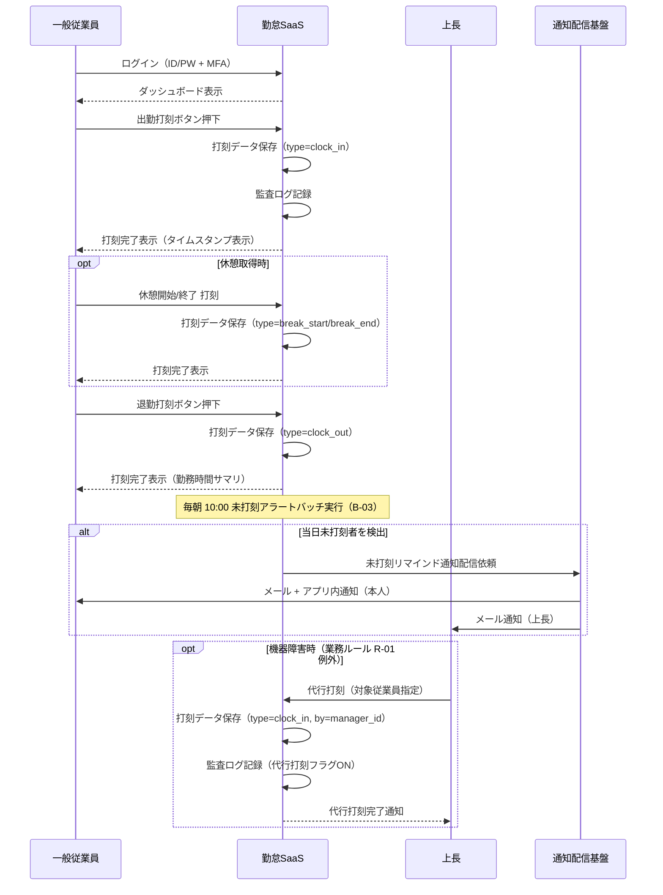

<!--
本ファイルは einja-project-function-spec Skill の動作確認用サンプル（業務フロー単位）です。
本来の出力先は docs/project/function-specs/function-spec-{flow_id}.md（1リポジトリ1プロジェクト前提）。
einja-project-function-spec Skill により生成される機能仕様書の実例として配置しています。

- 入力サンプル1: ../requirements.md（§2.1.2 TO-BE 業務フロー / §6 機能要件サマリ）
- 入力サンプル2: ../screen-flow-url.md（stable_id 参照キー）
- Skill 定義: .claude/skills/einja-project-function-spec/
- スキーマ定義: .claude/skills/einja-project-function-spec/references/manifest-schema.md
- セクション構成: .claude/skills/einja-project-function-spec/references/output-template.md

サンプル簡略化のため省略している項目:
- 4.2 データフロー図（打刻はシンプル業務のため省略）
- 業務ルール BR-03 以降（サンプル簡潔性のため2件のみ）

注意: requirements.md §6 機能要件サマリへの書き戻しは行わない（独立採番のFN-XXXで運用）。
本フローの FN-005 は『勤怠承認フロー』『未打刻アラートフロー』とも共有される機能（N対N関係の実証、3フロー共有）。
-->

# 業務フロー機能仕様: 打刻フロー

## 1. 業務フロー概要

### 1.1 基本情報

| 項目 | 内容 |
|------|------|
| 業務フローID | sample-attendance-saas__flow__time_punch |
| 業務フロー名 | 打刻フロー |
| 関連 requirements.md セクション | §2.1.2 TO-BE 業務フロー / §2.3 業務ルール R-01 / §6.1 F-01 |
| 関連業務課題ID（§2.2 課題ID） | C-01（紙タイムカードの回収・転記による集計工数） |

### 1.2 アクター

| アクター | 区分 | 役割 |
|----------|------|------|
| 一般従業員 | 利用者 | 出勤・退勤・休憩開始/終了を打刻する |
| 上長 | 利用者 | 機器障害時の代行打刻を行う（例外フロー） |
| 勤怠SaaS（システム） | システム | 打刻データの保存・未打刻検知・通知配信 |

### 1.3 AS-IS / TO-BE 要約

#### AS-IS（現状）

工場勤務を中心とした全従業員約150名が、出退勤時に**紙タイムカードに記入**している。タイムカードは部署単位で月末まで保管され、月初に人事部が回収・Excelに転記したうえで月次集計を行う。打刻漏れや読み取り困難な手書きエラーが頻発し、月20時間の集計工数と月次締めの遅延（翌月10日前後）の主因となっている。

#### TO-BE（あるべき姿）

従業員は社内Wi-Fi接続済みのPC・スマホからアプリにログインし、**ダッシュボードの打刻ボタン**で出退勤・休憩を1タップ記録する。打刻データは即座にDBに保存され、未打刻者は日次10:00の検知バッチにより本人・上長へリマインド通知される。これにより打刻漏れを30% → 5%に削減し、紙運用に依存しない正確な勤怠データを月次集計に直接引き渡す。

---

## 2. 業務フロー詳細

### 2.1 sequenceDiagram（時系列インタラクション図）

### 2.2 ステップ別表

sequenceDiagram の各メッセージと 1:1 対応する詳細表。

| ステップ | アクター | 操作 | 関連画面 stable_id | 関連機能ID | 入出力 | 例外 |
|---------|---------|------|------------------|-----------|--------|------|
| 1 | 一般従業員 | ログイン（ID/PW + MFA） | sample-attendance-saas__login | FN-007 | 入力: メール / パスワード / TOTP / 出力: 認証トークン | MFA失敗3回でロック |
| 2 | 一般従業員 | ダッシュボード表示 | sample-attendance-saas__dashboard | - | 入力: なし / 出力: 当日勤怠サマリ・打刻ボタン | セッション切れ時はlogin画面へリダイレクト |
| 3 | 一般従業員 | 出勤打刻ボタン押下 | sample-attendance-saas__punch | FN-001 | 入力: ユーザーID / 出力: 打刻ID・タイムスタンプ | 通信障害時は再試行案内 |
| 4 | 一般従業員 | 休憩開始/終了 打刻 | sample-attendance-saas__punch | FN-001 | 入力: ユーザーID / type / 出力: 打刻ID | 既に休憩中の二重打刻は警告表示 |
| 5 | 一般従業員 | 退勤打刻ボタン押下 | sample-attendance-saas__punch | FN-001 | 入力: ユーザーID / 出力: 打刻ID・当日勤務サマリ | 出勤打刻なしでの退勤打刻はエラー |
| 6 | 勤怠SaaS | 未打刻アラートバッチ実行 | - | FN-002 | 入力: 当日打刻データ / 出力: 未打刻者リスト | バッチ失敗時はSlack通知（Sev2） |
| 7 | 勤怠SaaS | 未打刻リマインド通知配信 | - | FN-005 | 入力: 未打刻者リスト / 出力: メール・push通知 | 通知配信失敗は3回リトライ後Datadogアラート |
| 8 | 上長 | 代行打刻（例外フロー） | sample-attendance-saas__punch | FN-001 | 入力: 対象ユーザーID / type / 理由 / 出力: 打刻ID（代行フラグON） | 代行打刻は監査ログ必須 |

---

## 3. 機能一覧

本業務フローで使う機能を `FN-XXX` 独立採番で列挙する。`requirements.md §6` 機能要件サマリへの**書き戻しは行わない**。

| FN-XXX | 機能名 | 概要 | 関連画面 stable_id | 関連業務ステップ | 優先度 | 備考 |
|--------|--------|------|------------------|----------------|--------|------|
| FN-001 | 打刻機能 | 出勤・退勤・休憩開始/終了の打刻を1タップで記録する | sample-attendance-saas__punch | §2.2 ステップ3, 4, 5, 8 | MUST | requirements.md §6.1 F-01 対応 / 代行打刻は監査ログ必須 |
| FN-002 | 未打刻検知バッチ | 毎朝10:00に当日未打刻者を抽出する | - | §2.2 ステップ6 | MUST | requirements.md §6.2 B-03 対応 |
| FN-005 | 通知配信機能 | システムからのメール・アプリ内push通知を一元配信する（複数フロー共有） | - | §2.2 ステップ7 | MUST | **本機能は『勤怠承認フロー』『未打刻アラートフロー』とも共有**（N対N関係、3フロー共有）。リマインド通知 / 承認依頼通知 / 結果通知 等の配信を担う共通基盤 |
| FN-007 | 認証機能 | ID/PW + MFA(TOTP) によるログイン認証を提供する | sample-attendance-saas__login | §2.2 ステップ1 | MUST | requirements.md §7.5 セキュリティ要件対応 |

優先度凡例: `MUST` = 必須機能 / `SHOULD` = 推奨機能 / `MAY` = 任意機能

---

## 4. データの流れ

システム間連携・データ授受の概要を記述する。詳細な API 仕様・データスキーマは設計フェーズ（design.md）で扱う。

### 4.1 連携先一覧

| 連携先 | 連携方式 | データ形式 | タイミング | 関連 requirements.md §9 連携先ID |
|--------|---------|----------|-----------|---------------------------------|
| 通知配信基盤（メール送信） | SMTP（社内SMTPサーバ経由） | プレーンテキスト + HTML | 同期（API呼び出し）/ 非同期（キュー経由） | 該当なし（社内基盤、§9 連携外） |
| アプリ内push通知 | WebSocket（Vercel Functions） | JSON | 同期 | 該当なし |
| 監査ログストレージ | API（別ストレージ） | JSON | 同期 | 該当なし（§7.5 監査ログ） |

フェーズ1では外部システム連携なし（§9.1）。給与システム連携はフェーズ2以降に該当する月次集計フロー側で扱う。

### 4.2 データフロー図（任意）

本フローはシンプルな単方向データフローのため、データフロー図は省略する。

---

## 5. 業務ルール・バリデーション（業務観点）

業務上の制約・承認フロー・例外処理を整理する。技術的バリデーション（型チェック等）は design.md / Issue 仕様で扱う。

### 5.1 業務ルール一覧

| ルールID | 内容 | 根拠（規程・契約・法令等） | 例外条件 |
|---------|------|------------------------|---------|
| BR-01 | 出退勤の打刻は本人による操作を原則とする | 労働基準法 / 社内就業規則（requirements.md §2.3 R-01） | 機器障害時は上長による代行打刻可（要監査ログフラグON） |
| BR-02 | 休憩打刻は当日内のみ可。前日以前の休憩遡及打刻は不可 | 社内就業規則 | 機器障害時は人事承認のうえ翌営業日まで遡及可 |

### 5.2 承認フロー（該当する場合）

打刻フロー自体に承認は不要（即時保存）。ただし以下のケースで承認を伴う:

| 承認段階 | 承認者ロール | 期限 | 期限超過時の動作 | 差し戻し条件 |
|---------|------------|------|----------------|------------|
| 代行打刻の事後確認 | 人事担当 | 翌営業日中 | 人事ダッシュボードに警告表示 | 監査ログから代行理由が確認できない場合 |

### 5.3 例外処理（該当する場合）

- **通信障害時**: 打刻ボタン押下時にAPI応答がタイムアウトした場合、ユーザーには「ネットワーク状態を確認のうえ再試行してください」と明示し、ローカルキャッシュには保存しない（二重打刻防止）
- **機器障害時**: BR-01 例外条件に基づき、上長が代行打刻画面（sample-attendance-saas__punch のロール拡張）から対象従業員を指定して打刻可。代行打刻は監査ログに `代行打刻フラグON` + `代行理由` を必須記録
- **未打刻リマインド配信失敗時**: 通知配信基盤への送信が3回リトライしても失敗した場合、Datadogアラート発火（Sev2）、人事担当にSlack通知

---

## 6. 関連画面一覧

`screen-flow-url.md` の `stable_id` を参照キーとして、本業務フローで利用する画面を列挙する。

| stable_id | 画面名 | Figma リンク | 役割（この業務フロー内） |
|-----------|--------|-------------|--------------------|
| sample-attendance-saas__login | ログイン画面 | （screen-flow-url.md / file_key: PLACEHOLDER_FILE_KEY / node_id: 1:2） | 認証エントリポイント（MFA含む） |
| sample-attendance-saas__dashboard | ダッシュボード | （node_id: 1:3） | 打刻ボタン・当日勤怠サマリの導線 |
| sample-attendance-saas__punch | 打刻画面 | （node_id: 1:4） | 出勤・退勤・休憩・代行打刻の実行画面 |

---

## 7. 未確定事項・前提条件

設計フェーズ（design.md）へ申し送る未確定事項・前提条件を列挙する。

### 7.1 未確定事項

| 項目 | 現時点の状況 | 確定時期・確定方法 | 影響範囲 |
|------|------------|------------------|---------|
| 工場の3交代制シフトに対応した打刻時間帯の上限/下限 | requirements.md §15.4 TBD-03 で未確定 | 要件定義完了前（2026-06-30） / 工場長ヒアリング | 打刻バリデーション・シフト整合チェック |
| 代行打刻時の承認フロー設計（事前/事後/即時） | 業務ルール BR-01 例外条件のみ規定 | 設計フェーズ初期 / 人事部レビュー | FN-001 / 監査ログ要件 |

### 7.2 前提条件

- 全従業員にスマホまたはPCが配布済み（requirements.md §15.2 前提条件）
- 社内Wi-Fiが工場・事務所両方で整備済み（同上）
- Auth.js + MFA(TOTP) 認証基盤の導入合意済み（requirements.md §15.2 / §7.5）

### 7.3 設計フェーズへの申し送り

- 同時打刻時の競合制御方式（楽観ロック / 一意制約 + リトライ）の選定
- 監査ログのスキーマ設計（代行打刻フラグ・代行理由カラムを含む）
- 未打刻バッチの実行タイムゾーン制御（深夜勤務者の判定ロジック）
- 通知配信基盤（FN-005）との API インタフェース仕様（承認フロー・未打刻アラートフローとの共通化前提）
