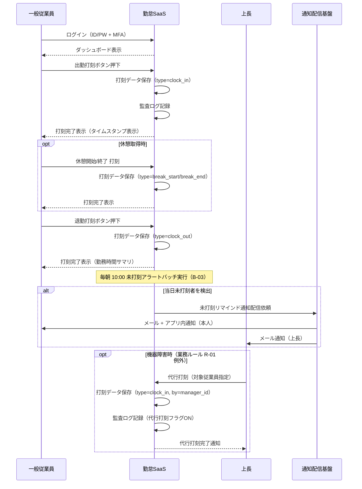
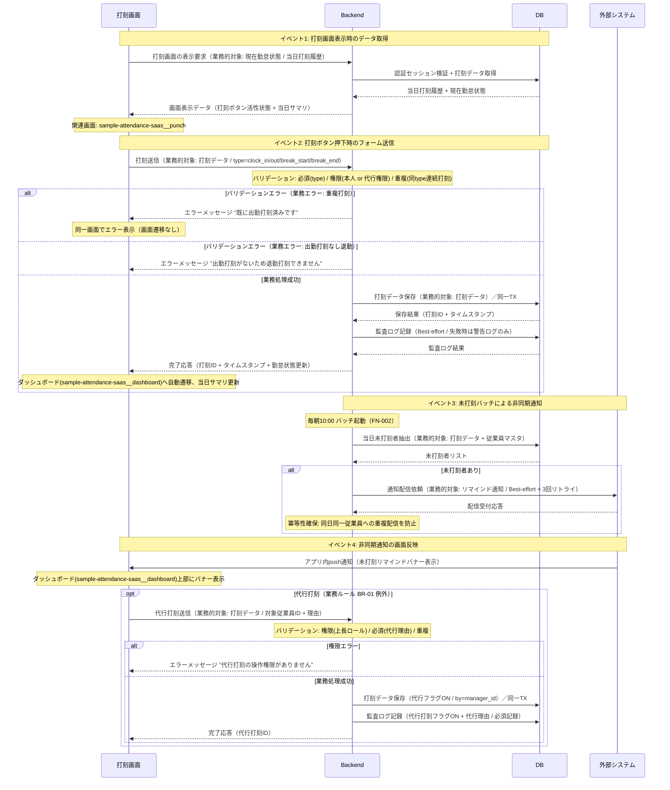
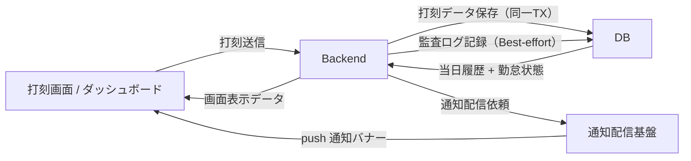

<!--
本ファイルは einja-project-function-spec Skill の動作確認用サンプル（業務フロー機能仕様: §2.1 業務観点 + §2.2 システム観点）です。
本来の出力先は docs/project/function-specs/function-spec-{flow_id}.md（1リポジトリ1プロジェクト前提）。
einja-project-function-spec Skill により生成される機能仕様書の実例として配置しています。

- 入力サンプル1: ../requirements.md（§2.1.2 TO-BE 業務フロー / §6 機能要件サマリ）
- 入力サンプル2: ../screen-flow-url.md（stable_id 参照キー）
- Skill 定義: .claude/skills/einja-project-function-spec/
- スキーマ定義: .claude/skills/einja-project-function-spec/references/manifest-schema.md
- セクション構成: .claude/skills/einja-project-function-spec/references/output-template.md

サンプル簡略化のため省略している項目:
- 業務ルール BR-03 以降（サンプル簡潔性のため2件のみ）

注意: requirements.md §6 機能要件サマリへの書き戻しは行わない（独立採番のFN-XXXで運用）。
本フローの FN-005 は『勤怠承認フロー』『未打刻アラートフロー』とも共有される機能（N対N関係の実証、3フロー共有）。

本サンプルは「§2 二段構成 + §3 機能カード + §4.2 内部データフロー + §5.4 主要技術制約」の
リファレンス実装として位置付けられる（後続6本のサンプル更新の判断基準）。
-->

# 業務フロー機能仕様: 打刻フロー

## 1. 業務フロー概要

### 1.1 基本情報

| 項目 | 内容 |
|------|------|
| 業務フローID | sample-attendance-saas__flow__time_punch |
| 業務フロー名 | 打刻フロー |
| 関連 requirements.md セクション | §2.1.2 TO-BE 業務フロー / §2.3 業務ルール R-01 / §6.1 F-01 |
| 関連業務課題ID（§2.2 課題ID） | C-01（紙タイムカードの回収・転記による集計工数） |

### 1.2 アクター

| アクター | 区分 | 役割 |
|----------|------|------|
| 一般従業員 | 利用者 | 出勤・退勤・休憩開始/終了を打刻する |
| 上長 | 利用者 | 機器障害時の代行打刻を行う（例外フロー） |
| 勤怠SaaS（システム） | システム | 打刻データの保存・未打刻検知・通知配信 |

### 1.3 AS-IS / TO-BE 要約

#### AS-IS（現状）

工場勤務を中心とした全従業員約150名が、出退勤時に**紙タイムカードに記入**している。タイムカードは部署単位で月末まで保管され、月初に人事部が回収・Excelに転記したうえで月次集計を行う。打刻漏れや読み取り困難な手書きエラーが頻発し、月20時間の集計工数と月次締めの遅延（翌月10日前後）の主因となっている。

#### TO-BE（あるべき姿）

従業員は社内Wi-Fi接続済みのPC・スマホからアプリにログインし、**ダッシュボードの打刻ボタン**で出退勤・休憩を1タップ記録する。打刻データは即座にDBに保存され、未打刻者は日次10:00の検知バッチにより本人・上長へリマインド通知される。これにより打刻漏れを30% → 5%に削減し、紙運用に依存しない正確な勤怠データを月次集計に直接引き渡す。

---

## 2. 業務フロー詳細

本セクションは **業務観点（§2.1）** と **システム観点（§2.2）** の二段構成。§2.1 はアクター間の業務メッセージ、§2.2 は Browser / Backend / DB / 外部システムの4層インタラクションを記述する。両者は同じ業務フローの異なる視点であり、ステップ番号で相互参照する（§2.3 ステップ別表で観点列により区別）。

### 2.1 業務観点 sequenceDiagram（時系列インタラクション図）

当該業務フローのアクター間のメッセージ授受を時系列で記述する。`requirements.md §2.1.2` の flowchart（俯瞰用）と相補関係。

### 2.2 システム観点 sequenceDiagram

§2.1 の業務観点メッセージを、システム内部（Browser / Backend / DB / Ext（外部システム））でどう処理するかを 4 層 participant で記述する。
打刻フローは Browser・Backend・DB の標準 CRUD 経路に加え、未打刻バッチが Backend → Ext（通知配信基盤） → Browser の非同期反映経路を持つため、4 層構成が適切。

**canonical participant 識別子（固定）**: `Browser` / `Backend` / `DB` / `Ext`（表示名はフロー固有の画面名・通称併記可）

### 2.3 ステップ別表

§2.1 / §2.2 の各メッセージと 1:1 対応する詳細表。**観点列で業務 / システムを区別する**。

| ステップ | 観点 | アクター / 参加者 | 操作 | 関連画面 stable_id | 関連機能ID | 入出力 | 例外 |
|---------|------|------------------|------|------------------|-----------|--------|------|
| 1 | 業務 | 一般従業員 | ログイン（ID/PW + MFA） | sample-attendance-saas__login | FN-007 | 入力: メール / パスワード / TOTP / 出力: 認証トークン | MFA失敗3回でロック |
| 2 | 業務 | 一般従業員 | ダッシュボード表示 | sample-attendance-saas__dashboard | - | 入力: なし / 出力: 当日勤怠サマリ・打刻ボタン | セッション切れ時はlogin画面へリダイレクト |
| 3 | 業務 | 一般従業員 | 出勤打刻ボタン押下 | sample-attendance-saas__punch | FN-001 | 入力: ユーザーID / 出力: 打刻ID・タイムスタンプ | 通信障害時は再試行案内 |
| 4 | 業務 | 一般従業員 | 休憩開始/終了 打刻 | sample-attendance-saas__punch | FN-001 | 入力: ユーザーID / type / 出力: 打刻ID | 既に休憩中の二重打刻は警告表示 |
| 5 | 業務 | 一般従業員 | 退勤打刻ボタン押下 | sample-attendance-saas__punch | FN-001 | 入力: ユーザーID / 出力: 打刻ID・当日勤務サマリ | 出勤打刻なしでの退勤打刻はエラー |
| 6 | 業務 | 勤怠SaaS | 未打刻アラートバッチ実行 | - | FN-002 | 入力: 当日打刻データ / 出力: 未打刻者リスト | バッチ失敗時はSlack通知（Sev2） |
| 7 | 業務 | 勤怠SaaS | 未打刻リマインド通知配信 | - | FN-005 | 入力: 未打刻者リスト / 出力: メール・push通知 | 通知配信失敗は3回リトライ後Datadogアラート |
| 8 | 業務 | 上長 | 代行打刻（例外フロー） | sample-attendance-saas__punch | FN-001 | 入力: 対象ユーザーID / type / 理由 / 出力: 打刻ID（代行フラグON） | 代行打刻は監査ログ必須 |
| S1 | システム | Browser → Backend | 打刻画面の表示要求 | sample-attendance-saas__punch | FN-001 | 入力: セッショントークン / 出力: 当日打刻履歴・打刻ボタン活性状態 | セッション切れ時はlogin画面へ |
| S2 | システム | Backend → DB | 打刻データ取得（当日分） | - | FN-001 | 入力: ユーザーID / 出力: 当日打刻履歴 | DB接続エラー時は画面に再試行案内 |
| S3 | システム | Browser → Backend | 打刻送信（type指定） | sample-attendance-saas__punch | FN-001 | 入力: type / ユーザーID / 出力: 打刻ID・タイムスタンプ | 重複打刻時は業務エラーメッセージで同一画面に留まる |
| S4 | システム | Backend → DB | 打刻データ保存（同一TX） | - | FN-001 | 入力: 打刻データ / 出力: 打刻ID | 一意制約違反時は409相当の業務エラー |
| S5 | システム | Backend → DB | 監査ログ記録（Best-effort） | - | FN-001 | 入力: 監査ログ / 出力: ログID | 失敗時は警告ログのみ（打刻自体は成功扱い） |
| S6 | システム | Backend → DB | 未打刻者抽出 | - | FN-002 | 入力: 当日日付 / 出力: 未打刻者リスト | 全件取得失敗時はSlack通知（Sev2） |
| S7 | システム | Backend → 外部システム | 通知配信依頼（Best-effort） | - | FN-005 | 入力: 通知データ / 出力: 配信受付応答 | 3回リトライ後Datadogアラート |
| S8 | システム | 外部システム → Browser | アプリ内push通知（バナー表示） | sample-attendance-saas__dashboard | FN-005 | 入力: 通知ペイロード / 出力: 画面バナー | push 接続切断時はメール通知でフォールバック |

ステップ番号の対応関係: 業務ステップ 3-5（打刻操作）は システムステップ S1-S5、業務ステップ 6-7（バッチ + 通知）は システムステップ S6-S8 に対応する。

---

## 3. 機能一覧

本業務フローで使う機能を `FN-XXX` 独立採番で列挙する。`requirements.md §6` 機能要件サマリへの**書き戻しは行わない**。

§3.1 機能サマリ表で全機能を俯瞰し、MUST 機能は §3.2 機能カードで詳細化する。

### 3.1 機能サマリ表

| FN-XXX | 機能名 | 概要 | 関連画面 stable_id | 関連業務ステップ | 優先度 | 備考 |
|--------|--------|------|------------------|----------------|--------|------|
| FN-001 | 打刻機能 | 出勤・退勤・休憩開始/終了の打刻を1タップで記録する | sample-attendance-saas__punch | §2.3 ステップ3, 4, 5, 8 / S1-S5 | MUST | requirements.md §6.1 F-01 対応 / 代行打刻は監査ログ必須 |
| FN-002 | 未打刻検知バッチ | 毎朝10:00に当日未打刻者を抽出する | - | §2.3 ステップ6 / S6 | MUST | requirements.md §6.2 B-03 対応 |
| FN-005 | 通知配信機能 | システムからのメール・アプリ内push通知を一元配信する（複数フロー共有） | sample-attendance-saas__dashboard | §2.3 ステップ7 / S7-S8 | MUST | **本機能は『勤怠承認フロー』『未打刻アラートフロー』とも共有**（N対N関係、3フロー共有）。リマインド通知 / 承認依頼通知 / 結果通知 等の配信を担う共通基盤 |
| FN-007 | 認証機能 | ID/PW + MFA(TOTP) によるログイン認証を提供する | sample-attendance-saas__login | §2.3 ステップ1 | MUST | requirements.md §7.5 セキュリティ要件対応 |

優先度凡例: `MUST` = 必須機能 / `SHOULD` = 推奨機能 / `MAY` = 任意機能

### 3.2 機能カード（MUST 機能の詳細）

#### FN-001 打刻機能

- **入力**: 打刻データ（ユーザーID / type=clock_in/out/break_start/break_end / 代行打刻時は対象従業員ID + 代行理由）
- **主要バリデーション**: 必須（type）/ 権限（本人または代行権限を持つ上長）/ 重複（同一日に同type連続打刻禁止）/ 出勤打刻なしでの退勤打刻禁止
- **処理ステップ**: §2.2 ステップ S3〜S5 参照（打刻送信 → バリデーション → 打刻データ保存（同一TX） → 監査ログ記録（Best-effort） → 完了応答）
- **出力**: 完了応答（打刻ID + タイムスタンプ） → ダッシュボード(sample-attendance-saas__dashboard)へ自動遷移、当日サマリ更新
- **業務エラー**:
  - 重複打刻 → "既に出勤打刻済みです"（同一画面に留まる）
  - 出勤未打刻での退勤 → "出勤打刻がないため退勤打刻できません"
  - 代行打刻の権限なし → "代行打刻の操作権限がありません"
  - 代行理由未入力 → "代行理由を入力してください"
- **関連画面**: sample-attendance-saas__punch（打刻実行）/ sample-attendance-saas__dashboard（完了後遷移先・当日サマリ）

#### FN-002 未打刻検知バッチ

- **入力**: 当日日付 / 全従業員マスタ / 当日打刻データ
- **主要バリデーション**: バッチ実行は権限不要（システム実行）。抽出条件として「出勤打刻なし」「シフト割当あり」「休暇申請なし」の3条件を満たすユーザーを未打刻者として判定
- **処理ステップ**: §2.2 ステップ S6 参照（毎朝10:00起動 → DB から未打刻者抽出 → FN-005 へ通知配信依頼）
- **出力**: 未打刻者リスト → FN-005（通知配信機能）へ連携
- **業務エラー**:
  - バッチ実行失敗 → Slack通知（Sev2）+ Datadogアラート（画面表示なし）
  - 抽出0件 → 正常終了（通知配信スキップ）
- **関連画面**: なし（バックエンド処理のみ）

#### FN-005 通知配信機能

- **入力**: 通知配信依頼（宛先ユーザーID + 通知種別 + ペイロード）。本フローでは未打刻リマインド種別を使用
- **主要バリデーション**: 必須（宛先 / 通知種別）/ 一意性（同日同一従業員への重複配信防止 = 冪等性キー）
- **処理ステップ**: §2.2 ステップ S7〜S8 参照（外部通知配信基盤へ配信依頼（Best-effort + 3回リトライ）→ メール + アプリ内push通知 → ダッシュボード上部にバナー表示）
- **出力**: 配信受付応答 + 画面バナー（sample-attendance-saas__dashboard 上部）
- **業務エラー**:
  - 配信失敗（3回リトライ後）→ Datadog アラート + 人事担当へSlack通知（画面表示なし）
  - push接続切断 → メール通知でフォールバック
- **関連画面**: sample-attendance-saas__dashboard（バナー表示先）
- **共有機能**: 勤怠承認フロー / 未打刻アラートフローと共有（N対N関係、3フロー共有）

#### FN-007 認証機能

- **入力**: メールアドレス / パスワード / TOTP（6桁数字）
- **主要バリデーション**: 必須（全項目）/ 桁（パスワード8文字以上、TOTP 6桁）/ 権限（アカウント有効状態）
- **処理ステップ**:
  1. ID/PW 検証
  2. MFA(TOTP) 検証
  3. 認証トークン発行 + セッション確立
  4. ダッシュボードへ遷移
- **出力**: 認証トークン → ダッシュボード(sample-attendance-saas__dashboard)へ遷移
- **業務エラー**:
  - ID/PW 不一致 → "メールアドレスまたはパスワードが正しくありません"
  - MFA失敗3回 → "アカウントがロックされました。管理者にお問い合わせください"
  - アカウント無効 → "アカウントが無効化されています"
- **関連画面**: sample-attendance-saas__login（認証実行）/ sample-attendance-saas__dashboard（成功後遷移先）

機能カードの記述ルール:
- MUST 機能は必須。本フローは全機能 MUST のため全件カード化
- 処理ステップは §2.2 と整合させ、詳細が §2.2 にある場合は「§2.2 ステップ N 参照」でリダイレクト
- 業務エラーは「業務エラーパターン → 画面メッセージ」のペアで記述（HTTP ステータスや例外クラス名は記載しない）

---

## 4. データの流れ

システム間連携・データ授受の概要を記述する。**外部システム連携**（§4.1）と **内部システム間データフロー**（§4.2）の二段構成。詳細な API 仕様・データスキーマは設計フェーズ（design.md）で扱う。

### 4.1 外部システム連携

外部システム（自社外システム・SaaS・バッチ連携先等）との連携を整理する。

| 連携先 | 連携方式 | データ形式 | タイミング | 関連 requirements.md §9 連携先ID |
|--------|---------|----------|-----------|---------------------------------|
| 通知配信基盤（メール送信） | SMTP（社内SMTPサーバ経由） | プレーンテキスト + HTML | 同期（API呼び出し）/ 非同期（キュー経由） | 該当なし（社内基盤、§9 連携外） |
| アプリ内push通知 | WebSocket（Vercel Functions） | JSON | 同期 | 該当なし |
| 監査ログストレージ | API（別ストレージ） | JSON | 同期 | 該当なし（§7.5 監査ログ） |

フェーズ1では外部システム連携なし（§9.1）。給与システム連携はフェーズ2以降に該当する月次集計フロー側で扱う。

### 4.2 内部システム間データフロー

Browser ↔ Backend ↔ DB 間の **概念レベル** でのデータの流れを整理する。具体的 API パス・テーブル名・カラム名は記載しない（design.md / Issue 仕様で扱う）。

| 流れ | 業務的対象（データ名） | トリガー | 方向 | タイミング | 備考 |
|------|----------------------|---------|------|----------|------|
| 1 | 当日打刻履歴 / 現在勤怠状態 | 打刻画面の表示要求（GET） | DB → Backend → Browser | 同期 | 打刻ボタンの活性状態判定（出勤済/未済）にも利用 |
| 2 | 打刻データ | 打刻ボタン押下（POST） | Browser → Backend → DB | 同期（同一TX） | 一意制約 + リトライで重複打刻防止。完了後にダッシュボードへ遷移しサマリ更新 |
| 3 | 監査ログ | 打刻保存後 | Backend → DB | 同期（Best-effort） | 打刻 TX とは分離。失敗しても打刻は成功扱い。代行打刻時は必須記録 |
| 4 | 未打刻者リスト | 毎朝10:00 バッチ起動 | DB → Backend → 外部システム | 非同期（バッチ） | 「シフト割当あり × 休暇申請なし × 出勤打刻なし」で抽出 |
| 5 | リマインド通知 / 画面バナー | バッチ抽出完了 | 外部システム → Browser | 非同期（push 通知） | ダッシュボードバナー + メール / push の冪等配信 |

内部データフロー図:

---

## 5. 業務ルール・バリデーション（業務観点）

業務上の制約・承認フロー・例外処理を整理する。技術的バリデーション（型チェック等）は design.md / Issue 仕様で扱う。

### 5.1 業務ルール一覧

| ルールID | 内容 | 根拠（規程・契約・法令等） | 例外条件 |
|---------|------|------------------------|---------|
| BR-01 | 出退勤の打刻は本人による操作を原則とする | 労働基準法 / 社内就業規則（requirements.md §2.3 R-01） | 機器障害時は上長による代行打刻可（要監査ログフラグON） |
| BR-02 | 休憩打刻は当日内のみ可。前日以前の休憩遡及打刻は不可 | 社内就業規則 | 機器障害時は人事承認のうえ翌営業日まで遡及可 |

### 5.2 承認フロー（該当する場合）

打刻フロー自体に承認は不要（即時保存）。ただし以下のケースで承認を伴う:

| 承認段階 | 承認者ロール | 期限 | 期限超過時の動作 | 差し戻し条件 |
|---------|------------|------|----------------|------------|
| 代行打刻の事後確認 | 人事担当 | 翌営業日中 | 人事ダッシュボードに警告表示 | 監査ログから代行理由が確認できない場合 |

### 5.3 例外処理（該当する場合）

- **通信障害時**: 打刻ボタン押下時にAPI応答がタイムアウトした場合、ユーザーには「ネットワーク状態を確認のうえ再試行してください」と明示し、ローカルキャッシュには保存しない（二重打刻防止）
- **機器障害時**: BR-01 例外条件に基づき、上長が代行打刻画面（sample-attendance-saas__punch のロール拡張）から対象従業員を指定して打刻可。代行打刻は監査ログに `代行打刻フラグON` + `代行理由` を必須記録
- **未打刻リマインド配信失敗時**: 通知配信基盤への送信が3回リトライしても失敗した場合、Datadogアラート発火（Sev2）、人事担当にSlack通知

### 5.4 主要技術制約

業務ルールから派生する主要な技術的制約を整理する。詳細な型・正規表現・実装方式は design.md / Issue 仕様で扱う。

| 制約種別 | 対象データ | 制約内容 | 違反時の挙動 | 関連 FN-XXX |
|---------|----------|---------|------------|------------|
| 必須 | 打刻 type | type（clock_in / clock_out / break_start / break_end）の指定必須 | 画面メッセージ: "打刻種別を選択してください" | FN-001 |
| 必須 | 代行理由 | 代行打刻時は代行理由の入力必須 | 画面メッセージ: "代行理由を入力してください" | FN-001 |
| 桁 | 代行理由 | 200 文字以内 | 画面メッセージ: "代行理由は200文字以内で入力してください" | FN-001 |
| 重複 | 打刻データ | 同一日・同一従業員・同一type の連続打刻は不可（出勤後の再出勤打刻等） | 画面メッセージ: "既に出勤打刻済みです" | FN-001 |
| 重複 | リマインド通知 | 同日・同一従業員・同一種別への重複配信は不可（冪等性キー） | 配信スキップ（画面表示なし） | FN-005 |
| 権限 | 代行打刻 | 上長ロールを持つユーザーのみ代行打刻可 | 画面メッセージ: "代行打刻の操作権限がありません" | FN-001 |
| 一意性 | 打刻ID | システム全体で一意 | 画面メッセージ: "打刻の登録に失敗しました（再試行してください）" | FN-001 |
| 期限 | 休憩打刻の遡及 | 休憩打刻は当日内のみ（BR-02）。例外は翌営業日まで | 画面メッセージ: "前日以前の休憩打刻はできません" | FN-001 |

---

## 6. 関連画面一覧

`screen-flow-url.md` の `stable_id` を参照キーとして、本業務フローで利用する画面を列挙する。

| stable_id | 画面名 | cell_id | 役割（この業務フロー内） |
|-----------|--------|---------|--------------------|
| sample-attendance-saas__login | ログイン画面 | screen__login | 認証エントリポイント（MFA含む） |
| sample-attendance-saas__dashboard | ダッシュボード | screen__dashboard | 打刻ボタン・当日勤怠サマリの導線 / 未打刻リマインドバナー表示先 |
| sample-attendance-saas__punch | 打刻画面 | screen__punch | 出勤・退勤・休憩・代行打刻の実行画面 |

---

## 7. 未確定事項・前提条件

設計フェーズ（design.md）へ申し送る未確定事項・前提条件を列挙する。

### 7.1 未確定事項

| 項目 | 現時点の状況 | 確定時期・確定方法 | 影響範囲 |
|------|------------|------------------|---------|
| 工場の3交代制シフトに対応した打刻時間帯の上限/下限 | requirements.md §15.4 TBD-03 で未確定 | 要件定義完了前（2026-06-30） / 工場長ヒアリング | 打刻バリデーション・シフト整合チェック |
| 代行打刻時の承認フロー設計（事前/事後/即時） | 業務ルール BR-01 例外条件のみ規定 | 設計フェーズ初期 / 人事部レビュー | FN-001 / 監査ログ要件 |

### 7.2 前提条件

- 全従業員にスマホまたはPCが配布済み（requirements.md §15.2 前提条件）
- 社内Wi-Fiが工場・事務所両方で整備済み（同上）
- Auth.js + MFA(TOTP) 認証基盤の導入合意済み（requirements.md §15.2 / §7.5）

### 7.3 設計フェーズへの申し送り

> **記述方針**: 内部フロー（Browser / Backend / DB 間のインタラクション）は §2.2 システム観点 sequenceDiagram、主要技術制約は §5.4 に記述済み。本セクションは **具体的実装方式の選定** のみに縮小する。

| 項目 | 申し送り内容 | 関連 §2.2 ステップ / §5.4 制約 |
|------|------------|-----------------------------|
| 同時打刻時のロック方式 | 楽観ロック（バージョン番号管理）vs 一意制約 + リトライ の選定が必要 | §2.2 ステップ S4 / §5.4 一意性制約・重複制約 |
| 監査ログのスキーマ設計 | 代行打刻フラグ・代行理由カラムを含むテーブル設計、保管期間、検索インデックスの具体的実装方式の選定 | §2.2 ステップ S5 / §5.4 必須制約 |
