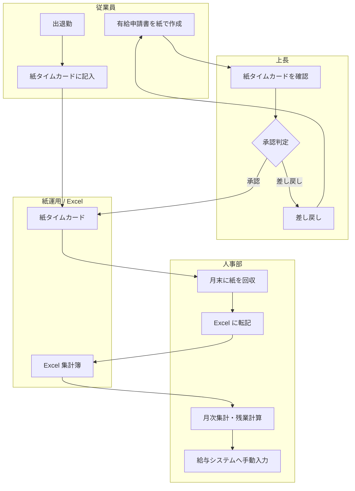
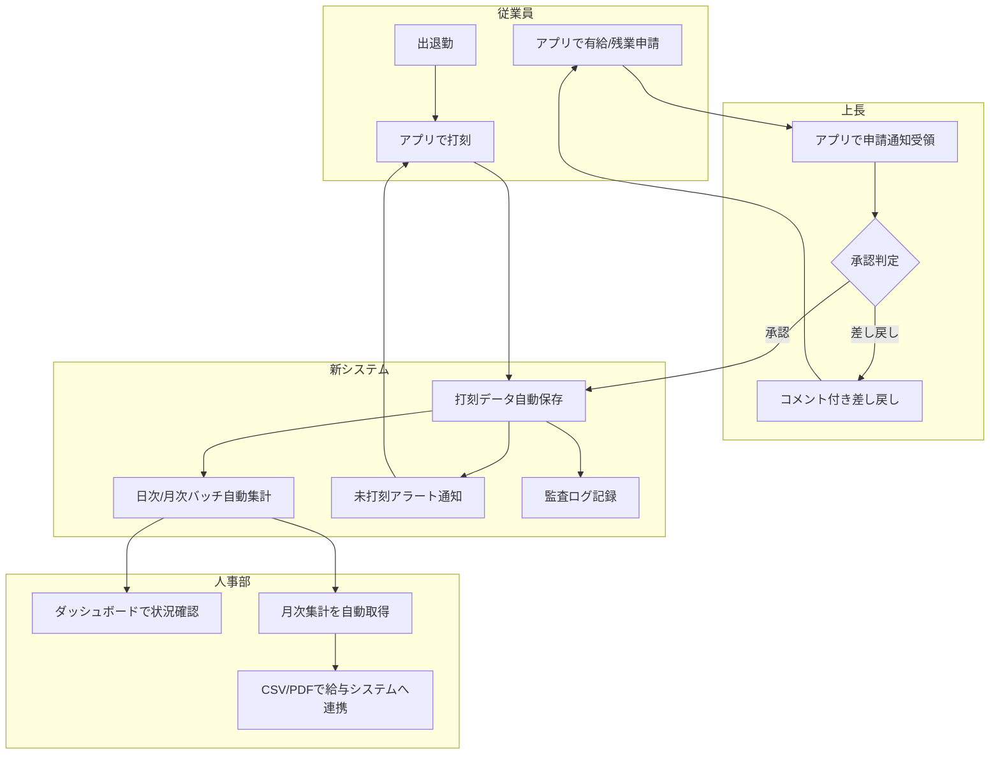
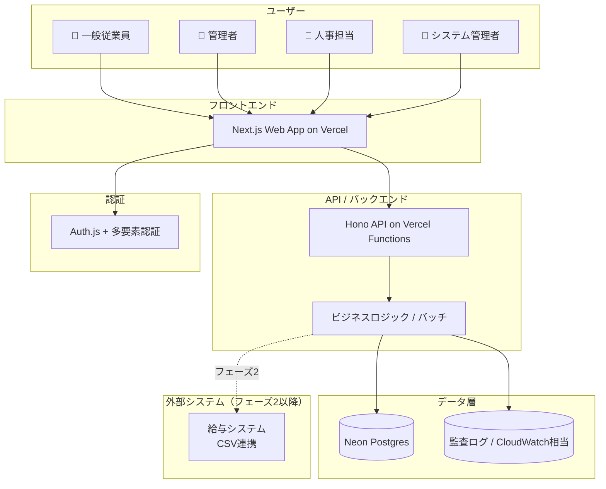
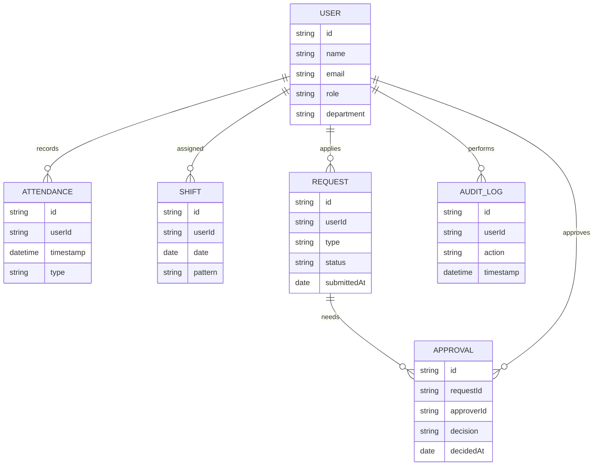
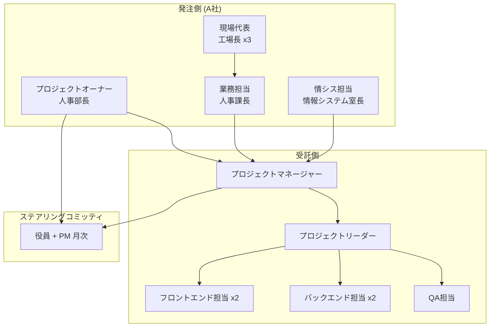
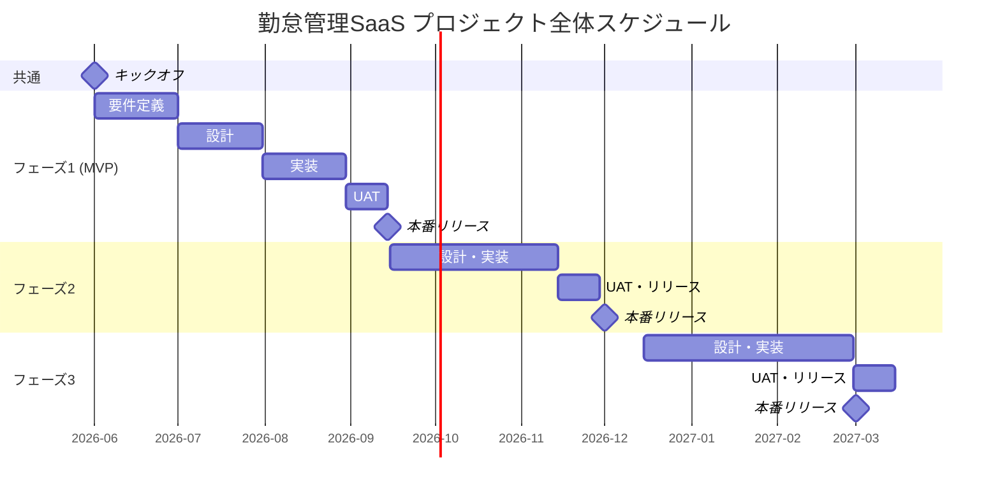
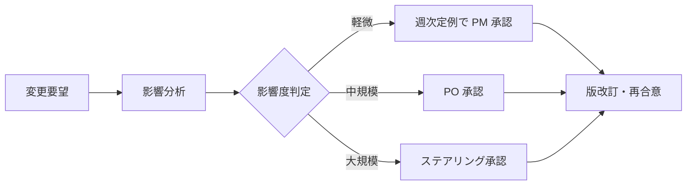

# 中小企業向け勤怠管理SaaS 要件定義書

<!--
本書はシステム受託開発の「プロジェクト全体の要件定義書（クライアント合意用）」である。
einja-project-requirements Skill により生成された。
参照規格: IPA「超上流から攻めるIT化の事例集」/ IPA「機能要件の合意形成ガイド」/ IPA・JUAS「非機能要求グレード」/ JIS X 0166（要件定義プロセス）/ 共通フレーム（SLCP）
図はMermaid記法を標準とする。
-->

## 0. 文書情報

| 項目 | 内容 |
|------|------|
| プロジェクト名 | 中小企業向け勤怠管理SaaS（A社向け） |
| 文書タイトル | 勤怠管理SaaS 要件定義書 |
| 版番号 | 0.1 |
| 最終更新日 | 2026-05-15 |
| 作成者 | 受託側プロジェクトマネージャー |
| 承認者（受託側） | 受託側 プロジェクトマネージャー（氏名は承認時記入） |
| 承認者（発注側） | 発注側 人事部長（氏名は承認時記入） |
| ステータス | 草案 |

## 目次（TOC）

- [0. 文書情報](#0-文書情報)
- [Sources](#sources)
- [1. プロジェクト概要](#1-プロジェクト概要)
- [2. 対象業務](#2-対象業務)
- [3. 対象ユーザー・ステークホルダー](#3-対象ユーザーステークホルダー)
- [4. システム化方針](#4-システム化方針)
- [5. スコープ境界](#5-スコープ境界)
- [6. 機能要件サマリ](#6-機能要件サマリ)
- [7. 非機能要件](#7-非機能要件)
- [8. データ要件](#8-データ要件)
- [9. 外部連携要件](#9-外部連携要件)
- [10. 移行要件](#10-移行要件)
- [11. 運用・保守要件](#11-運用保守要件)
- [12. プロジェクト体制と役割](#12-プロジェクト体制と役割)
- [13. スケジュール](#13-スケジュール)
- [14. 品質保証](#14-品質保証)
- [15. リスクと前提](#15-リスクと前提)
- [16. 合意事項・変更管理](#16-合意事項変更管理)
- [参考情報](#参考情報章別-ipajisjuas-参照源マッピング)

## Sources

本要件定義書が参照する一次資料および関連ドキュメントを以下に整理する。各項目のリンク先が最新であることを版改訂ごとに確認する。

| ソース | 種別 | リンク / パス | 備考 |
|--------|------|---------------|------|
| Asana | プロジェクト管理 | （フェーズ1着手時にプロジェクト作成予定） | タスク・進捗・コミュニケーション |
| Figma | UIデザイン | （フェーズ1で作成予定） | 画面一覧はこちらで管理（本書では扱わない） |
| 見積もり書 | 商務 | 別途見積もり書参照 | 本書では金額・コストは扱わない |
| 契約書 | 商務 | 契約書ドラフト参照 | 契約上の取り決めの根拠資料 |
| qa-test.md | 品質保証 | `docs/qa-test.md`（フェーズ毎に作成予定） | 詳細な品質保証・テスト計画はこちら |
| 関連spec | 機能/Issue仕様 | `docs/specs/issues/...`（実装フェーズで随時作成） | 機能単位の要件定義書 |
| 参考規格 | 規格 | IPA / JUAS / JIS X 0166 | §参考情報を参照 |

---

## 1. プロジェクト概要

### 1.1 背景

A社（製造業・従業員200名規模）では、勤怠管理を紙ベースのタイムカード運用で行っており、月末集計に約20時間/月の工数を要している。月次集計の遅延が頻発し、有給管理もExcelで属人化しているため、勤怠データの正確性と業務効率の両面で限界が露呈している。給与計算への引き渡しタイミングがしばしば遅延し、人事部門の月末締め業務の負荷が経営課題となっている。

### 1.2 目的

紙ベース勤怠管理をデジタル化することにより、月次集計工数を80%削減し、有給申請の承認リードタイムを5営業日から1営業日に短縮する。これにより人事業務の生産性向上と、従業員の働き方改善（申請可視化）を同時に実現する。

### 1.3 ビジネス価値・KPI

| KPI項目 | 現状値 | 目標値 | 測定方法 | 測定タイミング |
|---------|--------|--------|----------|---------------|
| 月次集計工数 | 20時間/月 | 4時間/月 | 人事部の作業時間記録 | 月次 |
| 有給申請承認リードタイム | 5営業日 | 1営業日 | システムログ（申請〜承認時刻） | 月次 |
| 未打刻アラート発生率 | 30% | 5% | システムログ（未打刻者数/全従業員） | 月次 |

### 1.4 用語定義

本書で使用する業務用語・略語の定義を以下に示す。発注側・受託側で意味が分かれる用語、業界固有用語は必ず本表で統一する。

| 用語 | 定義 | 備考 |
|------|------|------|
| 打刻 | 出勤・退勤・休憩開始・休憩終了の時刻記録 | アプリ上のボタン操作 |
| シフト | 従業員の勤務予定（曜日別パターンを含む） | 工場勤務は3交代制あり |
| 残業申請 | 所定労働時間を超える勤務の事前申請 | 上長承認必須 |
| 有給申請 | 年次有給休暇の取得申請 | 上長承認必須 |
| 承認者 | 申請を承認する権限を持つ上長または人事担当 | §3.3 権限マトリクス参照 |
| ロール | システム上の権限区分（一般・管理者・人事・システム管理者） | §3.3 参照 |
| 発注側 / クライアント | A社（製造業） | 同義 |
| 受託側 / 自社 | 開発受託会社 | 同義 |

---

## 2. 対象業務

### 2.1 業務全体像

本プロジェクトが対象とする業務範囲を、AS-IS（現状）と TO-BE（あるべき姿）の両方で示す。

#### 2.1.1 AS-IS 業務フロー

AS-IS の主な課題・ボトルネック:
- 紙タイムカードの回収・転記に月20時間/月の工数を消費
- 有給申請が紙運用のため承認LTが5営業日
- Excelによる集計が属人化し、ミス発生時のリカバリ困難
- 月次締めの遅延により、給与計算の確定が翌月10日前後にずれる

#### 2.1.2 TO-BE 業務フロー

TO-BE 業務での主な改善ポイント・期待効果:
- 紙運用の廃止により月次集計工数を 20h → 4h（80%削減）
- 申請・承認をアプリ内完結化し、承認LT 5営業日 → 1営業日
- 未打刻者を自動検知して即日通知することでアラート発生率を 30% → 5%
- 監査ログによる勤怠データの追跡可能性確保

### 2.2 業務課題と解決方針

| 課題ID | AS-IS 課題 | 解決方針（TO-BE） | 関連KPI |
|--------|-----------|------------------|---------|
| C-01 | 紙タイムカードの回収・転記による集計工数 | 打刻のデジタル化と自動集計バッチ | §1.3 月次集計工数 |
| C-02 | 有給申請が紙のため承認LT長期化 | アプリ内承認フロー・即時通知 | §1.3 承認LT |
| C-03 | Excel集計の属人化 | システム集計＋ロール別アクセス | §1.3 月次集計工数 |
| C-04 | シフト変更の伝達ロス | シフト管理機能による全員可視化 | （業務品質） |
| C-05 | 月末締めの遅延 | 日次バッチ集計による月末リアルタイム化 | §1.3 月次集計工数 |

### 2.3 業務ルール

業務上の重要なルール・規程・例外処理を以下に列挙する。

| ルールID | 内容 | 根拠 | 例外条件 |
|---------|------|------|---------|
| R-01 | 出退勤の打刻は本人による操作を原則とする | 労働基準法・社内就業規則 | 機器障害時は上長による代行打刻可（要監査ログ） |
| R-02 | 残業は事前申請を原則、緊急時は事後申請可（24h以内） | 社内36協定運用規程 | 災害・緊急対応時 |
| R-03 | 有給申請は取得希望日の3営業日前までに申請 | 就業規則§X | 慶弔・体調不良時は当日申請可 |
| R-04 | 月次勤怠は翌月3営業日以内に確定 | 給与計算スケジュール | 確定後の修正は人事承認必須 |

---

## 3. 対象ユーザー・ステークホルダー

### 3.1 エンドユーザー

| ロール | ペルソナ概要 | 主な利用シーン | ITリテラシー |
|--------|-------------|---------------|------------|
| 一般従業員（約150名） | 工場勤務中心、20〜50代、スマホ常用 | 出退勤の打刻、有給/残業申請 | 中（スマホ操作可） |
| 管理者（約20名） | 各課の課長クラス、PC・スマホ併用 | 部下勤怠の確認・承認 | 中〜高 |
| 人事担当（5名） | 人事部所属、PC中心、月次締め担当 | 全社勤怠の確認・集計・帳票出力 | 高 |
| システム管理者（1名） | 情報システム室所属 | ユーザー登録・権限管理・障害一次対応 | 高 |

### 3.2 ステークホルダー一覧

| 区分 | 役割 | 氏名・部署 | 主な関心事 |
|------|------|----------|-----------|
| 決裁者 | 代表取締役 | 経営層 | 投資対効果・スケジュール |
| 業務オーナー | 人事部長（プロダクトオーナー） | 人事部 | 業務要件・運用負荷 |
| 利用者代表 | 工場長3名 | 製造部 | UI/UX・現場負荷 |
| 運用者 | 情報システム室長 | 情シス | 監視・障害対応・セキュリティ |
| 情シス | 情報システム室長 | 情シス | 既存システムとの整合 |

### 3.3 権限マトリクス概要

詳細な権限設計は機能仕様書側で扱うが、本書ではロールの大枠を整理する。

| 主要機能領域 | 一般従業員 | 管理者 | 人事担当 | システム管理者 |
|------------|:-:|:-:|:-:|:-:|
| 自分の勤怠閲覧・打刻 | ○ | ○ | ○ | ○ |
| 部下の勤怠閲覧 | × | ○ | ○ | × |
| 全社勤怠閲覧 | × | × | ○ | × |
| 自分の申請（有給/残業） | ○ | ○ | ○ | ○ |
| 部下の申請承認 | × | ○ | ○ | × |
| 月次集計・帳票出力 | × | △ | ○ | × |
| ユーザー管理 | × | × | ○ | ○ |
| システム設定 | × | × | × | ○ |

凡例: ○=可能 / △=条件付き（自部署のみ）/ ×=不可

---

## 4. システム化方針

### 4.1 システム化の範囲

本プロジェクトでシステム化する業務範囲、しない業務範囲を明示する。

| 業務 | システム化 | 備考 |
|------|:-:|------|
| 打刻（出退勤・休憩） | ○ | TO-BE フローに含む |
| シフト管理 | ○ | テンプレート方式 |
| 残業申請・承認 | ○ | フェーズ2で完成 |
| 有給申請・承認 | ○ | フェーズ2で完成 |
| 勤怠集計（日次・月次） | ○ | バッチで自動化 |
| 帳票出力（PDF/Excel/CSV） | ○ | フェーズ2で完成 |
| ユーザー権限管理 | ○ | フェーズ1で対応 |
| 給与計算 | × | 既存給与システムを継続利用 |
| 人事評価 | × | 対象外 |
| 勤怠予測（AI機能） | × | 対象外 |

### 4.2 採用方針

| 観点 | 採用方針 | 理由 |
|------|---------|------|
| 構築形態 | SaaS新規開発（フルスクラッチ） | A社固有の3交代制シフトに対応するため、既存パッケージでは要件充足が困難 |
| 基盤 | クラウド（Vercel + Neon Postgres） | サーバーレスでスモールスタート可能、CO2排出抑制・運用負荷軽減 |
| 開発言語/FW | Next.js 16 + TypeScript + Hono + Prisma | einja標準スタックに準拠、開発効率と保守性のバランス |
| データベース | PostgreSQL（Neon） | サーバーレスPostgres、自動バックアップ・スケール対応 |
| 認証 | Auth.js + 多要素認証 | OSS標準、SaaS新規構築に適合 |

### 4.3 アーキテクチャ方針（高レベル）

アーキテクチャ上の重要な意思決定（ADR候補）:
- サーバーレス基盤（Vercel + Neon）採用によりインフラ運用工数を最小化
- 多要素認証を必須化し、勤怠データの改ざんリスクを低減
- 監査ログを別ストレージに分離し、1年保有・改ざん検知可能とする
- フェーズ3のモバイル対応を見据え、API/フロントを疎結合に設計

---

## 5. スコープ境界

### 5.1 機能スコープ

| 区分 | 内容 |
|------|------|
| 含む | 打刻、シフト管理、残業申請、有給申請、勤怠集計、レポート出力、ユーザー権限管理、監査ログ |
| 含まない | 給与計算、人事評価、勤怠予測（AI機能）、外部API連携（フェーズ1は連携なし） |

### 5.2 データスコープ

| 区分 | 対象データ | 備考 |
|------|----------|------|
| 含む | 勤怠データ（5年保有）、ユーザーマスタ、シフトテンプレート、申請データ、監査ログ | |
| 含まない | 給与データ、評価データ、個人の機微情報（健康診断結果等） | 別システムで管理 |

### 5.3 外部システム連携スコープ

| 連携先 | 方向 | フェーズ | 備考 |
|-------|------|---------|------|
| なし | - | フェーズ1 | フェーズ1では外部連携なし |
| 給与システム | 送信 | フェーズ2 | CSV連携（手動アップロード） |
| モバイルアプリ | 双方向 | フェーズ3 | iOS/Android、API経由 |

### 5.4 フェーズ分割

| フェーズ | 対象 | 主目的 | 期間 |
|---------|------|--------|------|
| MVP / フェーズ1 | 打刻 + 勤怠集計 + ユーザー権限管理 | コア業務（紙運用置き換え）の代替完了 | 3ヶ月 |
| フェーズ2 | 承認フロー（残業/有給）+ 帳票出力 + 給与CSV連携 | 周辺業務の効率化 | 2ヶ月 |
| フェーズ3 | モバイルアプリ対応 | 工場現場での利便性向上 | 3ヶ月 |

---

## 6. 機能要件サマリ

<!--
本章は「機能の存在と概要」のみを扱う。詳細な機能要件（AC・画面・処理フロー等）は機能単位の仕様書（docs/specs/issues/...）に委譲する。
画面一覧は除外（Figma/UIデザイン側で管理）。外部I/F一覧は §9 で扱う。
-->

### 6.1 機能一覧

| 機能ID | 機能カテゴリ | 機能名 | 概要 | 優先度 | フェーズ |
|--------|------------|--------|------|--------|---------|
| F-01 | 打刻 | 打刻機能 | 出勤・退勤・休憩開始/終了の打刻 | MUST | フェーズ1 |
| F-02 | シフト | シフト管理 | シフトテンプレート登録と従業員割当 | MUST | フェーズ1 |
| F-03 | 申請 | 残業申請 | 残業の事前申請・承認・差戻し | MUST | フェーズ2 |
| F-04 | 申請 | 有給申請 | 有給休暇の申請・承認・差戻し | MUST | フェーズ2 |
| F-05 | 集計 | 勤怠集計 | 日次・月次の勤務時間集計 | MUST | フェーズ1 |
| F-06 | レポート | レポート出力 | PDF/Excel/CSV 形式の帳票出力 | MUST | フェーズ2 |
| F-07 | マスタ管理 | ユーザー管理 | ユーザー登録・更新・削除・権限割当 | MUST | フェーズ1 |
| F-08 | セキュリティ | 監査ログ | 全API操作の監査ログ記録・閲覧 | MUST | フェーズ1 |

優先度凡例: MUST = 必須 / SHOULD = 推奨 / COULD = あれば良い / WON'T = 今回は対象外

### 6.2 バッチ一覧

| バッチID | 名称 | 実行タイミング | 概要 | 優先度 |
|---------|------|--------------|------|--------|
| B-01 | 日次勤怠集計バッチ | 毎朝 06:00 | 前日分の打刻データを集計し勤怠サマリを生成 | MUST |
| B-02 | 月次勤怠集計バッチ | 月初 09:00 | 前月分の月次サマリを確定 | MUST |
| B-03 | 未打刻アラートバッチ | 毎朝 10:00 | 当日未打刻の従業員を検知し本人・上長に通知 | MUST |
| B-04 | 有給残高更新バッチ | 月初 00:00 | 各従業員の有給残高を更新 | MUST |

### 6.3 帳票一覧

| 帳票ID | 名称 | 形式 | 出力タイミング | 概要 | 優先度 |
|--------|------|------|--------------|------|--------|
| R-01 | 月次勤怠台帳 | PDF | 月次・自動/手動 | 全従業員の月次勤怠詳細 | MUST |
| R-02 | 有給残高一覧 | Excel | 月次・オンデマンド | 全従業員の有給取得状況・残高 | MUST |
| R-03 | 残業時間レポート | PDF | 月次・オンデマンド | 部署別・個人別の残業時間集計 | MUST |

---

## 7. 非機能要件

<!--
JUAS/IPA「非機能要求グレード」の 6大項目に基づき、要約レベルで合意事項を整理する。
詳細値は §8 データ要件 / §11 運用・保守要件 / qa-test.md 等で補完する。
-->

### 7.1 可用性

| 項目 | 要件 | 備考 |
|------|------|------|
| 稼働率 | 99.9% / 月（平日 6:00〜22:00） | 計画停止を除く |
| サービス時間 | 平日 6:00〜22:00（土日祝は縮退運転可） | 工場の早朝勤務に対応 |
| 計画停止 | 月1回、4時間以内（土曜深夜） | 事前通知必須 |
| RTO（目標復旧時間） | 4時間以内 | 障害発生から復旧まで |
| RPO（目標復旧時点） | 24時間以内 | 最大データ損失許容範囲 |

### 7.2 性能・拡張性

| 項目 | 要件 | 備考 |
|------|------|------|
| 同時利用者数 | ピーク時 200名 | 始業・終業時刻に集中 |
| レスポンス時間 | API 主要操作 95%tile < 500ms | 打刻・申請の体感速度を確保 |
| データ件数（5年後） | 打刻データ 36万件 / 申請データ 5万件 | §8.2 参照 |
| 将来拡張 | 5年後に500名規模まで拡張可能 | フェーズ3 モバイル対応含む |

### 7.3 運用・保守性

| 項目 | 要件 | 備考 |
|------|------|------|
| 監視 | Vercel/Neon標準監視 + Datadog（APM・エラー監視） | §11.2 参照 |
| ログ保管期間 | 監査ログ 1年、アクセスログ 90日 | §8.3 参照 |
| デプロイ頻度 | 月次定期 + 緊急時随時 | |
| 保守対応時間 | 平日 9:00〜18:00 | §11.4 参照 |
| メンテナンス | 月次定期メンテナンス（土曜深夜2時間） | |

### 7.4 移行性

| 項目 | 要件 | 備考 |
|------|------|------|
| 移行対象データ | なし（新規開発のため） | §10 参照 |
| 移行方式 | フェーズ間移行は段階リリース | ユーザー権限・画面追加が影響範囲 |
| 並行稼働期間 | 紙運用との並行稼働 1ヶ月（フェーズ1リリース時） | 移行リスク低減のため |

### 7.5 セキュリティ

| 項目 | 要件 | 備考 |
|------|------|------|
| 認証 | Auth.js + 多要素認証（TOTP） | 全ユーザー必須 |
| 認可 | RBAC（4ロール）、最小権限の原則 | §3.3 参照 |
| 暗号化（通信） | TLS 1.2 以上必須 | |
| 暗号化（保管） | AES-256（at-rest） | Neon標準機能 |
| 監査ログ | 全API操作・打刻・申請操作を記録 | 1年保管 |
| 個人情報 | 該当あり（氏名・所属・勤怠データ）、改正個人情報保護法準拠 | 国内リージョン保管 |

### 7.6 システム環境・エコロジー

| 項目 | 要件 | 備考 |
|------|------|------|
| 基盤 | クラウド（Vercel + Neon、東京リージョン） | §4.2 参照 |
| 環境配慮 | サーバーレス採用によりCO2排出量を最小化 | アイドル時の電力消費なし |
| ブラウザ | Chrome / Edge / Safari 最新2バージョン | |
| デバイス | PC（必須）/ タブレット（任意）/ スマホ（フェーズ3でネイティブ対応） | |
| 多言語 | 日本語のみ | |

---

## 8. データ要件

### 8.1 主要データ概念モデル

上図は業務概念レベルの主要エンティティと関係を示す。物理設計（テーブル定義・カラム型）は技術設計書（`docs/specs/...`）側で扱う。

### 8.2 データ量見積もり

| エンティティ | 初期件数 | 年間増加 | 5年後想定 | 備考 |
|------------|---------|---------|----------|------|
| User | 200 | +10 | 250 | 5年後500名前提でも余裕あり |
| Attendance（打刻） | 0 | +72,000 | 360,000 | 200名 × 30件/月 × 12ヶ月 |
| Shift | 0 | +72,000 | 360,000 | Attendance と同等規模 |
| Request（申請） | 0 | +10,000 | 50,000 | 有給+残業の合算 |
| AuditLog | 0 | +500,000 | 1年保有のため最大 500,000 | 1年経過分は削除 |

### 8.3 データ保有方針

| データ種別 | 保有期間 | アーカイブ方針 | 削除方針 |
|----------|---------|--------------|---------|
| 勤怠データ（Attendance / Shift / Request） | 5年 | 3年経過後にコールドストレージ移行 | 5年経過で削除 |
| 監査ログ | 1年 | アーカイブなし | 1年経過で自動削除 |
| アクセスログ | 90日 | アーカイブなし | 90日経過で自動削除 |
| 個人情報（User） | 退職後3年（労働基準法準拠） | - | 3年経過で匿名化 |

---

## 9. 外部連携要件

### 9.1 連携システム一覧

| 連携ID | システム名 | 方向 | プロトコル | 同期/非同期 | フェーズ |
|--------|----------|------|----------|------------|---------|
| I-01 | （連携なし） | - | - | - | フェーズ1 |
| I-02 | 給与システム | 送信 | CSV ファイル | 非同期（月次バッチ） | フェーズ2 |
| I-03 | モバイルアプリ | 双方向 | REST API | 同期 | フェーズ3 |

フェーズ1では外部連携なし。フェーズ2以降で給与システムCSV連携を実装する。

### 9.2 連携方式

| 連携ID | 方式詳細 | 認証方式 | エラー時動作 |
|--------|---------|---------|------------|
| I-02 | 月次バッチで CSV ファイル生成 → 人事担当が給与システムへ手動アップロード | （手動操作） | 監視アラート → 翌日再送 |
| I-03 | API 経由でデータ取得・送信 | OAuth 2.0 + JWT | リトライ3回 / 監視アラート |

将来的には I-02 の API連携化を検討する。

### 9.3 連携データ仕様概要

詳細な連携項目一覧（フィールド定義・サンプル）はフェーズ2着手前にAPI仕様書として作成する。

| 連携ID | 主要データ項目 | 仕様書参照 |
|--------|--------------|----------|
| I-02 | 社員ID、日次勤務時間、残業時間、有給取得日数 | フェーズ2着手前に作成 |
| I-03 | 打刻データ、申請データ、ユーザーマスタ | フェーズ3着手前に作成 |

---

## 10. 移行要件

本プロジェクトは新規開発のため、既存システムからのデータ移行は該当なし。ただしフェーズ間移行については以下の通り対応する。

### 10.1 移行データ

| 区分 | 対象 | 件数想定 | 移行元 |
|------|------|---------|--------|
| 該当なし | 新規開発のため移行データなし | - | - |

### 10.2 移行時期・方式

| 項目 | 内容 |
|------|------|
| 移行時期 | 該当なし（新規開発） |
| 移行方式 | フェーズ間移行は段階リリース方式（ユーザー権限・画面追加） |
| 並行稼働 | 紙運用との並行稼働 1ヶ月（フェーズ1リリース直後） |
| 移行リハーサル | フェーズ1リリース2週間前 / 本番1週間前 |

### 10.3 移行リスク

| リスク | 影響度 | 対応策 |
|--------|-------|--------|
| 紙運用文化からの移行抵抗 | 高 | ユーザートレーニング2回実施、簡易マニュアル配布 |
| フェーズ間の権限変更による業務影響 | 中 | フェーズリリース前に影響評価・事前周知 |

---

## 11. 運用・保守要件

### 11.1 運用体制

| 役割 | 担当 | 主な責務 |
|------|------|---------|
| 運用責任者 | 発注側 情報システム室長 | 全体統括・意思決定 |
| ヘルプデスク | 受託側 | 利用者問い合わせ一次対応・障害一次対応 |
| アプリ保守 | 受託側 | バグ修正・機能追加・パフォーマンス改善 |
| インフラ保守 | クラウドベンダー（Vercel / Neon） | 基盤運用（SaaSとして提供） |
| 月次保守 | 受託側 | 月次定期メンテナンス（土曜深夜2時間） |

### 11.2 監視・障害対応

| 項目 | 内容 |
|------|------|
| 監視ツール | Vercel / Neon標準監視 + Datadog（APM・ログ・エラー） |
| 監視対象 | APMメトリクス、エラーレート、バッチ実行結果、認証失敗率 |
| 障害連絡経路 | Datadog アラート → Slack #project-attendance → 受託側当番 → 発注側情シス |
| 障害連絡SLA | 障害発生後 30分以内に発注側へ通知 |
| インシデント分類 | Sev1（全停止）/ Sev2（主要機能不可）/ Sev3（軽微） |
| エスカレーション基準 | Sev1: 即時 / Sev2: 1時間以内 / Sev3: 翌営業日 |
| RTO / RPO | RTO = 4時間 / RPO = 24時間 |

### 11.3 バックアップ

| 対象 | 頻度 | 保管期間 | 保管場所 |
|------|------|---------|---------|
| DB（Neon 自動バックアップ） | 日次 | 7日間 | 同リージョン |
| DB（月次フルバックアップ） | 月1回 | 12世代 | 別リージョン |
| 監査ログ | 日次 | 1年 | 別ストレージ |

### 11.4 保守範囲

| 区分 | 含む | 含まない |
|------|------|---------|
| バグ修正 | ○ | - |
| 軽微な機能改善 | ○（月20時間まで） | 大規模機能追加（別契約） |
| 基盤バージョンアップ | ○（Next.js / Prisma マイナー） | Postgres メジャーアップ（別契約） |
| 利用者問い合わせ対応 | ○（受託側ヘルプデスクが一次対応） | エンドユーザー直接対応（発注側経由のみ） |

---

## 12. プロジェクト体制と役割

### 12.1 体制図

### 12.2 役割分担

| 役割 | 担当（発注側） | 担当（受託側） | 主な責務 |
|------|--------------|--------------|---------|
| プロジェクト統括 | 人事部長（PO） | PM | スコープ管理・スケジュール管理 |
| 業務要件決定 | 人事部長・人事課長 | - | 業務要件の最終決定 |
| 技術設計 | - | PL + テックリード | アーキテクチャ・実装方針 |
| 実装・テスト | - | FE x2 / BE x2 / QA | 開発・品質保証 |
| 受入テスト | 人事課長 + 工場長 | （支援） | AC基準の最終承認 |
| 運用受入 | 情報システム室長 | PM | 運用手順整備・引継ぎ |

### 12.3 意思決定プロセス

| 意思決定種別 | 決裁者 | プロセス | SLA |
|------------|--------|---------|-----|
| スコープ変更（軽微） | 業務オーナー（人事部長） | 週次定例で合意 | 1営業日 |
| スコープ変更（中規模） | プロジェクトオーナー | 変更管理プロセス §16.1 | 5営業日 |
| スコープ変更（大規模） | ステアリングコミッティ | 月次ステアリングで承認 | 10営業日 |
| 技術選定 | 受託側PL | 受託側で決定・発注側に共有 | 都度 |

### 12.4 報告・連絡・相談ルール

| 種別 | 頻度 | 形式 | 参加者 |
|------|------|------|--------|
| 進捗定例 | 週1回 | オンライン会議 + 議事録 | 受託PM + 発注PO + PL |
| ステアリング | 月1回 | オンライン会議 | 経営層 + 受託PM |
| 日次共有 | 日次 | Slack `#project-attendance` | 開発チーム全員 |
| 課題管理 | 随時 | Asana | プロジェクトメンバー全員 |
| 月次レポート | 月1回 | PDFレポート | 経営層・PO・情シス |
| 緊急連絡 | 随時 | 電話 + Slack | 担当責任者 |

---

## 13. スケジュール

<!-- 見積もり・コスト情報は本書に含めない（契約書・見積もり書を Sources 表で参照） -->

### 13.1 マイルストーン

| マイルストーン | 目標日 | 達成基準 |
|--------------|--------|---------|
| キックオフ | 2026-06-01 | プロジェクト体制確定・本書承認 |
| 要件定義完了 | 2026-06-30 | 本書の発注側承認 |
| 設計レビュー | 2026-07-31 | 基本設計書承認 |
| フェーズ1（MVP）α版 | 2026-08-15 | 実装完了・社内検証通過 |
| フェーズ1 UAT完了 | 2026-08-31 | 受入テスト合格 |
| フェーズ1 本番リリース | 2026-09-01 | 本番環境稼働開始 |
| フェーズ2 本番リリース | 2026-12-01 | 承認フロー・帳票機能リリース |
| フェーズ3 本番リリース | 2027-03-01 | モバイルアプリリリース |

### 13.2 フェーズ分割

### 13.3 主要レビュータイミング

| レビュー | タイミング | 参加者 | 成果物 |
|---------|----------|--------|--------|
| 要件レビュー | 要件定義完了時（着手1ヶ月後） | 全ステークホルダー | 本書の承認 |
| 設計レビュー | 基本設計完了時 | 業務オーナー + 情シス + PL | 基本設計書 |
| α版レビュー | 実装完了時 | 業務オーナー + 工場長 + PM | 実装版動作確認 |
| β版レビュー（UAT前） | UAT着手前 | 業務オーナー + QA | テスト計画書 |
| 本番リリース判定 | UAT完了時 | ステアリング | リリース判定報告書 |

### 13.4 納期

| 区分 | 期日 | 備考 |
|------|------|------|
| フェーズ1（MVP）納品 | 2026-09-30 | ソース + ドキュメント一式 |
| フェーズ2 納品 | 2026-12-31 | ソース + ドキュメント一式 |
| フェーズ3 納品 | 2027-03-31 | ソース + ドキュメント一式 |
| 検収期限 | 各納品から30日以内 | 検収書発行 |

---

## 14. 品質保証

<!-- 概要のみ記述。詳細なテスト計画・テストシナリオは qa-test.md（フェーズ毎に作成予定）を参照 -->

### 14.1 品質目標

| 観点 | 目標 | 測定方法 |
|------|------|---------|
| 機能適合性 | UAT受入率 95%以上 | qa-test.md のシナリオ消化結果 |
| 信頼性 | バグ密度 0.5件/KSLoC 以下 | 静的解析 + テスト結果 |
| 使用性 | Lighthouseスコア 90以上 | Lighthouse 計測 |
| 性能 | §7.2 の要件達成（API 95%tile < 500ms） | 負荷試験 |

### 14.2 受入基準

| 区分 | 基準 |
|------|------|
| 機能 | 全MUST要件のシナリオテスト合格、SHOULD要件 80%以上合格 |
| 性能 | §7.2 の数値要件を全て充足 |
| セキュリティ | §7.5 の要件に基づく脆弱性診断クリア |
| ドキュメント | 運用手順書・操作マニュアル・管理者マニュアルの納品完了 |

詳細は `docs/qa-test.md`（フェーズ毎に作成予定）を参照。

---

## 15. リスクと前提

### 15.1 想定リスクと対応策

| リスクID | リスク内容 | 影響度 | 発生確率 | 対応策 |
|---------|----------|-------|---------|--------|
| RK-01 | 紙運用文化からの移行抵抗 | 高 | 高 | ユーザートレーニング2回・簡易マニュアル配布・並行稼働1ヶ月 |
| RK-02 | シフト管理の複雑性（3交代制の例外処理） | 中 | 中 | 要件深掘り会2回・PoCで早期検証 |
| RK-03 | フェーズ3モバイル対応の追加要件 | 中 | 低 | フェーズ1設計時にAPI/フロント疎結合化、拡張性を確保 |
| RK-04 | 業務オーナー（人事部長）のレビュー遅延 | 中 | 中 | レビュー期限を週次で合意・遅延時はエスカレーション |
| RK-05 | 給与システム CSV仕様の未確定 | 中 | 中 | フェーズ2着手前に仕様確定会を設定 |

### 15.2 前提条件

| 区分 | 前提条件 | 備考 |
|------|---------|------|
| デバイス | 全従業員にスマホまたはPCが配布済み | 工場現場含む |
| ネットワーク | 社内Wi-Fi整備済み | 工場・事務所両方 |
| 認証基盤 | Auth.js認証基盤の導入合意済み | 多要素認証必須 |
| 体制 | 発注側PO（人事部長）が週5時間以上確保 | レビュー・意思決定対応 |
| 法令 | 改正個人情報保護法に基づく要件は本書時点で確定 | |

### 15.3 制約条件

| 区分 | 制約 | 影響 |
|------|------|------|
| 予算 | 別途見積もり書参照 | スコープ固定 |
| 期限 | フェーズ1=2026-09-01、フェーズ3=2027-03-01（年度末） | 厳守、スコープ調整余地あり |
| 技術 | einja標準スタック（Next.js + Hono + Prisma + Postgres）採用 | アーキテクチャ制約 |
| 法令 | 個人情報の国内保管必須 | クラウドリージョンは東京固定 |
| データ保有 | 勤怠5年・監査ログ1年（法定保存期間） | §8.3 参照 |

### 15.4 未確定事項

| 項目 | 内容 | 確定予定日 | 担当 |
|------|------|----------|------|
| TBD-01 | モバイル対応の具体仕様（対応OS・機能範囲） | フェーズ3着手前（2026-12-01頃） | 発注側PO + 受託側PL |
| TBD-02 | 給与システムCSV仕様（フィールド定義・送信タイミング） | フェーズ2着手前（2026-09-15頃） | 発注側情シス + 受託側PL |
| TBD-03 | 工場の3交代制シフトテンプレートの最終確定 | 要件定義完了前（2026-06-30） | 発注側 工場長 + 業務オーナー |

---

## 16. 合意事項・変更管理

### 16.1 変更管理プロセス

要件定義書の合意後、内容変更が必要な場合は以下のプロセスに従う。

| 影響度 | 判定基準 | 承認者 | リードタイム |
|-------|---------|--------|------------|
| 軽微 | 工数 < 1人日 / スケジュール影響なし | 受託側PM | 1営業日 |
| 中規模 | 工数 1〜5人日 / 既存要件への影響あり | 発注側PO（人事部長） | 5営業日 |
| 大規模 | 工数 > 5人日 / スコープ・期日影響あり | ステアリング（経営層含む） | 10営業日 |

### 16.2 承認欄

本要件定義書の内容について、以下の通り合意する。

| 区分 | 役職 | 氏名 | 承認日 | 署名/印 |
|------|------|------|--------|--------|
| 発注側 決裁者 | 代表取締役 | （承認時記入） | YYYY-MM-DD | |
| 発注側 業務オーナー | 人事部長 | （承認時記入） | YYYY-MM-DD | |
| 発注側 情シス責任者 | 情報システム室長 | （承認時記入） | YYYY-MM-DD | |
| 受託側 プロジェクトマネージャー | PM | （承認時記入） | YYYY-MM-DD | |

### 16.3 版歴表

| 版 | 日付 | 変更概要 | 変更箇所 | 作成者 | 承認者 |
|----|------|---------|---------|--------|--------|
| 0.1 | 2026-05-15 | 初版（ドラフト） | 全体 | 受託側PM | - |

---

## 参考情報（章別 IPA/JIS/JUAS 参照源マッピング）

本要件定義書の各章は、以下の公開ガイドライン・規格を参考に構成している。詳細な記述方針は `references/structure-guide.md` を参照。

| 章 | 主参照源 | 補足 |
|----|---------|------|
| §1 プロジェクト概要 / §2 対象業務 / §3 対象ユーザー・ステークホルダー / §15 リスクと前提 | IPA「超上流から攻めるIT化の事例集」/ 共通フレーム（SLCP） | ステークホルダー識別・業務理解の基礎 |
| §4 システム化方針 / §5 スコープ境界 | JIS X 0166（要件定義プロセス） | スコープ管理・採用方針の合意 |
| §6 機能要件サマリ | IPA「機能要件の合意形成ガイド」 | 機能一覧粒度・優先度の表現 |
| §7 非機能要件 | IPA/JUAS「非機能要求グレード」 | 6大項目（可用性 / 性能・拡張性 / 運用・保守性 / 移行性 / セキュリティ / システム環境・エコロジー）の要約レベル合意 |
| §8 データ要件 / §9 外部連携要件 | 共通フレーム / JIS X 0166 | 概念モデル・連携方式の整理 |
| §10 移行要件 / §11 運用・保守要件 | IPA/JUAS「非機能要求グレード」（運用性・移行性） | 運用・移行の合意項目 |
| §12 プロジェクト体制 / §13 スケジュール / §16 合意事項・変更管理 | 共通フレーム（プロセス・プロジェクト管理） | 体制・スケジュール・変更管理 |
| §14 品質保証 | `docs/qa-test.md`（einja既存QA仕様）と整合 | 詳細は別文書 |

### 記法ガイドライン

- 図は **Mermaid記法** を標準とする
  - 業務フロー: `flowchart TD` + `subgraph` によるスイムレーン（§2.1）
  - アーキテクチャ: `graph TB` + `subgraph`（C4 Container相当、§4.3）
  - 概念データモデル: `erDiagram`（§8.1）
  - 体制図: `graph TB`（§12.1）
  - スケジュール: `gantt` チャート（§13.2）
  - 変更管理プロセス: `flowchart LR`（§16.1）
- **C4記法（C4Context, C4Container）は使用禁止**（公式 experimental のため）
- テーブルは Markdown 標準（GFM）

### 関連ドキュメント

- 機能/Issue単位の詳細要件: `docs/specs/issues/{category}/issue{N}-{name}/requirements.md`
- 品質保証・テスト計画詳細: `docs/qa-test.md`（フェーズ毎に作成予定）
- UIデザイン: Sources 表の Figma URL（フェーズ1で作成予定）
- 見積もり・契約: Sources 表の見積もり書・契約書
