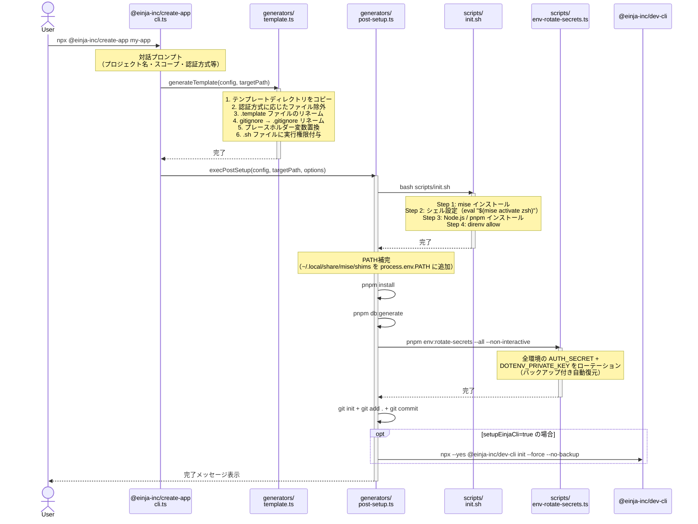
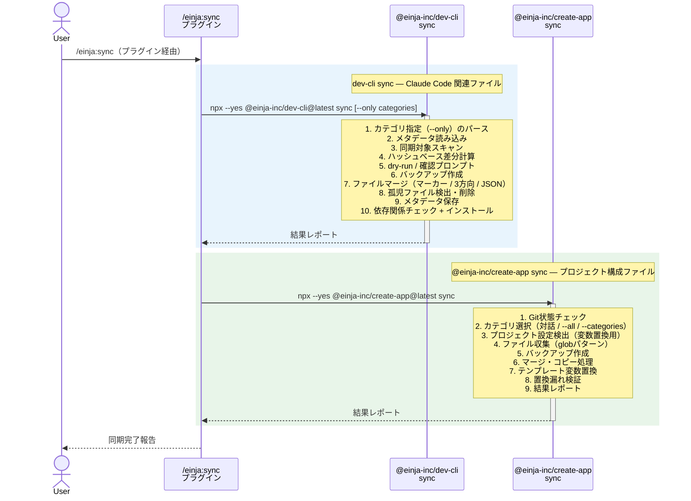

# セットアップフローガイド

## 概要

このドキュメントでは、einja プロジェクトにおける3つの主要セットアップシナリオのフローを解説します。

| シナリオ | 対象者 | 目的 |
|---------|--------|------|
| **1. `npx @einja-inc/create-app`** | 新規プロジェクト作成者 | テンプレートからプロジェクトを一括生成 |
| **2. `git clone` 後の環境構築** | 既存プロジェクトへの参加者 | 開発環境を手元に再現 |
| **3. `/einja:sync`（プラグイン）** | 既存プロジェクト運用者 | テンプレートの最新変更をプロジェクトに同期 |

---

## シナリオ別フロー

### 1. `npx @einja-inc/create-app`（新規プロジェクト作成）

テンプレートからプロジェクトを新規作成し、初回セットアップまで自動で完了するフローです。



#### 処理詳細テーブル

| ステップ | 実行元 | 処理内容 |
|---------|--------|---------|
| 対話プロンプト | `cli.ts` | プロジェクト名、パッケージスコープ、認証方式等を対話的に入力 |
| テンプレート展開 | `generators/template.ts` | テンプレートコピー → `{{projectName}}` `{{packageName}}` `{{description}}` `@repo/` 等の変数置換 → `.template` リネーム → `gitignore` → `.gitignore` リネーム → 認証方式に応じたファイル除外 → `.sh` に実行権限付与 |
| Step 0: init.sh | `generators/post-setup.ts` | mise/Node.js/pnpm/direnv の初期導入（`stdio: inherit` で出力をそのまま表示） |
| PATH補完 | `generators/post-setup.ts` | `~/.local/share/mise/shims` を `process.env.PATH` に追加（init.sh で導入した mise を後続ステップで利用可能にする） |
| Step 1: 依存関係 | `generators/post-setup.ts` | `pnpm install` + `pnpm db:generate`（Prisma クライアント生成） |
| Step 2: 秘密鍵ローテーション | `env-rotate-secrets.ts` | `--all --non-interactive` モードで全環境の AUTH_SECRET と DOTENV_PRIVATE_KEY を自動ローテーション |
| Step 3: Git初期化 | `generators/post-setup.ts` | `git init` → `git add .` → `git commit -m "Initial commit"` |
| Step 4: dev-cli 初期化 | `generators/post-setup.ts` | `setupEinjaCli=true` 時のみ `npx --yes @einja-inc/dev-cli@latest init --force --no-backup` を実行 |

---

### 2. `git clone` 後の環境構築（既存プロジェクトへの参加）

既存プロジェクトに新たに参加する開発者が、ローカル環境を構築するフローです。

```mermaid
flowchart TD
    A[git clone → cd project] --> B[./scripts/init.sh]

    subgraph init ["scripts/init.sh（初回のみ手動実行）"]
        B --> B1[Step 1: mise インストール]
        B1 --> B2[Step 2: シェル設定<br/>eval "$(mise activate zsh)"]
        B2 --> B3[Step 3: Node.js / pnpm インストール]
        B3 --> B4[Step 4: direnv allow]
    end

    B4 --> C["exec $SHELL（ターミナル再起動）"]
    C --> D[pnpm dev:setup]

    subgraph devsetup ["scripts/setup-dev.ts（= pnpm dev:setup）"]
        D --> D1[Step 1-3: mise 確認 / シェル設定 / Node.js・pnpm]
        D1 --> D4[Step 4: direnv インストール<br/>macOS: brew install direnv]
        D4 --> D5[Step 5: シェルに direnv hook 追加]
        D5 --> D6[Step 6: dotenvx インストール]
        D6 --> D7["Step 7: .env.personal 作成<br/>+ GITHUB_TOKEN 設定（対話的）"]
        D7 --> D8["Step 8: direnv allow<br/>→ .envrc 評価（環境変数を反映）"]
    end

    D8 --> E["pnpm dev で開発開始<br/>（.env自動復号・DB起動・マイグレーション含む）"]

    style init fill:#e8f4fd,stroke:#2196F3
    style devsetup fill:#e8f5e9,stroke:#4CAF50
```

#### 処理詳細テーブル

| ステップ | 実行ファイル | 処理内容 |
|---------|-------------|---------|
| Step 1: mise | `init.sh` → `setup-dev.ts` | mise 未インストール時は `curl https://mise.run \| sh` で導入。macOS 以外では手動インストールを案内 |
| Step 2: シェル設定 | `init.sh` → `setup-dev.ts` | `~/.zshrc` 等に `eval "$(mise activate zsh)"` を追記（既存なら冪等にスキップ） |
| Step 3: Node.js/pnpm | `init.sh` → `setup-dev.ts` | `mise.toml` からバージョンを読み取り `mise install` |
| Step 4: direnv | `setup-dev.ts` | macOS では `brew install direnv` を自動実行。他 OS は手動案内 |
| Step 5: direnv hook | `setup-dev.ts` | `~/.zshrc` 等に `eval "$(direnv hook zsh)"` を追記 |
| Step 6: dotenvx | `setup-dev.ts` | `curl -sfS https://dotenvx.sh/install.sh` で導入。失敗時は `npm install -g @dotenvx/dotenvx` にフォールバック |
| Step 7: .env.personal | `setup-dev.ts` | `.env.personal.example` からコピー → GITHUB_TOKEN を対話的に入力（スキップ可） |
| Step 8: direnv 有効化 | `setup-dev.ts` | `direnv allow` 実行 → `.envrc` が評価される → 環境変数を反映 |

#### .envrc の役割

`.envrc` は direnv によりディレクトリ進入時に自動評価され、以下の処理を行います。

| 処理 | 条件 | 詳細 |
|------|------|------|
| dotenv 読み込み | 常時 | `dotenv_if_exists .env` で環境変数をロード |
| worktree 間 .env.personal 共有 | `$MAIN_WORKTREE` が設定済みの場合 | メインワークツリーの `.env.personal` を `dotenv_if_exists` で読み込み（worktree 環境でも個人トークンを共有） |
| Serena 設定の共有 | `$MAIN_WORKTREE` が設定済みの場合 | メインワークツリーの `.env.personal` 由来設定を Codex / Claude Code 起動時にも利用 |

`pnpm dev` 自体も、現在の worktree に `.env.local` / `.env.keys` がない場合はメインworktreeから不足分のみ補完してから復号を試みます。`.env.personal` はコピーせず、現在の worktree に存在しない場合だけメインworktreeの `.env.personal` を参照して起動します。これにより direnv が未反映でも、開発サーバー起動時の共有トークンは引き継がれます。

#### ensure-serena.sh の動作

| 処理 | 詳細 |
|------|------|
| 起動トリガー | `direnv` ではなく `.mcp.json` の `scripts/serena-mcp-bridge.sh` からオンデマンドで呼び出される |
| 既存インスタンスチェック | `.serena-port` ファイルから PID を読み取り、生存確認。生存中ならポート番号を再利用して即座に終了 |
| プロジェクト内ロック | `.serena-start.lock` で同一プロジェクト内の多重起動を防止 |
| グローバルロック | `${TMPDIR:-/tmp}/serena-mcp-start.lock` で別プロジェクト同士のポート競合を防止 |
| uvx 確認 | `uvx` コマンドの存在チェック。未インストール時はエラー終了 |
| 空きポート検出 | デフォルトポート 9850 から最大10ポートを `nc -z` で試行 |
| バックグラウンド起動 | `uvx --from git+https://github.com/oraios/serena serena start-mcp-server` を `--transport streamable-http` で起動、`disown` で切り離し |
| 起動待機 | PID 生存 + ポート LISTEN を最大30秒（0.5秒間隔）で確認。成功時に `.serena-port` にポート番号と PID を記録 |

---

### 3. `/einja:sync`（テンプレート同期）

テンプレートの最新変更を既存プロジェクトに同期するフローです。プラグイン `/einja:sync` 経由で2つの CLI ツールを呼び出し、それぞれ異なる対象を担当します。



#### dev-cli sync の同期対象とマージ方式

| カテゴリ | 対象パス | 説明 |
|---------|---------|------|
| `agents` | `.claude/agents/einja/` | サブエージェント定義 |
| `skills` | `.claude/skills/einja-*/`, `_einja-*/` | Skill 定義（`einja-` / `_einja-` プレフィックス） |
| `hooks` | `.claude/hooks/` | フック定義 |
| `docs` | `docs/einja/` | ステアリングドキュメント |
| `scripts` | `scripts/` | ユーティリティスクリプト（`_` プレフィックスは除外） |
| `env` | `.envrc` | direnv 設定 |
| `tools` | `.vscode/settings.json` | VS Code 設定 |
| `root-config` | `package.json`, `.mcp.json` | ルート設定ファイル |
| `claude-config` | `.claude/settings.json` | Claude Code設定 |

**マージ方式:**

| 方式 | 適用条件 | 動作 |
|------|---------|------|
| マーカーベースマージ | `@einja:managed:[start/end]`、`@einja:project-private:[start/end]` マーカーを含むファイル | managed セクションをテンプレートで置換し、project-private セクションはローカルを保持 |
| レガシーマーカー自動マイグレーション | `@einja:seed:[start/end]` マーカーを含むファイル | レガシー `@einja:seed:` マーカーを `@einja:managed:` に自動変換した上でマーカーベースマージを実行 |
| project-private のみマージ | `@einja:project-private` のみで `@einja:managed` を含まないファイル | project-private セクションをローカルから保持し、それ以外をテンプレートで上書き（`syncProjectPrivateOnlyFile`） |
| JSON マージ | `.json` 拡張子のファイル | managed/project-private の JSON パス指定に基づきマージ |
| 3方向マージ | マーカーなしの通常ファイル | base（前回テンプレート）・local・template の3方向差分で自動マージ。コンフリクト時はマーカー付きで出力 |

#### JSON マージモード（3モード構成）

| モード | 動作 | 設定方法 |
|--------|------|---------|
| `managed` | テンプレート値で強制上書き | jsonPaths.managed にパス指定 |
| `project-private` | 完全除外（テンプレートから追加しない） | jsonPaths["project-private"] にパス指定 |
| デフォルト | 3方向マージ（base/local/template比較、コンフリクト検出） | 上記以外の全パス |

#### JSON ファイルの同期動作（3方向マージ）

| 操作 | 結果 |
|------|------|
| テンプレートに新キーが追加された（利用者は未変更） | sync時に利用者のファイルに追加される |
| 利用者が独自キーを追加した | 保持される |
| 利用者がテンプレート由来のキーを削除（テンプレート側は未変更） | 削除が維持される |
| 利用者がテンプレート由来のキーを変更（テンプレート側は未変更） | 利用者の変更が保持される |
| テンプレートがキーを更新（利用者側は未変更） | テンプレートの更新が自動適用される |
| 両方が同じキーを異なる値に変更 | コンフリクト警告（利用者の値を保持） |
| project-private 指定のキー | テンプレートから一切追加・変更されない |
| managed 指定のキー | テンプレート値で常に上書き |

#### ファイル別 jsonPaths 設定

| ファイル | managed | project-private | 残り |
|---------|---------|----------------|------|
| `package.json` | — | name, version, private, workspaces, packageManager | 3方向マージ |
| `.claude/settings.json` | includeCoAuthoredBy | — | 3方向マージ |
| `.vscode/settings.json` | editor.*, eslint.*, prettier.*, [json], [jsonc] | — | 3方向マージ |
| `.mcp.json` | — | — | 3方向マージ |

#### base スナップショット

3方向マージには「前回sync時のテンプレート内容」（base）が必要。
`.einja-sync.json` の `baseContent` フィールドに保存される。

- 初回sync（baseなし）: ローカル優先 + テンプレートの新規キーのみ追加
- 2回目以降: base/local/template の3方向比較でマージ

#### @einja-inc/create-app sync の同期対象カテゴリ

| カテゴリ | 対象パターン | デフォルト選択 |
|---------|-------------|--------------|
| `env` | `.env*`, `.envrc`, `mise.toml`, `.node-version` | ON |
| `tools` | `biome.json`, `.prettierrc*`, `.editorconfig`, `.vscode/` | ON |
| `git` | `.gitignore`, `.gitattributes` | OFF |
| `git-hooks` | `.husky/` | OFF |
| `github` | `.github/workflows/`, `.github/actions/`, `.github/dependabot.yml` | OFF |
| `docker` | `Dockerfile*`, `docker-compose*.yml`, `.dockerignore` | OFF |
| `monorepo` | `turbo.json`, `pnpm-workspace.yaml` | OFF |
| `root-config` | `package.json`, `tsconfig.json` | OFF |
| `scripts` | `scripts/` 配下 | OFF |
| `apps` | `apps/` 配下（個別選択可） | OFF |
| `packages` | `packages/` 配下（個別選択可） | OFF |
| `docs` | `README.md`, `docs/` | OFF |

**保護対象ファイル（同期から除外）:**
- `.env.keys`, `.env.personal`, `.env.develop`, `.env.local`, `.env.production`, `.env.staging`, `.env.preview`
- `**/prisma/schema.prisma`, `**/prisma/migrations/**`, `pnpm-lock.yaml`

---

## ファイル別リファレンス

各スクリプト/ファイルの役割と呼び出し元を逆引きテーブルで示します。

| ファイル | 役割 | 呼び出し元 |
|---------|------|-----------|
| `scripts/init.sh` | mise/Node.js/pnpm/direnv 初期導入（初回のみ） | `@einja-inc/create-app`（`post-setup.ts` から `bash scripts/init.sh`） / 手動実行 |
| `scripts/setup-dev.ts` | ツールインストール（mise確認・direnv・dotenvx・.env.personal設定） | `pnpm dev:setup` |
| `scripts/ensure-serena.sh` | Serena MCP サーバーの冪等起動（PIDベース） | `scripts/serena-mcp-bridge.sh` からオンデマンド実行 |
| `scripts/env-rotate-secrets.ts` | AUTH_SECRET / DOTENV_PRIVATE_KEY のローテーション | `@einja-inc/create-app`（`post-setup.ts` から `--all --non-interactive`） / `pnpm env:rotate-secrets` |
| `.envrc` | dotenv 読み込み + worktree 間 `.env.personal` 共有 | direnv（シェルでディレクトリ進入時に自動評価） |
| `packages/create-app/src/generators/post-setup.ts` | プロジェクト作成後のセットアップ（init.sh → install → rotate → git → dev-cli） | `@einja-inc/create-app` create コマンド |
| `packages/create-app/src/generators/template.ts` | テンプレート展開・変数置換・リネーム処理 | `@einja-inc/create-app` create コマンド |
| `packages/create-app/src/generators/sync.ts` | @einja-inc/create-app 用同期ファイル収集（カテゴリ → glob パターン → フィルタリング） | `@einja-inc/create-app` sync コマンド |
| `packages/create-app/src/commands/sync.ts` | @einja-inc/create-app sync のメインフロー（バックアップ・マージ・検証） | `npx @einja-inc/create-app sync` |
| `packages/cli/src/commands/sync.ts` | dev-cli sync のメインフロー（ハッシュ差分・マーカーマージ・孤児管理） | `einja sync` コマンド |
| `packages/cli/src/lib/sync/file-filter.ts` | dev-cli sync の同期対象スキャン・カテゴリマッピング | `packages/cli/src/commands/sync.ts` |

---

## 処理の重複と設計意図

### init.sh と setup-dev.ts の重複

`init.sh` と `setup-dev.ts` の Step 1-3（mise/シェル設定/Node.js・pnpm インストール）は意図的に重複しています。

| 観点 | 説明 |
|------|------|
| **冪等性** | 両スクリプトともに「既にインストール済み」を検出するガードがあり、何度実行しても安全 |
| **init.sh の位置づけ** | 最小限の初期導入スクリプト。`@einja-inc/create-app` からは `bash scripts/init.sh` で一括実行。手動実行も可能 |
| **setup-dev.ts の位置づけ** | 環境構築の包括スクリプト。init.sh 相当の処理を内包した上で、direnv/dotenvx/.env/DB 等の追加セットアップを実行 |
| **分離の理由** | `init.sh` は bash スクリプトで Node.js 不要。`setup-dev.ts` は TypeScript で Node.js 必須。初回セットアップ時は Node.js がまだ存在しない可能性があるため、`init.sh` で Node.js 導入 → `setup-dev.ts` で残りの処理という順序が必要 |

### dev-cli sync と @einja-inc/create-app sync の分担

| ツール | 同期対象 | マージ方式 |
|--------|---------|-----------|
| **dev-cli sync** | Claude Code 関連（`.claude/`、`docs/einja/`、`scripts/`、`.envrc`、`.vscode/settings.json`） | マーカーベース + 3方向マージ + JSON マージ。ハッシュキャッシュによる差分検出 |
| **@einja-inc/create-app sync** | プロジェクト構成全般（CI/CD、Docker、モノレポ設定、apps/、packages/ 等） | カテゴリ選択式。テンプレート変数置換 + マーカーベースマージ。置換漏れ検証つき |

両ツールは対象領域が異なり、通常は競合しません。プラグイン `/einja:sync` から統合的に呼び出されます。
