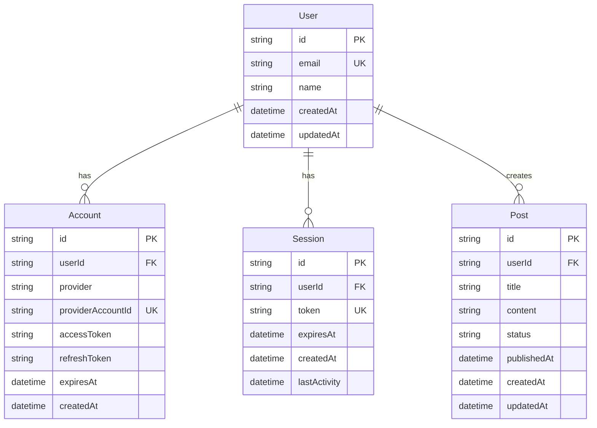
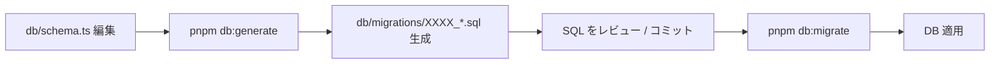
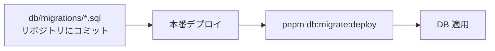

<!-- @einja:managed:start -->
# スキーマ設計

TODO
以下はサンプルで、まだDBは未作成です。

## 概要

このドキュメントでは、Drizzle ORM を使用したデータベーススキーマ設計と、テーブル定義、リレーション設計、マイグレーション戦略について説明します。

PostgreSQL（ローカルは `pg`、本番は Neon serverless）をデータベースとして使用し、Drizzle ORM を `globalThis` キャッシュパターンで運用します。NextAuth との連携は `@auth/drizzle-adapter` を用いて行います。

> 過去経緯: 本プロジェクトは当初 Prisma で運用していましたが、Edge ランタイム互換・スキーマファースト・軽量バンドルといった要件を踏まえて Drizzle ORM へ移行しました。既存 Prisma 環境からの移行手順は §8 のベースライン登録手順を参照してください。

---

## 目次

1. [データベース技術スタック](#1-データベース技術スタック)
2. [ERD（エンティティ関連図）](#2-erdエンティティ関連図)
3. [Drizzleスキーマ定義](#3-drizzleスキーマ定義)
4. [テーブル定義](#4-テーブル定義)
5. [リレーション設計](#5-リレーション設計)
6. [インデックス設計](#6-インデックス設計)
7. [Drizzle DB Client 設定](#7-drizzle-db-client-設定)
8. [マイグレーション戦略](#8-マイグレーション戦略)

---

## 1. データベース技術スタック

| カテゴリ | 技術 | 用途 |
|---------|------|------|
| データベース | PostgreSQL | リレーショナルデータベース |
| ORM | Drizzle ORM (`drizzle-orm`) | 型安全な SQL ビルダー / クエリ層 |
| マイグレーション CLI | `drizzle-kit` | スキーマ差分検出 / SQL 生成 / Studio |
| 本番ドライバ | `@neondatabase/serverless` | Neon 向け WebSocket / HTTP ドライバ |
| ローカルドライバ | `pg` (node-postgres) | localhost / 127.0.0.1 への接続 |
| WebSocket Polyfill | `ws` | Node.js ランタイムで Neon serverless を使う場合に注入 |
| NextAuth 連携 | `@auth/drizzle-adapter` | NextAuth Adapter（Account / Session / VerificationToken / Authenticator） |

**Drizzle の利点**:
- 型安全なクエリ（SQL に近い記法のまま TypeScript の型推論が効く）
- スキーマファースト（TypeScript で定義したテーブル定義が Single Source of Truth）
- 軽量バンドル / Edge Runtime 互換（コード生成不要、ランタイム依存が薄い）
- `drizzle-kit` による差分マイグレーション生成
- Neon serverless ドライバとの相性が良く、Vercel Edge Functions / Cloudflare Workers にもデプロイ可能

---

## 2. ERD（エンティティ関連図）



**エンティティ間のリレーション**:
- **User → Account**: 1対多（1ユーザーは複数のアカウント（OAuth）を持つ）
- **User → Session**: 1対多（1ユーザーは複数のセッションを持つ）
- **User → Post**: 1対多（1ユーザーは複数の投稿を作成）

---

## 3. Drizzleスキーマ定義

### スキーマファイル

**配置場所**: `packages/server-core/db/schema.ts`

すべてのテーブル定義 / Enum / Relations をこのファイルに集約します（schema-first 原則）。`drizzle-kit` はこのファイルを解析して差分マイグレーション SQL を生成するため、**スキーマ変更は必ずこのファイルから行います**。

### drizzle.config.ts

`drizzle-kit` の動作設定。**配置場所**: `packages/server-core/drizzle.config.ts`

```typescript
// packages/server-core/drizzle.config.ts
import { defineConfig } from "drizzle-kit";

export default defineConfig({
  schema: "./db/schema.ts",
  out: "./db/migrations",
  dialect: "postgresql",
  dbCredentials: {
    // Use DIRECT_URL when available (Neon pooler URLs break migration
    // advisory locks). Fall back to DATABASE_URL for non-Neon environments.
    url: process.env.DIRECT_URL ?? process.env.DATABASE_URL!,
  },
  verbose: true,
  strict: true,
});
```

**設計ポイント**:
- `schema`: スキーマ定義ファイルのパス
- `out`: 生成された migration SQL の出力先（`db/migrations/`）
- `dialect`: PostgreSQL 固定
- `dbCredentials.url`: マイグレーション実行時は Neon pooler URL ではなく `DIRECT_URL`（pooler を経由しない接続文字列）を優先。pooler は advisory lock 周りで挙動が安定しないため
- `strict: true`: 破壊的変更時に確認プロンプトを出す（安全側）

### Enum 定義（`pgEnum`）

```typescript
import { pgEnum } from "drizzle-orm/pg-core";

export const userStatusEnum = pgEnum("UserStatus", ["active", "inactive", "pending"]);
export const userRoleEnum = pgEnum("UserRole", ["admin", "user", "moderator"]);
```

**設計ポイント**:
- 第一引数は PostgreSQL 側の Enum 型名（DB 内識別子）
- 第二引数の配列の順序がそのまま Enum の値順になる
- TS 側では `(typeof userStatusEnum.enumValues)[number]` でリテラル Union 型として参照可能

### テーブル定義（`pgTable`）

```typescript
import { pgTable, primaryKey, foreignKey, uniqueIndex, text, integer, boolean, timestamp } from "drizzle-orm/pg-core";

export const users = pgTable(
  "User",
  {
    id: text("id").primaryKey(),
    name: text("name"),
    email: text("email").notNull(),
    emailVerified: timestamp("emailVerified", { precision: 3 }),
    image: text("image"),
    password: text("password"),
    status: userStatusEnum("status").notNull().default("pending"),
    role: userRoleEnum("role").notNull().default("user"),
    lastLogin: timestamp("lastLogin", { precision: 3 }),
    createdAt: timestamp("createdAt", { precision: 3 }).notNull().defaultNow(),
    updatedAt: timestamp("updatedAt", { precision: 3 })
      .notNull()
      .defaultNow()
      .$onUpdate(() => new Date()),
  },
  (t) => [uniqueIndex("User_email_key").on(t.email)],
);
```

**設計ポイント**:
- 第1引数: DB 側のテーブル名（既存 DB との互換のため Pascal Case を維持）
- 第2引数: カラム定義オブジェクト。`text("...")` の引数が DB 側のカラム名
- 第3引数: テーブルレベルの制約 / インデックスを配列で返す（new syntax）
- `timestamp(..., { precision: 3 })`: 既存 Prisma 互換のミリ秒精度
- `$onUpdate(() => new Date())`: アプリ層で更新時刻を更新する hook（Prisma の `@updatedAt` 相当）
- ID 生成（CUID 等）は **アプリ層で行う**（schema には `text("id").primaryKey()` のみ宣言し、デフォルト生成は付けない）

### 複合主キー / 外部キー / 複合ユニーク

```typescript
export const accounts = pgTable(
  "Account",
  {
    userId: text("userId").notNull(),
    type: text("type").notNull(),
    provider: text("provider").notNull(),
    providerAccountId: text("providerAccountId").notNull(),
    // ... 他カラム省略
  },
  (t) => [
    primaryKey({
      name: "Account_pkey",
      columns: [t.provider, t.providerAccountId],
    }),
    foreignKey({
      name: "Account_userId_fkey",
      columns: [t.userId],
      foreignColumns: [users.id],
    })
      .onDelete("cascade")
      .onUpdate("cascade"),
  ],
);
```

**設計ポイント**:
- 制約 `name` を明示することで、既存 DB の制約名と一致させ、`drizzle-kit` が「制約 rename」を誤検出しないようにする
- `.onDelete("cascade") / .onUpdate("cascade")`: NextAuth の Account 削除時にユーザーが消えないよう、親子方向を厳密に意識

### Relations 定義

`drizzle-orm` のクエリビルダーで `with: { ... }` による JOIN を有効化するため、`relations()` でリレーションを宣言します。

```typescript
import { relations } from "drizzle-orm";

export const usersRelations = relations(users, ({ many }) => ({
  accounts: many(accounts),
  sessions: many(sessions),
  authenticators: many(authenticators),
}));

export const accountsRelations = relations(accounts, ({ one }) => ({
  user: one(users, {
    fields: [accounts.userId],
    references: [users.id],
  }),
}));
```

**設計ポイント**:
- `relations()` は **クエリ用の論理リレーション**であり、DB 側の FK 制約とは独立（FK は `foreignKey()` で別途宣言）
- `one` / `many` の選択でカーディナリティを表現
- `db.query.users.findFirst({ with: { accounts: true } })` のような型安全 JOIN が可能になる

### 完全なスキーマ定義（抜粋）

```typescript
// packages/server-core/db/schema.ts
import { relations } from "drizzle-orm";
import {
  boolean,
  foreignKey,
  integer,
  pgEnum,
  pgTable,
  primaryKey,
  text,
  timestamp,
  uniqueIndex,
} from "drizzle-orm/pg-core";

// --- Enums ---
export const userStatusEnum = pgEnum("UserStatus", ["active", "inactive", "pending"]);
export const userRoleEnum = pgEnum("UserRole", ["admin", "user", "moderator"]);

// --- Users ---
export const users = pgTable(
  "User",
  {
    id: text("id").primaryKey(),
    name: text("name"),
    email: text("email").notNull(),
    emailVerified: timestamp("emailVerified", { precision: 3 }),
    image: text("image"),
    password: text("password"),
    status: userStatusEnum("status").notNull().default("pending"),
    role: userRoleEnum("role").notNull().default("user"),
    lastLogin: timestamp("lastLogin", { precision: 3 }),
    createdAt: timestamp("createdAt", { precision: 3 }).notNull().defaultNow(),
    updatedAt: timestamp("updatedAt", { precision: 3 })
      .notNull()
      .defaultNow()
      .$onUpdate(() => new Date()),
  },
  (t) => [uniqueIndex("User_email_key").on(t.email)],
);

// --- Accounts (@auth/drizzle-adapter 互換) ---
export const accounts = pgTable(
  "Account",
  {
    userId: text("userId").notNull(),
    type: text("type").notNull(),
    provider: text("provider").notNull(),
    providerAccountId: text("providerAccountId").notNull(),
    refresh_token: text("refresh_token"),
    access_token: text("access_token"),
    expires_at: integer("expires_at"),
    token_type: text("token_type"),
    scope: text("scope"),
    id_token: text("id_token"),
    session_state: text("session_state"),
    createdAt: timestamp("createdAt", { precision: 3 }).notNull().defaultNow(),
    updatedAt: timestamp("updatedAt", { precision: 3 })
      .notNull()
      .defaultNow()
      .$onUpdate(() => new Date()),
  },
  (t) => [
    primaryKey({
      name: "Account_pkey",
      columns: [t.provider, t.providerAccountId],
    }),
    foreignKey({
      name: "Account_userId_fkey",
      columns: [t.userId],
      foreignColumns: [users.id],
    })
      .onDelete("cascade")
      .onUpdate("cascade"),
  ],
);

// --- Sessions / VerificationTokens / Authenticators は省略（@auth/drizzle-adapter 互換スキーマ）---

// --- Relations ---
export const usersRelations = relations(users, ({ many }) => ({
  accounts: many(accounts),
  sessions: many(sessions),
  authenticators: many(authenticators),
}));

export const accountsRelations = relations(accounts, ({ one }) => ({
  user: one(users, {
    fields: [accounts.userId],
    references: [users.id],
  }),
}));
```

> NextAuth 関連テーブル（`Account` / `Session` / `VerificationToken` / `Authenticator`）は `@auth/drizzle-adapter` が期待するスキーマと整合させる必要があるため、独自カラムの追加には注意。詳細は `@auth/drizzle-adapter` のドキュメントを参照。

---

## 4. テーブル定義

### Userテーブル

| カラム | 型 | 制約 | 説明 |
|--------|----|----|------|
| id | text | PK | ユーザーID（CUID 等、アプリ層で生成） |
| email | text | UNIQUE, NOT NULL | メールアドレス |
| name | text | NULLABLE | ユーザー名 |
| createdAt | timestamp(3) | NOT NULL, defaultNow() | 作成日時 |
| updatedAt | timestamp(3) | NOT NULL, $onUpdate | 更新日時 |

**インデックス**:
- `User_email_key` (uniqueIndex on `email`) - ログイン時の検索を高速化 + 重複防止

**リレーション**:
- `accounts` - Account[] (1対多)
- `sessions` - Session[] (1対多)
- `posts` - Post[] (1対多)

### Accountテーブル

| カラム | 型 | 制約 | 説明 |
|--------|----|----|------|
| userId | text | FK, NOT NULL | ユーザーID |
| provider | text | NOT NULL | OAuth プロバイダ (google, github等) |
| providerAccountId | text | NOT NULL | プロバイダ側のアカウントID |
| access_token | text | NULLABLE | アクセストークン |
| refresh_token | text | NULLABLE | リフレッシュトークン |
| expires_at | integer | NULLABLE | トークン有効期限 (epoch sec) |
| createdAt | timestamp(3) | NOT NULL, defaultNow() | 作成日時 |

**主キー**:
- 複合主キー `Account_pkey` on `[provider, providerAccountId]` - NextAuth Adapter の制約に合わせる

**外部キー**:
- `Account_userId_fkey` on `userId` → `User.id` (onDelete: cascade, onUpdate: cascade)

**リレーション**:
- `user` - User (多対1, onDelete: cascade)

### Sessionテーブル

| カラム | 型 | 制約 | 説明 |
|--------|----|----|------|
| sessionToken | text | UNIQUE, NOT NULL | セッショントークン |
| userId | text | FK, NOT NULL | ユーザーID |
| expires | timestamp(3) | NOT NULL | セッション有効期限 |
| createdAt | timestamp(3) | NOT NULL, defaultNow() | 作成日時 |

**インデックス**:
- `Session_sessionToken_key` (uniqueIndex) - トークンによるセッション検索を高速化 + 重複防止

**外部キー**:
- `Session_userId_fkey` on `userId` → `User.id` (onDelete: cascade, onUpdate: cascade)

**リレーション**:
- `user` - User (多対1, onDelete: cascade)

### Postテーブル

| カラム | 型 | 制約 | 説明 |
|--------|----|----|------|
| id | text | PK | 投稿ID（アプリ層で生成） |
| userId | text | FK, NOT NULL | 作成者ID |
| title | text | NOT NULL | タイトル |
| content | text | NOT NULL | 本文 |
| status | text | NOT NULL, default 'draft' | ステータス (draft, published, archived) |
| publishedAt | timestamp(3) | NULLABLE | 公開日時 |
| createdAt | timestamp(3) | NOT NULL, defaultNow() | 作成日時 |
| updatedAt | timestamp(3) | NOT NULL, $onUpdate | 更新日時 |

**インデックス**:
- `Post_userId_idx` - ユーザーの投稿一覧取得を高速化
- `Post_status_idx` - ステータスによる投稿検索を高速化
- `Post_publishedAt_idx` - 公開日時順のソートを高速化

**外部キー**:
- `Post_userId_fkey` on `userId` → `User.id` (onDelete: cascade, onUpdate: cascade)

**リレーション**:
- `user` - User (多対1, onDelete: cascade)

---

## 5. リレーション設計

### リレーションの種類

#### 1対多リレーション

**User → Post** の例:

スキーマ側（`db/schema.ts`）:

```typescript
export const posts = pgTable(
  "Post",
  {
    id: text("id").primaryKey(),
    userId: text("userId").notNull(),
    // ...
  },
  (t) => [
    foreignKey({
      name: "Post_userId_fkey",
      columns: [t.userId],
      foreignColumns: [users.id],
    })
      .onDelete("cascade")
      .onUpdate("cascade"),
  ],
);

export const usersRelations = relations(users, ({ many }) => ({
  posts: many(posts),
}));

export const postsRelations = relations(posts, ({ one }) => ({
  user: one(users, {
    fields: [posts.userId],
    references: [users.id],
  }),
}));
```

クエリ側:

```typescript
const userWithPosts = await db.query.users.findFirst({
  where: (u, { eq }) => eq(u.id, userId),
  with: { posts: true },
});
```

**削除時の動作** (`onDelete: "cascade"`):
- ユーザーを削除すると、関連する投稿もすべて削除される

#### 外部キー制約

すべての外部キーには、以下のポリシーを適用：

| ポリシー | 説明 |
|---------|------|
| onDelete: "cascade" | 親レコード削除時に子レコードも削除 |
| onUpdate: "cascade" | 親レコード更新時に子レコードも更新 |

**理由**:
- データ整合性の保証
- 孤立レコードの防止
- アプリケーションロジックの簡素化

#### 論理リレーション（`relations()`）と物理 FK の二重宣言

Drizzle は **物理 FK（`foreignKey()`）** と **クエリ用論理リレーション（`relations()`）** を別々に宣言する必要があります（Prisma は 1 箇所で済んでいた部分）。

- `foreignKey()`: DB 側の制約として実際にマイグレーションに反映される
- `relations()`: TypeScript のクエリビルダー（`db.query.*` の `with` 句）で使う論理関係

両方を整合させて宣言することで、DB 整合性とクエリの型安全性を両立できます。

---

## 6. インデックス設計

### インデックス戦略

#### 検索頻度の高いカラム

**Userテーブル**:
- `email` (uniqueIndex) - ログイン時の検索

**Sessionテーブル**:
- `sessionToken` (uniqueIndex) - トークンによるセッション検索
- `userId` - ユーザーのセッション一覧（FK 側に自動でインデックスが付くわけではないため、必要なら明示）
- `expires` - 期限切れセッションのクリーンアップ

**Postテーブル**:
- `userId` - ユーザーの投稿一覧
- `status` - ステータスによる投稿検索
- `publishedAt` - 公開日時順のソート

#### ユニークインデックス

**Userテーブル**:
- `User_email_key` on `email` - メールアドレスの重複防止

**Accountテーブル**:
- 複合主キー `[provider, providerAccountId]` - プロバイダごとのアカウントID重複防止

**Sessionテーブル**:
- `Session_sessionToken_key` on `sessionToken` - セッショントークンの重複防止

### Drizzle でのインデックス宣言例

```typescript
import { index, uniqueIndex } from "drizzle-orm/pg-core";

export const posts = pgTable(
  "Post",
  {
    id: text("id").primaryKey(),
    userId: text("userId").notNull(),
    status: text("status").notNull().default("draft"),
    publishedAt: timestamp("publishedAt", { precision: 3 }),
    // ...
  },
  (t) => [
    index("Post_userId_idx").on(t.userId),
    index("Post_status_idx").on(t.status),
    index("Post_publishedAt_idx").on(t.publishedAt),
  ],
);
```

### インデックスのパフォーマンス影響

| 操作 | インデックスあり | インデックスなし |
|------|---------------|--------------|
| SELECT (WHERE句) | O(log n) | O(n) |
| INSERT | O(log n) | O(1) |
| UPDATE (インデックスカラム) | O(log n) | O(1) |

**トレードオフ**:
- 検索速度の向上 vs 挿入/更新速度の低下
- 本プロジェクトでは、読み取り頻度が高いため、インデックス作成を優先

---

## 7. Drizzle DB Client 設定

### globalThis キャッシュパターン

**目的**: 開発環境での Hot Reload 時に接続プールを使い回し、コネクションリークを防ぐ

**実装ファイル**: `packages/server-core/db/client.ts`

```typescript
// packages/server-core/db/client.ts
import * as schema from "./schema";

const connectionString = process.env.DATABASE_URL;
if (!connectionString) {
  throw new Error("DATABASE_URL is not set");
}

// Use standard pg (node-postgres) for local PostgreSQL (localhost/127.0.0.1),
// and @neondatabase/serverless for Neon production endpoints.
// Local PostgreSQL does not support WebSocket connections required by Neon serverless.
const isNeon =
  connectionString.includes("neon.tech") ||
  connectionString.includes("neon.database");

type AnyPool = import("pg").Pool | import("@neondatabase/serverless").Pool;
type AnyDrizzle =
  | ReturnType<typeof import("drizzle-orm/node-postgres").drizzle>
  | ReturnType<typeof import("drizzle-orm/neon-serverless").drizzle>;

const globalForDb = globalThis as unknown as {
  __einjaDbPool?: AnyPool;
  __einjaDb?: AnyDrizzle;
};

function createDb(): { pool: AnyPool; db: AnyDrizzle } {
  if (isNeon) {
    const { neonConfig, Pool } =
      require("@neondatabase/serverless") as typeof import("@neondatabase/serverless");
    const { drizzle } =
      require("drizzle-orm/neon-serverless") as typeof import("drizzle-orm/neon-serverless");
    // Edge Runtime ではブラウザ WebSocket が利用できるため ws を inject しない。
    // Node.js ランタイムでは ws を inject して Neon serverless の WebSocket を有効化する。
    if (typeof (globalThis as Record<string, unknown>).EdgeRuntime === "undefined") {
      const wsModule = require("ws") as typeof import("ws");
      neonConfig.webSocketConstructor =
        (wsModule.default ?? wsModule) as unknown as typeof WebSocket;
    }
    const pool = new Pool({ connectionString });
    return { pool, db: drizzle(pool, { schema }) };
  } else {
    const { Pool } = require("pg") as typeof import("pg");
    const { drizzle } = require("drizzle-orm/node-postgres") as typeof import("drizzle-orm/node-postgres");
    const pool = new Pool({ connectionString });
    return { pool, db: drizzle(pool, { schema }) as unknown as AnyDrizzle };
  }
}

const instance = globalForDb.__einjaDb
  ? { pool: globalForDb.__einjaDbPool as AnyPool, db: globalForDb.__einjaDb }
  : createDb();

export const pool = instance.pool;
export const db = instance.db;

if (process.env.NODE_ENV !== "production") {
  globalForDb.__einjaDbPool = pool;
  globalForDb.__einjaDb = db;
}
```

**設計ポイント**:
- **接続文字列で driver を分岐**: `neon.tech` / `neon.database` を含む場合は `@neondatabase/serverless`、それ以外は `pg` を使用
- **Edge Runtime 分岐**: Edge Runtime ではブラウザ標準 `WebSocket` が使えるため `ws` を inject しない。Node.js ランタイムでは `ws` を inject して Neon serverless の WebSocket トランスポートを有効化
- **globalThis キャッシュ**: 開発環境では Hot Reload を跨いで pool / db を使い回し、コネクション数の暴発を防ぐ
- **本番**: `NODE_ENV === "production"` の場合は globalThis にキャッシュしない（プロセスごとに新しいインスタンス）
- **スキーマ注入**: `drizzle(pool, { schema })` で schema を渡すことで `db.query.*` の型安全クエリビルダーが有効化される

### クエリログ

Drizzle 自体は標準で詳細な query log を吐かないため、デバッグ時は `drizzle(pool, { schema, logger: true })` を有効にします。

```typescript
const db = drizzle(pool, { schema, logger: true });
// → 実行された SQL とパラメータが stdout に出力される
// 例:
//   Query: select "User"."id", "User"."email" from "User" where "User"."email" = $1 -- params: ['user@example.com']
```

| 環境 | logger | 用途 |
|------|-----------|------|
| development | `true` | デバッグ、パフォーマンス分析 |
| production | `false`（デフォルト） | 通常のオブザーバビリティは APM / OpenTelemetry に委譲 |

---

## 8. マイグレーション戦略

### マイグレーションコマンド

**主要コマンド**:

```bash
# スキーマ変更から SQL マイグレーション生成
pnpm db:generate

# マイグレーション適用（dev / prod 共通: db/migrate.ts を tsx で実行）
pnpm db:migrate

# 本番デプロイ時の適用
pnpm db:migrate:deploy

# Drizzle Studio 起動（GUI でデータ確認・編集）
pnpm db:studio

# マイグレーションの整合性チェック（_journal.json と SQL の整合）
pnpm db:check

# シードデータ投入
pnpm db:seed
```

> **方針**: `drizzle-kit push`（スキーマを DB に直接 push する開発向けコマンド）は **使わない**。すべての変更は `db:generate` → 生成 SQL レビュー → `db:migrate` の流れで履歴管理する。

**ルート `package.json` の scripts（Turbo 経由）**:

```json
{
  "scripts": {
    "db:generate": "turbo run db:generate",
    "db:migrate": "turbo run db:migrate",
    "db:migrate:deploy": "turbo run db:migrate:deploy",
    "db:studio": "turbo run db:studio",
    "db:seed": "turbo run db:seed"
  }
}
```

**`packages/server-core/package.json` の scripts**:

```json
{
  "scripts": {
    "db:generate": "drizzle-kit generate",
    "db:migrate": "tsx db/migrate.ts",
    "db:migrate:deploy": "tsx db/migrate.ts",
    "db:studio": "dotenvx run -f ../../.env -- drizzle-kit studio",
    "db:seed": "dotenvx run -f ../../.env -- tsx db/seed.ts",
    "db:check": "drizzle-kit check"
  }
}
```

### 依存パッケージ

| パッケージ | 用途 | 種別 |
|-----------|------|------|
| `drizzle-orm` | ORM 本体 / クエリビルダー | dependency |
| `drizzle-kit` | CLI（generate / migrate / studio / check） | devDependency |
| `@neondatabase/serverless` | Neon 向けドライバ | dependency |
| `pg` | ローカル PostgreSQL 向けドライバ | devDependency（migrate.ts / Node.js ランタイム実行に必要） |
| `@types/pg` | `pg` の型定義 | devDependency |
| `ws` | Node.js ランタイム向け WebSocket polyfill（Neon serverless 用） | dependency |
| `@types/ws` | `ws` の型定義 | devDependency |
| `@auth/drizzle-adapter` | NextAuth と Drizzle スキーマの接続 | dependency（NextAuth 利用時） |

### マイグレーション実行スクリプト

**実装ファイル**: `packages/server-core/db/migrate.ts`

```typescript
// packages/server-core/db/migrate.ts
import { drizzle } from "drizzle-orm/node-postgres";
import { migrate } from "drizzle-orm/node-postgres/migrator";
import path from "path";
import { Client } from "pg";
import { fileURLToPath } from "url";

const __filename = fileURLToPath(import.meta.url);
const __dirname = path.dirname(__filename);

async function main() {
  // Neon pooler URL は advisory lock が効かないので DIRECT_URL を優先
  const connectionString = process.env.DIRECT_URL ?? process.env.DATABASE_URL;
  if (!connectionString) {
    throw new Error("DATABASE_URL is not set");
  }

  const masked = connectionString.replace(/:[^:@]+@/, ":***@");
  console.log(`Applying migrations to ${masked}`);

  const client = new Client({ connectionString });
  await client.connect();
  try {
    const db = drizzle(client);
    await migrate(db, {
      migrationsFolder: path.join(__dirname, "migrations"),
    });
    console.log("Migrations applied successfully.");
  } finally {
    await client.end();
  }
}

main().catch((err) => {
  console.error("Migration failed:", err);
  process.exit(1);
});
```

**設計ポイント**:
- マイグレーション実行は **`pg` ドライバ固定**（serverless ではなく Node.js の直接接続）。Neon pooler 経由の advisory lock 問題を回避するため
- `DIRECT_URL` 優先 / `DATABASE_URL` フォールバック
- 接続文字列のパスワード部分をマスクしてログ出力

### マイグレーションワークフロー

#### 開発環境



**実行例**:

```bash
# 1. db/schema.ts を編集（カラム追加など）

# 2. マイグレーション SQL を生成
pnpm db:generate

# 3. db/migrations/ 配下に生成された SQL を確認・レビュー

# 4. ローカル DB に適用
pnpm db:migrate

# 5. データ確認
pnpm db:studio
```

#### 本番環境



**実行例** (CI パイプライン):

```yaml
# .github/workflows/deploy.yml
- name: Run migrations
  run: pnpm db:migrate:deploy
  env:
    DATABASE_URL: ${{ secrets.DATABASE_URL }}
    DIRECT_URL: ${{ secrets.DIRECT_URL }}
```

### マイグレーションファイル

**配置場所**: `packages/server-core/db/migrations/`

**構造**:

```
db/migrations/
├── 0000_lowly_george_stacy.sql
├── 0001_add_post_table.sql
└── meta/
    ├── _journal.json
    ├── 0000_snapshot.json
    └── 0001_snapshot.json
```

- `XXXX_*.sql`: 実際に DB に適用される SQL（`drizzle-kit generate` が自動命名）
- `meta/_journal.json`: 適用順序とハッシュの台帳
- `meta/XXXX_snapshot.json`: 各時点のスキーマスナップショット（次回 generate 時の差分計算に使用）

**`0001_add_post_table.sql` の例**:

```sql
CREATE TABLE IF NOT EXISTS "Post" (
    "id" text PRIMARY KEY NOT NULL,
    "userId" text NOT NULL,
    "title" text NOT NULL,
    "content" text NOT NULL,
    "status" text DEFAULT 'draft' NOT NULL,
    "publishedAt" timestamp(3),
    "createdAt" timestamp(3) DEFAULT now() NOT NULL,
    "updatedAt" timestamp(3) DEFAULT now() NOT NULL
);

CREATE INDEX IF NOT EXISTS "Post_userId_idx" ON "Post" ("userId");
CREATE INDEX IF NOT EXISTS "Post_status_idx" ON "Post" ("status");
CREATE INDEX IF NOT EXISTS "Post_publishedAt_idx" ON "Post" ("publishedAt");

ALTER TABLE "Post"
  ADD CONSTRAINT "Post_userId_fkey"
  FOREIGN KEY ("userId") REFERENCES "User"("id")
  ON DELETE CASCADE ON UPDATE CASCADE;
```

### baseline 登録手順（既存 Prisma 適用済み DB 向け）

既に Prisma の migration が適用された開発者のローカル DB / Neon 環境では、`drizzle-kit` が生成する 0000 ベースラインを「再実行」しないよう、`drizzle.__drizzle_migrations` テーブルに「適用済み」エントリを 1 度だけ登録する必要があります。

**スクリプト**: `scripts/db-baseline.sql`

```bash
# 既存 Prisma DB に対して 1 度だけ実行
psql "$DATABASE_URL" -f scripts/db-baseline.sql

# その後は通常通り
pnpm --filter @repo/server-core db:migrate
```

**仕組み**（`scripts/db-baseline.sql` の中身）:

```sql
-- 1. drizzle スキーマ確保
CREATE SCHEMA IF NOT EXISTS drizzle;

-- 2. drizzle migrator が利用する履歴テーブル
CREATE TABLE IF NOT EXISTS drizzle."__drizzle_migrations" (
    id SERIAL PRIMARY KEY,
    hash text NOT NULL,
    created_at bigint
);

-- 3. ベースライン (0000_xxxxx) を「適用済み」としてマーク（冪等）
INSERT INTO drizzle."__drizzle_migrations" (hash, created_at)
SELECT
    '<0000 snapshot のハッシュ>',
    (EXTRACT(EPOCH FROM NOW()) * 1000)::bigint
WHERE NOT EXISTS (
    SELECT 1 FROM drizzle."__drizzle_migrations"
    WHERE hash = '<0000 snapshot のハッシュ>'
);
```

**前提条件**:
- drizzle 0000 が生成する schema と Prisma migration の最終形が **DDL レベルで等価** であること（`prisma migrate diff` で差分 0 を確認済み）
- DDL 自体は実行せず、migration 履歴テーブルに記録するだけ

**安全性**:
- 冪等: 既に同じ hash の行があれば INSERT は実行されない
- 破壊操作なし: CREATE / INSERT のみ

#### fresh DB（新規環境）の場合

新規にプロビジョニングした DB（Prisma 履歴なし）の場合は、baseline 登録は不要です。

```bash
# 1発で初期化完了
pnpm db:migrate
```

### シード（初期データ投入）

**シードファイル**: `packages/server-core/db/seed.ts`

```typescript
// packages/server-core/db/seed.ts
import { randomUUID } from "node:crypto";
import { db, pool } from "./client";
import { users } from "./schema";

async function main() {
  // 本番環境での誤実行ガード
  if (process.env.NODE_ENV === "production" && process.env.ALLOW_PROD_SEED !== "1") {
    throw new Error("Refusing to seed in production. Set ALLOW_PROD_SEED=1 to override.");
  }

  console.log("Seeding database...");

  await db
    .insert(users)
    .values({
      id: randomUUID(),
      email: "admin@example.com",
      name: "Admin User",
      status: "active",
      role: "admin",
    })
    .onConflictDoUpdate({
      target: users.email,
      set: { name: "Admin User", updatedAt: new Date() },
    });

  console.log("Seeding complete!");
}

main()
  .catch((e) => {
    console.error("Seed error:", e);
    process.exit(1);
  })
  .finally(async () => {
    await pool.end();
  });
```

**設計ポイント**:
- `NODE_ENV === "production"` 時は `ALLOW_PROD_SEED=1` がなければ実行を拒否（誤実行ガード）
- 冪等性確保のため `onConflictDoUpdate` を使用（既存ユーザーがいても再実行可能）
- 終了時に `pool.end()` を呼んでプロセスを正しく終了させる

**実行**:

```bash
pnpm db:seed
```

---

## まとめ

このスキーマ設計ドキュメントに従うことで、以下を実現できます：

1. **データ整合性**: 物理 FK と論理リレーションの二重宣言、Cascade ポリシーによる整合性保証
2. **パフォーマンス**: 適切なインデックス設計による高速検索
3. **型安全性**: Drizzle のクエリビルダーによる SQL レベルの型推論
4. **保守性**: `drizzle-kit generate` による差分マイグレーション管理 / スナップショット履歴 / baseline 登録手順
5. **スケーラビリティ**: Neon serverless + Edge Runtime 対応による高いスケーラビリティ
6. **互換性**: `@auth/drizzle-adapter` 経由で NextAuth と統合可能

すべてのスキーマ変更は、このガイドラインに従って実装してください。
<!-- @einja:managed:end -->

<!-- @einja:project-private:start id="db-schema-design-project" -->
<!-- プロジェクト固有の情報を記入 -->
<!-- @einja:project-private:end -->
