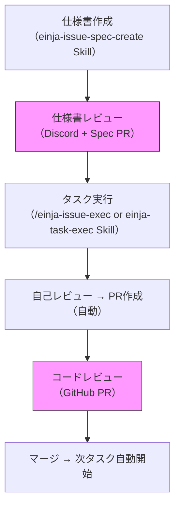
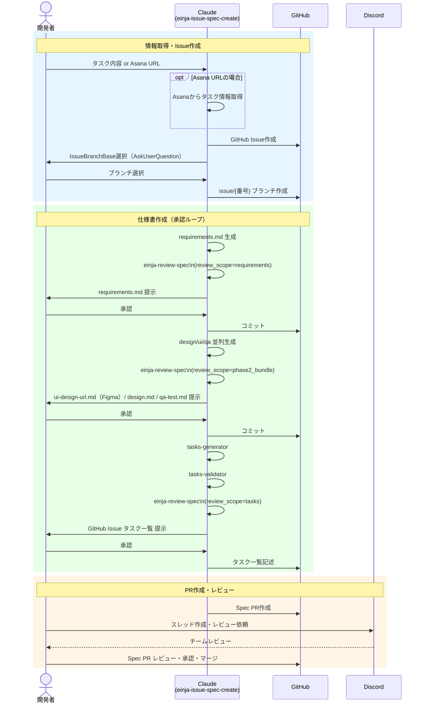
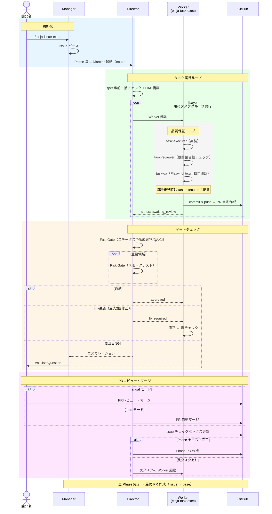
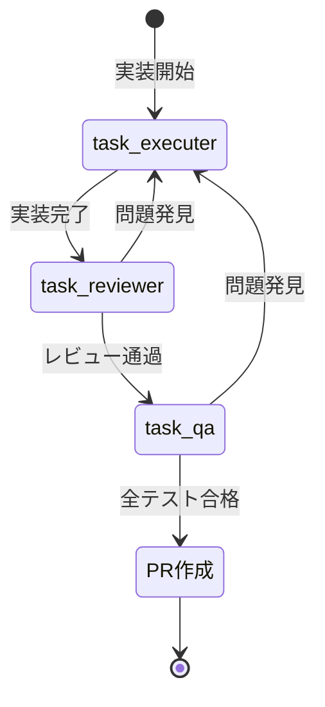
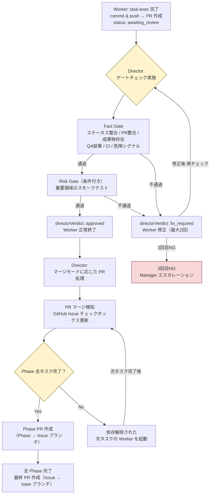
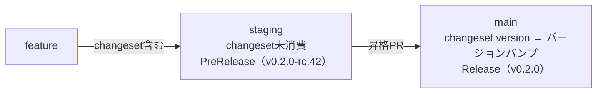

<!-- @einja:managed:start -->
# 開発ワークフロー

このドキュメントでは、仕様書作成からタスク実行・レビュー・マージまでの開発フロー全体を説明します。

## 概要

本プロジェクトでは、Claude Codeを活用した自動化された開発ワークフローを採用しています。



---

## 開発フロー全体図

```mermaid
flowchart TB
  subgraph PhaseA["Phase A: 仕様書作成"]
    A1["1. Asanaからタスク情報取得\n（AsanaURLの場合）"]
    A2["2. GitHub Issue作成"]
    A3["3. IssueBranchBase選択\n（AskUserQuestion）"]
    A4["4. issue/番号 ブランチ作成\n（IssueBranchBaseから）"]
    A5["5. requirements.md作成\n→ 並列レビューゲート\n→ ユーザー承認 → コミット"]
    A5b["6. ui-design-url.md（Figma）/ design.md / qa-test.md作成\n→ 並列レビューゲート\n→ ユーザー承認 → コミット"]
    A6["7. GitHub Issueにタスク一覧記述\n→ バリデーション\n→ 並列レビューゲート\n→ ユーザー承認"]
    A8["8. Spec PR作成"]
    A1 --> A2 --> A3 --> A4 --> A5 --> A5b --> A6 --> A8

    AOut["成果物:\nrequirements.md / ui-design-url.md（Figma）/ design.md\nGitHub Issue / Spec PR"]
    A8 --> AOut
  end

  H1["Discordでスレッド作成・チームレビュー依頼"]
  H2["人間が仕様書をレビュー・承認"]
  H3["Spec PRをマージ"]
  AOut --> H1 --> H2 --> H3

  style H1 fill:#f9f,stroke:#333
  style H2 fill:#f9f,stroke:#333
  style H3 fill:#f9f,stroke:#333

  subgraph PhaseB["Phase B: タスク実行（einja-issue-exec / einja-task-exec）"]
    B1["Manager: Issueパース\nPhase毎にDirectorを起動"]

    subgraph Director["Director（Phase毎）"]
      D1["タスクグループを依存順にWorkerを起動"]

      subgraph Worker["Worker（einja-task-exec）"]
        W1["task-executer: 実装"]
        W2["task-reviewer: 設計整合性チェック"]
        W3["task-qa: 動作確認\n（Playwright/curl）"]
        W4["commit & push → PR自動作成"]
        W5["status → awaiting_review"]
        W1 --> W2 --> W3 --> W4 --> W5
        W2 -- "問題時ループ" --> W1
        W3 -- "問題時ループ" --> W1
      end

      D1 --> W1
      D2["Director ゲートチェック"]
      W5 --> D2
      D2 -- "Fast Gate / Risk Gate 通過" --> D3["Worker正常終了"]
      D2 -- "不通過（最大2回修正）" --> W1
      D2 -- "3回目NG" --> D4["Managerエスカレーション\n→ ユーザーに質問（AskUserQuestion）"]

      D5["GitHubでPRレビュー"]
      D3 --> D5
      D5 --> D6["マージモードに応じてマージ\n（manual / task-group-auto / auto）"]
      D6 --> D7["PR マージ検知\n→ Issue チェックボックス更新"]
      D7 --> D8{"Phase全タスク完了?"}
      D8 -- "Yes" --> D9["Phase PR作成\n（Phase → Issueブランチ）"]
      D8 -- "No" --> D1
    end

    B1 --> D1
    D9 --> B2{"全Phase完了?"}
    B2 -- "No" --> B1
    B2 -- "Yes" --> B3["最終PR作成\n（Issue → baseブランチ）"]
  end

  H3 --> B1

  H4["PRレビュー・マージ → staging / main"]
  B3 --> H4
  style H4 fill:#f9f,stroke:#333

  subgraph PhaseC["Phase C: リリース（自動）"]
    C1["staging マージ時:\nCI + Deploy（承認不要）\n→ PreRelease自動作成\n（v0.2.0-rc.42）"]
    C1h["昇格PR作成・レビュー・マージ"]
    C2["main マージ時:\nCI + ⚠️承認待ち → Migrate + Deploy\n→ changeset version\n→ Release自動作成（v0.2.0）"]
    C1 --> C1h --> C2
    style C1h fill:#f9f,stroke:#333
  end

  H4 --> C1
```



---

## Phase A: 仕様書作成

### 実行方法

`einja-issue-spec-create` Skillを使用して仕様書を作成します。

```
タスク内容の説明またはAsanaタスクURL を引数に指定
```

### ステップ詳細

| ステップ | 実行者                | 内容                                  |
| -------- | --------------------- | ------------------------------------- |
| 1        | Claude                | タスク情報取得（AsanaURLの場合）      |
| 2        | Claude                | GitHub Issue作成                      |
| 3        | Claude → **人間承認** | IssueBranchBase選択                   |
| 4        | Claude                | `issue/{番号}`ブランチ作成            |
| 5        | Claude → **並列レビューゲート** → **人間承認** | requirements.md作成 → `einja-review-spec` → 確認 → コミット |
| 6        | Claude → **並列レビューゲート** → **人間承認** | ui-design-url.md（Figma）/ design.md / qa-test.md作成 → `einja-review-spec` → 確認 → コミット |
| 7        | Claude → **検証 + 並列レビューゲート** → **人間承認** | GitHub Issueにタスク一覧記述 → tasks-validator → `einja-review-spec` → 確認 |
| 8        | Claude                | **Spec PR作成**                       |
| 9        | **人間**              | Discordでチームにレビュー依頼         |
| 10       | **人間**              | Spec PRレビュー・承認・マージ         |

### コールフロー



### 成果物

```
docs/specs/issues/{カテゴリ}/issue{番号}-{機能名}/
├── requirements.md              # 要件定義書（ATDD形式）
├── ui-design-url.md             # UIモックアップ（Figma URL）
├── design.md                    # 設計書（技術詳細）
└── design-component-manifest.json  # DSコンポーネント一覧・不足リスト

GitHub Issue #{番号}   # タスク一覧（Phase別チェックボックス形式）
Spec PR                # 仕様書レビュー用
```

#### デザインシステムファーストの原則

新規のUIコンポーネントが必要な場合、画面実装の前にDSコンポーネントを先行実装する:

1. spec-create で `design-component-manifest.json` を生成（ui-design-generatorが担当）
2. tasks-generator が manifest を読み、`missingFromPackage` があれば [DS] タスクを先行生成
3. [DS] タスクを design-engineer が実装（`packages/ui/` または `packages/admin-ui/`）
4. feature タスクは [DS] タスク完了後に開始（blockedBy 設定）

### 仕様書レビューの観点

- **requirements.md**: 要件の妥当性、受け入れ基準の明確さ、スコープの適切さ
- **design.md**: アーキテクチャの妥当性、既存設計との整合性、実装方針の適切さ
- **タスク一覧**: タスク分解の粒度、依存関係の妥当性

---

## Phase B: タスク実行

### 実行方法

```bash
# Issue全体の並列実行（推奨：複数Phase・複数タスクグループの場合）
/einja-issue-exec #123
/einja-issue-exec #123 --merge-mode task-group-auto   # タスクPR自動マージ
/einja-issue-exec #123 --merge-mode auto               # 全自動
/einja-issue-exec #123 --max-phase 2                   # Phase 2 まで
/einja-issue-exec #123 --base develop                  # ベースブランチ指定

# Issue全体の並列実行（Agent Teams版：tmux不要、Desktop対応）
/einja-issue-team-exec #123

# 単一タスクグループ実行（品質重視・複雑な実装向け）
# einja-task-exec Skill を使用: Issue #123 のタスクグループ 1.1 を実行
```

### 実行後の流れ（/einja-issue-exec）

`/einja-issue-exec` は Manager → Director → Worker の3階層でタスクを並列実行します。

1. **Manager** が Issue をパースし、Phase 毎に Director を tmux で起動
2. **Director** が spec事前一括チェック後、依存グラフ（DAG）を構築し、タスクグループを Layer 順に Worker を起動
3. **Worker** が `einja-task-exec` Skill を実行（executer → reviewer → qa → commit）
4. Worker 完了後、PR が自動作成され、**Director がゲートチェック（Fast Gate / Risk Gate）を実施**
5. ゲート通過後、マージモードに応じて PR がマージされ、次のタスクが自動開始

ユーザーは `tmux attach -t einja-{issue番号}` で全プロセスを監視できます。

### コールフロー



### `/einja-issue-exec` と `einja-task-exec` Skill の使い分け

| 実行方法 | 用途 | 対象 | 推奨シーン |
|---------|------|------|----------|
| **`/einja-issue-exec`** | Issue全体の並列実行 | 複数Phase・複数タスクグループ | 大規模機能実装 |
| **`einja-task-exec` Skill** | 単一タスクグループの確実な完了 | 1つのタスクグループ | 複雑な実装、品質重視 |
| **`/einja-issue-team-exec`** | Issue全体の並列実行（Agent Teams） | 複数Phase・複数タスクグループ | Desktop環境、tmux未インストール環境 |

### サブエージェントの役割

| サブエージェント | 役割                           | 従来の開発フローとの対応   |
| ---------------- | ------------------------------ | -------------------------- |
| task-executer    | 実装                           | 実装者による実装           |
| task-reviewer    | 設計との整合性チェック         | 実装者によるセルフレビュー |
| task-qa          | 動作確認（Playwright/curl）    | 実装者による動作確認       |

### 品質保証ループ

`task-reviewer`または`task-qa`で問題が発見された場合、自動的に`task-executer`に戻って修正が行われます。



### マージ後の自動処理（/einja-issue-exec 使用時）



---

## PRの種類

本ワークフローでは2種類のPRが作成されます。

| PRの種類    | 作成タイミング       | 内容                       | レビュー観点                                   |
| ----------- | -------------------- | -------------------------- | ---------------------------------------------- |
| **Spec PR** | `einja-issue-spec-create` Skill完了時 | requirements.md, ui-design-url.md（Figma）, design.md | 要件の妥当性、UIデザインの適切さ、設計の適切さ、スコープの確認 |
| **実装PR**  | タスクグループ完了時（Worker が自動作成） | ソースコード、テスト       | コード品質、設計書との整合性、テストカバレッジ |

### なぜ2段階でPRを作成するのか

1. **仕様書に問題があると、実装後に大きな手戻りが発生する**
2. **実装前に他のエンジニアの視点で設計の妥当性を確認できる**
3. **「Spec PR」と「実装PR」を分けることで、レビューの焦点が明確になる**

---

## 人間の関与ポイント

### 仕様書作成フェーズ

- **requirements.md承認**: 要件の過不足、受け入れ基準の明確性を確認
- **design.md承認**: アーキテクチャの妥当性、実装方針を確認
- **タスク一覧承認**: タスク分解の粒度、依存関係の妥当性を確認
- **Discordレビュー依頼**: チームにスレッドを作成してレビュー依頼
- **Spec PRレビュー**: 仕様書全体のレビュー・承認

### タスク実行フェーズ

- **PRレビュー**: Worker が自動作成した PR の内容を確認
- **PRマージ**: マージモードが manual の場合、GitHub で PR をマージ
- **質問回答**: Manager から AskUserQuestion でエスカレーションされた質問に回答

### Claudeのセルフチェックについて

`task-reviewer`と`task-qa`は、従来の開発フローにおける「実装者によるセルフチェック」に相当します。

| 従来（人間が実装） | 現在（Claudeが実装） |
|------------------|-------------------|
| 実装者がセルフチェック | `task-reviewer` + `task-qa` がセルフチェック |
| セルフチェック後にPR作成 | セルフチェック後に自動でPR作成 |
| 他のエンジニアがPRレビュー | 人間（担当者 + 他エンジニア）がPRレビュー |

---

## コマンドリファレンス

### 仕様書作成

`einja-issue-spec-create` Skill を使用します。

```bash
# タスク内容の説明から仕様書を作成
<タスク内容の説明>

# AsanaタスクURLから仕様書を作成
<AsanaタスクURL>

# 既存仕様書のパスを指定して修正
<タスク内容> <既存仕様書パス>
```

### タスク実行

```bash
# Issue全体の並列実行（推奨）
/einja-issue-exec #<issue_number>

# オプション指定
/einja-issue-exec #<issue_number> --merge-mode auto --max-phase 2

# 単一タスクグループ実行（品質重視・複雑な実装向け）
# einja-task-exec Skill を使用: #<issue_number> <task_group_number>

# 例
/einja-issue-exec #123                                   # Issue #123 の全タスクを並列実行
/einja-issue-exec #123 --merge-mode task-group-auto      # タスクPR自動マージ
# einja-task-exec Skill: #123 1.1                        # タスクグループ 1.1 を単発実行
```

---

## 関連ドキュメント

- [タスク管理ガイドライン](task-management.md) - タスク階層、粒度基準、GitHub Issue管理
- [Issue実行ワークフロー](../instructions/issue-exec-workflow.md) - Issue実行の詳細な使い方
- [ブランチ戦略](branch-strategy.md) - ブランチ運用ルール
- [コードレビューガイドライン](development/review-guidelines.md) - 品質基準とチェックリスト

---

## Phase C: リリース

### changeset運用フロー

PRにchangesetを含めることで、バージョン管理とリリースノートが自動化されます。

#### changeset追加手順

```bash
# 1. changeset対話UIを起動
pnpm changeset

# 2. 変更対象パッケージを選択（apps/web, apps/admin等）
# 3. 変更種別を選択（major / minor / patch）
# 4. 変更サマリーを入力
# 5. .changeset/ にmdファイルが生成される
# 6. コミットに含める
```

#### 自動生成（einja-create-pr Skill）

`/einja-create-pr` またはtask-exec/issue-exec経由でPR作成する場合、changesetは自動生成されます。

#### changesetの要否

| 変更内容 | changeset必要 |
|---------|:------------:|
| 新機能追加（apps/配下） | ✅ |
| バグ修正（apps/配下） | ✅ |
| ドキュメントのみ | ❌ |
| CI/CD設定のみ | ❌ |
| .claude/ 設定のみ | ❌ |
| packages/（内部パッケージ） | ❌ |

#### changeset消費フロー



---

## FAQ

### Q: Spec PRをマージする前にタスク実行を開始できますか？

**A: 推奨しません。** 仕様書に問題があると実装後に大きな手戻りが発生します。必ず仕様書レビューを完了してからタスク実行を開始してください。

### Q: task-qaで行われる動作確認は何をチェックしていますか？

**A:** requirements.mdの受け入れ条件に基づいて、Playwright MCP（画面テスト）やcurl（APIテスト）で実際に動作確認を行います。

### Q: 人間によるQAテストは必要ですか？

**A:** Claudeの`task-qa`がセルフチェックとして動作確認を行いますが、PRレビュー時に担当者が追加の動作確認を行うことを推奨します。特に重要な機能や複雑なUIについては、人間による確認が有効です。

### Q: タスクグループの粒度はどのように決まりますか？

**A:** [タスク管理ガイドライン](task-management.md)を参照してください。基本的には「1つの受け入れ条件を満たす」「1PR・1デプロイ・1QAテスト対象として適切（1-4時間）」が目安です。

### Q: PRのマージはどこで行いますか？

**A:** マージモードによって異なります：
- **manual**（デフォルト）: GitHub側で手動マージしてください。Director がマージを検知して次のタスクを開始します。
- **task-group-auto**: タスクグループPRは自動マージされます。Phase PRは手動マージです。
- **auto**: タスクPR・Phase PRが自動マージされます。最終PR（issue→base）は常に手動マージです。

---

## エージェント追加時のチェックリスト

新しいサブエージェントを追加する際は、以下の項目を必ず確認すること。

### 必須項目

- [ ] **エージェント定義ファイル**（`.claude/agents/einja/{category}/{name}.md`）を作成
  - [ ] `name`, `description`, `model`, `color` のメタデータを設定
  - [ ] 役割・責務を明記
  - [ ] 処理フローを記載
  - [ ] **出力形式セクションを追加**（CLAUDE.mdの標準構造に準拠）

- [ ] **出力形式の統一**
  - [ ] `## [絵文字] [フェーズ名]完了` の形式でヘッダー
  - [ ] `### タスク:` でタスク識別情報
  - [ ] `### [メイン結果]:` でステータス（SUCCESS/FAILURE/PARTIAL）
  - [ ] `### サマリー` で主要結果
  - [ ] `### 次のステップ` で後続処理説明

- [ ] **親エージェントとの連携**
  - [ ] 呼び出し元（前提エージェント）を明記
  - [ ] 後続エージェントを明記
  - [ ] 差し戻し先（該当する場合）を明記

### 推奨項目

- [ ] **エラーハンドリング**
  - [ ] 想定されるエラーパターンを列挙
  - [ ] 各エラーに対する対処方法を記載

- [ ] **AskUserQuestion使用箇所**
  - [ ] ユーザー確認が必要な判断ポイントを明記

### 出力形式テンプレート

```markdown
## 出力形式

処理完了後、以下の形式で報告を出力すること：

\`\`\`markdown
## [絵文字] [フェーズ名]完了

### タスク: [タスクID] - [タスク名]

### [メイン結果]: [✅ SUCCESS / ❌ FAILURE / ⚠️ PARTIAL]

### サマリー
[主要な結果・数値]

### 詳細
[項目別の詳細情報]

### 次のステップ
[後続処理の説明]
\`\`\`
```
<!-- @einja:managed:end -->

<!-- @einja:project-private:start id="development-workflow-project" -->
<!-- プロジェクト固有の情報を記入 -->
<!-- @einja:project-private:end -->
