<!-- @einja:managed:start -->
# デプロイメント・CI/CD設計方針

## 概要

このドキュメントでは、プロジェクトのデプロイメントとCI/CDパイプラインの**設計方針**を説明します。

具体的な設定手順については以下を参照してください：
- [デプロイセットアップ手順](../../instructions/deployment-setup.md)
- [環境変数セットアップ手順](../../instructions/environment-setup.md)

---

## 目次

1. [デプロイメントアーキテクチャ](#1-デプロイメントアーキテクチャ)
2. [プラットフォーム選定理由](#2-プラットフォーム選定理由)
3. [GitHub Actionsワークフロー](#3-github-actionsワークフロー)
4. [ブランチ別デプロイフロー](#4-ブランチ別デプロイフロー)
5. [キャッシュ戦略](#5-キャッシュ戦略)
6. [Worktree対応設計](#6-worktree対応設計)
7. [ロールバック戦略](#7-ロールバック戦略)

---

## 1. デプロイメントアーキテクチャ

### 全体構成

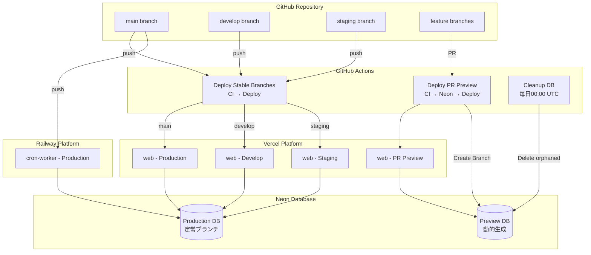

### デプロイメント対象

| アプリケーション | プラットフォーム | デプロイトリガー | 環境 |
|----------------|--------------|--------------|------|
| web | Vercel | main/develop/staging push, PR作成 | Production, Preview |
| cron-worker | Railway | main push | Production |
| Database | Neon | PR作成時のみ動的生成 | Production, Preview（動的生成） |

---

## 2. プラットフォーム選定理由

### Vercel（Web/Admin）

**選定理由**:
- Next.jsの開発元であり、最適化が保証されている
- Edge NetworkによるグローバルCDN配信
- Preview Deploymentsによる迅速なレビュー
- Turborepo Remote Cacheとの統合

**採用機能**:
- Standalone Build（コンテナサイズ最小化）
- ISR（Incremental Static Regeneration）
- Edge Middleware

### Railway（Cron Worker）

**選定理由**:
- ネイティブCronジョブサポート
- Dockerコンテナのシンプルなデプロイ
- 環境変数のシームレスな管理
- 従量課金で低コスト運用可能

**採用機能**:
- Cron Job Scheduling
- Docker Image Deploy
- Health Checks

---

## 3. GitHub Actionsワークフロー

### ワークフロー一覧

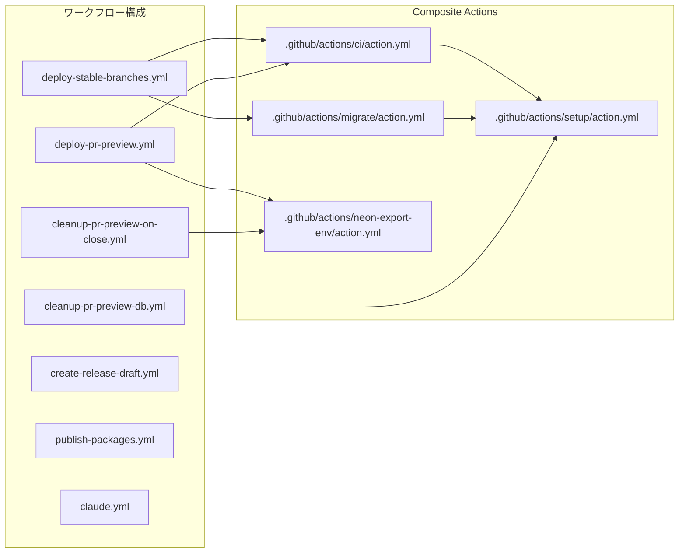

| ワークフロー | ファイル | トリガー | 用途 |
|------------|---------|---------|------|
| **Deploy Stable** | `deploy-stable-branches.yml` | push to main/develop/staging | CI → 動的マトリクス → 変更アプリのみデプロイ → Release/PreRelease公開 |
| **PR Preview** | `deploy-pr-preview.yml` | PR opened/sync/closed | CI → Neonブランチ作成 → プレビューデプロイ |
| **Release Draft** | `create-release-draft.yml` | PR to main/staging | Draft Release作成 → PRコメント → close時クリーンアップ |
| **Publish Packages** | `publish-packages.yml` | workflow_run (Deploy Stable成功) / 手動 | NPMパッケージ差分検出 → build → publish |
| **PR Close Cleanup** | `cleanup-pr-preview-on-close.yml` | PR closed | Neonブランチ削除 |
| **Cleanup DB** | `cleanup-pr-preview-db.yml` | 毎日00:00 UTC / 手動 | 孤立Neonブランチ削除 |
| **Claude** | `claude.yml` | @claude メンション | Claude Code実行 |

### Composite Actions（2層構造）

バージョン番号を1箇所に集約し、DRY原則に従った構成：

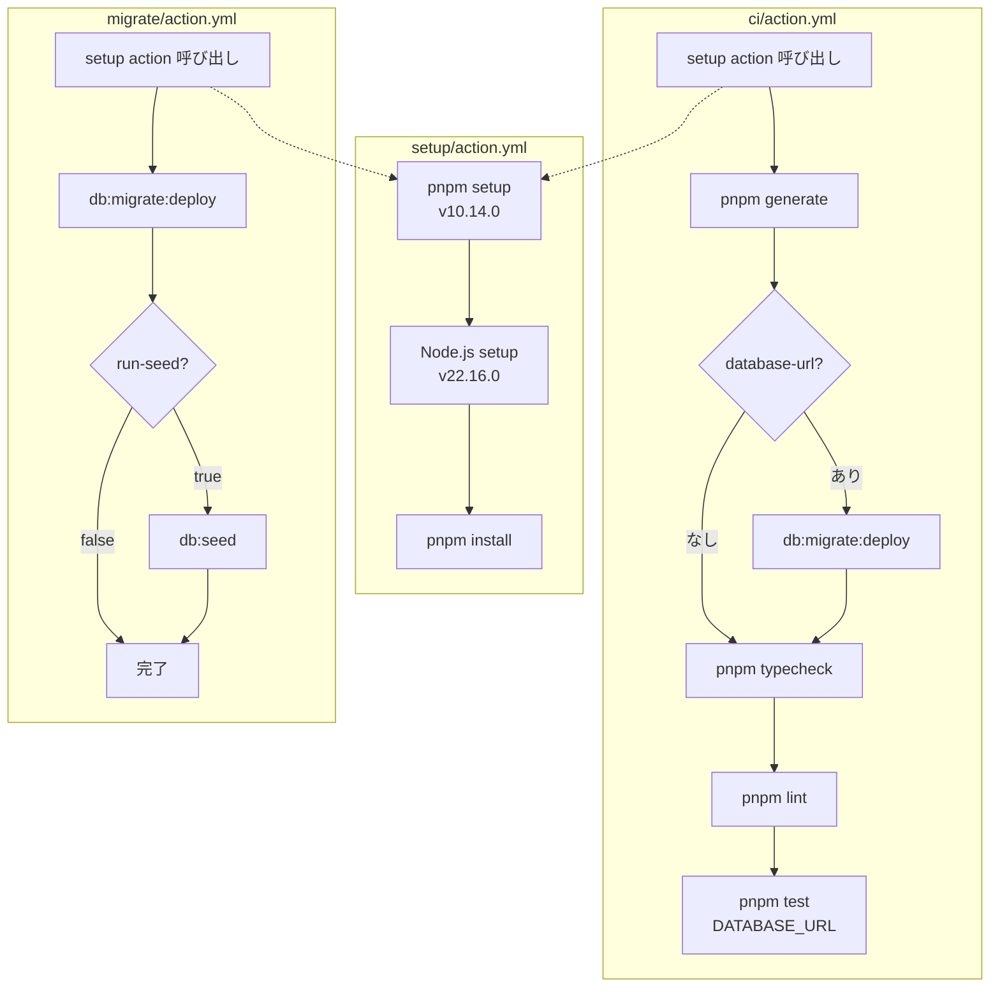

| Action | ファイル | 内容 | 呼び出し元 |
|--------|---------|------|-----------|
| **Setup** | `actions/setup/action.yml` | pnpm + Node.js + install | ci action, migrate action, cleanup |
| **CI** | `actions/ci/action.yml` | setup → generate → [migrate] → typecheck → lint → test | deploy-stable-branches, deploy-pr-preview |
| **Migrate** | `actions/migrate/action.yml` | setup → migrate → seed (optional) | deploy-stable-branches |
| **Neon Export Env** | `actions/neon-export-env/action.yml` | .env.previewからNeon環境変数をエクスポート | deploy-pr-preview, cleanup-pr-preview-on-close |

### 実行マトリクス

| トリガー | Deploy Stable | PR Preview | 備考 |
|---------|:-------------:|:----------:|------|
| feature/* push | ❌ | - | CIなし（PR時に実行） |
| main push | ✅ | - | CI → 本番デプロイ |
| develop push | ✅ | - | CI → 開発環境デプロイ |
| staging push | ✅ | - | CI → ステージングデプロイ |
| PR → main/develop 作成 | ❌ | ✅ | CI → Neon作成 → プレビュー |
| PR → main/develop 更新 | ❌ | ✅ | CI → プレビュー更新 |
| PR クローズ | ❌ | ✅ | Neonブランチ削除 |
| フォークPR | ❌ | ❌ | Secret制限のため |

### ワークフロー シーケンス図

#### deploy-pr-preview.yml（PR → CI + プレビューデプロイ）

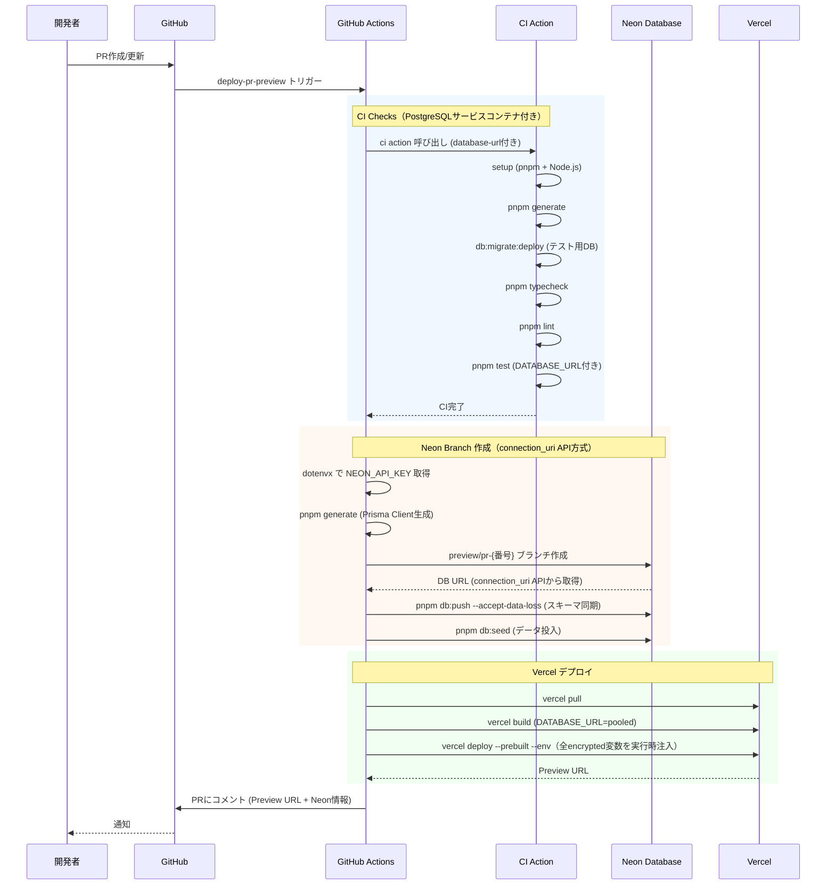

#### deploy-stable-branches.yml（stable push → CI + 本番デプロイ）

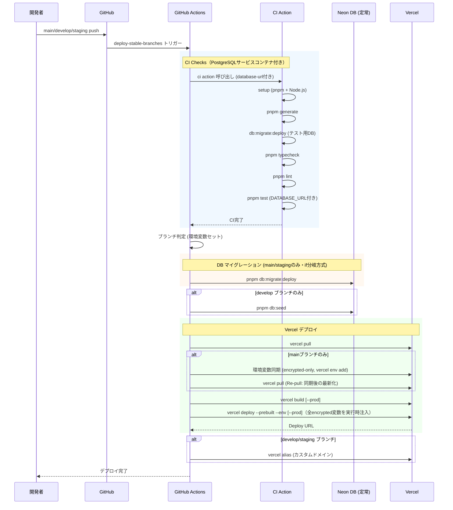

#### cleanup-pr-preview-db.yml（cron → setup + Neon cleanup）

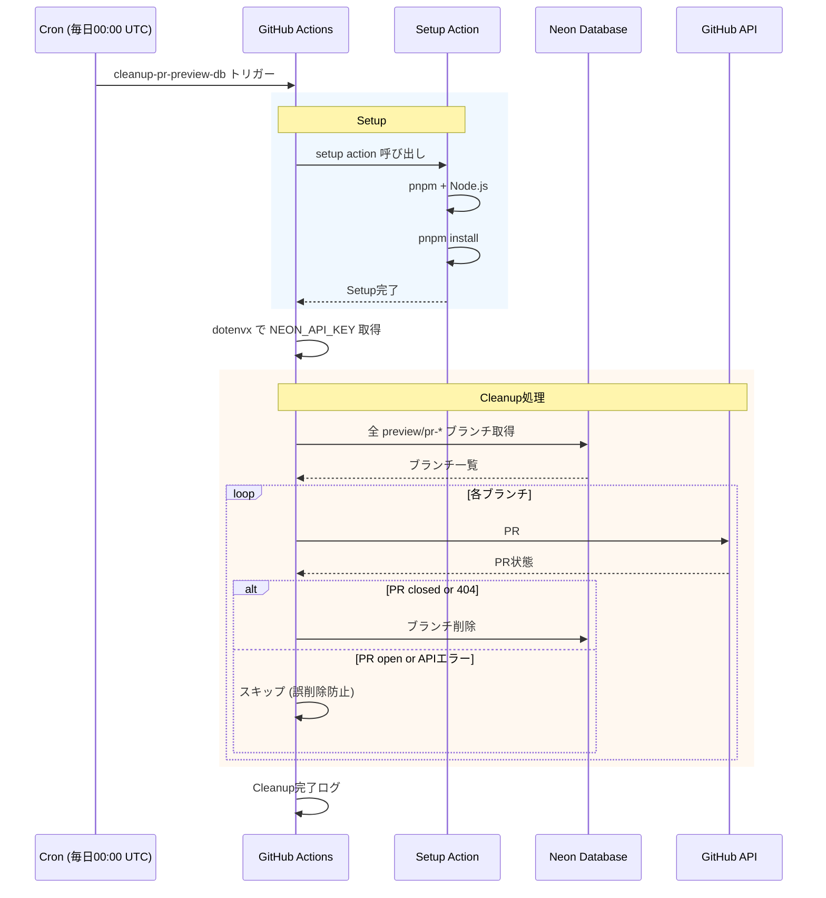

> **設計意図**: ci.ymlはpull_requestのみをトリガーとし、feature/* pushでの二重CI実行を防止

### 並行実行制御（Concurrency）

| ワークフロー | concurrencyグループ | cancel-in-progress | 説明 |
|------------|-------------------|:-----------------:|------|
| deploy-pr-preview | `pr-preview-{PR番号}` | true | 最新コミットのみデプロイ |
| cleanup-pr-preview-on-close | `pr-preview-{PR番号}` | true | 同グループでPRデプロイと排他制御 |
| deploy-stable-branches | `deploy-{ブランチ名}` | false | 全コミットを順次デプロイ |

---

## 4. ブランチ別デプロイフロー

### mainブランチ（本番環境）

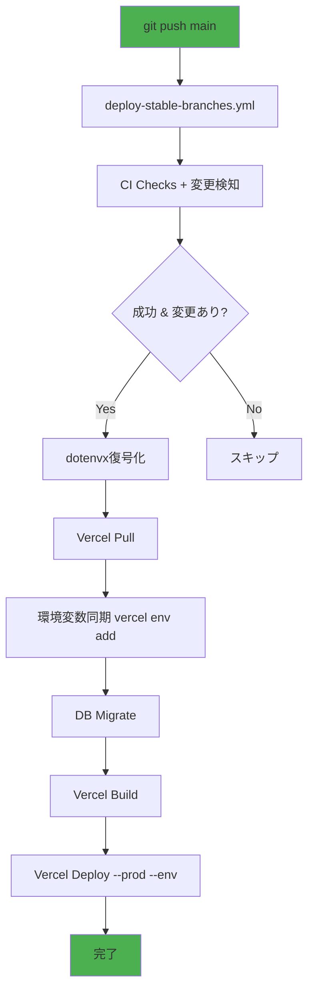

**設定**:
- Vercel環境: `production`
- 暗号化ファイル: `.env.production`
- 復号鍵: `DOTENV_PRIVATE_KEY_PRODUCTION`
- DBマイグレーション: ✅
- DBシード: ❌（テストデータのため本番非対応）
- Alias設定: ❌

---

### developブランチ（開発環境）

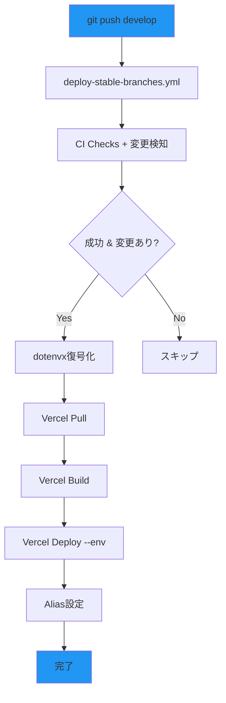

**設定**:
- Vercel環境: `preview`
- 暗号化ファイル: `.env.develop`
- 復号鍵: `DOTENV_PRIVATE_KEY_DEVELOP`
- DBマイグレーション: ❌（PR PreviewのNeonブランチで自動同期）
- DBシード: ❌
- Alias: `.env.develop` 内の `VERCEL_ALIAS_DOMAIN_WEB` / `VERCEL_ALIAS_DOMAIN_ADMIN`（dotenvx復号で取得）

---

### stagingブランチ（ステージング環境）

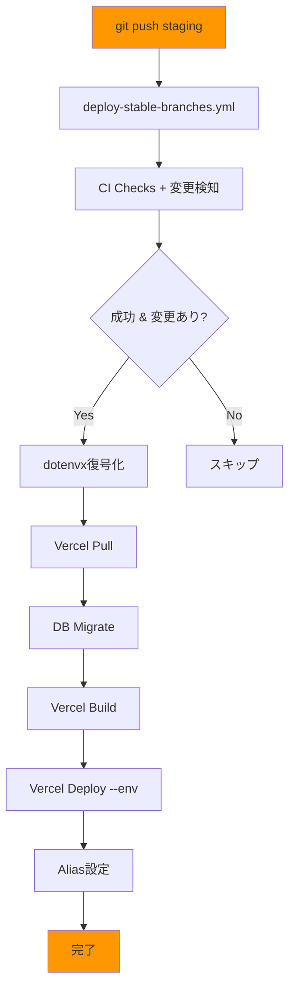

**設定**:
- Vercel環境: `preview`
- 暗号化ファイル: `.env.staging`
- 復号鍵: `DOTENV_PRIVATE_KEY_STAGING`
- DBマイグレーション: ✅
- DBシード: ❌（既存データ保持）
- Alias: `.env.staging` 内の `VERCEL_ALIAS_DOMAIN_WEB` / `VERCEL_ALIAS_DOMAIN_ADMIN`（dotenvx復号で取得）

---

### Pull Request（プレビュー環境）

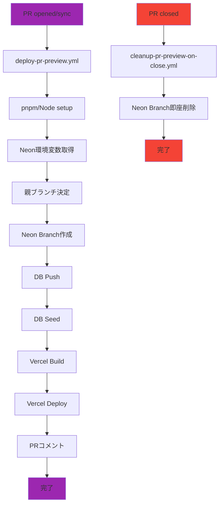

**設定**:
- Vercel環境: `preview`
- 暗号化ファイル: `.env.preview`
- 復号鍵: `DOTENV_PRIVATE_KEY_PREVIEW`
- Neonブランチ: `preview/pr-{PR番号}`
- 親ブランチ: PRのベースブランチ（main/develop等）
- Auto-suspend: 1日間アクセスなし
- PRコメント: Preview URL + Neon Branch情報

> **⚠️ 同時PR運用時の注意**
>
> テンプレートでは`vercel deploy --env KEY=VALUE`でデプロイ単位で
> 全encrypted環境変数（DATABASE_URL含む）を実行時注入しています。
> これにより、同時に複数のPRがプレビューデプロイされても、
> それぞれのPRが固有のNeonブランチDBを参照し、環境変数の競合が発生しません。
>
> PR環境では`vercel env add`は使用しません（並行PR間の競合を防ぐため）。

---

### 環境別設定一覧

| 環境 | ブランチ | Vercel環境 | DBマイグ | シード | Alias | 暗号化ファイル | 復号鍵 |
|------|---------|-----------|:-------:|:-----:|:-----:|--------------|--------|
| Production | main | production | ✅ | ❌ | ❌ | `.env.production` | `DOTENV_PRIVATE_KEY_PRODUCTION` |
| Develop | develop | preview | ❌ | ❌ | ✅ `VERCEL_ALIAS_DOMAIN_*` | `.env.develop` | `DOTENV_PRIVATE_KEY_DEVELOP` |
| Staging | staging | preview | ✅ | ❌ | ✅ `VERCEL_ALIAS_DOMAIN_*` | `.env.staging` | `DOTENV_PRIVATE_KEY_STAGING` |
| PR Preview | feature/* | preview | ✅ | ✅ | ❌ | `.env.preview` | `DOTENV_PRIVATE_KEY_PREVIEW` |

### Vercel環境変数の自動同期

ワークフローは **encrypted-only方式** で同期対象を制御:

| ワークフロー | 方式 | 同期対象 | 除外 | 説明 |
|------------|------|---------|------|------|
| PR Preview | `--env`実行時注入 | `.env.preview` 内の `encrypted:` キー | `NEON_*`, `DOTENV_PUBLIC_KEY_*` | `vercel env add`は使用しない（並行PR競合防止） |
| Stable (main) | `vercel env add` + `--env`実行時注入 | `.env.production` 内の `encrypted:` キー | `NEON_*` | mainのみVercel環境変数ストアに同期 |
| Stable (develop/staging) | `--env`実行時注入 | `.env.{env}` 内の `encrypted:` キー | `NEON_*`, `VERCEL_ALIAS_DOMAIN_*`, `DOTENV_PUBLIC_KEY_*` | `vercel env add`は使用しない |

**設計意図**: `vercel env add`によるVercel環境変数ストアへの書き込みはmainブランチのみに限定。develop/staging/PRは`vercel deploy --env`による実行時注入で環境変数を渡し、並行デプロイ間の競合を防止する。

---

### Neonプレビューブランチのクリーンアップ

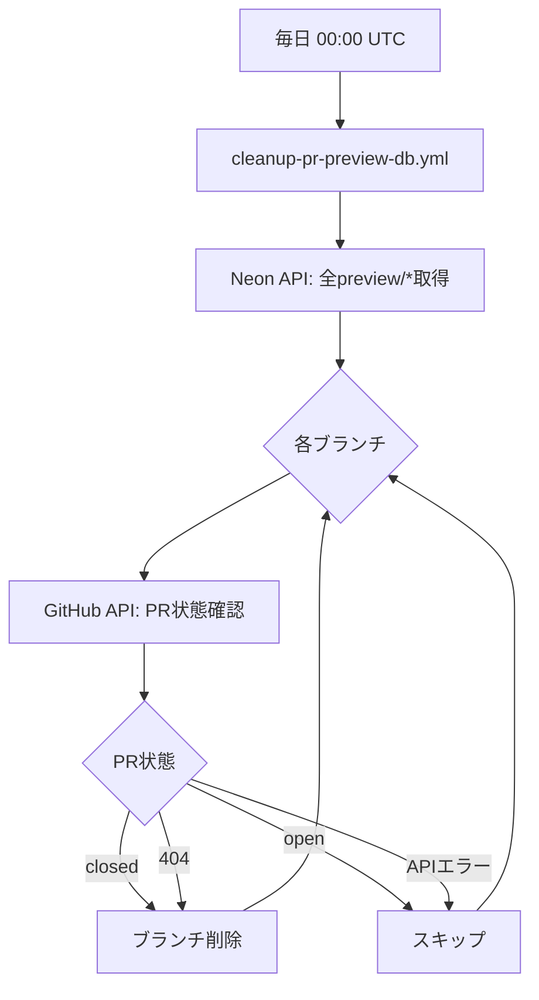

**設計意図**:
- 孤立したNeonブランチの自動削除
- APIエラー時はスキップ（誤削除防止）
- コスト最適化

**2種類のクリーンアップ:**
1. **即時削除** (`cleanup-pr-preview-on-close.yml`): PR close時に即座にNeonブランチ削除
2. **定期クリーンアップ** (`cleanup-pr-preview-db.yml`): 毎日00:00 UTC、孤立ブランチ（手動削除漏れ等）をAPI経由で検知・削除

---

## 5. キャッシュ戦略

### Turborepo Remote Cache

**設計方針**:
- ビルド成果物をVercel Remote Cacheに保存
- チーム間でキャッシュを共有し、ビルド時間を大幅短縮
- 環境変数の変更時は自動でキャッシュ無効化

### キャッシュ対象

| タスク | キャッシュ | 理由 |
|--------|----------|------|
| build | ✅ | ビルド成果物を再利用 |
| generate | ✅ | `src/__generated__/**` をキャッシュ（outputs定義） |
| lint | ✅ | ソースコード未変更時はスキップ |
| typecheck | ✅ | 型定義未変更時はスキップ |
| test | ✅ | テストコード・対象未変更時はスキップ |
| dev | ❌ | 開発サーバーは継続実行 |
| db:* | ❌ | データベース操作は冪等性なし |

### キャッシュ効果

| タスク | キャッシュなし | キャッシュあり | 削減率 |
|--------|--------------|--------------|--------|
| lint | 10s | 2s | 80% |
| typecheck | 15s | 3s | 80% |
| build | 45s | 5s | 89% |
| test | 30s | 4s | 87% |
| **合計** | **100s** | **14s** | **86%** |

---

## 6. Worktree対応設計

### 課題

複数のブランチを並行開発する際、ポート番号が衝突する問題がある。

### 解決策

SHA-256ハッシュベースの動的ポート割り当てを採用。

**設計方針**:
1. ブランチ名からSHA-256ハッシュを生成
2. ハッシュ値からポート番号を算出（衝突確率を最小化）
3. 環境変数に自動設定し、Turborepoに引き継ぎ

### ポート割り当て設計

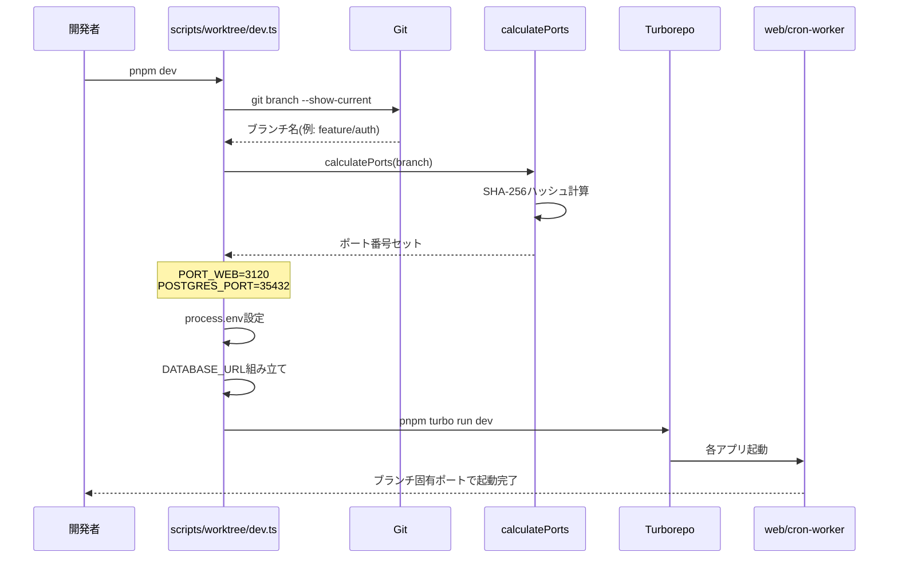

### ポート範囲設計

| ポート | 範囲 | 用途 |
|--------|------|------|
| PORT_WEB | 3000-3999 | Webアプリ |
| POSTGRES_PORT | 35432 (固定) | PostgreSQL |

---

## 7. ロールバック戦略

### 設計方針

1. **即時ロールバック**: デプロイ履歴から1クリックで前バージョンに戻す
2. **DB互換性**: マイグレーションは常に後方互換を維持
3. **Feature Flags**: 大きな変更はフラグで制御し、段階的リリース

### Vercelロールバック

**方針**: Instant Rollbackを活用し、ダウンタイムなしでロールバック

1. Vercel Dashboardで過去のデプロイを選択
2. "Promote to Production" で即座に切り替え
3. DNS/CDN自動更新で反映

### Railwayロールバック

**方針**: Dockerイメージタグによるバージョン管理

1. 各デプロイにgit SHAタグを付与
2. 問題発生時は前バージョンのイメージを再デプロイ

### データベースロールバック

**方針**: 破壊的マイグレーションを避け、後方互換を維持

- カラム削除は2フェーズで実施（非推奨化 → 削除）
- 型変更は新カラム追加 → データ移行 → 旧カラム削除
- インデックス追加は`CREATE CONCURRENTLY`で無停止実行

---

## 8. リリース管理

### リリースフロー全体像

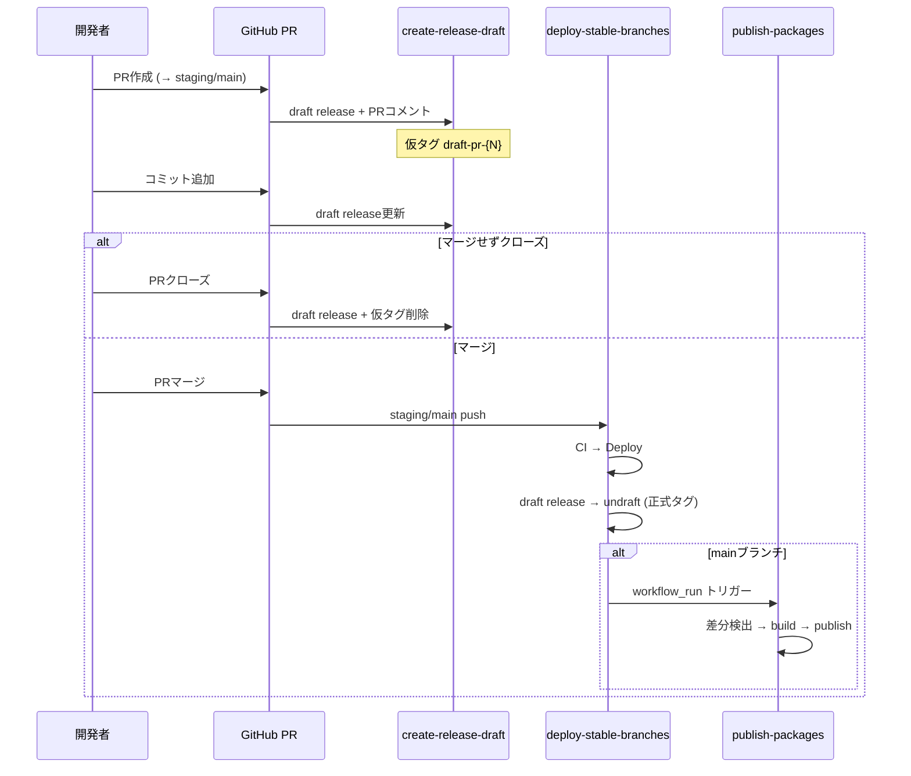

### GitHub Release / PreRelease 自動作成フロー

| 環境 | リリース種別 | タグ形式 | changeset消費 | 承認 |
|------|------------|---------|:------------:|:----:|
| staging | PreRelease | `v{version}-rc.{run_number}` | ❌ | 不要 |
| production | Release | `v{version}` | ✅ | 1名必要 |

### ワークフロー別リリースジョブ

| ジョブ | ワークフロー | トリガー | 処理内容 |
|--------|------------|---------|---------|
| `create-draft` | `create-release-draft.yml` | PR opened/sync/reopen | Draft Release作成 + PRコメント |
| `cleanup` | `create-release-draft.yml` | PR closed (マージなし) | Draft Release + 仮タグ削除 |
| `release-staging` | `deploy-stable-branches.yml` | staging push | マージコミットからPR番号特定 → Draft Releaseをundraft (PreRelease) |
| `release-production` | `deploy-stable-branches.yml` | main push | changeset version → Draft Releaseをundraft (Release) |
| `publish-cli` | `publish-packages.yml` | workflow_run / 手動 | @einja-inc/dev-cli 差分検出 → build → publish |
| `publish-create-app` | `publish-packages.yml` | workflow_run / 手動 | @einja-inc/create-app 差分検出 → build → publish |

### NPMリリースとの棲み分け

| タグパターン | 用途 | 生成元 |
|-------------|------|--------|
| `v1.2.0` | アプリ Stable Release | deploy-stable-branches.yml |
| `v1.2.0-rc.42` | アプリ PreRelease | deploy-stable-branches.yml |
| `draft-pr-{N}` | PR Draft Release（仮タグ） | create-release-draft.yml |
| `cli-v0.1.50` | @einja-inc/dev-cli | publish-packages.yml（自動/手動） |
| `create-app-v0.3.5` | @einja-inc/create-app | publish-packages.yml（自動/手動） |

---

## 9. バージョニング戦略

### changesets

[changesets](https://github.com/changesets/changesets) を使用してセマンティックバージョニングを管理。

| 変更種別 | changeset指定 | バージョン変更例 | 使用シーン |
|---------|--------------|----------------|----------|
| 破壊的変更 | `major` | `0.1.0` → `1.0.0` | API仕様変更、DB破壊的マイグレーション |
| 新機能追加 | `minor` | `0.1.0` → `0.2.0` | 新画面、新API追加 |
| バグ修正 | `patch` | `0.1.0` → `0.1.1` | 不具合修正、パフォーマンス改善 |

### changeset消費タイミング

| ブランチ | changeset消費 | バージョンバンプ | タグ形式 |
|---------|-------------|----------------|---------|
| staging | **消費しない** | なし（package.json据え置き） | `v{current}-rc.{run_number}` |
| main | `changeset version` で消費 | package.json更新 | `v{new_version}` |

### 無限ループ防止（多重防御）

1. `GITHUB_TOKEN` で作成されたpushイベントはデフォルトでワークフローを再トリガーしない
2. コミットメッセージ `chore: release v` でのフィルタリング
3. バージョンバンプコミットは `github-actions[bot]` 名義

---

## 10. 承認フロー

### GitHub Environments

| Environment | Required Reviewers | Wait Timer | Deployment Branches |
|------------|-------------------|------------|-------------------|
| `staging` | なし | なし | `staging`のみ |
| `production` | 1名 | なし | `main`のみ |

### 承認フロー詳細

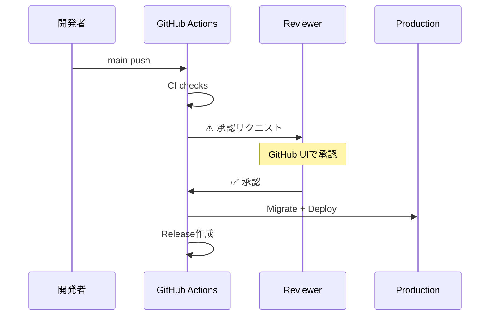

production環境へのデプロイは `migrate-production` ジョブで承認ゲートを設定。承認後にマイグレーションとデプロイが実行される。

---

## 関連ドキュメント

- [環境変数設計方針](./environment-variables.md)
- [デプロイセットアップ手順](../../instructions/deployment-setup.md)
- [環境変数セットアップ手順](../../instructions/environment-setup.md)
- [Vercel CLI/APIリファレンス](../../instructions/vercel-cli-reference.md)
<!-- @einja:managed:end -->

<!-- @einja:project-private:start id="deployment-project" -->
<!-- プロジェクト固有の情報を記入 -->
<!-- @einja:project-private:end -->
