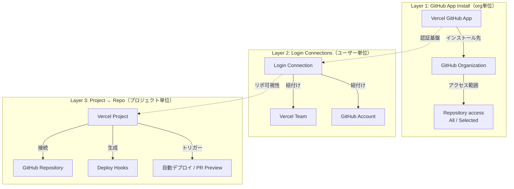

<!-- @einja:managed:start -->
# Vercel GitHub連携 設計方針

> **現状ステータス（2026-07 時点）**
> 複数リポジトリを同一の GitHub App Install / Vercel チームに紐付けない運用方針に変更したため、本ドキュメントが対象とする「マルチリポ・複数チーム横断での接続断リスク」に関する設定・チェック作業は、**現状の構成では発生しません**。本ドキュメントは 2026-04-15 のインシデント（Project link not found / Deploy Hook 全消失）の背景記録、および将来マルチリポ構成を採用する場合の参照資料として保持します。Git 連携の3層構造・復旧手順そのものは引き続き有効な知識です。

## 概要

このドキュメントでは、Vercel と GitHub の連携（Git Integration）に関する**設計方針**と**安全運用ルール**を説明します。

Vercel の Git 連携は3層構造で成り立っており、いずれかの層が壊れると自動デプロイやPR Previewが停止します。特にマルチリポ・マルチチーム環境では、意図しない設定変更が広範囲に影響を及ぼすリスクがあるため、本ドキュメントで設計方針を明確化します。

関連ドキュメント：
- [デプロイメント・CI/CD設計方針](./deployment.md)
- [環境変数設計方針](./environment-variables.md)
- [Vercel CLI/APIリファレンス](../../instructions/vercel-cli-reference.md)

---

## 目次

1. [Git連携の3層構造](#1-git連携の3層構造)
2. [マルチリポ環境のリスクモデル](#2-マルチリポ環境のリスクモデル)
3. [安全設計方針](#3-安全設計方針)
4. [復旧手順](#4-復旧手順)

---

## 1. Git連携の3層構造

VercelのGitHub連携は以下の3層で構成されている。トラブルシュート時はどの層が壊れているかを特定することが最優先となる。



### Layer 1: GitHub App Install（org単位）

GitHub org にインストールされる Vercel App。org の Settings > Installed GitHub Apps で確認できる。

- **All repositories（推奨）**: org 内の全リポジトリにアクセス可能。新規リポを追加しても自動的にアクセス対象となる
- **Selected repositories**: 指定したリポジトリのみにアクセス。リポの追加忘れで新規リポが見えない。既存接続は即座には壊れないが、再接続時に対象リポが表示されない

**重要**: Selected repositories の設定変更は、その org を使う**全 Vercel チーム**に波及する。チーム A の都合でリポを除外すると、チーム B のプロジェクトにも影響が出る。

### Layer 2: Login Connections（ユーザー単位）

Vercel Team と GitHub Account の紐付け。Vercel Dashboard > Settings > Login Connections で確認できる。

- 誤った GitHub アカウントが紐付いていると、GitHub App Install 画面に対象 org が表示されない
- 個人 GitHub アカウントと組織アカウントの混同が原因となることが多い

### Layer 3: Project ↔ Repository 接続（プロジェクト単位）

Vercel Project と GitHub リポジトリの個別接続。Settings > Git > Connected Git Repository で確認できる。

- 自動デプロイと PR Preview デプロイに直接影響する
- Deploy Hook はこの接続に依存しており、接続が切れると Deploy Hook も無効化される

---

## 2. マルチリポ環境のリスクモデル

### 2.1 接続断のトリガー一覧

| トリガー | 影響範囲 | 復旧難度 |
|---------|---------|---------|
| GitHub App の Selected repositories からリポを除外 | そのリポを使う全 Vercel チーム・全プロジェクト | 中 |
| Vercel 側で Git Integration を Disconnect → Reconnect | 対象チームの全プロジェクト + Deploy Hook **全削除** | 高 |
| GitHub リポジトリの名前変更 | そのリポを使うプロジェクト | 中 |
| GitHub リポジトリの移管（org 間） | そのリポを使うプロジェクト | 高 |
| GitHub org メンバーシップ変更 | Login Connections に影響する場合のみ | 低 |
| GitHub App を org からアンインストール | 全プロジェクト | 最高 |

### 2.2 接続断の影響マトリクス

接続が断たれた場合、以下の影響が発生する：

- **自動デプロイ停止**: push しても Vercel にデプロイされない
- **PR Preview 停止**: PR を作成しても Preview デプロイが生成されない
- **Deploy Hooks 全削除**: Disconnect → Reconnect 時に Deploy Hook URL が**全削除**される。再接続しても自動では再生成されない
- **GitHub Checks 停止**: PR 上の Vercel ステータスチェックが表示されなくなる

**影響は静かに進行する**: 接続断は即座にエラーとはならず、次回デプロイ試行時（push や PR 作成時）に初めて検知される。デプロイ頻度の低いプロジェクトでは長期間気づかない可能性がある。

### 2.3 「Project link not found」エラーの技術的根因

Vercel の Settings > Git で「**Project link not found**」エラーが表示される場合、Layer 3（Project ↔ Repo 接続）が切れた状態を示す。

主な原因：
- Layer 1 で GitHub App のリポアクセスが制限されている（Selected repositories から対象リポが外れている）
- Layer 2 で Login Connection が切れている、または誤ったアカウントに紐付いている
- リポジトリの名前変更や org 間移管が行われた

このエラーは Layer 3 で表面化するが、**根本原因は Layer 1 または Layer 2 にある**ことが多い。復旧時は Layer 1 から順に確認すること。

### 2.4 インシデント事例（2026-04-15）

実際に発生した接続断インシデントの記録。

**構成:**
```
GitHub App Install（einja-dev org）
  └─ Selected repositories: [thecreativeacademy のみ]  ← chitose-recruit等が含まれていない
      ├─ Vercel Team「dev-einja」→ 5プロジェクト全て Project link not found
      └─ Vercel Team「go」→ thecreativeacademy も影響
```

**経緯:**
- **発覚**: chitose-recruit の develop マージ後、デプロイが発火しなかった
- **調査**: Settings > Git で「Project link not found」を確認
- **原因特定**: GitHub App 設定で einja-dev org のリポアクセスが `thecreativeacademy` のみに制限されていた（Layer 1）
- **修正**: GitHub 設定で全リポを追加 → 各プロジェクトの Git 接続を繋ぎ直し
- **教訓**: Deploy Hooks は再接続時にリセットされるため、個別に再設定が必要だった
- **潜在的影響**: 他プロジェクトは影響期間中にデプロイが発生しなかったため、気づかずに影響を受けていた

---

## 3. 安全設計方針

### 3.1 GitHub App Install のアクセス範囲ポリシー

**推奨: All repositories に設定する**

| 設定 | メリット | デメリット |
|------|---------|----------|
| All repositories（推奨） | 新規リポ追加時に設定不要。接続断リスクが低い | org 内の全リポに Vercel がアクセス可能 |
| Selected repositories | アクセス範囲を限定できる | 追加忘れや不整合で接続断が発生するリスクがある |

Selected repositories を使う場合は、全 Vercel チームで使用しているリポの一覧を別途管理し、リポ追加時に必ず Selected repositories リストも更新する運用が必要。

### 3.2 Disconnect/Reconnect 禁止ルール

**Vercel Settings > Git での Disconnect は原則禁止。**

Disconnect → Reconnect を行うと：
- 対象チームの全プロジェクトの Git 接続が切れる
- **Deploy Hook URL が全削除される**（再接続しても復旧しない）
- 外部連携（GitHub Actions 等）で Deploy Hook URL をハードコードしている場合、全て再設定が必要

自動デプロイだけ止めたい場合は以下で代替する：

| 方法 | 用途 |
|------|------|
| `vercel.json` の `git.deploymentEnabled: false` | プロジェクト単位で自動デプロイを無効化 |
| Settings > Git > Ignored Build Step で `exit 0` を設定 | 条件付きでビルドをスキップ |

### 3.3 Deploy Hook のバックアップ戦略

Deploy Hook URL は Git 接続の切断時に**不可逆的に削除**される。

**推奨:**
- Deploy Hook URL は GitHub Secrets に保存し、ワークフローからは Secrets 経由で参照する（ハードコードを避ける）
- Deploy Hook 一覧を定期的にバックアップする（将来的に Skill 自動化を検討）

**GitHub Secrets を使うメリット:**
- Deploy Hook の再生成時に、Secrets の値を更新するだけで全ワークフローに反映される
- ワークフローファイルに URL を直接記載しないため、セキュリティ面でも有利

### 3.4 `git.deploymentEnabled: false` の必須化

GitHub Actions 経由でデプロイするプロジェクトは、`vercel.json` で自動デプロイを必ず無効化する。

```json
{
  "git": {
    "deploymentEnabled": false
  }
}
```

これにより、push 時の Vercel 自動デプロイと GitHub Actions 経由のデプロイが**二重に発火する**問題を防止する。

---

## 4. 復旧手順

### 4.1 Layer別の復旧フロー

トラブル発生時は Layer 1 → Layer 2 → Layer 3 の順に確認する。上位層が壊れている場合、下位層だけを修正しても復旧しない。

**Layer 1（GitHub App Install）の復旧:**

1. `https://github.com/organizations/<org>/settings/installations` で Vercel App の install 状態を確認
2. 「Configure」→ Repository access で対象リポを追加（または All repositories に変更）
3. Save

**Layer 2（Login Connections）の復旧:**

1. Vercel Dashboard → Settings → Login Connections
2. 誤った GitHub アカウントがあれば解除
3. 正しいアカウントで再認証

**Layer 3（Project ↔ Repo 接続）の復旧:**

1. Vercel Project → Settings → Git
2. 「Reconnect」ボタンで接続を復旧
3. **Deploy Hooks を再作成**（自動復旧しないため）
4. `.github/workflows/` 内の Deploy Hook URL を更新（GitHub Secrets 経由の場合は Secrets を更新）

### 4.2 Deploy Hook 再生成手順

1. Vercel Dashboard → Settings → Git → Deploy Hooks
2. 必要なブランチごとに Deploy Hook を作成
3. 新しい URL を GitHub Actions ワークフロー（または GitHub Secrets）に反映
4. push で動作確認

### 4.3 復旧後の検証ポイント

- [ ] Settings > Git で Connected Git Repository が正しいリポを指している
- [ ] Deploy Hooks が再作成されている
- [ ] push → 自動デプロイ or Deploy Hook 経由デプロイが動作する
- [ ] PR → Preview デプロイが動作する

---

## 関連ドキュメント

- [デプロイメント・CI/CD設計方針](./deployment.md)
- [環境変数設計方針](./environment-variables.md)
- [Vercel CLI/APIリファレンス](../../instructions/vercel-cli-reference.md)
- [Vercel 新リポ追加 オンボーディング手順](../../instructions/vercel-repo-onboarding.md)
- [デプロイセットアップ手順](../../instructions/deployment-setup.md)
<!-- @einja:managed:end -->

<!-- @einja:project-private:start id="vercel-git-integration-project" -->
<!-- プロジェクト固有の情報を記入 -->
<!-- @einja:project-private:end -->
