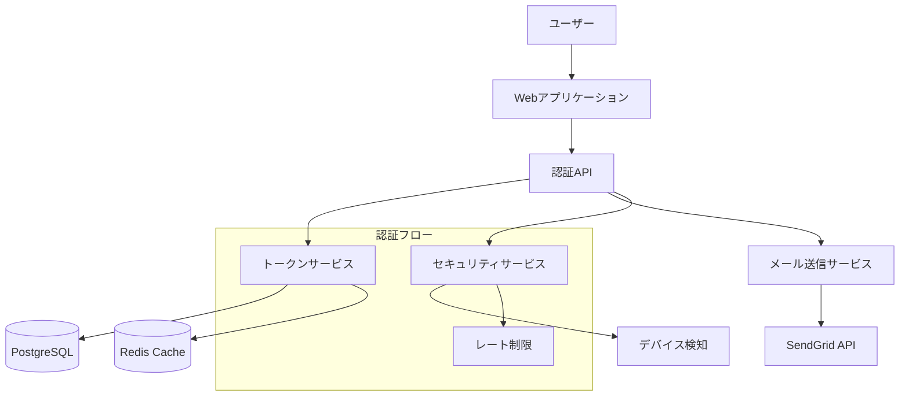
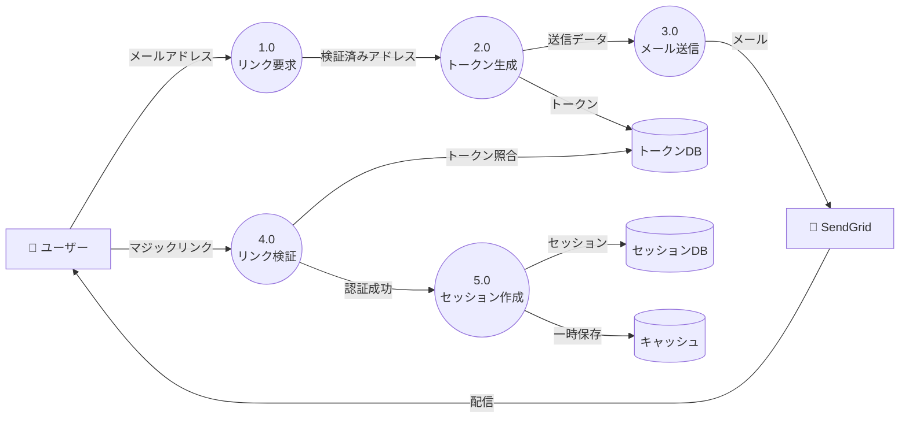
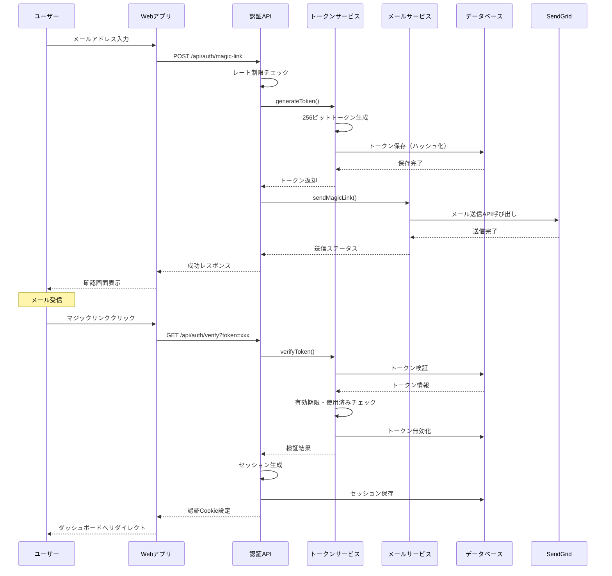
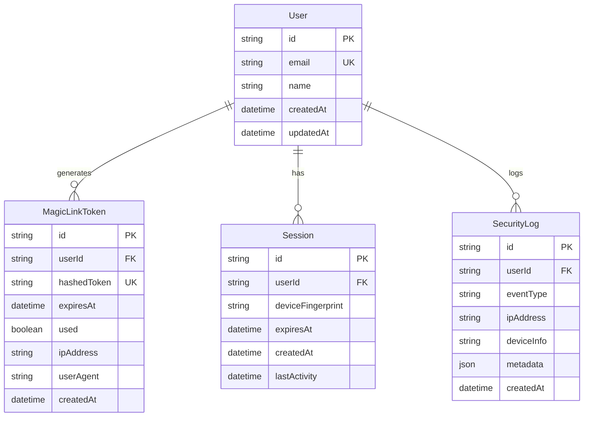
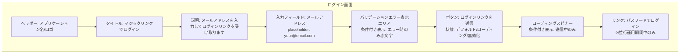
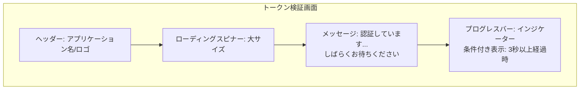
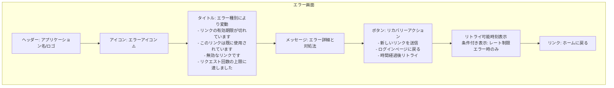
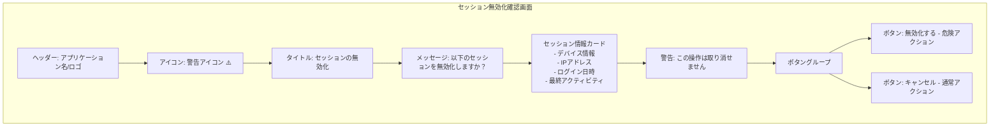
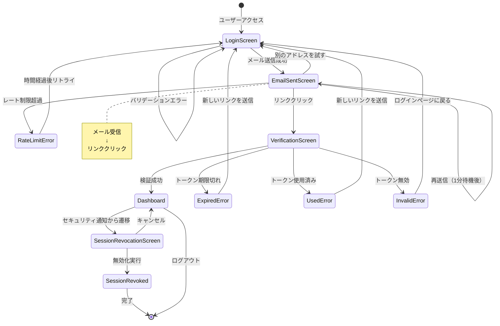

# マジックリンク認証機能 設計文書

## 概要

パスワードレス認証を実現するマジックリンク機能を実装し、ユーザーのログイン体験を向上させます。メールアドレスに送信される一時的なリンクをクリックすることで、パスワード入力なしに安全な認証を可能にします。本設計書では、要件定義書で定義された3つのユーザーストーリー（マジックリンクリクエスト、認証処理、セキュリティ通知）を実現するための技術的実装を詳細に定義します。

## アーキテクチャ

### システム構成図



### データフロー図（DFD）



### データフロー説明

1. **マジックリンクリクエストフロー**
   - ユーザーがメールアドレスを入力
   - メールアドレスの形式検証とレート制限チェック
   - 暗号学的に安全なトークンの生成（256ビット）
   - トークンのハッシュ化とデータベース保存
   - メール送信キューへの登録

2. **メール送信フロー**
   - SendGrid APIを使用したメール送信
   - HTMLとテキストのマルチパート形式
   - リンクの有効期限（15分）を明記
   - 配信ステータスの追跡

3. **認証処理フロー**
   - マジックリンクのトークン抽出
   - トークンの有効性検証（期限、使用済み、ハッシュ照合）
   - セッション生成と Cookie 設定
   - トークンの即座の無効化
   - ダッシュボードへのリダイレクト

## シーケンス図

### マジックリンク認証の全体フロー



## コンポーネントとインターフェース

### データベース設計

#### ERD



#### Prismaスキーマ

```prisma
model User {
  id              String            @id @default(cuid())
  email           String            @unique
  name            String?
  createdAt       DateTime          @default(now())
  updatedAt       DateTime          @updatedAt
  magicLinkTokens MagicLinkToken[]
  sessions        Session[]
  securityLogs    SecurityLog[]
  
  @@index([email])
  @@map("users")
}

model MagicLinkToken {
  id          String   @id @default(cuid())
  userId      String
  hashedToken String   @unique
  expiresAt   DateTime
  used        Boolean  @default(false)
  ipAddress   String?
  userAgent   String?
  createdAt   DateTime @default(now())
  user        User     @relation(fields: [userId], references: [id], onDelete: Cascade)
  
  // インデックス戦略
  @@index([hashedToken])           // トークン検証の高速化
  @@index([userId, createdAt])     // ユーザー別の履歴取得
  @@index([expiresAt])              // 期限切れトークンのクリーンアップ
  @@map("magic_link_tokens")
}

model Session {
  id               String   @id @default(cuid())
  userId           String
  deviceFingerprint String?
  expiresAt        DateTime
  createdAt        DateTime @default(now())
  lastActivity     DateTime @default(now())
  user             User     @relation(fields: [userId], references: [id], onDelete: Cascade)
  
  @@index([userId])
  @@index([expiresAt])              // セッション期限管理
  @@map("sessions")
}

model SecurityLog {
  id         String   @id @default(cuid())
  userId     String
  eventType  String   // LOGIN, LOGOUT, TOKEN_REQUEST, etc.
  ipAddress  String?
  deviceInfo String?
  metadata   Json?
  createdAt  DateTime @default(now())
  user       User     @relation(fields: [userId], references: [id], onDelete: Cascade)
  
  @@index([userId, eventType])      // イベントタイプ別の監査
  @@index([createdAt])               // 時系列での分析
  @@map("security_logs")
}
```

### API エンドポイント

| メソッド | エンドポイント | 説明 | リクエスト | レスポンス |
|---------|---------------|------|------------|------------|
| POST | `/api/auth/magic-link` | マジックリンク送信 | `{email: string}` | `{success: boolean, message: string}` |
| GET | `/api/auth/verify` | トークン検証 | `?token=xxx` | リダイレクト or エラー |
| POST | `/api/auth/logout` | ログアウト | - | `{success: boolean}` |
| GET | `/api/auth/session` | セッション確認 | - | `{user: User \| null}` |
| POST | `/api/auth/resend` | リンク再送信 | `{email: string}` | `{success: boolean, message: string}` |

### フロントエンドコンポーネント

```typescript
// ディレクトリ構造
/components/auth/
├── MagicLinkForm.tsx          // メールアドレス入力フォーム
├── VerificationMessage.tsx    // 送信確認メッセージ
├── TokenVerifying.tsx         // トークン検証中の表示
└── SessionProvider.tsx        // 認証状態管理

/hooks/auth/
├── useMagicLink.ts           // マジックリンク送信
├── useSession.ts             // セッション管理
└── useAuth.ts                // 認証状態

/services/auth/
├── authApi.ts                // API通信
└── tokenStorage.ts           // トークン管理
```

## 画面設計

### 画面ワイヤーフレーム（Mermaid図）

#### 1. ログイン画面 (Login Screen)



**レイアウト詳細**:
- 中央寄せレイアウト、最大幅480px
- 各要素間の余白: 16px
- フィールド高さ: 48px
- ボタン高さ: 48px

**状態管理**:
- デフォルト: 全要素表示、バリデーションエラーは非表示
- 入力中: フィールドにフォーカスインジケーター表示
- 送信中: ボタン無効化、ローディングスピナー表示
- エラー: バリデーションエラーメッセージ表示、フィールド赤枠

#### 2. メール送信確認画面 (Email Sent Screen)

```mermaid
graph TB
    subgraph "メール送信確認画面"
        Header[ヘッダー: アプリケーション名/ロゴ]
        SuccessIcon[アイコン: メール送信成功✓]
        Title[タイトル: メールを送信しました]
        Message[メッセージ: {email}宛にログインリンクを送信しました<br/>メールを確認してリンクをクリックしてください]
        ExpiryNote[注意書き: リンクは15分間有効です]
        Divider[区切り線]
        NoEmailTitle[サブタイトル: メールが届きませんか？]
        CheckSpam[案内: 迷惑メールフォルダも確認してください]
        ResendBtn[ボタン: 再送信<br/>状態: カウントダウン中は無効/1分後に有効化]
        Countdown[カウントダウン表示: 00:XX<br/>条件付き表示: 1分間のみ]
        TryAnotherLink[リンク: 別のメールアドレスを試す]

        Header --> SuccessIcon
        SuccessIcon --> Title
        Title --> Message
        Message --> ExpiryNote
        ExpiryNote --> Divider
        Divider --> NoEmailTitle
        NoEmailTitle --> CheckSpam
        CheckSpam --> ResendBtn
        ResendBtn --> Countdown
        Countdown --> TryAnotherLink
    end
```

**レイアウト詳細**:
- 中央寄せレイアウト、最大幅540px
- 成功アイコンサイズ: 64x64px
- 再送信ボタンは1分間カウントダウン表示

**状態管理**:
- 初期表示: 再送信ボタン無効、カウントダウン60秒開始
- カウントダウン中: ボタンに「再送信 (00:XX)」と表示
- カウントダウン完了: ボタン有効化、「再送信」のみ表示

#### 3. トークン検証画面 (Token Verification Screen)



**レイアウト詳細**:
- 中央寄せレイアウト、最小高さ400px
- スピナーサイズ: 48x48px
- 自動リダイレクト: 検証成功後3秒以内

**状態管理**:
- 検証中: スピナー表示、メッセージ表示
- 3秒以上: プログレスバー追加表示
- 検証完了: 自動リダイレクト

#### 4. エラー画面 (Error Screen)



**エラー種別ごとの表示内容**:

| エラー種別 | タイトル | ボタンラベル | 追加表示 |
|-----------|---------|------------|---------|
| TOKEN_EXPIRED | リンクの有効期限が切れています | 新しいリンクを送信 | - |
| TOKEN_USED | このリンクは既に使用されています | 新しいリンクを送信 | - |
| TOKEN_INVALID | 無効なリンクです | ログインページに戻る | - |
| RATE_LIMIT | リクエスト回数の上限に達しました | - | 次回リクエスト可能時刻 |

#### 5. セッション無効化確認画面 (Session Revocation Screen)



**レイアウト詳細**:
- 中央寄せレイアウト、最大幅480px
- ボタングループ: 横並び配置、間隔12px
- 無効化ボタン: 赤色系（危険アクション）
- キャンセルボタン: グレー系（通常アクション）

### 画面遷移フロー図（詳細版）



## UIインタラクション設計

### コンポーネント詳細仕様

#### MagicLinkForm.tsx

**Props**:
```typescript
interface MagicLinkFormProps {
  onSubmit: (email: string) => Promise<void>;
  defaultEmail?: string;  // エラー後の再表示用
  isLoading?: boolean;
  error?: string | null;
}
```

**State**:
```typescript
interface MagicLinkFormState {
  email: string;
  validationError: string | null;
  isSubmitting: boolean;
  focusedField: 'email' | null;
}
```

**Events**:
- `onChange`: メールアドレス入力時
- `onBlur`: フィールドフォーカスアウト時、バリデーション実行
- `onSubmit`: フォーム送信時、バリデーション後API呼び出し

**バリデーションロジック**:
```typescript
const validateEmail = (email: string): string | null => {
  if (!email.trim()) return 'メールアドレスを入力してください';
  const emailRegex = /^[^\s@]+@[^\s@]+\.[^\s@]+$/;
  if (!emailRegex.test(email)) return '有効なメールアドレスを入力してください';
  return null;
};
```

**インタラクション詳細**:
1. **フィールドフォーカス**
   - フォーカス時: 枠線色変更
   - フォーカスアウト時: バリデーション実行

2. **送信ボタンクリック**
   - バリデーション実行
   - エラーがあれば表示してreturn
   - エラーなければボタン無効化、ローディング表示
   - API呼び出し
   - 成功時: 確認画面へ遷移
   - 失敗時: エラー表示、ボタン再有効化

3. **ローディング状態**
   - ボタン内にスピナー表示
   - 3秒以上かかる場合: 追加メッセージ表示

#### VerificationMessage.tsx

**Props**:
```typescript
interface VerificationMessageProps {
  email: string;
  onResend: () => Promise<void>;
  onChangeEmail: () => void;
  expiryMinutes?: number;  // デフォルト: 15
}
```

**State**:
```typescript
interface VerificationMessageState {
  resendCountdown: number;  // 秒単位
  canResend: boolean;
  isResending: boolean;
}
```

**Events**:
- `onResend`: 再送信ボタンクリック時
- `onChangeEmail`: 別のアドレスを試すリンククリック時

**カウントダウンロジック**:
```typescript
useEffect(() => {
  const timer = setInterval(() => {
    setCountdown(prev => {
      if (prev <= 1) {
        setCanResend(true);
        return 0;
      }
      return prev - 1;
    });
  }, 1000);

  return () => clearInterval(timer);
}, []);
```

**インタラクション詳細**:
1. **初期表示**
   - カウントダウン60秒開始
   - 再送信ボタン無効化
   - カウントダウン表示: 「再送信 (00:XX)」

2. **カウントダウン完了**
   - 再送信ボタン有効化
   - ボタンラベル: 「再送信」

3. **再送信ボタンクリック**
   - ボタン無効化、ローディング表示
   - API呼び出し
   - 成功時: カウントダウンリセット
   - 失敗時: エラー表示

#### TokenVerifying.tsx

**Props**:
```typescript
interface TokenVerifyingProps {
  token: string;
  onSuccess: (user: User) => void;
  onError: (error: TokenVerificationError) => void;
}
```

**State**:
```typescript
interface TokenVerifyingState {
  status: 'verifying' | 'success' | 'error';
  elapsedTime: number;  // 秒単位
  showProgressBar: boolean;
}
```

**Events**:
- `useEffect`: マウント時に自動的にトークン検証開始
- `onVerificationComplete`: 検証完了時

**検証フロー**:
```typescript
useEffect(() => {
  const verifyToken = async () => {
    try {
      const result = await authApi.verifyToken(token);
      setStatus('success');
      setTimeout(() => onSuccess(result.user), 3000);
    } catch (error) {
      setStatus('error');
      onError(error);
    }
  };

  verifyToken();
}, [token]);
```

**インタラクション詳細**:
1. **検証中**
   - ローディングスピナー表示
   - メッセージ: 「認証しています...」
   - 3秒経過後: プログレスバー追加表示

2. **検証成功**
   - メッセージ変更: 「ログインしています...」
   - 3秒以内に自動リダイレクト

3. **検証失敗**
   - エラー画面へ遷移
   - エラー種別に応じたメッセージとアクション表示

### フォームバリデーション設計

**バリデーションタイミング**:
- リアルタイムバリデーション: 実施しない（UX配慮）
- フォーカスアウト時: 実施する
- 送信時: 必ず実施する

**エラー表示ルール**:
- エラーメッセージ: フィールド直下に赤文字で表示
- フィールド枠: エラー時は赤色に変更
- エラー自動消去: しない（ユーザーが修正するまで表示）

### ローディング状態管理

**ローディングインジケーター**:
- 短時間（< 3秒）: ボタン内スピナーのみ
- 長時間（≥ 3秒）: 追加メッセージ表示

**ローディング中のユーザー操作制限**:
- ボタン無効化
- フォーム入力フィールド無効化
- 戻るボタン/リロードの警告表示（検証画面）

### エラーハンドリングUI

**エラー表示パターン**:

1. **インラインエラー** (フォームバリデーション)
   - 位置: フィールド直下
   - 色: 赤色
   - アイコン: エラーアイコン（小）

2. **ページレベルエラー** (API エラー)
   - 位置: 専用のエラー画面
   - 色: 赤色系
   - アイコン: エラーアイコン（大）
   - リカバリーアクションボタン必須

3. **通知バナーエラー** (セキュリティ通知)
   - 位置: ページ上部
   - 色: 黄色系（警告）または赤色系（重大）
   - 閉じるボタン: あり

## エラーハンドリング

### エラー分類とコード体系

認証システムで発生する可能性のあるエラーを以下のように分類します：

1. **検証エラー (VALIDATION_ERROR)**
   - 無効なメールアドレス形式
   - 必須フィールドの欠落
   - 不正な入力値

2. **認証エラー (AUTH_ERROR)**
   - 期限切れトークン
   - 使用済みトークン
   - 無効なトークン
   - セッション期限切れ

3. **レート制限エラー (RATE_LIMIT_ERROR)**
   - 短時間での過剰なリクエスト
   - 1日の送信上限超過

4. **システムエラー (SYSTEM_ERROR)**
   - データベース接続エラー
   - メール送信サービスの障害
   - 内部サーバーエラー

### エラー処理戦略

- **ユーザー向けメッセージ**: 技術的詳細を含まない、理解しやすいメッセージを表示
- **開発者向けログ**: 詳細なスタックトレースとコンテキスト情報を記録
- **リトライ可能性の提示**: エラーの種類に応じて、再試行ボタンや代替アクションを提供
- **フォールバック処理**: メール送信失敗時は再送信オプションを提供

## セキュリティ考慮事項

### 認証・認可の実装

1. **トークンのセキュリティ**
   - 暗号学的に安全な256ビットのランダムトークン生成
   - bcryptによるトークンのハッシュ化保存
   - 使用後の即座の無効化

2. **レート制限**
   - IPアドレスベース: 1分あたり3回まで
   - メールアドレスベース: 1分あたり1回まで
   - 1日あたりの上限: 同一メールで20回まで

3. **セッション管理**
   - HTTPOnly Cookieでのセッション管理
   - Secure フラグの設定（HTTPS環境）
   - SameSite属性によるCSRF対策

### データ保護戦略

- **個人情報の暗号化**: メールアドレスなどの個人情報は暗号化して保存
- **トークンの安全な保存**: ハッシュ化により、データベース漏洩時もトークンを保護
- **通信の暗号化**: HTTPS必須、TLS 1.2以上
- **ログのサニタイゼーション**: 個人情報やトークンをログに含めない

## パフォーマンス最適化

- **キャッシュ戦略**
  - Redisによるセッション情報のキャッシュ
  - レート制限カウンターのメモリキャッシュ
  - 静的アセットのCDN配信

- **データベース最適化**
  - 適切なインデックスによるクエリ高速化
  - 期限切れトークンの定期削除バッチ
  - コネクションプーリングの活用

- **非同期処理**
  - メール送信のキューイング
  - バックグラウンドでのセキュリティログ記録
  - 非同期バリデーション処理

## テスト設計

### 単体テスト

#### 正常系テストケース

1. **トークン生成処理**
   - Given: 有効なメールアドレスが提供される
   - When: トークン生成関数を実行する
   - Then: 256ビットの暗号学的に安全なトークンが生成される

2. **メール送信処理**
   - Given: 有効なトークンとメールアドレスが存在する
   - When: メール送信サービスを呼び出す
   - Then: SendGrid APIが正しいパラメータで呼び出される

#### 異常系テストケース

1. **無効なメールアドレス**
   - Given: 不正な形式のメールアドレスが入力される
   - When: バリデーション処理を実行する
   - Then: VALIDATION_ERRORが返され、処理が中断される

2. **レート制限超過**
   - Given: 同一IPから1分以内に4回目のリクエストが来る
   - When: レート制限チェックを実行する
   - Then: RATE_LIMIT_ERRORが返され、429ステータスコードが返される

### 統合テスト

- データベースとの連携確認
- メールサービスとの通信テスト
- キャッシュとセッションストアの動作確認
- 複数コンポーネント間のデータフロー検証

### E2Eテスト

1. **完全な認証フロー**
   - Given: 新規ユーザーがログインページにアクセス
   - When: メールアドレスを入力し、受信したリンクをクリック
   - Then: ダッシュボードにログインでき、セッションが確立される

2. **トークン期限切れシナリオ**
   - Given: 15分以上経過したマジックリンクを持つユーザー
   - When: そのリンクをクリックする
   - Then: 期限切れエラーが表示され、再送信オプションが提示される

## マイグレーション戦略

Prismaを使用しているため、通常のスキーマ変更は`prisma migrate dev`で自動処理されます。

### 特別なデータ移行が必要なケース

既存のパスワード認証システムからの移行時：
1. 既存ユーザーのメールアドレスを保持
2. パスワードフィールドを段階的に非推奨化
3. 移行期間中は両方の認証方式を並行運用
4. 全ユーザーの移行完了後、パスワード関連のコードを削除

## モニタリングと分析

- **収集するメトリクス**
  - マジックリンクのリクエスト数と成功率
  - トークンの有効期限切れ率
  - メール配信成功率
  - 平均認証完了時間

- **アラート設定**
  - メール送信失敗率が5%を超えた場合
  - 認証成功率が90%を下回った場合
  - レート制限エラーが急増した場合

## 実装上の注意点

### コード品質とセキュリティ

- トークン生成には必ず暗号学的に安全な乱数生成器を使用すること
- 環境変数で機密情報を管理し、ハードコーディングは絶対に避ける
- すべてのユーザー入力に対して適切なバリデーションとサニタイゼーションを実施
- エラーメッセージに機密情報や実装の詳細を含めない

### パフォーマンスとスケーラビリティ

- データベースクエリは必要最小限に抑え、N+1問題を回避
- 非同期処理を活用し、ユーザーの待ち時間を最小化
- キャッシュを適切に活用するが、セキュリティ情報のキャッシュは慎重に

### 保守性と拡張性

- 認証ロジックを独立したサービスとして実装し、疎結合を維持
- 設定値は環境変数やコンフィグファイルで管理し、変更を容易に
- ログは構造化形式で出力し、分析や監視を容易に
- テストカバレッジ80%以上を維持し、リグレッションを防止