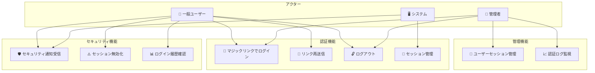
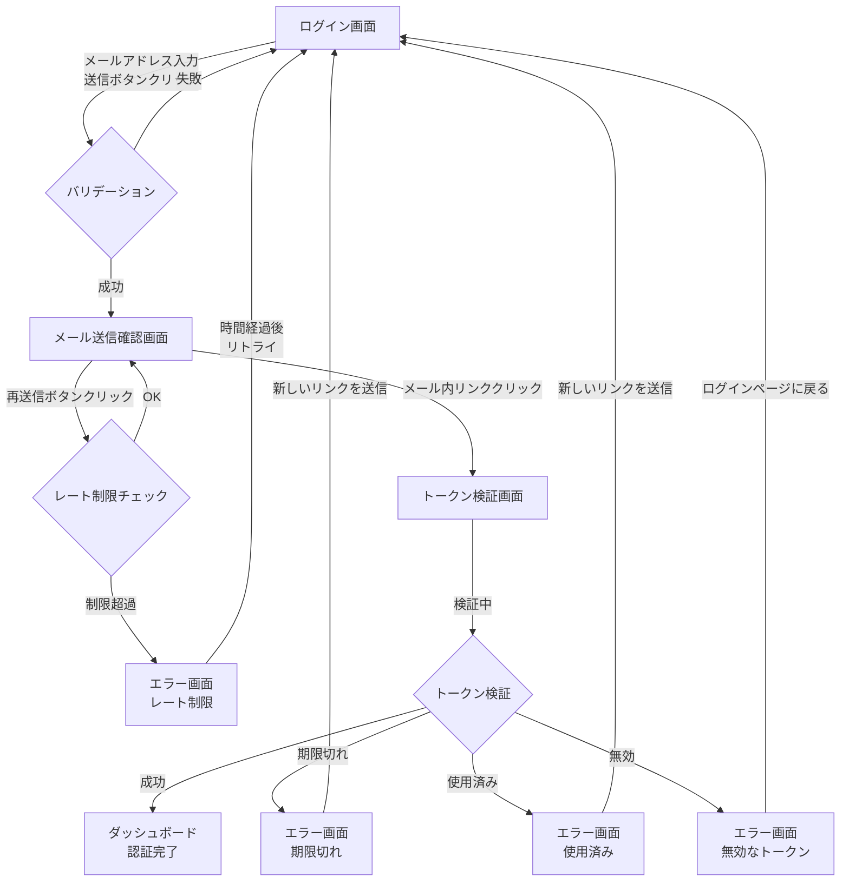

# マジックリンク認証機能 要件定義書

## 概要
パスワードレス認証を実現するマジックリンク機能を実装し、ユーザーのログイン体験を向上させます。メールアドレスに送信される一時的なリンクをクリックすることで、パスワード入力なしに安全な認証を可能にします。

## AS-IS（現状）

### 現在の実装状況
- 従来のパスワードベース認証のみ対応
- ユーザーは複雑なパスワードを記憶する必要がある
- パスワードリセット機能は別途実装されている
- 2要素認証は未実装

### 現状の課題
- パスワード忘れによるログイン失敗が頻発（月間約15%のユーザー）
- 弱いパスワードによるセキュリティリスク
- パスワード管理の煩雑さによるユーザー離脱
- モバイルデバイスでのパスワード入力の不便さ

## TO-BE（目標状態）

### 実現したい姿
- メールアドレスのみでログイン可能なシステム
- ワンクリックで完了する認証フロー
- 時限式の安全なトークンによる認証
- モバイルフレンドリーな認証体験

### 期待される改善
- ログイン成功率の向上（95%以上を目標）
- パスワード関連のサポート問い合わせ80%削減
- セキュリティの向上（トークンの有効期限管理）
- ユーザー体験の大幅な改善

## ビジネス価値
- **問題**: パスワード管理の煩雑さによるユーザー離脱とセキュリティリスク
- **解決策**: メールベースのワンタイム認証リンクによるパスワードレス認証
- **期待効果**: ユーザー満足度向上、サポートコスト削減、セキュリティ強化

## スコープ
### 含まれるもの
- マジックリンクの生成・送信機能
- トークン検証とセッション管理
- リンクの有効期限管理（15分）
- 再送信機能
- ログアウト機能の改修

### 含まれないもの
- SMS認証
- ソーシャルログイン連携
- 生体認証
- 既存パスワード認証の削除（並行運用）

## ユースケース図

## 権限マトリクス

### ロール定義

| ロール | 説明 | アクセスレベル |
|--------|------|--------------|
| 未認証ユーザー (Guest) | ログインしていない状態 | 公開ページのみ |
| 一般ユーザー (User) | 認証済みの一般ユーザー | 自身のデータのみ |
| 管理者 (Admin) | システム管理権限を持つユーザー | 全データ + 管理機能 |
| システム (System) | 自動処理・バックグラウンド処理 | 内部処理専用 |

### 操作可否表

| 操作 | Guest | User | Admin | System |
|------|:-----:|:----:|:-----:|:------:|
| マジックリンクリクエスト | ✅ | ✅ | ✅ | ❌ |
| リンク再送信 | ✅ | ✅ | ✅ | ❌ |
| トークン検証 | ✅ | ✅ | ✅ | ✅ |
| ログアウト | ❌ | ✅ | ✅ | ❌ |
| セッション情報取得 | ❌ | ✅(自身のみ) | ✅(全て) | ✅ |
| セッション無効化 | ❌ | ✅(自身のみ) | ✅(全て) | ✅ |
| セキュリティ通知受信 | ❌ | ✅ | ✅ | ❌ |
| ログイン履歴確認 | ❌ | ✅(自身のみ) | ✅(全て) | ❌ |
| ユーザーセッション強制終了 | ❌ | ❌ | ✅ | ✅ |
| 認証ログ監視 | ❌ | ❌ | ✅ | ✅ |
| レート制限設定変更 | ❌ | ❌ | ✅ | ❌ |

### アクセス制御ルール

1. **認証前アクセス**
   - ログインページ、マジックリンクリクエストAPIは全員アクセス可能
   - トークン検証APIは有効なトークンがあれば誰でも利用可能

2. **認証後アクセス**
   - ダッシュボード、プロフィールは認証必須
   - 自身のセッション・履歴のみ閲覧・操作可能

3. **管理者アクセス**
   - 全ユーザーのセッション管理が可能
   - 認証ログの閲覧・分析が可能
   - システム設定の変更が可能

## 画面要件

### 画面一覧と目的

#### 1. ログイン画面 (Login Screen)
**目的**: ユーザーがメールアドレスを入力してマジックリンクをリクエストする

**主要UI要素**:
- メールアドレス入力フィールド
- 「ログインリンクを送信」ボタン
- バリデーションエラーメッセージ表示エリア
- 既存のパスワードログインへのリンク（並行運用期間中）

**表示条件**:
- 未認証状態のユーザーがアクセス

#### 2. メール送信確認画面 (Email Sent Screen)
**目的**: マジックリンクの送信完了をユーザーに通知し、次のアクションを案内する

**主要UI要素**:
- 送信完了メッセージ（送信先メールアドレスを含む）
- 「メールが届かない場合」の案内
- 「再送信」ボタン（1分後に有効化）
- 「別のメールアドレスを試す」リンク

**表示条件**:
- マジックリンク送信APIが正常に完了した後

#### 3. トークン検証画面 (Token Verification Screen)
**目的**: マジックリンクのトークンを検証し、認証処理を実行する

**主要UI要素**:
- 検証中インジケーター（ローディングスピナー）
- 検証状態メッセージ

**表示条件**:
- メール内のマジックリンクをクリックした時

#### 4. エラー画面 (Error Screen)
**目的**: 認証失敗の原因を明確に伝え、リカバリーアクションを提示する

**主要UI要素**:
- エラーメッセージ（エラー種別ごとに異なる）
- リカバリーアクションボタン
  - 期限切れ: 「新しいリンクを送信」
  - 使用済み: 「新しいリンクを送信」
  - 無効なトークン: 「ログインページに戻る」
  - レート制限: 次回リクエスト可能時刻の表示

**表示条件**:
- トークン検証が失敗した場合
- レート制限に達した場合

### 画面遷移フロー

### UIインタラクション要件

#### フォーム入力とバリデーション
**要件**:
- メールアドレスフィールドは入力中にリアルタイムバリデーションを実行しない
- フォーカスアウト時またはボタンクリック時にバリデーションを実行
- バリデーションエラーは入力フィールドの下に赤文字で表示
- 入力フィールドはエラー状態の時に赤枠で表示

**バリデーションルール**:
- 必須チェック: 空欄の場合「メールアドレスを入力してください」
- 形式チェック: 不正な形式の場合「有効なメールアドレスを入力してください」

#### ボタン操作
**要件**:
- 送信ボタンはクリック後、API応答まで無効化（disabled状態）
- 無効化中はローディングインジケーター（スピナー）を表示
- 再送信ボタンは1分間のカウントダウン表示後に有効化
- ボタンのホバー状態、フォーカス状態、無効状態を視覚的に区別

#### ローディング状態
**要件**:
- API呼び出し中はローディングスピナーを表示
- ローディング中はユーザー操作を無効化
- 3秒以上かかる場合は進捗メッセージを表示（例: 「メールを送信しています...」）

#### エラーメッセージ表示
**要件**:
- エラーメッセージは具体的で実行可能なアクションを含む
- システムエラーの場合は技術的詳細を隠し、ユーザーフレンドリーなメッセージを表示
- エラーメッセージは自動消去せず、ユーザーが閉じるまで表示

#### 成功フィードバック
**要件**:
- メール送信成功時は明確な成功メッセージを表示
- 認証成功時はダッシュボードへ自動リダイレクト（3秒以内）
- リダイレクト前に「ログインしています...」のメッセージを表示

## ユーザーストーリー

### Story 1: マジックリンクのリクエスト
**As a** ユーザー
**I want to** メールアドレスを入力してログインリンクを受け取りたい
**So that** パスワードを覚える必要なくログインできる

#### 受け入れ基準

##### 機能要件
- [ ] Given: ログインページにアクセスした
      When: 有効なメールアドレスを入力して送信
      Then: 成功メッセージが表示され、メールが送信される
- [ ] Given: ログインページにアクセスした
      When: 無効なメールアドレスを入力
      Then: エラーメッセージが表示される
- [ ] Given: マジックリンクをリクエスト済み
      When: 1分以内に再度リクエスト
      Then: レート制限エラーが表示される

##### UIインタラクション要件
- [ ] Given: ログイン画面を表示
      When: メールアドレスフィールドにフォーカス
      Then: フィールドが視覚的にフォーカス状態を示す（枠線の色変化など）
- [ ] Given: メールアドレスフィールドに入力
      When: 空欄のまま送信ボタンをクリック
      Then: フィールド下に「メールアドレスを入力してください」とエラー表示され、フィールドが赤枠になる
- [ ] Given: メールアドレスフィールドに入力
      When: 不正な形式（例: "test@"）で送信ボタンをクリック
      Then: フィールド下に「有効なメールアドレスを入力してください」とエラー表示される
- [ ] Given: 有効なメールアドレスを入力
      When: 送信ボタンをクリック
      Then: ボタンが無効化され、ローディングスピナーが表示される
- [ ] Given: メール送信API実行中
      When: 3秒以上経過
      Then: 「メールを送信しています...」のメッセージが表示される
- [ ] Given: メール送信成功
      When: API応答受信
      Then: メール送信確認画面に遷移し、送信先アドレスが表示される

#### 実装の優先順位
P0 (必須)

---

### Story 2: マジックリンクによる認証
**As a** ユーザー
**I want to** メール内のリンクをクリックして認証を完了したい
**So that** 素早く安全にログインできる

#### 受け入れ基準

##### 機能要件
- [ ] Given: 有効なマジックリンクを受信した
      When: リンクをクリック
      Then: 自動的にログインされ、ダッシュボードへリダイレクト
- [ ] Given: 期限切れのリンクを受信した
      When: リンクをクリック
      Then: 期限切れエラーが表示され、再送信オプションが提示される
- [ ] Given: 既に使用済みのリンクを受信した
      When: 再度リンクをクリック
      Then: 使用済みエラーが表示される

##### UIインタラクション要件
- [ ] Given: マジックリンクをクリック
      When: トークン検証画面に遷移
      Then: ローディングスピナーと「認証しています...」のメッセージが表示される
- [ ] Given: トークン検証実行中
      When: 検証処理が進行中
      Then: ユーザー操作（戻る、リロードなど）を防ぐ仕組みが作動する
- [ ] Given: トークン検証成功
      When: 認証完了
      Then: 「ログインしています...」のメッセージが表示され、3秒以内にダッシュボードへリダイレクト
- [ ] Given: トークンが期限切れ
      When: 検証失敗
      Then: エラー画面に遷移し、「リンクの有効期限が切れています」とメッセージ表示、「新しいリンクを送信」ボタンを表示
- [ ] Given: トークンが使用済み
      When: 検証失敗
      Then: エラー画面に遷移し、「このリンクは既に使用されています」とメッセージ表示、「新しいリンクを送信」ボタンを表示
- [ ] Given: トークンが無効
      When: 検証失敗
      Then: エラー画面に遷移し、「無効なリンクです」とメッセージ表示、「ログインページに戻る」ボタンを表示
- [ ] Given: エラー画面で「新しいリンクを送信」ボタンをクリック
      When: ボタン押下
      Then: ログイン画面に遷移し、前回使用したメールアドレスがプリフィルされる

#### 実装の優先順位
P0 (必須)

---

### Story 3: セキュリティ通知
**As a** ユーザー
**I want to** 新しいデバイスからのログインを通知してもらいたい
**So that** 不正アクセスを検知できる

#### 受け入れ基準

##### 機能要件
- [ ] Given: 新しいデバイスからマジックリンクでログイン
      When: 認証が成功
      Then: セキュリティ通知メールが送信される
- [ ] Given: セキュリティ通知を受信
      When: 身に覚えのないログイン
      Then: ワンクリックでセッションを無効化できる

##### UIインタラクション要件
- [ ] Given: 新規デバイスからログイン成功
      When: ダッシュボード表示
      Then: 「新しいデバイスからのログインを検出しました」の通知バナーが表示される
- [ ] Given: セキュリティ通知メール受信
      When: メール内の「セッションを無効化」リンクをクリック
      Then: 確認画面が表示され、「このセッションを無効化しますか？」のメッセージと「無効化する」「キャンセル」ボタンが表示される
- [ ] Given: セッション無効化確認画面
      When: 「無効化する」ボタンをクリック
      Then: セッションが無効化され、「セッションを無効化しました」の成功メッセージが表示される
- [ ] Given: セッション無効化確認画面
      When: 「キャンセル」ボタンをクリック
      Then: 元の画面に戻り、セッションは維持される

#### 実装の優先順位
P1 (重要)

## 詳細なビジネス要件

### 認証トークン要件
#### マジックリンクトークン仕様
**要件内容**:
- 暗号学的に安全な256ビットのランダムトークン
- Base64URLエンコード形式で43文字
- トークンはデータベースにハッシュ化して保存（bcrypt使用）
- 1ユーザーあたり同時に有効なトークンは1つまで

**OK例**:
- `AbC123XyZ_0987654321qWeRtYuIoP-asdfghjklZXCV` - 有効な43文字のBase64URL形式
- `1a2B3c4D5e6F7g8H9i0J_kLmNoPqRsTuVwXyZ-123456` - 英数字と安全な特殊文字のみ

**NG例**:
- `short123` - 長さ不足（43文字未満）
- `invalid/token+with=special*chars` - 許可されない特殊文字を含む
- `password123` - 推測可能な単純な文字列

### メール送信要件
#### マジックリンクメール仕様
**要件内容**:
- 件名: 「[サービス名] ログインリンクのお知らせ」
- 送信元: `noreply@example.com`
- HTMLとテキストの両形式で送信（マルチパート）
- リンクの有効期限を明記（15分）
- セキュリティ警告文を含める

**メール本文に含める要素**:
- ログインリンク（ボタンとテキストリンクの両方）
- 有効期限の明記
- 「このメールに心当たりがない場合」の説明
- サポート連絡先

**セキュリティ要件**:
- SPF、DKIM、DMARCの設定必須
- リンクはHTTPS必須
- リプレイアタック防止のため、使用済みトークンは即座に無効化

### レート制限要件
#### リクエスト制限仕様
**要件内容**:
- 同一IPアドレス: 1分あたり3回まで
- 同一メールアドレス: 1分あたり1回まで
- 1日あたりの最大リクエスト数: 同一メールアドレスで20回まで

**制限超過時の動作**:
- HTTPステータス429（Too Many Requests）を返す
- `Retry-After`ヘッダーで次回リクエスト可能時刻を通知
- エラーメッセージ: 「リクエスト回数の上限に達しました。しばらく待ってから再度お試しください。」

## 非機能要件

### パフォーマンス
- マジックリンク生成: 100ms以内
- メール送信: 3秒以内
- トークン検証: 50ms以内

### セキュリティ
- トークンは暗号学的に安全な乱数生成
- トークンの有効期限: 15分
- 使用済みトークンの即座の無効化
- レート制限: 1分あたり3回まで

### 可用性
- 99.9%以上のアップタイム
- メール配信成功率: 99%以上

## 技術的制約
- 既存の認証システムとの互換性維持
- 現行のセッション管理システムの活用
- メール送信にはSendGridを使用

## 依存関係
- メール送信サービス（SendGrid）
- Redis（トークン管理）
- 既存のユーザー管理システム

## リスクと対策
| リスク | 影響度 | 発生確率 | 対策 |
|--------|--------|----------|------|
| メール遅延 | 高 | 中 | 複数のメールプロバイダーのフォールバック設定 |
| トークン漏洩 | 高 | 低 | 短い有効期限とワンタイム使用制限 |
| フィッシング攻撃 | 中 | 中 | ドメイン検証とセキュリティヘッダーの実装 |

## 成功指標
- ログイン成功率: 95%以上
- 平均認証時間: 30秒以内
- パスワード関連問い合わせ: 80%削減
- ユーザー満足度スコア: 4.5/5.0以上

## タイムライン
- Phase 1: 基本的なマジックリンク機能（Story 1, 2）
- Phase 2: セキュリティ強化（Story 3）
- Phase 3: 分析とモニタリング機能