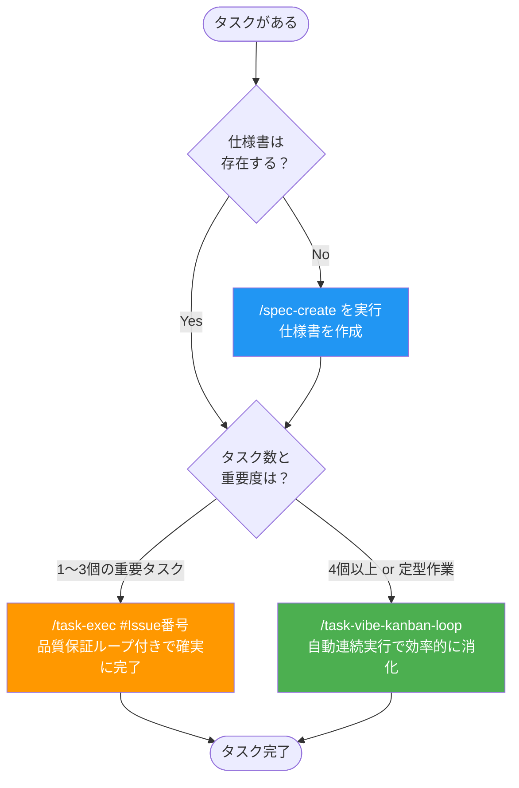

# Claude Code スキル・コマンド利用ガイド

このガイドは、プロジェクトで使用する開発自動化コマンドの利用方法を説明します。
**新しく参加した開発者が5分でキャッチアップできる**ことを目的としています。

---

## コマンド一覧

| コマンド | 用途 | 推奨シーン |
|---------|------|----------|
| `/spec-create` | 仕様書作成（ATDD形式） | 新機能開発の開始時 |
| `/task-exec` | タスク実行（品質保証付き） | 重要なタスクの確実な完了 |
| `/task-vibe-kanban-loop` | 複数タスク自動連続実行 | 大量の定型作業 |
| `/frontend-implement` | フロントエンド実装 | UI実装時 |
| `/start-dev` | 開発環境起動 | 開発開始時 |

---

## どのコマンドを使うべきか？



### 判断基準

| 状況 | 推奨コマンド |
|------|-------------|
| 新機能開発を始める | `/spec-create` |
| 複雑な実装、品質が重要 | `/task-exec` |
| 単純な作業が大量にある | `/task-vibe-kanban-loop` |
| UIコンポーネントを実装 | `/frontend-implement` |

---

## 状態確認方法

### タスクの進捗状態を確認する場所

| 情報 | 確認場所 | 状態表示 |
|------|----------|----------|
| タスク完了状況 | GitHub Issue | `[x]` = 完了, `[ ]` = 未着手 |
| 着手中タスク | GitHub Issue | `<!-- 🔄 着手中 -->` コメント |
| 実行中エージェント | Vibe-Kanban UI | ステータス表示 |

### Vibe-Kanban UIの起動

```bash
npx vibe-kanban
```

起動後、ブラウザでUIが開き、実行中のタスクと進捗を確認できます。

### GitHub Issueでの状態確認

```bash
# Issue内容を確認
gh issue view 123

# チェックボックスの状態を確認
# - [ ] = 未着手
# - [x] = 完了
# - <!-- 🔄 着手中 --> = 現在実行中
```

---

## 「自動連続実行」について（重要）

このプロジェクトでは「自動連続実行」という用語を使用します。

### 用語の定義

| コマンド | 動作 |
|---------|------|
| `/task-exec` | 1タスクを確実に完了（品質保証ループ付き） |
| `/task-vibe-kanban-loop` | 複数タスクを**順番に**自動実行 |

### 重要な注意

- 複数エージェントの**同時実行ではありません**
- タスクは1つずつ順番に処理されます
- 「並列」「並行」という表現は使用しません

### 仕組みの違い

```
/task-exec の動作:
  タスク選定 → 実装 → レビュー → QA → 完了
                 ↑__________________|
                    失敗時ループ

/task-vibe-kanban-loop の動作:
  タスク選定 → Vibe登録 → エージェント実行 → 次タスク選定 → ...
       ↑_______________________________________________|
                         自動ループ（最大30回待機）
```

---

## コマンド詳細

### `/spec-create`

仕様書を段階的に作成します。

```bash
# 機能説明から作成
/spec-create "ユーザー認証機能の実装"

# Asanaタスクから作成
/spec-create https://app.asana.com/0/project/task-id

# 既存仕様書を修正
/spec-create "改善内容" /docs/specs/issues/auth/20250111-auth/
```

**出力物**:
- `requirements.md` - 要件定義書（受け入れ基準含む）
- `design.md` - 設計書
- GitHub Issue - タスク一覧

### `/task-exec`

タスクを品質保証付きで確実に完了します。

```bash
# 自動選定で実行
/task-exec #123

# 特定のタスクグループを指定
/task-exec #123 1.1

# Issue番号のみ（#なし）
/task-exec 123
```

**特徴**:
- 品質保証ループ: レビュー/QA失敗時は自動的に実装に戻る
- 完了まで自動進行: ユーザー確認なしに次フェーズへ

### `/task-vibe-kanban-loop`

複数タスクを自動連続実行します。

```bash
# 基本的な実行
/task-vibe-kanban-loop #123

# 自然言語で詳細指定
/task-vibe-kanban-loop Issue #123のタスク4.1まで実行
```

**特徴**:
- 1タスクずつ選定→登録→実行を繰り返し
- 最大30回まで待機してタスクを探す

---

## 詳細ドキュメント

- [クイックリファレンス](./quick-reference.md) - コピペ用早見表とFAQ
- [タスク実行ワークフロー詳細](../instructions/task-execute.md) - task-execの詳細仕様
- [Vibe-Kanban自動実行ガイド](../instructions/task-vibe-kanban-loop.md) - task-vibe-kanban-loopの詳細

---

## 関連ドキュメント

- [CLAUDE.md](../../CLAUDE.md) - プロジェクト全体の指示書
- [タスク管理ガイドライン](../steering/task-management.md) - ブランチ戦略等
- [コーディング規約](../coding-standards.mdc) - コードスタイル
