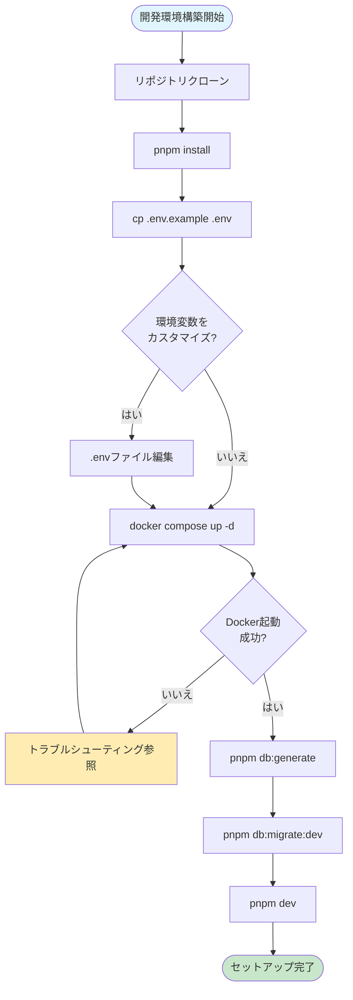
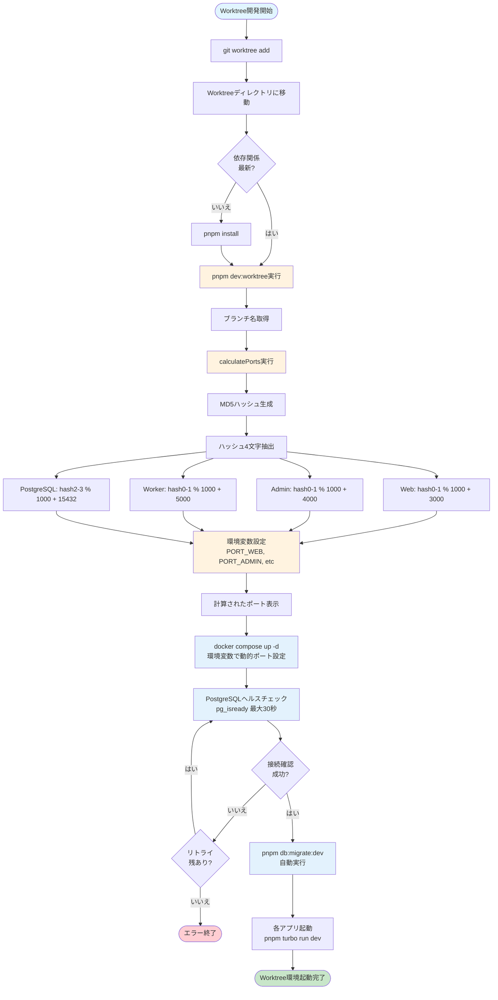
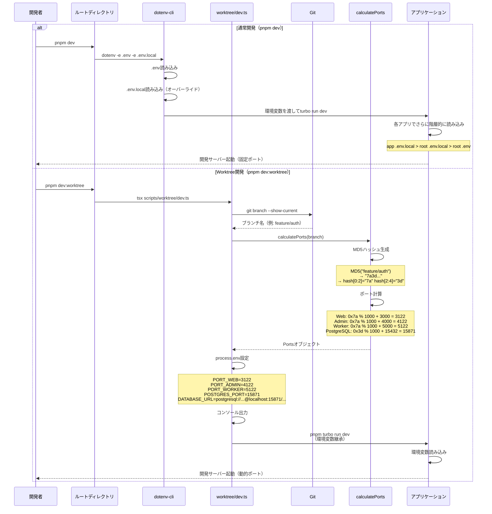

# Dr.Love Demo App - ローカル開発サーバー環境構築ガイド（Worktree対応）

## 概要

Dr.Love Demo Appは、Turborepo + Next.jsを使用したモノレポ構成のアプリケーションです。本ドキュメントでは、ローカル開発サーバーの起動、環境変数管理、Worktree環境での並行開発まで、開発メンバーが迷わず環境構築できるように手順を説明します。

### プロジェクト構成

- **apps/web**: エンドユーザー向けWebアプリケーション (Next.js 14 App Router)
- **apps/admin**: 管理画面アプリケーション (Next.js 14 App Router)
- **apps/cron-worker**: バックグラウンドジョブ実行アプリ (Next.js API Routes)
- **packages/server-core**: 共有サーバーロジック (Domain層 + Infrastructure層)

## 必要な環境

開発を始める前に、以下の環境を準備してください。

| ソフトウェア | バージョン | インストール確認コマンド |
|------------|----------|---------------------|
| Node.js | 20.x以上 | `node --version` |
| pnpm | 8.x以上 | `pnpm --version` |
| Docker | 24.x以上 | `docker --version` |
| Docker Compose | 2.x以上 | `docker compose version` |
| Git | 2.x以上 | `git --version` |

### インストール方法

#### Node.js & pnpm
```bash
# Node.jsのインストール（推奨: nvm使用）
nvm install 20
nvm use 20

# pnpmのインストール
npm install -g pnpm@8
```

#### Docker
- macOS: [Docker Desktop for Mac](https://docs.docker.com/desktop/install/mac-install/)
- Windows: [Docker Desktop for Windows](https://docs.docker.com/desktop/install/windows-install/)
- Linux: [Docker Engine](https://docs.docker.com/engine/install/)

## セットアップ手順

### 1. リポジトリのクローン

```bash
git clone <repository-url>
cd drlove_demo_app
```

### 2. 依存関係のインストール

```bash
pnpm install
```

このコマンドで、ルートおよびすべてのワークスペース（apps/*, packages/*）の依存関係が一括インストールされます。

### 3. 環境変数の設定

#### ルート.envファイルの作成

**重要**: 環境変数は**ルート.envファイル1つ**のみを作成します。各アプリケーション（apps/*）に個別の.envファイルは不要です。

```bash
# ルートディレクトリで実行
cp .env.example .env
```

#### .envファイルの内容

デフォルトの設定で開発できますが、必要に応じて編集してください。

```bash
# PostgreSQL設定
POSTGRES_PORT=5432
POSTGRES_USER=postgres
POSTGRES_PASSWORD=postgres
POSTGRES_DB=drlove_dev

# ブランチ名（Worktree環境用）
BRANCH_NAME=main
```

#### 環境変数の階層構造

環境変数は以下の優先順位で読み込まれます（下にいくほど優先度が高い）：

1. **ルート/.env** - 全アプリ共通の基本設定（Git管理対象）
2. **ルート/.env.local** - 開発者個人のカスタム設定（gitignore対象）
3. **apps/*//.env.local** - 特定アプリのみのカスタム設定（gitignore対象）

**開発者が作成するのはルート/.envのみ**で、ほとんどのケースで十分です。個人の開発環境に応じてポート番号を変更したい場合などは、.env.localを作成してください。

### 4. PostgreSQLの起動

```bash
# Docker Composeでデータベースを起動
docker compose up -d

# 起動確認
docker compose ps
```

正常に起動すると、PostgreSQLが`localhost:5432`（デフォルト）で利用可能になります。

### 5. Prismaのセットアップ

```bash
# Prisma Clientの生成
pnpm db:generate

# データベースマイグレーション
pnpm db:migrate:dev
```

初回マイグレーション時にマイグレーション名を聞かれた場合は、`init`などの任意の名前を入力してください。

### 6. 開発サーバーの起動

セットアップが完了したら、開発サーバーを起動します。

```bash
pnpm dev
```

各アプリケーションが以下のポートで起動します：

- Web: http://localhost:3000
- Admin: http://localhost:4000
- Cron Worker: http://localhost:5000

## セットアップフロー図



## 開発モード

### 通常開発（`pnpm dev`）

**用途**: 単一ブランチでの通常の開発作業

```bash
pnpm dev
```

#### 特徴:
- 固定ポート番号（web:3000, admin:4000, worker:5000）
- dotenv-cliがルート.envを自動読み込み
- 全アプリケーションを同時起動
- HMR（Hot Module Replacement）対応

#### 個別アプリの起動:
```bash
pnpm dev:web      # Webアプリのみ起動
pnpm dev:admin    # 管理画面のみ起動
pnpm dev:worker   # Cron Workerのみ起動
```

### Worktree開発（`pnpm dev:worktree`）

**用途**: 複数ブランチを同時開発（git worktree使用時）

```bash
pnpm dev:worktree
```

#### 特徴:
- **ポート番号の自動計算**: ブランチ名からMD5ハッシュで一意のポート番号を生成
- 複数ブランチを同時に起動可能（ポート競合なし）
- 各Worktreeで独立したPostgreSQLポートも自動設定
- DATABASE_URLも自動的にWorktree固有のPostgreSQLポートを使用するように生成

#### ポート番号の採番ルール:

Worktreeモードでは、ブランチ名から決定論的にポート番号を計算します。同じブランチ名なら常に同じポート番号が割り当てられます。

```typescript
// scripts/worktree/lib/calculate-ports.tsの実装
1. ブランチ名のMD5ハッシュを生成（例: "feature/auth" → "7a3d...")
2. ハッシュの最初の4文字を使用（"7a3d"）
3. 各ポート番号を計算:
   - Web:        hash[0:2]を16進数変換 % 1000 + 3000  → 3000-3999
   - Admin:      hash[0:2]を16進数変換 % 1000 + 4000  → 4000-4999
   - Worker:     hash[0:2]を16進数変換 % 1000 + 5000  → 5000-5999
   - PostgreSQL: hash[2:4]を16進数変換 % 1000 + 15432 → 15432-16431
```

**採番の特徴:**
- ブランチ名が同じなら常に同じポート番号（再現性）
- Web/Admin/Workerは同じハッシュ部分を使うため連番になる
- PostgreSQLは異なるハッシュ部分を使うため独立した番号
- 1000通りの組み合わせが可能（実用上十分）

#### ポート番号の例:

| ブランチ名 | Web | Admin | Worker | PostgreSQL |
|----------|-----|-------|--------|-----------|
| main | 3195 | 4195 | 5195 | 15651 |
| feature/auth | 3122 | 4122 | 5122 | 15871 |
| feature/payment | 3087 | 4087 | 5087 | 15643 |

#### Worktree環境のセットアップ:

```bash
# 新しいWorktreeを作成
git worktree add ../drlove-feature-auth feature/auth

# Worktreeディレクトリに移動
cd ../drlove-feature-auth

# 依存関係インストール（必要に応じて）
pnpm install

# Worktreeモードで開発サーバー起動（全自動）
pnpm dev:worktree
```

**このコマンドは以下を自動実行します：**
1. ブランチ名からポート番号を自動計算
2. PostgreSQLを動的ポートで起動
3. データベース接続確認（ヘルスチェック）
4. Prismaマイグレーション実行
5. 全アプリケーションの開発サーバー起動

起動時の出力例：

```
🌿 ブランチ: feature/auth
📊 計算されたポート番号:
  - Web:        3122
  - Admin:      4122
  - Cron Worker: 5122
  - PostgreSQL:  15871

🐘 PostgreSQLを起動します...
✅ PostgreSQL起動完了

⏳ PostgreSQLの起動を待機中...
✅ PostgreSQL起動確認完了

🔄 Prismaマイグレーションを実行します...
✅ マイグレーション完了

🚀 開発サーバーを起動します...
```

#### PostgreSQL設定との連携:

`pnpm dev:worktree`は、PostgreSQLを完全自動で管理します。

**自動実行される処理:**

1. **環境変数の自動設定**
   - `POSTGRES_PORT`: 計算されたポート番号（例: 15871）
   - `BRANCH_NAME`: ブランチ名（コンテナ名の重複回避）
   - `DATABASE_URL`: 動的に生成された接続URL

2. **PostgreSQLコンテナの起動**
   - `docker compose up -d`を環境変数付きで実行
   - コンテナ名: `drlove-postgres-${BRANCH_NAME}`（ブランチごとに独立）
   - ポート: 計算された動的ポート

3. **ヘルスチェック**
   - 最大30秒間、PostgreSQLの起動を待機
   - `pg_isready`コマンドで接続確認

4. **Prismaマイグレーション**
   - `pnpm db:migrate:dev`を自動実行
   - データベーススキーマを最新状態に更新

**docker-compose.ymlの対応:**

```yaml
services:
  postgres:
    container_name: drlove-postgres-${BRANCH_NAME:-main}
    ports:
      - "${POSTGRES_PORT:-5432}:5432"
```

**注意事項:**
- 各Worktreeで独立したPostgreSQLコンテナが起動します
- データベースはWorktreeごとに独立（並行開発が可能）
- 手動でPostgreSQLを起動する必要はありません

### Worktree完全セットアップフロー



### 環境変数読み込みフロー



## よく使うコマンド一覧

### 開発サーバー

```bash
# 全アプリケーション起動
pnpm dev

# Worktree環境での起動
pnpm dev:worktree

# 個別アプリ起動
pnpm dev:web
pnpm dev:admin
pnpm dev:worker
```

### ビルド

```bash
# 全アプリケーションをビルド
pnpm build

# 本番モードで起動（ビルド後）
pnpm start
```

### コード品質

```bash
# リント（Biome）
pnpm lint

# フォーマット（Biome）
pnpm format

# リント + フォーマット + インポート整理
pnpm check

# 型チェック
pnpm type-check
```

### テスト

```bash
# ユニットテスト
pnpm test

# E2Eテスト
pnpm test:e2e

# カバレッジ付きテスト
pnpm test:coverage
```

### データベース操作

```bash
# Prisma Clientを生成
pnpm db:generate

# 開発環境でマイグレーション実行
pnpm db:migrate:dev

# 本番環境でマイグレーション実行
pnpm db:migrate:deploy

# Prisma Studioを起動（GUI）
pnpm db:studio

# データベースをリセット（開発環境のみ）
pnpm db:reset
```

### Docker操作

```bash
# PostgreSQL起動
docker compose up -d

# PostgreSQL停止
docker compose down

# ログ確認
docker compose logs -f postgres

# コンテナ状態確認
docker compose ps
```

### クリーンアップ

```bash
# ビルド成果物を削除
pnpm clean

# node_modulesも含めて完全削除
pnpm clean:all
```

## トラブルシューティング

### ポート番号が競合している

**症状**: `Error: listen EADDRINUSE: address already in use :::3000`

**原因**: 指定されたポートが既に使用されています。

**解決策**:

1. **既存プロセスを終了**:
   ```bash
   # macOS/Linux
   lsof -ti:3000 | xargs kill -9

   # Windows (PowerShell)
   Get-Process -Id (Get-NetTCPConnection -LocalPort 3000).OwningProcess | Stop-Process
   ```

2. **ポート番号を変更**:
   ルート/.env.localを作成して、カスタムポートを設定：
   ```bash
   PORT_WEB=3001
   PORT_ADMIN=4001
   PORT_WORKER=5001
   ```

3. **Worktreeモードを使用**:
   ```bash
   pnpm dev:worktree
   ```
   自動的に空きポートが計算されます。

### PostgreSQLに接続できない

**症状**: `Error: Can't reach database server at localhost:5432`

**原因**: PostgreSQLが起動していない、またはポート設定が間違っています。

**解決策**:

1. **Dockerコンテナの状態確認**:
   ```bash
   docker compose ps
   ```

2. **PostgreSQLを再起動**:
   ```bash
   docker compose down
   docker compose up -d
   ```

3. **ログを確認**:
   ```bash
   docker compose logs postgres
   ```

4. **ポート番号を確認**:
   .envファイルの`POSTGRES_PORT`が正しいか確認してください。

### Prismaマイグレーションが失敗する

**症状**: `Error: P1001: Can't reach database server`

**解決策**:

1. **DATABASE_URLを確認**:
   ```bash
   echo $DATABASE_URL
   ```

2. **Prisma Clientを再生成**:
   ```bash
   pnpm db:generate
   ```

3. **データベースをリセット**（開発環境のみ）:
   ```bash
   pnpm db:reset
   ```

### pnpm installが失敗する

**症状**: `ERR_PNPM_OUTDATED_LOCKFILE`

**解決策**:

1. **lockfileを更新**:
   ```bash
   pnpm install --no-frozen-lockfile
   ```

2. **キャッシュをクリア**:
   ```bash
   pnpm store prune
   pnpm install
   ```

### HMRが動作しない

**症状**: コード変更が反映されない

**解決策**:

1. **開発サーバーを再起動**:
   ```bash
   # Ctrl+C で停止後
   pnpm dev
   ```

2. **共有パッケージの変更の場合**:
   ```bash
   # packages/server-coreで変更した場合
   cd packages/server-core
   pnpm build

   # ルートに戻って開発サーバー再起動
   cd ../..
   pnpm dev
   ```

### Turborepoのキャッシュをクリアしたい

**症状**: 古いビルド結果が使われている

**解決策**:

```bash
# Turborepoキャッシュを削除
rm -rf .turbo

# ビルド成果物も削除
pnpm clean

# 再ビルド
pnpm build
```

## 環境変数リファレンス

### ルート/.env（必須）

| 変数名 | デフォルト値 | 説明 |
|-------|------------|------|
| `POSTGRES_PORT` | 5432 | PostgreSQLポート |
| `POSTGRES_USER` | postgres | PostgreSQLユーザー名 |
| `POSTGRES_PASSWORD` | postgres | PostgreSQLパスワード |
| `POSTGRES_DB` | drlove_dev | データベース名 |
| `BRANCH_NAME` | main | ブランチ名（Worktree用） |

### ルート/.env.local（オプション）

個人の開発環境に応じて作成。Gitには含まれません。

| 変数名 | 例 | 説明 |
|-------|-----|------|
| `PORT_WEB` | 3001 | Webアプリのポート（カスタム） |
| `PORT_ADMIN` | 4001 | 管理画面のポート（カスタム） |
| `PORT_WORKER` | 5001 | Cron Workerのポート（カスタム） |
| `DATABASE_URL` | postgresql://... | データベース接続文字列（完全カスタム） |

### apps/*//.env.local（オプション）

特定のアプリケーションのみに適用する設定。通常は不要です。

```bash
# apps/web/.env.local の例
NEXT_PUBLIC_API_URL=http://localhost:8080
```

## 次のステップ

環境構築が完了したら、以下のドキュメントも参照してください：

- **[タスク実行ガイド](./task-execute.md)**: /task-execコマンドの使用方法
- **[アーキテクチャ設計書](../specs/tasks/monorepo/20251104-monorepo-turborepo-nextjs-setup/design/architecture.md)**: システム構成の詳細
- **[技術仕様書](../specs/tasks/monorepo/20251104-monorepo-turborepo-nextjs-setup/requirements/technical.md)**: 技術要件の詳細

## 質問・サポート

開発環境構築で困ったことがあれば、以下を確認してください：

1. このドキュメントのトラブルシューティングセクション
2. プロジェクトのREADME.md
3. GitHub Issuesで既存の問題を検索
4. チームメンバーに相談
