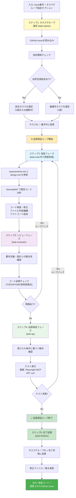
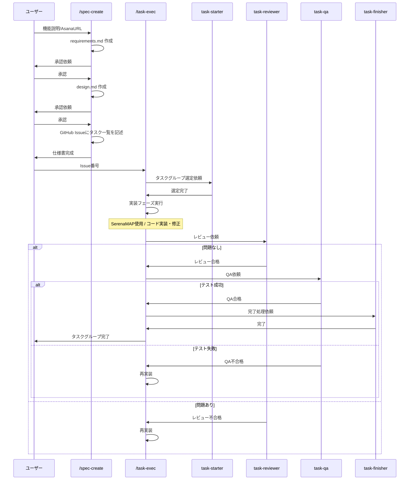

# Dr.Love Demo App - 開発ワークフロー

このドキュメントでは、`/spec-create`と`/task-exec`コマンドを使用したATDD（受け入れテスト駆動開発）に基づく開発ワークフローについて説明します。

## 概要

開発プロセスは2つの主要なコマンドで構成されています：

1. **`/spec-create`**: 仕様書の作成（要件定義 → 設計 → GitHub Issueへのタスク記述）
2. **`/task-exec`**: タスクの実行（選定 → 実装 → レビュー → QA → 完了）

## 全体フロー図

### フェーズ1: 仕様書作成 (`/spec-create`)


### フェーズ2: タスク実行 (`/task-exec`)

**注記**: 品質保証ループにより、レビュー/QA失敗時は自動的に実装フェーズに戻ります。複数タスク一括実行も可能です。



### 全体の関係図

```mermaid
graph LR
    A[/spec-create] --> B[requirements.md]
    A --> C[design.md]
    A --> D[GitHub Issue]

    D --> E[/task-exec]
    B --> E
    C --> E

    E --> F[実装コード]
    E --> G[更新されたGitHub Issue]

    G --> H{次のタスクグループ?}
    H -->|Yes| E
    H -->|No| I[完了]

    style A fill:#2196f3,color:#fff
    style E fill:#ff9800,color:#fff
    style I fill:#4caf50,color:#fff
```

---

## コマンド詳細

### 1. `/spec-create` コマンド

**役割**: プロダクト開発のシニアテクニカルアーキテクト兼シニアプロダクトエンジニアとして、ATDD形式の仕様書を段階的に作成します。

#### 実行方法

```bash
# Asanaタスクから仕様書作成
/spec-create https://app.asana.com/0/project/task-id

# 機能説明から仕様書作成
/spec-create "ユーザー認証機能の実装：マジックリンク認証とセッション管理"

# 既存仕様書を修正
/spec-create "認証機能の改善" /docs/specs/issues/auth/20250111-auth-magic-link/
```

#### 処理フロー詳細

```
Step 1: 外部リソース確認
├─ AsanaタスクURL指定時
│  └─ AsanaMCP でタスク情報取得
│     ├─ タイトル
│     ├─ 説明
│     └─ カスタムフィールド
├─ FigmaURL含まれる場合
│  └─ FigmaDevModeMCP でデザイン分析
│     ├─ UI要件
│     ├─ コンポーネント仕様
│     └─ デザイントークン
└─ 出力ディレクトリ決定
   └─ /docs/specs/issues/{domain}/{YYYYMMDD}-{domain}-{feature}/

Step 2: requirements.md 作成（要件定義書）
├─ spec-requirements-generator エージェント起動
├─ 既存コードベース分析
├─ ATDD形式のユーザーストーリー作成
├─ 受け入れ基準（Acceptance Criteria）定義
├─ 機能要件・非機能要件の整理
├─ ユーザー承認待ち
│  ├─ 承認 → コミット＆プッシュ
│  │  └─ メッセージ: "docs: add requirements for {feature-name}"
│  └─ 修正依頼 → 再作成
└─ 📄 成果物構成:
   - ユーザーストーリー
   - 受け入れ基準
   - 機能要件
   - 非機能要件

Step 3: design.md 作成（設計書）
├─ spec-design-generator エージェント起動
├─ 既存アーキテクチャ調査
├─ 技術スタック選定（Next.js + Hono + Prisma）
├─ データモデル設計
├─ API仕様定義
├─ セキュリティ設計・エラーハンドリング設計
├─ ユーザー承認待ち
│  ├─ 承認 → コミット＆プッシュ
│  │  └─ メッセージ: "docs: add design for {feature-name}"
│  └─ 修正依頼 → 再作成
└─ 📄 成果物構成:
   - アーキテクチャ設計
   - データモデル設計
   - API仕様
   - セキュリティ設計
   - エラーハンドリング

Step 4: GitHub Issueにタスク一覧を記述
├─ spec-tasks-generator エージェント起動
├─ 実装タスクの洗い出し
├─ タスクの分解（Phase別）
├─ 依存関係の定義
├─ 優先順位の設定
├─ GitHub Issueの本文にタスク一覧を記述
├─ ユーザー承認待ち
│  ├─ 承認 → Issueブランチ作成、ファイルプッシュ、PR作成、Issue更新
│  └─ 修正依頼 → 再作成
└─ 📄 成果物構成:
   **基本構成**（各ファイル1000行以下）:
   - requirements.md, design.md
   - GitHub Issueにタスク一覧

   **分割構成**（1000行超過時）:
   - requirements/, design/ ディレクトリ
   - 各ディレクトリ内にREADME.mdと複数の詳細ファイル
   - GitHub Issueにタスク一覧
```


---

### 2. `/task-exec` コマンド

**役割**: タスク実行マネージャーとして、タスクの選定から実装、レビュー、QA、完了までの一連のプロセスを管理します。

**重要な特徴**:
- **品質保証ループ**: QAが合格するまで自動的に実装→レビュー→QAのサイクルを繰り返す
- **即座の次フェーズ開始**: 各フェーズ完了後、ユーザーの応答を待たずに次のフェーズを自動開始
- **サブエージェント連携**: 各フェーズで専門のサブエージェントを使用（task-starter, task-executer, task-reviewer, task-qa, task-finisher）

#### 実行方法

```bash
# Issue番号を指定（自動選定）
/task-exec #123

# 特定のタスクグループを指定
/task-exec #123 1.1

# Issue番号のみ（#なし）
/task-exec 123
```

#### 処理フロー詳細

```
┌─────────────────────────────────────────────────────┐
│ ステップ1: タスクグループ選定 [task-starter]          │
│ 🎯 目的: 着手可能なタスクグループを1つ選定           │
└─────────────────────────────────────────────────────┘
  ↓
  ├─ GitHub Issueを読み込み・解析
  ├─ 依存関係チェック
  │  └─ 先行タスクグループが [x] 完了状態か確認
  ├─ タスクグループ指定がある場合
  │  └─ 該当タスクグループのみ選定
  ├─ 指定がない場合
  │  └─ 最も優先順位が高いタスクグループを選定
  ├─ 選定タスクグループを [🔄] 着手中に変更
  └─ 完了報告: "## 📋 タスクグループ選定完了"

┌─────────────────────────────────────────────────────┐
│ ステップ2: 実装フェーズ [task-executer]               │
│ 🎯 目的: 選定されたタスクの実装                       │
│ ⚠️ 注意: ユーザーの応答を待たずに自動開始            │
└─────────────────────────────────────────────────────┘
  ↓
  ├─ task-executerサブエージェント起動
  ├─ requirements.md と design.md を参照
  ├─ SerenaMAP で既存コード分析
  │  ├─ 関連ファイルの検索
  │  ├─ シンボル定義の確認
  │  └─ 参照関係の把握
  ├─ コード実装・修正
  │  ├─ ファイル作成/編集
  │  ├─ テストコード追加
  │  └─ ドキュメント更新
  ├─ 完了報告: "## 🔨 実装フェーズ完了"
  └─ 即座にステップ3へ（レビューフェーズ）

┌─────────────────────────────────────────────────────┐
│ ステップ3: レビューフェーズ [task-reviewer]           │
│ 🎯 目的: 実装内容の品質確認                          │
│ ⚠️ 注意: ユーザーの応答を待たずに自動開始            │
└─────────────────────────────────────────────────────┘
  ↓
  ├─ requirements.md との整合性確認
  │  └─ 受け入れ基準を満たしているか
  ├─ design.md との整合性確認
  │  ├─ アーキテクチャに準拠しているか
  │  └─ API仕様に従っているか
  ├─ コード品質チェック
  │  ├─ TODO/FIXME の検出
  │  ├─ 仮実装の検出
  │  └─ エラーハンドリングの確認
  ├─ 問題発見時
  │  └─ 実装フェーズに戻る（ステップ2へ自動ループバック）
  ├─ 完了報告: "## 🔍 レビューフェーズ完了"
  └─ 問題なし → 即座にステップ4へ（QAフェーズ）

┌─────────────────────────────────────────────────────┐
│ ステップ4: 品質保証フェーズ [task-qa]                  │
│ 🎯 目的: 受け入れ条件に基づく動作確認                 │
│ ⚠️ 注意: ユーザーの応答を待たずに自動開始            │
└─────────────────────────────────────────────────────┘
  ↓
  ├─ 受け入れ条件に基づく動作確認
  ├─ テストタイプ別実行
  │  ├─ 画面テスト: Playwright MCP
  │  │  ├─ 画面遷移確認
  │  │  ├─ 入力検証
  │  │  └─ エラー表示確認
  │  ├─ APIテスト: curl
  │  │  ├─ リクエスト送信
  │  │  ├─ レスポンス検証
  │  │  └─ エラーケース確認
  │  └─ スクリプトテスト: 実行確認
  ├─ エビデンス保存
  │  ├─ スクリーンショット
  │  └─ ログファイル
  ├─ テスト失敗時
  │  └─ 実装フェーズに戻る（ステップ2へ自動ループバック）
  ├─ 完了報告: "## ✅ QAフェーズ完了"
  └─ 全テスト合格 → 即座にステップ5へ（完了処理フェーズ）

┌─────────────────────────────────────────────────────┐
│ ステップ5: 完了処理フェーズ [task-finisher]           │
│ 🎯 目的: タスクグループの完了処理                    │
└─────────────────────────────────────────────────────┘
  ↓
  ├─ GitHub Issue 更新
  │  └─ タスクグループを [x] 完了状態に変更
  ├─ 修正ファイル一覧更新
  │  └─ 変更されたファイルを記録
  ├─ 次タスクグループの依存関係更新
  └─ 完了報告: "## 🎉 タスクグループ完了"

┌─────────────────────────────────────────────────────┐
│ ステップ6: 追加修正対応フェーズ [task-modification-  │
│           analyzer] (オプション)                     │
│ 🎯 目的: ユーザーからの追加修正指示への対応          │
└─────────────────────────────────────────────────────┘
  ↓
  ├─ ユーザーから追加修正指示がある場合のみ実行
  ├─ 修正内容の分析
  │  ├─ ドキュメント修正の必要性判定
  │  ├─ 修正規模の評価（小規模/中規模/大規模）
  │  └─ 品質保証プロセスの必要性判定
  ├─ 推奨パイプラインの提案
  │  ├─ 小規模修正 → 直接修正＋軽微な確認
  │  ├─ 中規模修正 → ステップ2から再実行
  │  └─ 大規模修正 → 仕様書更新から再開
  └─ 完了報告: "## 📊 追加修正分析完了"
```

---

### 3. `/task-vibe-kanban-loop` コマンド

**役割**: 複数タスクの自動連続実行とVibe-Kanbanによる進捗追跡

詳細については、専用ドキュメントを参照してください：
**📖 [Vibe-Kanban自動実行ガイド](./task-vibe-kanban-loop.md)**

#### `/task-exec`との使い分け

| コマンド | 用途 | 品質保証 | 推奨シーン |
|---------|------|---------|----------|
| **`/task-exec`** | 重要タスクの確実な完了 | ✅ 合格まで自動ループ | 複雑な実装、品質重視 |
| **`/task-vibe-kanban-loop`** | 大量タスクの自動消化 | ❌ 各タスクは別プロセス | 定型作業、並行開発 |

**詳細な使い分け基準**: [task-vibe-kanban-loop.md](./task-vibe-kanban-loop.md#task-execとの使い分け)

---

## 実際の開発フロー例

### シナリオ: マジックリンク認証機能の実装

#### Step 1: 仕様書作成

```bash
# Asanaタスクから仕様書を作成
/spec-create https://app.asana.com/0/project/auth-magic-link

# または機能説明から作成
/spec-create "マジックリンク認証機能：
  - メールアドレスでログイン
  - ワンタイムトークン生成
  - メール送信
  - トークン検証
  - セッション管理"
```

**生成される仕様書**:
```
/docs/specs/issues/auth/issue123-auth-magic-link/
├── requirements.md    ← ユーザーストーリー、受け入れ基準
└── design.md          ← API設計、データモデル、セキュリティ

GitHub Issue #123     ← 実装タスク一覧（Phase 1〜3）
```

#### Step 2: タスク実行（Phase 1-1）

```bash
# Phase 1-1: トークン生成APIの実装
/task-exec #123

# 実行内容:
# 1. task-starter: "Phase 1-1: トークン生成API実装" を選定
# 2. task-exec内で直接実装: API実装、バリデーション追加
# 3. task-reviewer: 設計との整合性確認
# 4. task-qa: curlでAPIテスト
# 5. task-finisher: タスクグループを完了状態に変更
```

#### Step 3: タスク実行（Phase 1-2）

```bash
# Phase 1-2: メール送信機能の実装
/task-exec #123

# 実行内容:
# 1. task-starter: "Phase 1-2: メール送信機能実装" を選定（Phase 1-1 が完了しているため着手可能）
# 2. task-exec内で直接実装: メールサービス実装
# 3. task-reviewer: テンプレート確認
# 4. task-qa: メール送信テスト
# 5. task-finisher: タスクグループを完了状態に変更
```

#### Step 4: 全フェーズ完了まで繰り返し

```bash
# Phase 2, Phase 3 のタスクグループを順次実行
/task-exec #123
/task-exec #123
...

# 最終的にすべてのタスクグループが [x] 完了状態になる
```

---

## タスク状態管理

### GitHub Issueのフォーマット

```markdown
## タスク一覧

### Phase 1: 基礎実装

- [ ] **1.1 トークン生成API実装**
  - 1.1.1 トークン生成ロジックの実装
  - 1.1.2 APIエンドポイントの作成
  - 1.1.3 バリデーションの追加
  - **依存関係**: なし
  - **完了条件**: APIテストが通ること（AC1.1を満たす）

- [ ] **1.2 メール送信機能実装**
  - 1.2.1 メールサービスの実装
  - 1.2.2 テンプレートの作成
  - 1.2.3 送信ログの記録
  - **依存関係**: 1.1
  - **完了条件**: メール送信テストが通ること（AC1.2を満たす）

### Phase 2: UI実装
...
```

### タスク状態の遷移


---

## 重要な原則

### ATDD（受け入れテスト駆動開発）

1. **要件定義から始める**: 受け入れ基準を明確に定義
2. **設計を詳細化**: 技術的な実装方法を設計
3. **タスクに分解**: 実装可能な単位に分割
4. **実装→レビュー→QA**: 品質を段階的に確保
5. **受け入れテスト**: 要件を満たしているか確認

### 技術スタック対応

- **フロントエンド**: Next.js (App Router)
- **バックエンド**: Hono (API)
- **データベース**: Prisma (ORM)
- **認証**: 独自実装（マジックリンク、セッション）

### トレーサビリティ確保


---

## トラブルシューティング

### よくある問題と対処法

#### 1. タスクグループが選定されない

```bash
# 原因: 依存関係が満たされていない
# 対処: 先行タスクグループを先に完了させる

/task-exec #123 1.1  # 先行タスクグループを指定して実行
```

#### 2. レビューで差し戻される

```bash
# 原因: 要件や設計との不整合
# 対処: requirements.md と design.md を再確認

# レビュー結果を確認後、再度実装フェーズから実行される
# （task-exec内で自動的に実装をやり直します）
```

#### 3. QAテストが失敗する

```bash
# 原因: 受け入れ条件を満たしていない
# 対処: テスト結果を確認し、実装を修正

# QA失敗時は自動的に実装フェーズに戻ります
# （task-exec内で自動的に実装をやり直します）
```

---

## コマンド実行の全体像



---

## まとめ

このワークフローにより、以下が実現されます：

✅ **品質の高い仕様書**: ATDD形式で明確な受け入れ基準
✅ **体系的な実装**: 設計に基づいた段階的な開発
✅ **直接的な実装**: task-exec内で直接実装を実行（エージェント不要）
✅ **自動化されたレビュー**: 要件との整合性を自動チェック
✅ **確実なQA**: 受け入れ条件に基づく動作確認
✅ **トレーサビリティ**: Asanaから実装までの追跡可能性

### 実行の流れ

1. **仕様書作成**: `/spec-create`で要件・設計を作成し、GitHub Issueにタスク一覧を記述
2. **タスク実行**: `/task-exec`でタスクグループを1つずつ実行
   - task-starterでタスクグループ選定
   - **task-exec内で直接実装**（task-executerエージェントは不要）
   - task-reviewerでレビュー
   - task-qaでQA
   - task-finisherで完了処理
3. **繰り返し**: 全タスクグループが完了するまで`/task-exec`を繰り返す

開発を始める際は、まず`/spec-create`で仕様書を作成し、その後`/task-exec`でタスクグループを順次実行していきます。
