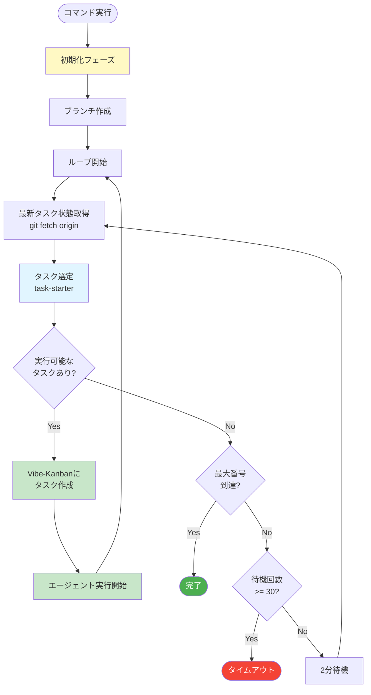
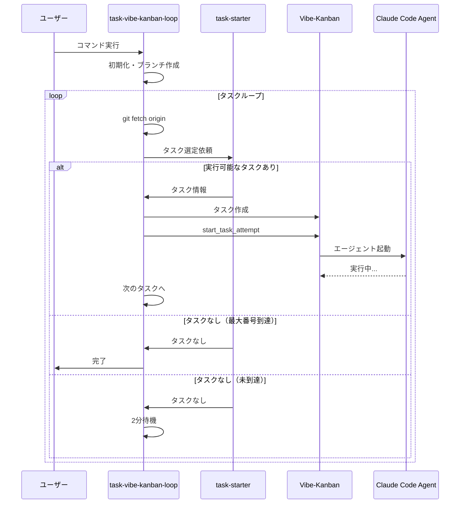

# `/task-vibe-kanban-loop` コマンド

> **クイックスタート**: [スキル・コマンド利用ガイド](../guides/README.md) | [クイックリファレンス](../guides/quick-reference.md)

## 概要

タスクファイルから実行可能なタスクを自動選定し、Vibe-Kanbanに登録して連続実行するループ管理コマンド。

**⚠️ 重要**: 「タスク選定 → タスク作成 → タスク実行 → タスク選定...」のループ。事前に全タスクを作成してはいけない。

---

## 処理フロー



### シーケンス図



---

## 各フェーズの概要

### 0. 初期化フェーズ（初回のみ）

- ユーザー入力解析（タスクファイルパス、最大タスク番号、ベースブランチ）
- タスクブランチ作成: `feat/{domain}/{YYYYMMDD}-{task-name}`
- フェーズブランチ作成: `feat/{domain}/{YYYYMMDD}-{task-name}/phase{N}`

### 1. 最新タスク状態取得フェーズ

```bash
git fetch origin
git show origin/{base_branch}:{task_file_path}
```

リモートの最新状態を参照（他のエージェントの更新を反映）

### 2. タスク選定フェーズ

- task-starterサブエージェント（haiku）で実行可能なタスクを選定
- 依存関係チェック（先行タスクが完了済みか）
- 最大タスク番号の範囲内か確認

### 3. タスク実行フェーズ

- Vibe-Kanbanにタスク作成（選定されたタスクのみ）
- `mcp__vibe_kanban__start_task_attempt`でエージェント起動
- 完了後、即座にフェーズ2へ戻る

### 4. 完了・待機フェーズ

- 最大番号到達 → 終了
- タスクなし & 未到達 → 2分待機（最大30回）→ フェーズ1へ

---

## Vibe-Kanbanセットアップ

### 前提条件

✅ このプロジェクトでは既に設定済み（`.claude/settings.json`）

### セットアップ手順

#### 1. アプリケーション起動

```bash
npx vibe-kanban
```

起動後、ブラウザでUIが自動的に開きます。

#### 2. プロジェクト登録

1. **既存プロジェクトの確認**
   - Vibe-Kanban UIで既存プロジェクトを確認
   - または `mcp__vibe_kanban__list_projects` で確認

2. **新規プロジェクト登録**（初回のみ）
   - Vibe-Kanban UIの「+ New Project」ボタンをクリック
   - プロジェクト名を入力（例: `einja-management-template`）
   - 作成後、プロジェクトIDをメモ（UUID形式）

3. **プロジェクトIDの取得**
   ```
   mcp__vibe_kanban__list_projects
   ```
   → 登録済みプロジェクト一覧とIDが表示される

#### 3. Claude Code MCP設定

Vibe-KanbanをMCPサーバーとして使用するため、`claude_desktop_config.json`または`.claude/settings.json`に設定が必要です：

```json
{
  "mcpServers": {
    "vibe_kanban": {
      "command": "npx",
      "args": ["-y", "vibe-kanban-mcp"]
    }
  }
}
```

**注意**: `npx vibe-kanban`（UIアプリ）と`vibe-kanban-mcp`（MCPサーバー）は別パッケージです。

#### 4. ブランチ戦略

- 詳細: [`docs/steering/task-management.md`](../steering/task-management.md)

---

## `/task-exec`との使い分け

| コマンド | 用途 | 品質保証 | 推奨シーン |
|---------|------|---------|----------|
| **`/task-exec`** | 重要タスクの確実な完了 | ✅ 合格まで自動ループ | 複雑な実装、品質重視 |
| **`/task-vibe-kanban-loop`** | 大量タスクの自動消化 | ❌ 各タスクは別プロセス | 定型作業、自動連続実行 |

**詳細**: [task-execute.md](./task-execute.md#task-execとの使い分け)

---

## 詳細情報

コマンドの詳細な仕様は以下を参照：
- **コマンド定義**: `.claude/commands/task-vibe-kanban-loop.md`
- **タスク管理**: [docs/steering/task-management.md](../steering/task-management.md)

---

## 関連ドキュメント

- [タスク実行ワークフロー](./task-execute.md)
- [タスク管理ガイドライン](../steering/task-management.md)
- [仕様書作成ワークフロー](./spec-create.md)
