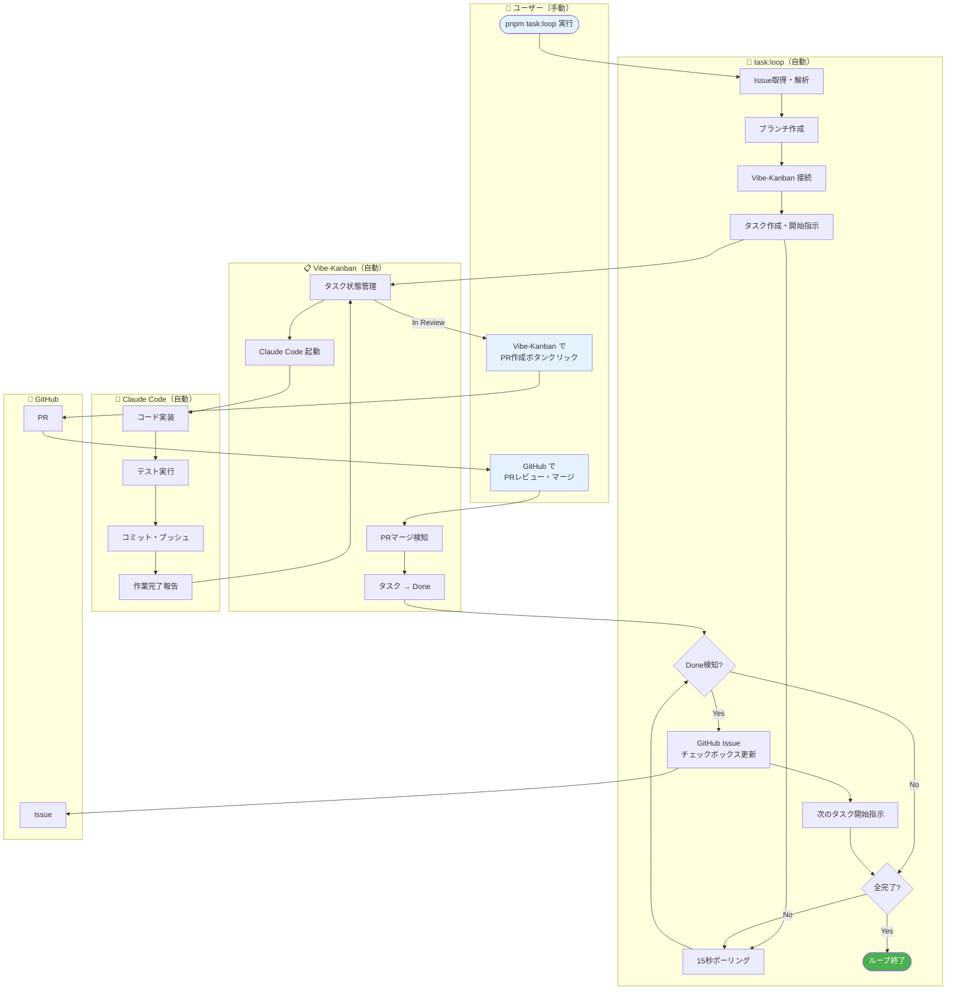
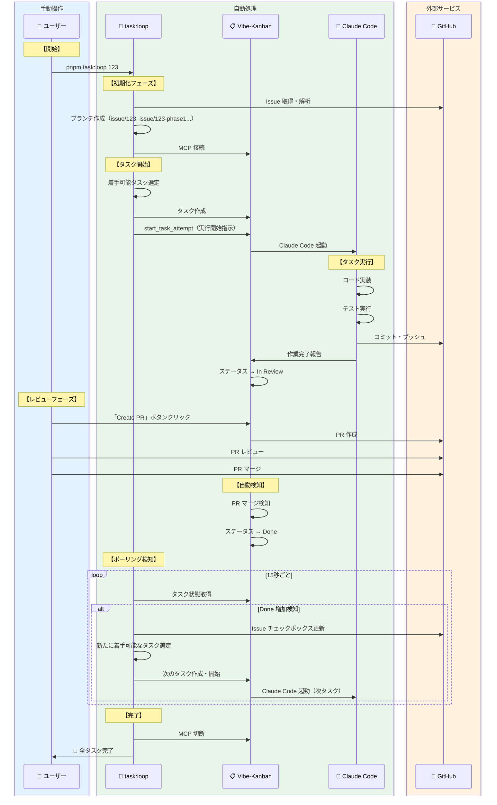

# `pnpm task:loop` コマンド

## 概要

GitHub Issue からタスクを自動選定し、Vibe-Kanban に登録して連続実行する npm スクリプト。

**⚠️ 重要**: 着手可能なタスクを全て並列で Doing に移し、Done 状態の変化を監視して次のタスクを開始するループ処理。

---

## 使用方法

### 事前準備（初回のみ）

```bash
# 1. 仕様書を作成（requirements.md, design.md, GitHub Issue へのタスク記述）
/spec-create <タスク内容の説明>

# 一旦ここまで終わったらDiscordでスレッドを作りチームにレビュー依頼

# 2. Vibe-Kanban を起動（別ターミナルで実行）
npx vibe-kanban
# → ブラウザが自動で開き、Kanbanボードが表示される
# → このボードで PR作成・レビュー・マージ操作を行う
```

### コマンド実行

```bash
# 基本
pnpm task:loop <issue-number>

# 実行後、specで作成されたタスクが勝手に着手可能なものから実行開始されていくので、
# vibe-kanbanの画面を眺めて終わったものから自己レビュー、OKならPR作成ボタンでPR作成、チームのレビュー後、
# PRがマージされると自動で次のタスクが始まる（ちょっとラグあり）

# オプション指定
pnpm task:loop <issue-number> --max <number> --base <branch>

# 例
pnpm task:loop 123                  # Issue #123 の全タスクを実行
pnpm task:loop 123 --max 4          # Phase 4 まで実行
pnpm task:loop 123 --max 4.2        # タスクグループ 4.2 まで実行
pnpm task:loop 123 --base develop   # develop ブランチベースで実行

# ヘルプ
pnpm task:loop --help
```

### Vibe-Kanban 画面での操作

`npx vibe-kanban` で開いたボードで以下の操作を行います：

| 操作 | タイミング | 説明 |
|------|-----------|------|
| **タスク進捗確認** | 随時 | Todo → In Progress → In Review → Done の流れを確認 |
| **Create PR** | In Review 時 | ボタンをクリックして PR を自動作成 |
| **レビュー** | PR 作成後 | GitHub で PR の内容を確認 |
| **マージ** | レビュー完了後 | GitHub で PR をマージ（⚠️ 必ず GitHub 側で操作） |

**⚠️ 重要**: PR のマージは必ず GitHub 側で行ってください。マージを検知して Vibe-Kanban のタスクが自動で Done になります。

---

## ブランチ階層

```
main (デフォルト)
  └── issue/17                  ← main から作成
       ├── issue/17-phase1      ← issue/17 から作成
       ├── issue/17-phase2      ← issue/17 から作成
       └── issue/17-phase3      ← issue/17 から作成
            └── (作業ブランチ)   ← Vibe-Kanban が自動作成
```

- **main**: プロダクションブランチ
- **issue/N**: Issue 単位のブランチ（`--base` で変更可能）
- **issue/N-phaseM**: Phase 単位のブランチ、タスクグループの作業ベース

---

## 開発手順（ステップバイステップ）

### 事前準備チェックリスト

- [ ] Docker が起動している
- [ ] `pnpm install` 済み
- [ ] Vibe-Kanban にプロジェクトが登録されている（後述）
- [ ] GitHub Issue にタスク一覧が記載されている

### Step 1: Vibe-Kanban を起動

```bash
npx vibe-kanban
```

ブラウザが自動で開きます。このボードでタスクの進捗を確認します。

### Step 2: プロジェクト登録（初回のみ）

Vibe-Kanban にこのプロジェクトが登録されていない場合：

1. ブラウザで Projects ページを開く
2. 「Create project」ボタンをクリック
3. Git Repository Path にプロジェクトのパスを入力
   ```
   /Users/yourname/path/to/accs-ai-tools
   ```
4. 保存

### Step 3: タスクループを開始

```bash
pnpm task:loop <issue-number>

# 例: Issue #17 の全タスクを実行
pnpm task:loop 17
```

コマンド実行後：
- 着手可能なタスクが自動で Vibe-Kanban に登録される
- 各タスクが並列で実行開始される
- 15秒ごとに進捗をポーリング

### Step 4: タスク進捗の確認

`npx vibe-kanban` で開いたボードでタスクの状態を確認：

| 状態 | 意味 |
|------|------|
| **Todo** | 未着手 |
| **In Progress** | 実行中（Claude Code が作業中） |
| **In Review** | レビュー待ち（PR作成が必要） |
| **Done** | 完了 |

### Step 5: In Review 状態の対応

タスクが **In Review** になったら：

1. **Vibe-Kanban で「Create PR」ボタンをクリック**
   - PR が自動作成される

2. **GitHub で PR をレビュー**
   - コードを確認
   - 必要に応じて修正を依頼

3. **修正が必要な場合**
   - PR にコメントを残す
   - または Vibe-Kanban で「Request Changes」

4. **レビュー完了後、GitHub で PR をマージ**
   - ⚠️ **必ず GitHub 側でマージすること**（Vibe-Kanban からはマージしない）

### Step 6: マージ後の自動処理

PR をマージすると：

1. Vibe-Kanban がマージを検知
2. タスクが自動で **Done** に変更
3. `pnpm task:loop` がこれを検知
4. GitHub Issue のチェックボックスが自動で `[x]` に更新
5. **Phase 内の全タスクが完了した場合、Phase ブランチを Issue ブランチに自動マージ**
6. 新たに着手可能になったタスクが自動で開始

```
┌─────────────────────────────────────────────────────────────┐
│  PR マージ                                                  │
│      ↓                                                      │
│  Vibe-Kanban: タスク → Done（自動）                        │
│      ↓                                                      │
│  task:loop: Done 検知                                       │
│      ↓                                                      │
│  GitHub Issue: チェックボックス更新（自動）                 │
│      ↓                                                      │
│  Phase 全タスク完了？                                       │
│      ├─ Yes → Phase ブランチを Issue ブランチにマージ       │
│      └─ No  → スキップ                                      │
│      ↓                                                      │
│  次のタスクが自動開始                                       │
└─────────────────────────────────────────────────────────────┘
```

### Step 7: 全タスク完了

すべてのタスクが Done になると：

```
🎉 すべてのタスクが完了しました！
✅ タスク自動実行ループ終了
```

---

## トラブルシューティング

### プロジェクトが見つからないエラー

```
❌ プロジェクトが Vibe-Kanban に登録されていません
```

**対処法**: Step 2 の手順でプロジェクトを登録してください。

### タスクが In Review のまま進まない

**原因**: PR がマージされていない

**対処法**:
1. Vibe-Kanban で「Create PR」をクリック
2. GitHub で PR をレビュー・マージ

### タスクが Done にならない

**原因**: GitHub 側でマージしていない（Vibe-Kanban 上で手動で Done にした）

**対処法**: 必ず GitHub の PR をマージしてください。マージを検知して自動で Done になります。

---

## 処理フロー

### アクター凡例

| アクター | 説明 | 操作種別 |
|---------|------|---------|
| 👤 **ユーザー** | 開発者（あなた） | 手動 |
| 🔄 **task:loop** | `pnpm task:loop` コマンド | 自動 |
| 🤖 **Claude Code** | Vibe-Kanban が起動する AI エージェント | 自動 |
| 📋 **Vibe-Kanban** | タスク管理ボード | 自動 |
| 🐙 **GitHub** | Issue / PR | - |

### フロー図



### シーケンス図



### 操作主体の一覧

| フェーズ | 操作 | 主体 |
|---------|------|------|
| 開始 | `pnpm task:loop` 実行 | 👤 ユーザー |
| 初期化 | Issue 取得、ブランチ作成 | 🔄 task:loop |
| 初期化 | Vibe-Kanban 接続 | 🔄 task:loop |
| タスク開始 | タスク作成・開始指示 | 🔄 task:loop |
| タスク開始 | Claude Code 起動 | 📋 Vibe-Kanban |
| 実装 | コード実装、テスト、コミット | 🤖 Claude Code |
| 実装 | 作業完了報告 | 🤖 Claude Code |
| レビュー | 「Create PR」クリック | 👤 ユーザー |
| レビュー | PR 作成 | 📋 Vibe-Kanban |
| レビュー | PR レビュー・マージ | 👤 ユーザー |
| 検知 | PR マージ検知 → Done | 📋 Vibe-Kanban |
| 検知 | Done 検知 | 🔄 task:loop |
| 更新 | Issue チェックボックス更新 | 🔄 task:loop |
| 次タスク | 次のタスク開始指示 | 🔄 task:loop |
| 終了 | MCP 切断、完了通知 | 🔄 task:loop |

---

## 各フェーズの概要

### 1. 初期化フェーズ（1回のみ）

- 引数解析（Issue番号、最大タスク番号、ベースブランチ）
- GitHub Issue 取得・Markdown パース
- Issue ブランチ作成: `issue/{issue_number}`
- Phase ブランチ作成: `issue/{issue_number}-phase{N}`
- Vibe-Kanban MCP 接続（以降使い回し）
- プロジェクト ID 取得

### 2. 初期タスク開始

- 依存関係を考慮して着手可能なタスクグループを全て選定
- Vibe-Kanban にタスク作成
- `start_task_attempt` で実行開始

### 3. メインループ（15秒ポーリング）

- Vibe-Kanban のタスク状態を取得
- Done 増加を検知した場合:
  - GitHub Issue のチェックボックスを `- [x]` に更新
  - **Phase 内の全タスクが完了していれば、Phase ブランチを Issue ブランチに自動マージ**
  - 新たに着手可能になったタスクを開始
- 全タスク完了で終了

### 4. 終了処理

- Vibe-Kanban MCP 切断

---

## Vibe-Kanban セットアップ

### 前提条件

✅ このプロジェクトでは既に設定済み（`.mcp.json`）

### セットアップ手順

1. **アプリケーション起動**
   ```bash
   npx vibe-kanban
   ```

2. **プロジェクト確認**
   - ブラウザでKanbanボード表示
   - プロジェクトが登録されていることを確認

---

## `/task-exec` との使い分け

| コマンド | 用途 | 品質保証 | 推奨シーン |
|---------|------|---------|----------|
| **`/task-exec`** | 重要タスクの確実な完了 | ✅ 合格まで自動ループ | 複雑な実装、品質重視 |
| **`pnpm task:loop`** | 大量タスクの自動消化 | 並列実行・監視 | 定型作業、並行開発 |

---

## 実装詳細

スクリプトは `scripts/task-vibe-kanban-loop/` に配置：

```
scripts/task-vibe-kanban-loop/
├── index.ts                    # エントリポイント・メインループ
└── lib/
    ├── types.ts                # 型定義
    ├── args-parser.ts          # 引数解析
    ├── task-number-utils.ts    # タスク番号比較
    ├── github-client.ts        # GitHub Issue操作
    ├── branch-manager.ts       # Git ブランチ操作
    ├── vibe-kanban-client.ts   # MCP経由Vibe-Kanban操作
    ├── issue-parser.ts         # Issue Markdownパーサー
    ├── dependency-resolver.ts  # 依存関係解析
    └── task-state-manager.ts   # タスク状態管理
```

---

## 関連ドキュメント

- [タスク実行ワークフロー](./task-execute.md)
- [タスク管理ガイドライン](../steering/task-management.md)
- [仕様書作成ワークフロー](./spec-create.md)
- [ブランチ運用戦略](../steering/branch-strategy.md) - ブランチ命名規則、同期フロー、ワークフロー図
