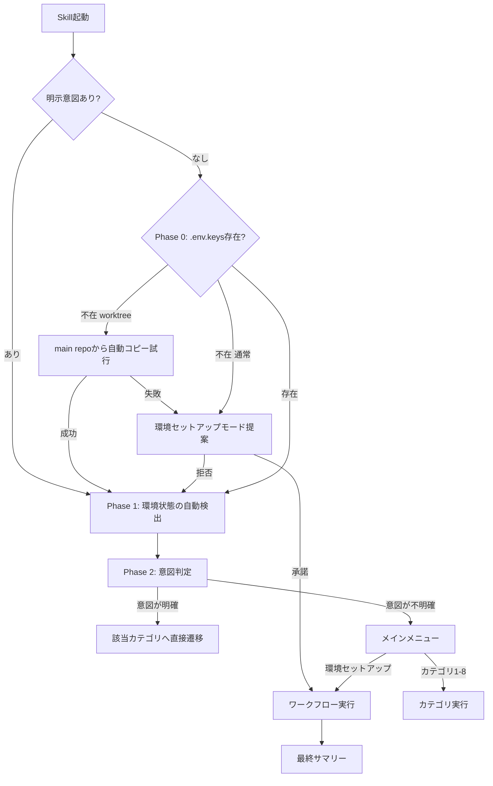

# einja-infra-maintenance 環境セットアップモード追加

## Context

`einja-infra-maintenance` Skillは現在8カテゴリの個別操作メニューを提供しているが、新規プロジェクト/新規開発者の「ゼロからの環境構築」は手動でカテゴリを順に選択する必要がある。`.env.keys`不在時に自動的にフルセットアップワークフローに入り、ローカル環境→Docker→デプロイ設定→外部サービス→デプロイ実行→CI監視・自動修復→Playwright動作確認まで一連で完了させる「環境セットアップモード」を追加する。

## 現状

- `SKILL.md` 194行（Progressive disclosure実装済み）
- `references/` 9ファイル（category-1〜8 + common-operations）
- Phase 1（自動検出）→ Phase 2（意図判定 + メニュー選択）の2フェーズ構造
- `.env.keys`不在時はカテゴリ1推奨のみで、横断的なフローなし

## 変更内容

### アプローチ: メタワークフロー方式（カテゴリ横断型）

新カテゴリではなく、既存カテゴリ1-8を**順序付きで呼び出すワークフロー**として実装する。

理由:
- カテゴリ9にすると手順が二重管理になる
- 既存カテゴリをそのまま再利用し、ワークフロー固有ステップ（CI監視、Playwright確認等）のみ新規定義

### 変更対象ファイル

| ファイル | 操作 | 変更量 |
|---------|------|--------|
| `.claude/skills/einja-infra-maintenance/SKILL.md` | 変更 | +50-60行（Phase 0追加、フロー図更新、メニュー追加） |
| `.claude/skills/einja-infra-maintenance/references/workflow-env-setup.md` | 新規 | ~250行（ワークフロー全体定義 + TOC） |
| `.claude/skills/einja-infra-maintenance/references/workflow-env-setup-steps.md` | 新規 | ~200行（追加ステップ詳細 + TOC） |

既存 `references/category-*.md` は変更なし。

### SKILL.md の変更

**1. Phase 0追加（Phase 1の前）**

`.env.keys`不在を検出 → AskUserQuestionで「環境セットアップモード」を提案。承諾なら `references/workflow-env-setup.md` に遷移、拒否なら通常Phase 1に進む。

**Phase 0のスキップ条件**: ユーザーの発話に特定カテゴリへの明示意図（例:「Vercelだけ設定したい」「GitHub Secretsを確認」）がある場合はPhase 0をスキップし、直接Phase 1→Phase 2に遷移する。また、worktree環境でメインリポジトリに`.env.keys`が存在する場合は自動コピーを先に試行し、コピー成功ならPhase 0をスキップする。

**2. フロー図更新**



**3. メニュー選択肢に追加**

| 選択肢 | description | Note: |
|--------|------------|-------|
| 環境セットアップ（フルセットアップ） | ゼロからの統合環境構築ワークフロー。ローカル→Docker→デプロイ設定→CI→外部サービス→デプロイ→動作確認を一連で実行 | .env.keys不在時に自動推奨。途中からの再開可能。各ステップでユーザー確認あり |

### workflow-env-setup.md（ワークフロー全体定義）

**冒頭にTOC（目次）を含める**（100行超のため設計基準に準拠）。

#### 想定外事態の記録ルール

ワークフロー冒頭で `unexpected_events` リストを初期化し、各ステップ完了時に想定外事態があれば追記する。Step 15のサマリーでこのリストを出力する。

```
unexpected_events = []
# 各ステップ完了後:
# 想定外の事態があれば unexpected_events に追記
# 例: unexpected_events.append("Step 6: Neonリージョン aws-ap-northeast-1 利用不可 → aws-ap-southeast-1 にフォールバック")
```

#### ステップ定義（共通インターフェース）

全ステップは以下の共通インターフェースに従う。タスク1-1/1-2の並列作成時はこのテーブルを正として参照する:

| Step | 内容 | 参照先 | 必須/任意 | 完了条件 |
|------|------|--------|----------|---------|
| 1 | ローカル環境セットアップ（.env.keys取得、CLIツール、pnpm dev:setup） | category-1 | 必須 | `.env.keys`存在 & `pnpm dev:setup`成功 |
| 2 | 環境変数設定（個人トークン、デフォルトトークン適用） | category-2 + category-8 | 必須 | `.env.personal`存在 & トークン有効性検証パス |
| 3 | Docker & DB起動確認（docker compose up、マイグレーション） | 新規 | 必須 | PostgreSQL起動 & マイグレーション成功 |
| 4 | ローカル環境起動確認（pnpm dev、各アプリへcurl、失敗時修正） | 新規 | 必須 | 全アプリが200レスポンス |
| 5 | Vercelプロジェクト設定 | category-3 | スキップ可 | `vercel ls`で全アプリのプロジェクト表示 |
| 6 | Neonプロジェクト設定 | category-4 | スキップ可 | `neonctl branches list`で定常ブランチ表示 |
| 7 | GitHub Secrets一括設定 | category-5 | スキップ可 | `gh secret list`で必須Secrets全件表示 |
| 8 | GitHub Actions初期設定（ブランチ作成、保護ルール） | category-7 | スキップ可 | ブランチ保護設定完了 |
| 9 | 各環境のデプロイ設定ファイル確認（.env.*の存在・復号確認） | category-2 | 必須 | 全環境envファイル存在 & dotenvx復号可能 |
| 10 | .env.keys秘密鍵ローテーション | env-rotate-secrets.ts案内 | オプション | 新鍵でdotenvx復号成功 |
| 10.1 | **（Step 10実行時のみ）ローテーション後の再同期** | category-5 + category-3 | Step 10時必須 | GitHub Secrets・Vercel環境変数が新鍵で更新済み |
| 11 | デプロイ実行（環境別手順で実行） | 新規 | スキップ可 | push/トリガー成功 |
| 12 | CI/CD監視・自動修復 | 新規 | Step 11時のみ | 全ワークフローsuccess or ユーザースキップ |
| 13 | Playwright MCPでのアクセス確認 | 新規 | Step 11時のみ | 全URLで正常表示 |
| 14 | 残作業洗い出し（ヘルスチェック再実行） | category-6 | 必須 | 情報提供のみ |
| 15 | 最終サマリー（実行結果テーブル + 想定外事態 + 残作業） | 新規 | 必須 | 出力完了 |

### workflow-env-setup-steps.md（追加ステップ詳細）

**冒頭にTOC（目次）を含める**（100行超のため設計基準に準拠）。

既存カテゴリにない新規ステップの詳細手順を記載:

- **チェックポイント表示**: 各ステップ完了時に進捗表示（✅/🔄/⬜）
- **Step 3-4**: Docker起動・ローカルアプリ起動・curlヘルスチェックの具体コマンド
- **Step 4**: アプリ別チェック — `apps/web`（port 3000）と`apps/admin`（port 4000）を個別に確認。アプリ固有のエラー（Next.js設定、依存関係不足等）はアプリ名を明示して報告
- **Step 10.1**: ローテーション後の再同期 — 秘密鍵ローテーション後に必ずGitHub Secrets（Step 7フロー）とVercel環境変数（Step 5フロー）を新鍵で再設定。これを行わないとデプロイが破綻する
- **Step 11**: 環境別デプロイ手順:

| 環境 | トリガー方法 | 備考 |
|------|------------|------|
| develop | `git push origin main:develop` | developブランチにpush |
| staging | `git push origin main:staging` | stagingブランチにpush |
| production | `git push origin main` + GitHub承認ゲート | main pushは要承認 |
| PR-preview | テスト用PRを作成（`gh pr create --draft`） | PR作成がトリガー |

- **Step 12**: CI監視・自動修復

自動修復の方針:
> 自動修復対象は**環境設定系エラー**に限定する。コードエラー・型エラー・テスト失敗は報告のみとし、別途対応を案内する。

| パターン | 修復方法 | 承認 | リトライ上限 |
|---------|---------|------|------------|
| Secret not found | → Step 7再実行 | 自動 | 1回 |
| Neon認証失敗 | → Step 6のAPI Key再設定 | 自動 | 1回 |
| Vercelデプロイ失敗（env不足） | → 環境別に分岐: production→`vercel env add`、develop/staging/preview→`--env`注入確認 | 自動 | 1回 |
| Protected branch update failed | → 現状の保護ルール取得→差分提示→**AskUserQuestionで承認**→適用 | **要承認** | 1回 |
| コードエラー/型エラー/テスト失敗 | → エラーログ全文表示、修正は行わない | - | - |

修復後も失敗する場合: ユーザーに報告し、「手動で対応する/スキップして次へ」をAskUserQuestionで確認。全体のリトライ上限は環境あたり2回（初回+修復後1回）。

- **Step 12**: アプリ別CI結果確認 — `gh run view`でジョブ単位の結果を取得し、`apps/web`と`apps/admin`のビルド・テスト結果を個別に報告
- **Step 13**: Playwright MCP（`browser_navigate` → `browser_snapshot` → `browser_take_screenshot`）。MCP未接続時は手動確認に切り替え（URLを表示してユーザーに確認を依頼）
- **Step 15**: 最終サマリーフォーマット（実行結果テーブル、`unexpected_events`リストからの想定外事態、残作業リスト）

## タスク概要

```
タスク0-0: TaskCreate [Task API]
タスク0-1: Planファイルリネーム → docs/plans/202603/20260314-infra-env-setup-mode.plan.md

--- 並行グループ1 ---
タスク1-1: references/workflow-env-setup.md 作成 [サブエージェント]
  - TOC + 15ステップのワークフロー全体定義
  - 既存カテゴリへの参照パス、必須/任意マーク、完了条件
  - unexpected_events記録ルール
  - ★ Plan内の「ステップ定義（共通インターフェース）」テーブルを正として使用すること
タスク1-2: references/workflow-env-setup-steps.md 作成 [サブエージェント]
  - TOC + Step 3,4,10.1,11,12,13,15の詳細手順
  - チェックポイント表示仕様、環境別デプロイ手順、CI自動修復パターン（承認フロー含む）、アプリ別CI確認、サマリーフォーマット
  - ★ Plan内の「ステップ定義（共通インターフェース）」テーブルを正として使用すること
---

タスク2-1: SKILL.md更新 [サブエージェント]
  - Phase 0追加（スキップ条件・worktree自動コピー含む）、フロー図更新、メニュー選択肢追加、カテゴリ詳細テーブル追加
  - 依存: タスク1-1, 1-2（参照パスの整合性確認のため）

タスク99-1: コードレビュー [einja-review-code]
タスク99-2: 動作確認 [Bash]
  - wc -l SKILL.md → 500行以内（設計基準）
  - ls references/ → 11ファイル（既存9 + 新規2）
  - references/内のカテゴリ参照パスが実在ファイルと一致
  - 新規references 2ファイルにTOCが存在すること
  - Phase 0分岐ロジックの論理確認（明示意図あり→スキップ、worktree→自動コピー試行、通常→提案）
  - Step 10→10.1→11の依存チェック（ローテーション後の再同期が必須であること）
  - Step 12の自動修復: Protected branch修復がAskUserQuestion承認フローであること
タスク99-G: コミット承認ゲート [AskUserQuestion]
タスク99-3: コミット・プッシュ [einja-task-commit]
```

## 並列実行計画

```
タスク0-0 → タスク0-1
                ↓
      ┌─────────┴─────────┐
      タスク1-1            タスク1-2
      (workflow定義)       (ステップ詳細)
      └─────────┬─────────┘
                ↓
          タスク2-1
          (SKILL.md更新)
                ↓
      タスク99-1 → 99-2 → 99-G → 99-3
```

worktree不要（Skillドキュメントのみの変更、3ファイル）

## リスク・不明点

| リスク | 対策 |
|--------|------|
| ワークフロー15ステップが長すぎてLLMがコンテキストを失う | 各ステップで既存カテゴリのreferencesを都度読み込む設計（Progressive disclosure） |
| CI自動修復が意図しない変更をする | 修復対象を設定系4パターンに限定。Protected branch修復は要承認。リトライ上限は環境あたり2回。修復後も失敗なら報告のみ |
| Playwright MCPが未接続の環境で実行される | Step 13開始前にPlaywright MCP利用可否を確認し、不可なら手動確認に切り替え |
| Step 10（鍵ローテーション）後にデプロイが破綻する | Step 10.1で GitHub Secrets・Vercel環境変数の再同期を必須化 |
| タスク1-1/1-2並列作成時のStep定義不整合 | Plan内に「共通インターフェース」テーブルを確定済み。両タスクはこれを正として参照 |

## 検証・動作確認方法

1. `wc -l SKILL.md` → 500行以内（設計基準）
2. `ls references/` → 11ファイル（workflow-env-setup.md, workflow-env-setup-steps.md + 既存9）
3. SKILL.md内のreferences/パスが全て実在ファイルを指している
4. workflow-env-setup.md内の各ステップのcategory参照パスが正しい
5. 新規references 2ファイルにTOC（目次）が含まれている
6. Phase 0分岐ロジック: 明示意図→スキップ、worktree→自動コピー試行、通常→提案 の3パターンが論理的に正しい
7. Step 10→10.1→11の依存: ローテーション時にSecrets/Vercel env再同期が必須化されている
8. Step 12: Protected branch修復がAskUserQuestion承認フローになっている
9. Step 12: Vercel env修復がブランチ別（production→`vercel env add`、他→`--env`注入）で分岐している

## レビュー修正履歴

### 第1回レビュー結果（MAJOR）→ 修正

| # | 指摘 | 対応 |
|---|------|------|
| R1-MAJOR-1 | CI自動修復: Protected branch修復の自動適用は危険 | 修復フローを「現状取得→差分提示→AskUserQuestion承認→適用」に変更 |
| R1-MAJOR-2 | 検証方法が静的チェックのみで挙動保証なし | Phase 0分岐シナリオ、Step依存チェック、修復承認フロー確認を検証項目に追加 |
| R1-MINOR-1 | デプロイ対象環境の手順差異が未定義 | Step 11に環境別デプロイ手順テーブルを追加 |
| R1-MINOR-2 | 「appsに応じたチェック」の反映不足 | Step 4にアプリ別チェック、Step 12にアプリ別CI結果確認を追加 |
| R1-MINOR-3 | タスク1-1/1-2の実質的依存 | 共通インターフェーステーブルをPlan内に確定、両タスクプロンプトに「正として参照」を注記 |
| R1-MINOR-4 | CI自動修復スコープのユーザー期待ギャップ | Step 12冒頭に「自動修復対象は環境設定系エラーに限定」方針を明記 |
| R1-MINOR-5 | 想定外事態の記録・蓄積方法が未定義 | `unexpected_events`リスト管理ルールをworkflow-env-setup.md冒頭に追加 |
| R1-MINOR-6 | Phase 0で明示意図がある場合のスキップ条件なし | Phase 0にスキップ条件（明示意図・worktree自動コピー）を追加 |
| R1-MINOR-7 | Vercel env修復がブランチ別分岐なし | Step 12のVercelデプロイ失敗パターンにブランチ別分岐を追加 |
| R1-MINOR-8 | 新規references 100行超にTOC必要 | 両ファイルのTOC追記をPlanに明記 |
