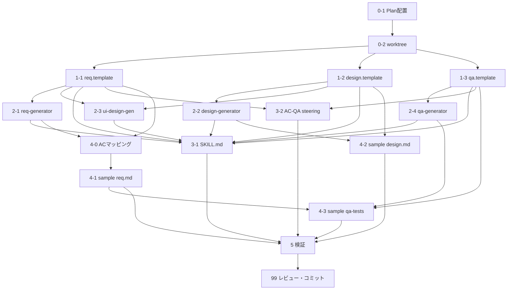

# spec-create Skill 改善 Plan — 図の拡充・WF二段階運用・AC構造刷新

## Context

`einja-issue-spec-create` Skill（およびその配下のエージェント群・テンプレート）について、ユーザーから以下の問題提起があった：

1. **図が少なすぎる**：requirements.md に1枚、design.md に2枚のみ。業務フロー/スイムレーン、ユースケース図、画面遷移図、状態遷移図、ERD等が欠落
2. **ワイヤーフレームの配置が遅い**：現状は Phase 2（設計段階）で ui-design.pen を作成するが、業界標準（BABOK・ISTQB・NN/g）では lo-fi WF は要件段階で書くべき
3. **ACが細かくバラバラでわかりづらい**：ユーザーストーリーとの紐付けがなく、カテゴリ別にフラットに並ぶ

加えて、Codex調査＋現状コード調査により以下の構造問題が判明：

- **AC命名体系が2つ混在**：
  - `requirements.md.template` / `acceptance-criteria-and-qa-guide.md` / `qa-test.md.template` = 体系1（`AC-XXX-CAT-N-001`）
  - `requirements-generator.md`（実運用）/ `issue999` サンプル = 体系2（`AC1.1`）
- **テンプレートにユーザーストーリーセクション自体が存在しない**
- **サンプルにはユースケース図があるが、テンプレートと指示本体には含まれていない**（暗黙の模倣誘導）

本Planでは、これらを根本解決するため、テンプレート・エージェント・ガイド・Skillの4系統を整合的に刷新する。

**前提の明示**: 本リポジトリ（`einja-management-template`）は `docs/einja/` 配下の**原本（Single Source of Truth）**であり、CLAUDE.md の「マネージドディレクトリ（編集禁止）」ルールは**適用外**（CLAUDE.md 末尾「このリポジトリ限定の設定」参照）。`docs/einja/` 配下の編集は許可されている。実装を担当する `docs-updater` サブエージェントには、このリポジトリ例外を明示的に指示すること。

## 現状

### ファイル構成と責務

| ファイル | 役割 | 現状の問題 |
|---------|------|----------|
| `docs/einja/templates/requirements.md.template` | 要件テンプレ | 図1枚、ユーザーストーリーなし、AC命名=体系1 |
| `docs/einja/templates/design.md.template` | 設計テンプレ | 図2枚、物理ERDなし、例外込みシーケンスなし |
| `docs/einja/templates/qa-test.md.template` | QAテンプレ | AC命名=体系1（エージェント出力とズレ） |
| `.claude/agents/einja/issue-specs/requirements-generator.md` | 要件生成エージェント | 体系2サンプルを必須参照させる、lo-fi WF生成指示なし |
| `.claude/agents/einja/issue-specs/design-generator.md` | 設計生成エージェント | 新図に関する指示なし |
| `.claude/agents/einja/issue-specs/ui-design-generator.md` | UIデザイン生成 | Phase 2固定、lo-fi/hi-fi の区別なし |
| `.claude/agents/einja/issue-specs/qa-generator.md` | QA生成 | AC命名体系の前提が揺れる |
| `.claude/skills/einja-issue-spec-create/SKILL.md` | spec-create Skill本体 | Phase 2でui-design.pen生成、WF要件段階参照なし、最低セクションリストにユースケース図等なし |
| `docs/einja/steering/acceptance-criteria-and-qa-guide.md` | AC/QA steering | 体系1前提、ストーリー起点構造の記載なし |
| `docs/einja/example/specs/issues/issue999-example-task/requirements.md` | 参照サンプル | 体系2、新構造へ更新必要 |

### ユーザー合意済み方針（AskUserQuestion結果）

| 項目 | 決定 |
|------|------|
| AC命名体系 | **ハイブリッド新体系** `AC{Story#}.{Cat}.{N\|E}.{連番}` 例: `AC1.VAL.E.001` |
| 章立て構造 | **ストーリー起点**（各Story配下に As a/I want to/So that + Story内AC俯瞰表 + AC詳細） |
| ワイヤーフレーム配置 | **二段階運用**（Phase 1 で lo-fi、Phase 2 で hi-fi に詳細化） |
| 図の追加スコープ | **高＋中優先度** |

## 採用図の根拠（Codex調査トレース）

| 図 | 配置 | 優先度 | 出典標準 | 採用理由 |
|------|------|-------|---------|--------|
| コンテキスト図 | req §1.2 | 高 | C4 Model (Simon Brown) | スコープ境界の可視化は全ソフトウェアチーム推奨 |
| ユースケース図 | req §1.3 | 高 | UML / BABOK | アクター×機能のスコープ共有、非技術者とも会話可 |
| ローファイWF | req §3.3 → ui-design.pen | 高 | BABOK / ISTQB / NN/g | lo-fiは要件段階での早期検証が標準 |
| 画面遷移図 | req §8.2 | 高 | UML state machine | §8表と補完、UI/NAVのACと直結 |
| 業務フロー/スイムレーン | req §9 | 中 | BPMN / BABOK | 権限・承認・部門横断ある機能で有用 |
| 状態遷移図 | req §11 | 中 | BABOK state modelling | 申請・注文・認証等の状態ありで必須級 |
| 概念ER図 | req §12 | 中 | BABOK concept modelling | 用語統一・集約境界の整理 |
| C4 Container図 | design | 高 | C4 Model | 現Boundary Mapを C4 L2 相当に強化 |
| 物理ERD | design | 高 | 標準DB設計 | Prismaコードだけでは関係性俯瞰不可 |
| 詳細シーケンス(alt/opt) | design | 高 | UML sequence | 正常系のみから例外込み詳細へ |
| C4 Component図 | design | 中 | C4 Model | Container内部の責務分割 |
| 詳細状態遷移 | design | 中 | UML state machine | 実装上のstate/event/guardの明示 |

**却下した図（低優先度・本Plan対象外）**：
- アクティビティ図（シーケンスで代替可）
- データフロー図（外部連携ある時のみで、今回は含めない）
- クラス図（関数型Next.jsで過剰）
- デプロイ図（Issue単位では過剰、別途インフラspec化）
- カスタマージャーニーマップ（Discovery段階の成果物、Issue spec対象外）
- ユーザーストーリーマップ（Epic段階の成果物）

## 変更内容

### 1. `docs/einja/templates/requirements.md.template` 全面改訂

新セクション構造（下線は新規）：

```
# [機能名] 要件定義書
## Sources
## 1. 目的・役割
  1.1 対象外
  1.2 スコープ境界 / コンテキスト  ← 新規（コンテキスト図）
  1.3 主要ユースケース              ← 新規（ユースケース図）
## 2. 前提条件・制約
## 3. 画面構成・状態
  3.1 画面構成
  3.2 状態パターン
  3.3 ローファイワイヤーフレーム参照  ← 新規（ui-design.pen リンク）
## 4. 受け入れ条件（ストーリー起点に再構成）  ← 構造変更
  ### Story 1: [タイトル]
    As a / I want to / So that
    4.1.1 Story 1 AC一覧（テーブル）
    4.1.2 Story 1 AC詳細（正常系: カテゴリ別）
    4.1.3 Story 1 AC詳細（異常系: カテゴリ別）
  ### Story 2: ...
## 5. 表示・計算ルール
## 6. 入力ルール
## 7. 権限マトリクス
## 8. 画面遷移
  8.1 画面遷移表（既存）
  8.2 画面遷移図                    ← 新規（flowchart TD）
## 9. 業務フロー（AS-IS/TO-BE）      ← 新規（スイムレーン: flowchart + subgraph、中優先度）
## 10. 処理フロー
  10.1 主要フロー（既存シーケンス）
  10.2 例外フロー
## 11. 状態遷移                       ← 新規（stateDiagram-v2、中優先度）
## 12. 概念データモデル               ← 新規（erDiagram、中優先度）
## 13. 非機能要件
## 14. 実装参考情報
```

AC命名変更：
- 旧: `AC-XXX-UI-N-001`
- 新: `AC{StoryNum}.{Cat}.{N|E}.{連番}` 例: `AC1.UI.N.001` / `AC1.VAL.E.001` / `AC2.ERR.E.001`
- カテゴリは `UI / NAV / VAL / ERR / PERM / UX` を踏襲

追加図テンプレート（mermaid）：
- §1.2 コンテキスト図（`graph TB` + subgraph で外部依存・アクター）
- §1.3 ユースケース図（`graph TB` + subgraph Actors/Features）
- §8.2 画面遷移図（`flowchart TD`）
- §9 業務フロー（`flowchart TD` + `subgraph "レーン名"` でスイムレーン）
- §11 状態遷移（`stateDiagram-v2`）
- §12 概念ER（`erDiagram`、物理ではなく概念）

**mermaid記法方針**: C4記法（`C4Context`/`C4Container`等）は公式experimentalのため使用せず、**`graph TB` + `subgraph` で C4相当を表現**。テンプレにコメントで「C4記法対応環境では代替可」と注記。

**Story ↔ WF 参照規約**: Story内の `UI` / `NAV` カテゴリACは `ui-design.pen` のフレーム番号を引用する（例: `[参照: WF-S1-F01]`）。テンプレのAC詳細ブロックに引用記法の例示をコメントで配置。

### 2. `docs/einja/templates/design.md.template` 改訂

新・章立て（既存セクションとの関係を明示）：

```
# [機能名] 設計書
## Overview
  Goals / Non-Goals
## Existing Architecture Analysis
## Architecture Pattern & Boundary Map（C4 Container相当に強化）  ← graph TB + subgraph
## Technology Stack
## System Flows
  主要フロー（既存sequenceDiagram）
  例外フロー（alt/opt/loop/par）                   ← 強化
## Requirements Traceability
## Component Summary                                ← C4 Component図を前に配置
  C4 Component図                                    ← 新規（graph TB）
## Components and Interfaces
## Data Model
  物理ERD                                           ← 新規（erDiagram、冒頭）
  Entity / DTO
  Persistence (Prisma)
## API Contract
## State Transitions                                ← 新規（stateDiagram-v2、中優先度）
## Rules Mapping
## Testing Strategy for This Feature
## Related Documents
## Related Skills / Subagents
```

追加・強化ポイント：
- **C4 Container図を明示化**（`Architecture Pattern & Boundary Map` を C4 L2相当に強化、`graph TB` + `subgraph` で統一）
- **物理ERD追加**（`Data Model` 冒頭に `erDiagram`、Prismaコードより先に俯瞰）
- **詳細シーケンス強化**（`System Flows` に `alt/opt/loop/par` で例外込みのシーケンス例を追加）
- **C4 Component図**（中優先度、`Component Summary` 内に `graph TB`）
- **詳細状態遷移図**（中優先度、実装上の state/event/guard を示す `stateDiagram-v2`）

### 3. `docs/einja/templates/qa-test.md.template` 改訂

- AC IDの参照形式を新体系 `AC1.VAL.E.001` に更新
- シナリオ-AC対応表を Story単位のセクションに再構成

### 4. `.claude/agents/einja/issue-specs/requirements-generator.md` 改訂

- 新セクション構造・新AC命名体系に合わせて生成指示を書き換え
- Story起点の構造を明示（Story毎にAC一覧表＋詳細）
- lo-fi WF指示を追加：「UI関連要件がある場合、ui-design-generator と連携して lo-fi WF を ui-design.pen に作成」
- 「必ずサンプルと同じ構造・順序で」の指示を新構造に更新
- Story × カテゴリ × 正常/異常 の3軸でAC採番するロジックを明示
- **AskUserQuestionで決定したAC命名・構造の詳細**を追加指示セクションに盛り込む

### 5. `.claude/agents/einja/issue-specs/design-generator.md` 改訂

- C4 Container図、物理ERD、詳細シーケンス（alt/opt）、C4 Component図、詳細状態遷移 の作成指示追加
- 各図の条件付き必須化ルールを明示：
  - UI変更時 → 画面遷移・コンポーネント図必須
  - DB変更時 → 物理ERD必須
  - 状態を持つ機能 → 詳細状態遷移必須
  - 外部連携 → C4 Containerに外部システム明示

### 6. `.claude/agents/einja/issue-specs/ui-design-generator.md` 改訂

- **Phase 1（要件段階）** で lo-fi WF を `ui-design.pen` に作成する指示
- **Phase 2（設計段階）** で hi-fi に詳細化する指示
- lo-fi/hi-fi の区別と成果物例を明示

**lo-fi モードの具体制約**（エージェント指示に明記）：
- **カラー制約**: グレースケールのみ（白・グレー階調・黒）。ブランドカラー・アクセントカラー禁止
- **コンポーネント制約**: Pencilのワイヤーフレームカテゴリのボックス/ライン/プレースホルダーのみ使用。shadcn風の詳細コンポーネント禁止
- **フォント制約**: 1種類のみ（Pencil標準）、タイポグラフィ階層は文字サイズの大小のみで表現
- **目的**: 画面構成・情報優先度・操作導線の合意。デザイン詳細は Phase 2 で決定
- **フレーム命名**: `WF-S{Story#}-F{連番}` 例: `WF-S1-F01`（Story との紐付けを保証）

**hi-fi モードの指示**：
- lo-fi フレームを**上書き詳細化**（別ファイルにせず、同一 `.pen` 上で lo-fi フレーム群を残しつつ hi-fi フレーム群を追加）
- 既存デザインシステムのトークン（カラー・タイポ・スペーシング）を適用
- `einja-pencil-design-manager` の対象コンポーネントと同期

**einja-review-spec との整合性**: lo-fi と hi-fi を `einja-review-spec` が区別してレビューできるよう、Phase 1レビュー時は「lo-fi WF として構成・導線のみ評価」、Phase 2レビュー時は「hi-fi としてデザイントークン・コンポーネント妥当性を評価」と観点を分ける。SKILL.mdの Phase レビュー指示にも明記。

### 7. `.claude/agents/einja/issue-specs/qa-generator.md` 改訂

- 新AC命名体系に対応（参照形式の更新）
- Story起点のシナリオ構造への対応

### 8. `.claude/skills/einja-issue-spec-create/SKILL.md` 改訂

重要な変更点：
- **Phase 1 の最低セクション一覧を新構造に**：`Sources / 目的・役割(+スコープ境界+主要ユースケース) / 前提条件・制約 / 画面構成・状態(+lo-fi WF参照) / ユーザーストーリー×AC / 表示・計算ルール / 入力ルール / 権限マトリクス / 画面遷移(+図) / 業務フロー / 処理フロー / 状態遷移 / 概念データモデル`
- **Phase 1 に lo-fi WF 生成ステップを追加**（UI要件がある場合）：requirements-generator と並列/連続で ui-design-generator を起動し、lo-fi モードで ui-design.pen 初版を作成。Phase 1 レビューゲートの対象に含める
- **Phase 2 の ui-design-generator 呼び出しは「hi-fi 詳細化」モード**に変更（Phase 1 で作った .pen を元に詳細化）
- design.md の最低セクションに追加図（C4 Container、物理ERD、詳細シーケンス）を明記
- AC命名体系を `AC{Story#}.{Cat}.{N|E}.{連番}` 形式に統一することを明記

**既存進行中Issueへの移行判断ルール**（SKILL.mdに新設セクション）：
| 状態 | 判断 |
|------|------|
| 新規Issue | **新テンプレ必須** |
| 完全新規着手（Phase 0-1） | 新テンプレへ移行 |
| Phase 2以降進行中 | **現行のまま完遂**（混在回避） |
| 要件変更で大改訂が必要なIssue | 個別判断（残工数・AC数で判定。30件未満なら移行推奨） |

旧形式サンプル（`issue999-example-task` の旧版）は 4-1 で新形式に完全書き換えし、参照されるサンプルを新形式のみに統一。

### 9. `docs/einja/steering/acceptance-criteria-and-qa-guide.md` 改訂

- AC命名を新体系に統一
- Story起点構造の解説を追加
- カテゴリ（UI/NAV/VAL/ERR/PERM/UX）は踏襲、カテゴリ部分のみ抜粋する横断参照も可能と明記
- **§1「振る舞い駆動テンプレート」「Markdown形式」および具体例集の全AC IDサンプルを新体系に書き換え**（旧体系1 `AC-XXX-CAT-N-001` 形式の全出現箇所を `AC1.CAT.N.001` 等へ機械的置換）

### 10. `docs/einja/example/specs/issues/issue999-example-task/requirements.md` 全面更新

新テンプレート・新AC命名に合わせて全面書き換え。

- AC: `AC1.1` → `AC1.UI.N.001` 等に
- ユースケース図は §1.3 に位置づけ
- Story起点を維持（もともと近い構造）
- lo-fi WF参照を §3.3 に追加（issue999用の lo-fi ui-design.pen も参考として作成）
- 新規追加セクション（業務フロー・状態遷移・概念ER）にサンプルを記入

**AC ID 変換マッピング表の事前作成**（作業ミス防止）：
1. `rg -n "AC\d+\.\d+" docs/einja/example/specs/issues/issue999-example-task/` で全旧AC IDを一覧化
2. 各旧IDをカテゴリ判定し `AC{Story#}.{Cat}.{N|E}.{連番}` の新IDへマッピング表を先に作成
3. マッピング表を `docs-updater` に渡して requirements.md / design.md / qa-tests 全体を一括置換
4. 完了後、旧形式 `AC\d+\.\d+[^.]` の残存がないか再Grep検証

### 11. `docs/einja/example/specs/issues/issue999-example-task/design.md` 更新

- C4 Container図、物理ERD、詳細シーケンス、C4 Component図等を追加

### 12. `docs/einja/example/specs/issues/issue999-example-task/qa-tests/` 更新

- AC参照を新体系に

## タスク概要

### タスク0系（準備）

- **0-0**: Planを TaskCreate で一括タスク化（依存関係明示）[`TaskCreate`]
- **0-1**: Planファイルを `docs/plans/` の命名規則に従い配置（ファイル名リネーム・移動）[`Bash`]
- **0-2**: worktree作成・セットアップ [`_einja-worktree-guide`]
- **0-3**: Skill作成はスキップ（Skill-First評価済: 既存テンプレ改善のため不要）

### タスク1系（テンプレート刷新 — 並列可能）

- **1-1**: `docs/einja/templates/requirements.md.template` 全面書き換え（新構造・新AC命名・追加図テンプレ） [`docs-updater`]
- **1-2**: `docs/einja/templates/design.md.template` 改訂（C4 Container、物理ERD、詳細シーケンス、C4 Component、詳細状態遷移） [`docs-updater`]
- **1-3**: `docs/einja/templates/qa-test.md.template` 改訂（AC命名・Story対応） [`docs-updater`]

### タスク2系（エージェント指示の更新 — 1系と部分並列可）

- **2-1**: `requirements-generator.md` の指示を新構造・新AC命名に合わせる [`docs-updater`]
- **2-2**: `design-generator.md` に追加図の作成指示 [`docs-updater`]
- **2-3**: `ui-design-generator.md` に lo-fi/hi-fi の二段階運用指示 [`docs-updater`]
- **2-4**: `qa-generator.md` に新AC命名体系への対応指示 [`docs-updater`]

### タスク3系（Skill・Steering 更新 — 2系依存）

- **3-1**: `.claude/skills/einja-issue-spec-create/SKILL.md` 改訂（Phase 1 に lo-fi WF追加、最低セクション更新、AC命名統一） [`docs-updater`]
- **3-2**: `docs/einja/steering/acceptance-criteria-and-qa-guide.md` 改訂（新AC命名・Story起点構造） [`docs-updater`]

### タスク4系（サンプル更新 — 1-3系完了後）

- **4-0**: AC ID変換マッピング表を事前作成（issue999全AC IDを新体系へ変換する一覧表を先に作る） [`Grep` + 手作業]
- **4-1**: `issue999-example-task/requirements.md` 全面刷新（新テンプレ・新命名・新図） [`docs-updater`]
  - 依存: 4-0 のマッピング表
- **4-2**: `issue999-example-task/design.md` 更新（追加図） [`docs-updater`]
- **4-3**: `issue999-example-task/qa-tests/**` のAC参照更新 [`docs-updater`]
  - 依存: 4-1（新AC IDが確定してから）

### タスク5系（整合性検証）

- **5-1**: 旧AC命名の残存確認 [`Grep`]
  - `rg -n "AC-[A-Z]+-[A-Z]+-[NE]-[0-9]+"` で体系1残存を0件に
  - `rg -n "^AC[0-9]+\.[0-9]+[^.]"` で素朴体系2残存を0件に（新形式 `AC1.UI.N.001` と区別）
- **5-2**: 新AC命名の厳格パターン検証 [`Grep`]
  - `rg -n "AC\d+\.(UI|NAV|VAL|ERR|PERM|UX)\.[NE]\.\d{3}"` で採番し、それ以外の `AC\d+` 参照を全て検出して潰す
  - カテゴリが `UI|NAV|VAL|ERR|PERM|UX` 以外・区分が `N|E` 以外・連番が3桁でないID揺れを検出
- **5-3**: mermaid構文検証 [`Bash`]
  - `@mermaid-js/mermaid-cli` (mmdc) が利用可能なら `rg -l '\`\`\`mermaid'` で対象ファイル抽出→mmdc一括検証
  - 利用不可なら対象ブロック全件リストを出力し VSCode preview で目視確認（漏れ防止のため全件チェックリスト化）
- **5-4**: ドライラン: issue999 の新requirements/design/qa がSkillの最低セクション要件を満たすか確認 [`Grep`/読解]
- **5-5**: `einja-review-spec` Skill の `review_scope=requirements` / `design` / `phase2_bundle` / `tasks` が参照するセクションリストが SKILL.md と同期しているか確認。ズレがあれば `einja-review-spec` も更新対象に追加 [`Grep`/読解]
- **5-6**: `pnpm build` 実行で `presets/default/` 側に全変更が反映されていることを確認（diff検証） [`Bash`]

### タスク99系（完了検証）

- **99-1**: `einja-review-code` で観点別並列レビュー（ドキュメント観点中心）
- **99-2**: 動作確認【必須】：新テンプレで最小ダミーIssue（例: issue998 を一時作成 or サンプル再生成）の Phase 1→Phase 2 を動作確認
  - 生成された requirements.md / design.md / ui-design.pen / qa-tests が最低セクション要件と新AC命名を満たすこと
  - lo-fi / hi-fi の区別が実際に機能していること
  - ドライラン成果物は動作確認後に破棄
- **99-G**: コミット承認ゲート
- **99-3**: `einja-task-commit` でコミット＆プッシュ

## 並列実行計画



**並列バッチ（個別依存完了次第、即起動可）**：
- Batch-A: 1-1, 1-2, 1-3（テンプレ3本、0-2完了後すぐに並列起動）
- Batch-B（個別依存）:
  - 2-1 は 1-1 完了で即起動可
  - 2-2 は 1-2 完了で即起動可
  - 2-3 は 1-1 AND 1-2 完了で起動可（ui-design は req と design両方を参照）
  - 2-4 は 1-3 完了で即起動可
  - Batch-B全体を待つ必要はない（依存ごとに解錠）
- Batch-C（個別依存）:
  - 4-0（ACマッピング）は 1-1 AND 2-1 完了で起動可
  - 4-1 は 4-0 完了で起動可
  - 4-2 は 1-2 AND 2-2 完了で起動可（4-1と並列可）
  - 4-3 は 1-3 AND 2-4 AND 4-1 完了で起動可（新AC IDが4-1で確定してから）

## リスク・不明点

| # | リスク | 影響 | 対処 |
|---|------|------|------|
| R1 | テンプレ大改訂で既存の進行中Issueのspec形式が古いまま残る | 中 | 3-1（SKILL.md 改訂）に「既存進行中Issueへの移行判断ルール」セクションを新設。(a)新規=新テンプレ必須 (b)Phase 2以降進行中=現行維持 (c)Phase 0-1=移行推奨 (d)要件大改訂Issue=個別判断。旧サンプル（issue999旧版）は 4-1 で完全書き換え |
| R2 | mermaid記法でC4記法がexperimentalのためレンダー環境差が出る | 低 | 標準は `graph TB`、C4記法は「対応環境で使える代替」として注記 |
| R3 | サンプル（issue999）の全面書き換え量が多い | 中 | 4系タスクを並列化、docs-updaterに委託 |
| R4 | AC命名変更で既存QAテンプレ・AC-QAガイドとの整合性 | 高 | 3-2 でガイドを同時更新、5-1 のGrep検証で残存確認 |
| R5 | lo-fi WF を Phase 1 に移すとワークフロー全体のタイミング調整が必要 | 中 | SKILL.md の Phase 1 内で「UI要件あり時のみ並列/連続起動」と条件付き化。UI無し Issue には影響なし |
| R6 | ui-design-generator の lo-fi/hi-fi モード区別が現状未実装 | 中 | 2-3で具体制約を明文化（lo-fi: グレースケールのみ、Pencilワイヤーカテゴリのみ、フォント1種類、フレーム命名 `WF-S{n}-F{nn}`／hi-fi: lo-fi上書き詳細化、同一.pen内で並存）。einja-review-spec にも Phase別レビュー観点を明記 |
| R7 | 全図を必須化するとspec-create時間が増える | 中 | 条件付き必須化（UI変更時/DB変更時/状態あり機能/外部連携）をSKILL.mdに明記 |
| R8 | `einja-review-spec` のレビュー観点が旧最低セクションリストに依存している可能性 | 中 | 5-5 で整合性確認。ズレがあれば `einja-review-spec` も更新対象に追加（タスク動的追加） |
| R9 | `docs-updater` サブエージェントがCLAUDE.mdの「マネージドディレクトリ編集禁止」を理由に作業停止 | 中 | 各タスクプロンプトに「本リポジトリは原本のため `docs/einja/` 配下の編集は許可されている」を必ず明記 |

## 検証・動作確認方法

1. **テンプレート構文検証**：各 `.template` のmermaidブロックをVSCode preview または Mermaid Live Editor で描画確認
2. **Grepによる残存チェック**：
   - `rg -n "AC-[A-Z]+-[A-Z]+-[NE]-[0-9]+"` で旧体系1のAC残存を0件に
   - `rg -n "^AC[0-9]+\.[0-9]+[^.]"` で旧体系2の素朴AC残存を0件に（新体系は `AC1.UI.N.001` 形式）
3. **Skill整合性チェック**：
   - `SKILL.md` の最低セクション一覧と `requirements.md.template` のセクションが一致
   - `SKILL.md` の最低セクション一覧と `design.md.template` のセクションが一致
4. **サンプル再現確認**：
   - `issue999-example-task/requirements.md` が新テンプレの全セクションを含む
   - AC IDが全て新体系
5. **試験的なドライラン（optional）**：
   - 新テンプレを使って小さなテスト要件を手動で1件書いてみて、エージェント指示通りに埋められるか確認
6. **ビルド確認**：
   - `pnpm build`（または create-app の templates/copy-presets 同期）で `presets/default/` 側にもコピーされるか
7. **レビュー**：
   - `einja-review-code` の観点別並列レビューでドキュメント整合性・用語統一・図の妥当性を検証

## 対象ファイル一覧（編集対象）

### テンプレート（原本）
- `docs/einja/templates/requirements.md.template`
- `docs/einja/templates/design.md.template`
- `docs/einja/templates/qa-test.md.template`

### エージェント
- `.claude/agents/einja/issue-specs/requirements-generator.md`
- `.claude/agents/einja/issue-specs/design-generator.md`
- `.claude/agents/einja/issue-specs/ui-design-generator.md`
- `.claude/agents/einja/issue-specs/qa-generator.md`

### Skill・Steering
- `.claude/skills/einja-issue-spec-create/SKILL.md`
- `docs/einja/steering/acceptance-criteria-and-qa-guide.md`

### サンプル
- `docs/einja/example/specs/issues/issue999-example-task/requirements.md`
- `docs/einja/example/specs/issues/issue999-example-task/design.md`
- `docs/einja/example/specs/issues/issue999-example-task/qa-tests/**`

### ビルド時自動反映（直接編集しない）
- `presets/default/docs/einja/templates/**`
- `presets/default/.claude/skills/einja-issue-spec-create/**`
- `presets/default/.claude/agents/einja/issue-specs/**`
- `presets/default/docs/einja/example/**`

（※ ルートの原本を変更すれば `copy-presets.mjs` がビルド時に同期）

## Skill-First評価結果

**⚪ Skill作成不要**

- 本作業は **既存の Skill/エージェント/テンプレートの構造改善** であり、反復性のある新規ワークフローではない
- 1回限りの構造刷新作業
- 完了後は改善された既存Skill（`einja-issue-spec-create`）が反復利用される
- スキップ基準「具体的かつ限定的な作業指示・1回限りの作業」に該当
