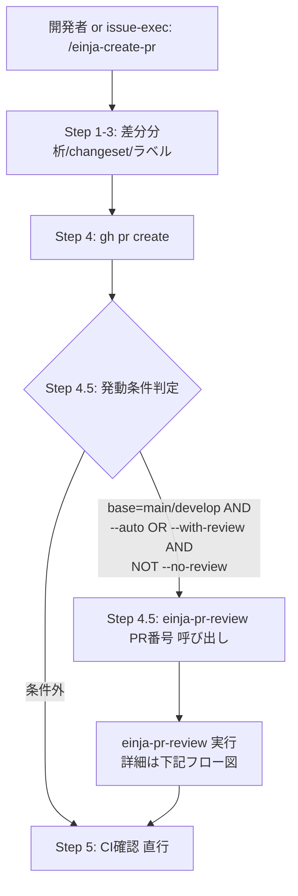

# Plan: PR自動レビューSkill（einja-pr-review）新設 + einja-create-pr 拡張

## Context

このリポジトリ（einja-management-template）は Claude Code 設定を含む案件配布用テンプレートで、`einja-` プレフィックスの Skill・`.github/workflows/` は全案件に自動配布される。

現状、PR作成時のレビューは既存の `.github/workflows/claude.yml`（`@claude` メンション駆動）のみで、**PR作成時に自動でレビューを開始する仕組みがない**。

当初は GitHub Actions で `anthropics/claude-code-action@v1` を起動する Skill を計画していたが、以下の理由で **ローカル実行方式** に方針転換した:

- **コスト**: 従量APIで月$42〜$125（Sonnet、100〜300PR/月）。案件数分の合算で急増する
- **精度**: ローカル `einja-review-code` とGitHub Actions版のClaudeは同じ品質
- **既存 `einja-create-pr` Skillが「PR作成の統合エントリポイント」として稼働中** — レビュー呼び出しを組み込む自然な拡張ポイント
- **`einja-issue-exec` は既に `--auto` モードで `einja-create-pr` を呼んでいる** — 一度統合すれば自動化フロー全体でPRレビューが得られる
- **Asana MCP がローカル実行なら利用可能** — GitHub Actionsでは不可能だったAsana整合性チェックが実現可能に

本Planでは以下を実施する:

1. **`einja-pr-review` Skill新設** — ローカル実行で以下4セクションのレビュー結果を生成し、**そのままsticky commentとしてPRに投稿する**（generate + post を一体で担当）
   - **§1 PR概要**（S1-S4 常時 + C1/C3/C4/C5 条件付き）
   - **§2 AIレビュー**（4観点: Asana整合性 / 影響範囲調査 / 仕様書・Mermaid更新確認 / 個別レビュー結果サマリー化）
   - **§3 人間が見るべき観点**（AI判断困難な項目のリストアップ）
   - **§4 指摘の分類サマリー**（優先度 × ジャンル、AR-PR4に統合）
2. **`einja-create-pr` Skill拡張** — Step 4.5（レビュー発動条件判定 + `einja-pr-review` 呼び出し）を追加。コメント投稿は `einja-pr-review` 自身が担当するため、独立した Step 4.6 は不要
3. **手動再レビュー機能** — `einja-pr-review` は `user-invocable: true` により `/einja-pr-review <PR番号>` として直接呼び出し可能。**別Skillの `einja-review-pr` は不要**（当初設計から削除）

**発動条件**: 「PR作成後の `einja-create-pr` 経由」かつ「base=main/develop」かつ「`--auto` フラグ（`einja-issue-exec` 経由）または `--with-review` フラグ（手動）」

**得るもの**:
- **追加API課金ゼロ**（開発者のClaude Codeサブスク枠内で完結）
- **案件毎のSecret登録不要**（`ANTHROPIC_API_KEY` / `ASANA_TOKEN` 追加不要）
- **`einja-infra-maintenance` 統合不要**
- **配布経路の追加設定不要**（Skillは `einja-` プレフィックスで自動配布）
- **Asana整合性チェックが実現**（ローカル claude.ai Asana Connector 経由）

**トレードオフ**:
- 追加push時の自動再レビューは無い → `/einja-pr-review` コマンドで手動再実行
- 手動 `/einja-create-pr`（`--with-review` なし）ではレビューは走らない → 小さなPRは高速で作成できる
- `einja-issue-exec` 最終PR時に einja-review-code/spec を再実行（各タスク/Phase時点の実行と重複するが、機能全体視点での再評価として価値あり）

---

## 現状

### PR作成関連のSkill

- **`einja-create-pr` Skill**（既存・稼働中、833行）:
  - `/einja-create-pr` または `--auto` モード（`task-exec`/`issue-exec` 経由）で起動
  - Step 1〜5: 差分分析 / changeset生成 / ラベル判定 / `gh pr create` / CI確認
  - PR本文に Summary/Changes/Changeset のみ、**レビュー結果のPRコメント投稿ステップは無い**
- **`einja-task-exec` Skill**: Step 7.5 で `einja-create-pr` を呼び出し（タスクPR作成）
- **`einja-issue-exec` Skill**: `/einja-create-pr --auto --base ...` を呼び出し（Phase PR / 最終PR）
- **`einja-issue-spec-create` Skill**: `mcp__github__create_pull_request` を**直接使用**（Spec PR）→ **`einja-create-pr` は経由しない**

### 各PRの現状レビュー実施状況

| PR種別 | 作成方法 | 既存レビュー |
|-------|--------|-----------|
| **Spec PR**（仕様書） | mcp__github__create_pull_request 直接 | einja-review-spec × 3回（Phase 1d/2/3）|
| **タスクPR** | einja-task-exec → einja-create-pr | task-reviewer → einja-review-code（結果は永続化されない）|
| **Phase PR** | einja-issue-exec → /einja-create-pr --auto | phase-reviewer → _einja-phase-review → einja-review-code（結果は永続化されない）|
| **最終PR**（Issue → base） | einja-issue-exec → /einja-create-pr --auto | **なし**（独立レビュー実行なし。ただし各タスク/Phase時点では実行済み）|
| **開発者手動 /einja-create-pr** | 手動 | なし |

### レビューSkill資産（本Planで活用）

- `.claude/skills/einja-review-code/SKILL.md`（193行） — 観点別並列レビュー（観点A-H、Codex並列）
- `.claude/skills/einja-review-spec/SKILL.md`（309行） — 仕様書観点、横断必須ゲート §G1-§G6

### Asana MCP 資産

- `.claude/settings.json` の permissions で `mcp__claude_ai_Asana__*` が許可済み
- claude.ai の Connector で Asana を認証済みの開発者ローカル環境から利用可能
- `docs/einja/instructions/recommended-mcp-servers.md` に導入手順あり
- **GitHub Actionsでは利用不可**（本Planはローカル実行なので使用可能）

### Issue/仕様書のAsana URL 伝播フロー（既存）

`einja-issue-spec-create` フローで以下が確立:
- Asanaタスク URL → Skillに引数として渡す
- AsanaMCPで内容取得 → GitHub Issue作成、requirements.md 生成
- **requirements.md の §Sources テーブルにAsana URLが記録される**（テンプレート: `docs/einja/templates/requirements.md.template`）
- PR時点でIssue番号 → requirements.md を Glob探索 → §Sources から Asana URL 取得可能

### 参照ドキュメント（実在確認済み）

- `docs/einja/steering/development/coding-standards.md`
- `docs/einja/steering/development/review-guidelines.md`

### 配布経路

- `.claude/skills/einja-*/` → `packages/cli/scripts/copy-presets.mjs` でプレフィックス自動配布
- **追加設定不要**

### Plan配置規則

- `docs/plans/YYYYMM/YYYYMMDD-機能名.plan.md`
- 今回の配置先: `docs/plans/202607/20260730-pr-review-local.plan.md`（`202607/` ディレクトリは新規作成必要）

---

## 発動条件マトリクス（重要）

`einja-pr-review` の発動条件を明示的に定義。**この条件で自動的にタスク/Phase PRを除外し、最終PR・手動main向けPRのみが対象になる**。

### 判定ロジック

```
einja-create-pr の Step 4.5 冒頭で判定:

SHOULD_RUN_REVIEW=false
FORCE_REVIEW=false

# 0. --force-review フラグ（動作確認・デバッグ用、production では非推奨）
# 2段階セーフガード:
#   (a) 警告ログを stderr に出力
#   (b) EINJA_ALLOW_FORCE_REVIEW=1 が設定されていなければエラー終了
if echo "$ARGUMENTS" | grep -q -- "--force-review"; then
  echo "⚠️  --force-review is for debugging only. This bypasses base branch validation." >&2
  if [ "${EINJA_ALLOW_FORCE_REVIEW:-}" != "1" ]; then
    echo "❌ --force-review requires EINJA_ALLOW_FORCE_REVIEW=1 env var to be set." >&2
    exit 1
  fi
  FORCE_REVIEW=true
fi

# 1. base が main または develop か（--force-review 時はバイパス）
if [ "$FORCE_REVIEW" != "true" ]; then
  if [ "$BASE" != "main" ] && [ "$BASE" != "develop" ]; then
    → SKIP（タスクPR / Phase PR は対象外）
    return
  fi
fi

# 2. --no-review フラグが明示的に指定されているか
if echo "$ARGUMENTS" | grep -q -- "--no-review"; then
  → SKIP（緊急hotfix等の明示的無効化）
  return
fi

# 3. --auto モード（issue-exec 経由）または --with-review フラグ or --force-review
if [ "$FORCE_REVIEW" = "true" ] || echo "$ARGUMENTS" | grep -q -- "--auto" || echo "$ARGUMENTS" | grep -q -- "--with-review"; then
  SHOULD_RUN_REVIEW=true
fi

# 4. 発動
if [ "$SHOULD_RUN_REVIEW" = "true" ]; then
  → einja-pr-review 呼び出し + sticky-comment 投稿
fi
```

### 発動シナリオ一覧

| シナリオ | base | フラグ | einja-pr-review 発動 |
|--------|------|-------|:-------:|
| `einja-issue-exec` 最終PR: `/einja-create-pr --auto --base main` | main | --auto | ✅ |
| `einja-issue-exec` 最終PR: `/einja-create-pr --auto --base develop` | develop | --auto | ✅ |
| `einja-issue-exec` Phase PR: `/einja-create-pr --auto --base issue/{N}` | issue/* | --auto | ❌（base不一致） |
| `einja-task-exec` タスクPR: base=phase/* | phase/* | --auto | ❌（base不一致） |
| 手動 `/einja-create-pr`（デフォルト、base=main） | main | なし | ❌（フラグなし） |
| 手動 `/einja-create-pr --with-review`（base=main） | main | --with-review | ✅ |
| 手動 `/einja-create-pr --with-review --no-review` | main | --with-review + --no-review | ❌（--no-review 優先） |
| 手動 `/einja-create-pr --with-review`（base=feature/xxx） | feature/* | --with-review | ❌（base不一致） |
| 開発者が `gh pr create` 直接使用 | 任意 | - | ❌（einja-create-pr を経由しない） |
| `einja-issue-spec-create` Spec PR: `mcp__github__create_pull_request` 直接 | main等 | - | ❌（einja-create-pr を経由しない。既に einja-review-spec × 3回で高品質レビュー済み） |
| 動作確認用: `/einja-create-pr --with-review --force-review --base <skill-branch>` | 任意 | --with-review + --force-review | ✅（base判定バイパス、デバッグ用途） |

---

## 変更内容

### 新規作成ファイル

| パス | 目的 |
|------|------|
| `.claude/skills/einja-pr-review/SKILL.md` | Skill本体。PR情報・仕様書・Asana情報を読み込み、内部で einja-review-code/spec を Skill tool で呼び出し、4セクションのレビュー結果を生成し、**sticky commentとしてPRに投稿する**（generate + post を一体で担当） |
| `.claude/skills/einja-pr-review/references/review-lenses.md` | 4セクションの観点定義（PR概要 / AIレビュー4観点 / 人間観点 / 指摘分類） |
| `.claude/skills/einja-pr-review/references/output-format.md` | PRコメント Markdown フォーマットテンプレート |
| `.claude/skills/einja-pr-review/references/sticky-comment.md` | Sticky comment 実装仕様（マーカー方式による同一コメント検出・更新） |

### 修正ファイル

| パス | 修正内容 |
|------|---------|
| `.claude/skills/einja-create-pr/SKILL.md` | Step 4.5（発動条件判定 + `einja-pr-review <PR番号>` 呼び出し）を追加。sticky commentの投稿は `einja-pr-review` 自身が担当するため独立したStep追加は不要。`--with-review` / `--no-review` / `--force-review` フラグ処理も追加 |
| `CLAUDE.md` | 「Skill（直接呼び出し）」テーブルに `einja-pr-review` を追加、キーワードトリガー表に「PRレビュー」「pr-review」「PR自動レビュー」「PR再レビュー」等を追加 |

### 変更しないファイル

- ~~`.github/workflows/pr-review.yml`~~ — 作らない（ローカル実行のため）
- ~~`einja-infra-maintenance` 各カテゴリ~~ — 変更不要（API Key不要）
- ~~`scripts/lib/defaults.ts` / `scripts/env.ts`~~ — 変更不要

### 削除ファイル

なし。

---

## AIレビュー観点セット【確定】

順序はユーザー指示通り: Asana → 影響範囲 → 仕様書・Mermaid → 個別レビューサマリー

### AR-PR1: Asana整合性

**目的**: Asanaタスクと PR実装内容の整合性を検証

**前提条件**:
- 対応する `docs/specs/**/issue{N}-*/requirements.md` の §Sources テーブルに Asana URL が記載されている
- 開発者ローカルで claude.ai の Asana Connector が認証済み

**実行内容**:
1. Issue番号（PR本文/タイトル/ブランチ名の `#N` から抽出）→ 対応する requirements.md を Glob探索
2. §Sources テーブルから Asana URL を抽出
3. `mcp__claude_ai_Asana__get_task` で Asanaタスク情報取得
4. チェック項目:
   - **A1: スコープ整合** — タスクの説明・完了条件と PR実装内容が一致しているか
   - **A2: スコープ超過** — PR に Asanaタスクの範囲外の変更が含まれていないか
   - **A3: タスク状態** — Asanaタスクが「作業中」ステータスか（既に「完了」化されていないか）
5. Asana URL 不在 or Connector 未認証時: セクション省略（警告なし）

### AR-PR2: 影響範囲調査

**目的**: 変更ファイルから他モジュールへの波及を可視化。レビュアーが影響範囲を把握しやすくする

**実行内容**（独自ロジック、einja-review-code に依存せず軽量実装）:

1. 変更ファイルパスを取得: `gh pr diff --name-only`
2. 変更シンボル抽出（簡易実装、AST不使用）:
   - `git diff` から `export` 行の変更を正規表現で拾う: `^\+.*export\s+(const|function|class|type|interface|enum)\s+(\w+)`
   - モジュールパスを取得: 変更されたTypeScriptファイル自身のパスを使う（`apps/web/src/features/auth/reset.ts` → `@/features/auth/reset` 等の推測）
3. 利用箇所の追跡:
   - `grep -rE "from ['\"].*[/']{module-path}['\"]"` で import元をリストアップ
   - Glob で対象を絞る（`apps/**/*.ts*`, `packages/**/*.ts*` に限定してノイズ軽減）
   - 動的import・re-export経由の波及は追わない（精度限界として明記）
4. 「変更ファイル」→「影響を受けるモジュール」のマップを出力
5. **破壊的変更のリスク箇所**（`export` シグネチャ変更・削除）を Major指摘

**精度限界**（review-lenses.md に明記）:
- AST パーサ不使用のため、複雑な re-export（`export * from '...'`）経由の波及は追えない
- 動的import（`import(...)`）は追えない
- 型のみの利用（`import type` を使わず全体をimport）は正規表現で拾えても実質影響なしと判定できない

### AR-PR3: 仕様書・Mermaid図の更新確認

**目的**: コード変更が仕様書に反映されているかを検証。特にMermaid図の同期漏れを検出

**実行内容**:
1. Issue番号 → 対応する `docs/specs/**/issue{N}-*/{requirements,design}.md` を Glob探索
2. UI/API/DB変更（`apps/**/src/`, `packages/**/src/`）に対して仕様書変更があるか判定
3. `design.md` 内のMermaidコードブロック（```mermaid ... ```）が UI/APIの変更と整合しているか
4. 差分（仕様書変更なし × コード変更あり）を検出したら Major指摘
5. `einja-review-spec` の実行結果も活用（仕様書変更がある場合）

### AR-PR4: 個別レビュー結果のサマリー化

**目的**: `einja-review-code` / `einja-review-spec` の結果を優先度 × ジャンルで再整理

**実行内容**:
1. `einja-pr-review` 内で Skill tool により `einja-review-code` を実行（**必ず再実行、サブA方式**）
2. 仕様書変更があれば `einja-review-spec` も実行
3. これらの実行結果（観点別の指摘）を優先度（Critical/Major/Minor/Info）× ジャンル（UI/仕様/実装/セキュリティ/テスト/インフラ/ドキュメント/運用）でマトリクス整理
4. 修正済み / 未対応の判定を含める

**再実行の理由**（サブA方式）:
- 各タスクグループ・Phase時点で einja-review-code は実行されているが、結果は永続化されていない
- 最終PR時点で機能全体視点での再評価として実施
- 手動 `--with-review` 時と挙動を統一（一貫性重視）
- コストは開発者Claude Codeサブスク枠内で完結、追加コストなし

---

## PR概要観点セット【確定】

「該当あり = 表示、該当なし = セクション自体を省略」を統一原則とする。

| ID | 観点名 | 表示条件 | 出力内容 |
|---|--------|---------|---------|
| **S1** | ユーザから見た挙動の変化 | 常時 | 1-3文で説明。機能変更なしなら「なし」と明示 |
| **S2** | ユーザストーリー | 常時 | 「誰が何をするとどうなる」形式。該当なしなら「該当なし」明示 |
| **S3** | 技術的な変更カテゴリ | 常時 | `[UI][API][DB][Infra][Docs]` の該当タグ（変更ファイルから自動判定） |
| **S4** | 破壊的変更の有無 | 常時 | Breaking Change の明示。なしなら「なし」 |
| **C1** | 関連Issue・仕様書リンク | Issue参照抽出成功時のみ | PR本文/タイトル/ブランチ名から `#N` を抽出 → 対応する `docs/specs/**/issue{N}-*/{requirements,design,qa-test,ui-design-url}.md` を Glob自動探索して併記 |
| **C3** | 依存関係変更 | `package.json` / `pnpm-lock.yaml` 変更時のみ | 追加/削除/バージョン更新パッケージを列挙 |
| **C4** | 設定・環境変数変更 | `.env.*` / `settings.json` / `*.config.*` 変更時のみ | 変更された設定項目を列挙 |
| **C5** | マイグレーション必要性 | `prisma/migrations/**` 変更時のみ | migration名とスキーマ変更概要を出力 |

> C2「テスト追加状況」は AIレビュー観点F（テスト観点）に統合されるため、PR概要からは除外。

**Issue参照抽出パターン**:
- PR本文: `(?i)(?:closes?|fix|fixes|resolves?)\s+#(\d+)`
- PRタイトル: `#(\d+)`
- ブランチ名: `issue/(\d+)` （`einja-issue-spec-create` が作るブランチ命名規則）

**仕様書自動探索パターン**:
- `docs/specs/**/issue{N}-*/requirements.md`
- `docs/specs/**/issue{N}-*/design.md` または `docs/specs/**/issue{N}-*/design/README.md`
- `docs/specs/**/issue{N}-*/qa-test.md`
- `docs/specs/**/issue{N}-*/ui-design-url.md`

---

## §3 人間観点 / §4 指摘サマリー【暫定確定】

Planレビュー指摘 #7 に従い、Plan段階で暫定確定する。実装フェーズ（タスク1-1）で軽微な微調整は可能。

### §3 人間観点【暫定確定 - 全採用】

該当PRで AI判断困難な項目のみをリストアップ（判定は人間に委ねる）:

| ID | 観点名 | 該当ケース |
|----|--------|----------|
| **HR1** | デザインの美的判断 | UI変更を含む場合。色調・余白・タイポグラフィ・視覚バランス |
| **HR2** | ビジネスロジック正当性 | 業務ルール・計算ロジック・状態遷移を含む場合 |
| **HR3** | セキュリティの許容判断 | セキュリティ関連の設計判断（内部利用は許容 / 公開は不可等のグレーゾーン） |
| **HR4** | UXの直感性 | UI変更を含む場合。実機能を触らないと分からない使いやすさ |
| **HR5** | パフォーマンスの体感差 | 描画・応答時間・アニメーション等の体感評価 |
| **HR6** | 命名の意図伝達 | 変数・関数・型の命名。規則違反ではないが意図の分かりやすさ |

出力ルール: 該当があるものだけをリストアップし、判定は人間に委ねる旨を明記。

### §4 指摘サマリー【暫定確定 - AR-PR4 と統合】

AR-PR4（個別レビュー結果のサマリー化）で優先度 × ジャンルのマトリクス整理を実施するため、**§4 は AR-PR4 に統合し独立セクションとしては設けない**。output-format.md でも AR-PR4 の一部として実装する。

**優先度**:
- **Critical**: セキュリティ脆弱性、データ損失リスク、本番障害の可能性
- **Major**: 設計レベルの問題、機能不整合、重大なUX問題
- **Minor**: 軽微な指摘（命名・コメント・軽微なリファクタ）
- **Info**: 情報提供（考慮した方が良い代替案）

**ジャンル**:
- UI / 仕様 / 実装 / セキュリティ / テスト / インフラ / ドキュメント / 運用

---

## Skill仕様（einja-skill-plan-guide/references/planning-checklist.md 準拠）

### `einja-pr-review` の仕様

#### 1. 基本情報

| 項目 | 値 |
|------|-----|
| **Skill名** | `einja-pr-review` |
| **命名理由** | `einja-` プレフィックス（配布対象）+ `pr-review`（PRレビュー実行）。既存 `einja-review-*` シリーズと補完関係。 |

#### 2. description

```
Generates and posts structured PR review comments (PR summary, AI review with Asana consistency check, impact analysis, spec/mermaid update check, and finding classification, plus human-review-required items) by analyzing PR diff, PR body, Issue references, related spec files, and Asana task info locally. Posts as sticky comment on the PR (updates existing bot comment via marker-based detection). Runs entirely within the developer's Claude Code CLI subscription (no API key required). Called by einja-create-pr Step 4.5 when base=main/develop AND (--auto flag OR --with-review flag) is set. Also directly invocable as `/einja-pr-review <PR番号>` for manual re-review on existing PRs. Internally invokes einja-review-code and einja-review-spec for detailed review perspectives. Triggers: 「PRレビュー」「pr-review」「PR概要」「PR自動レビュー」「PR再レビュー」「ローカルPRレビュー」. Do NOT use for: コードdiff単体レビュー（→ einja-review-code）、Planレビュー（→ einja-review-plan）、仕様書レビュー（→ einja-review-spec）
```

#### 3. 分類

**タスク型 + オーケストレーター的性質**

- `einja-create-pr` から呼ばれてレビュー結果Markdownを返却する独立処理
- 内部で einja-review-code / einja-review-spec を Skill tool で呼び出す（オーケストレーター的）
- ユーザー対話は不要（呼び出し元がコンテキストを渡す）

#### 4. 配置先

`.claude/skills/einja-pr-review/`（配布対象）

#### 5. Frontmatter設定

```yaml
---
name: einja-pr-review
description: "Generates structured PR review comments..."
user-invocable: true
allowed-tools:
  - Read
  - Bash
  - Grep
  - Glob
  - Skill
  - mcp__claude_ai_Asana__*
---
```

- `user-invocable: true` — スタンドアロン実行に対応（手動でPR再レビューする場合: `/einja-pr-review <PR番号>`）
- `context: fork` **設定しない** — Skill tool呼び出しが必須のため
- `Skill` — einja-review-code / einja-review-spec の呼び出し
- `mcp__claude_ai_Asana__*` — Asana整合性チェック用
- `Bash` — sticky comment 投稿（`gh api PATCH` / `gh pr comment`）

#### 6. 依存Skill

| 依存Skill | 用途 |
|-----------|------|
| `einja-review-code` | AR-PR4 で Skill tool により呼び出し（コード観点A-Hを実行） |
| `einja-review-spec` | AR-PR3 / AR-PR4 で Skill tool により呼び出し（仕様書変更時のみ） |

#### 7. Progressive disclosure設計

| レベル | 内容 | 行数目安 |
|--------|------|---------|
| SKILL.md body | 実行フロー / 呼び出し規約 / 出力形式サマリー | 200行以内 |
| references/review-lenses.md | 4セクション観点定義（§1/§2/§3/§4） | ~250行 |
| references/output-format.md | PRコメントの本文Markdownテンプレート | ~100行 |
| references/sticky-comment.md | Sticky comment 実装仕様 | ~50行 |

#### 8. einja設計思想チェック

- [x] ユーザーに専門知識を求めない
- [x] タスク型のため質問不要
- [x] 技術的操作を Skill 内で自動実行（`gh pr view`, `git diff`, Issue参照抽出, Skill tool呼び出し, Asana MCP呼び出し）
- [x] 実行コンテキストを自律収集（PR番号・差分・関連仕様書・Asana URL を自動特定）
- [x] エラー時の自動リカバリ（Asana Connector未認証時はセクション省略、仕様書不在ならスキップ）
- [x] 中間成果物の視覚確認（4セクション構造化Markdown出力）

---

## 主要フロー

### `/einja-create-pr` 実行時の統合フロー（発動条件充足時）



### `einja-pr-review` 実行時のフロー（一貫: 生成 + 投稿）

```mermaid
flowchart TD
    C[呼び出し元: einja-create-pr Step 4.5 or 手動 /einja-pr-review] --> I[入力: PR番号]
    I --> D[差分取得: gh pr diff PR#]
    I --> B[PR本文取得: gh pr view PR# --json]
    B --> IS[Issue参照抽出: 正規表現で #N 抽出]
    IS --> IV[gh issue view で Issue 内容取得]
    D --> SP[変更ファイルから対応仕様書を Glob]
    SP --> SR[docs/specs/**/{requirements,design,qa-test,ui-design-url}.md を Read]
    SR --> AS[§Sources から Asana URL 抽出]
    AS --> AM{Asana URL存在?}
    AM -->|Yes| AMC[mcp__claude_ai_Asana__get_task で情報取得]
    AM -->|No| ASkip[AR-PR1 セクション省略]
    D --> RC[Skill tool: einja-review-code 実行]
    SR --> RS{仕様書変更あり?}
    RS -->|Yes| RSC[Skill tool: einja-review-spec 実行]
    RS -->|No| RSKip[einja-review-spec スキップ]
    D & B & IV & SR & AMC & RC & RSC --> L[review-lenses.md 参照]
    L --> RE[AR-PR1〜4 レビュー実行]
    RE --> O[output-format.md に従い Markdown 生成]
    O --> SM[sticky-comment.md に従い既存Botコメント検索]
    SM --> POST{既存コメント<br/>存在?}
    POST -->|Yes| UPDATE[gh api PATCH で本文更新]
    POST -->|No| CREATE[gh pr comment で新規投稿]
    UPDATE & CREATE --> DONE[完了]
```

### Sticky Comment 実装仕様

**目的**: 同一PRで複数回レビューが実行された場合、Botコメントを1件に集約（追加投稿ではなく差し替え）する。

**仕様**:

1. **マーカー埋め込み**: レビューコメント本文の冒頭に不可視マーカーを埋め込む
   ```markdown
   <!-- einja-pr-review:v1 -->
   ## Claude PR Review
   ...
   ```

2. **既存コメント検索**（投稿前）:
   ```bash
   EXISTING_COMMENT_ID=$(gh api "repos/${OWNER}/${REPO}/issues/${PR_NUMBER}/comments" \
     --jq '.[] | select(.body | startswith("<!-- einja-pr-review:v1 -->")) | .id' \
     | head -1)
   ```

3. **投稿処理**:
   - `EXISTING_COMMENT_ID` が存在する → 更新: `gh api -X PATCH "repos/${OWNER}/${REPO}/issues/comments/${EXISTING_COMMENT_ID}" -f body="${NEW_BODY}"`
   - 存在しない → 新規投稿: `gh pr comment ${PR_NUMBER} --body "${NEW_BODY}"`

4. **バージョニング**: `v1` はマーカーバージョン。仕様変更時に `v2` に切り替えて互換性を確保。

5. **マルチユーザー並行実行の扱い【非サポート】**:
   - 複数開発者が同一PRに対して並行して `/einja-pr-review` を実行した場合、`gh api PATCH` の last-write-wins により最後の書き込みが勝つ
   - 本Skillは**直列実行のみサポート**する（並行実行は非サポート）
   - `references/sticky-comment.md` に本方針を明記
   - 将来の拡張余地: マーカーに実行者情報を含める（`<!-- einja-pr-review:v1:user=xxx -->`）→ 実行者ごとに別コメント化。ただし今回は非サポートで運用開始

詳細は `references/sticky-comment.md` に実装コード全文として記載する。

---

## タスク概要

| ID | タスク | 使用Skill/サブエージェント | 依存 |
|----|--------|------------------------|------|
| **0-0** | TaskCreateで全タスクを一括登録 | TaskCreate | - |
| **0-1** | **Planファイルを `docs/plans/202607/20260730-pr-review-local.plan.md` へ配置**（`mkdir -p` + `cp`） | Bash | 0-0 |
| **0-2** | worktree作成: `_einja-worktree-guide` に従い EnterWorktree | `_einja-worktree-guide` | 0-1 |
| **0-3** | `einja-pr-review` Skill スケルトン作成（frontmatter + 概要のみ） | `einja-skill-creator` | 0-2 |
| **0-4** | **Skill呼び出しパターン調査**: Skill tool から別Skillを呼ぶ既存事例を Grep/Read で調査（`task-reviewer.md` / `_einja-phase-review/SKILL.md` の呼び出しパターン、`allowed-tools: [Skill]` 記載事例、Skill→Skill 引数受け渡し・返り値・エラー処理プロトコル）。結果を短いメモとして残し、1-4 のSKILL.md実装方針を確定させる。判明結果により、必要ならサブエージェント（Task tool）経由への切替可能性を評価 | general-purpose (Grep/Read) | 0-2 |
| **1-1** | `einja-pr-review/references/review-lenses.md` 執筆（§1 PR概要 / §2 AIレビュー4観点 / §3 人間観点。§4 は AR-PR4 に統合）。本Plan確定内容に従う | general-purpose | 0-3 |
| **1-2** | `einja-pr-review/references/output-format.md` 執筆（PRコメントMarkdownテンプレート、§1-§3・AR-PR4サマリー統合構造）。1-1で確定した4セクション構造に依存 | general-purpose | 1-1 |
| **1-3** | `einja-pr-review/references/sticky-comment.md` 執筆（マーカー方式実装コード全文、マルチユーザー非サポート方針明記） | general-purpose | 0-3 |
| **1-4** | `einja-pr-review/SKILL.md` body 執筆（実行フロー・呼び出し規約・Skill tool呼び出し規約・sticky comment投稿ロジック）。0-4の調査結果を反映 | general-purpose | 1-1, 1-2, 1-3, 0-4 |
| **2-1** | `einja-create-pr/SKILL.md` に Step 4.5（発動条件判定 + `einja-pr-review <PR番号>` 呼び出し）を追加。sticky comment投稿は `einja-pr-review` 自身が担当するため独立Step不要。`--with-review` / `--no-review` / `--force-review` フラグ処理も追加。**`--force-review` 安全性**: (a) 使用時は Bash実装で警告ログを stderr に出力（`echo "⚠️  --force-review is for debugging only. This bypasses base branch validation." >&2`）、(b) さらに環境変数ガード `EINJA_ALLOW_FORCE_REVIEW=1` が設定されていない場合はエラー終了、の2段階セーフガードを実装 | general-purpose | 1-4 |
| **3-1** | `CLAUDE.md` の「Skill（直接呼び出し）」テーブル + 「キーワードトリガー」表に `einja-pr-review` を追加 | general-purpose | 0-3 |
| **4-1** | 完了検証: 差分確認（`git diff --stat`） | Bash | 1-1〜3-1すべて |
| **99-1** | 観点別並列コードレビュー | `einja-review-code` | 4-1 |
| **99-2** | 動作確認（Skillブランチのサブブランチでダミー変更 → `/einja-create-pr --with-review` 実行 → PRコメント確認） | Bash | 99-1 |
| **99-G** | コミット承認ゲート（レビュー結果 + 動作確認結果を全文報告 → AskUserQuestion） | AskUserQuestion | 99-2 |
| **99-3** | コミット・プッシュ | `einja-task-commit` | 99-G承認 |

---

## 並列実行計画

### Wave 0（0-2 完了後、並列2本）

**並列で起動可能**:
```
[0-3: einja-pr-review スケルトン]  [0-4: Skill呼び出しパターン調査]
```

0-3 は書き込み系、0-4 は Grep/Read のみで対象ディレクトリも異なる（`.claude/skills/einja-pr-review/` vs `.claude/skills/task-reviewer.md` 他）ため衝突なし。

### Wave 1（0-3 完了後、並列3本）

**並列で起動可能**:
```
[1-1: review-lenses.md]  [1-3: sticky-comment.md]  [3-1: CLAUDE.md 更新]
```

新規/既存ファイルとも対象完全分離のため衝突なし。§3/§4 は Plan で暫定確定済み、`einja-review-pr`（旧軽量ラッパー案）は廃止のため 0-5/1-5 は削除。

### Wave 2（Wave 1 完了後、直列）

```
[1-1] → [1-2: output-format.md]（1-1の4セクション構造に依存）
[1-2, 1-3, 0-4] → [1-4: einja-pr-review SKILL.md body]
[1-4] → [2-1: einja-create-pr 拡張]
```

### Wave 3（Wave 2 完了後、直列）

```
[4-1: 差分確認] → [99-1: einja-review-code] → [99-2: 動作確認] → [99-G: 承認] → [99-3: commit]
```

**衝突回避**: 各サブエージェントには変更対象ファイルパスを明示、「他ファイルには一切触らないこと」を指示。

---

## リスク・不明点

### 技術的リスク

| リスク | 影響度 | 緩和策 |
|--------|-------|-------|
| Skill内Skill呼び出し（`einja-pr-review` → `einja-review-code` / `einja-review-spec`）の実装パターン | 中 | 既存の `task-reviewer` → `einja-review-code`、`_einja-phase-review` → `einja-review-code` の呼び出しパターンを踏襲。allowed-tools に `Skill` を追加 |
| `einja-review-code` / `einja-review-spec` の再実行による重複コスト | 中 | 各タスク/Phase時点の実行結果は永続化されていないため、機能全体視点での再実行として意味あり。開発者のClaude Codeサブスク枠内で完結。手動 `--with-review` を明示的にオプトインとし、デフォルトでは実行しない設計で軽量PR時のUX劣化を回避 |
| PR作成時にターミナルから `gh pr create` を直接使う開発者には発動しない | 中 | 意図的な設計。**運用ルールとして「PR作成は `einja-create-pr` 経由」を CLAUDE.md に明記**。忘れた場合は `/einja-pr-review` で事後実行可能 |
| Issue参照が無いPR（アドホック修正・hotfix等）で仕様書・Asana情報取得できない | 低 | Issue参照無しは正規フロー外として PR概要C1・AR-PR1・AR-PR3 のセクション省略（他観点は継続）。警告は出さない |
| 大規模PR（>2000行）でトークン使用量が増える | 中 | プロンプトに「差分2000行超なら `--name-only` → 主要ファイルのみRead」を指示。einja-review-code 側の既存緩和策と同じ |
| PRコメント投稿失敗（GitHub API 一時障害・権限不足） | 低 | エラー出力しつつ Skill全体は継続。開発者が `/einja-pr-review` で手動再実行可能 |
| 追加push時の自動再レビューが無い | 中 | `/einja-pr-review` コマンドで手動再実行可能。将来的に pre-push hook でオプション自動化を検討（本Planスコープ外） |
| Asana Connector未認証の開発者環境でAR-PR1がスキップされる | 低 | セクション自動省略。setup-guide.md（なしなら SKILL.md内）に Asana Connector 認証手順を案内 |
| einja-issue-exec 最終PR時とタスク/Phase時点で einja-review-code が3回程度実行される（重複） | 中 | 各実行結果は独立して価値あり（タスク: 単体レビュー、Phase: 統合レビュー、最終PR: 機能全体レビュー）。トークン消費は許容 |
| 最終PR時の einja-review-code + einja-review-spec 再実行で wall-clock時間が数分〜十数分に延伸 | 中 | **本Planでは許容**（開発者Claude Codeサブスク枠内、機能全体レビュー価値優先）。ユーザー体感で「PR作成に時間がかかりすぎる」と判定された場合、後日以下の軽量化オプションを検討: (a) 差分の観点を絞った軽量モード（セキュリティ観点のみ等）、(b) 既に指摘済み観点のスキップロジック追加、(c) 最終PR時は AR-PR4 の再実行をスキップし各タスク時点結果を集約する方式への切替。**本Planスコープ外**として運用開始後の調整項目とする |

### ブロッカー候補

1. **`docs/einja/steering/development/coding-standards.md` / `review-guidelines.md` の実在**: 確認済み → OK
2. **`einja-create-pr` の Step 4.5 挿入時の既存フロー破壊リスク**: `--auto` モード（`task-exec` / `issue-exec` 経由）で base=main/develop の PR にのみレビューが発動する設計のため、既存の Phase PR・タスクPR（base=issue/*, phase/*）作成フローは変わらない
3. **Skill間の相互依存（einja-pr-review → einja-review-code/spec）**: 既存パターン踏襲で実装可能。ネスト呼び出しのエラー時挙動をSKILL.md内で明示的にハンドリング
4. **§3 人間観点 / §4 指摘分類**: Plan で暫定確定済み（本Plan §3/§4 セクション参照）。実装フェーズ 1-1 で軽微な微調整のみ実施

### 要確認事項

| 項目 | 確認方法 | タイミング |
|------|---------|----------|
| GitHub Issue comment 更新API（`gh api PATCH /repos/.../issues/comments/{id}`）の動作確認 | 実装フェーズ 1-3 実施時 | 1-3 実施時 |
| Claude Code Skill から別Skillを Skill tool で呼ぶ際のプロトコル（引数受け渡し・返り値・エラー処理） | 既存 `task-reviewer.md` の実装パターンを Read で確認 | 1-4 実施時 |
| `--auto` フラグの検知ロジック（既存 `einja-create-pr` の実装パターン踏襲） | 既存 SKILL.md の Step 2〜4 で `--auto` 判定している箇所を Read | 2-1 実施時 |
| Skill追加後のリロードタイミング（別セッション起動 or `/reload` 等の存在） | Claude Code のドキュメント確認 or 動作確認時に実測 | 99-2 実施時 |
| `mcp__claude_ai_Asana__get_task` の返り値スキーマ | Asana MCP のドキュメント確認 | 1-1 / 1-4 実施時 |

---

## 検証・動作確認方法

### 実装完了時の自動検証（Skillタスク範囲）

- `git diff --stat` で変更ファイル一覧確認（`.claude/skills/einja-pr-review/`, `.claude/skills/einja-create-pr/SKILL.md`, `CLAUDE.md`）
- Markdownのみのためcoding checkは不要

### PR自動レビュー機能の動作確認（Skillタスク範囲内・タスク99-2）

**前提**: Skillブランチ内で `einja-create-pr` 拡張が動作することを確認する必要がある。Skillブランチ→サブブランチでダミーPRを作成し、`/einja-create-pr --with-review` を実行する。

**⚠️ Skillリロード要件**: 新規Skill追加および `einja-create-pr` 修正後、**Claude Code セッションを再起動**（または新規セッションを別ターミナルで起動）することでSkillを再読込する必要がある。動作確認は必ず**新規セッション**で実施する。

**⚠️ ダミーPRの扱い**: 本動作確認で作成するダミーPR（`test/pr-review-local-verification`）は**マージせず、確認完了後に削除**する。Skillブランチ本体のPR化は動作確認とは別に、動作確認後に通常のフローで実施する。

#### Step A: ダミー変更を作成

```bash
git checkout -b test/pr-review-local-verification
echo "<!-- verification -->" >> README.md
git add README.md && git commit -m "test: verify local pr-review flow"
git push -u origin test/pr-review-local-verification
```

#### Step B: 新規Claude Codeセッションで `/einja-create-pr --with-review --force-review` 実行

```bash
（新しいターミナル or 再起動したClaude Codeで）
export EINJA_ALLOW_FORCE_REVIEW=1
/einja-create-pr --with-review --force-review --base <Skillブランチ名>
```

**`--force-review` フラグ**（タスク2-1で実装済み）は動作確認・デバッグ用。base=main/develop 判定をバイパスして Skillブランチ内でもレビューを発動できる。**2段階セーフガード**により、(a) 警告ログが stderr に出力され、(b) `EINJA_ALLOW_FORCE_REVIEW=1` 環境変数が設定されていない場合はエラー終了する。production運用では使用しない。

期待動作:
- Step 1〜3: 既存通り動作（差分分析・changeset・ラベル判定）
- Step 4: PR作成成功
- Step 4.5 発動条件判定:
  - `--force-review` により base判定バイパス → 発動
- Step 4.5: `einja-pr-review` 起動、4セクションレビュー生成
  - AR-PR1: Asana URL がなければセクション省略
  - AR-PR2: 影響範囲調査（README.md のみ変更なので影響小）
  - AR-PR3: 仕様書変更なし → セクション省略 or 「該当なし」
  - AR-PR4: einja-review-code 実行 → 結果を優先度×ジャンルで整理
- Step 4.5 内で `einja-pr-review` が sticky comment を投稿（マーカー `<!-- einja-pr-review:v1 -->` 付き。独立した Step 4.6 は設けない）
- Step 5: CI確認

#### Step C: PRコメント欄で結果確認

- 4セクション（PR概要 / AIレビュー4観点 / 人間観点 / 指摘サマリー）が投稿されているか
- 順序が AR-PR1 → AR-PR2 → AR-PR3 → AR-PR4 になっているか
- `[Critical|セキュリティ]` 等のタグが指摘に付いているか
- Markdown が意図通り整形されているか

#### Step D: `/einja-pr-review <PR番号>` で再レビュー確認（sticky comment 差し替え）

```bash
git commit --allow-empty -m "test: trigger re-review"
git push
/einja-pr-review <PR番号>
```

期待動作:
- `einja-pr-review` が既存PRに対して再実行され、sticky-comment 仕様に従い**既存のBotコメントが差し替えられる**
- 新規追加投稿ではなく、コメントIDが同じままで本文のみ更新されることを `gh api` で確認

#### Step E: 動作確認後のクリーンアップ

```bash
gh pr close test/pr-review-local-verification --delete-branch
```

### 本Planスコープ外のreadiness（申し送り事項）

本Planでは Skill機能単体の疎通確認までを完了条件とし、以下は**運用開始後の人手QA / 別Issue**として申し送る（readiness matrix `deferred-to`）:

| 項目 | 種別 | 実施タイミング | 実施者 |
|------|------|-------------|--------|
| `einja-issue-exec` 経由の `einja-create-pr --auto` 統合動作確認（Phase PR除外・最終PRのみ発動） | 人手E2E | 次回 `einja-issue-exec` 実行時 | 開発者 |
| Asana Connector 未認証環境での AR-PR1 セクション省略挙動 | 人手E2E | 別環境（例: CI用アカウント）で1回 | 開発者 |
| 追加push時に自動再レビューが無いことの運用受容確認（`/einja-pr-review` 手動再実行が受容範囲か） | 運用振り返り | 運用開始後1ヶ月時点 | 開発チーム |
| `einja-pr-review` の wall-clock 時間実測と軽量化オプション要否判断 | 運用振り返り | 運用開始後1ヶ月時点で最終PR 5件以上の実測データ収集後 | 開発チーム |

「動作確認方式（Step A-E）」でカバーするのは Skillブランチ内でのダミーPR単発実行のみのため、上記4項目は Plan の完了条件から意図的に外している（`E2E-ready` は Skill単体レベルで達成、統合レベルは deferred）。

### プロンプト・観点調整の反復手順（必要に応じて）

期待と異なる出力を確認したら:
1. `einja-pr-review/references/review-lenses.md` または `output-format.md` を更新
2. Skillブランチにpush
3. `/einja-pr-review <PR番号>` で再実行
4. 期待する出力が得られるまで反復

### 期待される出力例

```markdown
<!-- einja-pr-review:v1 -->
## Claude PR Review

### 1. PR概要
**ユーザから見た挙動の変化**: パスワードリセット機能が追加される
**ユーザストーリー**: 未認証ユーザーが「パスワードを忘れた方」→ メール入力 → リセットリンク受信
**技術的な変更カテゴリ**: [UI][API]
**破壊的変更**: なし
**関連Issue**: #42
**関連仕様書**:
- docs/specs/issues/auth/issue42-password-reset/requirements.md
- docs/specs/issues/auth/issue42-password-reset/design.md
**依存関係変更**: react-hook-form@7.x を追加
**マイグレーション**: `20260730_password_reset_token` — PasswordResetToken テーブル追加

### 2. AIレビュー

#### AR-PR1: Asana整合性
- Asanaタスク: "パスワードリセット機能実装" (作業中)
- **[整合]** タスクの完了条件が全て実装済み
- **[Info]** タスク範囲外の変更なし

#### AR-PR2: 影響範囲調査
- 変更ファイル: apps/web/src/api/auth/*, apps/web/src/components/LoginForm.tsx
- 影響を受けるモジュール:
  - packages/server-core/src/domain/user.ts（型変更）
  - apps/admin/src/features/user-management（型経由で波及）

#### AR-PR3: 仕様書・Mermaid更新確認
- **[Major]** docs/specs/.../design.md の認証フロー Mermaid 図がリセットフロー未反映
  - 修正案: sequenceDiagram に resetToken 発行フローを追加

#### AR-PR4: 個別レビュー結果サマリー
| 優先度 | ジャンル | ファイル:行 | 指摘内容 | 対応状態 |
|---|---|---|---|---|
| Critical | セキュリティ | apps/web/src/api/auth/reset.ts:15 | resetToken がログ出力される | 未対応 |
| Major | 仕様 | docs/specs/.../design.md | Mermaid未更新 | 未対応 |
| Minor | 実装 | apps/web/src/hooks/useAuth.ts:42 | 命名の一貫性 | 未対応 |

指摘総数: 3件（Critical: 1, Major: 1, Minor: 1, Info: 0）

### 3. 人間観点で確認が必要な項目
- **HR1（デザイン美的判断）**: 「パスワードを忘れた方」リンクの配置・視認性
- **HR4（UXの直感性）**: リンクからリセットまでの体験
```

---

## Critical Files

- `.claude/skills/einja-pr-review/SKILL.md`（新規、~200行、レビュー生成 + sticky comment投稿を一体で担当）
- `.claude/skills/einja-pr-review/references/review-lenses.md`（新規、~250行）
- `.claude/skills/einja-pr-review/references/output-format.md`（新規、~100行）
- `.claude/skills/einja-pr-review/references/sticky-comment.md`（新規、~50行）
- `.claude/skills/einja-create-pr/SKILL.md`（Step 4.5 追加、`--with-review` / `--no-review` / `--force-review` フラグ）
- `CLAUDE.md`（Skill表 + キーワードトリガー表更新）

---

## 主要な決定事項サマリー（変更履歴）

議論を通じて決定した主要事項:

| 項目 | 決定 |
|-----|------|
| 実行方式 | ローカル実行（GitHub Actions版から方針転換） |
| 発動条件 | base=main/develop AND (--auto OR --with-review) AND NOT --no-review |
| 手動デフォルト | 発動しない（`--with-review` フラグで明示的オプトイン） |
| Asana連携 | 復活（ローカル実行のため Asana MCP経由で追加コストなし） |
| einja-review-code/spec 呼び出し | サブA方式（毎回再実行、重複を許容） |
| AIレビュー観点順序 | AR-PR1 Asana → AR-PR2 影響範囲 → AR-PR3 仕様書・Mermaid → AR-PR4 個別レビューサマリー |
| PR概要観点 | S1-S4常時 + C1/C3/C4/C5条件付き（C2はAR-PR4に統合） |
| Issue/仕様書不在時 | セクション省略、警告なし |
| §3 | HR1-HR6 全採用（Plan段階で暫定確定、実装時に微調整可能） |
| §4 | AR-PR4 に統合（優先度 Critical/Major/Minor/Info × ジャンル 8種） |
| Sticky comment | マーカー方式で同一コメント更新、**マルチユーザー並行実行は非サポート** |
| 追加push時再レビュー | `/einja-pr-review <PR番号>` コマンドで手動再実行（einja-pr-review が user-invocable のため別Skill不要） |
| Skill構造の簡素化 | 当初想定していた `einja-review-pr`（軽量ラッパー）は不要と判断し廃止。`einja-pr-review` がレビュー生成 + sticky comment投稿を一体で担当 |
| Spec PR の扱い | einja-review-spec × 3回で既に高品質レビュー済み → einja-pr-review 対象外 |
| 動作確認方式 | `--force-review` フラグ（タスク2-1で実装）で base=main/develop 判定をバイパスして Skillブランチ内で完全動作確認可能 |
| 実行時間許容判断 | 本Planは重複実行を許容（機能全体レビュー価値優先）。ユーザー体感で問題があれば運用開始後に軽量化オプション検討（Plan外） |
