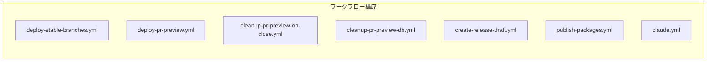
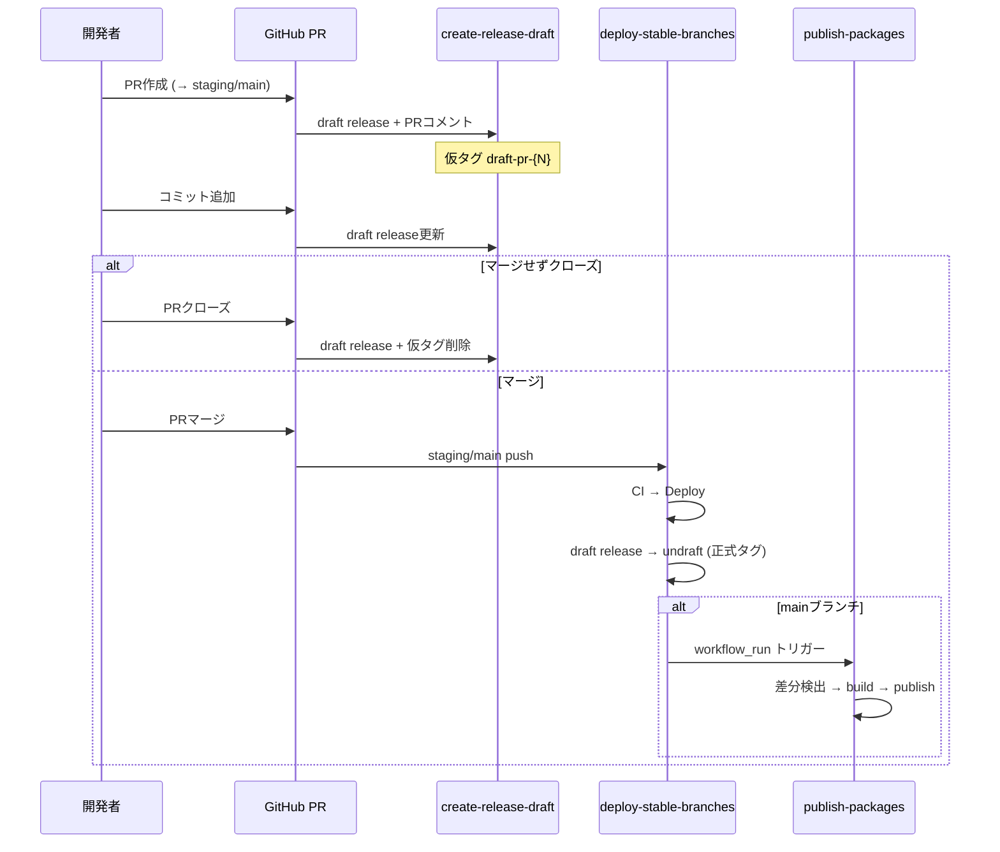

# CI/CD リリースフロー再設計

## Context

PR #132 がマージされたがNPMパッケージがリリースされなかった問題を契機に、リリースフローを再設計する。

**現状の問題:**
1. NPMパッケージ（dev-cli, create-app）がchangeset ignoreリストに入っており、手動タグpush方式でしかリリースできない
2. `changeset-status.yml` にバグがある（`.changeset/` が空のとき `grep -cv` が失敗）
3. デプロイとパッケージリリースが `deploy-stable-branches.yml` に混在（496行）
4. リリースの事前プレビューがない（PRの段階で何がリリースされるか見えない）

**設計方針:**
- パッケージリリースはデプロイフローと分離（別ワークフロー）
- PR作成時にdraft releaseを生成し、マージ時にundraft
- NPMパッケージのchangeset ignore設定は維持（独立バージョニング）

## 変更内容

### 新しいフロー全体像

```
PR作成 (→ staging/main)
  ├─ einja-create-pr Skill: changeset自動生成（既存）
  └─ create-release-draft.yml: draft release生成 + PRコメント
       ├─ アプリ変更 → changeset内容からリリースノートdraft
       └─ パッケージ変更 → 変更パッケージ一覧をdraft releaseに記載

PR更新 (push)
  └─ create-release-draft.yml: draft release更新（リリースノート再生成）
       ※ synchronize時: 仮タグを削除→再作成で最新コミットに追従

PR close (マージなし)
  └─ create-release-draft.yml: draft release削除 + 仮タグ削除

PR close (マージあり) → 何もしない（deploy-stable-branches側でundraft）

staging マージ
  └─ deploy-stable-branches.yml
       ├─ CI → migrate → deploy（既存）
       └─ release-staging: マージコミットからPR番号を特定 → draft-pr-{N} をundraft
            （always() + ci依存のみに変更、deploy-staging非依存化）

main マージ
  └─ deploy-stable-branches.yml
       ├─ CI → migrate → deploy（既存）
       └─ release-production: マージコミットからPR番号を特定 → changeset version → undraft
  └─ publish-packages.yml (workflow_run, ref=head_sha)
       └─ concurrency制御 → 差分検出 → build → test → 既存バージョンチェック → version bump → publish → tag push
       └─ bumpコミット: "chore: release cli-v*" で再トリガー防止
```

### ワークフロー構成の変更

| ファイル | 変更 | 役割 |
|---------|------|------|
| `changeset-status.yml` | **削除** | `create-release-draft.yml` に統合 |
| `create-release-draft.yml` | **新規** | PR時のdraft release生成 + コメント + close時のdraft削除 |
| `deploy-stable-branches.yml` | **修正** | release-staging/production: draft releaseをundraftする方式に変更 |
| `publish-packages.yml` | **新規** | NPMパッケージの差分検出 + build/test + publish |
| `release-cli.yml` | **削除** | `publish-packages.yml` に統合 |
| `release-create-app.yml` | **削除** | `publish-packages.yml` に統合 |
| `deploy-pr-preview.yml` | 変更なし | |
| `cleanup-*.yml` (2つ) | 変更なし | |

**結果: 8ファイル → 7ファイル（2削除 + 2新規 + 1修正 + 1削除統合）**

### Codexレビュー指摘の対処（P0）

| # | 問題 | 対処方針 |
|---|------|---------|
| 1 | **複数PR同時open時のdraft誤undraft** | undraft時に `listPullRequestsAssociatedWithCommit` でマージコミットのPR番号を特定し `draft-pr-{N}` を厳密指定 |
| 2 | **`workflow_run` のcheckout SHA ズレ** | `ref: github.event.workflow_run.head_sha` を必須化 |
| 3 | **version bump後のpushでdeploy再トリガー** | コミットメッセージ `chore: release cli-v*` / `chore: release create-app-v*` で除外フィルタに含める |
| 4 | **release-staging がdeploy-staging skip時に未実行** | `needs: [ci]` + `if: always() && github.ref_name == 'staging'` に変更（deploy-staging非依存） |
| 5 | **同一バージョン二重publish** | publish前に `npm view @einja-inc/{pkg}@{version}` で既存チェック、存在時スキップ |
| 6 | **listReleases 30件制限** | `getReleaseByTag('draft-pr-{N}')` で直接取得に変更 |
| 7 | **undraft時の操作順序** | 新タグ作成 → release更新（成功確認） → 旧仮タグ削除 の順序に |
| 8 | **synchronize時の仮タグ追従** | synchronize時は仮タグを削除→再作成して最新コミットに追従 |
| 9 | **publish-packages.yml の concurrency** | `concurrency: { group: publish-packages-main, cancel-in-progress: false }` 追加 |
| 10 | **2パッケージ並列version bumpの競合** | publish-cli → publish-create-app の順序実行（needs依存）に変更 |

### 1. `create-release-draft.yml`（新規）

`changeset-status.yml` を置き換え。PRライフサイクルに応じてdraft releaseを管理。

#### PRライフサイクルと動作

| イベント | 条件 | 動作 |
|---------|------|------|
| PR opened | staging/mainターゲット | draft release作成 + PRコメント |
| PR synchronize | 同上 | 仮タグ削除→再作成 + draft release更新 |
| PR closed **マージなし** | `merged == false` | **draft release削除 + 仮タグ削除** |
| PR closed **マージあり** | `merged == true` | **何もしない**（`deploy-stable-branches.yml` 側でundraft） |

#### draft releaseの識別方法

- 仮タグ `draft-pr-{PR番号}` で一意に識別
- `getReleaseByTag('draft-pr-{N}')` で直接取得（listReleases 30件制限を回避）

#### 実装のポイント

```yaml
name: Create Release Draft

on:
  pull_request:
    branches: [main, staging]
    types: [opened, synchronize, reopened, closed]

jobs:
  create-draft:
    if: github.event.action != 'closed'
    runs-on: ubuntu-latest
    permissions:
      contents: write
      pull-requests: write
    steps:
      - uses: actions/checkout@v4
        with:
          fetch-depth: 0

      # changeset検出（バグ修正済み: find使用）
      # パッケージ変更検出（base SHA比較）
      # リリースノート生成
      # synchronize時: 仮タグ削除→再作成（最新コミットに追従）
      # draft release作成/更新（getReleaseByTagで既存チェック）
      # PRコメント（<!-- release-draft-status --> マーカー）

  cleanup:
    if: github.event.action == 'closed' && !github.event.pull_request.merged
    runs-on: ubuntu-latest
    permissions:
      contents: write
    steps:
      # draft release削除 + 仮タグ削除
```

### 2. `deploy-stable-branches.yml`（修正）

#### release-staging の依存変更

```yaml
# 修正前: deploy-stagingに依存（アプリ変更なしでスキップされるとリリースもスキップ）
release-staging:
  needs: deploy-staging

# 修正後: CIジョブにのみ依存（デプロイの有無に関わらずリリース実行）
release-staging:
  needs: [ci]
  if: always() && github.ref_name == 'staging' && needs.ci.result == 'success'
```

#### changeset検出のバグ修正（3箇所）

```bash
# 修正前
COUNT=$(ls .changeset/*.md 2>/dev/null | grep -cv README.md || echo 0)

# 修正後
COUNT=$(find .changeset -maxdepth 1 -name '*.md' ! -name 'README.md' 2>/dev/null | wc -l | tr -d ' ')
```

#### release-staging の変更

```yaml
# 変更1: deploy-staging非依存化
release-staging:
  needs: [ci]  # deploy-stagingではなくciに依存
  if: always() && github.ref_name == 'staging' && needs.ci.result == 'success'

# 変更2: マージコミットからPR番号を特定してundraft
- name: Resolve merged PR number
  id: pr
  uses: actions/github-script@v7
  with:
    script: |
      const prs = await github.rest.repos.listPullRequestsAssociatedWithCommit({
        owner: context.repo.owner, repo: context.repo.repo,
        commit_sha: context.sha
      });
      const merged = prs.data.find(p => p.merged_at && p.base.ref === 'staging');
      return merged?.number || '';

# 変更3: 安全な順序でundraft
- name: Publish PreRelease
  # 1. 正式タグ作成・push
  # 2. getReleaseByTag('draft-pr-{N}') でdraft取得
  # 3. updateRelease（tag_name変更 + undraft + prerelease）
  # 4. 成功後に仮タグ削除
  # 5. draftなければfallback: gh release create
```

#### release-production の変更

```yaml
# 同様にPR番号特定 → changeset version → undraft
# botコミット除外フィルタに追加:
if: "!contains(github.event.head_commit.message, 'chore: release v') && !contains(github.event.head_commit.message, 'chore: release cli-v') && !contains(github.event.head_commit.message, 'chore: release create-app-v')"
```

### 3. `publish-packages.yml`（新規）

```yaml
name: Publish NPM Packages

on:
  workflow_run:
    workflows: ["Deploy Stable Branches"]
    types: [completed]
    branches: [main]
  workflow_dispatch:
    inputs:
      package:
        type: choice
        options: [dev-cli, create-app, both]  # "auto"削除、明示的に選択
        default: both
      version_type:
        type: choice
        options: [patch, minor, major]
        default: patch
      dry_run:
        type: boolean
        default: false

concurrency:
  group: publish-packages-main
  cancel-in-progress: false

jobs:
  detect-changes:
    if: >
      github.event_name == 'workflow_dispatch' ||
      github.event.workflow_run.conclusion == 'success'
    runs-on: ubuntu-latest
    outputs:
      cli_changed: ${{ steps.check.outputs.cli }}
      create_app_changed: ${{ steps.check.outputs.create_app }}
    steps:
      - uses: actions/checkout@v4
        with:
          fetch-depth: 0
          # workflow_run時は正しいSHAを指定
          ref: ${{ github.event.workflow_run.head_sha || github.sha }}

      - name: Detect changes since last release
        id: check
        run: |
          # workflow_dispatch: inputs.packageで制御
          # workflow_run: 最新タグからの差分で自動検出
          # タグソート: --sort=-version:refname（安定ソート）
          # フォールバック: タグなし時は変更ありとみなす

  publish-cli:
    needs: detect-changes
    if: needs.detect-changes.outputs.cli_changed == 'true'
    runs-on: ubuntu-latest
    permissions:
      contents: write
      packages: write
    steps:
      # release-cli.yml のステップをそのまま流用
      # + npm view で既存バージョンチェック（冪等性）
      # + 自動 version bump (patch or inputs.version_type)
      # + コミット "chore: release cli-v{version}"
      # + tag push

  publish-create-app:
    needs: [detect-changes, publish-cli]  # 順序実行（git push競合防止）
    if: always() && needs.detect-changes.outputs.create_app_changed == 'true' && needs.publish-cli.result != 'failure'
    runs-on: ubuntu-latest
    permissions:
      contents: write
      packages: write
    steps:
      # git pull（publish-cliのコミットを取り込み）
      # release-create-app.yml のステップをそのまま流用
      # + npm view で既存バージョンチェック
      # + 自動 version bump
      # + コミット "chore: release create-app-v{version}"
      # + tag push
```

### 4. ドキュメント更新

#### 4.1 `docs/einja/steering/infrastructure/deployment.md`

**§3 ワークフロー一覧の更新:**



ワークフロー一覧テーブル:

| ワークフロー | ファイル | トリガー | 用途 |
|------------|---------|---------|------|
| **Deploy Stable** | `deploy-stable-branches.yml` | push to main/develop/staging | CI → デプロイ → Release/PreRelease公開 |
| **PR Preview** | `deploy-pr-preview.yml` | PR opened/sync/closed | CI → Neon → プレビューデプロイ |
| **Release Draft** | `create-release-draft.yml` | PR to main/staging | Draft Release作成 → PRコメント → close時クリーンアップ |
| **Publish Packages** | `publish-packages.yml` | workflow_run (Deploy Stable成功) / 手動 | NPMパッケージ差分検出 → build → publish |
| **PR Close Cleanup** | `cleanup-pr-preview-on-close.yml` | PR closed | Neonブランチ削除 |
| **Cleanup DB** | `cleanup-pr-preview-db.yml` | 毎日00:00 UTC / 手動 | 孤立Neonブランチ削除 |
| **Claude** | `claude.yml` | @claude メンション | Claude Code実行 |

**§8 リリース管理の全面書き換え:**

新しいフロー図（mermaid）:



NPMリリースとの棲み分けテーブル更新:

| タグパターン | 用途 | 生成元 |
|-------------|------|--------|
| `v1.2.0` | アプリ Stable Release | deploy-stable-branches.yml |
| `v1.2.0-rc.42` | アプリ PreRelease | deploy-stable-branches.yml |
| `draft-pr-{N}` | PR Draft Release（仮タグ） | create-release-draft.yml |
| `cli-v0.1.50` | @einja-inc/dev-cli | **publish-packages.yml（自動）** |
| `create-app-v0.3.5` | @einja-inc/create-app | **publish-packages.yml（自動）** |

#### 4.2 `packages/cli/RELEASING.md` 更新

- タグ手動push方式 → `publish-packages.yml` の `workflow_dispatch` に変更
- `npm version --no-git-tag-version` の記述を `publish-packages.yml` 内の自動version bumpに置き換え
- 手動リリースコマンド: `gh workflow run publish-packages.yml -f package=dev-cli -f version_type=patch`
- dry-run: `gh workflow run publish-packages.yml -f package=dev-cli -f dry_run=true`

#### 4.3 `packages/create-app/RELEASING.md` 更新

- 同上

#### 4.4 `.claude/skills/einja-infra-maintenance/SKILL.md` 更新

L679-680のワークフロー一覧テーブル:
- `release-cli.yml` → `publish-packages.yml`（`workflow_run` + `workflow_dispatch`）
- `release-create-app.yml` → 削除（`publish-packages.yml` に統合）

#### 4.5 `packages/create-app/.templateignore` 更新

L5-6:
- `.github/workflows/release-create-app.yml` → `.github/workflows/publish-packages.yml`
- `.github/workflows/release-cli.yml` → 削除（上で統合済み）

#### 4.6 `.claude/skills/npm-release/SKILL.md` 更新

- Step 6（バージョン更新・コミット・プッシュ）→ `gh workflow run publish-packages.yml` に変更
- Step 7（GitHub Actions監視）のワークフロー名を `publish-packages.yml` に変更
- パッケージ定義テーブルの `workflow` 列を `publish-packages.yml` に統一

### 5. 削除ファイル

- `.github/workflows/changeset-status.yml` → `create-release-draft.yml` に置き換え
- `.github/workflows/release-cli.yml` → `publish-packages.yml` に統合
- `.github/workflows/release-create-app.yml` → `publish-packages.yml` に統合

## 使用予定Skill・サブエージェント

| 作業 | 担当 |
|------|------|
| ワークフロー実装（create-release-draft.yml） | `general-purpose` サブエージェント |
| ワークフロー実装（publish-packages.yml） | `general-purpose` サブエージェント（並列） |
| deploy-stable-branches.yml 修正 | `general-purpose` サブエージェント（並列） |
| ドキュメント更新（deployment.md §3, §8） | `general-purpose` サブエージェント |
| RELEASING.md 更新（2ファイル） | 直接編集 |
| npm-release Skill更新 | 直接編集 |
| コミット・プッシュ | `einja-task-commit` |

## 検証方法

1. **changeset検出バグ修正**: `.changeset/` が空の状態でシェルスクリプトを手動テスト
2. **publish-packages.yml**: `workflow_dispatch` の `dry_run=true` でビルド・テストまでの動作確認
3. **create-release-draft.yml**: テストPR作成 → draft release生成確認 → close → draft削除確認
4. **deploy-stable-branches.yml**: undraftロジック（PR番号特定 → getReleaseByTag → updateRelease）の動作確認
5. **E2E**: 実際にPR → staging マージ → main マージのフルフロー（初回はdry_runで）
6. **ドキュメント確認**: deployment.md のmermaid図がGitHub上で正しくレンダリングされるか確認
