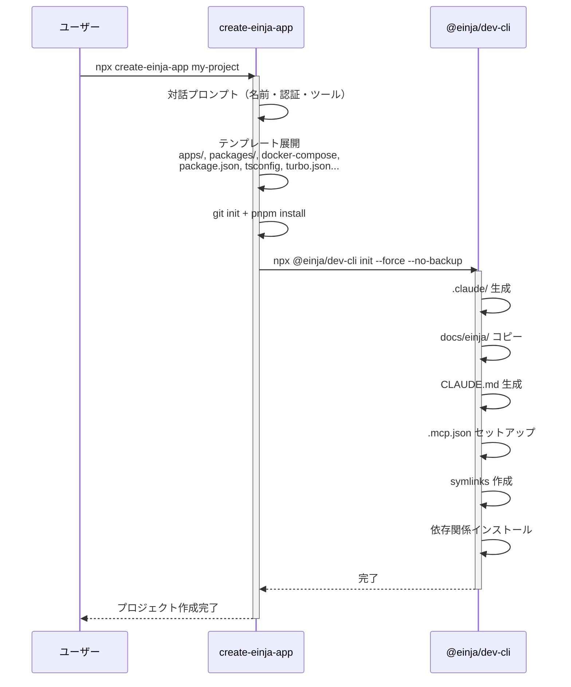
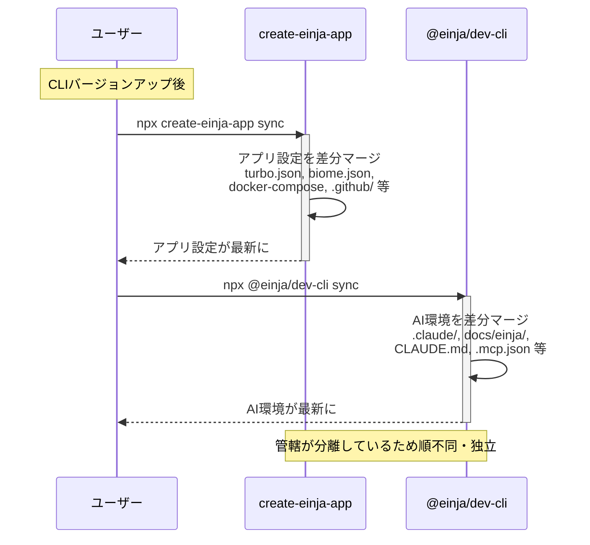
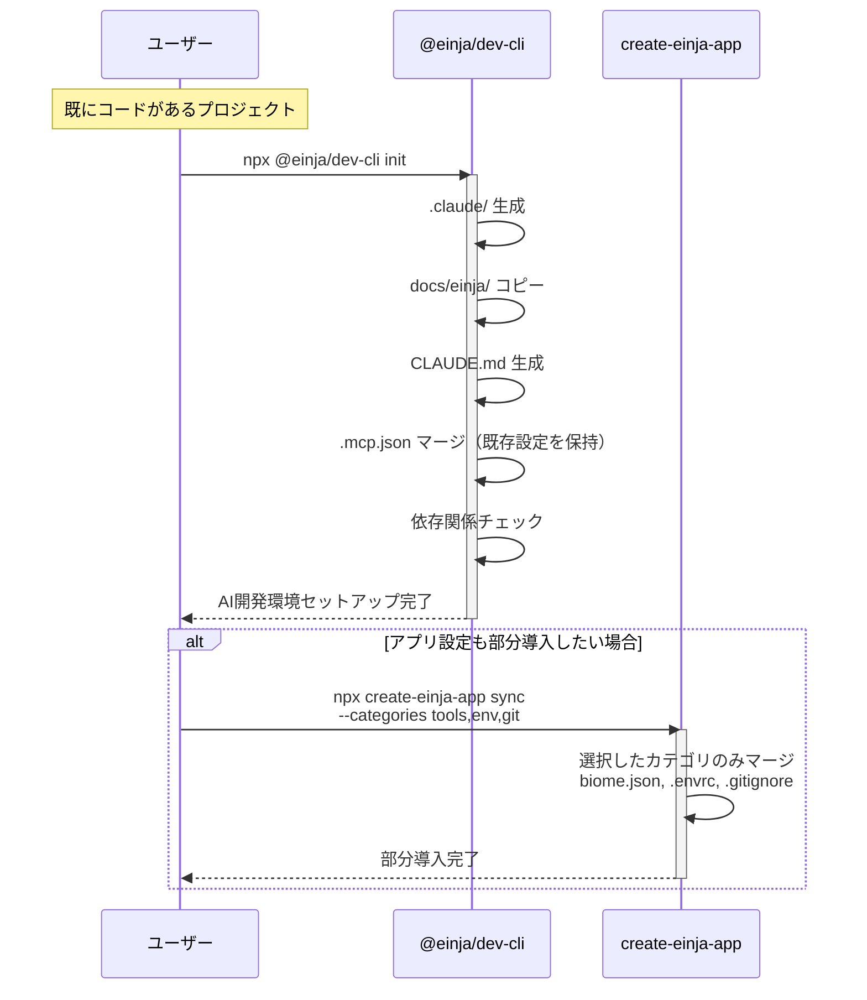

# CLI関係性ドキュメント追記 + init/sync ギャップ修正

## Context

`create-einja-app` と `@einja/dev-cli` の関係性・利用シーンがわかりにくい。
`packages/cli/README.md` に既に比較テーブル（L20-31）があるので、ここにmermaidシーケンス図を追記して利用シーンを可視化する。

併せて、`einja init` のファイルデプロイギャップも修正する。現在 init は `.claude/`, `docs/einja/steering/`, `docs/einja/templates/`, `CLAUDE.md`, `.mcp.json`, symlinks のみをコピーしており、`scripts/`, `.envrc`, `.vscode/settings.json`, `docs/einja/instructions/`, `docs/einja/example/` がデプロイされない。

---

## Part 1: ドキュメント追記

### 追記先

`packages/cli/README.md` L31 `> **ポイント**: ...` の直後に新しいサブセクション `### 利用シーンのフロー` として追記。

### 追記内容

#### シナリオ1: ゼロから新規プロジェクト作成



#### シナリオ2: テンプレート更新の取り込み



#### シナリオ3: 既存プロジェクトに新規導入



#### シナリオ4: 導入済みプロジェクトの更新

シナリオ2と同じ。`dev-cli sync` と `create-einja-app sync` を必要に応じて実行。

---

## Part 2: init/sync ギャップ修正

### 2-1. `init.ts` に不足コピーステップを追加

現在の init ステップ（`packages/cli/src/commands/init.ts`）:

```
4: .claude 生成
5: docs/einja/templates/ コピー
6: docs/einja/steering/ コピー
7: CLAUDE.md 生成
8: symlinks 作成
9: .mcp.json セットアップ
10: 依存関係チェック
```

以下をステップ6の直後（ステップ7の前）に追加:

| 追加対象 | プリセット内パス | ターゲットパス | 追加位置 |
|---------|----------------|-------------|---------|
| instructions/ | `docs/einja/instructions/` | `docs/einja/instructions/` | 6A |
| example/ | `docs/einja/example/` | `docs/einja/example/` | 6B |
| scripts/ | `scripts/` | `scripts/` | 6C |
| .envrc | `.envrc` | `.envrc` | 6D |
| .vscode/ | `.vscode/settings.json` | `.vscode/settings.json` | 6E |

#### `merger.ts` に追加する関数

既存パターン（`copySteeringDocs`）に合わせた設計:

```typescript
// merger.ts に追加

/**
 * プリセットのサブディレクトリをコピー
 * @param targetPath - コピー先のパス
 * @param presetSubPath - プリセット内の相対パス（例: "scripts", "docs/einja/instructions"）
 */
export async function copyPresetDirectory(
  targetPath: string,
  presetSubPath: string
): Promise<void> {
  const presetPath = getPresetPath("default");
  const srcPath = path.join(presetPath, presetSubPath);

  if (!(await fs.pathExists(srcPath))) {
    return;
  }

  await fs.ensureDir(targetPath);
  await fs.copy(srcPath, targetPath);
}

/**
 * プリセットの単一ファイルをコピー
 * @param targetPath - コピー先のファイルパス
 * @param presetSubPath - プリセット内の相対パス（例: ".envrc"）
 */
export async function copyPresetFile(
  targetPath: string,
  presetSubPath: string
): Promise<void> {
  const presetPath = getPresetPath("default");
  const srcPath = path.join(presetPath, presetSubPath);

  if (!(await fs.pathExists(srcPath))) {
    return;
  }

  await fs.ensureDir(path.dirname(targetPath));
  await fs.copy(srcPath, targetPath);
}
```

`init.ts` 変更箇所:
- import に `copyPresetDirectory`, `copyPresetFile` を追加
- L26-28 に変数定義追加: `instructionsDir`, `exampleDir`, `scriptsDir`
- L125 の直後（ステップ6の後）に5つのコピーステップを追加
- L229-234（完了メッセージ）に新しいディレクトリを追記
- L45-58（ドライランメッセージ）にも追記

### 2-2. `file-filter.ts` と `category-validator.ts` に scripts カテゴリ追加

**file-filter.ts** L10-18:
```typescript
const CATEGORY_MAPPING: Record<string, string> = {
  commands: ".claude/commands/einja",
  agents: ".claude/agents/einja",
  skills: ".claude/skills",
  hooks: ".claude/hooks",
  docs: "docs/einja",
  scripts: "scripts",   // ← 追加
  env: ".",
  tools: ".vscode",
};
```

**category-validator.ts** L9:
```typescript
export const VALID_CATEGORIES = ["commands", "agents", "skills", "hooks", "docs", "scripts", "env", "tools"] as const;
```

**category-validator.ts** L19-27 `CATEGORY_DESCRIPTIONS` にも追加:
```typescript
scripts: "ユーティリティスクリプト (scripts/)",
```

**安全性**: orphan cleaner はメタデータに記録された（=過去にsyncで配布された）ファイルのみを対象とする。プロジェクト固有スクリプトは `_` プレフィックスで保護でき、かつメタデータに存在しないので orphan cleaner の影響を受けない。

### 2-3. `scripts/worktree/dev.ts` の packages/config 依存除去

`scripts/worktree/dev.ts` L14-15 が `../../packages/config/src/` をimportしている。他プロジェクトには packages/config が存在しないため動作しない。

**方針**: `scripts/lib/worktree-config.ts` を新規作成し、型定義+ローダーをインライン化（zod非依存）。

`loadWorktreeConfig()` の実体はシンプル:
1. `worktree.config.json` を読む
2. あれば JSON parse して返す
3. なければデフォルト値（web:3000, postgres:25432）を返す

zodバリデーションは開発ツールとしてはnice-to-have。ロジックが40行程度で、設定変更頻度も極めて低いため二重管理リスクは低い。

**新規ファイル**: `scripts/lib/worktree-config.ts`

```typescript
import fs from "node:fs";
import path from "node:path";

export interface AppConfig {
  id: string;
  portRangeStart: number;
  rangeSize: number;
}

export interface PostgresConfig {
  port: number;
  containerName: string;
}

export interface WorktreeConfig {
  schemaVersion: number;
  postgres: PostgresConfig;
  apps: AppConfig[];
}

const defaultWorktreeConfig: WorktreeConfig = {
  schemaVersion: 1,
  postgres: { port: 25432, containerName: "einja-management-postgres" },
  apps: [{ id: "web", portRangeStart: 3000, rangeSize: 1000 }],
};

function findProjectRoot(startDir: string = process.cwd()): string | null {
  let currentDir = startDir;
  while (currentDir !== path.dirname(currentDir)) {
    if (fs.existsSync(path.join(currentDir, "package.json"))) {
      return currentDir;
    }
    currentDir = path.dirname(currentDir);
  }
  return null;
}

export function loadWorktreeConfig(projectRoot?: string): WorktreeConfig {
  const root = projectRoot ?? findProjectRoot();
  if (!root) return defaultWorktreeConfig;

  const configPath = path.join(root, "worktree.config.json");
  if (!fs.existsSync(configPath)) return defaultWorktreeConfig;

  try {
    const raw = JSON.parse(fs.readFileSync(configPath, "utf-8"));
    return {
      schemaVersion: raw.schemaVersion ?? 1,
      postgres: {
        port: typeof raw.postgres?.port === "number" ? raw.postgres.port : 25432,
        containerName: typeof raw.postgres?.containerName === "string"
          ? raw.postgres.containerName : "einja-management-postgres",
      },
      apps: Array.isArray(raw.apps)
        ? raw.apps.filter((a: unknown) =>
            typeof a === "object" && a !== null && "id" in a && "portRangeStart" in a
          )
        : defaultWorktreeConfig.apps,
    };
  } catch {
    console.warn("worktree.config.json の読み込みに失敗。デフォルト設定を使用します。");
    return defaultWorktreeConfig;
  }
}
```

**`scripts/worktree/dev.ts` の変更**: L14-15 のimportパスを変更

```typescript
// Before:
import type { AppConfig, WorktreeConfig } from "../../packages/config/src/worktree-config.js";
import { loadWorktreeConfig } from "../../packages/config/src/worktree-config-loader.js";

// After:
import type { AppConfig, WorktreeConfig } from "../lib/worktree-config.js";
import { loadWorktreeConfig } from "../lib/worktree-config.js";
```

### 2-4. README.md・sync ヘルプに scripts カテゴリ追記

**packages/cli/README.md** L93-99:
```
- `scripts` - ユーティリティスクリプト    ← 追加
```

**packages/cli/src/commands/sync.ts**: ヘルプテキスト（Commander定義側）に scripts を追記（該当箇所は `cli.ts` のコマンド定義）。

---

## 対象ファイル

| ファイル | 変更内容 |
|---------|---------|
| `packages/cli/README.md` | シーケンス図追記（L31の後） + scriptsカテゴリ追記（L99） |
| `packages/cli/src/commands/init.ts` | 不足コピーステップ5つ追加（L125の後） + 完了メッセージ更新 |
| `packages/cli/src/lib/merger.ts` | `copyPresetDirectory()` + `copyPresetFile()` 追加 |
| `packages/cli/src/lib/sync/file-filter.ts` | CATEGORY_MAPPING に `scripts: "scripts"` 追加 |
| `packages/cli/src/lib/sync/category-validator.ts` | VALID_CATEGORIES に `"scripts"` 追加 |
| `packages/cli/src/cli.ts` | sync コマンドのヘルプにscripts追記 |
| `scripts/worktree/dev.ts` | import パスを `../lib/worktree-config.js` に変更 |
| `scripts/lib/worktree-config.ts` | **新規** — 型定義+ローダー（zod非依存、約60行） |
| `docs/plans/cli-relationship.md` | **削除**（前回プランモード中に誤作成） |

---

## 検証

1. `pnpm --filter @einja/dev-cli build` 成功
2. `pnpm --filter @einja/dev-cli test` 通過
3. GitHub で README.md の mermaid 図がレンダリングされること（push後にPRで確認）
4. 空ディレクトリで `npx @einja/dev-cli init` → scripts/, .envrc, .vscode/, docs/einja/instructions/, docs/einja/example/ が生成されること
5. `einja sync --only scripts` が動作すること
6. `tsx scripts/worktree/dev.ts --status` が packages/config なしで動作すること
7. category-validator のテストが通ること（新カテゴリ追加反映）
