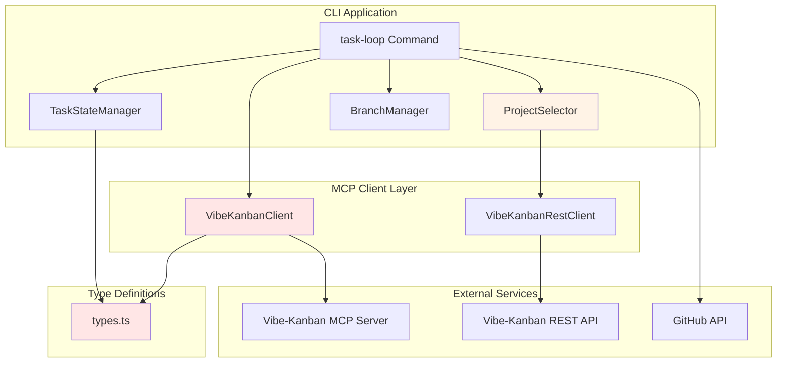
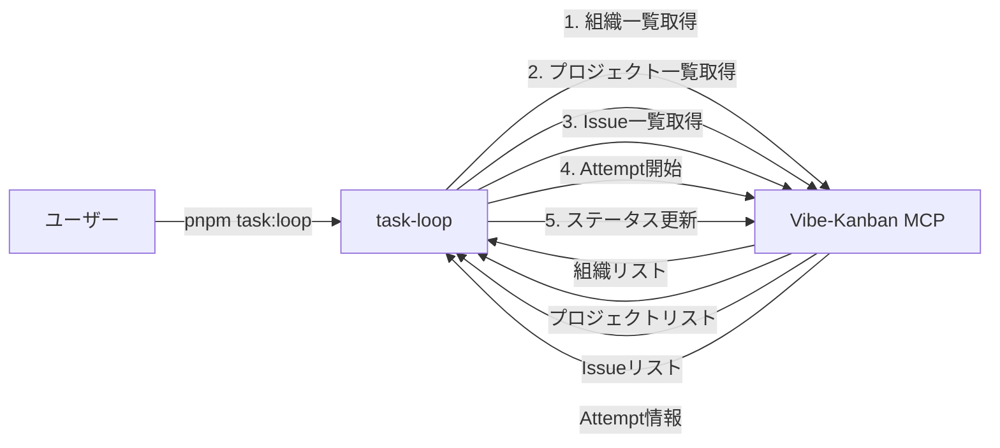
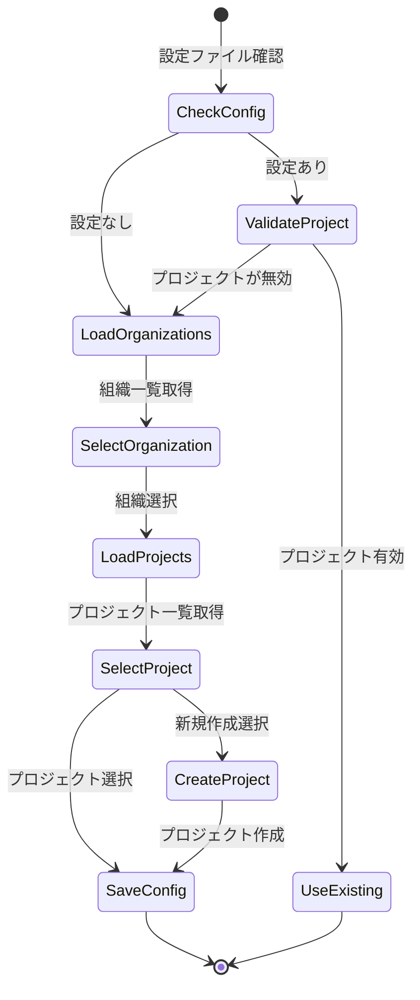

# vibe-kanban MCP 破壊的変更対応 設計書

## 概要

vibe-kanban MCP の破壊的変更（API名変更、組織概念の導入、パラメータ構造変更）に対応し、`pnpm task:loop` コマンドの正常動作を回復させます。本設計書では、最小限の変更で既存アーキテクチャを維持しつつ、型安全性を確保した実装を行います。

## 関連ドキュメント

- [要件定義書](./requirements.md) - ビジネス要件とユーザーストーリー
- [CLAUDE.md](../../../../CLAUDE.md) - プロジェクト全体の指針

## アーキテクチャ概要

### システム構成図



**凡例**:
- 🔴 赤枠: 修正対象のコンポーネント
- 🟠 橙枠: 部分的に修正が必要なコンポーネント

### データフロー図



### 修正対象コンポーネント

| コンポーネント | ファイルパス | 修正内容 |
|--------------|-------------|---------|
| 型定義 | `packages/cli/src/commands/task-loop/lib/types.ts` | `VibeKanbanOrganization` 型追加、ステータス型統一 |
| MCPクライアント | `packages/cli/src/commands/task-loop/lib/vibe-kanban-client.ts` | API名変更、パラメータ変更、組織対応 |
| プロジェクト選択 | `packages/cli/src/commands/task-loop/lib/project-selector.ts` | 組織選択フロー追加 |

## ディレクトリ構造

既存のディレクトリ構造を維持します。変更は既存ファイルの修正のみで、新規ファイルの追加はありません。

| パス | 新規/更新 | 説明 |
|-----|----------|------|
| `packages/cli/src/commands/task-loop/lib/types.ts` | 更新 | 型定義の追加・修正 |
| `packages/cli/src/commands/task-loop/lib/vibe-kanban-client.ts` | 更新 | MCPクライアントのAPI名変更 |
| `packages/cli/src/commands/task-loop/lib/project-selector.ts` | 更新 | 組織選択フロー追加 |
| `packages/cli/src/commands/task-loop/lib/task-state-manager.ts` | 更新 | ステータス値統一 |
| `packages/cli/src/commands/task-loop/index.ts` | 更新 | ステータス比較処理の修正 |

## 型定義設計

### 新規追加する型

| 型名 | 説明 | プロパティ |
|------|------|----------|
| `VibeKanbanOrganization` | 組織情報 | `id: string`, `name: string` |

### 修正する型

#### VibeKanbanTask の status プロパティ

| 項目 | 変更前の値 | 変更後の値 |
|------|-----------|-----------|
| 型定義 | `"todo" \| "inprogress" \| "in-progress" \| "done" \| "cancelled"` | `"todo" \| "in-progress" \| "done" \| "cancelled"` |
| 変更理由 | - | `"inprogress"` を削除し、`"in-progress"` に統一 |

#### TaskStatus 型

| 項目 | 内容 |
|------|------|
| 型定義 | `"pending" \| "completed" \| "in-progress"` |
| 変更 | なし（既に統一されている） |

### 型定義一覧

| 型名 | 種別 | 説明 |
|------|------|------|
| `VibeKanbanOrganization` | interface | 組織情報（新規） |
| `VibeKanbanProject` | interface | プロジェクト情報 |
| `VibeKanbanTask` | interface | Issue情報（旧: タスク） |
| `VibeKanbanAttempt` | interface | Attempt情報 |
| `VibeKanbanRepo` | interface | リポジトリ情報 |
| `TaskStatus` | type | タスクステータス（内部管理用） |
| `TaskGroup` | interface | タスクグループ情報 |
| `Phase` | interface | Phase情報 |
| `ParsedIssue` | interface | Issue解析結果 |

## MCPクライアント設計

### API名変更マッピング

| 旧メソッド名 | 新メソッド名 | 内部で呼び出すMCP Tool | パラメータ変更 |
|------------|------------|---------------------|--------------|
| `listTasks` | `listTasks` | `list_issues` | なし（後方互換性維持） |
| `getTask` | `getTask` | `get_issue` | `task_id` → `issue_id` |
| `createTask` | `createTask` | `create_issue` | なし |
| `updateTask` | `updateTask` | `update_issue` | `task_id` → `issue_id` |
| - | `listOrganizations` | `list_organizations` | 新規追加 |
| `listProjects` | `listProjects` | `list_projects` | `organization_id` 追加（必須） |
| `listRepos` | `listRepos` | `list_repos` | `project_id` 削除 |
| `startTaskAttempt` | `startTaskAttempt` | `start_workspace_session` | パラメータ構造変更 |

**後方互換性の方針**:
- メソッド名は既存のまま維持（`listTasks` → 内部で `list_issues` を呼び出す）
- これにより既存の呼び出し元コードの変更を最小化

### 新規メソッド: listOrganizations

| 項目 | 内容 |
|------|------|
| メソッド名 | `listOrganizations` |
| 引数 | なし |
| 戻り値 | `Promise<VibeKanbanOrganization[]>` |
| 呼び出すMCP Tool | `list_organizations` |
| エラーハンドリング | 接続エラー時は空配列を返す |

### 修正メソッド: listProjects

| 項目 | 変更前 | 変更後 |
|------|--------|--------|
| 引数 | なし | `organizationId: string` |
| MCP Toolパラメータ | `{}` | `{ organization_id: organizationId }` |

### 修正メソッド: listRepos

| 項目 | 変更前 | 変更後 |
|------|--------|--------|
| 引数 | `projectId: string` | `projectId: string`（変更なし） |
| MCP Toolパラメータ | `{ project_id: projectId }` | `{}`（パラメータ削除） |

**注意**: 引数は後方互換性のため残すが、MCP Toolへの渡し方のみ変更

### 修正メソッド: startTaskAttempt

#### パラメータ変更

| パラメータ名 | 変更前 | 変更後 | 必須/任意 |
|------------|--------|--------|----------|
| `title` | なし | あり | 必須 |
| `executor` | あり | あり | 必須 |
| `repos` | あり | あり | 必須 |
| `task_id` | あり（必須） | `issue_id`（任意） | 任意 |

#### title パラメータの生成ロジック

title は以下の優先順位で生成:

1. Issue情報が存在する場合: Issue のタイトルを使用
2. タスクグループIDが存在する場合: `[IssueXX Y.Z] タスク名` 形式を使用
3. 上記が取得できない場合: `"Task Attempt"` をデフォルト値として使用

### updateTask メソッドのステータス値対応

| 項目 | 説明 |
|------|------|
| 引数の型 | `status: "todo" \| "inprogress" \| "done"` |
| 内部変換 | `"inprogress"` → `"in-progress"` に自動変換 |
| 変換ロジック | 引数で `"inprogress"` を受け取った場合、`"in-progress"` に変換してMCPに渡す |
| MCP Toolへの渡し方 | 変換後の値を渡す |

## プロジェクト選択フロー設計

### 組織選択フローの追加



### selectProject メソッドの修正

| 項目 | 変更内容 |
|------|---------|
| 処理フロー | 1. 組織一覧取得 → 2. 組織選択 → 3. プロジェクト一覧取得 → 4. プロジェクト選択 |
| 新規処理 | `selectOrganization` 関数の追加 |
| UI変更 | 組織選択プロンプトの追加 |
| エラーハンドリング | 組織一覧取得失敗時のガイダンス表示 |

### 組織選択UI

**表示形式**:
```
📦 Vibe-Kanban 組織を選択してください:

  1. Organization A
  2. Organization B
  ─────────────────
  3. デフォルト組織を使用

番号を入力 (1-3):
```

**デフォルト組織**:
- 組織が1つしかない場合は自動選択
- 複数ある場合は最初の組織をデフォルトとして提示

## ステータス値統一設計

### 対象箇所

| ファイル | 行番号 | 変更内容 |
|---------|--------|---------|
| `index.ts` | 180, 225 | `"inprogress"` → `"in-progress"` |
| `vibe-kanban-client.ts` | 225, 409 | updateTask の引数型を統一 |

### 既存データの互換性対応

| 項目 | 内容 |
|------|------|
| 対応方針 | 旧ステータス値（`"inprogress"`）を持つタスクも正しく処理できるよう、比較処理を両方対応 |
| 実装方法 | ステータス比較時、`task.status === "inprogress"` または `task.status === "in-progress"` のいずれかで判定 |
| 注意 | 新規作成時は `"in-progress"` のみ使用 |

## エラーハンドリング設計

### エラー分類

| エラー種別 | 発生箇所 | 対処方法 |
|-----------|---------|---------|
| MCP接続エラー | `VibeKanbanClient.connect()` | ガイダンス表示して終了 |
| 組織一覧取得エラー | `listOrganizations()` | 空配列を返し、プロジェクト選択をスキップ |
| プロジェクト一覧取得エラー | `listProjects()` | ガイダンス表示して終了 |
| API呼び出しエラー | 各MCPメソッド | エラーメッセージを表示して例外を再スロー |
| 型変換エラー | `parseToolResult()` | デフォルト値を返す |

### エラーメッセージ

| エラー | メッセージ |
|--------|----------|
| MCP接続失敗 | `❌ Vibe-Kanban バックエンドに接続できません` + ガイダンス |
| 組織一覧取得失敗 | `⚠️ 組織一覧の取得に失敗しました（デフォルト組織を使用します）` |
| タスク作成失敗 | `タスクの作成に失敗しました` |
| Attempt開始失敗 | `タスク実行の開始に失敗しました` |

## テスト設計

### 単体テスト

#### 正常系テストケース

##### TC1.1: API名変更 - Issue一覧取得

- **Given**: Vibe-Kanban MCPが最新バージョンで接続済み
- **When**: `listTasks(projectId)` を呼び出す
- **Then**: 内部で `list_issues` ツールが呼び出され、Issue一覧が取得できる
- **検証方法**: モックMCPクライアントで `callTool` の引数を検証
- **検証レベル**: Unit

##### TC1.2: API名変更 - 単一Issue取得

- **Given**: Vibe-Kanban MCPが最新バージョンで接続済み
- **When**: `getTask(taskId)` を呼び出す
- **Then**: 内部で `get_issue` ツールが `issue_id` パラメータで呼び出される
- **検証方法**: モックMCPクライアントで引数を検証（`task_id` ではなく `issue_id`）
- **検証レベル**: Unit

##### TC2.1: 組織一覧取得

- **Given**: Vibe-Kanban MCPが接続済み
- **When**: `listOrganizations()` を呼び出す
- **Then**: `list_organizations` ツールが呼び出され、組織配列が返る
- **検証方法**: 戻り値の型が `VibeKanbanOrganization[]` であることを確認
- **検証レベル**: Unit

##### TC2.2: 組織IDを使用したプロジェクト一覧取得

- **Given**: 有効な組織IDが存在
- **When**: `listProjects(organizationId)` を呼び出す
- **Then**: `list_projects` ツールが `organization_id` パラメータで呼び出される
- **検証方法**: モックMCPクライアントで引数を検証
- **検証レベル**: Unit

##### TC3.1: list_repos パラメータ削除

- **Given**: Vibe-Kanban MCPが最新バージョン
- **When**: `listRepos(projectId)` を呼び出す
- **Then**: `list_repos` ツールが空のargumentsで呼び出される
- **検証方法**: モックMCPクライアントで `arguments: {}` を検証
- **検証レベル**: Unit

##### TC3.2: start_workspace_session の新パラメータ

- **Given**: 有効なIssue ID、executor、reposが存在
- **When**: `startTaskAttempt(taskId, executor, repos)` を呼び出す
- **Then**: `start_workspace_session` に `title`, `executor`, `repos`, `issue_id` が渡される
- **検証方法**: モックMCPクライアントで全パラメータを検証
- **検証レベル**: Unit

##### TC4.1: ステータス型の統一 - 型定義

- **Given**: TypeScriptプロジェクト
- **When**: `VibeKanbanTask` 型の `status` プロパティを参照
- **Then**: `"todo" | "in-progress" | "done" | "cancelled"` のみが許可される
- **検証方法**: TypeScriptコンパイラでの型チェック
- **検証レベル**: Unit

#### 異常系テストケース

##### TC-ERR1: MCP接続失敗

- **Given**: Vibe-Kanban MCPサーバーが起動していない
- **When**: `connect()` を呼び出す
- **Then**: 接続エラーが発生し、例外がスローされる
- **検証方法**: 例外メッセージを確認
- **検証レベル**: Unit

##### TC-ERR2: 組織一覧取得失敗

- **Given**: MCPサーバーが `list_organizations` でエラーを返す
- **When**: `listOrganizations()` を呼び出す
- **Then**: 空配列 `[]` が返される
- **検証方法**: 戻り値を確認
- **検証レベル**: Unit

##### TC-ERR3: 無効な組織ID

- **Given**: 存在しない組織IDを指定
- **When**: `listProjects(invalidOrgId)` を呼び出す
- **Then**: MCPエラーが発生し、例外がスローされる
- **検証方法**: 例外メッセージを確認
- **検証レベル**: Unit

##### TC-ERR4: title パラメータ生成失敗

- **Given**: Issue情報もタスクグループIDも取得できない
- **When**: `startTaskAttempt()` を呼び出す
- **Then**: デフォルト値 `"Task Attempt"` が使用される
- **検証方法**: MCPに渡されるパラメータを確認
- **検証レベル**: Unit

### 統合テスト

#### TC-INT1: 完全な認証フロー（E2E）

- **Given**: Vibe-Kanban MCPサーバーが起動中
- **When**: `pnpm task:loop 123` を実行
- **Then**: 組織選択 → プロジェクト選択 → Issue一覧取得 → Attempt開始が正常に動作
- **検証方法**: コマンド実行ログを確認
- **検証レベル**: Integration

#### TC-INT2: 既存データの互換性

- **Given**: 旧ステータス値（`"inprogress"`）を持つタスクが存在
- **When**: タスク一覧を取得し、ステータス比較を実行
- **Then**: 正しく処理され、エラーが発生しない
- **検証方法**: ログに警告・エラーが出ないことを確認
- **検証レベル**: Integration

### テストカバレッジ目標

| 対象 | カバレッジ目標 |
|------|--------------|
| `vibe-kanban-client.ts` | 80%以上 |
| `types.ts` | 100%（型定義） |
| `project-selector.ts` | 70%以上 |
| 統合テスト | 主要フロー100% |

## 実装フェーズ（縦切り）

各Phaseは独立してデプロイ可能な単位で構成されています。各Phaseで型定義→実装→テストを完結させます。

### Phase 1: Story 1 - API名変更対応

**スコープ**: API名の変更（task → issue）を完全に実装

**作業内容**:
1. **型定義確認**: 既存の `VibeKanbanTask` 型は変更不要（内部実装のみ変更）
2. **MCPクライアント実装**:
   - `listTasks` → 内部で `list_issues` を呼び出す
   - `getTask` → 内部で `get_issue` を呼び出す（`task_id` → `issue_id`）
   - `createTask` → 内部で `create_issue` を呼び出す
   - `updateTask` → 内部で `update_issue` を呼び出す（`task_id` → `issue_id`）
3. **テスト実装**: TC1.1〜TC1.2の単体テスト

**完了条件**: 旧API名（`list_tasks`, `get_task` 等）を使用せず、新API名で全機能が動作すること

**対応AC**: AC1.1, AC1.2, AC1.3, AC1.4, AC1.5

---

### Phase 2: Story 2 - 組織対応

**スコープ**: 組織概念の導入を完全に実装

**作業内容**:
1. **型定義追加**: `VibeKanbanOrganization` 型を `types.ts` に追加
2. **MCPクライアント実装**:
   - `listOrganizations` メソッドを新規追加
   - `listProjects(organizationId)` に引数を追加
3. **プロジェクト選択フロー実装**:
   - `selectProject` に組織選択ステップを追加
   - 組織選択UIを実装
4. **テスト実装**: TC2.1〜TC2.2の単体テスト、統合テスト

**完了条件**: 組織を選択してプロジェクト一覧が取得でき、プロジェクト選択が正常に動作すること

**対応AC**: AC2.1, AC2.2, AC2.3, AC2.4

---

### Phase 3: Story 3 - パラメータ変更対応

**スコープ**: パラメータ構造の変更を完全に実装

**作業内容**:
1. **MCPクライアント実装**:
   - `listRepos` のMCP Toolパラメータを空にする（引数は後方互換性のため維持）
   - `startTaskAttempt` のパラメータ構造を変更
     - `title` パラメータを追加（必須）
     - `task_id` → `issue_id`（オプション）に変更
2. **title生成ロジック実装**: Issue情報またはタスクグループIDから自動生成
3. **テスト実装**: TC3.1〜TC3.2の単体テスト、TC-ERR4

**完了条件**: 新パラメータ構造でAttemptが正常に開始でき、後方互換性が維持されること

**対応AC**: AC3.1, AC3.2, AC3.3, AC3.4

---

### Phase 4: Story 4 - ステータス値統一

**スコープ**: ステータス値の統一を完全に実装

**作業内容**:
1. **型定義修正**: `VibeKanbanTask` の `status` 型から `"inprogress"` を削除
2. **ステータス比較処理修正**:
   - `index.ts` のステータス比較を `"in-progress"` に統一
   - `updateTask` の引数で `"inprogress"` を受け取った場合の変換ロジック追加
3. **既存データ互換性対応**: 旧ステータス値を持つタスクも正しく処理
4. **テスト実装**: TC4.1、TC-INT2（統合テスト）

**完了条件**: `"in-progress"` に統一され、既存データも正しく処理されること

**対応AC**: AC4.1, AC4.2, AC4.3, AC4.4

---

### 最終確認

**作業内容**:
1. 全Phaseの統合テスト（TC-INT1）
2. `pnpm task:loop` コマンドの動作確認
3. TypeScriptコンパイルエラーがないことを確認

**完了条件**: 全てのテストが成功し、`pnpm task:loop` が正常動作すること

## セキュリティ考慮事項

### 認証・認可

| 項目 | 対応内容 |
|------|---------|
| MCP接続 | StdioClientTransportによる安全な通信 |
| 組織選択 | ユーザー入力の検証（数値範囲チェック） |
| プロジェクトID | CUID形式の検証 |

### データ保護

| 項目 | 対応内容 |
|------|---------|
| 設定ファイル | `.vibe-kanban.json` はgitignoreに追加 |
| 環境変数 | RUST_LOGでログレベル制御 |
| エラーログ | 機密情報を含まないログ出力 |

## パフォーマンス最適化

### キャッシュ戦略

| 対象 | 最適化内容 |
|------|----------|
| Description取得 | `Map<string, string \| null>` でキャッシュ（既存実装を維持） |
| 組織一覧 | セッション内で1回のみ取得（キャッシュ化検討） |
| プロジェクト一覧 | 組織選択後に1回のみ取得 |

### API呼び出し最適化

| 最適化項目 | 内容 |
|-----------|------|
| バッチ取得 | Issue一覧は1回のAPI呼び出しで取得 |
| ポーリング間隔 | 15秒（既存実装を維持） |
| 並列処理 | 組織一覧とプロジェクト一覧は直列（依存関係あり） |

## マイグレーション戦略

### 既存設定ファイルとの互換性

| 項目 | 対応方法 |
|------|---------|
| `.vibe-kanban.json` | `project_id` のみ保存（組織情報は保存しない） |
| プロジェクト検証 | 起動時に組織一覧を取得してプロジェクトの有効性を確認 |
| 無効なプロジェクト | 再選択フローに遷移 |

### 段階的移行（縦切り）

各Phaseは独立してデプロイ可能で、1つのStoryを完全に実装します。

1. **Phase 1（Story 1）**: API名変更対応 - 内部実装のみ変更、外部インターフェース維持
2. **Phase 2（Story 2）**: 組織対応 - 新機能追加、組織選択フロー導入
3. **Phase 3（Story 3）**: パラメータ変更対応 - 後方互換性を維持しつつ新構造に対応
4. **Phase 4（Story 4）**: ステータス統一 - 既存データも正しく動作

## モニタリングと分析

### ログ出力

| ログ種別 | 内容 |
|---------|------|
| 接続ログ | MCP接続・切断のステータス |
| 組織選択ログ | 選択された組織ID |
| プロジェクト選択ログ | 選択されたプロジェクトID |
| API呼び出しログ | 各MCP Toolの呼び出し結果 |
| エラーログ | 例外発生時の詳細情報 |

### デバッグ情報

| 情報種別 | 出力タイミング |
|---------|--------------|
| タスク状態 | ポーリング毎 |
| Done検出 | Doneタスク増加時 |
| マッピング登録 | タスク作成時 |

## 実装上の注意点

### コード品質

- **後方互換性**: メソッド名は変更せず、内部実装のみ変更
- **型安全性**: すべてのMCP Tool呼び出しで型定義を厳格化
- **エラーハンドリング**: 例外を適切にキャッチし、ユーザーにわかりやすいメッセージを表示

### パフォーマンス

- **descriptionキャッシュ**: 既存の `Map<string, string | null>` 方式を維持
- **API呼び出し最小化**: 組織・プロジェクト一覧は初回のみ取得

### 保守性

- **コメント追加**: API名変更箇所には「旧API名 → 新API名」のコメントを追加
- **テストカバレッジ**: 全ての新規メソッドに単体テストを追加
- **ドキュメント更新**: README.mdにvibe-kanban MCPのバージョン要件を明記

## まとめ

本設計書では、vibe-kanban MCPの破壊的変更に対応するため、以下の方針で実装を行います：

1. **最小限の変更**: 既存アーキテクチャを維持し、修正対象を3ファイルに限定
2. **後方互換性**: メソッド名は変更せず、内部実装のみ変更
3. **型安全性**: TypeScriptの型システムを活用し、コンパイル時にエラーを検出
4. **段階的実装**: 5つのPhaseに分割し、各Phaseで動作確認を実施
5. **テスト駆動**: 全ての変更に対して単体テストと統合テストを実装

この設計により、`pnpm task:loop` コマンドの正常動作を回復させ、将来のAPI変更にも柔軟に対応できる基盤を構築します。
