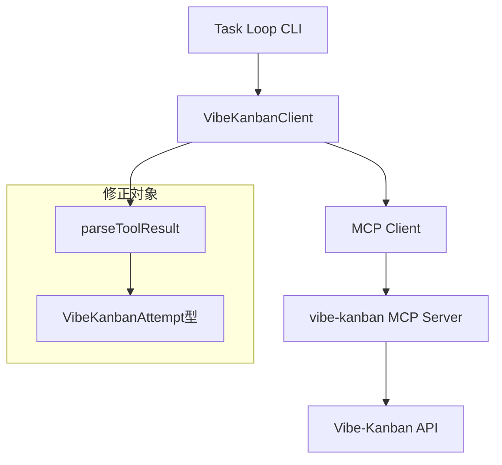

# 設計書: vibe-kanban MCP start_workspace_session レスポンス形式変更対応

## 概要

vibe-kanban MCPの `start_workspace_session` ツールのレスポンス形式が変更され、`VibeKanbanAttempt.id` が正しく取得できない問題を修正します。本設計書では、MCPレスポンス形式の調査、型定義の更新、パース処理の修正、テストの更新という4つのフェーズで、TDD（Red-Green-Refactor）サイクルを適用しながら実装を進めます。

## 関連ドキュメント

| ドキュメント | 説明 |
|------------|------|
| [requirements.md](./requirements.md) | 要件定義書（ユーザーストーリー、受け入れ基準） |
| [docs/einja/steering/development/testing-strategy.md](../../../../einja/steering/development/testing-strategy.md) | テスト戦略（TDD、Given-When-Then） |

## アーキテクチャ概要

### システム構成図



### データフロー図

```mermaid
flowchart LR
    TaskLoop[Task Loop] -->|startTaskAttempt呼び出し| VibeKanbanClient[VibeKanbanClient]
    VibeKanbanClient -->|callTool: start_workspace_session| MCPClient[MCP Client]
    MCPClient -->|MCPリクエスト| MCPServer[vibe-kanban MCP Server]
    MCPServer -->|新形式レスポンス| MCPClient
    MCPClient -->|result| parseToolResult[parseToolResult]
    parseToolResult -->|VibeKanbanAttempt \| null| VibeKanbanClient
    VibeKanbanClient -->|attempt.id| TaskLoop

    parseToolResult -.旧形式では失敗.-> Error[attempt: undefined]
```

### 処理フロー説明

1. **startTaskAttempt呼び出し**
   - Task Loopが `VibeKanbanClient.startTaskAttempt()` を呼び出す
   - title、executor、repos、issueIdを引数として渡す

2. **MCPツール呼び出し**
   - `client.callTool({ name: "start_workspace_session", arguments: {...} })` を実行
   - vibe-kanban MCP サーバーがリクエストを受け取る

3. **レスポンス受信**
   - MCPサーバーから新形式のJSONレスポンスが返る
   - `parseToolResult<VibeKanbanAttempt | null>()` でパース

4. **型変換**
   - パース結果を `VibeKanbanAttempt` 型に変換
   - `attempt.id` が正しく取得できることを確認

5. **Task Loopへ返却**
   - `attempt` オブジェクトを返す
   - `attempt.id` を使用してClaude Codeを起動

## ディレクトリ構造

| 層 | パス | 新規/更新 |
|----|------|----------|
| クライアント | `packages/cli/src/commands/task-loop/lib/vibe-kanban-client.ts` | 更新 |
| 型定義 | `packages/cli/src/commands/task-loop/lib/types.ts` | 更新 |
| テスト | `packages/cli/src/commands/task-loop/lib/vibe-kanban-client.test.ts` | 更新 |

## レスポンス形式調査設計

### 調査方針

MCPレスポンス形式を特定するため、以下の手順でデバッグログを追加します：

| ステップ | 内容 | 実施方法 |
|---------|------|---------|
| 1. デバッグログ追加 | `startTaskAttempt` メソッド内で `result` をコンソール出力 | `console.log('DEBUG: MCP result:', JSON.stringify(result, null, 2))` |
| 2. タスクループ実行 | `pnpm task:loop --issue 103` を実行 | ターミナルで実行 |
| 3. レスポンス解析 | 出力されたJSONを確認 | フィールド名、データ型、ネスト構造を特定 |
| 4. パターン識別 | 要件定義書の3パターンと照合 | フラット/ネスト/配列のいずれか判定 |

### 想定されるレスポンスパターン

#### パターン1: フラット構造の変更

```json
{
  "content": [
    {
      "type": "text",
      "text": "{\"attempt_id\":\"abc123\",\"issue_id\":\"issue-001\",\"executor\":\"CLAUDE_CODE\",\"base_branch\":\"main\"}"
    }
  ]
}
```

**対応方針**: フィールド名のマッピング変更
- `attempt_id` → `id`
- `issue_id` → `task_id`

#### パターン2: ネスト構造の導入

```json
{
  "content": [
    {
      "type": "text",
      "text": "{\"attempt\":{\"id\":\"abc123\",\"status\":\"in-progress\"},\"issue_id\":\"issue-001\",\"executor\":\"CLAUDE_CODE\"}"
    }
  ]
}
```

**対応方針**: パース処理でネストを解除
- `result.attempt.id` → `id`
- `result.issue_id` → `task_id`

#### パターン3: 配列形式

```json
{
  "content": [
    {
      "type": "text",
      "text": "{\"attempts\":[{\"id\":\"abc123\",\"issue_id\":\"issue-001\"}]}"
    }
  ]
}
```

**対応方針**: 最初の要素を取得
- `result.attempts[0]` を使用

### デバッグログ追加箇所

**vibe-kanban-client.ts: 289-304行**

```typescript
async startTaskAttempt(
  title: string,
  executor: "CLAUDE_CODE",
  repos: Array<{ repo_id: string; base_branch: string }>,
  issueId?: string
): Promise<VibeKanbanAttempt> {
  this.ensureConnected();

  const result = await this.client.callTool({
    name: "start_workspace_session",
    arguments: {
      title,
      executor,
      repos,
      ...(issueId && { issue_id: issueId }),
    },
  });

  // 📝 デバッグログを追加
  console.log('DEBUG: MCP result:', JSON.stringify(result, null, 2));

  const attempt = this.parseToolResult<VibeKanbanAttempt | null>(result, null);
  if (!attempt) {
    throw new Error("タスク実行の開始に失敗しました");
  }
  return attempt;
}
```

## 型定義設計

### 新旧両形式対応の型定義

レスポンス形式の調査結果に基づき、以下のいずれかの形式で型定義を更新します：

#### パターン1対応: フィールド名変更のみ

| フィールド | 旧形式 | 新形式 | 型 | 説明 |
|-----------|-------|-------|-----|------|
| ID | `id` | `attempt_id` | string | Attempt ID |
| タスクID | `task_id` | `issue_id` | string | Issue ID |
| 実行者 | `executor` | `executor` | string | 実行者（CLAUDE_CODE） |
| ベースブランチ | `base_branch` | `base_branch` | string | ベースブランチ名 |

**型定義例**:

```typescript
// types.ts:85-90

export interface VibeKanbanAttempt {
  attempt_id: string;      // 旧: id
  issue_id: string;        // 旧: task_id
  executor: string;
  base_branch: string;
}

// フォールバック処理用: 旧形式も許容
export interface VibeKanbanAttemptLegacy {
  id: string;
  task_id: string;
  executor: string;
  base_branch: string;
}
```

#### パターン2対応: ネスト構造

```typescript
export interface VibeKanbanAttempt {
  id: string;
  status?: string;
}

export interface VibeKanbanAttemptResponse {
  attempt: VibeKanbanAttempt;
  issue_id: string;
  executor: string;
  base_branch?: string;
}
```

#### パターン3対応: 配列形式

```typescript
export interface VibeKanbanAttemptItem {
  id: string;
  issue_id: string;
  executor: string;
  base_branch: string;
}

export interface VibeKanbanAttemptResponse {
  attempts: VibeKanbanAttemptItem[];
}
```

### JSDocコメント追加

```typescript
/**
 * Vibe-Kanban タスク実行試行
 *
 * @remarks
 * vibe-kanban MCP の start_workspace_session レスポンス形式
 *
 * @property {string} attempt_id - Attempt ID（旧: id）
 * @property {string} issue_id - Issue ID（旧: task_id）
 * @property {string} executor - 実行者（CLAUDE_CODE）
 * @property {string} base_branch - ベースブランチ名
 */
export interface VibeKanbanAttempt {
  attempt_id: string;
  issue_id: string;
  executor: string;
  base_branch: string;
}
```

## パース処理設計

### パース処理修正方針

`parseToolResult` メソッドは他のMCPツールでも使用されているため、`startTaskAttempt` メソッド内で新形式に対応したパース処理を追加します。

### 新形式パース処理（フォールバック付き）

**処理フロー**:
1. `parseToolResult` で基本的なJSONパース
2. パース結果の形式を判定
3. 新形式であれば、フィールド名をマッピング
4. 旧形式であれば、そのまま使用
5. どちらでもない場合は、エラーをスロー

**実装方針（パターン1想定）**:

```typescript
async startTaskAttempt(
  title: string,
  executor: "CLAUDE_CODE",
  repos: Array<{ repo_id: string; base_branch: string }>,
  issueId?: string
): Promise<VibeKanbanAttempt> {
  this.ensureConnected();

  const result = await this.client.callTool({
    name: "start_workspace_session",
    arguments: {
      title,
      executor,
      repos,
      ...(issueId && { issue_id: issueId }),
    },
  });

  const parsed = this.parseToolResult<unknown>(result, null);
  if (!parsed) {
    throw new Error("タスク実行の開始に失敗しました");
  }

  // 新形式対応: フィールド名マッピング
  const attempt = this.mapToAttempt(parsed);
  return attempt;
}

/**
 * MCPレスポンスをVibeKanbanAttempt型にマッピング
 * 新旧両形式に対応
 */
private mapToAttempt(parsed: unknown): VibeKanbanAttempt {
  // パターン判定とマッピング処理
  if (this.isNewFormat(parsed)) {
    return this.mapNewFormat(parsed);
  } else if (this.isLegacyFormat(parsed)) {
    return this.mapLegacyFormat(parsed);
  } else if (this.isNestedFormat(parsed)) {
    return this.mapNestedFormat(parsed);
  } else if (this.isArrayFormat(parsed)) {
    return this.mapArrayFormat(parsed);
  } else {
    throw new Error("未対応のレスポンス形式です");
  }
}

/**
 * 新形式判定（パターン1）
 */
private isNewFormat(parsed: unknown): parsed is { attempt_id: string; issue_id: string; executor: string; base_branch: string } {
  return (
    typeof parsed === "object" &&
    parsed !== null &&
    "attempt_id" in parsed &&
    "issue_id" in parsed
  );
}

/**
 * 新形式マッピング（パターン1）
 */
private mapNewFormat(parsed: { attempt_id: string; issue_id: string; executor: string; base_branch: string }): VibeKanbanAttempt {
  return {
    id: parsed.attempt_id,
    task_id: parsed.issue_id,
    executor: parsed.executor,
    base_branch: parsed.base_branch,
  };
}

/**
 * 旧形式判定
 */
private isLegacyFormat(parsed: unknown): parsed is { id: string; task_id: string; executor: string; base_branch: string } {
  return (
    typeof parsed === "object" &&
    parsed !== null &&
    "id" in parsed &&
    "task_id" in parsed
  );
}

/**
 * 旧形式マッピング（そのまま返す）
 */
private mapLegacyFormat(parsed: { id: string; task_id: string; executor: string; base_branch: string }): VibeKanbanAttempt {
  return parsed;
}

/**
 * ネスト形式判定（パターン2）
 */
private isNestedFormat(parsed: unknown): parsed is { attempt: { id: string }; issue_id: string; executor: string } {
  return (
    typeof parsed === "object" &&
    parsed !== null &&
    "attempt" in parsed &&
    typeof parsed.attempt === "object" &&
    parsed.attempt !== null &&
    "id" in parsed.attempt
  );
}

/**
 * ネスト形式マッピング（パターン2）
 */
private mapNestedFormat(parsed: { attempt: { id: string }; issue_id: string; executor: string; base_branch?: string }): VibeKanbanAttempt {
  return {
    id: parsed.attempt.id,
    task_id: parsed.issue_id,
    executor: parsed.executor,
    base_branch: parsed.base_branch || "",
  };
}

/**
 * 配列形式判定（パターン3）
 */
private isArrayFormat(parsed: unknown): parsed is { attempts: Array<{ id: string; issue_id: string }> } {
  return (
    typeof parsed === "object" &&
    parsed !== null &&
    "attempts" in parsed &&
    Array.isArray(parsed.attempts) &&
    parsed.attempts.length > 0
  );
}

/**
 * 配列形式マッピング（パターン3）
 */
private mapArrayFormat(parsed: { attempts: Array<{ id: string; issue_id: string; executor: string; base_branch: string }> }): VibeKanbanAttempt {
  const first = parsed.attempts[0];
  return {
    id: first.id,
    task_id: first.issue_id,
    executor: first.executor,
    base_branch: first.base_branch,
  };
}
```

### エラーハンドリング

| エラーケース | エラーメッセージ | 対処方法 |
|-------------|----------------|---------|
| parseToolResultがnull | "タスク実行の開始に失敗しました" | MCPサーバーのログを確認 |
| 未対応の形式 | "未対応のレスポンス形式です" | デバッグログでレスポンスを確認 |
| 配列が空 | "未対応のレスポンス形式です（配列が空）" | MCPサーバーの状態を確認 |

## テスト設計

### TDD Red-Green-Refactorフェーズ

#### Phase 1: Red - 失敗するテストを書く

**テストケース1: 新形式（パターン1）のパース**

```typescript
// vibe-kanban-client.test.ts

describe("startTaskAttempt - 新形式対応", () => {
  it("新形式（attempt_id, issue_id）のレスポンスを渡すと、VibeKanbanAttemptにマッピングされる", async () => {
    // Given: 新形式のレスポンス
    await client.connect();

    const mockResponse = {
      attempt_id: "attempt-123",
      issue_id: "issue-001",
      executor: "CLAUDE_CODE",
      base_branch: "main",
    };

    mockMCPClient.callTool.mockResolvedValueOnce({
      content: [
        {
          type: "text",
          text: JSON.stringify(mockResponse),
        },
      ],
    });

    // When: startTaskAttempt を呼び出す
    const result = await client.startTaskAttempt(
      "Test Task",
      "CLAUDE_CODE",
      [{ repo_id: "repo-1", base_branch: "main" }],
      "issue-001"
    );

    // Then: フィールド名がマッピングされる
    expect(result.id).toBe("attempt-123");
    expect(result.task_id).toBe("issue-001");
    expect(result.executor).toBe("CLAUDE_CODE");
    expect(result.base_branch).toBe("main");
  });
});
```

**テストケース2: 旧形式の後方互換性**

```typescript
it("旧形式（id, task_id）のレスポンスを渡すと、そのままVibeKanbanAttemptとして扱われる", async () => {
  // Given: 旧形式のレスポンス
  await client.connect();

  const mockResponse = {
    id: "attempt-456",
    task_id: "task-002",
    executor: "CLAUDE_CODE",
    base_branch: "develop",
  };

  mockMCPClient.callTool.mockResolvedValueOnce({
    content: [
      {
        type: "text",
        text: JSON.stringify(mockResponse),
      },
    ],
  });

  // When: startTaskAttempt を呼び出す
  const result = await client.startTaskAttempt(
    "Test Task",
    "CLAUDE_CODE",
    [{ repo_id: "repo-1", base_branch: "develop" }]
  );

  // Then: 旧形式がそのまま返る
  expect(result.id).toBe("attempt-456");
  expect(result.task_id).toBe("task-002");
});
```

**テストケース3: ネスト形式（パターン2）のパース**

```typescript
it("ネスト形式のレスポンスを渡すと、attempt.idが正しく取得される", async () => {
  // Given: ネスト形式のレスポンス
  await client.connect();

  const mockResponse = {
    attempt: {
      id: "attempt-789",
      status: "in-progress",
    },
    issue_id: "issue-003",
    executor: "CLAUDE_CODE",
  };

  mockMCPClient.callTool.mockResolvedValueOnce({
    content: [
      {
        type: "text",
        text: JSON.stringify(mockResponse),
      },
    ],
  });

  // When: startTaskAttempt を呼び出す
  const result = await client.startTaskAttempt(
    "Test Task",
    "CLAUDE_CODE",
    [{ repo_id: "repo-1", base_branch: "main" }],
    "issue-003"
  );

  // Then: ネストが解除される
  expect(result.id).toBe("attempt-789");
  expect(result.task_id).toBe("issue-003");
});
```

**テストケース4: 配列形式（パターン3）のパース**

```typescript
it("配列形式のレスポンスを渡すと、最初の要素が取得される", async () => {
  // Given: 配列形式のレスポンス
  await client.connect();

  const mockResponse = {
    attempts: [
      {
        id: "attempt-aaa",
        issue_id: "issue-004",
        executor: "CLAUDE_CODE",
        base_branch: "feature",
      },
    ],
  };

  mockMCPClient.callTool.mockResolvedValueOnce({
    content: [
      {
        type: "text",
        text: JSON.stringify(mockResponse),
      },
    ],
  });

  // When: startTaskAttempt を呼び出す
  const result = await client.startTaskAttempt(
    "Test Task",
    "CLAUDE_CODE",
    [{ repo_id: "repo-1", base_branch: "feature" }]
  );

  // Then: 配列の最初の要素が返る
  expect(result.id).toBe("attempt-aaa");
  expect(result.task_id).toBe("issue-004");
});
```

**テストケース5: 未対応の形式**

```typescript
describe("startTaskAttempt - 異常系", () => {
  it("未対応のレスポンス形式の場合、エラーがスローされる", async () => {
    // Given: 未対応の形式
    await client.connect();

    const mockResponse = {
      unknown_field: "value",
    };

    mockMCPClient.callTool.mockResolvedValueOnce({
      content: [
        {
          type: "text",
          text: JSON.stringify(mockResponse),
        },
      ],
    });

    // When: startTaskAttempt を呼び出す
    // Then: エラーがスローされる
    await expect(
      client.startTaskAttempt(
        "Test Task",
        "CLAUDE_CODE",
        [{ repo_id: "repo-1", base_branch: "main" }]
      )
    ).rejects.toThrow("未対応のレスポンス形式です");
  });
});
```

#### Phase 2: Green - テストを通す最小限の実装

1. **types.ts の型定義更新**
   - `VibeKanbanAttempt` インターフェースはそのまま維持（`id`, `task_id`）
   - 内部的にフィールド名マッピングで対応

2. **vibe-kanban-client.ts のパース処理修正**
   - `mapToAttempt` メソッドを追加
   - `isNewFormat`, `isLegacyFormat`, `isNestedFormat`, `isArrayFormat` の判定メソッドを追加
   - 各形式に対応した `mapXxxFormat` メソッドを実装

3. **テスト実行**
   - `pnpm test vibe-kanban-client.test.ts`
   - すべてのテストがパスすることを確認

#### Phase 3: Refactor - コードを改善

1. **重複コードの削減**
   - 判定メソッドの共通化
   - エラーメッセージの定数化

2. **エラーハンドリングの改善**
   - デバッグログに実際のレスポンス形式を含める
   - エラーメッセージにヒントを追加

3. **JSDocコメントの追加**
   - 各メソッドの役割を明確化
   - パラメータと戻り値の説明

4. **テストの追加**
   - エッジケース（空配列、null値）のテスト
   - エラーメッセージの検証

### テストカバレッジ目標

| 対象 | 目標カバレッジ |
|------|---------------|
| vibe-kanban-client.ts | 90%以上 |
| 新規追加メソッド | 100% |

### テスト実行コマンド

```bash
# ユニットテスト実行
pnpm test vibe-kanban-client.test.ts

# カバレッジ付きテスト
pnpm test:coverage vibe-kanban-client.test.ts

# ウォッチモード
pnpm test:watch vibe-kanban-client.test.ts
```

## セキュリティ考慮事項

### 入力検証

| 検証項目 | 検証内容 | エラー処理 |
|---------|---------|-----------|
| レスポンス形式 | `typeof parsed === "object"` | エラーをスロー |
| 必須フィールド | `"id" in parsed` または `"attempt_id" in parsed` | エラーをスロー |
| フィールドの型 | `typeof parsed.id === "string"` | エラーをスロー |

### ログ出力

- **本番環境**: デバッグログは出力しない（`NODE_ENV=production` で無効化）
- **開発環境**: レスポンス全体をログ出力（調査用）
- **機密情報**: トークンやAPIキーは含まれていないため、ログ出力可能

## パフォーマンス最適化

### パース処理の最適化

| 最適化項目 | 方針 | 期待効果 |
|-----------|------|---------|
| 判定順序 | 新形式 → 旧形式 → ネスト → 配列の順で判定 | 最も可能性の高い形式を先に判定 |
| 早期リターン | 形式が判定できたら即座に return | 不要な判定をスキップ |
| 型ガード | TypeScriptの型ガードを活用 | ランタイムでの型安全性 |

### 処理時間目標

| 処理 | 目標時間 |
|-----|---------|
| レスポンスパース | 10ms以内 |
| MCPツール呼び出し全体 | 500ms以内（ネットワークI/O含む） |

## 実装フェーズ

### Phase 1: レスポンス形式調査

**実施内容**:
1. デバッグログ追加
2. タスクループ実行
3. レスポンス解析
4. パターン識別

**完了条件**:
- 実際のレスポンス形式が特定される
- 要件定義書の3パターンのいずれかに該当することが確認される

### Phase 2: TDD - Red（失敗するテストを書く）

**実施内容**:
1. 新形式のテストケースを追加
2. 旧形式の後方互換性テストを追加
3. ネスト形式のテストを追加
4. 配列形式のテストを追加
5. 異常系テストを追加

**完了条件**:
- すべてのテストが失敗すること（Red）

### Phase 3: TDD - Green（テストを通す最小限の実装）

**実施内容**:
1. `mapToAttempt` メソッドを実装
2. 判定メソッド（`isNewFormat`等）を実装
3. マッピングメソッド（`mapNewFormat`等）を実装

**完了条件**:
- すべてのテストがパスすること（Green）

### Phase 4: TDD - Refactor（コードを改善）

**実施内容**:
1. 重複コードの削減
2. エラーハンドリングの改善
3. JSDocコメントの追加
4. エッジケースのテスト追加

**完了条件**:
- テストがすべてパスし続けること
- コードカバレッジ90%以上
- コードレビューで指摘がないこと

### Phase 5: 動作確認

**実施内容**:
1. `pnpm build` でビルドエラーがないことを確認
2. `pnpm task:loop --issue 103` を実行
3. `▶️ タスク開始: X.X (base: issue/103, attempt: {実際のID})` と表示されることを確認
4. Claude Codeが正常に起動することを確認

**完了条件**:
- タスクループが正常動作する
- `attempt: unknown` が表示されない
- Claude Codeが起動する

## エラーハンドリング

### エラー分類

| エラー分類 | HTTPステータス | 説明 |
|-----------|----------------|------|
| VALIDATION_ERROR | 400 | レスポンス形式が不正 |
| UNKNOWN_FORMAT | 500 | 未対応のレスポンス形式 |
| MCP_ERROR | 500 | MCPサーバーエラー |

### エラーメッセージ設計

```typescript
class ResponseFormatError extends Error {
  constructor(message: string, public readonly actualFormat: unknown) {
    super(message);
    this.name = "ResponseFormatError";
  }
}

// 使用例
throw new ResponseFormatError(
  "未対応のレスポンス形式です。実際のレスポンス形式を確認してください。",
  parsed
);
```

### エラーログ出力

```typescript
private logError(error: Error, context: string, data?: unknown): void {
  console.error(`[VibeKanbanClient] ${context}:`, error.message);
  if (data) {
    console.error("Response data:", JSON.stringify(data, null, 2));
  }
}
```

## まとめ

本設計書では、vibe-kanban MCPの `start_workspace_session` レスポンス形式変更に対応するため、以下を実現します：

1. **レスポンス形式の調査**: デバッグログで実際の形式を特定
2. **型定義の更新**: 新旧両形式に対応した型定義
3. **パース処理の修正**: フォールバック機構で柔軟に対応
4. **TDD適用**: Red-Green-Refactorサイクルで高品質な実装
5. **テストカバレッジ90%以上**: 包括的なテストで品質保証

すべての実装は、TDD原則に従い、テストカバレッジ目標を達成することで、将来のMCP API変更にも柔軟に対応できる保守性の高いコードを実現します。
