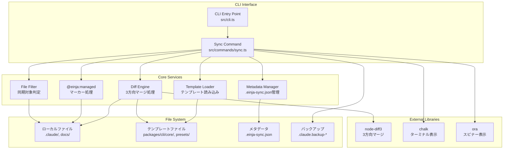
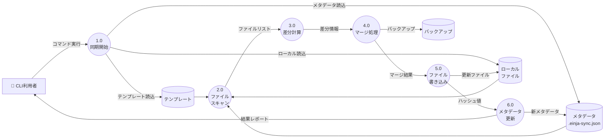
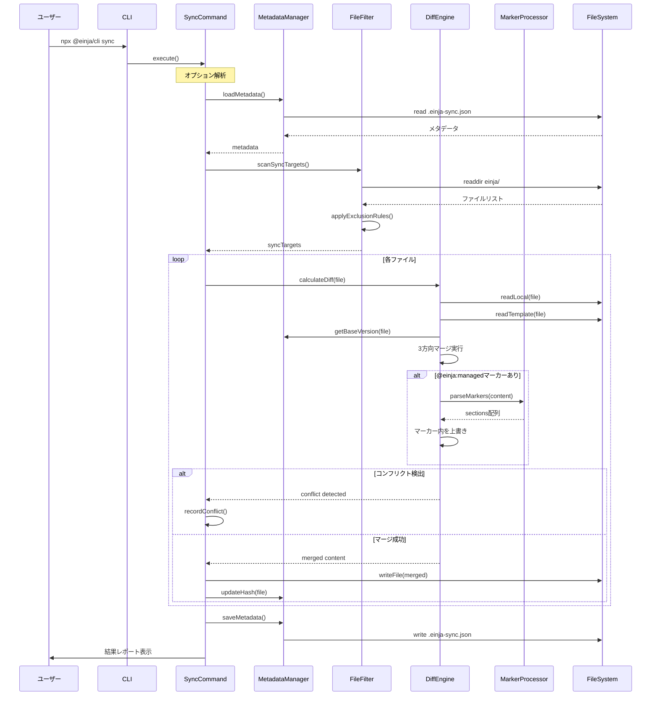
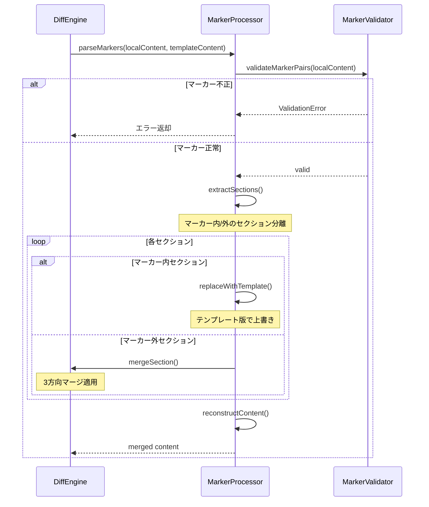
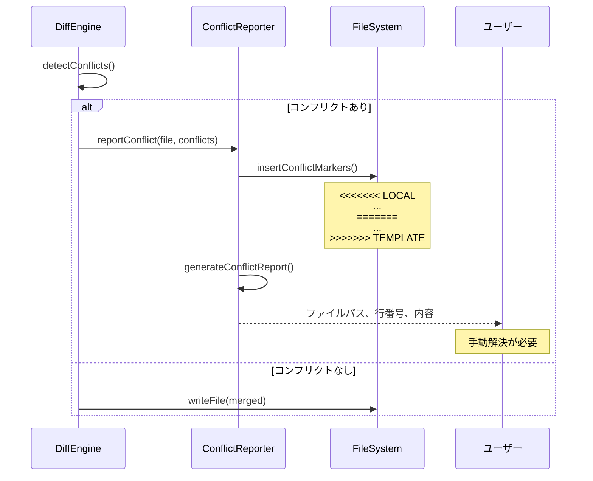

# アーキテクチャ

## 概要

@einja/cliパッケージに`sync`コマンドを追加し、既存プロジェクトに対してテンプレート更新を安全にマージする機能を実装します。3方向マージアルゴリズムにより、ローカルのカスタマイズを保持しつつテンプレートの最新変更を取り込むことで、手動マージ作業を80%削減し、テンプレート改善の継続的反映を実現します。

本設計書では、requirements.mdで定義された9つのユーザーストーリー（基本同期、ディレクトリ分離、@einja:managedマーカー、選択的同期、ドライラン、強制上書き、コンフリクト検出、JSON出力、パッケージ名変更）を実現するための技術的実装を詳細に定義します。

### 主要な技術的課題と解決方針

1. **3方向マージの複雑性**
   - 課題: ベース版・ローカル版・テンプレート版の3つを比較してマージする処理が複雑
   - 解決策: `node-diff3`ライブラリの活用、マージアルゴリズムの段階的実装
   - 対策: 十分な単体テストケース、エッジケースの事前洗い出し

2. **メタデータ管理の信頼性**
   - 課題: `.einja-sync.json`の破損や不整合が同期処理全体に影響
   - 解決策: スキーマバリデーション（Zod）、マイグレーション機能の実装
   - 対策: バックアップ機能、復元コマンドの提供

3. **@einja:managedマーカーのパース精度**
   - 課題: 不正なマーカーペアや入れ子構造への対処
   - 解決策: 厳格なパースルール、エラー検出とユーザーへの明確なフィードバック
   - 対策: マーカー構文の自動検証、修正支援メッセージ

4. **パフォーマンス要件の達成**
   - 課題: 100ファイルの同期を3秒以内に完了する必要
   - 解決策: 並列処理（Promise.all）、ファイルハッシュキャッシュ
   - 対策: パフォーマンステスト、ボトルネック分析

## システム構成図

## データフロー図（DFD）

### データフロー説明

1. **同期開始フロー**
   - ユーザーがsyncコマンドを実行
   - オプション解析（--dry-run, --only, --force, --json）
   - テンプレートファイル、ローカルファイル、メタデータの読み込み

2. **ファイルスキャンフロー**
   - 同期対象ディレクトリのスキャン（`.claude/commands/einja/`, etc.）
   - ファイル除外ルールの適用（`_`プレフィックス、.gitignore）
   - カテゴリフィルタリング（--onlyオプション適用）

3. **差分計算フロー**
   - ファイルごとに3つのバージョンを取得
     - ベース版: メタデータのハッシュから復元
     - ローカル版: 現在のプロジェクトファイル
     - テンプレート版: 最新のテンプレートファイル
   - @einja:managedマーカーの検出とセクション分離

4. **マージ処理フロー**
   - マーカー内セクション: テンプレート版で完全上書き
   - マーカー外セクション: 3方向マージアルゴリズム適用
   - コンフリクト検出: マーカー挿入またはエラー報告
   - --forceオプション: マージスキップ、テンプレート版で上書き

5. **ファイル書き込みフロー**
   - ドライランモード: ファイル書き込みスキップ、差分表示のみ
   - 通常モード: マージ結果をファイルに書き込み
   - バックアップ作成（変更前の状態を保存）

6. **メタデータ更新フロー**
   - 各ファイルのハッシュ値計算
   - `.einja-sync.json`の更新（バージョン、最終同期日時、ファイルハッシュ）
   - 結果レポートの生成（成功/失敗ファイル数、コンフリクト情報）

## 技術スタック

| カテゴリ | 技術 | バージョン | 用途 |
|---------|------|-----------|------|
| **ランタイム** | Node.js | >= 20.0.0 | JavaScript実行環境 |
| **言語** | TypeScript | ^5 | 型安全な開発 |
| **CLIフレームワーク** | commander | ^13.1.0 | コマンドライン引数パース |
| **ターミナルUI** | chalk | ^5.4.1 | カラー出力 |
| **ターミナルUI** | ora | ^8.2.0 | スピナー表示 |
| **ファイル操作** | fs-extra | ^11.3.0 | 拡張ファイルシステム操作 |
| **差分・マージ** | node-diff3 | ^3.1.2 | 3方向マージアルゴリズム |
| **パターンマッチング** | minimatch | ^10.0.1 | ファイルパスマッチング |
| **バリデーション** | zod | ^3.x | スキーマ検証 |
| **ハッシュ** | crypto (Node.js標準) | - | ファイルハッシュ計算 |
| **Linter & Formatter** | Biome | 1.9.4 | コード品質 |
| **テスト** | Vitest | ^2.1.9 | ユニット・統合テスト |

## シーケンス図

### 基本的な同期処理フロー

### @einja:managedマーカー処理フロー

### コンフリクト検出と報告フロー

